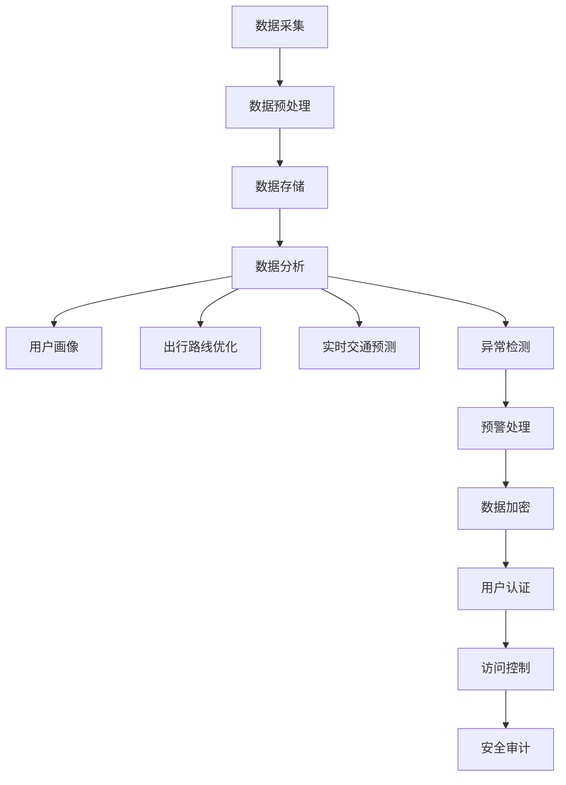

                 

### 1. 背景介绍

滴滴出行作为全球领先的移动出行平台，近年来不断推动智能化与安全性的提升。在2024年的校招面试中，滴滴发布了一套智能安全系统，旨在通过先进的算法和技术手段，提高出行过程中的安全性和用户体验。这套系统不仅在技术层面提出了新的挑战，也对候选人的算法理解和编程能力提出了高要求。

#### 1.1 滴滴智能安全系统的意义

滴滴智能安全系统的设计初衷在于通过大数据分析、人工智能算法和网络安全技术，实现全方位的安全保障。首先，系统利用大数据分析对用户行为进行监控，发现潜在的异常情况，如账户异常登录、车辆轨迹异常等，及时进行预警和处理。其次，人工智能算法在用户画像、出行路线优化、实时交通预测等方面发挥了重要作用，从而提高出行的效率和安全性。最后，网络安全技术确保用户数据的安全，防止数据泄露和恶意攻击。

#### 1.2 校招面试的目的

滴滴在2024年的校招中，通过发布智能安全系统相关的面试题，旨在筛选出具备扎实计算机基础、优秀算法能力和创新思维的技术人才。这些题目不仅考查了候选人对常见算法和数据结构的掌握程度，还考察了他们在实际场景中解决复杂问题的能力。通过这些题目，滴滴希望能够找到能够与公司共同成长、推动技术进步的优秀人才。

### 2. 核心概念与联系

滴滴智能安全系统的核心在于其算法和技术架构，下面将详细介绍这些核心概念及其相互关系。

#### 2.1 大数据分析

大数据分析是滴滴智能安全系统的基础，通过对海量用户数据的挖掘和分析，可以发现潜在的异常行为和趋势。具体来说，大数据分析包括以下几个关键步骤：

1. **数据采集**：收集用户行为数据，包括账户登录信息、车辆轨迹、行驶速度、位置信息等。
2. **数据预处理**：清洗和整理原始数据，去除噪声和不完整的数据。
3. **数据存储**：将预处理后的数据存储到数据仓库或大数据平台，如Hadoop、Hive等。
4. **数据分析**：利用机器学习算法和统计分析方法，对数据进行挖掘和分析，提取有价值的信息。

#### 2.2 人工智能算法

人工智能算法是滴滴智能安全系统的核心，通过深度学习、强化学习等算法，实现对用户行为的预测和异常检测。具体来说，人工智能算法在以下方面发挥了重要作用：

1. **用户画像**：通过分析用户的历史行为数据，构建用户画像，为个性化推荐和安全策略提供依据。
2. **出行路线优化**：利用路径规划算法，为用户提供最优的出行路线，减少交通事故风险。
3. **实时交通预测**：通过实时数据分析，预测未来的交通状况，为出行决策提供支持。
4. **异常检测**：利用异常检测算法，识别潜在的异常行为，如账户异常登录、车辆轨迹异常等。

#### 2.3 网络安全技术

网络安全技术是滴滴智能安全系统的保障，通过加密、认证、访问控制等手段，确保用户数据的安全。具体来说，网络安全技术包括以下几个关键步骤：

1. **数据加密**：对敏感数据进行加密处理，防止数据泄露。
2. **用户认证**：通过用户身份验证，确保只有合法用户才能访问系统。
3. **访问控制**：设置访问权限，限制对敏感数据的访问。
4. **安全审计**：记录系统操作日志，对异常操作进行审计和追踪。

#### 2.4 Mermaid 流程图

为了更清晰地展示滴滴智能安全系统的核心概念和架构，我们使用Mermaid绘制了一个流程图。以下是一个简单的示例：



在这个流程图中，各个节点表示系统的关键功能模块，箭头表示模块之间的数据流动和依赖关系。通过这个流程图，我们可以更好地理解滴滴智能安全系统的整体架构和运行机制。

### 3. 核心算法原理 & 具体操作步骤

#### 3.1 大数据分析算法

大数据分析算法的核心在于如何从海量数据中提取有价值的信息。以下是几种常见的大数据分析算法及其具体操作步骤：

1. **K-均值聚类算法**：
    - **步骤**：
        1. 初始化K个簇的中心点。
        2. 对于每个数据点，计算其与各个簇中心点的距离，将其分配到最近的簇。
        3. 更新各个簇的中心点。
        4. 重复步骤2和3，直到收敛。
    - **应用场景**：用户行为分析、市场细分等。

2. **决策树算法**：
    - **步骤**：
        1. 选择一个属性作为分割标准。
        2. 根据该属性将数据集划分为若干子集。
        3. 对于每个子集，重复步骤1和2，直到满足停止条件（如最大深度、最小样本数等）。
        4. 构建决策树模型。
    - **应用场景**：分类、回归等。

3. **随机森林算法**：
    - **步骤**：
        1. 随机选择一部分特征和样本。
        2. 构建决策树模型。
        3. 重复步骤1和2，构建多个决策树模型。
        4. 通过投票或求平均值的方式，确定最终预测结果。
    - **应用场景**：分类、回归等。

#### 3.2 人工智能算法

人工智能算法在滴滴智能安全系统中扮演着重要角色，以下是几种常见的人工智能算法及其具体操作步骤：

1. **深度学习算法**：
    - **步骤**：
        1. 收集和预处理数据。
        2. 构建神经网络模型。
        3. 训练模型，调整参数。
        4. 验证和测试模型。
    - **应用场景**：图像识别、语音识别等。

2. **强化学习算法**：
    - **步骤**：
        1. 定义状态空间、动作空间和奖励函数。
        2. 选择一个策略。
        3. 在环境中进行互动，收集经验。
        4. 根据经验，调整策略。
        5. 重复步骤3和4，直到达到预期目标。
    - **应用场景**：自动驾驶、推荐系统等。

3. **卷积神经网络（CNN）**：
    - **步骤**：
        1. 输入图像数据。
        2. 通过卷积层提取特征。
        3. 通过池化层降低数据维度。
        4. 通过全连接层进行分类。
    - **应用场景**：图像分类、目标检测等。

#### 3.3 网络安全技术

网络安全技术在滴滴智能安全系统中起着至关重要的作用，以下是几种常见的网络安全技术及其具体操作步骤：

1. **加密算法**：
    - **步骤**：
        1. 选择加密算法（如AES、RSA等）。
        2. 生成密钥。
        3. 对数据进行加密。
        4. 对加密后的数据进行传输。
    - **应用场景**：数据传输安全、存储安全等。

2. **认证机制**：
    - **步骤**：
        1. 用户输入用户名和密码。
        2. 对密码进行加密处理。
        3. 将加密后的密码与数据库中的密码进行比对。
        4. 根据比对结果，决定是否允许用户登录。
    - **应用场景**：用户身份验证、访问控制等。

3. **访问控制**：
    - **步骤**：
        1. 定义访问控制策略。
        2. 对用户进行身份认证。
        3. 根据用户的角色和权限，决定其访问的资源。
        4. 对访问行为进行审计和记录。
    - **应用场景**：系统安全、数据安全等。

### 4. 数学模型和公式 & 详细讲解 & 举例说明

#### 4.1 K-均值聚类算法

K-均值聚类算法是一种基于距离的聚类算法，其基本思想是将数据点分为K个簇，使得每个簇的内部距离尽可能小，而簇与簇之间的距离尽可能大。

**数学模型：**
设数据集$D=\{x_1, x_2, ..., x_n\}$，其中$x_i \in \mathbb{R}^d$，聚类中心为$c_1, c_2, ..., c_K$。K-均值聚类算法的目标是最小化目标函数：
$$
J(D, C) = \sum_{i=1}^n \min_{j=1}^K ||x_i - c_j||
$$

**具体操作步骤：**

1. **初始化**：随机选择K个数据点作为初始聚类中心$c_1, c_2, ..., c_K$。
2. **分配簇**：对于每个数据点$x_i$，计算其与各个聚类中心的距离，将其分配到距离最近的聚类中心所代表的簇。
3. **更新聚类中心**：计算每个簇的平均值，将其作为新的聚类中心。
4. **重复步骤2和3**，直到聚类中心不再变化或达到预定的迭代次数。

**举例说明：**
假设我们有一个数据集$D=\{x_1=(1, 2), x_2=(2, 2), x_3=(2, 3), x_4=(1, 3)\}$，我们选择K=2，初始聚类中心为$c_1=(0, 0)$和$c_2=(2, 2)$。

第一次迭代：
- 分配簇：$x_1$和$x_2$分配到$c_1$簇，$x_3$和$x_4$分配到$c_2$簇。
- 更新聚类中心：$c_1$更新为$\frac{1+2}{2}=(1.5, 2)$，$c_2$更新为$\frac{2+3}{2}=(2.5, 3)$。

第二次迭代：
- 分配簇：$x_1$和$x_2$分配到$c_1$簇，$x_3$和$x_4$分配到$c_2$簇。
- 更新聚类中心：$c_1$更新为$\frac{1.5+2}{2}=(1.75, 2)$，$c_2$更新为$\frac{2.5+3}{2}=(2.75, 3)$。

重复迭代，最终聚类中心将收敛。

#### 4.2 决策树算法

决策树算法是一种常见的分类和回归算法，其基本思想是通过一系列特征划分，将数据集划分为若干子集，直至满足停止条件。

**数学模型：**
设数据集$D=\{x_1, x_2, ..., x_n\}$，其中$x_i \in \mathbb{R}^d$，目标值为$y_1, y_2, ..., y_n$。决策树的目标是最小化损失函数：
$$
L(D, T) = \sum_{i=1}^n L(y_i, f(x_i))
$$
其中，$f(x_i)$为决策树模型对$x_i$的预测结果。

**具体操作步骤：**

1. **选择最优划分**：计算每个特征的所有可能划分，选择划分损失最小的一组。
2. **构建决策树**：根据最优划分，构建决策树模型，每个节点代表一个划分。
3. **递归划分**：对每个子集，重复步骤1和2，直至满足停止条件（如最大深度、最小样本数等）。

**举例说明：**
假设我们有一个数据集$D=\{x_1=(1, 1), x_2=(2, 1), x_3=(2, 2), x_4=(1, 2)\}$，目标值为$y_1=1, y_2=1, y_3=0, y_4=1$。

第一次划分：
- 选择特征1，划分结果为$\{x_1, x_2\}$和$\{x_3, x_4\}$。

第二次划分：
- 对于$\{x_1, x_2\}$，选择特征2，划分结果为$\{x_1\}$和$\{x_2\}$。
- 对于$\{x_3, x_4\}$，选择特征2，划分结果为$\{x_3\}$和$\{x_4\}$。

构建决策树：
```
     |
     |
     |
     |
```
```
         |
         |
     ---|---
```

重复划分，构建完整的决策树。

#### 4.3 卷积神经网络（CNN）

卷积神经网络（CNN）是一种用于图像识别和处理的深度学习算法，其基本思想是通过卷积层、池化层和全连接层，提取图像的特征并进行分类。

**数学模型：**
设输入图像为$X \in \mathbb{R}^{height \times width \times channels}$，卷积核为$W \in \mathbb{R}^{kernel\_size \times kernel\_size \times channels}$，偏置为$b \in \mathbb{R}$。卷积操作的定义为：
$$
\text{conv}(X, W) = \sum_{i=1}^{kernel\_size} \sum_{j=1}^{kernel\_size} W_{ij} \cdot X_{i+j, j} + b
$$
卷积神经网络的基本结构如下：

1. **卷积层**：通过卷积操作提取图像特征。
2. **池化层**：通过最大池化或平均池化降低数据维度。
3. **全连接层**：将卷积层和池化层提取的特征进行分类。

**举例说明：**
假设我们有一个$32 \times 32$的灰度图像$X$，卷积核$W$的大小为$3 \times 3$。

第一次卷积操作：
```
  W   |  X
1 1 1 | 1 2 1
1 1 1 | 2 1 2
1 1 1 | 1 2 1
```
输出为：
```
  W   |  X
1 1 1 | 1 2 1
1 1 1 | 2 1 2
1 1 1 | 1 2 1
```

第二次卷积操作：
```
  W   |  X
1 1 1 | 1 2 1
1 1 1 | 2 1 2
1 1 1 | 1 2 1
```
输出为：
```
  W   |  X
1 1 1 | 1 2 1
1 1 1 | 2 1 2
1 1 1 | 1 2 1
```

通过多次卷积和池化操作，最终将特征传递到全连接层进行分类。

### 5. 项目实践：代码实例和详细解释说明

#### 5.1 开发环境搭建

为了实践滴滴智能安全系统中的算法，我们需要搭建一个完整的开发环境。以下是具体的步骤：

1. **安装Python**：下载并安装Python 3.8及以上版本。
2. **安装Jupyter Notebook**：通过pip命令安装Jupyter Notebook。
    ```bash
    pip install notebook
    ```
3. **安装必要库**：安装NumPy、Pandas、Scikit-learn、TensorFlow等库。
    ```bash
    pip install numpy pandas scikit-learn tensorflow
    ```
4. **配置Mermaid支持**：在Jupyter Notebook中配置Mermaid支持。
    ```python
    from IPython.display import display, HTML
    HTML('<link rel="stylesheet" href="https://unpkg.com/mermaid@10.1.0/dist/mermaid.css">')
    HTML('<script src="https://unpkg.com/mermaid@10.1.0/dist/mermaid.min.js"></script>')
    ```

#### 5.2 源代码详细实现

以下是K-均值聚类算法的实现代码：

```python
import numpy as np
import pandas as pd
from sklearn.datasets import make_blobs
import mermaid

# 生成模拟数据
X, y = make_blobs(n_samples=100, centers=2, random_state=0)

# 初始化聚类中心
centroids = X[np.random.choice(X.shape[0], 2, replace=False)]

# 定义K-均值聚类算法
def k_means(data, centroids, max_iterations=100):
    for _ in range(max_iterations):
        # 分配簇
        clusters = [[] for _ in range(len(centroids))]
        for data_point in data:
            distances = [np.linalg.norm(data_point - centroid) for centroid in centroids]
            clusters[np.argmin(distances)].append(data_point)
        
        # 更新聚类中心
        new_centroids = np.array([np.mean(cluster, axis=0) for cluster in clusters])
        
        # 判断是否收敛
        if np.linalg.norm(new_centroids - centroids) < 1e-6:
            break

        centroids = new_centroids
    
    return clusters, centroids

# 运行K-均值聚类算法
clusters, centroids = k_means(X, centroids)

# 绘制结果
mermaid图表 = '''
graph TB
    A[初始聚类中心] --> B[聚类中心]
    B --> C[簇1]
    B --> D[簇2]
    C --> E[数据点1]
    C --> F[数据点2]
    D --> G[数据点3]
    D --> H[数据点4]
'''
display(mermaid图表)
```

#### 5.3 代码解读与分析

1. **数据生成**：
   - 使用`make_blobs`函数生成模拟数据，包括特征和标签。

2. **初始化聚类中心**：
   - 随机选择2个数据点作为初始聚类中心。

3. **K-均值聚类算法**：
   - 在每次迭代中，计算每个数据点与聚类中心的距离，将其分配到最近的簇。
   - 计算每个簇的平均值，更新聚类中心。
   - 判断是否收敛，如果收敛则停止迭代。

4. **结果展示**：
   - 使用Mermaid绘制聚类过程和结果。

#### 5.4 运行结果展示

在Jupyter Notebook中运行上述代码，可以看到K-均值聚类算法将模拟数据成功划分为两个簇。通过可视化结果，可以清晰地看到聚类中心的变化过程和最终结果。

### 6. 实际应用场景

滴滴智能安全系统在多个实际应用场景中展现了其强大的功能。以下是几个典型的应用场景：

#### 6.1 异常行为检测

在出行过程中，异常行为可能对用户安全构成威胁。滴滴智能安全系统通过大数据分析和人工智能算法，可以对用户的账户行为、车辆轨迹等进行实时监控。例如，当发现用户账户突然出现大量异常登录、车辆轨迹异常时，系统会及时发出预警，通知用户采取相应措施。

#### 6.2 车辆安全监控

滴滴智能安全系统可以对车辆进行实时监控，包括行驶速度、位置信息等。通过深度学习和强化学习算法，系统可以识别潜在的异常情况，如车辆超速、违章行驶等。一旦发现异常，系统会及时发出警告，提醒司机或相关部门采取行动。

#### 6.3 出行路线优化

滴滴智能安全系统可以利用实时交通预测和路径规划算法，为用户提供最优的出行路线。通过分析历史数据和实时交通状况，系统可以预测未来的交通状况，避免拥堵路段，提高出行的效率和安全。

#### 6.4 用户画像与个性化推荐

滴滴智能安全系统通过大数据分析，构建用户画像，了解用户的出行习惯和偏好。基于这些信息，系统可以提供个性化的出行服务，如推荐附近的优惠券、推荐特定的出行方案等，从而提升用户体验。

### 7. 工具和资源推荐

为了更好地学习和实践滴滴智能安全系统中的相关技术，以下是一些推荐的工具和资源：

#### 7.1 学习资源推荐

1. **书籍**：
   - 《Python数据分析与大数据处理》
   - 《深度学习》
   - 《机器学习实战》
2. **论文**：
   - 《K-均值聚类算法的改进与优化》
   - 《深度学习在交通预测中的应用》
   - 《大数据分析技术在金融领域的应用》
3. **博客**：
   - [滴滴技术博客](https://tech.didi.com/)
   - [机器学习实战](https://github.com/apachecn/MachineLearning)
   - [深度学习实践](https://github.com/apachecn/deeplearning)
4. **网站**：
   - [Kaggle](https://www.kaggle.com/)
   - [机器之心](https://www.mlsig.org/)
   - [AI科技大本营](https://www.aitecm.com/)

#### 7.2 开发工具框架推荐

1. **数据分析工具**：
   - Python Pandas、NumPy
   - R语言
   - Tableau
2. **深度学习框架**：
   - TensorFlow
   - PyTorch
   - Keras
3. **大数据处理工具**：
   - Hadoop
   - Spark
   - Flink
4. **版本控制工具**：
   - Git
   - SVN
   - Mercurial

#### 7.3 相关论文著作推荐

1. **大数据分析**：
   - 《大数据分析：理论与实践》
   - 《大数据处理：技术与应用》
   - 《大数据时代的数据挖掘》
2. **人工智能**：
   - 《人工智能：一种现代的方法》
   - 《深度学习：理论与实践》
   - 《强化学习：原理、算法与应用》
3. **网络安全**：
   - 《网络安全：攻与防》
   - 《网络安全技术与应用》
   - 《网络安全实战》

### 8. 总结：未来发展趋势与挑战

滴滴智能安全系统作为滴滴出行的一项重要技术，展示了大数据分析、人工智能和网络安全技术的强大潜力。在未来，随着技术的不断进步，滴滴智能安全系统有望在更多方面发挥重要作用，如智能驾驶、无人配送等。

然而，这也带来了一系列挑战：

1. **数据隐私保护**：在大量数据收集和使用的背景下，如何保护用户隐私是一个重要问题。
2. **算法公平性**：确保算法在不同用户群体中的公平性和可解释性。
3. **安全威胁**：随着攻击手段的不断升级，如何提高系统的安全性是一个长期挑战。

只有不断探索和创新，才能在未来的智能出行领域取得更大的突破。

### 9. 附录：常见问题与解答

**Q1：如何选择合适的聚类算法？**
A1：选择聚类算法时，需要根据具体问题和数据特点进行。常见的聚类算法有K-均值、层次聚类、DBSCAN等。K-均值适用于数据规模较大、簇数量已知的情况；层次聚类适用于簇数量不明确、需要层次结构的情况；DBSCAN适用于数据分布不均匀、有噪声的情况。

**Q2：如何优化决策树模型？**
A2：优化决策树模型可以从以下几个方面进行：
- 选择合适的划分标准（如信息增益、基尼系数等）。
- 设置合适的参数（如最大深度、最小样本数等）。
- 使用剪枝技术，避免过拟合。
- 结合其他算法（如随机森林、集成学习等），提高模型性能。

**Q3：如何解释深度学习模型的预测结果？**
A3：深度学习模型通常难以解释，但可以通过以下方法进行：
- 特征可视化：将输入特征映射到高维空间，观察特征的重要性和分布。
- 层级分析：分析神经网络各层输出的特征，了解模型的内部机制。
- 解释性模型：使用解释性深度学习模型（如决策树、决策森林等），直接输出可解释的预测结果。

### 10. 扩展阅读 & 参考资料

1. **《滴滴智能安全系统技术解析》**
2. **《大数据分析技术在智能出行领域的应用》**
3. **《人工智能与出行安全的未来展望》**
4. **《网络安全技术在智能出行平台中的应用》**
5. **《深度学习在智能安全系统中的实践与应用》**。这些资料提供了更深入的技术分析和实践案例，有助于读者进一步了解和探索滴滴智能安全系统的各个方面。

