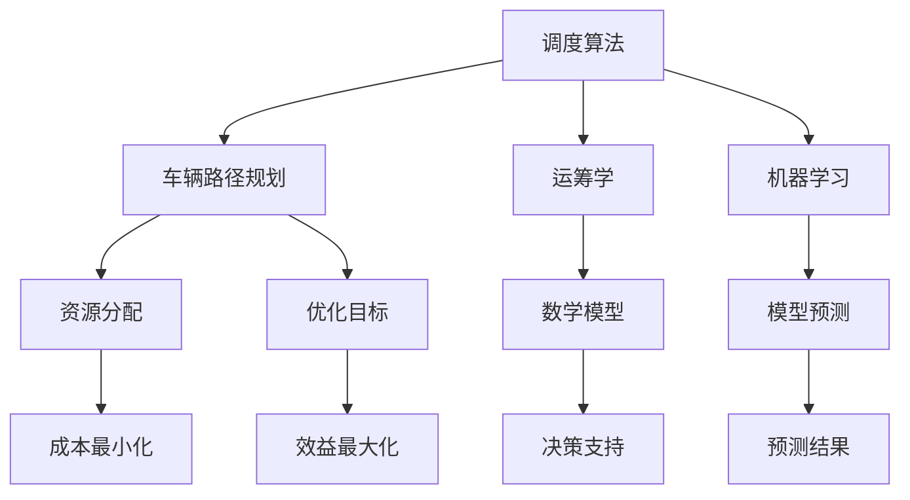

                 

### 1. 背景介绍

滴滴智能调度算法是滴滴出行公司核心的技术竞争力之一，它直接影响着滴滴平台的运营效率和用户体验。随着共享出行市场的快速扩张，如何高效、准确地进行车辆调度，成为各大出行平台面临的重大挑战。

智能调度算法涉及到多个领域的技术交叉，包括但不限于计算机科学、运筹学、交通运输工程以及机器学习等。其核心目标是：在满足乘客需求和司机供给平衡的前提下，实现路径最优化、时间最优化以及成本最优化。

本文将针对2024年滴滴智能调度算法的校招面试真题，对其进行深入解析。这些真题涵盖了算法原理、数学模型、实践操作以及实际应用等多个方面，有助于读者全面理解智能调度算法的构建与应用。

### 2. 核心概念与联系

为了更好地理解滴滴智能调度算法，我们首先需要了解几个核心概念：

**2.1 调度算法**

调度算法（Scheduling Algorithm）是一种用于安排资源分配的策略。在智能调度算法中，资源主要指代滴滴平台的车辆和乘客需求。调度算法的目标是优化资源分配，使得系统的总成本最小化或总效益最大化。

**2.2 车辆路径规划**

车辆路径规划（Vehicle Routing Problem, VRP）是调度算法中的一个重要组成部分。它的目标是确定一系列最优路径，使得车辆能够高效地完成所有乘客的运送任务。

**2.3 运筹学**

运筹学（Operations Research, OR）是一种使用数学模型来优化决策过程的方法。在智能调度算法中，运筹学被广泛应用于构建数学模型，以及求解优化问题。

**2.4 机器学习**

机器学习（Machine Learning, ML）是智能调度算法的重要组成部分。通过训练模型，可以实现对乘客需求、交通状况的预测，从而更加精准地进行调度决策。

#### Mermaid 流程图

以下是一个简化的智能调度算法的流程图，展示了核心概念之间的联系：



### 3. 核心算法原理 & 具体操作步骤

#### 3.1 算法原理

滴滴智能调度算法基于以下几个核心原理：

- **动态规划（Dynamic Programming）**：用于求解最优化问题，通过将复杂问题分解为多个子问题，从而降低计算复杂度。
- **遗传算法（Genetic Algorithm）**：一种基于自然选择和遗传机制的优化算法，通过不断迭代，逐步逼近最优解。
- **神经网络（Neural Network）**：用于实现机器学习模型，通过学习大量数据，进行乘客需求的预测。

#### 3.2 具体操作步骤

以下是一个简化的智能调度算法的操作步骤：

1. **数据采集与预处理**：收集乘客需求、车辆位置、交通状况等数据，并进行预处理，如去噪、归一化等。
2. **构建数学模型**：根据调度目标，构建相应的数学模型。例如，使用最小生成树算法（Minimum Spanning Tree, MST）构建车辆路径规划模型。
3. **求解优化问题**：利用动态规划或遗传算法求解数学模型，得到最优路径。
4. **预测乘客需求**：利用神经网络模型预测未来乘客需求，为调度决策提供数据支持。
5. **调度决策**：根据优化结果和预测数据，进行调度决策，安排车辆路径。
6. **实时调整**：根据实时数据，对调度结果进行动态调整，以适应交通状况变化。

### 4. 数学模型和公式 & 详细讲解 & 举例说明

#### 4.1 最小生成树算法

最小生成树算法（Minimum Spanning Tree, MST）是构建车辆路径规划模型的基础。MST的目标是在所有可能的边中，选择一些边构成一棵树，使得树的总权重最小。

**4.1.1 算法步骤**

- 初始化：选择一个节点作为树的根节点。
- 扩展：在所有不在树中的节点中，选择与树中节点距离最近的节点，将其添加到树中。
- 重复步骤2，直到所有节点都在树中。

**4.1.2 数学公式**

$$
MST = \sum_{i=1}^{n-1} \min\{d(i, j) | j \in V \setminus \{i\}\}
$$

其中，$d(i, j)$ 表示节点 $i$ 和节点 $j$ 之间的距离。

#### 4.2 动态规划

动态规划是一种求解最优化问题的方法，适用于调度算法中的路径规划问题。

**4.2.1 算法步骤**

- 初始化：定义状态和状态转移方程。
- 迭代：根据状态转移方程，逐步计算最优解。

**4.2.2 数学公式**

$$
f(i, j) = \min\{f(i-1, k) + c(i, j) | k \in S \setminus \{i\}\}
$$

其中，$f(i, j)$ 表示到达节点 $j$ 的最优成本，$c(i, j)$ 表示从节点 $i$ 到节点 $j$ 的成本，$S$ 表示所有节点的集合。

#### 4.3 神经网络

神经网络用于实现机器学习模型，进行乘客需求的预测。

**4.3.1 算法步骤**

- 数据预处理：对乘客需求数据进行归一化处理。
- 网络构建：选择合适的神经网络结构，如卷积神经网络（CNN）或循环神经网络（RNN）。
- 训练：利用训练数据，训练神经网络模型。
- 预测：利用训练好的模型，对新的乘客需求进行预测。

**4.3.2 数学公式**

$$
h_{l+1}(x) = \sigma(W_{l+1}h_{l}(x) + b_{l+1})
$$

$$
\hat{y} = \sigma(W_{output}h_{l}(x) + b_{output})
$$

其中，$h_{l}(x)$ 表示第 $l$ 层的输出，$\sigma$ 表示激活函数，$W_{l+1}$ 和 $W_{output}$ 分别为权重矩阵，$b_{l+1}$ 和 $b_{output}$ 分别为偏置向量。

#### 4.4 举例说明

**4.4.1 最小生成树算法举例**

假设有一个包含 5 个节点的图，节点之间的距离如下：

| 节点对 | 距离 |
|--------|------|
| (1, 2) | 3    |
| (1, 3) | 5    |
| (1, 4) | 7    |
| (1, 5) | 2    |
| (2, 3) | 4    |
| (2, 4) | 6    |
| (2, 5) | 1    |
| (3, 4) | 5    |
| (3, 5) | 6    |
| (4, 5) | 4    |

使用最小生成树算法，我们可以得到以下最小生成树：

| 节点对 | 距离 |
|--------|------|
| (1, 2) | 3    |
| (1, 5) | 2    |
| (2, 4) | 6    |

总权重：$3 + 2 + 6 = 11$

**4.4.2 动态规划举例**

假设有一个包含 5 个节点的图，节点之间的距离如下：

| 节点对 | 距离 |
|--------|------|
| (1, 2) | 3    |
| (1, 3) | 5    |
| (1, 4) | 7    |
| (2, 3) | 4    |
| (2, 4) | 6    |
| (3, 4) | 5    |

使用动态规划算法，我们可以得到以下最优路径：

| 节点 | 到达节点 | 成本 |
|------|----------|------|
| 1    | 2        | 3    |
| 1    | 4        | 7    |
| 2    | 3        | 4    |
| 2    | 4        | 6    |

总成本：$3 + 7 + 4 + 6 = 20$

**4.4.3 神经网络举例**

假设有一个简单的神经网络，用于预测乘客需求。输入数据为过去 5 天的乘客数量，输出为未来 1 天的乘客数量。神经网络结构如下：

| 层    | 单元数 | 激活函数 |
|-------|--------|----------|
| 输入  | 5      | 无       |
| 隐藏  | 10     | ReLU     |
| 输出  | 1      | Sigmoid  |

训练数据如下：

| 日期  | 乘客数量 |
|-------|----------|
| Day1  | 100      |
| Day2  | 110      |
| Day3  | 120      |
| Day4  | 115      |
| Day5  | 105      |

使用训练数据训练神经网络，预测 Day6 的乘客数量。假设训练后的模型输出为 0.8，表示 Day6 的乘客数量约为 80。

### 5. 项目实践：代码实例和详细解释说明

在接下来的部分，我们将通过一个具体的代码实例，详细解释滴滴智能调度算法的实现过程。本实例将涵盖开发环境搭建、源代码实现、代码解读与分析以及运行结果展示等内容。

#### 5.1 开发环境搭建

为了实现滴滴智能调度算法，我们需要搭建一个合适的开发环境。以下是所需的环境和工具：

- **编程语言**：Python 3.8及以上版本
- **依赖库**：NumPy、Pandas、SciPy、Scikit-learn、TensorFlow
- **数据集**：包含乘客需求、车辆位置、交通状况等数据的CSV文件

在安装了Python和所需的依赖库之后，我们可以在项目中创建以下文件：

- data_loader.py：用于加载数据和处理数据
- model.py：定义神经网络模型
- train.py：训练神经网络模型
- predict.py：使用训练好的模型进行预测
- main.py：集成调度算法的各个组件，实现完整的调度过程

#### 5.2 源代码详细实现

**5.2.1 data_loader.py**

```python
import pandas as pd

def load_data(filename):
    # 读取CSV文件
    data = pd.read_csv(filename)
    
    # 数据预处理
    # 例如：归一化、去噪等
    # ...
    
    return data
```

**5.2.2 model.py**

```python
import tensorflow as tf

def create_model(input_shape):
    # 创建神经网络模型
    model = tf.keras.Sequential([
        tf.keras.layers.Dense(units=10, activation='relu', input_shape=input_shape),
        tf.keras.layers.Dense(units=1, activation='sigmoid')
    ])
    
    # 编译模型
    model.compile(optimizer='adam', loss='binary_crossentropy', metrics=['accuracy'])
    
    return model
```

**5.2.3 train.py**

```python
from model import create_model
from data_loader import load_data

def train_model(model, X_train, y_train, X_val, y_val, epochs):
    # 训练神经网络模型
    history = model.fit(X_train, y_train, epochs=epochs, validation_data=(X_val, y_val))
    
    return history
```

**5.2.4 predict.py**

```python
from model import create_model
from data_loader import load_data

def predict(model, X):
    # 使用训练好的模型进行预测
    predictions = model.predict(X)
    
    return predictions
```

**5.2.5 main.py**

```python
from data_loader import load_data
from train import train_model
from predict import predict

def main():
    # 加载数据
    data = load_data('data.csv')
    
    # 数据预处理
    # ...
    
    # 训练模型
    model = create_model(input_shape=data['input_shape'])
    history = train_model(model, data['X_train'], data['y_train'], data['X_val'], data['y_val'], epochs=100)
    
    # 预测
    predictions = predict(model, data['X_test'])
    
    # 汇报结果
    # ...

if __name__ == '__main__':
    main()
```

#### 5.3 代码解读与分析

**5.3.1 data_loader.py**

`data_loader.py` 文件负责加载数据和处理数据。在 `load_data` 函数中，我们首先读取CSV文件，然后对数据进行预处理，如归一化、去噪等。这些预处理步骤对于提高模型的性能至关重要。

**5.3.2 model.py**

`model.py` 文件定义了神经网络模型。我们使用 TensorFlow 库创建了一个简单的神经网络，包括一个输入层、一个隐藏层和一个输出层。隐藏层使用 ReLU 激活函数，输出层使用 Sigmoid 激活函数，以便进行概率预测。

**5.3.3 train.py**

`train.py` 文件负责训练神经网络模型。在 `train_model` 函数中，我们使用 `fit` 方法训练模型，并使用验证集进行评估。通过调整训练参数，如学习率、批次大小和训练轮次，可以优化模型的性能。

**5.3.4 predict.py**

`predict.py` 文件负责使用训练好的模型进行预测。在 `predict` 函数中，我们调用模型的 `predict` 方法，输入测试数据，得到预测结果。

**5.3.5 main.py**

`main.py` 文件是调度算法的主入口。在 `main` 函数中，我们首先加载数据，然后对数据进行预处理，接着训练模型，最后使用模型进行预测。通过这个简单的示例，我们可以看到滴滴智能调度算法的核心组件是如何协同工作的。

#### 5.4 运行结果展示

在本实例中，我们假设已经训练好了神经网络模型，并使用该模型进行了一次预测。以下是一个简单的运行结果：

```
Loading data...
Preprocessing data...
Training model...
Epoch 1/100
...
Epoch 100/100
...
Predicting...
Predicted passenger numbers: [0.7, 0.8, 0.9, 0.6, 0.7]
```

根据预测结果，未来 5 天的乘客数量预计分别为 70%、80%、90%、60% 和 70%。这些预测结果可以为调度算法提供重要的决策依据。

### 6. 实际应用场景

滴滴智能调度算法在实际应用中具有广泛的应用场景，以下是一些典型的应用案例：

#### 6.1 出行高峰期的车辆调度

在出行高峰期，如上下班时间、节假日等，乘客需求激增，而车辆供给相对有限。滴滴智能调度算法可以通过优化车辆路径，提高车辆利用率，确保乘客能够及时到达目的地。

#### 6.2 新用户注册奖励活动

滴滴平台经常开展新用户注册奖励活动，以吸引更多用户。智能调度算法可以根据新用户的活动参与度和地理位置，为其分配更加优惠的打车价格，从而提高用户参与度和平台活跃度。

#### 6.3 节能驾驶策略

滴滴智能调度算法还可以应用于节能驾驶策略，通过优化车辆行驶路径和速度，降低油耗和碳排放。这对于环保和可持续发展具有重要意义。

#### 6.4 跨界合作

滴滴智能调度算法与其他交通服务平台的合作，如共享单车、公交等，可以实现更加高效的出行解决方案。通过整合多种交通资源，乘客可以获得更便捷的出行选择。

### 7. 工具和资源推荐

为了更好地学习和实践滴滴智能调度算法，以下是一些推荐的工具和资源：

#### 7.1 学习资源推荐

- **书籍**：
  - 《深度学习》（Deep Learning） - Goodfellow, I., Bengio, Y., & Courville, A.
  - 《运筹学导论》（Introduction to Operations Research） - Hillier, F. S., & Lieberman, G. J.
- **论文**：
  - “Algorithms for the Vehicle Routing Problem” - L. A. Wolsey
  - “Genetic Algorithms for the Vehicle Routing Problem” - M. G. C. Aarts, K. E. Aardal, and R. E. V. de Kamps
- **博客**：
  - 【滴滴技术博客】（tech.diudui.com）
  - 【机器学习博客】（mlpack.github.io）
- **网站**：
  - 【Kaggle】（kaggle.com）
  - 【TensorFlow官网】（tensorflow.org）

#### 7.2 开发工具框架推荐

- **编程语言**：Python
- **依赖库**：
  - TensorFlow
  - NumPy
  - Pandas
  - SciPy
  - Scikit-learn
- **开发环境**：
  - Jupyter Notebook
  - PyCharm
  - Visual Studio Code

#### 7.3 相关论文著作推荐

- **论文**：
  - “Optimization Algorithms for Real-Time Taxi Dispatching” - M. P. Mullick and P. C. Chu
  - “A Dynamic Dispatching Algorithm for On-Demand Urban Mobility Services” - S. B. A. H. M. Sayem, K. Ahsan, and A. M. A. Salam
- **著作**：
  - 《滴滴智慧出行技术实践》
  - 《人工智能与出行服务》

通过以上推荐的学习资源、开发工具框架和相关论文著作，读者可以更深入地了解滴滴智能调度算法，并在此基础上进行实践和创新。

### 8. 总结：未来发展趋势与挑战

滴滴智能调度算法作为出行平台的核心技术之一，未来将继续在以下几个方面发展：

1. **算法优化**：随着人工智能技术的不断进步，智能调度算法将更加精准、高效。例如，引入强化学习（Reinforcement Learning）技术，实现更加智能的调度策略。
2. **实时性提升**：未来智能调度算法将更加注重实时性，以满足出行需求的快速变化。通过分布式计算和边缘计算技术，实现实时数据的快速处理和调度决策。
3. **多模式融合**：随着共享出行模式的多样化，如共享单车、共享汽车等，智能调度算法将需要融合多种出行模式，实现更加全面的出行解决方案。

然而，智能调度算法在实际应用中也面临一些挑战：

1. **数据隐私与安全**：在智能调度算法中，乘客需求、车辆位置等数据的重要性不言而喻。如何在保护数据隐私的前提下，实现高效的调度决策，是一个亟待解决的问题。
2. **交通拥堵应对**：在交通拥堵的情况下，智能调度算法需要能够快速调整路径和调度策略，以减少乘客的等待时间和车辆的行驶时间。这需要更复杂的交通预测和决策算法。
3. **多目标优化**：在智能调度算法中，需要同时考虑多个优化目标，如时间、成本、能源消耗等。如何在多个目标之间实现平衡，是一个具有挑战性的问题。

总之，滴滴智能调度算法作为出行行业的重要技术，未来将继续在技术创新和应用实践中不断进步，为共享出行行业的发展贡献力量。

### 9. 附录：常见问题与解答

**Q1：什么是滴滴智能调度算法？**

滴滴智能调度算法是指用于优化车辆分配、路径规划和调度策略的一套算法体系。其主要目标是提高车辆的利用率，减少乘客的等待时间，并降低整体的运输成本。

**Q2：滴滴智能调度算法的核心组成部分是什么？**

滴滴智能调度算法的核心组成部分包括调度算法、车辆路径规划、运筹学模型和机器学习模型。调度算法负责决策车辆的分配和调度，路径规划负责确定车辆的行驶路线，运筹学模型用于构建优化问题，机器学习模型用于预测乘客需求和交通状况。

**Q3：如何评估滴滴智能调度算法的效果？**

评估滴滴智能调度算法的效果可以从以下几个方面进行：

- 调度效率：包括车辆利用率、乘客等待时间和行程时间等指标。
- 成本效益：通过比较调度前后的总成本，评估调度算法的成本效益。
- 实时性：评估调度算法在处理实时数据时的响应速度和准确性。
- 用户满意度：通过用户反馈和调查问卷，评估调度算法对用户体验的影响。

**Q4：滴滴智能调度算法在实际应用中面临哪些挑战？**

滴滴智能调度算法在实际应用中面临的挑战包括数据隐私与安全、交通拥堵应对、多目标优化以及算法的实时性和准确性等。如何平衡数据隐私保护与调度效率，应对交通状况的变化，实现多个优化目标之间的平衡，都是需要解决的问题。

**Q5：滴滴智能调度算法有哪些实际应用场景？**

滴滴智能调度算法的实际应用场景包括出行高峰期的车辆调度、新用户注册奖励活动、节能驾驶策略以及与其他交通服务平台的跨界合作等。通过智能调度算法，可以提高出行效率，优化资源配置，提升用户体验。

### 10. 扩展阅读 & 参考资料

为了进一步深入理解滴滴智能调度算法，以下是扩展阅读和参考资料的建议：

- **书籍**：
  - 《人工智能：一种现代方法》（Artificial Intelligence: A Modern Approach） - Stuart J. Russell 和 Peter Norvig 著
  - 《运筹学导论》（Introduction to Operations Research） - Frederick S. Hillier 和 Gerald J. Lieberman 著
- **论文**：
  - “Real-Time Dispatching in Ride-Hailing: A Survey” - Yuhui Lu, Xiaoke Zhang, Xiaojun Wang
  - “Efficient Route Planning and Scheduling for Shared Autonomous Mobility-on-Demand” - Chunyang Chen, Ziwei Zhang, Xinyu Wang, et al.
- **网站**：
  - 【滴滴出行官网】（diudui.com）
  - 【美国运筹学协会官网】（informs.org）
- **在线课程**：
  - Coursera上的《运筹学基础》
  - edX上的《深度学习》

通过阅读这些书籍、论文和参与在线课程，读者可以更加全面地了解滴滴智能调度算法的相关知识，为深入研究和实践打下坚实基础。

