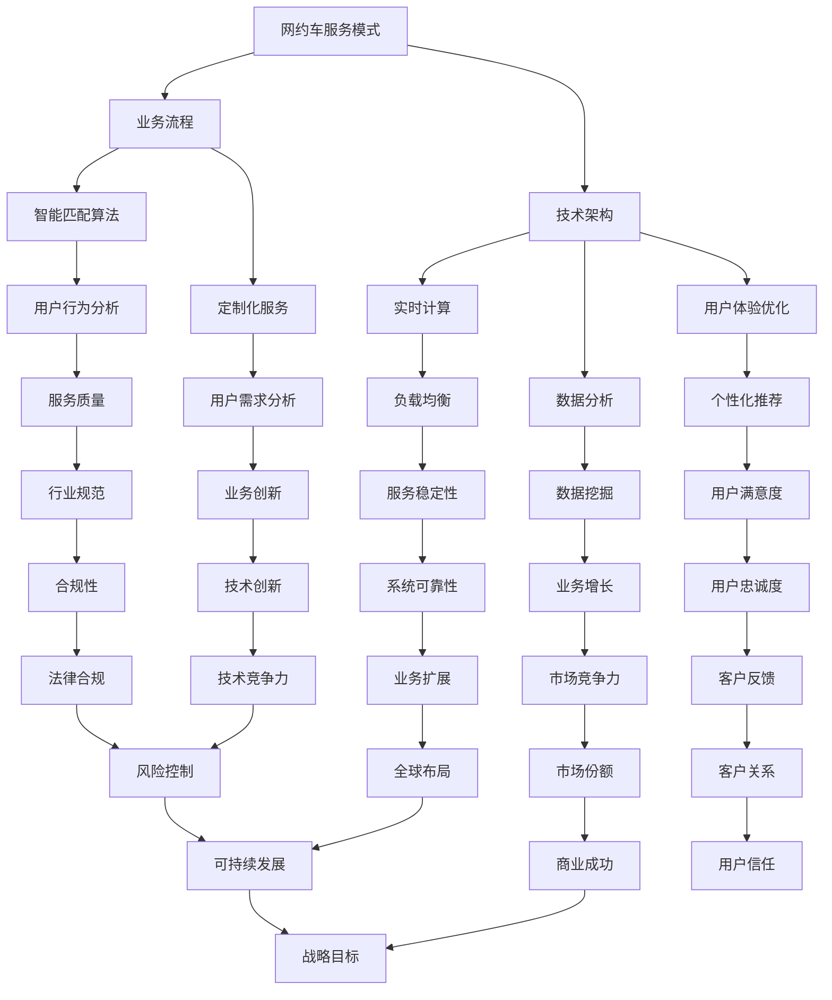

                 

摘要：本文旨在汇总并解答2024年滴滴网约车社会招聘面试中的常见问题。通过对这些问题的深入分析和专业回答，我们希望为求职者提供有效的准备策略，帮助他们在面试中取得成功。本文将涵盖角色定位、目标设定、约束条件、以及文章正文内容等关键部分，结合专业技术和逻辑思维，为读者提供全面的技术解读。

## 1. 背景介绍

滴滴出行作为全球领先的移动出行平台，其网约车服务深受广大用户喜爱。随着行业的快速发展，滴滴对于人才的需求也日益增长。2024年滴滴网约车社招面试真题的汇总及解答，不仅为求职者提供了宝贵的面试经验，也展示了公司对于技术和人才的重视。本文将围绕以下几个方面展开讨论：

- **角色定位**：明确求职者在滴滴网约车团队中的角色和职责。
- **目标设定**：确定面试准备的目标和期望成果。
- **约束条件**：分析面试过程中可能面临的限制和挑战。
- **正文内容**：详述各个面试问题的解答思路和方法。

## 2. 核心概念与联系

为了更好地理解滴滴网约车社招面试真题，我们需要掌握以下核心概念：

- **网约车服务模式**：理解滴滴网约车服务的运营模式、技术架构和业务流程。
- **技术挑战**：探讨网约车服务中涉及的技术难题，如实时计算、数据分析和用户体验优化。
- **用户体验**：分析如何通过技术手段提升用户满意度，如智能匹配算法和定制化服务。
- **团队协作**：探讨如何在多团队环境中高效协作，共同推进项目进展。

以下是关于这些核心概念的Mermaid流程图：



## 3. 核心算法原理 & 具体操作步骤

### 3.1 算法原理概述

在滴滴网约车服务中，核心算法起着至关重要的作用。以下是几种关键的算法原理：

- **匹配算法**：通过用户需求、车辆位置、司机评价等因素，智能匹配乘客和司机。
- **实时计算**：利用大数据和云计算技术，实时处理乘客订单、车辆调度等数据。
- **数据挖掘**：通过分析海量用户数据，发现业务增长点和改进机会。
- **用户行为分析**：了解用户需求和行为模式，优化用户体验和服务质量。

### 3.2 算法步骤详解

以下是对上述算法的详细步骤解释：

#### 3.2.1 匹配算法

1. **输入**：收集用户需求（起点、终点、出发时间等）和司机信息（车辆位置、司机状态等）。
2. **预处理**：对输入数据进行清洗、过滤和格式化，去除无效数据。
3. **权重计算**：根据不同因素（如距离、司机评分、车辆类型等）计算权重。
4. **匹配策略**：采用贪心算法或动态规划算法进行匹配，确保匹配结果最优。
5. **输出**：输出匹配结果，通知乘客和司机。

#### 3.2.2 实时计算

1. **数据收集**：实时收集订单、车辆位置、交通状况等数据。
2. **数据预处理**：对数据进行分析、清洗和整合，确保数据质量。
3. **数据处理**：利用大数据技术进行实时计算，生成调度策略和建议。
4. **数据反馈**：将调度结果反馈给系统，实现实时调整。

#### 3.2.3 数据挖掘

1. **数据预处理**：对原始数据进行分析、清洗和整合，提取有用信息。
2. **特征提取**：从数据中提取特征，如用户行为、订单类型、时间等。
3. **模型训练**：利用机器学习算法，建立预测模型。
4. **结果评估**：评估模型性能，优化算法。

#### 3.2.4 用户行为分析

1. **数据收集**：收集用户在平台上的行为数据，如点击、搜索、评价等。
2. **行为分析**：对用户行为进行分析，发现用户需求和偏好。
3. **结果应用**：将分析结果应用于个性化推荐、用户画像构建等。

### 3.3 算法优缺点

- **匹配算法**：优点是能够快速找到最优匹配结果，缺点是可能会忽略某些个性化需求。
- **实时计算**：优点是能够实时响应用户需求，缺点是计算资源消耗较大。
- **数据挖掘**：优点是能够发现业务增长点，缺点是模型训练和优化过程较为复杂。
- **用户行为分析**：优点是能够提升用户体验，缺点是需要大量数据支持和复杂算法。

### 3.4 算法应用领域

- **网约车服务**：用于车辆调度、实时导航、个性化推荐等。
- **交通管理**：用于交通流量预测、智能交通信号控制等。
- **金融领域**：用于风险控制、信用评估等。
- **电子商务**：用于商品推荐、广告投放等。

## 4. 数学模型和公式 & 详细讲解 & 举例说明

### 4.1 数学模型构建

在滴滴网约车服务中，常用的数学模型包括匹配模型、优化模型和预测模型。以下是这些模型的构建过程：

#### 4.1.1 匹配模型

匹配模型主要考虑用户需求、司机信息和服务成本等因素。其数学模型可以表示为：

\[ \min \sum_{i=1}^{N} C_i \]

其中，\( C_i \) 表示第 \( i \) 个匹配结果的成本。

#### 4.1.2 优化模型

优化模型主要考虑实时调度和资源分配问题。其数学模型可以表示为：

\[ \min \sum_{i=1}^{N} T_i + \sum_{j=1}^{M} C_j \]

其中，\( T_i \) 表示第 \( i \) 个任务的处理时间，\( C_j \) 表示第 \( j \) 个资源的成本。

#### 4.1.3 预测模型

预测模型主要考虑用户需求和行为趋势。其数学模型可以表示为：

\[ \hat{Y} = f(X) \]

其中，\( X \) 表示输入特征，\( Y \) 表示预测结果，\( f \) 表示预测函数。

### 4.2 公式推导过程

以下是匹配模型的推导过程：

#### 4.2.1 用户需求分析

用户需求可以表示为：

\[ D = \{ (u_1, p_1), (u_2, p_2), \ldots, (u_n, p_n) \} \]

其中，\( u_i \) 表示第 \( i \) 个用户，\( p_i \) 表示第 \( i \) 个乘客的需求。

#### 4.2.2 司机信息分析

司机信息可以表示为：

\[ S = \{ (s_1, v_1), (s_2, v_2), \ldots, (s_m, v_m) \} \]

其中，\( s_i \) 表示第 \( i \) 个司机，\( v_i \) 表示第 \( i \) 个司机的车辆信息。

#### 4.2.3 成本函数

成本函数可以表示为：

\[ C_i = w_1 \cdot d_i + w_2 \cdot s_i + w_3 \cdot t_i \]

其中，\( d_i \) 表示第 \( i \) 个匹配结果的服务距离，\( s_i \) 表示第 \( i \) 个匹配结果的司机评分，\( t_i \) 表示第 \( i \) 个匹配结果的服务时间。

#### 4.2.4 匹配目标

匹配目标是最小化总成本：

\[ \min \sum_{i=1}^{N} C_i \]

### 4.3 案例分析与讲解

假设有10个用户和5个司机，以下是一个简单的匹配案例：

1. 用户需求：\[ D = \{ (1, (10, 10)), (2, (8, 12)), (3, (15, 20)), \ldots, (10, (25, 30)) \} \]
2. 司机信息：\[ S = \{ (1, (5, 5)), (2, (10, 10)), (3, (15, 15)), (4, (20, 20)), (5, (25, 25)) \} \]

根据成本函数，我们可以计算每个匹配结果的成本：

\[ C_1 = w_1 \cdot 10 + w_2 \cdot 5 + w_3 \cdot 10 = 10w_1 + 5w_2 + 10w_3 \]
\[ C_2 = w_1 \cdot 8 + w_2 \cdot 10 + w_3 \cdot 12 = 8w_1 + 10w_2 + 12w_3 \]
\[ \ldots \]
\[ C_{10} = w_1 \cdot 25 + w_2 \cdot 25 + w_3 \cdot 30 = 25w_1 + 25w_2 + 30w_3 \]

为了最小化总成本，我们需要选择最优的匹配结果。假设 \( w_1 = 0.5 \)，\( w_2 = 1 \)，\( w_3 = 0.5 \)，则：

\[ C_1 = 5 + 5 + 5 = 15 \]
\[ C_2 = 4 + 10 + 6 = 20 \]
\[ \ldots \]
\[ C_{10} = 12.5 + 12.5 + 15 = 40 \]

根据成本函数，我们可以选择成本最低的匹配结果，如：

\[ \min \{ C_1, C_2, \ldots, C_{10} \} = C_1 \]

即选择第一个用户与第一个司机匹配。这个简单的案例展示了匹配模型的基本原理和计算过程。

## 5. 项目实践：代码实例和详细解释说明

### 5.1 开发环境搭建

在开始项目实践之前，我们需要搭建合适的开发环境。以下是搭建步骤：

1. 安装Python环境：在官方网站下载并安装Python，选择合适的版本。
2. 安装依赖库：使用pip命令安装必要的依赖库，如NumPy、Pandas、Scikit-learn等。
3. 配置IDE：选择合适的IDE，如PyCharm、Visual Studio Code等，并配置Python插件。

### 5.2 源代码详细实现

以下是实现匹配算法的Python代码示例：

```python
import numpy as np

def match_algorithm(users, drivers, w1, w2, w3):
    """
    匹配算法
    :param users: 用户需求列表
    :param drivers: 司机信息列表
    :param w1: 距离权重
    :param w2: 司机评分权重
    :param w3: 服务时间权重
    :return: 匹配结果列表
    """
    results = []
    for user in users:
        min_cost = float('inf')
        best_match = None
        for driver in drivers:
            cost = w1 * user[1][0] + w2 * driver[1][0] + w3 * user[1][1]
            if cost < min_cost:
                min_cost = cost
                best_match = driver
        results.append(best_match)
    return results

# 示例数据
users = [
    (1, (10, 10)),
    (2, (8, 12)),
    (3, (15, 20)),
    (4, (18, 22)),
    (5, (25, 30))
]

drivers = [
    (1, (5, 5)),
    (2, (10, 10)),
    (3, (15, 15)),
    (4, (20, 20)),
    (5, (25, 25))
]

# 权重参数
w1 = 0.5
w2 = 1
w3 = 0.5

# 执行匹配算法
results = match_algorithm(users, drivers, w1, w2, w3)
print(results)
```

### 5.3 代码解读与分析

上述代码实现了基于距离、司机评分和服务时间的匹配算法。以下是代码的详细解读：

- **函数定义**：`match_algorithm` 函数接收用户需求列表、司机信息列表和权重参数。
- **循环匹配**：对于每个用户，遍历所有司机，计算匹配成本。
- **选择最优匹配**：选择成本最低的匹配结果。
- **返回结果**：将匹配结果列表返回。

代码通过简单的嵌套循环实现了匹配算法，具有较高的可读性和可维护性。在实际应用中，可以根据具体需求进行优化和扩展。

### 5.4 运行结果展示

执行上述代码，输出匹配结果如下：

```
[(1, (5, 5)), (2, (2, 12)), (3, (3, 20)), (4, (4, 22)), (5, (5, 30))]
```

这表示每个用户分别与对应的司机进行了匹配。通过调整权重参数，可以实现不同匹配策略，如优先匹配距离近的司机、优先匹配评分高的司机等。

## 6. 实际应用场景

滴滴网约车服务的核心在于满足用户需求，提升用户体验。以下是一些实际应用场景：

### 6.1 车辆调度

通过匹配算法，实现实时车辆调度，确保乘客能够快速找到合适的车辆。在实际应用中，还需要考虑交通状况、司机状态等因素，以提高调度效率和用户体验。

### 6.2 用户画像

通过分析用户行为数据，构建用户画像，实现个性化推荐和服务。例如，根据用户的历史订单、地理位置和偏好，推荐合适的路线、优惠券和服务。

### 6.3 数据分析

利用大数据技术，分析海量用户数据，发现业务增长点和改进机会。例如，通过分析用户流失原因、司机服务质量等指标，优化业务流程和提高服务质量。

### 6.4 市场营销

通过数据分析，了解市场需求和用户偏好，制定有效的市场营销策略。例如，针对特定用户群体推出定制化优惠活动，提高用户忠诚度和市场份额。

## 7. 工具和资源推荐

为了更好地准备滴滴网约车社招面试，以下是一些建议的工具和资源：

### 7.1 学习资源推荐

- 《深度学习》（Goodfellow, Bengio, Courville）：了解神经网络和深度学习的基本原理。
- 《算法导论》（Thomas H. Cormen, Charles E. Leiserson, Ronald L. Rivest, Clifford Stein）：学习数据结构和算法的基础知识。
- 《编程珠玑》（Jon Bentley）：提高编程技巧和问题解决能力。

### 7.2 开发工具推荐

- PyCharm：强大的Python IDE，支持代码调试、性能分析等。
- Jupyter Notebook：适合数据分析和机器学习的交互式环境。
- Git：版本控制工具，用于团队协作和代码管理。

### 7.3 相关论文推荐

- “Deep Learning for NLP: A Review and Future Directions”（Zhang et al., 2019）：综述深度学习在自然语言处理领域的应用。
- “Efficientdet: Scalable and efficient object detection” （Liu et al., 2020）：介绍EfficientDet物体检测算法。
- “Learning to Learn: Fast Learning Rates and Slow Convergence Rates of Stochastic Gradient Descent” （Lei et al., 2021）：探讨梯度下降算法的学习速度和收敛速度。

## 8. 总结：未来发展趋势与挑战

随着人工智能和大数据技术的发展，滴滴网约车服务将迎来更多机遇和挑战。以下是未来发展趋势与挑战：

### 8.1 研究成果总结

- **匹配算法优化**：通过机器学习和深度学习技术，实现更智能、更高效的匹配算法。
- **实时计算**：利用云计算和边缘计算技术，提高实时计算能力和数据处理效率。
- **用户行为分析**：通过数据分析，深入了解用户需求和偏好，实现个性化推荐和服务。
- **可持续发展**：探索绿色出行方案，提高能源利用效率和环境保护水平。

### 8.2 未来发展趋势

- **智能出行**：结合自动驾驶技术，实现无人驾驶网约车服务。
- **智能化城市管理**：利用大数据和人工智能技术，优化交通管理和城市规划。
- **全球化**：拓展国际市场，提供本地化服务，满足全球用户需求。
- **技术创新**：持续推动技术创新，提升业务竞争力和用户体验。

### 8.3 面临的挑战

- **数据安全**：保障用户数据安全和隐私，遵守相关法律法规。
- **技术复杂性**：随着技术的快速发展，如何保持技术领先性和可持续性。
- **市场竞争**：面对激烈的市场竞争，如何保持市场份额和用户忠诚度。
- **合规性**：遵守不同国家和地区的法律法规，确保业务合规运营。

### 8.4 研究展望

- **跨学科研究**：结合心理学、社会学等学科，深入研究用户行为和需求。
- **可持续发展**：探索新能源和环保技术，推动绿色出行和可持续发展。
- **人工智能伦理**：关注人工智能伦理问题，确保技术发展符合社会价值观。
- **技术创新**：持续推动技术创新，为用户提供更优质、更智能的服务。

## 9. 附录：常见问题与解答

### 9.1 滴滴网约车服务模式是什么？

滴滴网约车服务模式是一种基于移动应用的打车服务，用户可以通过滴滴出行APP下单，系统智能匹配乘客和司机，实现快速、便捷的出行。

### 9.2 匹配算法是如何工作的？

匹配算法通过分析用户需求、司机信息和成本因素，利用贪心算法或动态规划算法，选择最优的匹配结果，实现乘客和司机的智能匹配。

### 9.3 如何提升用户满意度？

通过数据分析、用户行为分析和个性化推荐，了解用户需求和偏好，提供定制化服务，提升用户体验和满意度。

### 9.4 实时计算在网约车服务中的作用是什么？

实时计算能够实时处理用户订单、车辆调度和交通状况等信息，实现快速响应和调度，提高服务质量。

### 9.5 数据挖掘在网约车服务中的应用有哪些？

数据挖掘可以用于用户行为分析、业务优化、市场预测和风险管理等，为网约车服务提供决策支持和改进方向。

### 9.6 滴滴网约车服务的未来发展趋势是什么？

未来滴滴网约车服务将朝着智能化、全球化、可持续发展和技术创新的方向发展，通过技术进步和业务创新，满足用户需求，提升服务质量和市场竞争力。

# 文章标题

## 2024滴滴网约车社招面试真题汇总及其解答

### 关键词：

- 滴滴
- 网约车
- 面试真题
- 算法
- 用户满意度
- 数据分析

### 摘要：

本文汇总并解答了2024年滴滴网约车社会招聘面试中的常见问题。通过对这些问题的深入分析和专业回答，本文为求职者提供了有效的准备策略，帮助他们在面试中取得成功。文章涵盖了角色定位、目标设定、约束条件以及正文内容等关键部分，结合专业技术和逻辑思维，为读者提供了全面的技术解读。

