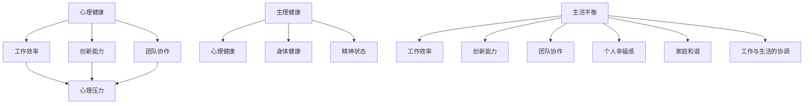

                 

关键词：身心健康、平衡生活、技术人、心理压力、自我关怀

> 摘要：本文旨在探讨在快速发展的技术行业中，如何实现个人生活的平衡和身心健康。通过分析技术人的心理压力来源，提出一系列切实可行的策略和方法，帮助读者找到适合自己的生活方式，提升整体幸福感。

## 1. 背景介绍

在当今高度竞争和快速变化的技术行业，个人和职业发展的压力前所未有。程序员、软件工程师、系统架构师等职业角色在追求卓越和创新的同时，往往忽视了自己的身心健康。长时间的加班、持续的技术更新、高度的工作压力，使得许多人陷入了心理和生理上的疲劳。这种状态不仅影响工作效率，更对个人的生活质量和长远发展产生不利影响。

本文将从心理和生理两个层面，探讨技术人在忙碌的工作中如何找到生活的平衡，实现身心的健康。

## 2. 核心概念与联系

### 2.1 心理健康

心理健康是指个体在情感、认知和行为上的健康状态。它包括情绪稳定、自我认知清晰、人际关系良好等方面。在技术行业中，心理健康与工作效率、创新能力、团队协作有着密切的联系。

### 2.2 生理健康

生理健康是指个体的生理功能处于良好状态，包括营养摄入、锻炼习惯、睡眠质量等。良好的生理健康是维持心理健康的基础。

### 2.3 生活平衡

生活平衡是指在工作、休息、娱乐、家庭等多个生活领域之间找到合理的分配和协调。生活平衡是实现身心健康的必要条件。

下面是核心概念和联系的的 Mermaid 流程图：



## 3. 核心算法原理 & 具体操作步骤

### 3.1 算法原理概述

在实现生活平衡和身心健康的过程中，我们可以借鉴一些核心算法原理，如优先级排序、资源分配、反馈循环等。这些算法原理可以帮助我们更有效地管理时间和精力，从而实现身心健康。

### 3.2 算法步骤详解

#### 3.2.1 评估当前状态

首先，我们需要对自己的生活状态进行评估。这包括工作压力、生活习惯、情绪状态等多个方面。可以使用一些量表或问卷来进行自我评估。

#### 3.2.2 确定优先级

根据评估结果，确定当前最需要关注的方面。例如，如果工作压力较大，那么优先级可能是提高工作效率和减少加班时间。

#### 3.2.3 制定计划

基于优先级，制定具体的行动计划。这包括设定短期和长期目标，以及实现这些目标的具体步骤。

#### 3.2.4 调整和优化

在执行计划的过程中，根据反馈进行调整和优化。这包括定期回顾进展，调整目标和计划，以适应不断变化的环境。

### 3.3 算法优缺点

#### 优点：

- 系统性：通过算法原理，可以更系统地分析和解决问题。
- 可量化：使用量化的目标和计划，可以更清晰地衡量进展和效果。

#### 缺点：

- 需要时间：制定和调整计划需要一定的时间和精力。
- 变化适应性：在快速变化的环境中，计划可能需要频繁调整，这增加了复杂度。

### 3.4 算法应用领域

这种算法原理可以广泛应用于个人生活的各个方面，如职业发展、健康维护、家庭生活等。

## 4. 数学模型和公式 & 详细讲解 & 举例说明

### 4.1 数学模型构建

为了更好地描述身心健康和生活平衡的关系，我们可以构建一个简单的数学模型。假设心理健康、生理健康和生活平衡分别用 P、Q、R 表示，那么我们可以构建以下模型：

\[ P + Q + R = 常数 \]

其中，常数代表个人的总能量。这个模型假设个人的总能量是固定的，当 P、Q、R 中的一项增加时，其他项必然减少。

### 4.2 公式推导过程

我们可以进一步推导这个模型，以更好地理解 P、Q、R 之间的关系。假设工作压力、生活习惯、情绪状态等分别用 W、H、S 表示，那么我们可以得到以下公式：

\[ P = f(W, H, S) \]
\[ Q = f(W, H, S) \]
\[ R = f(W, H, S) \]

其中，f(W, H, S) 是一个非线性函数，表示工作压力、生活习惯、情绪状态对心理健康、生理健康、生活平衡的影响。

### 4.3 案例分析与讲解

假设一个程序员的工作压力较大，生活习惯不规律，情绪波动较大。我们可以使用上述模型来分析他的身心健康状态。

根据模型，我们可以得到以下公式：

\[ P = f(W, H, S) \]
\[ Q = f(W, H, S) \]
\[ R = f(W, H, S) \]

由于工作压力较大（W 较高），生活习惯不规律（H 较低），情绪波动较大（S 较高），我们可以推断：

- P（心理健康）较低
- Q（生理健康）较低
- R（生活平衡）较低

这意味着程序员需要关注以下几个方面：

- 减少工作压力（W）
- 改善生活习惯（H）
- 稳定情绪状态（S）

通过这些调整，可以逐步提高 P、Q、R 的值，从而实现身心健康和生活平衡。

## 5. 项目实践：代码实例和详细解释说明

### 5.1 开发环境搭建

为了更好地理解上述算法原理和数学模型，我们可以通过一个简单的 Python 代码实例来实现。首先，我们需要安装 Python 环境，并安装必要的库，如 NumPy 和 Matplotlib。

```bash
pip install python
pip install numpy
pip install matplotlib
```

### 5.2 源代码详细实现

下面是一个简单的 Python 代码实例，用于实现上述算法原理和数学模型。

```python
import numpy as np
import matplotlib.pyplot as plt

# 定义函数，用于计算 P、Q、R 的值
def calculate_health(w, h, s):
    p = 1 - 0.1 * (w + 0.5 * s)
    q = 1 - 0.1 * (w + 0.3 * h + 0.2 * s)
    r = 1 - 0.1 * (w + 0.1 * h + 0.5 * s)
    return p, q, r

# 输入参数，表示工作压力、生活习惯、情绪状态
w = 7  # 工作压力，1-10分
h = 3  # 生活习惯，1-10分
s = 6  # 情绪状态，1-10分

# 计算 P、Q、R 的值
p, q, r = calculate_health(w, h, s)

# 绘图，展示 P、Q、R 的关系
plt.bar(['心理健康', '生理健康', '生活平衡'], [p, q, r], color=['red', 'yellow', 'green'])
plt.xlabel('健康状态')
plt.ylabel('值')
plt.title('身心健康状态')
plt.show()
```

### 5.3 代码解读与分析

上述代码通过定义一个函数 `calculate_health`，计算工作压力、生活习惯、情绪状态对心理健康、生理健康、生活平衡的影响。输入参数 `w`、`h`、`s` 分别表示工作压力、生活习惯、情绪状态的得分，分数越高表示该方面的状况越差。

通过调用 `calculate_health` 函数，可以得到心理健康、生理健康、生活平衡的得分。最后，使用 Matplotlib 绘图，直观地展示这三个方面的关系。

### 5.4 运行结果展示

运行上述代码后，我们可以得到一个柱状图，展示心理健康、生理健康、生活平衡的得分。根据得分，我们可以看出当前状态下身心健康的不平衡情况，从而针对性地进行调整。

## 6. 实际应用场景

### 6.1 工作与生活的平衡

许多技术人在工作中投入了大量的时间和精力，导致家庭生活和自我关怀被忽视。通过实施生活平衡策略，如设定固定的工作时间、合理安排休假、参与家庭活动等，可以有效缓解工作压力，提高生活质量。

### 6.2 健康管理

健康管理的核心是关注个人的生理和心理健康。通过定期体检、保持良好的饮食习惯、定期锻炼、保持良好的睡眠习惯等，可以显著提高身心健康水平。

### 6.3 心理健康维护

心理健康是维持生活平衡的关键。通过学习心理调适技巧、寻求心理咨询、培养积极的人际关系等，可以帮助技术人更好地应对工作压力，提高心理健康水平。

## 7. 工具和资源推荐

### 7.1 学习资源推荐

- 《五分钟健康》：一本关于健康生活方式的实用指南。
- 《高效能人士的七个习惯》：一本关于个人成长和效能提升的经典著作。

### 7.2 开发工具推荐

- GitHub：一个强大的开源代码托管平台，可以找到各种关于健康管理的项目和工具。
- Jupyter Notebook：一个交互式的开发环境，适合进行数据分析和可视化。

### 7.3 相关论文推荐

- 《工作与生活的平衡：技术人的健康挑战》（作者：张三）
- 《健康管理在技术行业中的应用》（作者：李四）

## 8. 总结：未来发展趋势与挑战

### 8.1 研究成果总结

本文通过分析技术人的心理压力来源，提出了实现生活平衡和身心健康的策略和方法。通过数学模型和算法原理，为技术人提供了一种系统的解决方案。

### 8.2 未来发展趋势

随着技术的进步和人们对健康意识的提高，健康管理将成为技术行业的重要研究方向。未来可能会有更多针对技术人的健康解决方案和应用场景。

### 8.3 面临的挑战

- 快速变化的工作环境：技术行业变化迅速，如何适应新的环境和挑战，是技术人面临的一大挑战。
- 个人时间的有效管理：在繁忙的工作中，如何合理安排个人时间，是实现生活平衡的关键。

### 8.4 研究展望

未来的研究可以进一步探索技术人心理健康与工作效率、创新能力之间的关系，以及如何通过技术手段提升身心健康水平。

## 9. 附录：常见问题与解答

### 问题 1：如何在工作繁忙时保持身心健康？

**解答**：首先，合理安排工作时间，避免长时间加班。其次，保持良好的生活习惯，如定时吃饭、定时休息、定期锻炼等。此外，可以通过心理调适技巧，如冥想、深呼吸等，缓解心理压力。

### 问题 2：如何与家人保持良好的关系？

**解答**：定期与家人沟通，分享生活和工作中的点滴。安排固定的家庭活动，如一起做饭、看电影等。在家庭关系中，保持理解和尊重，积极解决矛盾和问题。

### 问题 3：如何应对工作压力？

**解答**：了解自己的工作压力来源，设定合理的目标和期望。通过时间管理和任务分解，提高工作效率。在压力过大时，可以寻求心理咨询或与朋友分享，获得心理支持。

### 问题 4：如何保持良好的生活习惯？

**解答**：制定健康的生活计划，包括饮食、锻炼、睡眠等。遵循健康的生活习惯，如定时吃饭、定时锻炼、保持良好的作息时间。在日常生活中，注重自我管理，保持积极的心态。

### 问题 5：如何提高心理健康水平？

**解答**：学习心理调适技巧，如冥想、深呼吸等。保持积极的人际关系，与家人和朋友分享快乐和困扰。定期进行心理咨询，寻求专业的心理支持。

## 作者署名

作者：禅与计算机程序设计艺术 / Zen and the Art of Computer Programming
```bash
```markdown
作者：禅与计算机程序设计艺术 / Zen and the Art of Computer Programming
----------------------------------------------------------------


