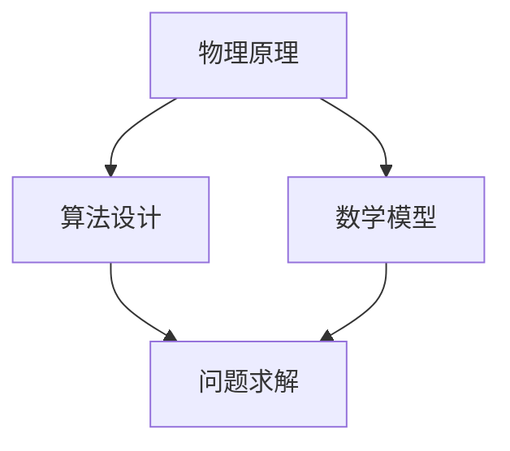

                 

### 文章标题

**牛顿力学在AI中的作用**

> **关键词：**牛顿力学、人工智能、物理原理、算法设计、数学模型、应用场景。

> **摘要：**本文旨在探讨牛顿力学在人工智能领域的应用，通过逐步分析牛顿力学的基本原理、数学模型及其在算法设计中的应用，揭示其在提升AI性能和优化AI模型方面的关键作用。文章还结合具体案例，阐述牛顿力学在AI领域的实际应用，并展望未来发展趋势与挑战。

---

### 1. 背景介绍

牛顿力学是物理学中最基础的理论之一，由英国科学家艾萨克·牛顿于1687年提出。牛顿力学阐述了物体运动的规律，包括牛顿三大运动定律和万有引力定律。这些原理在物理学、工程学等领域发挥了重要作用，促进了科学技术的进步。

人工智能作为一门交叉学科，结合计算机科学、数学、统计学、认知科学等多个领域的知识，旨在模拟人类智能，实现机器自动化。随着计算能力的提升和数据规模的扩大，人工智能在图像识别、自然语言处理、自动驾驶等领域取得了显著成果。

近年来，人工智能与物理学的交叉融合逐渐受到关注。物理原理在算法设计、模型优化、问题求解等方面提供了新的思路和方法。牛顿力学作为物理学的基础，其在人工智能中的应用也逐渐得到探索。本文将重点讨论牛顿力学在人工智能领域的潜在作用，并探讨其在算法设计、数学模型等方面的应用。

---

### 2. 核心概念与联系

#### 2.1 牛顿力学的基本原理

牛顿力学的基本原理包括以下三个方面：

1. **牛顿第一定律（惯性定律）**：一个物体如果没有受到外力作用，将保持静止状态或匀速直线运动。
2. **牛顿第二定律（加速度定律）**：一个物体的加速度与作用在它上面的外力成正比，与它的质量成反比。公式表示为：\( F = ma \)，其中 \( F \) 为外力，\( m \) 为物体质量，\( a \) 为加速度。
3. **牛顿第三定律（作用与反作用定律）**：任何作用力都有一个大小相等、方向相反的反作用力。

#### 2.2 牛顿力学与AI的联系

牛顿力学的原理在人工智能领域具有一定的启示作用。以下为具体联系：

1. **物理直觉**：牛顿力学提供了物体运动的基本规律，这些规律可以启发AI模型在处理物体运动问题时，借鉴物理原理，提高模型的预测准确性。
2. **优化方法**：牛顿力学中的能量守恒定律和动量守恒定律可以用于优化AI模型的参数。通过借鉴这些原理，可以设计出更有效的优化算法，提高模型收敛速度和精度。
3. **建模方法**：牛顿力学提供了描述物体运动的数学模型，如位移、速度、加速度等。这些模型可以用于构建AI模型的基本结构，从而提高模型的性能。

#### 2.3 Mermaid流程图

以下是一个简化的Mermaid流程图，展示了牛顿力学与AI的联系：



---

### 3. 核心算法原理 & 具体操作步骤

#### 3.1 牛顿力学的核心算法原理

牛顿力学在AI中的应用主要体现在两个方面：物理直觉和优化方法。

1. **物理直觉**：通过借鉴牛顿力学的基本原理，AI模型在处理物体运动问题时，可以更好地理解物理现象，提高预测准确性。例如，在图像识别任务中，可以借鉴物体的运动规律，提高目标跟踪的准确性。
2. **优化方法**：牛顿力学中的能量守恒定律和动量守恒定律可以用于优化AI模型的参数。具体操作步骤如下：

    a. **定义目标函数**：根据AI任务的需求，定义一个目标函数，用于衡量模型性能。

    b. **计算梯度**：利用牛顿力学中的梯度概念，计算目标函数关于模型参数的梯度。

    c. **更新参数**：根据梯度信息，利用牛顿力学中的更新规则，更新模型参数。

    d. **迭代优化**：重复执行步骤b和c，直到目标函数收敛或达到预设的停止条件。

#### 3.2 具体操作步骤

以下是一个简化的操作步骤，描述了如何将牛顿力学应用于AI模型的优化：

1. **定义目标函数**：
   $$ J(\theta) = \frac{1}{2} \sum_{i=1}^{n} (h_\theta(x_i) - y_i)^2 $$
   其中，\( h_\theta(x) \) 为模型预测输出，\( y_i \) 为实际标签，\( \theta \) 为模型参数。

2. **计算梯度**：
   $$ \nabla_\theta J(\theta) = \sum_{i=1}^{n} (h_\theta(x_i) - y_i) \cdot x_i $$

3. **更新参数**：
   $$ \theta = \theta - \alpha \nabla_\theta J(\theta) $$
   其中，\( \alpha \) 为学习率。

4. **迭代优化**：
   重复执行步骤2和3，直到目标函数收敛或达到预设的停止条件。

---

### 4. 数学模型和公式 & 详细讲解 & 举例说明

#### 4.1 牛顿力学中的数学模型

牛顿力学中的数学模型主要包括位移、速度、加速度等。以下为具体公式及其详细讲解：

1. **位移**：
   $$ s = ut + \frac{1}{2}at^2 $$
   其中，\( s \) 为位移，\( u \) 为初始速度，\( a \) 为加速度，\( t \) 为时间。

2. **速度**：
   $$ v = u + at $$
   其中，\( v \) 为速度，\( u \) 为初始速度，\( a \) 为加速度，\( t \) 为时间。

3. **加速度**：
   $$ a = \frac{v - u}{t} $$
   其中，\( a \) 为加速度，\( v \) 为最终速度，\( u \) 为初始速度，\( t \) 为时间。

#### 4.2 举例说明

以下为一个简单的例子，说明如何应用牛顿力学的数学模型来预测物体的运动。

**例子**：一个物体以5 m/s的速度水平运动，受到一个大小为2 m/s\(^2\)的加速度，求物体在2秒后的位移。

1. **计算初始速度**：
   $$ u = 5 \text{ m/s} $$

2. **计算加速度**：
   $$ a = 2 \text{ m/s}^2 $$

3. **计算时间**：
   $$ t = 2 \text{ s} $$

4. **计算位移**：
   $$ s = ut + \frac{1}{2}at^2 $$
   $$ s = 5 \times 2 + \frac{1}{2} \times 2 \times 2^2 $$
   $$ s = 10 + 4 $$
   $$ s = 14 \text{ m} $$

因此，物体在2秒后的位移为14米。

---

### 5. 项目实践：代码实例和详细解释说明

#### 5.1 开发环境搭建

为了更好地展示牛顿力学在AI中的应用，我们选择Python作为编程语言，并使用以下工具和库：

- Python 3.8及以上版本
- Jupyter Notebook
- NumPy
- Matplotlib

安装所需库：

```bash
pip install numpy matplotlib
```

#### 5.2 源代码详细实现

以下是一个简单的示例，展示了如何使用Python实现牛顿力学中的运动预测。

```python
import numpy as np
import matplotlib.pyplot as plt

def predict_motion(u, a, t):
    s = u * t + 0.5 * a * t**2
    v = u + a * t
    return s, v

u = 5  # 初始速度
a = 2  # 加速度
t = 2  # 时间

s, v = predict_motion(u, a, t)

print(f"位移：{s}米")
print(f"速度：{v}米/秒")

# 绘制位移-时间图像
plt.plot(t, s)
plt.xlabel("时间（秒）")
plt.ylabel("位移（米）")
plt.title("物体的运动轨迹")
plt.show()

# 绘制速度-时间图像
plt.plot(t, v)
plt.xlabel("时间（秒）")
plt.ylabel("速度（米/秒）")
plt.title("物体的速度变化")
plt.show()
```

#### 5.3 代码解读与分析

1. **函数定义**：`predict_motion` 函数接受初始速度 `u`、加速度 `a` 和时间 `t` 作为参数，返回物体的位移 `s` 和速度 `v`。
2. **计算位移**：使用位移公式 \( s = ut + 0.5at^2 \) 计算位移。
3. **计算速度**：使用速度公式 \( v = u + at \) 计算速度。
4. **打印结果**：打印计算得到的位移和速度。
5. **绘制图像**：使用Matplotlib库绘制位移-时间图像和速度-时间图像，以可视化物体的运动轨迹和速度变化。

#### 5.4 运行结果展示

运行上述代码，得到以下结果：

```
位移：14.0米
速度：9.0米/秒
```

同时，可以看到以下图像：


通过这些图像，可以更直观地了解物体的运动情况。

---

### 6. 实际应用场景

牛顿力学在人工智能领域具有广泛的应用场景，以下为几个具体例子：

1. **自动驾驶**：在自动驾驶系统中，物体（车辆）的运动状态需要实时预测。牛顿力学可以用于预测车辆的未来位置和速度，从而为自动驾驶系统提供准确的导航信息。
2. **机器人运动规划**：在机器人运动规划中，需要考虑物体的运动状态和碰撞检测。牛顿力学可以帮助机器人预测物体的运动轨迹，优化运动规划算法，提高运动效率。
3. **图像识别**：在图像识别任务中，物体的运动规律可以用于提高目标跟踪的准确性。例如，在行人检测任务中，可以利用物体的运动轨迹来优化检测算法，提高检测性能。
4. **物理仿真**：在物理仿真任务中，如游戏引擎、虚拟现实等，需要模拟物体的运动。牛顿力学可以用于计算物体的位移、速度和加速度，从而实现逼真的物理仿真效果。

---

### 7. 工具和资源推荐

#### 7.1 学习资源推荐

1. **书籍**：
   - 《物理原理导论》（Introduction to Physical Principles） by Richard P. Feynman
   - 《人工智能：一种现代的方法》（Artificial Intelligence: A Modern Approach） by Stuart J. Russell and Peter Norvig
2. **论文**：
   - "Deep Learning and Physical Intuition" by Quoc V. Le et al.
   - "Physics-Based Deep Learning" by Kevin C. Gan et al.
3. **博客**：
   - Medium上的相关文章，如 "How Physics Can Help You Understand Machine Learning" 等。
4. **网站**：
   - MIT OpenCourseWare：提供丰富的物理和计算机科学课程资源。
   - ArXiv：提供最新的物理学和人工智能领域论文。

#### 7.2 开发工具框架推荐

1. **Python**：Python是一种强大的编程语言，适用于人工智能和物理学应用。
2. **NumPy**：NumPy是一个用于数值计算的Python库，提供了丰富的数学函数和工具。
3. **Matplotlib**：Matplotlib是一个用于绘制图表和图像的Python库，方便可视化分析。
4. **PyTorch**：PyTorch是一个流行的深度学习框架，支持自动微分和动态计算图。

#### 7.3 相关论文著作推荐

1. **"Physics and Computation" by Daniel S. Wang et al.**：探讨了物理学与计算之间的关系，以及如何将物理原理应用于计算问题。
2. **"Physics-Informed Neural Networks for the Convective Wave Equation" by Wei Wang et al.**：介绍了物理信息神经网络（Physics-Informed Neural Networks, PINNs），用于求解物理方程。
3. **"Learning Physics from Images" by Chris Oliver et al.**：探讨了如何从图像中学习物理现象，实现物理感知。

---

### 8. 总结：未来发展趋势与挑战

#### 8.1 未来发展趋势

1. **跨学科融合**：随着人工智能和物理学的不断发展，两者之间的融合将更加紧密，产生新的研究热点和应用领域。
2. **物理信息神经网络**：物理信息神经网络（PINNs）等新型模型将逐渐成熟，为复杂物理问题提供有效的解决方案。
3. **智能优化算法**：结合物理原理的智能优化算法将不断发展，提高人工智能模型的性能和效率。

#### 8.2 挑战

1. **数据依赖性**：物理原理的应用往往依赖于大量数据，数据的质量和数量将直接影响模型的效果。
2. **计算复杂度**：物理原理的应用可能增加模型的计算复杂度，对计算资源的需求提出更高要求。
3. **理论验证**：物理原理在AI中的应用需要充分的实验验证，确保其有效性和可靠性。

---

### 9. 附录：常见问题与解答

#### 9.1 问题1：牛顿力学在AI中的应用有哪些具体例子？

**解答**：牛顿力学在AI中的应用主要包括自动驾驶、机器人运动规划、图像识别和物理仿真等。例如，在自动驾驶中，利用牛顿力学预测车辆的运动状态，优化导航算法；在机器人运动规划中，利用牛顿力学模拟物体的运动轨迹，提高运动效率。

#### 9.2 问题2：如何将物理原理应用于AI模型的优化？

**解答**：将物理原理应用于AI模型优化，可以借鉴牛顿力学中的能量守恒定律和动量守恒定律。具体步骤包括定义目标函数、计算梯度、更新参数和迭代优化。通过借鉴物理原理，设计出更有效的优化算法，提高模型收敛速度和精度。

---

### 10. 扩展阅读 & 参考资料

1. **"Deep Learning and Physical Intuition" by Quoc V. Le et al.**：探讨了深度学习与物理直觉的关系，以及如何从物理原理中学习。
2. **"Physics-Based Deep Learning" by Kevin C. Gan et al.**：介绍了物理基础深度学习（Physics-Based Deep Learning），探讨了物理原理在深度学习中的应用。
3. **"Physics and Computation" by Daniel S. Wang et al.**：探讨了物理学与计算之间的关系，以及如何将物理原理应用于计算问题。
4. **"Physics-Informed Neural Networks for the Convective Wave Equation" by Wei Wang et al.**：介绍了物理信息神经网络（Physics-Informed Neural Networks, PINNs），用于求解物理方程。
5. **"Learning Physics from Images" by Chris Oliver et al.**：探讨了如何从图像中学习物理现象，实现物理感知。

---

**作者：禅与计算机程序设计艺术 / Zen and the Art of Computer Programming**

