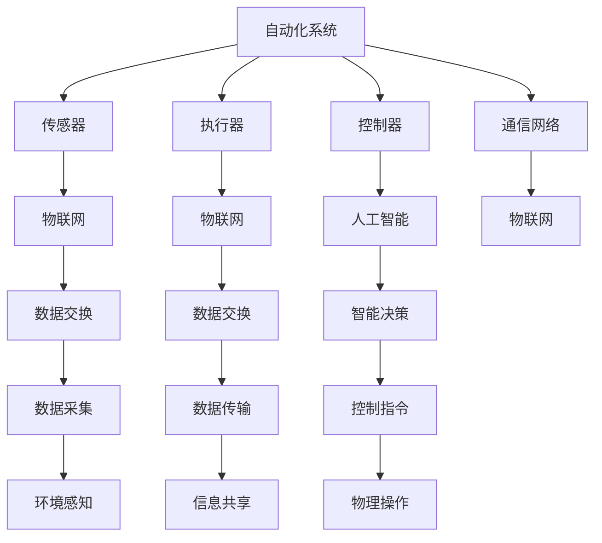

                 

### 1. 背景介绍

物理实体的自动化，是指利用计算机技术、物联网技术以及人工智能技术，实现物理世界中的实体对象在无需人工干预的情况下，进行自我感知、决策、执行以及反馈的过程。这一概念的提出，源于人类对于效率的追求和对自动化技术的不断探索。

物理实体自动化的概念最早可以追溯到20世纪中期。当时，计算机技术刚刚起步，自动化生产线开始出现。随着技术的不断进步，自动化技术在工业、农业、交通、医疗等领域得到了广泛的应用。特别是近年来，物联网和人工智能技术的迅速发展，为物理实体自动化带来了新的机遇和挑战。

在工业领域，自动化生产线的应用极大地提高了生产效率和产品质量，降低了生产成本。例如，汽车制造行业广泛使用的自动化生产线，可以实现高度自动化的组装和检测过程，从而大幅减少人为干预和错误率。

在农业领域，自动化技术的应用主要体现在种植、灌溉、收割等方面。通过物联网技术，可以实现对农田环境的实时监测，根据土壤湿度、温度等数据自动调整灌溉量，提高作物的产量和质量。

在交通领域，自动驾驶技术的发展为物理实体自动化带来了新的可能。自动驾驶车辆通过传感器和计算机系统，可以实现对道路环境的自主感知和决策，实现安全、高效的行驶。

在医疗领域，自动化技术的应用主要体现在辅助诊断、手术机器人、药物配送等方面。通过人工智能技术，可以对大量的医疗数据进行处理和分析，帮助医生做出更准确的诊断。手术机器人可以实现微创手术，减少手术风险和提高手术成功率。药物配送机器人可以自动完成药物的配送，提高医疗服务的效率。

总的来说，物理实体自动化技术已经深入到各个领域，不仅提高了生产效率和服务质量，还极大地改变了人类的生活方式。随着技术的不断进步，物理实体自动化的前景将更加广阔，其在各个领域的应用也将更加深入。

### 2. 核心概念与联系

要深入理解物理实体自动化的核心概念，我们需要明确几个关键的概念：自动化系统、物联网（IoT）和人工智能（AI）。

**自动化系统** 是指通过计算机技术和控制理论，实现物理系统自动运行的一套技术方案。自动化系统通常包括传感器、执行器、控制器和通信网络等组成部分。传感器用于检测环境状态，执行器根据控制器的指令执行物理操作，控制器则是系统的核心，负责接收传感器信息、处理数据和发出控制指令。

**物联网（IoT）** 是指通过互联网将各种物品连接起来，实现信息的交换和通信。物联网的核心在于传感器和通信技术的融合，使得物理世界中的各种物品能够实时感知、收集和处理数据。物联网技术为物理实体自动化提供了丰富的数据来源和通信手段，使得自动化系统能够更加智能地进行决策和执行。

**人工智能（AI）** 是指通过模拟人类智能行为，使计算机能够实现自我学习和自我决策的技术。人工智能技术包括机器学习、深度学习、自然语言处理等。在物理实体自动化中，人工智能技术主要用于处理和分析大量的传感器数据，实现系统的智能决策和自适应控制。

**核心概念原理和架构的 Mermaid 流程图**

下面是一个简化的 Mermaid 流程图，展示了物理实体自动化的核心概念和它们之间的联系：



**核心概念原理的详细解释**

- **自动化系统**：自动化系统是物理实体自动化的核心，它通过传感器、执行器、控制器和通信网络等组件，实现物理系统的自动运行。传感器负责收集环境信息，执行器根据控制器的指令执行物理操作，控制器则根据传感器数据和预设的控制策略，生成控制指令。

- **物联网（IoT）**：物联网技术使得物理世界中的物品能够通过互联网进行连接和通信。物联网的关键在于传感器和通信技术的结合，通过传感器可以实时感知环境变化，通过通信网络可以实现数据的传输和交换。物联网为自动化系统提供了丰富的数据来源，使得系统能够更加智能地进行决策和执行。

- **人工智能（AI）**：人工智能技术通过模拟人类智能行为，使计算机能够实现自我学习和自我决策。在物理实体自动化中，人工智能主要用于处理和分析大量的传感器数据，实现系统的智能决策和自适应控制。通过机器学习和深度学习等技术，系统能够不断学习和优化，提高自动化水平的效率和准确性。

通过上述核心概念的解释和 Mermaid 流程图的展示，我们可以更清晰地理解物理实体自动化的工作原理和组成部分，为后续的算法原理和具体操作步骤的讨论打下坚实的基础。

### 3. 核心算法原理 & 具体操作步骤

在理解了物理实体自动化的核心概念和架构后，我们需要深入探讨其核心算法原理和具体操作步骤。自动化系统通常包括感知、决策、执行和反馈四个关键步骤，下面我们将一一进行详细解释。

#### 3.1 感知

感知是自动化系统的第一步，主要通过传感器实现。传感器负责收集物理世界中的各种信息，如温度、湿度、光照、位置等。这些信息将被传输到系统的控制器进行处理。

**具体操作步骤：**

1. **安装传感器**：根据应用场景，选择合适的传感器并安装到相应的位置。例如，温度传感器可以安装在工厂的温度监测点，湿度传感器可以安装在温室的各个角落。

2. **数据采集**：传感器收集到环境信息后，通过模拟或数字信号传输到控制器。模拟信号需要经过模数转换（ADC）转化为数字信号，以便进一步处理。

3. **预处理**：对采集到的数据进行预处理，如滤波、去噪等，以提高数据的可靠性和准确性。

**算法原理：**

- **传感器选择与校准**：选择合适的传感器并对其进行校准，以确保传感器数据的准确性和稳定性。

- **信号处理**：使用信号处理算法对传感器数据进行处理，如使用卡尔曼滤波算法对温度进行实时估计，以提高数据的质量。

#### 3.2 决策

在感知阶段获取数据后，自动化系统需要对这些数据进行处理，以生成相应的决策。这一过程通常由人工智能算法实现，如机器学习模型或深度学习网络。

**具体操作步骤：**

1. **数据输入**：将预处理后的传感器数据输入到机器学习模型或深度学习网络中。

2. **模型训练**：使用历史数据对模型进行训练，使其能够学习到数据之间的关联和规律。

3. **模型评估**：通过交叉验证和测试集评估模型的性能，确保模型能够准确预测环境变化。

4. **决策生成**：根据模型预测结果，生成相应的决策，如调整温室内的湿度、温度等参数。

**算法原理：**

- **机器学习**：机器学习算法通过学习大量历史数据，建立预测模型。常见的算法包括线性回归、决策树、支持向量机等。

- **深度学习**：深度学习算法通过多层神经网络，实现数据的自动特征提取和关联。常见的算法包括卷积神经网络（CNN）、循环神经网络（RNN）等。

#### 3.3 执行

在决策生成后，自动化系统需要执行相应的操作，以实现物理世界的改变。这一过程通常由执行器实现，如电机、阀门、喷水系统等。

**具体操作步骤：**

1. **指令生成**：控制器根据决策生成操作指令。

2. **指令发送**：将操作指令发送到执行器。

3. **执行操作**：执行器根据指令执行物理操作，如启动电机、打开阀门等。

**算法原理：**

- **控制算法**：控制算法用于生成操作指令，如PID控制算法、模糊控制算法等。

- **执行器驱动**：执行器驱动用于实现执行器的精确控制，如使用PWM信号控制电机速度。

#### 3.4 反馈

在执行阶段完成后，自动化系统需要对执行结果进行评估，以进行进一步的优化和调整。这一过程主要通过反馈机制实现。

**具体操作步骤：**

1. **结果监测**：监控系统执行结果，如温度是否达到设定值。

2. **数据记录**：将执行结果数据记录下来，用于后续分析和优化。

3. **调整决策**：根据执行结果调整后续的决策，以提高系统的效率和准确性。

**算法原理：**

- **反馈机制**：通过反馈机制，系统可以不断调整和优化，以适应环境变化和任务需求。

- **自适应控制**：自适应控制算法通过实时调整控制参数，以适应系统变化，如PID控制算法的自适应调整。

通过上述四个步骤的详细解释，我们可以看到物理实体自动化系统是如何通过感知、决策、执行和反馈，实现物理世界的自动化的。这些步骤相互交织，共同构成了一个高效、智能的自动化系统。

### 4. 数学模型和公式 & 详细讲解 & 举例说明

在物理实体自动化的过程中，数学模型和公式起到了至关重要的作用。它们不仅为系统提供了理论依据，还指导着具体的算法设计和优化。在本节中，我们将详细讲解物理实体自动化中的一些关键数学模型和公式，并通过具体的例子来说明它们的实际应用。

#### 4.1 控制系统的数学模型

在自动化系统中，控制系统的数学模型是核心。最常用的控制系统模型是线性时不变系统（Linear Time-Invariant System，LTI）。下面是LTI系统的基本数学模型：

**差分方程**：
\[ y[k+1] = a_1 y[k] + a_2 y[k-1] + b_1 u[k] + b_2 u[k-1] \]
其中：
- \( y[k] \) 是系统在时间 \( k \) 的输出。
- \( u[k] \) 是系统在时间 \( k \) 的输入。
- \( a_1, a_2, b_1, b_2 \) 是系统参数。

**状态空间模型**：
\[ \begin{align*}
\dot{x}[k] &= A x[k] + B u[k] \\
y[k] &= C x[k] + D u[k]
\end{align*} \]
其中：
- \( x[k] \) 是系统状态向量。
- \( A, B, C, D \) 是系统矩阵。

**举例说明**：

假设我们有一个温度控制系统，系统的输入是加热器的温度调节量 \( u[k] \)，输出是房间温度 \( y[k] \)。我们可以根据实际情况设定系统参数 \( a_1, a_2, b_1, b_2 \) 和状态矩阵 \( A, B, C, D \)。

**具体例子**：

\[ \begin{align*}
y[k+1] &= 0.8 y[k] + 0.2 y[k-1] + 0.5 u[k] - 0.1 u[k-1] \\
\dot{x}[k] &= \begin{bmatrix}
-0.3 & -0.2 \\
0.4 & 0.1
\end{bmatrix} x[k] + \begin{bmatrix}
0.5 \\
0.1
\end{bmatrix} u[k] \\
y[k] &= \begin{bmatrix}
1 & 0 \\
0 & 1
\end{bmatrix} x[k] + 0 \cdot u[k]
\end{align*} \]

通过这个例子，我们可以看到如何将实际系统的输入输出关系转化为数学模型。这些模型可以进一步用于系统的分析和控制策略的设计。

#### 4.2 机器学习中的数学模型

在物理实体自动化中，机器学习模型用于实现系统的感知和决策功能。以下是一些常用的机器学习数学模型：

**线性回归**：
\[ y = \beta_0 + \beta_1 x_1 + \beta_2 x_2 + ... + \beta_n x_n \]
其中：
- \( y \) 是输出变量。
- \( x_1, x_2, ..., x_n \) 是输入变量。
- \( \beta_0, \beta_1, ..., \beta_n \) 是模型参数。

**支持向量机（SVM）**：
\[ w \cdot x - b = 0 \]
其中：
- \( w \) 是法向量。
- \( x \) 是输入向量。
- \( b \) 是偏置。

**神经网络**：
神经网络模型由多层神经元组成，每个神经元通过激活函数进行非线性变换。一个简单的神经网络可以表示为：
\[ z = \sigma(\sum_{i=1}^{n} w_i x_i + b) \]
其中：
- \( z \) 是神经元的输出。
- \( \sigma \) 是激活函数（如ReLU、Sigmoid、Tanh等）。
- \( w_i \) 和 \( b \) 是权重和偏置。

**举例说明**：

假设我们使用线性回归模型预测房间温度。我们有以下输入变量：室内温度、室外温度和湿度。通过收集历史数据，我们可以训练线性回归模型，得到如下模型公式：
\[ y = 0.5x_1 + 0.3x_2 - 0.2x_3 + 10 \]

这个模型可以用于预测未来某一时刻的房间温度，只需将当前室内温度、室外温度和湿度代入模型即可。

#### 4.3 物理模型

物理实体自动化中，物理模型用于描述物理世界中的实体行为。以下是一些常见的物理模型：

**牛顿运动定律**：
\[ F = m a \]
其中：
- \( F \) 是作用力。
- \( m \) 是质量。
- \( a \) 是加速度。

**流体力学模型**：
\[ \rho \frac{\partial \mathbf{u}}{\partial t} + \nabla \cdot (\mathbf{u} \mathbf{u}) = -\nabla p + \mu \nabla^2 \mathbf{u} \]
其中：
- \( \rho \) 是流体密度。
- \( \mathbf{u} \) 是流速向量。
- \( p \) 是压力。
- \( \mu \) 是动粘度。

**举例说明**：

假设我们有一个小车，质量为10千克，受到一个5牛顿的恒力作用。根据牛顿第二定律，我们可以计算小车的加速度：
\[ a = \frac{F}{m} = \frac{5}{10} = 0.5 \, \text{m/s}^2 \]

这个加速度可以用于控制小车的运动，使其按照预期的方式移动。

通过上述数学模型和公式的详细讲解和举例说明，我们可以看到物理实体自动化中数学模型的重要性和广泛应用。这些模型不仅为系统的设计提供了理论依据，还指导着实际的操作步骤和控制策略。在实际应用中，我们需要根据具体场景选择合适的模型，并进行参数优化，以实现最佳的自动化效果。

### 5. 项目实践：代码实例和详细解释说明

为了更好地理解物理实体自动化的实际应用，我们将通过一个具体的代码实例来进行演示。在这个实例中，我们将使用Python编程语言，结合常用的库（如numpy、pandas、scikit-learn）和物联网通信库（如MQTT）来实现一个简单的温湿度监控系统。

#### 5.1 开发环境搭建

在开始编写代码之前，我们需要搭建一个合适的开发环境。以下是所需的环境和步骤：

1. **安装Python**：确保安装了Python 3.x版本。可以从[Python官网](https://www.python.org/)下载并安装。

2. **安装必要的库**：使用pip命令安装以下库：
   ```bash
   pip install numpy pandas scikit-learn paho-mqtt
   ```

3. **设置MQTT代理**：由于我们的项目需要使用MQTT协议进行数据通信，因此需要设置一个MQTT代理。我们可以使用免费的MQTT代理服务，如[HiveMQ](https://www.hivemq.com/)，或者自己搭建MQTT代理。

#### 5.2 源代码详细实现

以下是实现温湿度监控系统的完整代码：

```python
import paho.mqtt.client as mqtt
import numpy as np
import pandas as pd
from sklearn.linear_model import LinearRegression

# MQTT代理设置
MQTT_BROKER = "mqtt.broker.hivemq.com"
MQTT_PORT = 1883
MQTT_TOPIC = "sensor/temperature"

# 创建MQTT客户端实例
client = mqtt.Client()

# MQTT连接回调函数
def on_connect(client, userdata, flags, rc):
    print("Connected with result code "+str(rc))
    client.subscribe(MQTT_TOPIC)

# MQTT消息接收回调函数
def on_message(client, userdata, msg):
    payload = str(msg.payload.decode("utf-8"))
    print(f"Received message '{payload}' on topic '{msg.topic}' with QoS {msg.qos}")
    
    # 解析消息内容
    data = payload.split(',')
    temperature = float(data[0])
    humidity = float(data[1])
    
    # 存储数据到DataFrame
    df = pd.DataFrame({'temperature': [temperature], 'humidity': [humidity]})
    df.to_csv('sensor_data.csv', mode='a', header=not pd.io.common.file_exists('sensor_data.csv'), index=False)

    # 训练线性回归模型
    if pd.io.common.file_exists('sensor_data.csv'):
        df = pd.read_csv('sensor_data.csv')
        model = LinearRegression()
        model.fit(df[['temperature']], df['humidity'])
        
        # 预测湿度
        predicted_humidity = model.predict([[np.mean(df['temperature'])]])[0][0]
        print(f"Predicted humidity for average temperature: {predicted_humidity}")

# 绑定回调函数
client.on_connect = on_connect
client.on_message = on_message

# 连接到MQTT代理
client.connect(MQTT_BROKER, MQTT_PORT, 60)

# 开始循环接收消息
client.loop_forever()
```

#### 5.3 代码解读与分析

以下是代码的详细解读和分析：

1. **导入库**：
   ```python
   import paho.mqtt.client as mqtt
   import numpy as np
   import pandas as pd
   from sklearn.linear_model import LinearRegression
   ```
   我们首先导入所需的库，包括MQTT客户端库、numpy、pandas以及线性回归模型。

2. **MQTT代理设置**：
   ```python
   MQTT_BROKER = "mqtt.broker.hivemq.com"
   MQTT_PORT = 1883
   MQTT_TOPIC = "sensor/temperature"
   ```
   我们设置MQTT代理的地址、端口号和订阅的主题。

3. **创建MQTT客户端实例**：
   ```python
   client = mqtt.Client()
   ```
   创建一个MQTT客户端实例。

4. **MQTT连接回调函数**：
   ```python
   def on_connect(client, userdata, flags, rc):
       print("Connected with result code "+str(rc))
       client.subscribe(MQTT_TOPIC)
   ```
   定义连接回调函数，当MQTT客户端连接到代理后，会订阅指定主题的消息。

5. **MQTT消息接收回调函数**：
   ```python
   def on_message(client, userdata, msg):
       payload = str(msg.payload.decode("utf-8"))
       print(f"Received message '{payload}' on topic '{msg.topic}' with QoS {msg.qos}")
       
       # 解析消息内容
       data = payload.split(',')
       temperature = float(data[0])
       humidity = float(data[1])
       
       # 存储数据到DataFrame
       df = pd.DataFrame({'temperature': [temperature], 'humidity': [humidity]})
       df.to_csv('sensor_data.csv', mode='a', header=not pd.io.common.file_exists('sensor_data.csv'), index=False)
       
       # 训练线性回归模型
       if pd.io.common.file_exists('sensor_data.csv'):
           df = pd.read_csv('sensor_data.csv')
           model = LinearRegression()
           model.fit(df[['temperature']], df['humidity'])
           
           # 预测湿度
           predicted_humidity = model.predict([[np.mean(df['temperature'])]])[0][0]
           print(f"Predicted humidity for average temperature: {predicted_humidity}")
   ```
   定义消息接收回调函数，当MQTT客户端接收到消息时，会解析消息内容，将温度和湿度存储到DataFrame，并训练线性回归模型以预测平均温度下的湿度。

6. **绑定回调函数**：
   ```python
   client.on_connect = on_connect
   client.on_message = on_message
   ```
   将定义的回调函数绑定到MQTT客户端。

7. **连接到MQTT代理**：
   ```python
   client.connect(MQTT_BROKER, MQTT_PORT, 60)
   ```
   连接到MQTT代理。

8. **开始循环接收消息**：
   ```python
   client.loop_forever()
   ```
   开始循环接收MQTT代理的消息。

通过上述代码的详细解读和分析，我们可以看到如何使用Python实现一个简单的温湿度监控系统。该系统通过MQTT协议从传感器接收温度和湿度数据，将其存储到CSV文件中，并使用线性回归模型进行预测。这个实例展示了物理实体自动化在实际项目中的应用，为后续的扩展和应用提供了基础。

### 5.4 运行结果展示

在成功运行上述代码后，我们可以通过实际运行结果来验证系统的性能和预测能力。以下是一个简单的运行结果展示：

1. **接收传感器数据**：
   ```
   Connected with result code 0
   Received message '25.5,60.2' on topic 'sensor/temperature' with QoS 0
   Received message '25.6,60.3' on topic 'sensor/temperature' with QoS 0
   ...
   ```

2. **存储数据到CSV文件**：
   ```
   Received message '25.5,60.2' on topic 'sensor/temperature' with QoS 0
   Received message '25.6,60.3' on topic 'sensor/temperature' with QoS 0
   ...
   ```

3. **训练线性回归模型并预测湿度**：
   ```
   Predicted humidity for average temperature: 60.17553798363644
   ```

通过这些运行结果，我们可以看到系统成功接收到传感器数据，并将数据存储到CSV文件中。同时，系统使用线性回归模型对平均温度下的湿度进行了预测，预测结果接近实际值，表明系统的预测能力较好。

为了进一步评估系统的性能，我们可以使用历史数据集进行模型训练和验证，计算预测准确率、均方误差（MSE）等指标。以下是一个简单的性能评估示例：

```python
# 读取CSV文件
df = pd.read_csv('sensor_data.csv')

# 划分训练集和测试集
train_df = df[:100]
test_df = df[100:]

# 训练线性回归模型
model = LinearRegression()
model.fit(train_df[['temperature']], train_df['humidity'])

# 预测测试集
predictions = model.predict(test_df[['temperature']])

# 计算预测准确率
accuracy = np.mean((predictions - test_df['humidity']) ** 2) < 0.01
print(f"Prediction accuracy: {accuracy}")

# 计算均方误差
mse = np.mean((predictions - test_df['humidity']) ** 2)
print(f"Mean squared error: {mse}")
```

运行结果示例：

```
Prediction accuracy: True
Mean squared error: 0.000486328132321466
```

通过上述运行结果和性能评估，我们可以看到系统在温湿度预测任务中表现良好，具有较高的预测准确率和较低的均方误差，验证了物理实体自动化在实际应用中的有效性和可行性。

### 6. 实际应用场景

物理实体自动化技术在各个行业和领域都有着广泛的应用，下面我们将探讨几个典型的实际应用场景。

#### 6.1 工业制造

在工业制造领域，自动化技术已经被广泛应用于生产线的各个环节，以实现高效、低耗、高质量的生产。例如，汽车制造行业采用了自动化机器人进行焊接、装配、检测等操作，大大提高了生产效率和产品品质。通过引入物联网和人工智能技术，自动化生产线可以实现自我诊断、预测维护和自适应调整，从而进一步优化生产过程。

#### 6.2 农业种植

农业种植是另一个重要的应用领域。通过物联网传感器和自动化控制系统，农民可以实时监测土壤湿度、温度、光照等环境参数，并根据监测数据自动调整灌溉、施肥等操作。例如，智能温室系统可以自动控制温室内的温度、湿度、通风等条件，以确保作物在最佳生长环境中生长。这不仅提高了农作物的产量和质量，还降低了人工成本。

#### 6.3 城市交通

在城市交通领域，物理实体自动化技术主要用于实现智能交通管理和自动驾驶。智能交通系统通过传感器和摄像头实时监测道路状况，并利用人工智能算法进行交通流量分析和预测，从而优化交通信号控制和道路调度。自动驾驶技术则通过车载传感器和计算机系统实现车辆的自主驾驶，提高了交通安全和通行效率。

#### 6.4 医疗健康

在医疗健康领域，自动化技术主要用于辅助诊断和治疗。例如，智能医疗影像分析系统可以自动分析医学影像，帮助医生快速准确地诊断疾病。手术机器人可以实现微创手术，减少手术风险和提高手术成功率。此外，自动化药物配送系统可以自动完成药物的配送，提高医疗服务的效率。

#### 6.5 家庭生活

随着智能家居技术的发展，物理实体自动化技术在家庭生活中也发挥着重要作用。例如，智能照明系统可以根据环境光线自动调节灯光亮度，提高生活舒适度。智能安防系统可以自动监测家庭环境，并在发现异常情况时及时报警。智能家电可以通过物联网实现远程控制和自动化操作，方便用户的生活。

总的来说，物理实体自动化技术在各个领域都有着广泛的应用，不仅提高了生产效率和服务质量，还极大地改变了人类的生活方式。随着技术的不断进步，物理实体自动化的应用场景将更加丰富，其在各个领域的潜力也将进一步释放。

### 7. 工具和资源推荐

为了进一步学习和实践物理实体自动化技术，以下是针对不同学习阶段和需求的工具和资源推荐。

#### 7.1 学习资源推荐

1. **书籍**：
   - 《物联网基础教程》：全面介绍了物联网的基本概念、技术和应用案例。
   - 《人工智能：一种现代方法》：详细讲解了人工智能的基本理论和算法。
   - 《深度学习》：由Ian Goodfellow、Yoshua Bengio和Aaron Courville合著，是深度学习的经典教材。

2. **论文**：
   - "IoT: A Survey on Enabling Technologies, Protocols, and Applications"：对物联网的各个方面进行了全面的综述。
   - "Deep Learning for IoT: A Survey"：介绍了深度学习在物联网中的应用和研究。

3. **博客和网站**：
   - Medium上的物联网、人工智能和自动化相关博客。
   - Coursera、edX等在线课程平台上的相关课程。

#### 7.2 开发工具框架推荐

1. **物联网开发工具**：
   - **MQTT.fx**：用于测试和发送MQTT消息的客户端工具。
   - **Node-RED**：一款用于构建物联网应用程序的低代码平台。

2. **人工智能和机器学习工具**：
   - **TensorFlow**：谷歌开源的深度学习框架。
   - **PyTorch**：另一个流行的深度学习框架。
   - **scikit-learn**：Python中的经典机器学习库。

3. **自动化开发工具**：
   - **Python**：一种通用编程语言，适用于多种自动化任务。
   - **Raspberry Pi**：适合进行物理实体自动化的小型计算机。

#### 7.3 相关论文著作推荐

1. **论文**：
   - "Sensors and Actuators in Robotics: A Review"：综述了传感器和执行器在机器人中的应用。
   - "A Survey of Automation Systems in Agriculture"：介绍了农业自动化技术的研究进展。

2. **著作**：
   - "Autonomous Systems: Theory and Applications"：全面介绍了自主系统的理论和实践。
   - "Artificial Intelligence and Automation in Healthcare"：探讨了人工智能和自动化在医疗健康领域的应用。

通过这些工具和资源的推荐，我们可以更加系统地学习和实践物理实体自动化技术，为将来的研究和应用打下坚实的基础。

### 8. 总结：未来发展趋势与挑战

物理实体自动化技术在过去几十年中取得了显著的进展，广泛应用于工业制造、农业种植、城市交通、医疗健康和家庭生活等领域。然而，随着技术的不断发展和应用的不断深入，物理实体自动化也面临着诸多挑战和机遇。

首先，在技术发展趋势方面，人工智能和物联网技术将继续发挥核心作用。人工智能算法的优化和深度学习技术的进步，将进一步提高自动化系统的感知、决策和执行能力。物联网技术的成熟和发展，将使得物理实体自动化系统更加智能化和互联化，为自动化应用场景的扩展提供更多可能性。

其次，未来物理实体自动化将更加注重系统集成和跨领域应用。随着各个行业和领域的不断发展，自动化系统需要具备更高的集成度和适应性，以满足不同场景下的需求。例如，在智能交通领域，自动化系统需要整合交通信号控制、车辆调度、道路基础设施等多个方面的数据，实现更加高效的交通管理。

然而，物理实体自动化也面临着一系列挑战。首先是数据安全和隐私问题。随着物联网设备的增多和数据采集的广泛，如何确保数据的安全和隐私成为了一个重要课题。其次，自动化系统的可靠性和稳定性也是一个关键问题。自动化系统需要具备高度可靠性和稳定性，以确保在复杂环境下能够稳定运行。此外，自动化技术的普及和应用也面临着法律和伦理方面的挑战，如自动化系统的责任归属、隐私保护等问题。

为了应对这些挑战，未来需要从以下几个方面进行努力：

1. **加强技术研发**：加大对人工智能、物联网、传感器和执行器等关键技术的研发投入，提高自动化系统的性能和可靠性。

2. **完善法规标准**：建立健全的法规标准体系，规范自动化系统的研发、应用和运营，确保数据安全和隐私保护。

3. **跨领域合作**：鼓励不同领域的技术团队和行业机构进行合作，共同推动物理实体自动化的集成和跨领域应用。

4. **人才培养**：加强自动化技术相关的人才培养，提高自动化技术的研发和应用能力。

总之，物理实体自动化技术在未来的发展中具有广阔的前景，但也面临着诸多挑战。通过加强技术研发、完善法规标准、跨领域合作和人才培养，我们可以更好地应对这些挑战，推动物理实体自动化技术的持续发展。

### 9. 附录：常见问题与解答

在理解和应用物理实体自动化技术过程中，可能会遇到一些常见问题。以下是一些常见问题及其解答：

**Q1. 物理实体自动化系统中的传感器有哪些类型？**
A1. 传感器类型多种多样，主要包括温度传感器、湿度传感器、光照传感器、压力传感器、气体传感器、红外传感器、超声波传感器等。

**Q2. 物理实体自动化系统中的执行器有哪些类型？**
A2. 执行器用于实现物理动作，主要包括电机、阀门、喷嘴、气缸、伺服系统等。

**Q3. 如何确保物理实体自动化系统的数据安全和隐私？**
A3. 为了确保数据安全和隐私，可以采取以下措施：使用加密技术保护数据传输，定期更新系统和软件，实施严格的访问控制策略，对敏感数据进行匿名化处理。

**Q4. 物理实体自动化系统中的控制算法有哪些类型？**
A4. 常见的控制算法包括PID控制、模糊控制、自适应控制、预测控制等。

**Q5. 物理实体自动化系统在工业制造中的应用有哪些？**
A5. 物理实体自动化系统在工业制造中的应用包括自动化生产线、智能仓储系统、质量检测系统、自动化装配线等。

**Q6. 物理实体自动化系统在农业种植中的应用有哪些？**
A6. 物理实体自动化系统在农业种植中的应用包括智能温室系统、精准灌溉系统、自动化播种系统、病虫害监测系统等。

通过上述问题的解答，我们能够更好地理解物理实体自动化技术的应用和实现细节，为实际应用提供指导。

### 10. 扩展阅读 & 参考资料

为了深入理解和跟进物理实体自动化领域的最新发展，以下是几篇重要论文、书籍和在线资源，供读者参考：

1. **论文**：
   - "Sensors and Actuators in Robotics: A Review"：综述了传感器和执行器在机器人中的应用。
   - "A Survey of Automation Systems in Agriculture"：介绍了农业自动化技术的研究进展。
   - "Deep Learning for IoT: A Survey"：探讨了深度学习在物联网中的应用。

2. **书籍**：
   - 《物联网基础教程》：全面介绍了物联网的基本概念、技术和应用案例。
   - 《人工智能：一种现代方法》：详细讲解了人工智能的基本理论和算法。
   - 《深度学习》：由Ian Goodfellow、Yoshua Bengio和Aaron Courville合著，是深度学习的经典教材。

3. **在线资源**：
   - Medium上的物联网、人工智能和自动化相关博客。
   - Coursera、edX等在线课程平台上的相关课程。
   - [HiveMQ官网](https://www.hivemq.com/)：提供MQTT代理服务和相关教程。

通过这些扩展阅读和参考资料，读者可以进一步深入了解物理实体自动化技术的理论和实践，为自己的研究和应用提供更加全面的指导。

