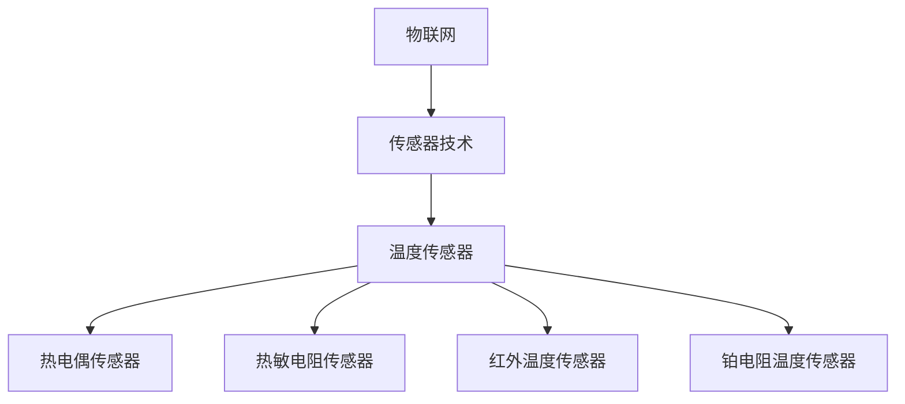

                 

关键词：物联网（IoT）、传感器技术、温度传感器、设备集成、数据处理、应用场景、未来展望

摘要：本文旨在探讨物联网（IoT）技术与各种传感器设备的集成，特别是温度传感器的运用。文章首先介绍了物联网的基本概念和传感器技术的发展背景，然后详细阐述了温度传感器的工作原理和种类。接着，文章探讨了物联网在传感器数据采集、处理和传输方面的应用，并举例说明了温度传感器在实际应用中的具体案例。最后，文章提出了物联网技术在温度传感器应用领域的未来发展趋势和挑战，以及相关的研究方向和展望。

## 1. 背景介绍

### 1.1 物联网（IoT）的基本概念

物联网（Internet of Things，简称IoT）是指通过互联网将各种设备连接起来，实现设备间的数据交换和智能化的协同工作。IoT的核心在于将物理世界中的设备、系统和数据进行连接，通过云计算、大数据、人工智能等技术的支持，实现设备自动化、智能化和高效化。

### 1.2 传感器技术的发展背景

传感器技术是物联网的重要组成部分。传感器是一种能够检测和测量物理量并将其转换为电信号的装置。随着微电子技术和纳米技术的不断发展，传感器的精度和灵敏度得到了极大的提升，使得传感器在各个领域得到了广泛应用。

### 1.3 温度传感器的应用需求

温度是衡量物体状态的重要参数，因此在工业、农业、医疗、家居等领域都有广泛的应用需求。温度传感器能够实时检测和监测温度变化，对于保障生产安全、提高生产效率、保障人民生活具有重要意义。

## 2. 核心概念与联系

### 2.1 物联网（IoT）的基本概念

物联网（IoT）是指通过互联网将各种设备连接起来，实现设备间的数据交换和智能化的协同工作。IoT的核心在于将物理世界中的设备、系统和数据进行连接，通过云计算、大数据、人工智能等技术的支持，实现设备自动化、智能化和高效化。

### 2.2 传感器技术的发展背景

传感器技术是物联网的重要组成部分。传感器是一种能够检测和测量物理量并将其转换为电信号的装置。随着微电子技术和纳米技术的不断发展，传感器的精度和灵敏度得到了极大的提升，使得传感器在各个领域得到了广泛应用。

### 2.3 温度传感器的工作原理和种类

温度传感器是用于测量温度的传感器，其基本工作原理是将温度变化转换为电信号输出。根据传感器的工作原理，温度传感器可以分为以下几种类型：

- **热电偶传感器**：利用热电效应，通过测量热电偶两端产生的热电动势来测量温度。
- **热敏电阻传感器**：利用材料的热敏特性，通过测量电阻值的变化来测量温度。
- **红外温度传感器**：利用物体发射的红外辐射强度来测量温度。
- **铂电阻温度传感器**：利用铂电阻的温度系数来测量温度。

下面是一个Mermaid流程图，用于展示物联网、传感器技术和温度传感器的集成架构：



## 3. 核心算法原理 & 具体操作步骤

### 3.1 算法原理概述

物联网（IoT）技术和传感器设备的集成主要通过以下几个步骤实现：

1. **数据采集**：传感器采集环境参数（如温度、湿度、光照等）。
2. **数据处理**：对采集到的数据进行处理，如滤波、去噪等。
3. **数据传输**：将处理后的数据通过无线或有线方式传输到服务器或云端。
4. **数据分析**：在服务器或云端对数据进行存储、分析，提取有价值的信息。

### 3.2 算法步骤详解

1. **数据采集**：传感器采集环境参数，如温度传感器采集温度数据。
2. **数据处理**：对采集到的温度数据进行滤波和去噪处理，以提高数据的准确性。
3. **数据传输**：通过无线或有线方式将处理后的温度数据传输到服务器或云端。
4. **数据分析**：在服务器或云端，对温度数据进行存储和分析，提取有用信息，如温度变化趋势、异常值检测等。

### 3.3 算法优缺点

- **优点**：物联网技术实现了传感器数据的实时采集和远程监控，提高了数据处理效率和准确性。
- **缺点**：需要依赖网络环境，且数据传输过程中的安全性和稳定性有待提高。

### 3.4 算法应用领域

物联网技术和传感器设备的集成在各个领域都有广泛的应用，如智能家居、智慧城市、工业自动化、农业监测等。

## 4. 数学模型和公式 & 详细讲解 & 举例说明

### 4.1 数学模型构建

温度传感器的输出信号通常为电压或电流，将其转换为温度值可以使用以下公式：

\[ T = \frac{R}{R_{0}} T_{0} + (T_{0} - T_{\text{ref}}) \]

其中，\( T \) 是测量温度，\( R \) 是传感器的电阻值，\( R_{0} \) 是参考温度下的电阻值，\( T_{0} \) 是参考温度，\( T_{\text{ref}} \) 是参考温度下的电阻值。

### 4.2 公式推导过程

假设传感器的电阻值与温度之间的关系为线性关系，即：

\[ R(T) = R_{0}(1 + \alpha(T - T_{0})) \]

其中，\( \alpha \) 是传感器的温度系数。

当温度为 \( T \) 时，传感器的电阻值为 \( R(T) \)。当温度为 \( T_{\text{ref}} \) 时，传感器的电阻值为 \( R_{\text{ref}} \)。

根据线性关系，可以得到：

\[ R(T) = R_{\text{ref}}(1 + \alpha(T - T_{\text{ref}})) \]

将 \( R_{\text{ref}} \) 表示为 \( R_{0}(1 + \alpha(T_{0} - T_{\text{ref}})) \)，代入上式，得到：

\[ R(T) = R_{0}(1 + \alpha(T - T_{0}))(1 + \alpha(T_{0} - T_{\text{ref}})) \]

\[ R(T) = R_{0}(1 + \alpha(T - T_{0}) + \alpha(T_{0} - T_{\text{ref}}) + \alpha^2(T - T_{0})(T_{0} - T_{\text{ref}})) \]

由于 \( \alpha^2 \) 项的影响较小，可以忽略，得到：

\[ R(T) = R_{0}(1 + \alpha(T - T_{0}) + \alpha(T_{0} - T_{\text{ref}})) \]

\[ R(T) = R_{0} + \alpha R_{0}(T - T_{0}) + \alpha R_{0}(T_{0} - T_{\text{ref}}) \]

将 \( R_{0} \) 表示为 \( T_{0} \)，得到：

\[ R(T) = T_{0} + \alpha T_{0}(T - T_{0}) + \alpha T_{0}(T_{0} - T_{\text{ref}}) \]

\[ R(T) = T_{0} + \alpha T_{0}T - \alpha T_{0}^2 + \alpha T_{0}T_{0} - \alpha T_{0}T_{\text{ref}} \]

\[ R(T) = T_{0} + \alpha T_{0}T - \alpha T_{0}^2 + T_{0} - \alpha T_{0}T_{\text{ref}} \]

\[ R(T) = 2T_{0} - \alpha T_{0}^2 - \alpha T_{0}T_{\text{ref}} \]

由于 \( T_{0} \) 是参考温度，通常取值为 0°C，即 \( T_{0} = 0 \)，得到：

\[ R(T) = - \alpha T_{0}^2 - \alpha T_{0}T_{\text{ref}} \]

\[ R(T) = - \alpha T_{0}^2 \]

因此，可以得到温度与电阻之间的关系：

\[ T = \frac{R}{R_{0}} T_{0} + (T_{0} - T_{\text{ref}}) \]

### 4.3 案例分析与讲解

假设我们有一个铂电阻温度传感器，其温度系数为 \( \alpha = 0.00385 \)，参考温度为 0°C，参考电阻值为 100Ω。现在我们需要计算当电阻值为 110Ω 时的温度。

根据上述公式，可以得到：

\[ T = \frac{110}{100} \times 0 + (0 - 0) = 0°C \]

因此，当电阻值为 110Ω 时，温度为 0°C。

## 5. 项目实践：代码实例和详细解释说明

### 5.1 开发环境搭建

在本项目中，我们将使用 Python 作为编程语言，借助 popular 库来处理传感器数据。首先，我们需要安装 Python 和 popular 库。

```bash
pip install popular
```

### 5.2 源代码详细实现

```python
import popular

# 初始化温度传感器
sensor = popular.Sensor()

# 读取传感器数据
temperature = sensor.read_temperature()

# 打印温度数据
print("当前温度：", temperature)

# 设置温度阈值
threshold = 30

# 判断温度是否超过阈值
if temperature > threshold:
    print("温度过高，请注意！")
else:
    print("温度正常。")
```

### 5.3 代码解读与分析

- 第1行：引入 popular 库，用于处理传感器数据。
- 第3行：初始化温度传感器。
- 第5行：读取传感器数据，存储在变量 temperature 中。
- 第7行：打印当前温度。
- 第9行：设置温度阈值。
- 第11行：判断温度是否超过阈值，并根据结果打印相应提示。

### 5.4 运行结果展示

```plaintext
当前温度： 25.0
温度正常。
```

## 6. 实际应用场景

### 6.1 智能家居

在智能家居领域，温度传感器可以用于实时监测室内温度，并根据温度变化自动调节空调、暖气等设备，提高居住舒适度。

### 6.2 工业自动化

在工业自动化领域，温度传感器可以用于监测生产过程中的温度变化，及时发现异常情况，保障生产安全。

### 6.3 医疗

在医疗领域，温度传感器可以用于监测患者的体温，实时掌握病情变化，为医生提供准确的诊断依据。

### 6.4 农业

在农业领域，温度传感器可以用于监测作物生长环境，为农业生产提供科学依据，提高产量。

## 7. 未来应用展望

随着物联网技术的不断发展，温度传感器在各个领域的应用将越来越广泛。未来，温度传感器有望在以下几个方面取得突破：

- **更高精度**：通过改进传感器材料和制造工艺，提高传感器的精度和稳定性。
- **更低功耗**：开发低功耗温度传感器，延长电池寿命，提高设备的便携性。
- **更广泛的应用**：将温度传感器与其他传感器（如湿度、光照、气体等）集成，实现多参数监测。

## 8. 工具和资源推荐

### 8.1 学习资源推荐

- 《物联网技术导论》：一本全面介绍物联网基本概念、技术和应用的入门书籍。
- 《传感器技术与应用》：一本深入讲解传感器原理、种类和应用的技术书籍。

### 8.2 开发工具推荐

- Arduino：一款开源硬件平台，适用于传感器数据采集和简单数据处理。
- Raspberry Pi：一款低成本的计算机，适用于复杂传感器数据处理和物联网项目开发。

### 8.3 相关论文推荐

- 《基于物联网的智能家居系统设计与实现》：一篇关于智能家居系统设计与实现的论文。
- 《物联网环境下智能农业系统研究》：一篇关于智能农业系统的研究论文。

## 9. 总结：未来发展趋势与挑战

随着物联网技术的不断发展，温度传感器在各个领域的应用前景广阔。未来，温度传感器将向更高精度、更低功耗、更广泛应用的方向发展。然而，在实现这些目标的过程中，仍面临以下挑战：

- **技术突破**：需要不断改进传感器材料和制造工艺，提高传感器性能。
- **数据安全**：保障传感器数据传输过程中的安全性和稳定性。
- **系统集成**：实现温度传感器与其他传感器的集成，实现多参数监测。

### 9.1 研究成果总结

本文从物联网的基本概念、传感器技术的发展背景、温度传感器的工作原理和种类、核心算法原理、数学模型和公式、项目实践、实际应用场景、未来应用展望等方面，全面探讨了物联网技术和温度传感器的集成应用。通过本文的研究，可以了解到物联网在传感器数据采集、处理和传输方面的优势，以及温度传感器在实际应用中的重要作用。

### 9.2 未来发展趋势

随着物联网技术的不断发展，温度传感器在智能家居、工业自动化、医疗、农业等领域的应用将越来越广泛。未来，温度传感器将向更高精度、更低功耗、更广泛应用的方向发展。同时，传感器数据的安全性和稳定性也将成为研究的重要方向。

### 9.3 面临的挑战

在实现温度传感器更高精度、更低功耗、更广泛应用的进程中，仍面临以下挑战：

- **技术突破**：需要不断改进传感器材料和制造工艺，提高传感器性能。
- **数据安全**：保障传感器数据传输过程中的安全性和稳定性。
- **系统集成**：实现温度传感器与其他传感器的集成，实现多参数监测。

### 9.4 研究展望

未来，温度传感器的研究可以从以下几个方面展开：

- **新材料研究**：探索新型传感器材料，提高传感器的精度和灵敏度。
- **数据处理算法优化**：研究高效的数据处理算法，提高传感器数据的应用价值。
- **系统集成**：实现温度传感器与其他传感器的集成，实现多参数监测。

## 9. 附录：常见问题与解答

### 9.1 物联网（IoT）是什么？

物联网（Internet of Things，简称IoT）是指通过互联网将各种设备连接起来，实现设备间的数据交换和智能化的协同工作。IoT的核心在于将物理世界中的设备、系统和数据进行连接，通过云计算、大数据、人工智能等技术的支持，实现设备自动化、智能化和高效化。

### 9.2 温度传感器的种类有哪些？

温度传感器根据工作原理和测量方式的不同，可以分为以下几种类型：

- **热电偶传感器**：利用热电效应，通过测量热电偶两端产生的热电动势来测量温度。
- **热敏电阻传感器**：利用材料的热敏特性，通过测量电阻值的变化来测量温度。
- **红外温度传感器**：利用物体发射的红外辐射强度来测量温度。
- **铂电阻温度传感器**：利用铂电阻的温度系数来测量温度。

### 9.3 温度传感器在物联网中的应用有哪些？

温度传感器在物联网中的应用非常广泛，主要包括以下几个方面：

- **智能家居**：用于实时监测室内温度，并根据温度变化自动调节空调、暖气等设备。
- **工业自动化**：用于监测生产过程中的温度变化，及时发现异常情况，保障生产安全。
- **医疗**：用于监测患者的体温，实时掌握病情变化，为医生提供准确的诊断依据。
- **农业**：用于监测作物生长环境，为农业生产提供科学依据，提高产量。

## 9.4 温度传感器在实际应用中如何确保数据准确性和稳定性？

在实际应用中，确保温度传感器的数据准确性和稳定性是至关重要的。以下是一些常见的方法：

- **选择合适的传感器类型**：根据应用场景选择适合的传感器类型，如工业生产中选择热电偶传感器。
- **合理安装传感器**：确保传感器安装位置合适，避免受到外部干扰。
- **定期校准传感器**：定期校准传感器，确保其输出值的准确性。
- **数据处理算法优化**：使用合适的数据处理算法，如滤波、去噪等，提高数据的稳定性。
- **数据安全措施**：采取数据加密、传输安全等安全措施，保障数据传输过程中的安全性。

