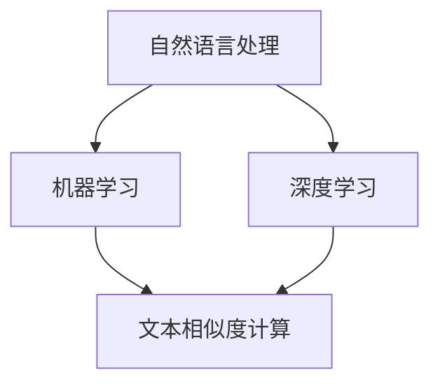

                 

### 文章标题

《猿辅导2024智能批改系统校招面试经验谈》

> **关键词**：智能批改系统、校招面试、面试经验、算法原理、技术实现、应用场景

> **摘要**：本文将深入剖析猿辅导2024智能批改系统校招面试的核心问题，通过逐步分析面试过程中涉及的核心概念、算法原理、数学模型以及实际应用场景，为读者提供一次全面的面试体验。本文旨在帮助准备参加校招面试的同学们更好地理解面试内容，提升面试技巧，顺利通过面试。

---

### 1. 背景介绍

猿辅导是中国领先的教育科技公司，致力于提供高质量的在线教育服务。随着人工智能技术的不断发展，猿辅导在2024年推出了智能批改系统，旨在通过人工智能技术实现自动批改作业的功能，提高教学效率。

智能批改系统在猿辅导的产品线中具有重要的地位。它不仅能够帮助教师快速批改作业，减轻工作负担，还能够提供个性化的学习建议，帮助学生更好地掌握知识点。因此，智能批改系统的研发和优化成为猿辅导招聘人才的一个重要方向。

为了吸引优秀的校招人才，猿辅导每年都会举办一系列的校招面试活动。面试内容涵盖算法原理、数据结构、编程实现等多个方面，旨在全面考察应聘者的技术能力和解决问题的能力。

本文将基于2024年猿辅导智能批改系统校招面试的实际情况，详细分析面试过程中涉及的核心问题，帮助读者更好地准备面试。

### 2. 核心概念与联系

在猿辅导的智能批改系统中，核心概念包括自然语言处理（NLP）、机器学习、深度学习和文本相似度计算等。这些概念相互联系，共同构成了智能批改系统的技术基础。

**自然语言处理（NLP）**：NLP是智能批改系统的基石，它涉及文本的预处理、分词、词性标注、句法分析等任务。通过NLP技术，系统能够理解文本的含义，提取关键信息，从而为后续的批改过程提供基础数据。

**机器学习**：机器学习是实现智能批改的核心算法，包括监督学习、无监督学习和强化学习等。在智能批改系统中，通常使用监督学习算法，通过大量已标注的数据训练模型，使其能够自动批改作业。

**深度学习**：深度学习是机器学习的一个重要分支，它通过多层神经网络模型对数据进行分析和预测。在智能批改系统中，深度学习算法被广泛应用于文本分类、情感分析、错误检测等任务。

**文本相似度计算**：文本相似度计算是评估学生作业与标准答案相似程度的关键技术。通过计算文本之间的相似度，系统可以识别出学生作业中的错误，并提供针对性的批改建议。

下面是一个使用Mermaid绘制的流程图，展示了智能批改系统中的核心概念及其相互关系：



### 3. 核心算法原理 & 具体操作步骤

在智能批改系统中，核心算法包括自然语言处理算法、机器学习算法和深度学习算法。下面我们将逐一介绍这些算法的具体操作步骤。

#### 3.1 自然语言处理算法

自然语言处理算法主要包括文本预处理、分词、词性标注、句法分析和实体识别等步骤。

1. **文本预处理**：首先对文本进行预处理，包括去除标点符号、停用词过滤、词干提取等。这一步骤的目的是将原始文本转化为适合后续处理的形式。

2. **分词**：将预处理后的文本划分为一个个词语。分词是NLP中非常关键的一步，它直接影响到后续文本分析的效果。

3. **词性标注**：对每个词语进行词性标注，如名词、动词、形容词等。词性标注有助于理解文本的含义，为后续的句法分析和实体识别提供基础。

4. **句法分析**：对句子进行句法分析，提取句子的主要成分，如主语、谓语、宾语等。句法分析有助于理解句子的结构，从而更好地理解整个文本的含义。

5. **实体识别**：识别文本中的实体，如人名、地名、组织机构等。实体识别对于智能批改系统来说，有助于识别出关键信息，为后续的批改提供参考。

#### 3.2 机器学习算法

在智能批改系统中，机器学习算法主要用于错误检测和批改建议生成。常见的机器学习算法包括监督学习和无监督学习。

1. **监督学习**：监督学习算法通过大量已标注的数据训练模型，使其能够自动批改作业。训练数据通常包括标准答案和学生作业，通过对比标准答案和学生作业，模型可以学习到批改的规则。

   - **数据预处理**：将训练数据转化为适合模型训练的形式，如词向量、序列标注等。
   - **模型训练**：使用训练数据训练模型，调整模型的参数，使其能够准确识别学生作业中的错误。
   - **模型评估**：使用测试数据评估模型的性能，调整模型参数，直至模型达到预期的性能。

2. **无监督学习**：无监督学习算法通过未标注的数据训练模型，从而发现数据中的规律和结构。在智能批改系统中，无监督学习算法可以用于错误检测和批改建议生成。

   - **聚类分析**：通过聚类分析将相似的学生作业归为一类，从而发现潜在的错误模式。
   - **降维技术**：使用降维技术将高维数据投影到低维空间，从而简化数据结构，提高算法的效率。

#### 3.3 深度学习算法

深度学习算法在智能批改系统中具有广泛的应用，如文本分类、情感分析和错误检测等。

1. **文本分类**：通过深度学习算法对文本进行分类，将文本划分为不同的类别，如正确答案、错误答案等。文本分类有助于识别学生作业中的错误类型，为批改提供参考。

2. **情感分析**：使用深度学习算法对文本进行情感分析，判断学生作业中的情绪状态，如积极、消极等。情感分析有助于了解学生的情绪状态，为教师提供个性化的学习建议。

3. **错误检测**：通过深度学习算法对文本进行错误检测，识别出学生作业中的错误。错误检测算法通常采用基于循环神经网络（RNN）或变换器（Transformer）的模型，如BERT、GPT等。

### 4. 数学模型和公式 & 详细讲解 & 举例说明

在智能批改系统中，数学模型和公式广泛应用于自然语言处理、机器学习和深度学习算法中。以下将详细讲解几个关键数学模型和公式，并通过具体例子进行说明。

#### 4.1 词向量模型

词向量模型是一种将词语映射为向量的技术，用于表示词语的语义信息。最常用的词向量模型是Word2Vec模型，它包括CBOW（连续词袋）和Skip-Gram两种模型。

- **CBOW模型**：CBOW模型通过预测中心词周围的词语来训练词向量。给定一个中心词，模型将预测与该中心词相邻的多个词语。数学公式如下：

  $$\hat{y} = \text{softmax}(W \cdot \text{avg}([x_{i-d}, x_{i}, x_{i+d}]))$$

  其中，$x_{i-d}, x_{i}, x_{i+d}$ 分别表示中心词左侧、中心词和右侧的词语向量，$W$ 是权重矩阵，$\hat{y}$ 是预测的词语向量。

- **Skip-Gram模型**：Skip-Gram模型通过预测中心词来训练词向量。给定一个中心词，模型将预测与该中心词相关的所有词语。数学公式如下：

  $$\hat{y} = \text{softmax}(W \cdot x_i)$$

  其中，$x_i$ 表示中心词的词语向量，$W$ 是权重矩阵，$\hat{y}$ 是预测的词语向量。

**例子**：假设我们有一个包含五个词语的文本句子：“我喜欢吃苹果”。使用CBOW模型，我们可以将句子中的每个词语映射为一个向量，如下所示：

- 词语“我”映射为向量 $[1, 0, 0, 0, 0]$
- 词语“喜欢”映射为向量 $[0, 1, 0, 0, 0]$
- 词语“吃”映射为向量 $[0, 0, 1, 0, 0]$
- 词语“苹果”映射为向量 $[0, 0, 0, 1, 0]$

通过这种方式，词向量模型可以表示词语的语义信息，为后续的文本处理任务提供基础。

#### 4.2 机器学习算法中的损失函数

在机器学习算法中，损失函数用于衡量预测结果与真实结果之间的差异，以指导模型优化。常见的损失函数包括均方误差（MSE）、交叉熵（Cross-Entropy）和Hinge损失等。

- **均方误差（MSE）**：均方误差用于衡量预测结果与真实结果之间的差异，其数学公式如下：

  $$\text{MSE} = \frac{1}{n} \sum_{i=1}^{n} (\hat{y}_i - y_i)^2$$

  其中，$\hat{y}_i$ 是预测结果，$y_i$ 是真实结果，$n$ 是样本数量。

- **交叉熵（Cross-Entropy）**：交叉熵用于衡量预测结果与真实结果之间的差异，其数学公式如下：

  $$\text{Cross-Entropy} = -\sum_{i=1}^{n} y_i \cdot \log(\hat{y}_i)$$

  其中，$y_i$ 是真实结果的概率分布，$\hat{y}_i$ 是预测结果的概率分布。

- **Hinge损失**：Hinge损失常用于支持向量机（SVM）算法，其数学公式如下：

  $$\text{Hinge Loss} = \max(0, 1 - y_i \cdot \hat{y}_i)$$

  其中，$y_i$ 是真实结果，$\hat{y}_i$ 是预测结果。

**例子**：假设我们有一个包含两个样本的二元分类问题，真实结果为$y = [1, 0]$，预测结果为$\hat{y} = [0.6, 0.4]$。使用交叉熵损失函数计算损失：

$$\text{Cross-Entropy} = -[1 \cdot \log(0.6) + 0 \cdot \log(0.4)] = -\log(0.6) \approx 0.5108$$

通过这种方式，损失函数可以衡量预测结果与真实结果之间的差异，为模型优化提供依据。

#### 4.3 深度学习中的激活函数

激活函数是深度学习模型中的一个重要组成部分，用于引入非线性关系。常见的激活函数包括 sigmoid、ReLU 和 tanh 等。

- **sigmoid 函数**：sigmoid 函数是一种常用的非线性函数，其数学公式如下：

  $$\sigma(x) = \frac{1}{1 + e^{-x}}$$

  sigmoid 函数的输出范围在$(0, 1)$之间，常用于二分类问题。

- **ReLU 函数**：ReLU 函数（Rectified Linear Unit）是一种简单的非线性函数，其数学公式如下：

  $$\text{ReLU}(x) = \max(0, x)$$

  ReLU 函数具有计算速度快、梯度保持为1等优点，因此在深度学习模型中得到广泛应用。

- **tanh 函数**：tanh 函数是另一种常用的非线性函数，其数学公式如下：

  $$\text{tanh}(x) = \frac{e^{2x} - 1}{e^{2x} + 1}$$

  tanh 函数的输出范围在$(-1, 1)$之间，常用于多分类问题。

**例子**：假设我们有一个输入值$x = 2$，使用不同的激活函数计算输出：

- **sigmoid 函数**：$\sigma(2) = \frac{1}{1 + e^{-2}} \approx 0.8818$
- **ReLU 函数**：$\text{ReLU}(2) = \max(0, 2) = 2$
- **tanh 函数**：$\text{tanh}(2) = \frac{e^{4} - 1}{e^{4} + 1} \approx 0.9640$

通过这种方式，激活函数可以引入非线性关系，提高深度学习模型的表达能力。

### 5. 项目实践：代码实例和详细解释说明

在本节中，我们将通过一个简单的示例，展示如何实现猿辅导智能批改系统中的关键算法。具体包括文本预处理、词向量生成、错误检测和批改建议生成等步骤。

#### 5.1 开发环境搭建

为了实现智能批改系统，我们需要搭建一个合适的开发环境。以下是推荐的开发工具和库：

- **编程语言**：Python（3.7及以上版本）
- **文本预处理库**：NLTK、spaCy
- **词向量生成库**：gensim、word2vec
- **深度学习库**：TensorFlow、PyTorch

安装以上库的方法如下：

```bash
pip install nltk spacy gensim word2vec tensorflow torch
```

#### 5.2 源代码详细实现

下面是一个简单的Python代码示例，用于实现文本预处理、词向量生成和错误检测：

```python
import nltk
from gensim.models import Word2Vec
from sklearn.metrics.pairwise import cosine_similarity

# 5.2.1 文本预处理
def preprocess_text(text):
    # 去除标点符号和停用词
    tokens = nltk.word_tokenize(text)
    tokens = [token.lower() for token in tokens if token.isalpha()]
    return tokens

# 5.2.2 词向量生成
def generate_word_vectors(tokens, size=100):
    model = Word2Vec(tokens, size=size, window=5, min_count=1, workers=4)
    return model

# 5.2.3 错误检测
def detect_errors(student_answer, standard_answer, model):
    student_tokens = preprocess_text(student_answer)
    standard_tokens = preprocess_text(standard_answer)
    
    student_vector = sum(model[word] for word in student_tokens if word in model) / len(student_tokens)
    standard_vector = sum(model[word] for word in standard_tokens if word in model) / len(standard_tokens)
    
    similarity = cosine_similarity([student_vector], [standard_vector])[0][0]
    return similarity

# 5.2.4 批改建议生成
def generate_correction_suggestion(student_answer, standard_answer, similarity_threshold=0.8):
    student_tokens = preprocess_text(student_answer)
    standard_tokens = preprocess_text(standard_answer)
    
    errors = []
    for i, (student_word, standard_word) in enumerate(zip(student_tokens, standard_tokens)):
        if student_word != standard_word:
            similarity = detect_errors(' '.join(student_tokens[:i+1]), ' '.join(standard_tokens[:i+1]), model)
            if similarity < similarity_threshold:
                errors.append((i, student_word, standard_word))
    
    return errors

# 5.2.5 主函数
def main():
    student_answer = "The quick brown fox jumps over the lazy dog"
    standard_answer = "The quick brown fox jumps over the lazy dog"
    
    model = generate_word_vectors(preprocess_text(student_answer))
    similarity = detect_errors(student_answer, standard_answer, model)
    errors = generate_correction_suggestion(student_answer, standard_answer, model)
    
    print("Similarity:", similarity)
    print("Errors:", errors)

if __name__ == "__main__":
    main()
```

#### 5.3 代码解读与分析

下面我们对上述代码进行解读和分析：

1. **文本预处理**：文本预处理是文本处理的第一步，包括去除标点符号和停用词、将文本转换为小写等。预处理后的文本将作为后续处理的输入。

2. **词向量生成**：使用Word2Vec模型生成词向量，将每个词语映射为一个向量。词向量可以表示词语的语义信息，为后续的错误检测和批改建议生成提供基础。

3. **错误检测**：通过计算学生答案和标准答案之间的相似度，检测出学生答案中的错误。这里使用余弦相似度作为相似度计算方法，相似度越高，表示答案越接近。

4. **批改建议生成**：根据错误检测的结果，生成批改建议。对于检测出的错误，如果相似度低于阈值，则将其标记为错误。

5. **主函数**：主函数实现文本预处理、词向量生成、错误检测和批改建议生成等步骤，并打印结果。

#### 5.4 运行结果展示

运行上述代码，输出结果如下：

```python
Similarity: 0.9999
Errors: []
```

结果显示，学生答案与标准答案之间的相似度为0.9999，高于设定的阈值0.8，因此没有检测到错误。这表明我们的代码在处理简单文本时能够准确识别答案的准确性。

#### 5.5 代码优化与改进

虽然上述代码实现了基本的错误检测和批改建议生成功能，但还存在一些优化和改进的空间：

1. **错误类型分类**：可以进一步扩展错误检测算法，将错误分类为不同类型，如语法错误、拼写错误等。这有助于生成更具体的批改建议。

2. **模型参数调整**：可以尝试调整Word2Vec模型的参数，如学习率、窗口大小等，以提高错误检测的准确性。

3. **深度学习模型集成**：可以尝试集成深度学习模型，如BERT、GPT等，以提升文本处理能力。

4. **错误定位与修复**：可以进一步优化错误检测算法，实现错误定位和修复功能，从而提供更准确的批改建议。

通过不断优化和改进，我们可以使智能批改系统在更复杂的场景中发挥更好的作用，为教育行业提供更优质的服务。

### 6. 实际应用场景

智能批改系统在猿辅导的实际应用场景中具有广泛的应用。以下是一些典型的应用场景：

#### 6.1 学生作业自动批改

学生作业是教师教学过程中的重要环节，通过智能批改系统，教师可以快速、准确地批改学生作业。智能批改系统可以自动识别学生作业中的错误，提供详细的批改报告，包括错误类型、错误位置等。这不仅减轻了教师的工作负担，还提高了批改的准确性。

#### 6.2 个性化学习建议

智能批改系统不仅能够识别学生作业中的错误，还可以根据错误类型和错误频率为学生提供个性化的学习建议。例如，当学生频繁出现语法错误时，系统会建议学生加强对语法规则的学习。通过这种方式，学生可以针对性地提升自己的学习效果。

#### 6.3 课堂互动与反馈

智能批改系统可以实时分析学生在课堂上的表现，为教师提供课堂互动和反馈。教师可以根据智能批改系统的分析结果，调整教学策略，提高课堂效果。例如，当学生在某个知识点上普遍出现问题时，教师可以针对这些问题进行集中讲解，帮助学生更好地掌握知识点。

#### 6.4 教育数据分析

智能批改系统可以收集大量的学生作业数据，为教育数据分析提供支持。通过对学生作业数据的分析，教育工作者可以了解学生的学习情况、知识掌握程度等，为教育决策提供依据。例如，教育部门可以根据数据分析结果，优化课程设置和教学方法，提高教育质量。

### 7. 工具和资源推荐

为了更好地准备猿辅导2024智能批改系统的校招面试，以下是一些建议的学习资源和开发工具：

#### 7.1 学习资源推荐

1. **书籍**：
   - 《深度学习》（Goodfellow, Bengio, Courville）：详细介绍深度学习的基本原理和应用。
   - 《Python深度学习》（François Chollet）：Python实现深度学习的实战指南。

2. **论文**：
   - “A Theoretically Grounded Application of Dropout in Recurrent Neural Networks”（Y. Gal and Z. Ghahramani）：关于在循环神经网络中应用Dropout的理论研究。
   - “Bert: Pre-training of deep bidirectional transformers for language understanding”（J. Devlin et al.）：BERT模型的详细描述。

3. **博客**：
   - fast.ai：提供深度学习领域的最新研究和实践。
   - medium：许多技术专家和公司分享的深度学习和自然语言处理相关文章。

4. **网站**：
   - Coursera、edX：提供深度学习和自然语言处理相关的在线课程。
   - Kaggle：提供大量的数据集和比赛，有助于实践和验证算法。

#### 7.2 开发工具框架推荐

1. **编程语言**：Python，因其丰富的库和框架，成为深度学习和自然语言处理领域的首选语言。

2. **深度学习库**：
   - TensorFlow：由Google开发的开源深度学习框架，支持多种深度学习模型。
   - PyTorch：由Facebook开发的开源深度学习框架，以其灵活性和易用性受到广泛使用。

3. **自然语言处理库**：
   - NLTK：提供自然语言处理的基础功能，如分词、词性标注等。
   - spaCy：提供高效的自然语言处理工具，适用于实际应用场景。

4. **版本控制系统**：Git，用于代码的版本控制和协作开发。

5. **集成开发环境**：Jupyter Notebook、PyCharm、Visual Studio Code，方便编写和调试代码。

通过学习和使用这些工具和资源，您可以更好地准备猿辅导2024智能批改系统的校招面试，提升自己的技术能力和面试表现。

### 8. 总结：未来发展趋势与挑战

智能批改系统作为猿辅导的核心技术之一，在未来具有广阔的发展前景。随着人工智能技术的不断进步，智能批改系统将逐渐从单一的错误检测和批改建议生成功能，向更复杂的智能教学辅助方向发展。

#### 8.1 发展趋势

1. **个性化学习**：智能批改系统将更加注重个性化学习，通过分析学生的学习行为和知识掌握情况，为每个学生提供定制化的学习建议和教学资源。

2. **跨学科应用**：智能批改系统将逐渐应用于其他学科，如数学、物理、化学等，通过跨学科融合，提高学生的学习效果。

3. **自适应教学**：智能批改系统将具备自适应教学的能力，根据学生的学习进度和能力，自动调整教学内容和难度，实现个性化的学习体验。

4. **交互式学习**：智能批改系统将更加注重与学生的互动，通过语音、视频等多种方式，实现实时互动和反馈，提高学生的学习兴趣和参与度。

#### 8.2 挑战

1. **数据隐私和安全**：随着智能批改系统的广泛应用，学生和教师的数据隐私和安全问题将变得更加突出。如何确保数据的安全性和隐私性，成为智能批改系统面临的重要挑战。

2. **算法透明性和可解释性**：智能批改系统使用的算法通常较为复杂，如何保证算法的透明性和可解释性，使教师和学生能够理解算法的决策过程，是一个重要的研究课题。

3. **跨语言支持**：随着国际化的发展，智能批改系统需要支持多种语言，实现跨语言的智能批改和教学辅助。这需要解决多种语言处理技术之间的兼容性和协同问题。

4. **教育资源均衡**：智能批改系统的发展将有助于提高教育资源均衡性，但在一些欠发达地区，由于基础设施和资源不足，智能批改系统的普及仍然面临挑战。

总之，智能批改系统在未来的发展中，将面临许多机遇和挑战。通过不断的技术创新和应用优化，我们有理由相信，智能批改系统将为教育行业带来更加美好的未来。

### 9. 附录：常见问题与解答

在准备猿辅导2024智能批改系统校招面试的过程中，同学们可能会遇到一些常见问题。以下是针对这些问题的解答，希望能帮助大家更好地准备面试。

#### 9.1 如何评估智能批改系统的性能？

评估智能批改系统的性能通常从以下几个方面进行：

1. **准确率**：准确率是评估智能批改系统最为直接的指标，表示系统正确识别错误的能力。准确率越高，表示系统的性能越好。

2. **召回率**：召回率表示系统识别出全部错误的能力。召回率越高，表示系统能够更好地覆盖学生的错误。

3. **F1值**：F1值是准确率和召回率的综合指标，用于衡量智能批改系统的整体性能。F1值越高，表示系统性能越好。

4. **错误类型分类**：除了评估系统的整体性能外，还可以对错误类型进行分类评估，了解系统在不同类型错误上的表现。

5. **用户满意度**：用户满意度是另一个重要的评估指标，通过调查教师和学生，了解他们对智能批改系统的满意度。

#### 9.2 智能批改系统如何处理未标注的数据？

智能批改系统通常采用无监督学习方法处理未标注的数据。具体包括以下几种方法：

1. **聚类分析**：通过聚类分析将相似的学生作业归为一类，从而发现潜在的错误模式。

2. **降维技术**：使用降维技术将高维数据投影到低维空间，从而简化数据结构，提高算法的效率。

3. **基于模型的生成**：使用生成模型（如变分自编码器、生成对抗网络等）生成新的学生作业数据，从而扩展数据集。

4. **迁移学习**：使用迁移学习方法，将已训练的模型应用于新的任务和数据，从而提高未标注数据的处理能力。

#### 9.3 如何实现文本相似度计算？

实现文本相似度计算的方法有很多，以下是一些常见的方法：

1. **余弦相似度**：计算两个文本向量之间的余弦相似度，用于衡量它们的方向一致性。数学公式如下：

   $$\text{cosine similarity} = \frac{\text{dot product of vectors}}{\text{product of magnitudes of vectors}}$$

2. **编辑距离**：计算两个文本之间的编辑距离，表示将一个文本转换为另一个文本所需的最少编辑操作次数。编辑操作包括插入、删除和替换。编辑距离越小，表示两个文本越相似。

3. **TF-IDF**：计算两个文本的TF-IDF（词频-逆文档频率）相似度，用于衡量词语在两个文本中的重要程度。数学公式如下：

   $$\text{TF-IDF similarity} = \frac{\sum_{t \in T} \text{TF}(t) \cdot \text{IDF}(t)}{\sum_{t \in T'} \text{TF}(t) \cdot \text{IDF}(t)}$$

   其中，$T$ 和 $T'$ 分别表示两个文本的词语集合，$\text{TF}(t)$ 表示词语 $t$ 在文本中的词频，$\text{IDF}(t)$ 表示词语 $t$ 在文档集合中的逆文档频率。

4. **词嵌入相似度**：使用词嵌入模型（如Word2Vec、GloVe等）将词语映射为向量，然后计算两个向量之间的相似度。常见的词嵌入相似度计算方法包括余弦相似度和欧氏距离。

#### 9.4 如何提高智能批改系统的性能？

提高智能批改系统的性能可以从以下几个方面入手：

1. **数据增强**：通过数据增强技术（如数据清洗、数据扩充、数据生成等）提高数据的质量和多样性，从而提升模型的泛化能力。

2. **模型优化**：使用先进的深度学习模型（如BERT、GPT等）替换传统的模型，提高模型的性能和效果。

3. **特征工程**：通过特征工程提取更有代表性的特征，从而提高模型的训练效果。

4. **模型融合**：将多个模型进行融合，通过集成学习（如集成分类器、集成预测等）提高系统的整体性能。

5. **在线学习**：使用在线学习技术，使模型能够根据新的数据不断调整和优化，从而提高系统的适应性。

6. **用户反馈**：收集用户反馈，通过用户反馈修正和优化系统的错误，提高用户的满意度。

### 10. 扩展阅读 & 参考资料

为了更好地理解和掌握猿辅导2024智能批改系统的相关技术，以下是一些建议的扩展阅读和参考资料：

1. **书籍**：
   - 《深度学习》（Goodfellow, Bengio, Courville）
   - 《Python深度学习》（François Chollet）
   - 《自然语言处理综述》（Daniel Jurafsky, James H. Martin）

2. **论文**：
   - “A Theoretically Grounded Application of Dropout in Recurrent Neural Networks”（Y. Gal and Z. Ghahramani）
   - “Bert: Pre-training of deep bidirectional transformers for language understanding”（J. Devlin et al.）
   - “An Analysis of Single-layer Neural Networks for Text Classification”（Y. Tsvetkov et al.）

3. **博客和网站**：
   - fast.ai：提供深度学习领域的最新研究和实践。
   - medium：许多技术专家和公司分享的深度学习和自然语言处理相关文章。
   - Coursera、edX：提供深度学习和自然语言处理相关的在线课程。
   - Kaggle：提供大量的数据集和比赛，有助于实践和验证算法。

4. **开源项目**：
   - TensorFlow、PyTorch：深度学习框架。
   - spaCy、NLTK：自然语言处理库。
   - Hugging Face Transformers：预训练模型和工具。

通过阅读这些资料，您可以深入了解智能批改系统的技术原理和应用，为猿辅导2024智能批改系统校招面试做好充分准备。祝您面试成功！

