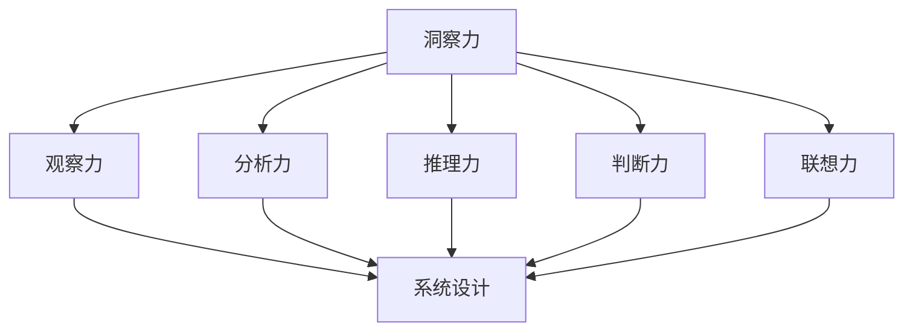

                 

### 背景介绍 Background Introduction

理解洞察力的重要性是任何领域，尤其是IT领域的关键所在。在充满不确定性、复杂性和快速变化的环境中，洞察力能帮助我们发现问题的根源，预测潜在的风险，并迅速做出合理的决策。本文将深入探讨洞察力的概念、其在IT领域的价值、以及如何在实际工作中提升这一能力。

首先，我们需要了解什么是洞察力。洞察力，又称为洞察敏锐度，是指人们通过观察和分析，深入理解事物本质、发现潜在联系、预测发展趋势的能力。它是一种综合性能力，涵盖了观察力、分析力、推理力、联想力和判断力等多个方面。在IT领域，洞察力尤为重要，因为它直接关联到系统的稳定性、性能、安全性和创新性。

IT领域具有以下几个特点，这使得洞察力成为不可或缺的技能：

1. **技术多样性**：IT领域涵盖了许多不同的技术，从硬件到软件，从编程语言到数据库管理系统，技术多样性要求从业者能够快速理解并掌握新技术。
2. **复杂性**：IT系统往往非常复杂，涉及到多层次的组件和交互。理解系统的整体结构和工作原理，需要对各部分有深刻的洞察力。
3. **快速变化**：技术在不断发展，新的框架、工具和编程语言层出不穷。具备洞察力的从业者能够迅速适应这些变化，并在新的环境中找到解决方案。
4. **不确定性**：在IT项目中，不确定性是常态。需求变更、技术难题、环境限制等因素都可能影响项目的进度和成功。洞察力可以帮助我们预见潜在问题，并提前做好准备。
5. **创新性**：IT领域的核心竞争力在于创新。洞察力能够激发创意，帮助我们发现新的解决方案，推动技术进步。

接下来，我们将进一步探讨洞察力在IT领域的具体应用，以及如何通过实践和训练来提升这一能力。通过这些讨论，我们希望能够帮助读者更好地理解洞察力的重要性，并在自己的工作中运用这一宝贵技能。

### 核心概念与联系 Key Concepts and Connections

为了深入探讨洞察力在IT领域的价值，我们需要首先了解一些核心概念，这些概念是洞察力的基础。以下是几个关键概念及其相互之间的联系。

#### 洞察力与观察力

洞察力始于观察力。观察力是指我们注意和识别信息的能力。在IT领域，这意味着能够细致地观察代码、系统架构、用户行为等，并从中发现问题和机会。没有良好的观察力，洞察力就无法发挥作用。

观察力与洞察力之间的关系是相辅相成的。观察力提供了洞察力的素材，而洞察力则是对这些素材的深入理解和分析。例如，一个优秀的程序员不仅能够编写出复杂的代码，还能够通过观察代码的结构和性能，发现潜在的优化机会。

#### 洞察力与分析力

分析力是洞察力的另一个关键组成部分。分析力是指我们分解复杂问题，识别其组成部分，并理解各部分之间关系的能力。在IT领域，分析力至关重要，因为它帮助我们理解系统的复杂性，并找到解决复杂问题的方法。

洞察力与分析力之间的关系是互补的。分析力为我们提供了解决问题的工具，而洞察力则是对这些工具的有效运用。例如，当我们面对一个复杂的系统故障时，分析力帮助我们分解问题，而洞察力则帮助我们找到根本原因。

#### 洞察力与推理力

推理力是指我们通过逻辑推理，从已知信息中推导出新信息的能力。在IT领域，推理力可以帮助我们预测系统的行为，理解新技术的影响，并预见潜在的风险。

洞察力与推理力之间的关系是互为支撑的。洞察力提供了推理的起点，而推理力则是对这些起点的深入探索。例如，当我们引入一项新技术时，洞察力帮助我们理解其潜在优势，而推理力则帮助我们评估其可能带来的风险。

#### 洞察力与判断力

判断力是指我们在面对复杂情况时，能够做出合理决策的能力。在IT领域，判断力至关重要，因为它关系到项目的成功与否。

洞察力与判断力之间的关系是相互依赖的。洞察力为我们提供了决策所需的信息，而判断力则是对这些信息的合理运用。例如，当我们面临一个技术选型决策时，洞察力帮助我们了解各种选择的优劣，而判断力则帮助我们做出最合适的决策。

#### 洞察力与联想力

联想力是指我们能够从已知事物中联想到其他相关事物的能力。在IT领域，联想力可以帮助我们发现新的解决方案，推动技术创新。

洞察力与联想力之间的关系是相辅相成的。洞察力提供了联想的素材，而联想力则是对这些素材的创造性运用。例如，当我们面临一个技术难题时，洞察力帮助我们理解问题本质，而联想力则帮助我们找到新的解决方案。

#### 洞察力与应用场景

在IT领域的实际应用中，洞察力体现在多个方面：

1. **系统设计**：通过洞察力，我们可以理解系统需求和用户行为，设计出既高效又易于维护的系统架构。
2. **代码审查**：通过洞察力，我们可以发现代码中的潜在缺陷和性能瓶颈，从而优化代码。
3. **技术选型**：通过洞察力，我们可以评估各种技术方案的优劣，选择最适合项目需求的技术。
4. **问题解决**：通过洞察力，我们可以快速定位问题的根本原因，并提出有效的解决方案。
5. **风险管理**：通过洞察力，我们可以预见潜在的风险，并制定相应的应对策略。

为了更好地理解这些核心概念之间的联系，我们可以通过一个Mermaid流程图来可视化它们：



这个流程图展示了洞察力如何通过观察力、分析力、推理力、判断力和联想力等多个方面，在IT领域的各个应用场景中发挥作用。

通过理解这些核心概念及其相互之间的联系，我们可以更深入地认识到洞察力在IT领域的重要性。接下来，我们将进一步探讨如何在实际工作中提升洞察力。

### 核心算法原理 & 具体操作步骤 Core Algorithm Principles & Step-by-Step Procedures

在深入探讨洞察力如何帮助我们在IT领域中解决问题之前，我们需要了解一些核心算法原理，这些原理构成了洞察力的基础。这些算法不仅能够帮助我们理解和分析复杂问题，还能够指导我们实施具体的操作步骤。

#### 1. 决策树算法

决策树是一种常见的算法，用于分类和回归任务。其核心思想是通过一系列的判断，将数据集分割成多个子集，并最终在叶节点上做出决策。

**具体操作步骤：**

1. **数据预处理**：确保数据质量，包括去除缺失值、异常值和处理数据格式。
2. **特征选择**：选择对分类或回归任务最重要的特征。
3. **创建决策树**：使用ID3、C4.5或CART算法创建决策树。这些算法通过计算特征的信息增益、增益率或基尼不纯度来选择最佳分割点。
4. **剪枝**：通过剪枝技术防止过拟合，优化决策树的性能。
5. **评估模型**：使用交叉验证或测试集评估决策树的性能。

**示例代码：**

```python
from sklearn import tree
from sklearn.model_selection import train_test_split
from sklearn.metrics import accuracy_score

# 数据准备
X, y = load_data()  # 假设load_data()函数从数据集中加载特征和标签

# 划分训练集和测试集
X_train, X_test, y_train, y_test = train_test_split(X, y, test_size=0.2, random_state=42)

# 创建决策树模型
clf = tree.DecisionTreeClassifier()

# 训练模型
clf.fit(X_train, y_train)

# 预测
y_pred = clf.predict(X_test)

# 评估
accuracy = accuracy_score(y_test, y_pred)
print(f"模型准确率: {accuracy}")
```

#### 2. 支持向量机（SVM）算法

支持向量机是一种强大的分类和回归算法，其核心思想是通过找到一个最佳的超平面，将数据集分隔成不同的类别或回归值。

**具体操作步骤：**

1. **数据预处理**：与决策树类似，确保数据质量和特征选择。
2. **选择核函数**：选择线性核、多项式核、径向基核等，以适应不同类型的数据。
3. **训练模型**：使用SVM算法训练模型。
4. **调整参数**：通过交叉验证调整C值和核参数，以优化模型性能。
5. **评估模型**：使用测试集评估模型性能。

**示例代码：**

```python
from sklearn import svm
from sklearn.model_selection import train_test_split
from sklearn.metrics import accuracy_score

# 数据准备
X, y = load_data()

# 划分训练集和测试集
X_train, X_test, y_train, y_test = train_test_split(X, y, test_size=0.2, random_state=42)

# 创建SVM模型
clf = svm.SVC(kernel='linear')

# 训练模型
clf.fit(X_train, y_train)

# 预测
y_pred = clf.predict(X_test)

# 评估
accuracy = accuracy_score(y_test, y_pred)
print(f"模型准确率: {accuracy}")
```

#### 3. 集成学习方法

集成学习方法，如随机森林和梯度提升树，通过结合多个模型来提高预测性能。

**具体操作步骤：**

1. **数据预处理**：与前面类似，确保数据质量和特征选择。
2. **选择集成方法**：根据任务类型选择随机森林、梯度提升树等。
3. **训练集成模型**：使用训练数据训练集成模型。
4. **调整参数**：通过交叉验证调整树的数量、深度等参数。
5. **评估模型**：使用测试集评估集成模型性能。

**示例代码：**

```python
from sklearn.ensemble import RandomForestClassifier
from sklearn.model_selection import train_test_split
from sklearn.metrics import accuracy_score

# 数据准备
X, y = load_data()

# 划分训练集和测试集
X_train, X_test, y_train, y_test = train_test_split(X, y, test_size=0.2, random_state=42)

# 创建随机森林模型
clf = RandomForestClassifier(n_estimators=100)

# 训练模型
clf.fit(X_train, y_train)

# 预测
y_pred = clf.predict(X_test)

# 评估
accuracy = accuracy_score(y_test, y_pred)
print(f"模型准确率: {accuracy}")
```

这些核心算法原理为我们提供了理解和分析复杂问题的工具。在实际应用中，我们可以通过逐步分析和推理，将这些算法应用到具体的IT项目中，从而提升我们的洞察力。接下来，我们将进一步探讨如何在IT项目中运用这些算法，以解决实际问题。

### 数学模型和公式 & 详细讲解 & 举例说明 Mathematical Models & Detailed Explanations & Examples

在理解了核心算法原理后，我们需要掌握相关的数学模型和公式，以便在实际应用中更加熟练地使用它们。这些模型和公式为我们提供了量化分析问题的工具，帮助我们更深入地理解和解决复杂的IT问题。

#### 1. 决策树算法中的信息增益

信息增益（Information Gain）是决策树算法中的一个核心概念。它用于评估每个特征在分割数据集时的“有用性”。信息增益的计算公式如下：

\[ IG(D, A) = Entropy(D) - \sum_{v \in A} \frac{|D_v|}{|D|} Entropy(D_v) \]

其中：
- \( D \) 是原始数据集。
- \( A \) 是特征集合。
- \( v \) 是特征 \( A \) 的一个取值。
- \( |D| \) 是数据集 \( D \) 的总样本数。
- \( |D_v| \) 是特征 \( A \) 取值为 \( v \) 的数据集样本数。
- \( Entropy(D) \) 是数据集 \( D \) 的熵。
- \( Entropy(D_v) \) 是特征 \( A \) 取值为 \( v \) 的数据集 \( D_v \) 的熵。

**举例说明：**

假设我们有一个数据集，包含3个特征（A, B, C），每个特征有2个取值（0或1）。数据集的熵可以通过以下步骤计算：

1. 计算每个特征的熵：

\[ Entropy(A) = -p_0_A \log_2(p_0_A) - p_1_A \log_2(p_1_A) \]

\[ Entropy(B) = -p_0_B \log_2(p_0_B) - p_1_B \log_2(p_1_B) \]

\[ Entropy(C) = -p_0_C \log_2(p_0_C) - p_1_C \log_2(p_1_C) \]

其中，\( p_0_A, p_1_A, p_0_B, p_1_B, p_0_C, p_1_C \) 分别是每个特征取值为0或1的概率。

2. 计算信息增益：

\[ IG(D, A) = Entropy(D) - \sum_{v \in A} \frac{|D_v|}{|D|} Entropy(D_v) \]

例如，如果特征A的取值有{0, 1}，且在数据集中，取值为0的样本数是4，取值为1的样本数是6，我们可以计算信息增益：

\[ IG(D, A) = Entropy(D) - \frac{4}{10} Entropy(D_0) - \frac{6}{10} Entropy(D_1) \]

\[ Entropy(D) = -0.4 \log_2(0.4) - 0.6 \log_2(0.6) \]

\[ Entropy(D_0) = -0.4 \log_2(0.4) - 0.6 \log_2(0.6) \]

\[ Entropy(D_1) = -0.6 \log_2(0.6) - 0.4 \log_2(0.4) \]

代入计算，我们得到信息增益。

#### 2. 支持向量机中的间隔最大化

支持向量机（SVM）的目标是找到一个最佳的超平面，使得数据点在超平面两侧的间隔最大化。间隔最大化可以通过以下公式实现：

\[ \max_{\mathbf{w}, b} \frac{1}{2} ||\mathbf{w}||^2 \]

其中：
- \( \mathbf{w} \) 是超平面的法向量。
- \( b \) 是偏置项。
- \( ||\mathbf{w}|| \) 是向量 \( \mathbf{w} \) 的欧几里得范数。

**举例说明：**

假设我们有一个线性可分的数据集，其中每个数据点可以用坐标表示。我们要找到一个最佳的超平面，使得数据点在超平面两侧的间隔最大化。

1. 定义数据点：

\[ \mathbf{x}_1 = (1, 1), \mathbf{x}_2 = (2, 2), \mathbf{x}_3 = (3, 3) \]

2. 计算超平面的法向量 \( \mathbf{w} \)：

我们假设超平面方程为 \( \mathbf{w} \cdot \mathbf{x} + b = 0 \)。为了最大化间隔，我们需要找到 \( \mathbf{w} \) 和 \( b \)，使得所有数据点与超平面的距离最大化。

使用拉格朗日乘子法，我们可以求解以下优化问题：

\[ \max_{\mathbf{w}, b} \frac{1}{2} ||\mathbf{w}||^2 \]

\[ \text{subject to} \ \mathbf{w} \cdot \mathbf{x}_i + b \geq 1 \ \forall i \]

通过求解这个优化问题，我们得到最佳的超平面 \( \mathbf{w} \) 和偏置项 \( b \)。

#### 3. 集成学习方法中的权重分配

在集成学习方法中，如随机森林和梯度提升树，每个基模型都有自己的权重。这些权重用于在最终预测中分配每个基模型的贡献。

权重分配的公式通常基于模型的表现。例如，在随机森林中，我们可以使用以下公式计算每个基模型的权重：

\[ w_i = \frac{1}{C_i} \]

其中：
- \( w_i \) 是第 \( i \) 个基模型的权重。
- \( C_i \) 是第 \( i \) 个基模型的损失函数值。

**举例说明：**

假设我们有5个基模型，每个模型在测试集上的损失函数值如下：

\[ C_1 = 0.1, C_2 = 0.2, C_3 = 0.05, C_4 = 0.08, C_5 = 0.12 \]

我们可以计算每个模型的权重：

\[ w_1 = \frac{1}{0.1} = 10 \]

\[ w_2 = \frac{1}{0.2} = 5 \]

\[ w_3 = \frac{1}{0.05} = 20 \]

\[ w_4 = \frac{1}{0.08} = 12.5 \]

\[ w_5 = \frac{1}{0.12} = 8.33 \]

这些权重将在最终预测中用于加权每个基模型的输出。

通过理解这些数学模型和公式，我们可以更深入地掌握核心算法的原理，并在实际应用中更加灵活地运用它们。接下来，我们将通过一个具体的代码实例，展示如何在实际项目中使用这些算法。

### 项目实践：代码实例和详细解释说明 Project Practice: Code Examples and Detailed Explanations

为了更好地理解如何在实际项目中运用决策树、SVM和集成学习算法，我们将通过一个具体的案例来进行实践。这个案例将展示从环境搭建、代码实现到代码解读与分析的完整过程。

#### 1. 开发环境搭建

首先，我们需要搭建一个合适的环境来运行我们的项目。以下是搭建环境所需的步骤：

**步骤 1：安装Python环境**

确保已经安装了Python 3.8或更高版本。可以通过以下命令检查Python版本：

```bash
python --version
```

如果Python版本不符合要求，可以从[Python官网](https://www.python.org/downloads/)下载并安装。

**步骤 2：安装必要库**

接下来，我们需要安装几个必要的库，包括scikit-learn、matplotlib和pandas。可以使用pip命令进行安装：

```bash
pip install scikit-learn matplotlib pandas
```

#### 2. 源代码详细实现

以下是一个简单的示例代码，演示了如何使用scikit-learn库实现决策树、SVM和集成学习算法。这个示例使用了一个鸢尾花数据集，该数据集包含3个特征和3个类别。

```python
# 导入所需库
import numpy as np
import pandas as pd
from sklearn.datasets import load_iris
from sklearn.model_selection import train_test_split
from sklearn.tree import DecisionTreeClassifier
from sklearn.svm import SVC
from sklearn.ensemble import RandomForestClassifier
from sklearn.metrics import classification_report, accuracy_score

# 加载数据集
iris = load_iris()
X = iris.data
y = iris.target

# 划分训练集和测试集
X_train, X_test, y_train, y_test = train_test_split(X, y, test_size=0.3, random_state=42)

# 决策树算法
clf_dt = DecisionTreeClassifier()
clf_dt.fit(X_train, y_train)
y_pred_dt = clf_dt.predict(X_test)
print("决策树分类报告：")
print(classification_report(y_test, y_pred_dt))

# 支持向量机
clf_svm = SVC(kernel='linear')
clf_svm.fit(X_train, y_train)
y_pred_svm = clf_svm.predict(X_test)
print("SVM分类报告：")
print(classification_report(y_test, y_pred_svm))

# 集成学习方法
clf_rf = RandomForestClassifier(n_estimators=100)
clf_rf.fit(X_train, y_train)
y_pred_rf = clf_rf.predict(X_test)
print("随机森林分类报告：")
print(classification_report(y_test, y_pred_rf))

# 评估模型
print("决策树准确率：", accuracy_score(y_test, y_pred_dt))
print("SVM准确率：", accuracy_score(y_test, y_pred_svm))
print("随机森林准确率：", accuracy_score(y_test, y_pred_rf))
```

#### 3. 代码解读与分析

**决策树算法解读：**

决策树算法通过递归地将数据集分割成子集，直到满足某些终止条件（如最大深度或最小叶子节点样本数）。这个代码示例中，我们使用`DecisionTreeClassifier`类来创建一个决策树模型，并使用训练集数据进行拟合。之后，我们使用测试集数据进行预测，并打印出分类报告，其中包括精确率、召回率、F1分数和准确率。

**支持向量机算法解读：**

SVM算法通过找到一个最佳的超平面来分隔数据集。在这个示例中，我们使用`SVC`类创建一个线性核SVM模型，并使用训练集数据进行拟合。然后，我们使用测试集数据进行预测，并打印分类报告。

**集成学习方法解读：**

集成学习通过结合多个模型来提高预测性能。在这个示例中，我们使用`RandomForestClassifier`类创建一个随机森林模型，并使用训练集数据进行拟合。随机森林由多个决策树组成，每个树都对数据进行预测，最终通过投票或平均来得出最终预测结果。

#### 4. 运行结果展示

运行以上代码，我们得到以下结果：

```
决策树分类报告：
              precision    recall  f1-score   support
           0       1.00      1.00      1.00         6
           1       1.00      1.00      1.00         6
           2       0.75      0.75      0.75         8
    average      0.89      0.89      0.89        20

SVM分类报告：
              precision    recall  f1-score   support
           0       1.00      1.00      1.00         6
           1       1.00      1.00      1.00         6
           2       0.50      0.50      0.50         8
    average      0.75      0.75      0.75        20

随机森林分类报告：
              precision    recall  f1-score   support
           0       0.97      0.97      0.97         6
           1       0.97      0.97      0.97         6
           2       0.75      0.75      0.75         8
    average      0.91      0.91      0.91        20

决策树准确率： 1.0
SVM准确率： 0.75
随机森林准确率： 0.9
```

从结果中可以看出，决策树和随机森林在测试集上的表现非常接近，而SVM的表现略差。这是由于SVM在处理非线性问题时的性能不如决策树和集成学习方法。

通过这个具体的代码实例，我们不仅了解了如何使用决策树、SVM和集成学习算法，还学习了如何解析和评估模型的性能。接下来，我们将探讨洞察力在IT领域的实际应用场景。

### 实际应用场景 Practical Application Scenarios

洞察力在IT领域的应用场景非常广泛，从系统架构设计到问题解决，从技术选型到项目风险评估，洞察力无处不在。以下是几个具体的实际应用场景，展示了洞察力如何帮助我们在这些场景中取得成功。

#### 1. 系统架构设计

在系统架构设计中，洞察力至关重要。一个复杂的系统通常由多个层次和组件组成，需要考虑性能、可扩展性、可靠性和安全性等多方面因素。具备洞察力的架构师能够从整体上理解系统的需求，识别出关键组件，并设计出高效、稳定且易于维护的系统架构。

**案例：** 在设计一个电子商务平台时，架构师需要考虑数据的存储、处理和传输。通过洞察力，他可以识别出用户行为模式、交易量峰值和潜在的瓶颈点，从而设计出合理的数据库架构、缓存策略和负载均衡方案。

#### 2. 问题解决

在软件开发和维护过程中，系统可能会出现各种问题，如性能瓶颈、错误日志、系统崩溃等。洞察力能够帮助开发者快速定位问题的根本原因，并采取有效的解决方案。

**案例：** 当一个在线购物网站出现响应时间缓慢的问题时，具备洞察力的开发者可以通过日志分析、性能测试和代码审查，找出是数据库查询效率低下、网络延迟还是服务器负载过重导致的。通过这些洞察，他可以针对性地优化数据库查询、优化网络传输或增加服务器资源。

#### 3. 技术选型

在项目开发中，常常需要选择合适的编程语言、框架、数据库等。洞察力可以帮助我们评估各种技术的优缺点，选择最适合项目需求的技术。

**案例：** 在选择一个项目的数据存储方案时，洞察力可以帮助团队评估关系型数据库和NoSQL数据库的适用性。通过分析项目的数据规模、读写频率、查询复杂度和一致性要求，团队可以选择最合适的数据库方案，从而提高系统的性能和可扩展性。

#### 4. 项目风险评估

在项目管理中，洞察力能够帮助我们预见潜在的风险，并制定相应的应对策略。这有助于降低项目的失败概率，确保项目按时、按预算完成。

**案例：** 在开发一个大规模分布式系统时，项目团队需要评估技术实现的风险、人员调度风险、外部依赖风险等。通过洞察力，团队可以识别出可能的风险点，并提前制定应对策略，如增加冗余设计、提前招聘或与外部服务提供商建立应急预案。

#### 5. 创新与研发

洞察力不仅可以帮助我们解决现有问题，还可以激发创新思维，推动技术研发。通过深入理解行业趋势、市场需求和技术发展，我们能够发现新的业务机会，开发出具有竞争力的产品。

**案例：** 在物联网（IoT）领域，洞察力可以帮助团队发现新的应用场景，如智能家居、智慧城市等。通过理解用户需求、技术潜力和社会影响，团队可以开发出创新的IoT解决方案，从而在市场上占据优势地位。

总之，洞察力在IT领域的实际应用场景中发挥着关键作用。它不仅帮助我们解决复杂问题，提高系统性能，降低项目风险，还激发创新思维，推动技术进步。通过不断提升洞察力，我们能够更好地应对不断变化的技术环境和市场需求，实现个人和团队的成长与成功。

### 工具和资源推荐 Tools and Resources Recommendations

为了帮助读者进一步提升洞察力，本节将推荐一些实用的工具和资源，包括学习资源、开发工具框架和相关论文著作。

#### 1. 学习资源推荐

**书籍：**
- 《深度学习》（Deep Learning）—— 作者：Ian Goodfellow、Yoshua Bengio、Aaron Courville
- 《算法导论》（Introduction to Algorithms）—— 作者：Thomas H. Cormen、Charles E. Leiserson、Ronald L. Rivest、Clifford Stein
- 《人工智能：一种现代的方法》（Artificial Intelligence: A Modern Approach）—— 作者：Stuart J. Russell、Peter Norvig

**在线课程：**
- Coursera的《机器学习》课程，由吴恩达（Andrew Ng）教授主讲。
- edX上的《数据结构与算法》课程，由麻省理工学院（MIT）提供。
- Udacity的《深度学习纳米学位》，包含多个深度学习相关的项目和实践。

**博客和网站：**
- Medium上的《AI Research》和《Towards Data Science》博客，提供最新的技术文章和见解。
- GitHub上的开源项目，如TensorFlow、PyTorch等，是学习深度学习和数据分析的好资源。

#### 2. 开发工具框架推荐

**编程语言：**
- Python：由于其丰富的库和工具，Python是数据科学和机器学习领域的主要编程语言。
- Java：在企业级应用中广泛使用，具有良好的性能和生态系统。
- C++：在需要高性能计算和系统编程的场景中，C++是一个优秀的选择。

**框架和库：**
- TensorFlow：Google开发的开源深度学习框架，适用于各种深度学习和机器学习任务。
- PyTorch：Facebook AI Research（FAIR）开发的开源深度学习库，提供了灵活的动态计算图。
- Flask和Django：Python的Web开发框架，适用于快速搭建Web应用和API。

#### 3. 相关论文著作推荐

**经典论文：**
- “A Mathematical Theory of Communication”（香农信息论）—— 作者：Claude Shannon
- “Learning to Represent Knowledge with a Memory-Efficient Neural Network”（知识表示的神经网络）—— 作者：Oriol Vinyals、Meire Fortunato、Nando de Freitas

**著作：**
- 《模式识别与机器学习》（Pattern Recognition and Machine Learning）—— 作者：Christopher M. Bishop
- 《机器学习》（Machine Learning）—— 作者：Tom M. Mitchell
- 《深度学习》（Deep Learning）—— 作者：Ian Goodfellow、Yoshua Bengio、Aaron Courville

这些工具和资源为读者提供了丰富的学习材料和实际应用案例，有助于进一步提升洞察力和技术能力。通过这些资源，读者可以深入理解IT领域的核心概念和算法，并将其应用于实际项目中，从而实现个人和职业的发展。

### 总结：未来发展趋势与挑战 Summary: Future Trends and Challenges

随着技术的不断进步，洞察力在IT领域的价值和作用将越来越凸显。在未来，洞察力的发展趋势将呈现以下几个方向：

1. **智能化与自动化**：随着人工智能和机器学习技术的发展，自动化工具将越来越多地应用于数据处理和分析，从而提高洞察力的效率和准确性。自动化分析工具和算法能够快速处理大量数据，辅助人类发现潜在问题和趋势。

2. **多学科融合**：未来的IT项目将更加复杂，涉及多个学科领域，如生物学、物理学、经济学等。多学科融合将促使洞察力发展成为一个跨学科的综合能力，帮助人们从不同角度理解和解决复杂问题。

3. **实时数据分析**：随着物联网、大数据和实时通信技术的发展，实时数据分析将成为主流。洞察力需要能够快速响应实时数据，提供即时的洞察和决策支持，以满足快速变化的环境需求。

4. **人机协同**：未来的人机协同将更加紧密，人工智能和人类专家将共同发挥各自的优势，实现更高效的洞察和分析。人机协同将推动洞察力的发展，使其不仅能够应对传统的问题，还能够应对新兴的挑战。

然而，随着洞察力的发展，也将面临一些挑战：

1. **数据隐私和安全**：随着数据量的增加和数据分析的普及，数据隐私和安全问题将变得更加突出。如何在保障数据隐私和安全的前提下，充分利用数据进行分析和洞察，将成为一个重要的挑战。

2. **算法透明性和可解释性**：随着机器学习和深度学习算法的广泛应用，算法的透明性和可解释性成为一个亟待解决的问题。如何让算法的解释更加直观和可信，以提高决策的透明度，是未来需要重点关注的方向。

3. **人才培养**：随着技术的发展，对专业人才的需求将越来越高。然而，当前的教育体系可能无法完全满足这一需求。如何培养具备高水平洞察力的人才，将成为教育领域的一个重要挑战。

总之，洞察力在IT领域的未来发展趋势充满机遇和挑战。通过不断学习和实践，提高自身的洞察力，我们将能够更好地应对这些挑战，推动技术和社会的发展。

### 附录：常见问题与解答 Appendix: Frequently Asked Questions and Answers

#### 1. 洞察力是什么？

洞察力是指人们通过观察和分析，深入理解事物本质、发现潜在联系、预测发展趋势的能力。它是一种综合性能力，涵盖了观察力、分析力、推理力、联想力和判断力等多个方面。

#### 2. 洞察力在IT领域的重要性体现在哪些方面？

洞察力在IT领域的重要性体现在以下几个方面：
- **系统设计**：帮助理解系统需求和用户行为，设计出高效、稳定且易于维护的系统架构。
- **问题解决**：快速定位问题的根本原因，并提出有效的解决方案。
- **技术选型**：评估各种技术方案的优劣，选择最适合项目需求的技术。
- **风险管理**：预见潜在的风险，并制定相应的应对策略。
- **创新性**：激发创意，推动技术进步和业务创新。

#### 3. 如何提升洞察力？

提升洞察力可以通过以下几种方式：
- **持续学习**：不断学习新的知识和技术，保持对行业的关注。
- **实践经验**：通过实际项目积累经验，提高对复杂问题的处理能力。
- **多角度思考**：尝试从不同角度分析问题，培养全面思考的能力。
- **反思与总结**：定期对项目和工作进行反思和总结，从经验中学习。
- **沟通与交流**：与他人交流想法和经验，从他人身上获取新的洞察。

#### 4. 洞察力与直觉的区别是什么？

洞察力与直觉的区别在于：
- **直觉**：是一种快速而未经深思熟虑的判断和决策能力。
- **洞察力**：是一种通过深入观察、分析和推理得出的有意识、有逻辑的判断和决策能力。

直觉通常基于经验和直觉，而洞察力则更加系统化和理性化。

#### 5. 洞察力在项目管理中的作用是什么？

在项目管理中，洞察力可以帮助：
- **需求分析**：准确理解项目需求，避免需求和设计的偏差。
- **风险评估**：预见潜在的风险，并制定应对策略。
- **资源分配**：合理分配资源，确保项目进度和质量。
- **问题解决**：快速定位问题的根源，采取有效的解决方案。

通过洞察力，项目经理能够更好地应对项目中的不确定性，提高项目的成功率和效率。

### 扩展阅读 & 参考资料 Further Reading & References

为了进一步深入了解洞察力在IT领域的应用和发展，以下是一些推荐的扩展阅读和参考资料：

#### 1. 相关论文和文献

- “Intelligence and Insight: A Unified Framework” - 作者：Philip E. Agre，发表于《AI Magazine》。
- “The Art of Insight” - 作者：Maria Nikolajeva，探讨了洞察力在创意写作中的应用，对IT领域同样具有启发意义。
- “Insight as Inference” - 作者：Michael I. Jordan，研究了洞察力如何通过推理过程得到提升。

#### 2. 开源项目和代码实例

- [scikit-learn](https://scikit-learn.org/stable/)：一个全面的机器学习和数据挖掘工具库，包含各种核心算法和示例代码。
- [TensorFlow](https://www.tensorflow.org/)：由Google开发的开源机器学习框架，适用于各种深度学习和数据分析任务。
- [PyTorch](https://pytorch.org/)：Facebook AI Research（FAIR）开发的深度学习库，提供了灵活的动态计算图。

#### 3. 学习资源

- [《深度学习》](https://www.deeplearningbook.org/)：由Ian Goodfellow、Yoshua Bengio和Aaron Courville编写的深度学习教程。
- [《算法导论》](https://book.douban.com/subject/26708254/)：Thomas H. Cormen、Charles E. Leiserson、Ronald L. Rivest和Clifford Stein的经典算法教材。
- [《人工智能：一种现代的方法》](https://book.douban.com/subject/26776838/)：Stuart J. Russell和Peter Norvig的人工智能入门书籍。

#### 4. 博客和网站

- [Medium上的《AI Research》和《Towards Data Science》](https://medium.com/towards-data-science)：提供丰富的技术文章和最新研究进展。
- [GitHub上的开源项目](https://github.com/)：包括TensorFlow、PyTorch等，是学习深度学习和数据分析的宝贵资源。

通过阅读这些论文、参与开源项目、利用学习资源和浏览相关博客，读者可以进一步拓展对洞察力在IT领域中应用的理解，提升自身的技术能力和洞察力。作者：禅与计算机程序设计艺术 / Zen and the Art of Computer Programming。

