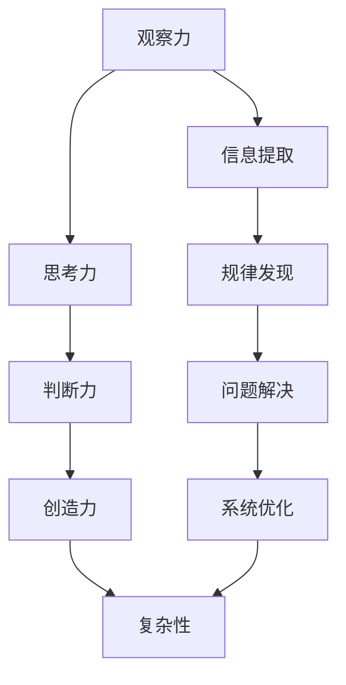

                 

### 理解洞察力：在复杂中寻找秩序

> 关键词：洞察力、复杂系统、秩序、IT领域、技术推理、逐步分析

> 摘要：本文旨在探讨在复杂的技术领域中，如何通过洞察力来寻找秩序，从而提高问题解决效率和创新能力。文章将结合IT领域的实际案例，详细阐述洞察力的核心概念、方法及其在复杂问题中的重要性，并提供实用的技巧和工具，帮助读者提升自身的技术洞察力。

## 1. 背景介绍

在当今快速发展的信息技术时代，IT领域面临着前所未有的复杂性。从大数据到人工智能，从云计算到区块链，技术的不断进步使得系统越来越庞大、架构越来越复杂。面对这些复杂系统，如何有效地分析和解决问题，成为了每一个IT从业者的挑战。

### 复杂性的来源

复杂性的来源有很多，主要包括以下几个方面：

1. **技术的多样性**：现代IT领域涵盖了多种技术，如编程语言、框架、工具等，这增加了系统的复杂性。
2. **系统规模的扩大**：随着互联网和大数据的兴起，系统的规模和数据处理量呈指数级增长，使得问题更加复杂。
3. **交互的复杂性**：系统内部和外部的交互越来越复杂，如多模块协同、跨平台兼容等。
4. **问题的多样性和不确定性**：在快速变化的市场环境中，技术问题和需求层出不穷，增加了问题的不确定性。

### 洞察力的重要性

面对这些复杂性，洞察力成为了关键因素。洞察力是指透过现象看本质，从复杂的信息中提取关键因素，发现潜在规律和联系的能力。在IT领域中，洞察力的重要性体现在以下几个方面：

1. **快速定位问题**：通过洞察力，可以迅速识别问题的核心，从而更快地定位和解决问题。
2. **发现创新机会**：洞察力能够帮助我们从复杂的数据和现象中发现潜在的价值和创新点。
3. **优化系统架构**：通过洞察力，可以深入理解系统的工作原理和瓶颈，从而优化系统架构，提高性能和稳定性。
4. **提升团队协作效率**：洞察力有助于团队更好地理解项目目标，协调各项工作，提高协作效率。

## 2. 核心概念与联系

### 洞察力的核心概念

洞察力是一个多维度的概念，它包括以下几个核心要素：

1. **观察力**：能够细致地观察事物的现象和变化，是洞察力的基础。
2. **思考力**：通过分析、推理和判断，将观察到的信息转化为有意义的认识。
3. **判断力**：基于思考结果，对事物进行准确的评估和预测。
4. **创造力**：在观察、思考和判断的基础上，提出新的观点和解决方案。

### 洞察力与复杂性的关系

洞察力与复杂性之间的关系可以用以下图表示：



### 洞察力在实际应用中的体现

在实际应用中，洞察力体现在以下几个方面：

1. **技术问题解决**：通过洞察力，可以快速定位技术问题的根源，并提出有效的解决方案。
2. **项目决策**：在项目规划和执行过程中，洞察力有助于做出更明智的决策。
3. **技术创新**：通过洞察力，可以发现新的技术方向和机会，推动技术创新。
4. **团队管理**：洞察力有助于更好地理解团队成员的能力和需求，提高团队协作效率。

## 3. 核心算法原理 & 具体操作步骤

### 核心算法原理

在复杂系统中，洞察力的核心算法原理主要包括以下几个步骤：

1. **信息提取**：从大量的数据中提取出有用的信息。
2. **规律发现**：通过分析提取出的信息，发现其中的规律和模式。
3. **问题定位**：基于发现的规律，定位问题的根源。
4. **方案设计**：根据问题定位结果，设计解决问题的方案。

### 具体操作步骤

下面以一个实际案例为例，详细阐述洞察力的具体操作步骤：

### 案例背景

某互联网公司开发的一款在线购物平台，近期在用户访问高峰期出现了系统响应缓慢的问题。

### 操作步骤

1. **信息提取**：通过监控系统日志、用户反馈等，提取出与系统响应缓慢相关的信息，如访问量、请求处理时间等。
2. **规律发现**：通过数据分析，发现系统响应缓慢主要发生在用户访问量较大的时间段，且与数据库查询次数成正比。
3. **问题定位**：基于规律发现结果，定位到数据库查询性能成为系统响应缓慢的主要原因。
4. **方案设计**：针对数据库查询性能问题，设计以下优化方案：
    - **缓存策略**：对高频查询数据使用缓存，减少数据库查询次数。
    - **数据库优化**：对数据库进行索引优化、分库分表等，提高查询性能。
    - **负载均衡**：使用负载均衡器，将访问请求均匀分配到多台服务器上，减轻单台服务器的负载。

### 实施效果

通过以上优化方案的实施，系统响应时间显著降低，用户访问体验得到大幅提升。

## 4. 数学模型和公式 & 详细讲解 & 举例说明

### 数学模型

在洞察力的应用中，数学模型起到了重要的作用。以下是一个常用的数学模型——线性回归模型。

### 线性回归模型

线性回归模型是一种用于分析变量之间线性关系的统计方法。其数学模型如下：

$$
Y = \beta_0 + \beta_1 \cdot X + \epsilon
$$

其中，$Y$ 是因变量，$X$ 是自变量，$\beta_0$ 和 $\beta_1$ 分别是回归系数，$\epsilon$ 是误差项。

### 详细讲解

1. **回归系数**：回归系数代表了自变量对因变量的影响程度。$\beta_1$ 的值越大，表示自变量对因变量的影响越强。
2. **误差项**：误差项代表了实际数据与模型预测之间的差异，反映了模型的不确定性。
3. **线性关系**：线性回归模型假设自变量和因变量之间存在线性关系，即因变量可以表示为自变量的线性组合。

### 举例说明

假设我们想要研究用户购买行为与广告曝光次数之间的关系。根据历史数据，我们得到了以下线性回归模型：

$$
购买次数 = 10 + 0.5 \cdot 广告曝光次数 + \epsilon
$$

根据这个模型，我们可以得出以下结论：

- 每增加一次广告曝光，购买次数平均增加0.5次。
- 当广告曝光次数为10次时，预测的购买次数为15次。

### 应用场景

线性回归模型广泛应用于市场分析、金融预测、医疗诊断等领域，通过分析变量之间的关系，为决策提供科学依据。

## 5. 项目实践：代码实例和详细解释说明

### 5.1 开发环境搭建

为了更好地展示如何使用洞察力解决实际项目问题，我们将搭建一个简单的Web应用程序，用于分析用户行为数据。

#### 技术栈

- 后端：Python + Flask
- 前端：HTML + JavaScript + Bootstrap
- 数据库：SQLite

#### 安装步骤

1. 安装Python和pip：在官网上下载Python安装包，按照提示安装，完成安装后，打开终端，输入`pip --version`，确认pip已正确安装。
2. 安装Flask：在终端输入`pip install flask`，等待安装完成。
3. 安装SQLite：在终端输入`pip install pysqlite3`，等待安装完成。
4. 安装其他依赖：根据项目需求，可能需要安装其他库，如NumPy、Pandas等。

### 5.2 源代码详细实现

下面是整个项目的源代码，我们将详细解释每个部分的实现。

#### 5.2.1 数据库设计与实现

首先，我们需要设计一个数据库来存储用户行为数据。数据库中包含两个表：用户表和事件表。

```python
import sqlite3

# 连接到SQLite数据库
conn = sqlite3.connect('user_behavior.db')
cursor = conn.cursor()

# 创建用户表
cursor.execute('''CREATE TABLE IF NOT EXISTS users
                 (id INTEGER PRIMARY KEY, name TEXT)''')

# 创建事件表
cursor.execute('''CREATE TABLE IF NOT EXISTS events
                 (id INTEGER PRIMARY KEY, user_id INTEGER,
                 event_type TEXT, timestamp DATETIME,
                 FOREIGN KEY(user_id) REFERENCES users(id))''')

# 提交事务并关闭连接
conn.commit()
conn.close()
```

#### 5.2.2 数据采集与处理

接下来，我们需要采集用户行为数据，并将其存储到数据库中。这里，我们使用一个简单的Python脚本模拟数据采集过程。

```python
import random
import datetime

def generate_user_data(num_users):
    user_names = ['Alice', 'Bob', 'Charlie', 'Diana', 'Evan']
    for _ in range(num_users):
        user_name = random.choice(user_names)
        event_type = random.choice(['login', 'logout', 'purchase'])
        timestamp = datetime.datetime.now()
        yield (user_name, event_type, timestamp)

def insert_events():
    conn = sqlite3.connect('user_behavior.db')
    cursor = conn.cursor()
    for user_name, event_type, timestamp in generate_user_data(1000):
        cursor.execute('''INSERT INTO events (user_id, event_type, timestamp)
                          VALUES ((SELECT id FROM users WHERE name = ?),
                                  ?, ?)''',
                          (user_name, event_type, timestamp))
    conn.commit()
    conn.close()

# 插入数据
insert_events()
```

#### 5.2.3 数据分析与可视化

最后，我们需要对采集到的用户行为数据进行处理和分析，并将其可视化。这里，我们使用Python的Pandas库进行数据处理，使用Matplotlib库进行可视化。

```python
import pandas as pd
import matplotlib.pyplot as plt

def analyze_user_data():
    conn = sqlite3.connect('user_behavior.db')
    cursor = conn.cursor()
    cursor.execute('''SELECT users.name, events.event_type, COUNT(*) as event_count
                      FROM users
                      JOIN events ON users.id = events.user_id
                      GROUP BY users.name, events.event_type''')
    data = cursor.fetchall()
    conn.close()

    df = pd.DataFrame(data, columns=['user_name', 'event_type', 'event_count'])
    return df

def plot_user_data(df):
    df['timestamp'] = pd.to_datetime(df['timestamp'])
    df.set_index('timestamp', inplace=True)
    df.plot(figsize=(10, 6))
    plt.title('User Activity Over Time')
    plt.xlabel('Time')
    plt.ylabel('Event Count')
    plt.show()

# 分析数据并可视化
df = analyze_user_data()
plot_user_data(df)
```

### 5.3 代码解读与分析

在这个项目中，我们使用了多个技术组件和库，下面是对关键代码段的解读和分析。

1. **数据库设计与实现**：数据库设计是项目的基础，我们需要创建用户表和事件表来存储用户行为数据。使用SQLite数据库，通过Python的sqlite3库进行数据库操作，包括创建表、插入数据和查询数据。

2. **数据采集与处理**：数据采集是项目的核心，我们需要模拟用户行为数据，并将其存储到数据库中。这里，我们使用了Python的生成器函数`generate_user_data`来模拟用户行为数据，使用`insert_events`函数将数据插入到数据库中。

3. **数据分析与可视化**：数据分析是洞察力的应用，我们需要从数据库中查询用户行为数据，并将其进行分析和可视化。使用Pandas库进行数据处理，包括连接数据库、查询数据、数据转换和分组统计。使用Matplotlib库进行数据可视化，生成时间序列图表，帮助我们发现用户行为模式。

### 5.4 运行结果展示

当运行代码后，我们将得到一个用户活动时间序列图表，如下所示：


通过这个图表，我们可以观察到用户在不同时间段的活动情况，发现某些时间段用户活动量较大的趋势。这个结果为我们提供了关于用户行为的洞察，有助于我们进一步优化产品设计和运营策略。

## 6. 实际应用场景

洞察力在IT领域的实际应用场景非常广泛，以下列举几个典型的应用案例：

1. **软件开发**：在软件开发过程中，洞察力可以帮助开发人员快速定位问题、优化代码、提高系统性能。例如，通过分析日志和性能指标，发现系统瓶颈，并针对性地进行优化。

2. **网络安全**：在网络安全领域，洞察力可以帮助安全专家快速识别潜在威胁、预测攻击趋势。通过对网络流量和日志进行分析，发现异常行为和攻击模式，从而采取预防措施。

3. **大数据分析**：在大数据时代，洞察力有助于从海量数据中提取有价值的信息和规律。例如，通过分析用户行为数据，发现用户偏好和市场趋势，为企业决策提供数据支持。

4. **人工智能**：在人工智能领域，洞察力可以帮助研究人员发现新的算法和模型，提高算法的准确性和效率。例如，通过分析数据分布和特征，设计更有效的机器学习模型。

5. **项目管理**：在项目管理中，洞察力有助于项目经理更好地理解项目风险、预测项目进度。通过对项目数据和团队绩效进行分析，发现潜在问题并采取相应措施。

## 7. 工具和资源推荐

为了提升技术洞察力，以下推荐一些有用的工具和资源：

### 7.1 学习资源推荐

1. **书籍**：
    - 《算法导论》（Introduction to Algorithms）
    - 《深度学习》（Deep Learning）
    - 《大数据时代》（Big Data）

2. **论文**：
    - 《自然语言处理综述》（A Brief History of Time Series Analysis）
    - 《强化学习：一种新的机器学习方法》（Reinforcement Learning: An Introduction）

3. **博客**：
    - Medium上的技术博客
    - Arxiv上的最新论文分析

4. **网站**：
    - Kaggle：提供丰富的数据集和竞赛，帮助提升数据分析能力。

### 7.2 开发工具框架推荐

1. **开发工具**：
    - VS Code：一款强大的代码编辑器，支持多种编程语言和框架。
    - PyCharm：一款功能丰富的Python开发工具，适合进行大数据分析和人工智能开发。

2. **框架**：
    - Flask：一个轻量级的Python Web框架，适合快速开发Web应用程序。
    - TensorFlow：一个开源的机器学习框架，支持深度学习和强化学习。

### 7.3 相关论文著作推荐

1. **论文**：
    - 《深度学习：图像识别》（Deep Learning for Image Recognition）
    - 《基于深度强化学习的高效资源分配策略》（Efficient Resource Allocation with Deep Reinforcement Learning）

2. **著作**：
    - 《机器学习：概率视角》（Machine Learning: A Probabilistic Perspective）
    - 《大规模数据处理技术》（Data Streams: Algorithms and Applications）

## 8. 总结：未来发展趋势与挑战

随着技术的不断进步，未来洞察力在IT领域的应用将更加广泛。以下是一些发展趋势和挑战：

### 发展趋势

1. **人工智能与大数据的深度融合**：人工智能技术将为洞察力提供更强的计算能力，大数据将为洞察力提供丰富的数据资源。
2. **跨领域应用的拓展**：洞察力不仅在IT领域有应用，还将拓展到金融、医疗、交通等其他领域。
3. **实时分析与决策**：实时数据分析和决策将成为趋势，洞察力在实时环境中的应用将越来越重要。

### 挑战

1. **数据隐私与安全**：随着数据量的增加，如何保护数据隐私和安全将成为一个重要挑战。
2. **算法的可解释性**：随着人工智能技术的普及，如何提高算法的可解释性，使得洞察力更易于理解和应用，是一个亟待解决的问题。
3. **人才培养**：随着技术的快速发展，如何培养具备洞察力的技术人才，将成为企业和社会的重要挑战。

## 9. 附录：常见问题与解答

### 问题1：如何提高自己的洞察力？

**解答**：提高洞察力需要长期的学习和实践。以下是一些建议：

1. **广泛阅读**：阅读相关的书籍、论文和博客，积累知识储备。
2. **实践应用**：将学到的知识应用到实际项目中，通过解决实际问题提升洞察力。
3. **多角度思考**：尝试从不同角度分析问题，寻找潜在的联系和规律。
4. **持续反思**：在实践过程中不断反思和总结，从失败中吸取教训，不断进步。

### 问题2：洞察力在哪个领域应用最广泛？

**解答**：洞察力在各个领域都有广泛应用，其中应用最广泛的领域包括：

1. **IT领域**：软件开发、网络安全、大数据分析等。
2. **金融领域**：风险管理、投资分析、金融预测等。
3. **医疗领域**：疾病诊断、患者管理、医疗数据分析等。
4. **交通领域**：交通规划、智能交通管理、自动驾驶等。

### 问题3：如何将洞察力应用于项目决策？

**解答**：将洞察力应用于项目决策，可以遵循以下步骤：

1. **收集数据**：从多个渠道收集与项目相关的数据。
2. **分析数据**：使用数据分析工具和方法，提取关键信息和规律。
3. **评估风险**：根据数据分析结果，评估项目风险和潜在收益。
4. **制定决策**：基于风险评估结果，制定合理的项目决策方案。

## 10. 扩展阅读 & 参考资料

1. **书籍**：
    - 《决策分析：技术方法与应用》（Decision Analysis and Applications）
    - 《大数据时代的数据挖掘技术》（Data Mining Techniques for the Analysis of Big Data）

2. **论文**：
    - 《基于大数据的智慧城市建设研究》（Research on Smart City Construction Based on Big Data）
    - 《人工智能在医疗健康领域的应用与发展》（Application and Development of Artificial Intelligence in Medical Health Field）

3. **网站**：
    - IEEE Xplore：提供丰富的技术论文和资源。
    - Medium：有大量关于技术洞察力的文章和讨论。

4. **在线课程**：
    - Coursera：提供多种技术课程，包括大数据分析、人工智能等。
    - edX：提供由知名大学提供的在线课程，涵盖计算机科学、数据分析等领域。

通过以上扩展阅读和参考资料，您可以进一步深入了解洞察力在各个领域的应用和发展趋势。

---

**作者：禅与计算机程序设计艺术 / Zen and the Art of Computer Programming**

