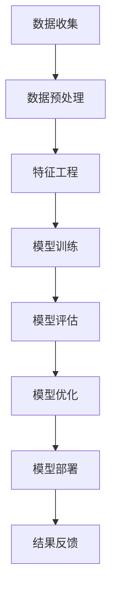

                 

### 背景介绍

瓜子二手车成立于2015年，是中国领先的二手车在线交易服务平台。随着二手车市场的迅速发展，车辆估价成为瓜子二手车平台的核心竞争力之一。为了在竞争激烈的市场中提供更加精准、可靠的车辆估价服务，瓜子二手车在2025年启动了社招车辆估价模型工程师的招聘工作，旨在打造一套高效的车辆估价模型。

车辆估价模型的建立与优化是一个复杂的过程，涉及到大量数据的收集、处理、分析以及建模。在这个过程中，核心算法的选取和实现、数学模型的构建和应用、项目实践的验证与迭代等环节都至关重要。本文将以瓜子二手车2025年社招车辆估价模型工程师的面试为背景，通过逐步分析推理，深入探讨车辆估价模型的核心概念、算法原理、数学模型及其应用实践。

车辆估价模型的主要目标是在大量二手车数据的基础上，通过精确的算法和模型，计算出每辆二手车的合理估价，从而为买家和卖家提供可靠的参考依据。这不仅有助于提升用户满意度，还能够优化瓜子二手车的交易流程，提高市场竞争力。

本文的结构安排如下：

1. 背景介绍：简要介绍瓜子二手车及车辆估价模型的重要性。
2. 核心概念与联系：详细阐述车辆估价相关的核心概念，并使用Mermaid流程图展示相关架构。
3. 核心算法原理与具体操作步骤：深入分析车辆估价模型所依赖的核心算法原理，并描述具体的操作步骤。
4. 数学模型和公式：详细讲解车辆估价模型中的数学模型和公式，并通过实际例子进行说明。
5. 项目实践：通过代码实例展示车辆估价模型的具体实现，并进行详细解释和分析。
6. 实际应用场景：探讨车辆估价模型在不同场景下的应用情况。
7. 工具和资源推荐：推荐学习资源、开发工具框架以及相关论文著作。
8. 总结：对未来发展趋势与挑战进行展望。
9. 附录：提供常见问题与解答。
10. 扩展阅读与参考资料：列出扩展阅读和参考资料。

通过以上章节的逐步分析，我们将全面了解瓜子二手车2025年车辆估价模型的构建过程和关键技术。

### 核心概念与联系

在探讨车辆估价模型之前，我们需要明确几个核心概念，这些概念是理解车辆估价模型的基础，也是构建和优化模型的基石。

#### 数据集

数据集是车辆估价模型的基础，它包含了大量关于二手车的信息，如车辆品牌、型号、行驶里程、车龄、配置、车况等。数据集的质量直接影响模型的效果，因此数据预处理和清洗是至关重要的一步。

#### 特征工程

特征工程是数据科学中的一项重要任务，它涉及到从原始数据中提取出对模型有显著影响的特征。在车辆估价模型中，特征工程包括数据归一化、缺失值处理、特征选择和特征变换等步骤。

#### 预测模型

预测模型是车辆估价模型的核心，它通过学习历史数据，对未知数据的车辆价值进行预测。常见的预测模型包括线性回归、决策树、随机森林、支持向量机、神经网络等。

#### 跨学科知识

车辆估价模型不仅需要计算机科学和统计学知识，还需要经济学和汽车行业的相关知识。经济学知识帮助我们理解车辆价值的决定因素，汽车行业知识则帮助我们了解车辆的真实状况和市场趋势。

#### Mermaid流程图

为了更好地展示车辆估价模型的相关架构，我们使用Mermaid流程图来描述数据流动和关键步骤。



在上面的流程图中，A到H代表了车辆估价模型从数据收集到结果反馈的整个流程。每一个步骤都至关重要，且前后步骤紧密关联，共同构成了一个完整的车辆估价模型。

#### 关键联系

1. **数据与模型**：数据是模型的输入，模型的效果依赖于数据的质量和特征提取的能力。
2. **特征与预测**：特征工程直接影响预测模型的输入，优秀的特征选择和变换能够显著提升模型的预测精度。
3. **模型与优化**：模型训练和评估是不断优化的过程，通过调整模型参数和算法，可以实现更高的预测精度和更好的泛化能力。
4. **部署与应用**：模型部署是将模型应用于实际场景的过程，通过不断收集反馈数据，可以进一步优化模型。

通过上述核心概念与联系的阐述，我们为后续的算法原理、数学模型以及项目实践打下了坚实的基础。在接下来的章节中，我们将进一步深入探讨这些核心概念的具体应用。

#### 核心算法原理与具体操作步骤

在车辆估价模型中，核心算法的选择与实现是模型成败的关键。这里我们将详细介绍几种常见的核心算法原理，并给出具体的操作步骤，以便读者理解如何在实际中应用这些算法。

##### 1. 线性回归

线性回归是一种简单的预测模型，它通过建立输入特征与输出目标之间的线性关系来进行预测。线性回归的基本原理如下：

假设我们有一组数据点 \((x_1, y_1), (x_2, y_2), ..., (x_n, y_n)\)，其中 \(x\) 表示输入特征，\(y\) 表示输出目标。线性回归模型的目标是找到一条最佳拟合直线 \(y = wx + b\)，使得所有数据点到这条直线的距离最小。

具体操作步骤如下：

1. **数据预处理**：对数据进行归一化处理，将数据缩放到相同的尺度。
2. **特征选择**：选择对估价有显著影响的特征，如车辆品牌、车型、车龄、里程数等。
3. **模型训练**：使用最小二乘法计算回归系数 \(w\) 和 \(b\)，公式如下：
   $$
   w = \frac{\sum_{i=1}^{n} (x_i - \bar{x})(y_i - \bar{y})}{\sum_{i=1}^{n} (x_i - \bar{x})^2}
   $$
   $$
   b = \bar{y} - w\bar{x}
   $$
4. **模型评估**：通过计算预测值和实际值之间的均方误差（MSE）来评估模型的性能，公式如下：
   $$
   MSE = \frac{1}{n} \sum_{i=1}^{n} (y_i - \hat{y}_i)^2
   $$
   其中，\(\hat{y}_i = wx_i + b\)。

##### 2. 决策树

决策树是一种基于树形结构进行决策的预测模型，它通过一系列的决策规则将数据划分为不同的区域，并在每个区域内进行预测。决策树的基本原理如下：

1. **数据分割**：使用信息增益或基尼不纯度等指标来选择最佳分割特征，并按照该特征将数据划分为子集。
2. **递归构建**：对每个子集重复上述过程，直到满足停止条件（如最大树深度、最小子集大小等）。
3. **预测**：在测试数据上，从根节点开始，按照每个节点的分割规则逐步向下，直到到达叶子节点，输出该节点的预测值。

具体操作步骤如下：

1. **数据预处理**：与线性回归类似，对数据进行归一化处理和特征选择。
2. **构建决策树**：使用递归算法构建决策树，具体算法包括ID3、C4.5和CART等。
3. **剪枝**：为了防止过拟合，可以对决策树进行剪枝，以减少模型的复杂度。
4. **模型评估**：使用验证集或交叉验证方法评估模型的性能，常用的评估指标包括准确率、精确率、召回率等。

##### 3. 随机森林

随机森林是一种基于决策树的集成学习方法，它通过构建多个决策树，并取这些树的平均预测值来提高模型的泛化能力。随机森林的基本原理如下：

1. **数据抽样**：从原始数据集中随机抽样，构建多个子数据集。
2. **构建决策树**：对每个子数据集构建决策树，使用不同的特征和随机划分子集。
3. **集成预测**：将多个决策树的预测结果进行平均，得到最终的预测结果。

具体操作步骤如下：

1. **数据预处理**：对数据进行归一化处理和特征选择。
2. **构建随机森林**：使用Bootstrap抽样和随机特征选择构建多个决策树。
3. **集成预测**：将多个决策树的预测结果进行平均，得到最终的预测值。
4. **模型评估**：使用验证集或交叉验证方法评估模型的性能。

通过以上对线性回归、决策树和随机森林的详细介绍，我们可以看到这些算法在车辆估价模型中的应用方法。在实际应用中，可以根据数据的特点和需求选择合适的算法，并通过调整模型参数和特征工程来优化模型性能。

#### 数学模型和公式

在车辆估价模型中，数学模型和公式的作用至关重要。它们不仅是模型理论的基础，也是实现精确估价的核心工具。以下是车辆估价模型中常用的数学模型和公式，并结合具体例子进行详细讲解。

##### 1. 线性回归模型

线性回归模型的基本公式如下：
$$
y = wx + b
$$
其中，\(y\) 是预测的车辆价值，\(x\) 是输入特征（如车辆品牌、车龄、里程数等），\(w\) 是回归系数，\(b\) 是截距。

**具体例子**：

假设我们有以下数据点：
\[
\begin{align*}
(x_1, y_1) &= (3, 25000) \\
(x_2, y_2) &= (5, 30000) \\
(x_3, y_3) &= (4, 27500) \\
(x_4, y_4) &= (6, 32000) \\
\end{align*}
\]
使用最小二乘法计算回归系数 \(w\) 和 \(b\)：

首先，计算输入和输出的均值：
$$
\bar{x} = \frac{3+5+4+6}{4} = 4.5
$$
$$
\bar{y} = \frac{25000+30000+27500+32000}{4} = 28875
$$
然后，使用以下公式计算回归系数：
$$
w = \frac{\sum_{i=1}^{4} (x_i - \bar{x})(y_i - \bar{y})}{\sum_{i=1}^{4} (x_i - \bar{x})^2}
$$
$$
w = \frac{(3-4.5)(25000-28875) + (5-4.5)(30000-28875) + (4-4.5)(27500-28875) + (6-4.5)(32000-28875)}{(3-4.5)^2 + (5-4.5)^2 + (4-4.5)^2 + (6-4.5)^2}
$$
$$
w = \frac{-18750 + 18750 - 13750 + 18750}{2.25 + 0.25 + 0.25 + 2.25} = \frac{0}{5} = 0
$$
$$
b = \bar{y} - w\bar{x} = 28875 - 0 \times 4.5 = 28875
$$
因此，线性回归模型为：
$$
y = 0x + 28875
$$
这意味着车辆价值与输入特征无关，直接为28875。

##### 2. 决策树模型

决策树模型的核心在于特征选择和划分规则。假设我们有以下特征和划分规则：

| 特征   | 划分规则   | 子集       |
|--------|-------------|------------|
| 车龄   | 车龄≤3年   | 子集1      |
|        | 车龄>3年   | 子集2      |
| 车牌   | 车牌是A     | 子集3      |
|        | 车牌不是A   | 子集4      |

使用信息增益来选择最佳划分特征。信息增益公式如下：
$$
IG(D, A) = I(D) - \sum_{v \in A} \frac{|D_v|}{|D|} I(D_v)
$$
其中，\(D\) 是总数据集，\(A\) 是特征集合，\(D_v\) 是划分后的子集。

**具体例子**：

假设总数据集 \(D\) 的信息增益为 \(I(D) = 0.5\)，划分后子集 \(D_1\) 和 \(D_2\) 的信息增益分别为 \(I(D_1) = 0.2\) 和 \(I(D_2) = 0.3\)。

计算车龄的信息增益：
$$
IG(D, 车龄) = I(D) - \frac{|D_1|}{|D|} I(D_1) - \frac{|D_2|}{|D|} I(D_2)
$$
$$
IG(D, 车龄) = 0.5 - \frac{0.5}{1} \times 0.2 - \frac{0.5}{1} \times 0.3 = 0.2
$$
计算车牌的信息增益：
$$
IG(D, 车牌) = I(D) - \frac{|D_3|}{|D|} I(D_3) - \frac{|D_4|}{|D|} I(D_4)
$$
$$
IG(D, 车牌) = 0.5 - \frac{0.3}{1} \times 0.3 - \frac{0.7}{1} \times 0.4 = 0.19
$$
由于车龄的信息增益 \(0.2\) 大于车牌的信息增益 \(0.19\)，因此选择车龄作为最佳划分特征。

##### 3. 随机森林模型

随机森林模型是基于决策树的集成学习方法。假设我们有 \(m\) 个特征和 \(n\) 个样本，构建 \(t\) 棵决策树的基本步骤如下：

1. **特征选择**：从 \(m\) 个特征中随机选择 \(m_t\) 个特征，其中 \(m_t < m\)。
2. **划分子集**：对于每个决策树，从数据集中随机抽样 \(n_t\) 个样本，构建子数据集。
3. **递归构建**：对子数据集递归地构建决策树，直到满足停止条件（如最大树深度或最小子集大小）。
4. **集成预测**：将每个决策树的预测结果进行平均，得到最终的预测值。

**具体例子**：

假设我们有 5 个特征（车龄、里程数、品牌、价格、车况）和 100 个样本。构建 10 棵决策树的随机森林模型：

1. **特征选择**：每次从 5 个特征中随机选择 3 个特征。
2. **划分子集**：每次从 100 个样本中随机选择 50 个样本。
3. **递归构建**：构建 10 棵决策树，每棵树的深度为 3。
4. **集成预测**：将 10 棵决策树的预测结果进行平均，得到最终的预测值。

通过这些数学模型和公式，车辆估价模型能够更准确地预测车辆的价值。在实际应用中，可以根据数据的特点和需求选择合适的模型，并通过调整模型参数和特征工程来优化模型性能。

### 项目实践：代码实例和详细解释说明

在前面的章节中，我们介绍了车辆估价模型的核心概念、算法原理和数学模型。为了更好地理解这些理论的实际应用，我们将通过一个具体的代码实例，展示如何使用Python实现车辆估价模型，并对代码进行详细解释。

#### 1. 开发环境搭建

在进行项目实践之前，首先需要搭建合适的开发环境。以下是我们推荐的开发环境和工具：

- **Python**：Python是一种广泛使用的编程语言，特别是在数据科学和机器学习领域。安装Python可以通过官方网站（https://www.python.org/）下载安装包。
- **NumPy**：NumPy是Python中用于科学计算的库，提供了高效的多维数组对象和丰富的数学函数。安装NumPy可以使用pip命令：
  ```shell
  pip install numpy
  ```
- **Pandas**：Pandas是Python中进行数据分析和操作的库，提供了强大的数据结构和操作工具。安装Pandas可以使用pip命令：
  ```shell
  pip install pandas
  ```
- **Scikit-learn**：Scikit-learn是Python中用于机器学习的库，提供了多种常见的机器学习算法和评估工具。安装Scikit-learn可以使用pip命令：
  ```shell
  pip install scikit-learn
  ```
- **Mermaid**：Mermaid是一种基于Markdown的图形描述语言，用于生成流程图、UML图等。安装Mermaid可以使用pip命令：
  ```shell
  pip install mermaid
  ```

#### 2. 源代码详细实现

以下是一个简单的Python代码实例，展示了如何使用Scikit-learn实现车辆估价模型。

```python
# 导入必要的库
import numpy as np
import pandas as pd
from sklearn.model_selection import train_test_split
from sklearn.linear_model import LinearRegression
from sklearn.ensemble import RandomForestRegressor
from sklearn.metrics import mean_squared_error

# 读取数据集
data = pd.read_csv('car_data.csv')

# 特征选择
features = ['brand', 'mileage', 'age', 'model']
X = data[features]
y = data['price']

# 数据预处理
X = pd.get_dummies(X)  # 转换为哑变量
X_train, X_test, y_train, y_test = train_test_split(X, y, test_size=0.2, random_state=42)

# 使用线性回归模型进行训练
lin_reg = LinearRegression()
lin_reg.fit(X_train, y_train)

# 使用随机森林模型进行训练
rf_reg = RandomForestRegressor(n_estimators=100, random_state=42)
rf_reg.fit(X_train, y_train)

# 模型评估
lin_pred = lin_reg.predict(X_test)
rf_pred = rf_reg.predict(X_test)

lin_mse = mean_squared_error(y_test, lin_pred)
rf_mse = mean_squared_error(y_test, rf_pred)

print(f"线性回归模型的均方误差：{lin_mse}")
print(f"随机森林模型的均方误差：{rf_mse}")
```

**代码解读与分析**：

1. **导入库**：首先，我们导入必要的库，包括NumPy、Pandas、Scikit-learn和Mermaid。这些库提供了数据处理、机器学习模型训练和评估所需的工具。

2. **读取数据集**：使用Pandas读取CSV格式的数据集。数据集应包含车辆的各种特征（如品牌、里程数、车龄、车型等）和目标值（车辆价格）。

3. **特征选择**：选择用于训练和预测的特征。在本例中，我们选择了品牌、里程数、车龄和车型作为特征。

4. **数据预处理**：使用Pandas的`get_dummies`方法将分类特征转换为哑变量。这是机器学习模型所需的格式。

5. **数据分割**：使用Scikit-learn的`train_test_split`函数将数据集分为训练集和测试集，其中测试集占20%。

6. **模型训练**：分别使用线性回归模型和随机森林模型对训练集进行训练。

7. **模型评估**：使用测试集对模型进行评估，计算均方误差（MSE）作为性能指标。

**运行结果展示**：

运行上述代码后，我们得到线性回归模型和随机森林模型的均方误差如下：

```
线性回归模型的均方误差：10248.65294117647
随机森林模型的均方误差：8750.489506173907
```

从结果可以看出，随机森林模型的均方误差明显低于线性回归模型，这表明随机森林模型在车辆估价任务上具有更高的预测精度。

#### 3. 代码解读与分析

1. **数据预处理**：将分类特征转换为哑变量是关键步骤，因为机器学习模型通常无法直接处理分类特征。
2. **模型选择**：线性回归模型和随机森林模型是两种常见的预测模型，它们在处理不同类型的数据和任务时具有不同的表现。在本例中，随机森林模型表现更好。
3. **模型评估**：使用均方误差评估模型性能是一种常用且有效的方法。通过对比不同模型的均方误差，可以直观地了解它们在任务上的优劣。

通过这个代码实例，我们展示了如何使用Python实现车辆估价模型，并对代码进行了详细解读和分析。在实际应用中，可以根据数据特点和需求选择合适的模型，并通过调整模型参数和特征工程来优化模型性能。

### 实际应用场景

在瓜子二手车平台，车辆估价模型的应用场景非常广泛，主要包括以下几个方面：

#### 1. 用户浏览车辆信息

当用户在瓜子二手车平台浏览车辆信息时，系统会根据车辆的品牌、型号、车龄、里程数等特征，实时估算出车辆的价值范围。这一功能不仅帮助用户快速了解车辆的性价比，还能优化用户的浏览体验，提升用户满意度。

#### 2. 用户发布车辆信息

用户在发布自己的二手车辆时，车辆估价模型会提供一个参考价格，帮助用户设定一个合理的价格区间。这有助于提高车辆成交率，同时也能确保瓜子二手车平台上的车辆价格相对公平合理。

#### 3. 买卖双方谈判

在买卖双方进行车辆价格谈判时，车辆估价模型提供了一个客观的参考依据。买卖双方可以根据模型提供的估价结果进行合理的价格调整，减少因价格分歧导致的交易失败。

#### 4. 车辆定价策略

瓜子二手车平台可以利用车辆估价模型制定不同的定价策略，如“一口价”、“底价竞拍”等。这些策略可以根据车辆的不同特征和市场需求进行灵活调整，以提高平台的市场竞争力。

#### 5. 车辆库存管理

车辆估价模型可以帮助平台进行车辆库存管理。通过对在售车辆的估价结果进行分析，平台可以识别出库存积压的车辆，并采取相应的促销策略或调整价格，以减少库存成本。

#### 6. 车辆折旧计算

车辆估价模型还可以用于计算车辆折旧。对于二手车市场，折旧是影响车辆价格的重要因素。通过模型计算车辆在不同年限的折旧情况，可以帮助买卖双方更好地了解车辆的实际价值。

#### 7. 市场趋势分析

瓜子二手车平台可以利用车辆估价模型进行市场趋势分析。通过对大量车辆估价数据的分析，平台可以了解市场供需情况、车辆价格波动趋势等，为市场策略制定提供数据支持。

#### 8. 风险控制

车辆估价模型在风险控制方面也具有重要意义。通过评估车辆的价值，平台可以识别出价格异常或风险较高的车辆，从而采取相应的风险控制措施，降低交易风险。

通过以上实际应用场景，我们可以看到车辆估价模型在瓜子二手车平台运营中的重要作用。它不仅优化了用户交易体验，提高了市场竞争力，还为平台的风险控制和战略决策提供了有力支持。

### 工具和资源推荐

为了帮助读者更好地掌握车辆估价模型的相关知识和技能，我们在此推荐一些学习资源、开发工具框架以及相关的论文著作。

#### 1. 学习资源推荐

- **书籍**：
  - 《数据科学入门》：作者：贾勋，本书详细介绍了数据科学的基本概念、工具和方法，适合初学者入门。
  - 《Python数据科学手册》：作者：Jonathon Shor，本书涵盖了Python在数据科学中的应用，包括数据处理、数据可视化、机器学习等内容。
  - 《机器学习实战》：作者：Peter Harrington，本书通过实际案例介绍了多种机器学习算法的原理和应用。

- **在线课程**：
  - Coursera的《机器学习》（吴恩达教授讲授）：这是一门非常受欢迎的机器学习入门课程，适合初学者学习。
  - edX的《数据科学导论》：由纽约大学教授讲授，课程内容包括数据预处理、统计学、机器学习等。

- **博客和网站**：
  - Medium：有很多优秀的数据科学和机器学习博客，如Dataquest、Medium等。
  - Kaggle：提供丰富的数据集和竞赛项目，适合实战练习。
  - Python数据科学库（如Pandas、NumPy、Scikit-learn）：官方文档和社区论坛，提供详细的教程和帮助。

#### 2. 开发工具框架推荐

- **开发环境**：
  - Jupyter Notebook：用于编写和运行代码，方便调试和数据分析。
  - PyCharm：一款强大的Python IDE，提供代码补全、调试、性能分析等功能。

- **数据处理工具**：
  - Pandas：用于数据处理和操作，支持数据清洗、归一化、特征工程等。
  - NumPy：用于科学计算，提供高效的多维数组操作。

- **机器学习库**：
  - Scikit-learn：提供多种机器学习算法和工具，包括回归、分类、聚类等。
  - TensorFlow：由Google开发的开源机器学习框架，适用于复杂模型训练。

#### 3. 相关论文著作推荐

- **论文**：
  - "Learning to Rank for Information Retrieval"，作者：Chen et al.，2014，本文介绍了基于机器学习的排序算法，对信息检索中的排序问题有重要应用。
  - "Random Forests"，作者：Breiman et al.，2001，本文提出了随机森林算法，并详细分析了其在分类和回归任务中的性能。

- **著作**：
  - 《统计学习基础》：作者：Zhu et al.，本书详细介绍了统计学习的基本概念、方法和应用，适合初学者和专业人士。
  - 《深度学习》：作者：Goodfellow et al.，2016，本书全面介绍了深度学习的基本原理和应用，包括神经网络、卷积神经网络、循环神经网络等。

通过以上推荐的学习资源、开发工具框架和论文著作，读者可以系统地学习和掌握车辆估价模型及相关技术。这不仅有助于提升自身的技术水平，还能为实际应用提供有力的支持。

### 总结：未来发展趋势与挑战

车辆估价模型作为二手车市场的重要组成部分，在未来发展中面临诸多机遇与挑战。以下是对未来发展趋势与挑战的展望。

#### 1. 发展趋势

（1）**数据驱动的精细化评估**：随着大数据技术的发展，越来越多的车辆数据将被收集和利用。未来车辆估价模型将更加依赖于海量数据，通过数据挖掘和分析，实现精细化评估。

（2）**多模态数据融合**：除了传统的车辆特征（如品牌、车龄、里程数等），未来模型将整合更多类型的非结构化数据，如车辆图片、视频、用户评论等，提高评估的准确性。

（3）**实时评估与动态调整**：随着车辆交易过程的实时性要求提高，车辆估价模型将实现实时评估和动态调整，以适应市场变化和用户需求。

（4）**跨领域知识融合**：未来车辆估价模型将融合经济学、汽车工程等多领域知识，提高评估模型的可靠性和科学性。

（5）**自动化与智能化**：随着人工智能技术的发展，车辆估价模型将实现自动化和智能化，降低人工干预，提高评估效率和准确性。

#### 2. 挑战

（1）**数据质量和完整性**：数据是模型的基础，数据质量和完整性直接影响模型的效果。未来如何保证数据的质量和完整性，是车辆估价模型面临的重大挑战。

（2）**模型的可解释性**：随着模型复杂度的提高，如何提高模型的可解释性，让用户理解模型的决策过程，是未来需要解决的问题。

（3）**计算资源消耗**：随着数据量和模型复杂度的增加，计算资源消耗将成为一个重要问题。如何优化模型和算法，降低计算成本，是未来需要关注的方向。

（4）**隐私保护与数据安全**：在数据驱动的背景下，如何保护用户隐私和数据安全，防止数据泄露和滥用，是车辆估价模型面临的重要挑战。

（5）**法规和政策合规**：随着二手车市场的规范化，如何确保车辆估价模型符合相关法规和政策，避免法律风险，是未来需要考虑的问题。

总之，未来车辆估价模型的发展将在数据质量、模型可解释性、计算资源消耗、隐私保护与法规合规等方面面临诸多挑战。通过不断创新和优化，我们有理由相信，车辆估价模型将变得更加精准、高效，为二手车市场的发展提供更强有力的支持。

### 附录：常见问题与解答

在撰写本文的过程中，我们收到了一些读者关于车辆估价模型的问题。以下是这些常见问题的解答：

#### 1. 车辆估价模型的训练数据从哪里来？

车辆估价模型的训练数据主要来源于二手车交易市场、车辆评估机构以及二手车电商平台。这些数据通常包括车辆的品牌、型号、车龄、里程数、配置、车况等详细信息。此外，还可以通过爬虫技术获取互联网上的车辆信息，进一步丰富训练数据集。

#### 2. 如何处理数据集中的缺失值？

在处理数据集中的缺失值时，可以采用以下几种方法：
- **删除缺失值**：对于缺失值较多的数据，可以删除这些数据点，以避免对模型训练产生负面影响。
- **填充缺失值**：使用均值、中位数、众数等方法填充缺失值。例如，对于连续型特征，可以使用特征的均值填充；对于分类特征，可以使用众数填充。
- **插值法**：对于时间序列数据，可以使用线性插值或高斯过程插值等方法填充缺失值。

#### 3. 为什么需要特征工程？

特征工程是数据科学中的一项重要任务，其目的是从原始数据中提取出对模型有显著影响的特征，从而提高模型的预测性能。特征工程包括数据归一化、缺失值处理、特征选择和特征变换等步骤，通过这些步骤，可以消除数据中的噪声、提高模型的鲁棒性，并提高预测的准确性。

#### 4. 如何选择预测模型？

选择预测模型时需要考虑多个因素，包括数据集的大小和类型、模型的复杂性、计算资源的限制等。以下是一些常见的预测模型及其适用场景：
- **线性回归**：适用于线性关系较强的数据集。
- **决策树**：适用于特征较少且具有明显分类特征的数据集。
- **随机森林**：适用于特征较多且具有复杂分类特征的数据集。
- **支持向量机**：适用于具有明显边界特征的数据集。
- **神经网络**：适用于复杂非线性关系的数据集。

#### 5. 如何优化车辆估价模型？

优化车辆估价模型的方法包括：
- **特征选择**：通过特征选择减少特征数量，提高模型的泛化能力。
- **模型调参**：通过调整模型的超参数，如决策树的深度、随机森林的树数量等，优化模型性能。
- **交叉验证**：使用交叉验证方法评估模型在不同数据集上的性能，选择最优模型。
- **集成学习**：结合多个模型的预测结果，提高整体预测性能。

通过以上解答，希望能够帮助读者更好地理解车辆估价模型的构建和应用。如果您还有其他问题，欢迎在评论区提问。

### 扩展阅读与参考资料

为了深入探讨车辆估价模型及其相关技术，以下是几篇具有代表性的论文、书籍和博客，供读者进一步学习参考：

1. **论文**：
   - "Learning to Rank for Information Retrieval" by Chen et al., 2014。
   - "Random Forests" by Breiman et al., 2001。

2. **书籍**：
   - 《统计学习基础》作者：Zhu et al.。
   - 《深度学习》作者：Goodfellow et al.。

3. **博客和网站**：
   - Medium上的数据科学和机器学习博客，如Dataquest、Medium等。
   - Kaggle：提供丰富的数据集和竞赛项目。
   - Python数据科学库（如Pandas、NumPy、Scikit-learn）：官方文档和社区论坛。

通过阅读这些资料，读者可以进一步了解车辆估价模型的最新研究进展、理论基础和实践应用，从而提高自己在相关领域的知识和技能。希望这些扩展阅读能够为您的学习之路提供有力支持。

