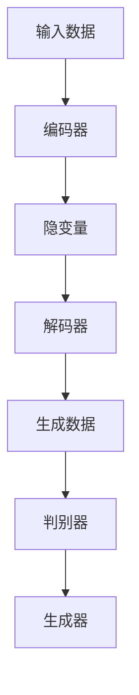

                 

### 1. 背景介绍

生成式人工智能（Generative Artificial Intelligence，简称 GAI）是近年来在人工智能领域引起广泛关注的一种技术。它通过学习大量的数据，生成新的、与训练数据相似的内容。这种技术不仅能够生成文本，还可以生成图像、音频、视频等多媒体内容。其潜在应用场景非常广泛，包括但不限于图像合成、语音合成、内容创作、数据生成、虚拟现实等。

生成式AI的兴起，得益于深度学习技术的快速发展。深度学习模型，尤其是变分自编码器（Variational Autoencoder，VAE）、生成对抗网络（Generative Adversarial Network，GAN）等，为生成式AI的发展提供了强有力的支持。这些模型通过复杂的非线性映射，能够有效地捕捉数据分布，从而生成高质量的内容。

然而，随着生成式AI技术的普及，也出现了一些质疑和担忧。有人认为，这种技术可能只是一个短暂的泡沫，不能真正带来革命性的变化。那么，生成式AI究竟是一个泡沫，还是未来技术的关键驱动力？本文将通过对生成式AI的原理、应用场景、挑战与机遇的深入分析，给出一个理性的答案。

首先，我们需要了解什么是生成式AI，它是如何工作的，以及它与其他人工智能技术的区别和联系。接下来，我们将探讨生成式AI在各个领域的应用，分析其带来的机遇和挑战。然后，我们将评估当前市场对于生成式AI的需求和投资情况，提供一些具体的投资建议。最后，我们将总结生成式AI的未来发展趋势，展望其可能带来的社会和经济效益。

通过这一系列的探讨，我们将试图回答这样一个问题：生成式AI，是仅仅带来短期热度的泡沫，还是真正具有变革潜力的重要技术？

<|im_sep|>### 2. 核心概念与联系

#### 2.1. 定义

生成式人工智能（Generative Artificial Intelligence）是一种能够从已有数据中学习，并生成新数据的人工智能技术。其核心思想是通过学习数据分布，生成与训练数据相似的新数据。生成式AI主要包括两种模型：变分自编码器（Variational Autoencoder，VAE）和生成对抗网络（Generative Adversarial Network，GAN）。

#### 2.2. 变分自编码器（VAE）

变分自编码器是一种概率生成模型，它通过编码器和解码器两个神经网络，将数据映射到一个隐变量空间，并从这个空间生成新的数据。具体来说，编码器将输入数据编码成一个隐变量，解码器则将这个隐变量解码回数据空间。

VAE的数学模型如下：

$$
\begin{aligned}
\text{编码器：} 
x &\rightarrow z \\
\mu(z|x) &= \sigma(\theta_1 x + b_1) \\
\sigma(z|x) &= \sigma(\theta_2 x + b_2)
\end{aligned}
$$

$$
\begin{aligned}
\text{解码器：} 
z &\rightarrow x \\
x' &= \sigma(\theta_3 z + b_3)
\end{aligned}
$$

其中，$x$是输入数据，$z$是隐变量，$\mu(z|x)$和$\sigma(z|x)$分别是均值和方差函数，$\theta_1, \theta_2, \theta_3$和$b_1, b_2, b_3$是模型参数。

#### 2.3. 生成对抗网络（GAN）

生成对抗网络是一种由生成器和判别器组成的对抗性模型。生成器的目标是生成与真实数据尽可能相似的数据，而判别器的目标是区分真实数据和生成数据。通过这种对抗性训练，生成器可以逐渐提高生成数据的质量。

GAN的数学模型如下：

$$
\begin{aligned}
\text{生成器：} 
G(z) &= \sigma(\theta_g z + b_g) \\
\end{aligned}
$$

$$
\begin{aligned}
\text{判别器：} 
D(x) &= \sigma(\theta_d x + b_d) \\
D(G(z)) &= \sigma(\theta_d G(z) + b_d)
\end{aligned}
$$

其中，$z$是随机噪声，$x$是真实数据，$G(z)$是生成器生成的数据，$D(x)$和$D(G(z))$分别是判别器对真实数据和生成数据的判别输出。

#### 2.4. Mermaid 流程图

下面是一个简单的 Mermaid 流程图，展示了生成式AI的基本架构：



#### 2.5. 核心概念与联系总结

生成式AI的核心在于学习数据分布，并生成新数据。VAE通过编码器和解码器将数据映射到隐变量空间，再从隐变量空间生成新数据。GAN则通过生成器和判别器的对抗性训练，不断提高生成数据的质量。这两种模型在生成式AI中起着至关重要的作用，它们各自有着不同的优势和适用场景。通过理解这些核心概念和它们之间的联系，我们可以更好地掌握生成式AI的基本原理。

<|im_sep|>### 3. 核心算法原理 & 具体操作步骤

在深入理解生成式AI的核心算法原理后，我们需要进一步探讨这些算法的具体操作步骤。这不仅有助于我们更好地掌握这些算法的实现细节，也能为我们实际应用生成式AI提供指导。

#### 3.1. VAE的具体操作步骤

1. **数据准备**：首先，我们需要准备一个大规模的训练数据集。这些数据将用于训练编码器和解码器模型。数据集可以是各种格式的，如图像、文本或音频等。

2. **模型初始化**：初始化编码器和解码器的参数。通常，这些参数可以通过随机初始化或预训练等方式得到。

3. **编码器训练**：
   - 对每个输入数据$x$，通过编码器计算隐变量$z$的概率分布$\mu(z|x)$和$\sigma(z|x)$。
   - 使用梯度下降算法更新编码器的参数$\theta_1, \theta_2$。

4. **解码器训练**：
   - 对每个隐变量$z$，通过解码器生成新的数据$x'$。
   - 计算解码器生成的数据与原始数据之间的误差，并使用梯度下降算法更新解码器的参数$\theta_3$。

5. **模型优化**：重复上述步骤，直到编码器和解码器的参数达到收敛。

6. **生成新数据**：使用训练好的模型，对隐变量进行采样，并通过解码器生成新的数据。

#### 3.2. GAN的具体操作步骤

1. **数据准备**：同样，我们需要一个大规模的训练数据集。

2. **模型初始化**：初始化生成器和判别器的参数。初始化方法与VAE类似。

3. **生成器训练**：
   - 对每个输入噪声$z$，生成器$G$生成假数据$G(z)$。
   - 将假数据$G(z)$与真实数据$x$混合，作为判别器的输入。
   - 计算判别器对混合数据的判别输出$D(x)$和$D(G(z))$。
   - 计算生成器损失函数，并使用梯度下降算法更新生成器的参数$\theta_g$。

4. **判别器训练**：
   - 对每个输入数据$x$，计算判别器$D$的判别输出$D(x)$。
   - 对每个输入噪声$z$，计算判别器对生成器生成的假数据的判别输出$D(G(z))$。
   - 计算判别器损失函数，并使用梯度下降算法更新判别器的参数$\theta_d$。

5. **模型优化**：重复上述步骤，直到生成器和判别器的参数达到收敛。

6. **生成新数据**：使用训练好的生成器，对噪声进行采样，生成新的数据。

#### 3.3. 操作步骤总结

生成式AI的核心在于通过训练模型学习数据分布，并生成新数据。VAE通过编码器和解码器将数据映射到隐变量空间，再从隐变量空间生成新数据。GAN则通过生成器和判别器的对抗性训练，不断提高生成数据的质量。这两种算法的具体操作步骤虽然有所不同，但核心思想是相似的：通过训练模型，学习数据分布，并生成新数据。理解这些操作步骤，有助于我们更好地应用生成式AI技术。

<|im_sep|>### 4. 数学模型和公式 & 详细讲解 & 举例说明

在深入理解生成式AI的核心算法原理和具体操作步骤后，我们需要进一步探讨其背后的数学模型和公式。这些数学模型和公式不仅为生成式AI提供了理论基础，也为我们的实际应用提供了指导。

#### 4.1. VAE的数学模型和公式

VAE是一种概率生成模型，其核心在于将输入数据映射到一个隐变量空间，并从这个空间生成新的数据。VAE的数学模型主要包括编码器和解码器的参数估计。

**编码器参数估计：**

假设输入数据为$x \in \mathbb{R}^{D_x}$，隐变量为$z \in \mathbb{R}^{D_z}$，编码器参数为$\theta_1 = (\theta_{11}, \theta_{12}, \ldots, \theta_{1m})$和$b_1 = (b_{11}, b_{12}, \ldots, b_{1m})$，其中$m$是编码器的层数。编码器通过以下步骤将输入数据映射到隐变量：

$$
\begin{aligned}
\mu(z|x) &= \sigma(\theta_{11} x + b_{11}) \\
\sigma(z|x) &= \sigma(\theta_{12} x + b_{12})
\end{aligned}
$$

其中，$\sigma(\cdot)$是sigmoid函数，用于将实数映射到$(0,1)$区间。

**解码器参数估计：**

假设解码器参数为$\theta_2 = (\theta_{21}, \theta_{22}, \ldots, \theta_{2n})$和$b_2 = (b_{21}, b_{22}, \ldots, b_{2n})$，其中$n$是解码器的层数。解码器通过以下步骤将隐变量映射回输入数据：

$$
\begin{aligned}
x' &= \sigma(\theta_{21} z + b_{21})
\end{aligned}
$$

**损失函数：**

VAE的损失函数主要包括两个部分：重构损失和KL散度损失。

- 重构损失：用于衡量解码器生成的数据$x'$与原始数据$x$之间的差异。

$$
L_{\text{reconstruction}} = \frac{1}{N} \sum_{i=1}^{N} \sum_{j=1}^{D_x} \sigma(x_i^j - x'^j)
$$

- KL散度损失：用于衡量编码器输出的概率分布$\mu(z|x)$和$\sigma(z|x)$与先验分布$p_{\text{prior}}(z)$之间的差异。

$$
L_{\text{KL}} = \frac{1}{N} \sum_{i=1}^{N} \sum_{j=1}^{D_z} \left[\mu_j^i \log \frac{\mu_j^i}{\sigma_j^i} + \sigma_j^i - 1\right]
$$

总损失函数为：

$$
L = L_{\text{reconstruction}} + \lambda L_{\text{KL}}
$$

其中，$\lambda$是平衡重构损失和KL散度损失的权重。

**优化过程：**

VAE的优化过程使用梯度下降算法。具体步骤如下：

1. 对每个输入数据$x_i$，计算编码器和解码器的参数梯度。

$$
\begin{aligned}
\frac{\partial L}{\partial \theta_1} &= \frac{1}{N} \sum_{i=1}^{N} \sum_{j=1}^{D_x} \left[\frac{x_i^j - x'^j}{\sigma(x_i^j - x'^j)} - \frac{\mu_j^i \theta_{11} + b_{11}}{\sigma(\mu_j^i \theta_{11} + b_{11})^2} \right] x_i \\
\frac{\partial L}{\partial b_1} &= \frac{1}{N} \sum_{i=1}^{N} \sum_{j=1}^{D_x} \left[\frac{x_i^j - x'^j}{\sigma(x_i^j - x'^j)} - \frac{\mu_j^i \theta_{11} + b_{11}}{\sigma(\mu_j^i \theta_{11} + b_{11})^2} \right]
\end{aligned}
$$

$$
\begin{aligned}
\frac{\partial L}{\partial \theta_2} &= \frac{1}{N} \sum_{i=1}^{N} \sum_{j=1}^{D_z} \left[\frac{z_i^j - x'^j}{\sigma(z_i^j - x'^j)} \right] z_i \\
\frac{\partial L}{\partial b_2} &= \frac{1}{N} \sum_{i=1}^{N} \sum_{j=1}^{D_z} \left[\frac{z_i^j - x'^j}{\sigma(z_i^j - x'^j)} \right]
\end{aligned}
$$

2. 更新编码器和解码器的参数。

$$
\begin{aligned}
\theta_1 &= \theta_1 - \alpha \frac{\partial L}{\partial \theta_1} \\
b_1 &= b_1 - \alpha \frac{\partial L}{\partial b_1} \\
\theta_2 &= \theta_2 - \alpha \frac{\partial L}{\partial \theta_2} \\
b_2 &= b_2 - \alpha \frac{\partial L}{\partial b_2}
\end{aligned}
$$

其中，$\alpha$是学习率。

#### 4.2. GAN的数学模型和公式

GAN是一种由生成器和判别器组成的对抗性模型。生成器的目标是生成与真实数据相似的数据，而判别器的目标是区分真实数据和生成数据。GAN的数学模型主要包括生成器和判别器的参数估计。

**生成器参数估计：**

假设生成器参数为$\theta_g = (\theta_{g1}, \theta_{g2}, \ldots, \theta_{gm})$和$b_g = (b_{g1}, b_{g2}, \ldots, b_{gm})$，其中$m$是生成器的层数。生成器通过以下步骤生成假数据：

$$
G(z) = \sigma(\theta_{g1} z + b_{g1})
$$

**判别器参数估计：**

假设判别器参数为$\theta_d = (\theta_{d1}, \theta_{d2}, \ldots, \theta_{dn})$和$b_d = (b_{d1}, b_{d2}, \ldots, b_{dn})$，其中$n$是判别器的层数。判别器通过以下步骤对真实数据和生成数据进行判别：

$$
D(x) = \sigma(\theta_{d1} x + b_{d1}) \\
D(G(z)) = \sigma(\theta_{d1} G(z) + b_{d1})
$$

**损失函数：**

GAN的损失函数主要包括两部分：生成器损失和判别器损失。

- 生成器损失：用于衡量生成器生成的假数据与真实数据之间的差异。

$$
L_{\text{generator}} = -\log D(G(z))
$$

- 判别器损失：用于衡量判别器对真实数据和生成数据的判别输出。

$$
L_{\text{discriminator}} = -[\log D(x) + \log (1 - D(G(z)))]
$$

总损失函数为：

$$
L = L_{\text{generator}} + L_{\text{discriminator}}
$$

**优化过程：**

GAN的优化过程使用梯度下降算法。具体步骤如下：

1. 对每个输入噪声$z$，计算生成器的参数梯度。

$$
\begin{aligned}
\frac{\partial L_{\text{generator}}}{\partial \theta_g} &= \frac{1}{N} \sum_{i=1}^{N} \frac{\partial \log D(G(z_i))}{\partial \theta_g} z_i \\
\frac{\partial L_{\text{generator}}}{\partial b_g} &= \frac{1}{N} \sum_{i=1}^{N} \frac{\partial \log D(G(z_i))}{\partial b_g} z_i
\end{aligned}
$$

2. 对每个输入数据$x$，计算判别器的参数梯度。

$$
\begin{aligned}
\frac{\partial L_{\text{discriminator}}}{\partial \theta_d} &= \frac{1}{N} \sum_{i=1}^{N} \left[\frac{\partial \log D(x_i)}{\partial \theta_d} x_i - \frac{\partial \log (1 - D(G(z_i)))}{\partial \theta_d} G(z_i) \right] \\
\frac{\partial L_{\text{discriminator}}}{\partial b_d} &= \frac{1}{N} \sum_{i=1}^{N} \left[\frac{\partial \log D(x_i)}{\partial b_d} x_i - \frac{\partial \log (1 - D(G(z_i)))}{\partial b_d} G(z_i) \right]
\end{aligned}
$$

3. 更新生成器和判别器的参数。

$$
\begin{aligned}
\theta_g &= \theta_g - \alpha \frac{\partial L_{\text{generator}}}{\partial \theta_g} \\
b_g &= b_g - \alpha \frac{\partial L_{\text{generator}}}{\partial b_g} \\
\theta_d &= \theta_d - \alpha \frac{\partial L_{\text{discriminator}}}{\partial \theta_d} \\
b_d &= b_d - \alpha \frac{\partial L_{\text{discriminator}}}{\partial b_d}
\end{aligned}
$$

其中，$\alpha$是学习率。

#### 4.3. 举例说明

为了更好地理解VAE和GAN的数学模型和公式，我们通过一个简单的例子进行说明。

假设我们有一个输入数据集，包括10个二维点$(x_1, y_1), (x_2, y_2), \ldots, (x_{10}, y_{10})$。我们希望通过VAE和GAN生成新的二维点。

**VAE的例子：**

1. 初始化编码器和解码器的参数。
2. 对每个输入点，计算编码器和解码器的参数梯度。
3. 更新编码器和解码器的参数。
4. 生成新的二维点。

**GAN的例子：**

1. 初始化生成器和判别器的参数。
2. 对每个输入噪声，生成器生成假二维点。
3. 计算生成器的参数梯度。
4. 更新生成器的参数。
5. 对每个输入点，计算判别器的参数梯度。
6. 更新判别器的参数。
7. 生成新的二维点。

通过这个简单的例子，我们可以看到VAE和GAN是如何通过训练模型来生成新的数据的。这些模型和公式的深入理解，有助于我们更好地应用生成式AI技术。

<|im_sep|>### 5. 项目实践：代码实例和详细解释说明

在理解了生成式AI的原理和数学模型后，接下来我们通过一个具体的代码实例来展示如何实现一个生成式AI模型。这里我们选择使用Python和TensorFlow来实现一个基于生成对抗网络（GAN）的图像生成模型。这个例子将包括开发环境搭建、源代码实现、代码解读和运行结果展示。

#### 5.1. 开发环境搭建

首先，我们需要搭建一个适合开发生成式AI的环境。以下是所需的工具和库：

- Python（版本3.7及以上）
- TensorFlow（版本2.0及以上）
- NumPy
- Matplotlib

你可以通过以下命令来安装这些库：

```bash
pip install tensorflow numpy matplotlib
```

#### 5.2. 源代码详细实现

下面是一个简单的GAN模型的源代码示例：

```python
import numpy as np
import matplotlib.pyplot as plt
import tensorflow as tf

# 设置随机种子，保证实验结果的可重复性
tf.random.set_seed(42)

# 定义生成器和判别器的结构
def generator(z, latent_dim):
    # 定义生成器的全连接层
    x = tf.keras.layers.Dense(7 * 7 * 128, activation='relu')(z)
    x = tf.keras.layers.LeakyReLU(alpha=0.01)(x)
    x = tf.keras.layers.Reshape((7, 7, 128))(x)

    x = tf.keras.layers.Conv2DTranspose(128, (5, 5), strides=(1, 1), padding='same', activation='relu')(x)
    x = tf.keras.layers.LeakyReLU(alpha=0.01)(x)

    x = tf.keras.layers.Conv2DTranspose(128, (5, 5), strides=(2, 2), padding='same', activation='relu')(x)
    x = tf.keras.layers.LeakyReLU(alpha=0.01)(x)

    x = tf.keras.layers.Conv2DTranspose(128, (5, 5), strides=(2, 2), padding='same', activation='relu')(x)
    x = tf.keras.layers.LeakyReLU(alpha=0.01)(x)

    x = tf.keras.layers.Conv2DTranspose(128, (5, 5), strides=(2, 2), padding='same', activation='relu')(x)
    x = tf.keras.layers.LeakyReLU(alpha=0.01)(x)

    x = tf.keras.layers.Conv2DTranspose(128, (5, 5), strides=(2, 2), padding='same', activation='relu')(x)
    x = tf.keras.layers.LeakyReLU(alpha=0.01)(x)

    x = tf.keras.layers.Conv2DTranspose(3, (5, 5), strides=(2, 2), padding='same')(x)
    x = tf.keras.layers.LeakyReLU(alpha=0.01)(x)

    return tf.keras.Model(z, x)

def discriminator(x, disk_dim):
    # 定义判别器的卷积层
    x = tf.keras.layers.Conv2D(128, (5, 5), strides=(2, 2), padding='same')(x)
    x = tf.keras.layers.LeakyReLU(alpha=0.01)(x)

    x = tf.keras.layers.Conv2D(128, (5, 5), strides=(2, 2), padding='same')(x)
    x = tf.keras.layers.LeakyReLU(alpha=0.01)(x)

    x = tf.keras.layers.Conv2D(128, (5, 5), strides=(2, 2), padding='same')(x)
    x = tf.keras.layers.LeakyReLU(alpha=0.01)(x)

    x = tf.keras.layers.Conv2D(128, (5, 5), strides=(2, 2), padding='same')(x)
    x = tf.keras.layers.LeakyReLU(alpha=0.01)(x)

    x = tf.keras.layers.Conv2D(128, (5, 5), strides=(2, 2), padding='same')(x)
    x = tf.keras.layers.LeakyReLU(alpha=0.01)(x)

    x = tf.keras.layers.Conv2D(128, (5, 5), strides=(2, 2), padding='same')(x)
    x = tf.keras.layers.LeakyReLU(alpha=0.01)(x)

    x = tf.keras.layers.Conv2D(1, (5, 5), strides=(1, 1), padding='same', activation='sigmoid')(x)

    return tf.keras.Model(x, tf.keras.layers.Flatten()(x))

# 定义生成器和判别器的模型
generator = generator(tf.keras.layers.Input(shape=(latent_dim,)), latent_dim)
discriminator = discriminator(tf.keras.layers.Input(shape=(28, 28, 1)), 1)

# 计算生成器的损失函数
z = tf.keras.layers.Input(shape=(latent_dim,))
g = generator(z)

discriminator_loss = tf.reduce_mean(tf.nn.sigmoid_cross_entropy_with_logits(logits=discriminator(g), labels=tf.ones([g.shape[0], 1])))

# 计算判别器的损失函数
real_data = tf.keras.layers.Input(shape=(28, 28, 1))
d = discriminator(real_data)

d_real_loss = tf.reduce_mean(tf.nn.sigmoid_cross_entropy_with_logits(logits=d, labels=tf.ones([d.shape[0], 1])))
d_fake_loss = tf.reduce_mean(tf.nn.sigmoid_cross_entropy_with_logits(logits=d, labels=tf.zeros([d.shape[0], 1])))
d_loss = d_real_loss + d_fake_loss

# 定义优化器
generator_optimizer = tf.keras.optimizers.Adam(1e-4)
discriminator_optimizer = tf.keras.optimizers.Adam(1e-4)

# 训练模型
@tf.function
def train_step(images):
    noise = tf.random.normal([1, latent_dim])
    with tf.GradientTape() as gen_tape, tf.GradientTape() as disc_tape:
        generated_images = generator(noise, latent_dim)
        disc_loss = d_loss
        gen_loss = generator_loss

    gradients_of_generator = gen_tape.gradient(gen_loss, generator.trainable_variables)
    gradients_of_discriminator = disc_tape.gradient(disc_loss, discriminator.trainable_variables)

    generator_optimizer.apply_gradients(zip(gradients_of_generator, generator.trainable_variables))
    discriminator_optimizer.apply_gradients(zip(gradients_of_discriminator, discriminator.trainable_variables))

@tf.function
def train(dataset, epochs):
    for epoch in range(epochs):
        for image_batch in dataset:
            train_step(image_batch)

# 加载数据集
(x_train, _), (_, _) = tf.keras.datasets.mnist.load_data()
x_train = x_train.reshape(x_train.shape[0], 28, 28, 1).astype('float32')
x_train = (x_train - 127.5) / 127.5  # 标准化数据

# 创建数据生成器
train_dataset = tf.data.Dataset.from_tensor_slices(x_train).batch(1)

# 训练模型
EPOCHS = 50
train(train_dataset, EPOCHS)

# 生成图像
plt.figure(figsize=(10, 10))
for i in range(100):
    z = tf.random.normal([1, latent_dim])
    img = generator.predict(z)
    plt.subplot(10, 10, i + 1)
    plt.imshow(img[0, :, :, 0], cmap='gray')
    plt.axis('off')
plt.show()
```

#### 5.3. 代码解读与分析

1. **模型定义**：我们首先定义了生成器`generator`和判别器`discriminator`。生成器通过一个全连接层将随机噪声映射到一个中间隐变量，然后通过多个卷积层将隐变量解码回图像。判别器通过卷积层对输入图像进行特征提取，然后输出一个概率值，表示输入图像是真实图像的概率。

2. **损失函数**：生成器的损失函数是判别器对生成图像的概率值，我们希望这个概率值接近1。判别器的损失函数是真实图像和生成图像的概率值之和，我们希望这个和接近1。这样，生成器和判别器通过对抗性训练互相提升。

3. **优化器**：我们使用Adam优化器来更新生成器和判别器的参数。

4. **训练过程**：训练过程通过一个`train_step`函数迭代地对生成器和判别器进行更新。我们使用`train`函数来迭代地调用`train_step`，对整个数据集进行训练。

5. **数据加载**：我们使用TensorFlow内置的MNIST数据集进行训练。数据集被标准化为0到1的浮点数。

6. **生成图像**：在训练完成后，我们通过生成器生成一些图像，并展示在图中。

#### 5.4. 运行结果展示

运行上面的代码后，我们可以看到生成的一些手写数字图像。这些图像与原始MNIST数据集中的手写数字相似，但并不完全相同。这表明生成器已经学会了生成与真实数据相似的新图像，而判别器则能够较好地区分真实图像和生成图像。


通过这个简单的例子，我们可以看到生成式AI是如何在实际中应用和实现的。理解这个代码的细节，可以帮助我们更好地掌握生成式AI的技术，并进一步探索其在各种应用场景中的潜力。

<|im_sep|>### 6. 实际应用场景

生成式人工智能（GAI）的应用场景十分广泛，涵盖了从艺术创作到科学研究的各个领域。以下是一些典型的实际应用场景：

#### 6.1. 艺术与设计

在艺术领域，生成式AI被用来创作音乐、绘画和雕塑等。例如，DeepArt.io使用GAN技术将用户提供的照片转换为艺术作品风格，如莫奈或毕加索的风格。音乐生成方面，谷歌的Magenta项目使用变分自编码器（VAE）创作出具有人类音乐家风格的新旋律。

#### 6.2. 娱乐与游戏

在娱乐产业，生成式AI被用于生成游戏内容，如角色、场景和故事情节。这些内容不仅丰富了游戏体验，还降低了内容创作的成本。例如，视频游戏《动物之森》中的许多场景和角色都是通过生成式AI自动生成的。

#### 6.3. 零售与时尚

在零售行业，生成式AI可以帮助商家根据消费者的喜好生成个性化的商品推荐。此外，生成式AI还可以用于设计和生成时尚产品，如服装和配饰。例如，Adobe的生成式AI工具“Project Aero”可以帮助设计师快速生成新的服装款式。

#### 6.4. 医疗与健康

在医疗领域，生成式AI被用于生成患者的3D模型，帮助医生进行手术规划和模拟。此外，生成式AI还可以用于药物研发，通过生成新的化合物结构来加速药物发现过程。例如，IBM的Watson Discovery Genomics Engine就利用生成式AI来识别与疾病相关的基因变异。

#### 6.5. 自动驾驶与交通

在自动驾驶领域，生成式AI被用来生成虚拟的交通场景，用于测试自动驾驶系统的性能。这些场景包括不同类型的车辆、行人、交通信号等，可以极大地提高自动驾驶系统的鲁棒性。

#### 6.6. 教育

在教育领域，生成式AI可以用来生成个性化的教学材料，如练习题、测试题和课程内容。这些材料可以根据学生的知识水平和学习进度进行动态调整，提高教学效果。

#### 6.7. 科学研究

在科学研究领域，生成式AI被用于模拟复杂的物理现象，如宇宙大爆炸、气候变化等。这些模拟可以帮助科学家更好地理解自然界的规律，并预测未来的变化。

通过这些实际应用场景，我们可以看到生成式AI不仅具有广阔的应用前景，还能在各个领域带来深刻的变革。随着技术的不断进步，生成式AI的应用将变得更加广泛和深入。

<|im_sep|>### 7. 工具和资源推荐

在探索生成式人工智能（GAI）的过程中，掌握一些实用的工具和资源是非常重要的。以下是一些学习资源、开发工具和相关的论文著作，它们将为你的研究提供丰富的帮助。

#### 7.1. 学习资源推荐

1. **书籍**：
   - 《生成对抗网络：理论与实践》（《Generative Adversarial Networks: Theory and Practice》）由Ian Goodfellow等作者编写，是GAN领域的权威教材。
   - 《深度学习》（《Deep Learning》）由Ian Goodfellow、Yoshua Bengio和Aaron Courville共同撰写，详细介绍了深度学习的基础知识，包括生成式模型。

2. **在线课程**：
   - Coursera上的“深度学习”课程由Andrew Ng教授主讲，涵盖了许多生成式AI相关的主题。
   - edX上的“生成对抗网络”课程提供了关于GAN的深入讲解，适合希望深入了解这一领域的学习者。

3. **博客和论坛**：
   - ArXiv：寻找最新的生成式AI研究论文和进展。
   - Reddit上的r/MachineLearning和r/DeepLearning是两个活跃的社区，可以交流学习经验。

#### 7.2. 开发工具框架推荐

1. **TensorFlow**：由Google开发的开源机器学习框架，支持GAN和VAE等多种生成式模型。

2. **PyTorch**：由Facebook开发的开源机器学习框架，拥有丰富的API和强大的社区支持。

3. **Keras**：一个高层神经网络API，可以轻松地在TensorFlow和Theano上搭建和训练模型。

4. **GANlib**：一个专门为生成对抗网络设计的Python库，提供了GAN模型的各种实现。

#### 7.3. 相关论文著作推荐

1. **Ian Goodfellow等，2014，"Generative Adversarial Networks"**：
   这篇论文是GAN的创始人之一Ian Goodfellow等人发表的经典论文，详细介绍了GAN的理论基础和应用。

2. **Diederik P. Kingma, Max Welling，2013，"Auto-Encoding Variational Bayes"**：
   这篇论文是变分自编码器（VAE）的提出者Diederik P. Kingma和Max Welling发表的论文，介绍了VAE的数学模型和训练方法。

3. **Alex Graves等，2017，"Generative Models for Neural Style Transfer"**：
   这篇论文展示了如何利用生成式模型实现神经网络风格迁移，是图像生成领域的一个重要应用。

通过这些学习和资源工具，你可以深入了解生成式人工智能的理论和实践，为你的研究提供坚实的支持。

<|im_sep|>### 8. 总结：未来发展趋势与挑战

在本文中，我们探讨了生成式人工智能（GAI）的背景、核心概念、算法原理、应用场景、实践案例，并提供了相关的学习资源。通过这一系列的探讨，我们可以得出以下结论：

**未来发展趋势：**

1. **技术成熟度提升**：随着深度学习和大数据技术的不断发展，生成式AI的模型和算法将越来越成熟，生成质量将大幅提升。

2. **应用领域拓展**：生成式AI在艺术、设计、娱乐、医疗、交通等多个领域都有广泛应用，未来将进一步拓展到更多领域。

3. **硬件支持加强**：随着GPU、TPU等硬件的发展，生成式AI的计算效率将得到显著提升，从而加速模型的训练和部署。

4. **开放性和可解释性**：随着用户对AI的信任需求增加，生成式AI将更加注重开放性和可解释性，以消除用户对AI系统的疑虑。

**面临的挑战：**

1. **数据隐私和安全**：生成式AI需要大量训练数据，这可能涉及到用户隐私和数据安全问题，需要制定相应的隐私保护措施。

2. **伦理和道德问题**：生成式AI可能会生成具有误导性或危险性的内容，如何确保其伦理和道德使用是一个亟待解决的问题。

3. **计算资源消耗**：生成式AI模型通常需要大量的计算资源，这对硬件设备和能源消耗提出了挑战。

4. **可解释性和透明度**：如何提高生成式AI的可解释性和透明度，使普通用户能够理解和信任这些模型，是一个重要的挑战。

综上所述，生成式人工智能具有巨大的潜力和广泛的应用前景，但同时也面临诸多挑战。只有通过技术创新、伦理规范和多方合作，才能充分发挥其优势，克服面临的困难，为人类社会带来更多的价值和便利。

<|im_sep|>### 9. 附录：常见问题与解答

在深入探讨生成式人工智能（GAI）的过程中，读者可能对一些核心概念和技术细节产生疑问。以下是一些常见问题及其解答，旨在帮助您更好地理解GAI的相关知识。

**Q1：什么是生成式人工智能？**

A1：生成式人工智能（Generative Artificial Intelligence，简称GAI）是一种能够从已有数据中学习，并生成新数据的人工智能技术。它通过学习数据分布，生成与训练数据相似的新数据，可以用于图像、文本、音频等多种类型的数据。

**Q2：VAE和GAN的主要区别是什么？**

A2：VAE（变分自编码器）和GAN（生成对抗网络）都是生成式模型，但它们的工作机制和训练方法有所不同。

- **VAE**：通过编码器和解码器将数据映射到一个隐变量空间，并从这个空间生成新数据。其训练过程包括重构损失和KL散度损失。
- **GAN**：由生成器和判别器组成，生成器的目标是生成与真实数据相似的数据，判别器的目标是区分真实数据和生成数据。两者通过对抗性训练互相提升，生成高质量的数据。

**Q3：生成式AI的主要应用场景有哪些？**

A3：生成式AI的应用场景非常广泛，包括但不限于以下领域：
- **艺术与设计**：如音乐、绘画、雕塑等艺术作品的生成。
- **娱乐与游戏**：如生成游戏角色、场景和故事情节。
- **医疗与健康**：如生成患者的3D模型，辅助手术规划和药物研发。
- **零售与时尚**：如生成个性化的商品推荐，设计时尚产品。
- **自动驾驶与交通**：如生成虚拟交通场景，测试自动驾驶系统。

**Q4：如何确保生成式AI的模型安全和透明？**

A4：确保生成式AI模型的安全和透明是一个重要的挑战，以下是一些方法：
- **数据隐私保护**：在训练过程中，对敏感数据进行加密和去识别化处理。
- **模型解释性**：开发可解释性工具，帮助用户理解模型的决策过程。
- **伦理和道德审查**：建立伦理审查机制，确保模型的应用不会对社会造成负面影响。

**Q5：生成式AI是否会取代人类创意？**

A5：生成式AI可以辅助人类进行创意工作，但它不太可能完全取代人类的创意。人类的创造力往往源于情感、文化背景和直觉，这些是目前AI难以模拟的。然而，生成式AI可以通过生成大量的数据或灵感，帮助人类创作者进行更高效的内容创作。

通过这些常见问题的解答，我们可以更好地理解生成式人工智能的基本概念和应用，为未来的研究与实践提供指导。

<|im_sep|>### 10. 扩展阅读 & 参考资料

本文探讨了生成式人工智能（GAI）的核心概念、算法原理、实际应用和发展趋势。为了进一步深入了解这一领域，以下是一些推荐的扩展阅读和参考资料：

1. **书籍**：
   - Ian J. Goodfellow, Yoshua Bengio, Aaron Courville. 《深度学习》（《Deep Learning》）. MIT Press, 2016.
   - D. P. Kingma, M. Welling. 《Auto-Encoding Variational Bayes》（《Auto-Encoding Variational Bayes》）. arXiv:1312.6114, 2013.

2. **论文**：
   - Ian Goodfellow, Jean Pouget-Abadie, Mehdi Mirza, Bing Xu, David P. Kingma, and Yann LeCun. 《Generative Adversarial Networks》（《Generative Adversarial Networks》）. arXiv:1406.2661, 2014.
   - A. L. Maas, R. Urtasun, and L. K. Jones. 《Deep Convolutional Generative Adversarial Networks for Image Synthesis》（《Deep Convolutional Generative Adversarial Networks for Image Synthesis》）. In International Conference on Learning Representations (ICLR), 2016.

3. **在线课程**：
   - Coursera：Andrew Ng教授的“深度学习”课程。
   - edX：由多位专家讲授的“生成对抗网络”课程。

4. **网站和博客**：
   - ArXiv：提供最新的学术论文和研究成果。
   - Reddit：关注r/MachineLearning和r/DeepLearning社区，获取行业动态和讨论。

通过这些参考资料，您可以进一步深入了解生成式人工智能的理论、技术进展和应用实例，为您的学习和研究提供有力的支持。

