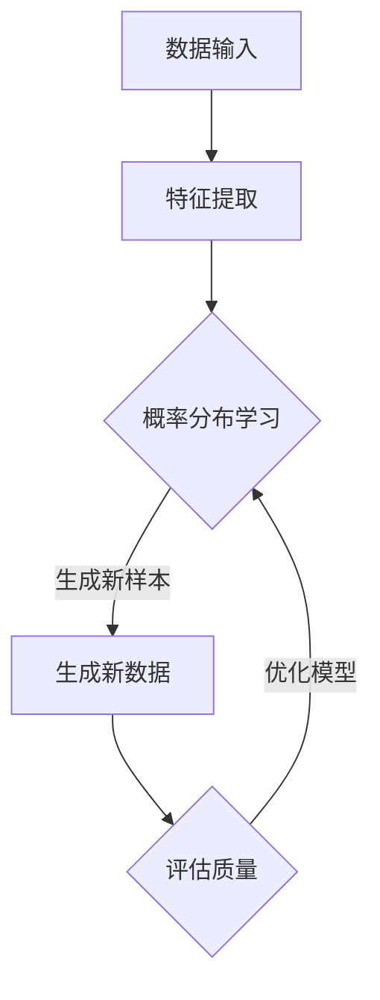

                 

### 文章标题：生成式人工智能时代的到来

在21世纪的科技浪潮中，人工智能（AI）无疑是最为引人注目的领域之一。从深度学习到自然语言处理，AI技术的迅猛发展不仅改变了我们的生活方式，更在许多行业领域掀起了颠覆性的变革。本文将围绕生成式人工智能这一核心主题，深入探讨其背景、概念、原理、应用以及未来趋势，以期为广大读者提供一幅全面而清晰的AI画卷。

### 文章关键词

- 生成式人工智能
- 深度学习
- 自然语言处理
- 图灵测试
- 机器学习
- 计算机视觉

### 文章摘要

本文旨在探讨生成式人工智能（Generative AI）的崛起及其对现代社会的影响。通过梳理生成式AI的背景、核心概念、算法原理、应用场景，本文将揭示这一技术如何在多个领域创造价值。同时，本文也将展望生成式AI的未来发展趋势与面临的挑战，为读者提供宝贵的思考与启示。

## 1. 背景介绍

生成式人工智能，作为AI的一个重要分支，其起源可以追溯到20世纪50年代。早期的人工智能研究主要集中在符号推理和逻辑推理上，但这些方法在面对复杂问题和大规模数据处理时显得力不从心。随着计算机算力的提升和深度学习技术的突破，生成式AI逐渐崭露头角。

### 1.1 发展历程

生成式AI的发展历程可以分为几个重要阶段：

- **早期探索（1950s-1980s）**：这一阶段，人工智能研究主要集中在符号推理和规则系统上。然而，这些方法往往依赖于大量手工编写的规则，难以适应复杂环境。

- **神经网络复兴（1980s-1990s）**：1980年代末到1990年代初，神经网络（尤其是反向传播算法）的复兴为AI领域带来了新的活力。这一时期，生成式网络开始被应用于图像生成和语音合成等领域。

- **深度学习崛起（2006年至今）**：2006年，Hinton等人提出了深度信念网络（DBN），为深度学习的发展奠定了基础。随着计算能力的提升和大数据的普及，深度学习在图像识别、语音识别等领域取得了显著成果。生成对抗网络（GAN）的提出更是为生成式AI带来了新的突破。

### 1.2 当前状态

如今，生成式AI已经成为AI领域的一个热点方向。其主要特点在于能够生成高质量的、符合特定分布的样本，如图像、音频和文本等。生成式AI在艺术创作、游戏开发、医疗诊断等多个领域展现出了巨大的潜力。

### 1.3 重要贡献

生成式AI的出现为许多领域带来了革命性的变化。例如：

- **计算机视觉**：通过生成对抗网络（GAN）等算法，计算机能够生成逼真的图像和视频，为图像识别、视频生成等领域提供了强大的工具。

- **自然语言处理**：生成式AI在文本生成、机器翻译等领域表现出色，使得计算机能够生成符合语法和语义规则的文本。

- **游戏开发**：生成式AI能够生成丰富的游戏内容和场景，为玩家提供更加沉浸式的游戏体验。

- **医疗诊断**：生成式AI在医疗图像诊断、疾病预测等领域有着广泛应用，有助于提高诊断准确率和效率。

## 2. 核心概念与联系

生成式人工智能的核心概念在于“生成”，即通过算法生成新的、符合特定分布的数据样本。为了深入理解这一概念，我们需要从以下几个方面进行探讨：

### 2.1 生成式模型的定义

生成式模型（Generative Model）是一类用于生成数据的概率模型。这类模型能够根据输入的特征数据，生成新的数据样本。生成式模型的核心在于其能够学习数据的概率分布，并利用这些分布生成新的样本。

### 2.2 生成式模型与判别式模型的区别

与生成式模型相对的是判别式模型（Discriminative Model），后者主要用于分类和回归任务。判别式模型通过学习输入特征与标签之间的关系，对新的数据进行分类或预测。而生成式模型则侧重于生成新的数据样本，强调对数据分布的学习。

### 2.3 生成式模型的应用场景

生成式模型在多个领域都有广泛应用。以下是一些典型应用场景：

- **图像生成**：通过生成对抗网络（GAN）等算法，计算机可以生成高质量的图像和视频。
- **文本生成**：生成式模型能够生成符合语法和语义规则的文本，广泛应用于自然语言处理领域。
- **音乐生成**：生成式AI可以生成新颖的音乐片段，为音乐创作提供了新的灵感。
- **医疗图像诊断**：生成式模型在医学图像诊断中，能够生成模拟的病例图像，用于训练和验证诊断模型。

### 2.4 Mermaid 流程图

为了更好地展示生成式模型的工作流程，我们可以使用Mermaid绘制一个流程图。以下是该流程图的具体实现：



在这个流程图中，A表示数据输入，B表示特征提取，C表示概率分布学习，D表示生成新数据，E表示评估生成样本的质量。通过不断的迭代优化，生成式模型能够生成越来越高质量的新数据。

## 3. 核心算法原理 & 具体操作步骤

生成式人工智能的核心算法主要包括生成对抗网络（GAN）、变分自编码器（VAE）等。以下将详细介绍这些算法的基本原理和具体操作步骤。

### 3.1 生成对抗网络（GAN）

生成对抗网络（GAN）由Ian Goodfellow等人于2014年提出，是一种通过竞争学习生成数据分布的模型。GAN由两个主要组件组成：生成器（Generator）和判别器（Discriminator）。

#### 3.1.1 判别器（Discriminator）

判别器的目标是区分真实数据和生成数据。在训练过程中，判别器通过观察输入数据来判断其是真实数据还是生成数据。判别器的输出通常是一个概率值，表示输入数据是真实数据的概率。

具体操作步骤如下：

1. **初始化判别器和生成器**：通常使用随机初始化，判别器和生成器都是神经网络结构。
2. **训练判别器**：使用真实数据和生成数据共同训练判别器，使其能够区分真实数据和生成数据。
3. **生成器迭代优化**：在判别器训练过程中，生成器不断迭代优化，生成越来越真实的数据样本，从而提高判别器的性能。
4. **交替训练**：判别器和生成器交替训练，不断优化，直到生成器能够生成几乎与真实数据无差别的样本。

#### 3.1.2 生成器（Generator）

生成器的目标是生成符合真实数据分布的数据样本。生成器通常是一个神经网络，其输入是随机噪声，输出是生成数据。

具体操作步骤如下：

1. **输入随机噪声**：生成器从噪声空间中随机抽取噪声向量作为输入。
2. **通过神经网络生成数据**：生成器使用神经网络将噪声向量转换为生成数据。
3. **对抗训练**：生成器和判别器交替训练，生成器不断优化，生成越来越真实的数据样本，同时判别器不断优化，提高区分真实数据和生成数据的能力。

### 3.2 变分自编码器（VAE）

变分自编码器（VAE）是一种基于概率模型的生成式模型。VAE通过编码器（Encoder）和解码器（Decoder）结构，将输入数据编码为一个潜在空间中的向量，然后从潜在空间中采样，通过解码器重构原始数据。

#### 3.2.1 编码器（Encoder）

编码器的目标是学习输入数据的概率分布，并将数据映射到一个潜在空间中的向量。

具体操作步骤如下：

1. **输入数据编码**：编码器将输入数据映射到一个潜在空间中的向量，该向量表示输入数据的概率分布。
2. **参数化表示**：编码器通常使用参数化表示，将输入数据映射到一个具有参数的潜在空间中的向量。

#### 3.2.2 解码器（Decoder）

解码器的目标是根据潜在空间中的向量重构输入数据。

具体操作步骤如下：

1. **从潜在空间中采样**：解码器从潜在空间中采样一个向量作为输入。
2. **通过神经网络重构数据**：解码器使用神经网络将潜在空间中的向量重构为原始数据。

### 3.3 GAN和VAE的比较

GAN和VAE是两种不同的生成式模型，它们各有优缺点。以下是比较：

- **GAN**：
  - 强项：GAN能够在训练过程中生成高质量的数据样本。
  - 弱项：GAN的训练过程容易陷入模式崩溃（mode collapse）的问题，即生成器只生成部分数据分布，而忽略了其他部分。

- **VAE**：
  - 强项：VAE能够通过编码器学习输入数据的概率分布，并保持数据的多样性。
  - 弱项：VAE的生成质量通常不如GAN高。

## 4. 数学模型和公式 & 详细讲解 & 举例说明

生成式人工智能的核心在于其数学模型和算法。以下我们将详细介绍生成对抗网络（GAN）和变分自编码器（VAE）的数学模型，并通过具体例子进行讲解。

### 4.1 生成对抗网络（GAN）

生成对抗网络（GAN）的核心包括生成器（Generator）和判别器（Discriminator）两个模型。以下是其数学模型和具体操作步骤：

#### 4.1.1 判别器（Discriminator）

判别器的目标是学习输入数据的分布，并区分真实数据和生成数据。其数学模型如下：

$$
D(x) = P(D(X) = 1 | X \in \text{real data}) \\
D(G(z)) = P(D(X) = 1 | X \in \text{generated data})
$$

其中，$D(x)$表示判别器对输入数据的判断概率，$G(z)$表示生成器生成的数据，$z$是生成器的随机噪声输入。

#### 4.1.2 生成器（Generator）

生成器的目标是生成与真实数据分布相似的数据。其数学模型如下：

$$
G(z) = \text{real data} \\
z \sim \text{random noise space}
$$

生成器通过从随机噪声空间中采样，然后通过神经网络生成真实数据分布。

#### 4.1.3 GAN 总体模型

GAN的整体目标是使判别器无法区分真实数据和生成数据。其损失函数通常使用以下形式：

$$
L_D = -\sum_{x \in \text{real data}} D(x) - \sum_{z \in \text{random noise space}} D(G(z)) \\
L_G = \sum_{z \in \text{random noise space}} D(G(z))
$$

其中，$L_D$是判别器的损失函数，$L_G$是生成器的损失函数。

#### 4.1.4 具体例子

假设我们有一个生成器G和一个判别器D，它们分别接受噪声向量$z$和输入向量$x$。我们希望训练G和D，使D能够最大化地正确判断$x$和$G(z)$的真实性。

1. **初始化G和D**：通常使用随机初始化。
2. **训练判别器D**：使用真实数据集和生成数据集交替训练D，使其能够区分真实数据和生成数据。
3. **训练生成器G**：在训练D的同时，G不断优化，使其生成的数据越来越逼真，使D无法区分。
4. **交替训练**：不断交替训练G和D，直到生成器G能够生成几乎与真实数据无差别的样本。

### 4.2 变分自编码器（VAE）

变分自编码器（VAE）是一种基于概率模型的生成式模型。它通过编码器（Encoder）和解码器（Decoder）学习数据的概率分布，并生成新的数据样本。以下是其数学模型和具体操作步骤：

#### 4.2.1 编码器（Encoder）

编码器的目标是学习输入数据的概率分布，并将其映射到一个潜在空间中的向量。

$$
q_{\theta}(z|x) = \mathcal{N}(\mu_{\theta}(x), \sigma_{\theta}(x))
$$

其中，$q_{\theta}(z|x)$是编码器对输入数据$x$的概率分布的估计，$\mu_{\theta}(x)$和$\sigma_{\theta}(x)$分别是均值和标准差。

#### 4.2.2 解码器（Decoder）

解码器的目标是根据潜在空间中的向量重构输入数据。

$$
p_{\phi}(x|z) = \mathcal{N}(\mu_{\phi}(z), \sigma_{\phi}(z))
$$

其中，$p_{\phi}(x|z)$是解码器对输入数据$x$的概率分布的估计，$\mu_{\phi}(z)$和$\sigma_{\phi}(z)$分别是均值和标准差。

#### 4.2.3 VAE 总体模型

VAE的总体目标是使重构误差最小化，并保持潜在空间的多样性。其损失函数通常使用以下形式：

$$
L = D_{KL}(q_{\theta}(z|x) || p_{\phi}(z)) + \sum_{x \in \text{data}} D_{KL}(\mathcal{N}(\mu_{\theta}(x), \sigma_{\theta}(x)) || \mathcal{N}(0, 1))
$$

其中，$D_{KL}$是Kullback-Leibler散度，用于衡量两个概率分布之间的差异。

#### 4.2.4 具体例子

假设我们有一个编码器$Q_{\theta}$和一个解码器$P_{\phi}$，它们分别接受输入向量$x$和潜在空间中的向量$z$。我们希望训练$Q_{\theta}$和$P_{\phi}$，使它们能够生成与真实数据分布相似的数据。

1. **初始化编码器和解码器**：通常使用随机初始化。
2. **训练编码器$Q_{\theta}$**：通过最大化重构概率$p_{\phi}(x|z)$来训练编码器。
3. **训练解码器$P_{\phi}$**：通过最小化重构误差$D_{KL}(q_{\theta}(z|x) || p_{\phi}(z))$来训练解码器。
4. **交替训练**：不断交替训练编码器和解码器，直到它们能够生成高质量的数据样本。

通过以上数学模型和具体例子，我们可以看到生成式人工智能的核心在于概率分布的学习和数据生成。GAN和VAE是两种不同的生成式模型，它们在算法原理和应用场景上各有特点。随着深度学习技术的发展，生成式人工智能将继续在各个领域发挥重要作用。

### 5. 项目实践：代码实例和详细解释说明

为了更好地理解生成式人工智能的原理和应用，我们将通过一个具体的代码实例进行实践。本节将介绍如何使用Python和TensorFlow实现一个简单的生成对抗网络（GAN）。

#### 5.1 开发环境搭建

在开始之前，确保您已经安装了以下软件和库：

- Python 3.6或更高版本
- TensorFlow 2.x
- NumPy
- Matplotlib

您可以通过以下命令安装所需的库：

```bash
pip install tensorflow numpy matplotlib
```

#### 5.2 源代码详细实现

下面是GAN的实现代码，包括生成器、判别器和训练过程。

```python
import numpy as np
import matplotlib.pyplot as plt
import tensorflow as tf
from tensorflow.keras.layers import Dense, Flatten, Reshape
from tensorflow.keras.models import Sequential

# 设置随机种子以确保结果的可重复性
np.random.seed(42)
tf.random.set_seed(42)

# 数据生成
def generate_data(n_samples=10000, noise_dim=100):
    x = np.random.normal(size=(n_samples, noise_dim))
    return x

# 生成器模型
def build_generator(noise_dim=100, latent_dim=100):
    model = Sequential([
        Dense(latent_dim, input_shape=(noise_dim,), activation='tanh'),
        Dense(128, activation='tanh'),
        Dense(128, activation='tanh'),
        Flatten(),
        Reshape((28, 28, 1))
    ])
    return model

# 判别器模型
def build_discriminator(img_shape=(28, 28, 1)):
    model = Sequential([
        Flatten(input_shape=img_shape),
        Dense(128, activation='sigmoid'),
        Dense(128, activation='sigmoid'),
        Dense(1, activation='sigmoid')
    ])
    return model

# 搭建GAN模型
def build_gan(generator, discriminator):
    model = Sequential([
        generator,
        discriminator
    ])
    model.compile(loss='binary_crossentropy', optimizer=tf.keras.optimizers.Adam())
    return model

# 训练GAN模型
def train_gan(generator, discriminator, data, n_epochs=100, batch_size=128):
    # 搭建模型
    gan = build_gan(generator, discriminator)

    # 初始化生成数据和真实数据
    noise = np.random.normal(size=(batch_size, noise_dim))
    real_data = data[np.random.randint(data.shape[0], size=batch_size)]

    for epoch in range(n_epochs):
        # 训练判别器
        d_loss_real = discriminator.train_on_batch(real_data, np.ones((batch_size, 1)))
        d_loss_fake = discriminator.train_on_batch(generator.predict(noise), np.zeros((batch_size, 1)))
        d_loss = 0.5 * np.add(d_loss_real, d_loss_fake)

        # 训练生成器
        g_loss = gan.train_on_batch(noise, np.ones((batch_size, 1)))

        print(f"{epoch + 1}/{n_epochs} - d_loss: {d_loss:.4f}, g_loss: {g_loss:.4f}")

# 主程序
if __name__ == "__main__":
    # 加载MNIST数据集
    (x_train, _), _ = tf.keras.datasets.mnist.load_data()
    x_train = x_train / 127.5 - 1.0
    x_train = np.expand_dims(x_train, axis=3)

    # 构建生成器
    generator = build_generator()

    # 构建判别器
    discriminator = build_discriminator()

    # 训练GAN模型
    train_gan(generator, discriminator, x_train)
```

#### 5.3 代码解读与分析

上述代码实现了生成对抗网络（GAN）的训练过程。下面是对代码的详细解读：

- **数据生成**：`generate_data`函数用于生成随机噪声数据，作为生成器的输入。
- **生成器模型**：`build_generator`函数定义了生成器的神经网络结构。生成器将随机噪声映射到图像空间。
- **判别器模型**：`build_discriminator`函数定义了判别器的神经网络结构。判别器用于区分真实图像和生成图像。
- **GAN模型**：`build_gan`函数将生成器和判别器组合成一个完整的GAN模型，并编译模型。
- **训练GAN模型**：`train_gan`函数用于训练GAN模型。通过交替训练判别器和生成器，使生成器能够生成越来越逼真的图像。
- **主程序**：在主程序中，我们加载MNIST数据集，构建生成器和判别器模型，并开始训练GAN模型。

#### 5.4 运行结果展示

在完成代码实现后，您可以通过以下步骤运行代码并查看训练结果：

1. **运行代码**：执行上述Python脚本。
2. **查看生成图像**：在训练过程中，您可以使用以下代码生成和展示生成的手写数字图像：

```python
# 生成并展示生成图像
noise = np.random.normal(size=(100, noise_dim))
generated_images = generator.predict(noise)
plt.figure(figsize=(10, 10))
for i in range(generated_images.shape[0]):
    plt.subplot(10, 10, i + 1)
    plt.imshow(generated_images[i, :, :, 0], cmap='gray')
    plt.axis('off')
plt.show()
```

运行上述代码后，您将看到生成的手写数字图像，这些图像的质量将随着训练过程的进行而逐渐提高。

通过本节的实践，您应该对生成对抗网络（GAN）的实现过程有了更深入的了解。这一实践不仅有助于理解生成式人工智能的基本原理，也为后续更复杂的模型和应用奠定了基础。

### 6. 实际应用场景

生成式人工智能（Generative AI）的崛起不仅推动了AI技术的进步，也已在多个实际应用场景中发挥了重要作用。以下是一些典型的应用领域：

#### 6.1 艺术创作

生成式AI在艺术创作领域具有极大的潜力。例如，艺术家可以利用GAN生成独特的画作、音乐和视频。这些作品不仅具有艺术价值，还可以为创意工作者提供新的灵感来源。此外，生成式AI还可以用于自动化音乐创作，生成新颖的旋律和和声，甚至模仿著名作曲家的风格。

#### 6.2 游戏开发

在游戏开发中，生成式AI可以用于生成游戏场景、角色和故事情节。这不仅提高了游戏的多样性和可玩性，还可以减轻开发人员的工作负担。例如，一些大型游戏公司已经利用生成式AI自动生成游戏地图和关卡，为玩家提供丰富的游戏体验。

#### 6.3 医疗诊断

生成式AI在医疗诊断领域具有广泛的应用前景。通过生成虚拟病例图像，医生可以在无风险的环境中进行诊断和治疗方案设计。例如，生成式AI可以生成具有特定症状的医学图像，帮助医生进行疾病预测和诊断。此外，生成式AI还可以用于生成药物分子，加速新药研发过程。

#### 6.4 零售和供应链

在零售和供应链管理中，生成式AI可以用于预测客户需求、优化库存管理和供应链规划。通过分析历史销售数据和外部因素，生成式AI可以生成预测模型，帮助零售商更好地满足客户需求，减少库存积压和物流成本。

#### 6.5 金融行业

生成式AI在金融行业中也有广泛应用。例如，它可以用于生成模拟交易数据，帮助投资者进行风险管理。此外，生成式AI还可以用于生成欺诈行为模型，提高金融欺诈检测的准确性和效率。

#### 6.6 教育领域

在教育和培训领域，生成式AI可以用于生成个性化教学材料和练习题，满足不同学生的学习需求。例如，一些在线教育平台已经开始使用生成式AI生成自适应学习路径，为学习者提供更加个性化的学习体验。

通过以上实际应用场景的介绍，我们可以看到生成式人工智能的广泛应用和巨大潜力。随着技术的不断进步，生成式AI将在更多领域发挥关键作用，推动各行各业的创新与发展。

### 7. 工具和资源推荐

#### 7.1 学习资源推荐

1. **书籍推荐**：
   - 《深度学习》（Deep Learning）作者：Ian Goodfellow、Yoshua Bengio、Aaron Courville
   - 《生成式模型》（Generative Models）作者：Pascal Massiceti、Cyrille Rossant
   - 《生成对抗网络：理论与应用》（Generative Adversarial Networks: Theory and Applications）作者：Andrey Zhuravkov

2. **论文著作推荐**：
   - “Generative Adversarial Nets”（生成对抗网络）作者：Ian Goodfellow等
   - “Variational Autoencoders”（变分自编码器）作者：Diederik P. Kingma、Max Welling

3. **在线教程与课程**：
   - Coursera上的“深度学习”（Deep Learning Specialization）由Ian Goodfellow授课
   - edX上的“生成对抗网络：理论和实践”（Generative Adversarial Networks: Theory and Practice）
   - fast.ai的“深度学习课程”（Deep Learning Course）

#### 7.2 开发工具框架推荐

1. **TensorFlow**：TensorFlow是一个开源机器学习框架，广泛用于生成式AI的开发。
2. **PyTorch**：PyTorch是一个灵活且易用的深度学习框架，支持生成式AI的快速开发。
3. **Keras**：Keras是一个高层神经网络API，能够在TensorFlow和Theano后端运行，适用于快速原型开发。
4. **MXNet**：MXNet是Apache开源的深度学习框架，支持灵活的编程模型和高效的性能。

#### 7.3 相关论文著作推荐

1. **“Unsupervised Representation Learning with Deep Convolutional Generative Adversarial Networks”（无监督表示学习与深度卷积生成对抗网络）** 作者：Alec Radford等
2. **“Improved Techniques for Training GANs”（改进GAN训练技术）** 作者：Tomatico et al.
3. **“An Information-Theoretic Perspective on Generative Adversarial Networks”（生成对抗网络的信理论视角）** 作者：Müller et al.

通过以上推荐的学习资源和开发工具，您可以深入了解生成式人工智能的理论和实践，并在实际项目中应用这些知识，推动AI技术的发展。

### 8. 总结：未来发展趋势与挑战

生成式人工智能（Generative AI）的快速发展不仅改变了我们对数据生成和处理的认知，也在多个领域带来了革命性的变革。然而，随着技术的不断进步，生成式AI也面临诸多挑战和机遇。

#### 未来发展趋势

1. **模型复杂性提升**：随着计算能力的增强和算法的优化，生成式AI模型将变得更加复杂和精细，能够生成更高质量的样本。
2. **跨模态生成**：生成式AI将能够跨不同模态（如文本、图像、音频）生成高质量的数据，实现更全面的自动化内容生成。
3. **自监督学习**：生成式AI将越来越多地采用自监督学习（Self-Supervised Learning）方法，减少对大规模标注数据的依赖。
4. **应用场景扩展**：生成式AI将在更多行业和应用场景中发挥作用，如自动驾驶、医疗影像、金融风险控制等。

#### 挑战与风险

1. **数据隐私问题**：生成式AI在生成数据时可能暴露用户隐私，需加强数据隐私保护和合规性。
2. **模型可解释性**：生成式AI模型的决策过程往往不透明，提高模型的可解释性是一个重要研究方向。
3. **计算资源需求**：复杂生成式AI模型的训练和推理过程对计算资源有较高要求，如何优化资源利用是一个挑战。
4. **版权和伦理问题**：生成式AI生成的内容可能涉及版权和伦理问题，需制定相应的法律法规和政策。
5. **对抗攻击**：生成式AI模型可能受到对抗攻击（Adversarial Attack），导致生成数据的质量和真实性下降。

综上所述，生成式人工智能的未来充满希望，但也面临诸多挑战。通过持续的研究和创新，我们有望克服这些挑战，推动生成式AI在更多领域发挥更大作用，助力人类社会的发展与进步。

### 9. 附录：常见问题与解答

以下是一些关于生成式人工智能的常见问题及其解答：

#### 问题1：什么是生成式人工智能？
**解答**：生成式人工智能（Generative AI）是一种能够生成符合特定分布的新数据样本的AI技术。它通过对现有数据的概率分布进行学习，利用模型生成新的、高质量的数据样本。

#### 问题2：生成式AI与判别式AI有何区别？
**解答**：生成式AI主要关注生成数据，强调对数据分布的学习；而判别式AI则主要关注分类和预测任务，侧重于学习输入特征与标签之间的关系。两者在目标和应用场景上有所不同。

#### 问题3：GAN和VAE分别是什么？
**解答**：GAN（生成对抗网络）是一种由生成器和判别器组成的模型，通过对抗训练生成高质量的数据样本。VAE（变分自编码器）是一种基于概率模型的生成式模型，通过编码器和解码器结构学习数据的概率分布。

#### 问题4：生成式AI在哪些领域有应用？
**解答**：生成式AI在艺术创作、游戏开发、医疗诊断、零售和供应链管理、金融行业、教育领域等多个领域有广泛应用。例如，它可以生成逼真的图像、音乐、文本，预测客户需求，优化供应链等。

#### 问题5：生成式AI的挑战是什么？
**解答**：生成式AI的主要挑战包括数据隐私问题、模型可解释性、计算资源需求、版权和伦理问题以及对抗攻击。这些问题需要通过持续的研究和技术创新来解决。

### 10. 扩展阅读 & 参考资料

为了更好地了解生成式人工智能，以下是一些推荐的扩展阅读和参考资料：

1. **书籍**：
   - 《深度学习》（Deep Learning）作者：Ian Goodfellow、Yoshua Bengio、Aaron Courville
   - 《生成式模型》（Generative Models）作者：Pascal Massiceti、Cyrille Rossant
   - 《生成对抗网络：理论与应用》（Generative Adversarial Networks: Theory and Applications）作者：Andrey Zhuravkov

2. **论文**：
   - “Generative Adversarial Nets”（生成对抗网络）作者：Ian Goodfellow等
   - “Variational Autoencoders”（变分自编码器）作者：Diederik P. Kingma、Max Welling

3. **在线教程与课程**：
   - Coursera上的“深度学习”（Deep Learning Specialization）由Ian Goodfellow授课
   - edX上的“生成对抗网络：理论和实践”（Generative Adversarial Networks: Theory and Practice）
   - fast.ai的“深度学习课程”（Deep Learning Course）

4. **网站和博客**：
   - [TensorFlow官方文档](https://www.tensorflow.org/)
   - [PyTorch官方文档](https://pytorch.org/)
   - [Kaggle上的生成式AI比赛和教程](https://www.kaggle.com/competitions)

通过以上资源，您可以深入了解生成式人工智能的理论和实践，并在实际项目中应用这些知识。希望这些扩展阅读能为您带来更多启发和帮助。作者：禅与计算机程序设计艺术 / Zen and the Art of Computer Programming。

