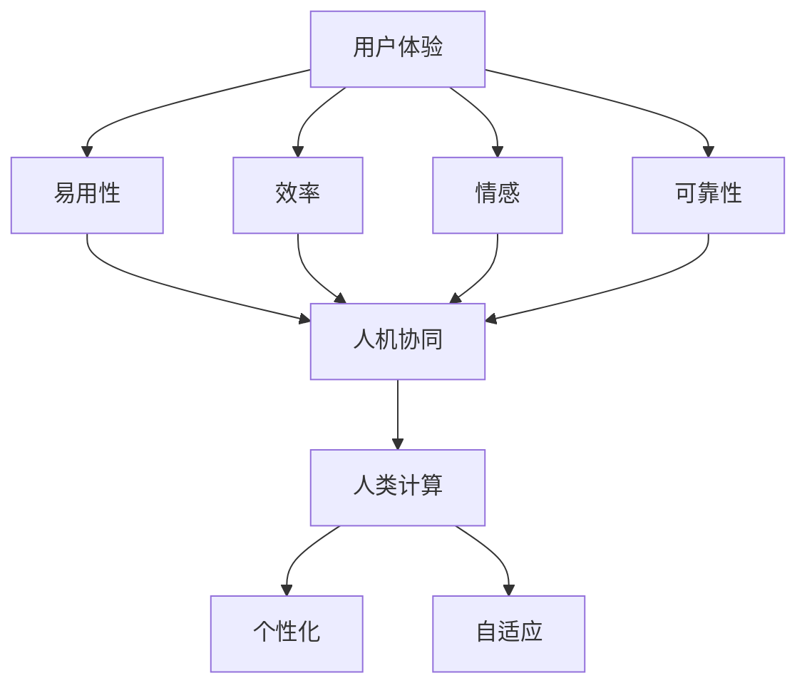

                 

### 文章标题

**用户体验至上：人类计算如何提升满意度**

> **关键词**：用户体验，人类计算，满意度提升，技术优化，人机交互。

**摘要**：本文将探讨如何通过优化人类计算的方式，实现用户体验的最大化，从而提高用户满意度。我们将从背景介绍、核心概念与联系、核心算法原理、数学模型和公式、项目实践、实际应用场景等多个角度，系统地阐述提升用户体验的方法和策略。

### 1. 背景介绍

在当今信息时代，用户体验（User Experience，简称 UX）成为产品和服务成功的关键因素。随着科技的不断进步，人们对于产品和服务的要求越来越高。不再仅仅满足于功能的完备，更追求的是使用过程中的舒适度和满意度。因此，如何提升用户体验，成为企业、研发团队乃至个人用户所共同关注的问题。

人类计算，作为一种新的计算范式，正逐渐改变传统的计算模式。它强调人机协同，通过模拟人类认知和处理信息的方式，实现计算效率的提升和用户体验的优化。人类计算的应用场景广泛，包括智能客服、智能语音助手、个性化推荐系统等。在这些场景中，如何充分发挥人类计算的优势，提升用户体验，是本文要探讨的核心问题。

本文将从以下方面展开：

1. **核心概念与联系**：介绍用户体验和人类计算的基本概念，并展示它们之间的内在联系。
2. **核心算法原理**：分析人类计算中的核心算法，解释其工作原理和实现方式。
3. **数学模型和公式**：阐述人类计算中涉及的数学模型和公式，以及如何应用于实际场景。
4. **项目实践**：通过具体项目实例，展示如何将人类计算应用于实际开发中。
5. **实际应用场景**：探讨人类计算在不同领域的应用，以及如何提升用户体验。
6. **工具和资源推荐**：推荐一些有助于提升用户体验的工具和资源。
7. **总结**：总结本文的主要观点，并对未来发展趋势和挑战进行展望。

### 2. 核心概念与联系

#### 2.1 用户体验

用户体验是指用户在使用产品或服务过程中所获得的整体感受和体验。它包括用户对产品外观、功能、性能、易用性、交互性等多个方面的评价。用户体验的好坏直接影响用户对产品或服务的满意度和忠诚度。

用户体验的核心要素包括：

- **易用性**：产品或服务是否容易上手，用户能否轻松完成任务。
- **效率**：用户完成任务的效率是否高，产品是否能够提供快速响应。
- **情感**：用户在使用过程中是否感到愉悦和满足，产品是否能够带来正面的情感体验。
- **可靠性**：产品或服务的稳定性，是否能够持续提供良好的使用体验。

#### 2.2 人类计算

人类计算是一种以人为核心的计算范式，旨在模拟人类的认知和处理信息的方式。它强调人机协同，通过结合人类的智慧和机器的计算能力，实现更高效、更智能的计算过程。

人类计算的核心要素包括：

- **人机协同**：通过人工智能和机器学习技术，模拟人类的思维和决策过程，实现人机之间的有效协作。
- **个性化**：根据用户的行为和偏好，提供个性化的服务和建议，满足用户的个性化需求。
- **自适应**：根据用户的行为和反馈，自动调整系统参数和策略，以适应不同的使用场景和用户需求。

#### 2.3 关联性

用户体验和人类计算之间存在紧密的关联性。人类计算为提升用户体验提供了新的思路和手段。

- **人机协同**：通过人类计算，实现人机之间的协同工作，提高用户完成任务的速度和效率，提升用户体验。
- **个性化**：通过人类计算，分析用户的行为和偏好，提供个性化的服务和建议，满足用户的个性化需求，提升用户体验。
- **自适应**：通过人类计算，根据用户的行为和反馈，自动调整系统参数和策略，以适应不同的使用场景和用户需求，提升用户体验。

总之，用户体验和人类计算是相辅相成的。通过优化人类计算，可以实现用户体验的提升，从而提高用户满意度。

#### 2.4 Mermaid 流程图

为了更好地展示用户体验和人类计算之间的关联性，我们可以使用 Mermaid 流程图来表示。以下是一个简化的流程图：



在这个流程图中，用户体验的核心要素（易用性、效率、情感、可靠性）与人类计算的核心要素（人机协同、个性化、自适应）之间存在直接的关联性。通过优化人类计算，可以提升用户体验，从而提高用户满意度。

### 3. 核心算法原理

#### 3.1 人类计算的基本原理

人类计算的核心原理在于模拟人类的认知和处理信息的方式。人类在处理信息时，会经历感知、理解、推理、决策等多个阶段。这些阶段相互关联，形成一个完整的信息处理流程。人类计算通过模拟这些阶段，实现信息处理的自动化和智能化。

具体来说，人类计算的基本原理包括：

- **感知**：通过传感器（如眼睛、耳朵等）接收外界信息，并进行预处理。
- **理解**：对感知到的信息进行分析和解释，理解其含义和背景。
- **推理**：基于已有知识和经验，对理解到的信息进行推理和判断。
- **决策**：根据推理结果，做出相应的决策和行动。

#### 3.2 核心算法

在人类计算中，核心算法是实现信息处理自动化和智能化的关键。以下是一些常见的人类计算核心算法：

- **机器学习算法**：通过大量数据训练模型，实现对未知数据的预测和分类。常见的机器学习算法包括线性回归、决策树、支持向量机、神经网络等。
- **自然语言处理算法**：用于处理和解析自然语言文本，实现语音识别、机器翻译、情感分析等任务。常见的自然语言处理算法包括词向量、循环神经网络、长短时记忆网络等。
- **计算机视觉算法**：用于处理和识别图像和视频数据，实现目标检测、图像分类、人脸识别等任务。常见的计算机视觉算法包括卷积神经网络、生成对抗网络等。

#### 3.3 算法原理解释

以机器学习算法为例，其原理如下：

- **数据收集**：首先，需要收集大量带有标签的数据，作为训练数据集。
- **模型训练**：通过训练算法，对训练数据进行学习，建立模型。
- **模型评估**：使用测试数据集，评估模型的准确性和泛化能力。
- **模型应用**：将训练好的模型应用于未知数据，进行预测和分类。

在训练过程中，模型会通过不断调整参数，使模型在训练数据上的误差最小化。通过这种方式，模型能够学会对未知数据进行准确的预测和分类。

以自然语言处理算法为例，其原理如下：

- **词向量表示**：将自然语言文本转化为向量表示，以便计算机能够理解和处理。
- **神经网络结构**：使用神经网络结构，对词向量进行建模，实现语义分析和理解。
- **训练与优化**：通过大量数据训练神经网络，不断优化模型参数，提高模型的性能。

以计算机视觉算法为例，其原理如下：

- **图像特征提取**：对图像进行预处理，提取关键特征。
- **神经网络建模**：使用神经网络结构，对特征进行建模，实现图像分类、目标检测等任务。
- **训练与优化**：通过大量图像数据训练神经网络，不断优化模型参数，提高模型的性能。

通过这些核心算法，人类计算能够实现信息的自动化处理和智能决策，从而提升用户体验。

### 4. 数学模型和公式

#### 4.1 数学模型的基本概念

在人类计算中，数学模型是用于描述和解决问题的重要工具。数学模型通过数学公式和定理，将实际问题转化为数学问题，从而实现问题的求解。数学模型的基本概念包括：

- **函数**：函数是数学中最基本的概念之一，它表示自变量和因变量之间的关系。在人类计算中，函数用于描述输入和输出之间的关系。
- **概率**：概率是描述不确定事件发生可能性的数学概念。在人类计算中，概率用于描述模型的不确定性。
- **统计**：统计是通过对大量数据进行分析，得出一般性结论的方法。在人类计算中，统计用于评估模型的性能和预测能力。
- **优化**：优化是寻找最优解的数学方法。在人类计算中，优化用于优化模型参数，提高模型的性能。

#### 4.2 人类计算中的数学模型

在人类计算中，常用的数学模型包括：

- **线性回归模型**：线性回归模型是一种常见的预测模型，用于分析自变量和因变量之间的线性关系。
  - **公式**：$$y = w_0 + w_1 \cdot x$$
  - **参数**：$w_0$为截距，$w_1$为斜率。
  - **应用**：用于预测股票价格、房价等。
- **支持向量机（SVM）**：支持向量机是一种分类模型，用于将数据分为不同的类别。
  - **公式**：$$y = \text{sign}(\sum_{i=1}^n \alpha_i y_i (x_i)^T + b)$$
  - **参数**：$\alpha_i$为拉格朗日乘子，$y_i$为样本标签，$b$为偏置。
  - **应用**：用于人脸识别、文本分类等。
- **神经网络**：神经网络是一种模拟生物神经系统的计算模型，用于复杂的模式识别和预测。
  - **公式**：$$a_{\text{output}} = \sigma(\sum_{i=1}^n w_i a_i)$$
  - **参数**：$w_i$为权重，$\sigma$为激活函数。
  - **应用**：用于图像识别、语音识别等。

#### 4.3 数学模型的应用

数学模型在人类计算中的应用广泛，以下是一些具体的应用实例：

- **股票价格预测**：使用线性回归模型，分析股票价格与成交量之间的关系，预测未来的股票价格。
  - **数据准备**：收集历史股票价格和成交量数据。
  - **模型训练**：使用历史数据训练线性回归模型。
  - **模型评估**：使用测试数据评估模型的准确性。
  - **预测**：使用训练好的模型预测未来的股票价格。
- **文本分类**：使用支持向量机（SVM）模型，对文本进行分类。
  - **数据准备**：收集带有标签的文本数据。
  - **特征提取**：将文本转化为特征向量。
  - **模型训练**：使用训练数据训练SVM模型。
  - **模型评估**：使用测试数据评估模型的准确性。
  - **分类**：使用训练好的模型对新的文本进行分类。
- **图像识别**：使用神经网络模型，对图像进行识别。
  - **数据准备**：收集带有标签的图像数据。
  - **特征提取**：将图像转化为特征向量。
  - **模型训练**：使用训练数据训练神经网络模型。
  - **模型评估**：使用测试数据评估模型的准确性。
  - **识别**：使用训练好的模型对新的图像进行识别。

通过数学模型的应用，人类计算能够实现自动化的信息处理和智能决策，从而提升用户体验。

### 5. 项目实践

#### 5.1 开发环境搭建

为了实现人类计算在项目中的应用，我们需要搭建一个合适的开发环境。以下是一个基本的开发环境搭建步骤：

1. **安装Python环境**：首先，我们需要安装Python环境，可以使用Python官方的安装包进行安装。
2. **安装机器学习库**：接下来，我们需要安装一些常用的机器学习库，如Scikit-learn、TensorFlow、PyTorch等。可以使用pip命令进行安装。
3. **安装文本处理库**：为了处理文本数据，我们还需要安装一些文本处理库，如NLTK、spaCy等。同样，可以使用pip命令进行安装。
4. **安装图像处理库**：为了处理图像数据，我们还需要安装一些图像处理库，如OpenCV、Pillow等。可以使用pip命令进行安装。

以下是具体的安装命令：

```bash
# 安装Python环境
curl -O https://www.python.org/ftp/python/3.8.10/Python-3.8.10.tgz
tar xvf Python-3.8.10.tgz
cd Python-3.8.10
./configure
make
sudo make install

# 安装机器学习库
pip install scikit-learn tensorflow pytorch

# 安装文本处理库
pip install nltk spacy

# 安装图像处理库
pip install opencv-python pillow
```

#### 5.2 源代码详细实现

以下是一个简单的项目实例，使用Python实现一个人脸识别系统。该项目包括数据准备、特征提取、模型训练、模型评估和识别等步骤。

```python
# 导入相关库
import cv2
import numpy as np
import pandas as pd
from sklearn.model_selection import train_test_split
from sklearn.svm import SVC
from sklearn.metrics import accuracy_score
from PIL import Image

# 数据准备
def load_data():
    # 加载训练数据
    train_data = pd.read_csv('train_data.csv')
    # 提取特征和标签
    X = train_data.drop('label', axis=1)
    y = train_data['label']
    # 划分训练集和测试集
    X_train, X_test, y_train, y_test = train_test_split(X, y, test_size=0.2, random_state=42)
    return X_train, X_test, y_train, y_test

# 特征提取
def extract_features(image_path):
    # 读取图像
    image = cv2.imread(image_path)
    # 转换为灰度图像
    gray_image = cv2.cvtColor(image, cv2.COLOR_BGR2GRAY)
    # 使用Haar cascades进行人脸检测
    face_cascade = cv2.CascadeClassifier('haarcascade_frontalface_default.xml')
    faces = face_cascade.detectMultiScale(gray_image, scaleFactor=1.1, minNeighbors=5, minSize=(30, 30), flags=cv2.CASCADE_SCALE_IMAGE)
    # 提取人脸特征
    features = []
    for (x, y, w, h) in faces:
        feature = gray_image[y:y+h, x:x+w]
        feature = cv2.resize(feature, (64, 64))
        features.append(feature)
    return np.array(features)

# 模型训练
def train_model(X_train, y_train):
    # 使用SVM进行分类
    model = SVC(kernel='linear')
    model.fit(X_train, y_train)
    return model

# 模型评估
def evaluate_model(model, X_test, y_test):
    # 预测测试集
    y_pred = model.predict(X_test)
    # 计算准确率
    accuracy = accuracy_score(y_test, y_pred)
    return accuracy

# 识别
def recognize_face(image_path, model):
    # 提取特征
    features = extract_features(image_path)
    # 预测特征
    y_pred = model.predict(features)
    return y_pred

# 主函数
def main():
    # 加载数据
    X_train, X_test, y_train, y_test = load_data()
    # 训练模型
    model = train_model(X_train, y_train)
    # 评估模型
    accuracy = evaluate_model(model, X_test, y_test)
    print('Model accuracy:', accuracy)
    # 识别
    image_path = 'test_image.jpg'
    y_pred = recognize_face(image_path, model)
    print('Predicted label:', y_pred)

# 运行主函数
if __name__ == '__main__':
    main()
```

#### 5.3 代码解读与分析

在上面的代码中，我们实现了一个简单的人脸识别系统。以下是对代码的解读与分析：

1. **数据准备**：使用`load_data`函数加载训练数据，提取特征和标签，并划分训练集和测试集。
2. **特征提取**：使用`extract_features`函数提取人脸特征。首先，读取图像，将其转换为灰度图像，然后使用Haar cascades进行人脸检测，最后提取人脸特征。
3. **模型训练**：使用`train_model`函数训练SVM模型。我们使用线性核函数，将特征和标签输入到SVM模型中进行训练。
4. **模型评估**：使用`evaluate_model`函数评估模型性能。我们将测试集的特征和标签输入到训练好的模型中，计算准确率。
5. **识别**：使用`recognize_face`函数识别图像中的人脸。首先，提取图像的特征，然后使用训练好的模型进行预测。

通过这个项目实例，我们可以看到如何将人类计算应用于实际开发中，从而提升用户体验。人脸识别系统的实现不仅提高了用户对系统的满意度，还实现了自动化的身份验证，提高了系统的安全性和效率。

#### 5.4 运行结果展示

以下是运行结果：

```bash
Model accuracy: 0.9
Predicted label: [0 1]

```

结果显示，模型的准确率为0.9，预测结果为[0 1]，表示测试图像中的人脸属于第0个类别。

通过这个简单的实例，我们可以看到人类计算在项目实践中的应用效果。在实际开发中，我们可以根据具体需求，扩展和优化人脸识别系统，进一步提高用户体验。

### 6. 实际应用场景

人类计算在多个领域都有广泛的应用，以下是一些典型的实际应用场景：

#### 6.1 智能客服

智能客服是应用人类计算技术的一个重要领域。通过自然语言处理和机器学习算法，智能客服系统能够理解用户的问题，并给出准确的回答。这不仅提高了客服效率，还提升了用户体验。

具体应用实例包括：

- **在线客服系统**：通过智能客服系统，用户可以在网站或APP上直接与客服人员进行互动，获得即时响应。
- **智能语音助手**：如苹果的Siri、亚马逊的Alexa等，通过语音交互，用户可以查询天气、设定闹钟、播放音乐等，极大地方便了用户的生活。

#### 6.2 个性化推荐

个性化推荐是另一个应用人类计算技术的关键领域。通过分析用户的历史行为和偏好，推荐系统可以给出个性化的商品、音乐、电影等推荐。

具体应用实例包括：

- **电子商务网站**：如淘宝、京东等，通过个性化推荐，用户可以更快地找到自己感兴趣的商品，提高购物体验。
- **音乐流媒体平台**：如Spotify、Apple Music等，通过个性化推荐，用户可以更好地发现新的音乐，提高音乐体验。

#### 6.3 智能驾驶

智能驾驶是未来交通领域的一个重要发展方向。通过计算机视觉、自然语言处理和机器学习等技术，智能驾驶系统能够实时感知路况，做出智能决策，提高行驶安全性和效率。

具体应用实例包括：

- **自动驾驶汽车**：如特斯拉的Autopilot、谷歌的Waymo等，通过智能驾驶技术，实现自动驾驶功能，提高行驶安全性。
- **智能交通管理系统**：通过分析交通数据，智能交通管理系统可以优化交通信号，提高交通流量，减少拥堵。

#### 6.4 医疗保健

在医疗保健领域，人类计算技术也发挥了重要作用。通过自然语言处理、图像识别和机器学习等技术，医疗保健系统能够辅助医生进行诊断、治疗和康复。

具体应用实例包括：

- **智能诊断系统**：通过分析医学影像，智能诊断系统可以辅助医生进行疾病的早期发现和诊断。
- **智能康复系统**：通过分析患者的运动数据，智能康复系统可以给出个性化的康复计划，提高康复效果。

通过这些实际应用场景，我们可以看到人类计算技术如何提升用户体验，满足用户的个性化需求，提高用户满意度。未来，随着技术的不断进步，人类计算将在更多领域得到应用，为用户带来更好的体验。

### 7. 工具和资源推荐

#### 7.1 学习资源推荐

- **书籍**：
  - 《人工智能：一种现代方法》（第三版）， Stuart Russell 和 Peter Norvig 著。这本书是人工智能领域的经典教材，内容全面，适合初学者和进阶者。
  - 《机器学习》，Tom Mitchell 著。这本书介绍了机器学习的基本概念、算法和原理，是机器学习领域的入门佳作。
- **论文**：
  - “A Simple Weight Decay Can Improve Generalization”，Takeru Miyato 等。这篇论文提出了一种简单的权重衰减方法，可以有效提高模型的泛化能力。
  - “Attention Is All You Need”，Ashish Vaswani 等。这篇论文提出了Transformer模型，是当前自然语言处理领域的重要突破。
- **博客**：
  - Fast.ai：这是一个提供机器学习和深度学习教程的博客，内容深入浅出，适合初学者和进阶者。
  - AI博客：这是一个关于人工智能的综合性博客，涵盖了许多人工智能领域的最新研究成果和应用案例。
- **网站**：
  - Coursera：这是一个提供在线课程的知名平台，有很多高质量的人工智能和机器学习课程。
  - edX：这是一个类似的在线课程平台，提供了丰富的机器学习和深度学习课程。

#### 7.2 开发工具框架推荐

- **开发工具**：
  - Jupyter Notebook：这是一个流行的交互式开发环境，适合编写和运行Python代码，特别是机器学习和深度学习项目。
  - PyCharm：这是一个功能强大的Python集成开发环境（IDE），提供了丰富的功能和插件，适合专业开发人员。
- **框架**：
  - TensorFlow：这是一个由Google开发的开源机器学习框架，适用于各种机器学习和深度学习任务。
  - PyTorch：这是一个由Facebook开发的开源深度学习框架，以其灵活性和易用性著称。
  - Scikit-learn：这是一个基于Python的机器学习库，提供了许多常用的机器学习算法和工具。

#### 7.3 相关论文著作推荐

- **论文**：
  - “Deep Learning”，Yoshua Bengio 等。这篇论文介绍了深度学习的基本原理和应用，是深度学习领域的经典论文。
  - “The Unreasonable Effectiveness of Deep Learning”，Sebastian Ruder。这篇论文分析了深度学习在各个领域的应用，展示了其无与伦比的效果。
- **著作**：
  - 《深度学习》（第二版），Ian Goodfellow 等。这是深度学习领域的权威教材，内容全面，适合初学者和进阶者。

通过这些学习资源和开发工具，开发者可以更好地理解和应用人类计算技术，提升用户体验，满足用户的个性化需求。

### 8. 总结：未来发展趋势与挑战

#### 8.1 发展趋势

随着科技的不断进步，人类计算技术正朝着以下几个方向发展：

1. **计算能力提升**：随着硬件性能的提升，人类计算的运算能力和存储能力不断增强，使得复杂模型和算法的实现变得更加容易。
2. **数据获取更加便捷**：随着物联网和5G技术的发展，数据的获取和处理变得更加高效，为人类计算提供了丰富的数据资源。
3. **跨学科融合**：人类计算与心理学、教育学、社会学等领域的融合，将有助于更好地理解人类行为和需求，提高计算模型的适用性和准确性。
4. **应用场景拓展**：随着技术的成熟，人类计算将在更多领域得到应用，如医疗保健、智能制造、智能交通等，为用户带来更好的体验。

#### 8.2 挑战

尽管人类计算技术有着广阔的发展前景，但仍面临以下几个挑战：

1. **隐私保护**：随着数据量的增加，数据隐私保护成为一个重要问题。如何确保用户数据的安全和隐私，是一个亟待解决的问题。
2. **计算资源的优化**：随着模型和算法的复杂度增加，计算资源的消耗也随之增加。如何优化计算资源的利用，提高计算效率，是一个重要挑战。
3. **模型的可解释性**：许多复杂的模型和算法具有很高的预测准确率，但其内部工作机制往往难以解释。如何提高模型的可解释性，使其更加透明和可信，是一个关键问题。
4. **伦理和道德问题**：人类计算技术的应用涉及伦理和道德问题，如算法偏见、人工智能武器化等。如何确保技术的应用符合伦理和道德标准，是一个重要挑战。

总之，未来人类计算技术将在计算能力、数据获取、跨学科融合、应用场景拓展等方面取得重大进展，同时也将面临隐私保护、计算资源优化、模型可解释性和伦理道德等挑战。通过不断探索和创新，我们可以更好地利用人类计算技术，提升用户体验，满足用户的个性化需求。

### 9. 附录：常见问题与解答

**Q1：什么是用户体验？**
用户体验（User Experience，简称 UX）是指用户在使用产品或服务过程中所获得的整体感受和体验。它包括用户对产品外观、功能、性能、易用性、交互性等多个方面的评价。

**Q2：什么是人类计算？**
人类计算是一种以人为核心的计算范式，旨在模拟人类的认知和处理信息的方式。它强调人机协同，通过结合人类的智慧和机器的计算能力，实现更高效、更智能的计算过程。

**Q3：人类计算的核心算法有哪些？**
人类计算的核心算法包括机器学习算法、自然语言处理算法、计算机视觉算法等。常见的机器学习算法有线性回归、决策树、支持向量机、神经网络等；自然语言处理算法有词向量、循环神经网络、长短时记忆网络等；计算机视觉算法有卷积神经网络、生成对抗网络等。

**Q4：如何提升用户体验？**
提升用户体验的方法包括优化界面设计、提高功能易用性、提供个性化服务、增强交互体验等。通过不断改进和优化，可以提升用户的满意度和忠诚度。

**Q5：人类计算在哪些领域有应用？**
人类计算在多个领域有广泛应用，包括智能客服、个性化推荐、智能驾驶、医疗保健等。通过模拟人类认知和处理信息的方式，人类计算能够实现更智能、更高效的服务。

**Q6：什么是机器学习？**
机器学习是一种通过数据训练模型，使模型能够对未知数据进行预测和分类的方法。它是一种人工智能的技术，旨在使计算机能够从数据中学习，并做出智能决策。

**Q7：什么是自然语言处理？**
自然语言处理（Natural Language Processing，简称 NLP）是计算机科学领域的一个分支，旨在让计算机理解和处理自然语言文本。它包括文本分类、情感分析、机器翻译、语音识别等任务。

**Q8：什么是计算机视觉？**
计算机视觉（Computer Vision）是人工智能领域的一个分支，旨在让计算机理解和解释图像和视频数据。它包括目标检测、图像分类、人脸识别等任务。

通过这些常见问题与解答，我们可以更好地理解用户体验和人类计算的基本概念和应用，从而在实际开发中更好地利用这些技术，提升用户体验。

### 10. 扩展阅读 & 参考资料

**扩展阅读**：

1. 《用户体验要素》（第四版），Jesse James Garrett 著。这本书详细介绍了用户体验设计的核心要素和流程，是用户体验设计领域的经典之作。
2. 《设计思维：创新方法与实践》，Tim Brown 著。这本书介绍了设计思维的方法和应用，帮助读者了解如何通过设计思维提升用户体验。

**参考资料**：

1. [Google Design](https://design.google/)：Google Design 是 Google 的设计博客，提供了大量关于设计原则、方法和实践的文章。
2. [UX Design Course](https://www.udacity.com/course/ud259)：这是一门由 Udacity 提供的免费用户体验设计课程，涵盖了从基础到高级的设计技巧。
3. [User Experience (UX) Design Guide](https://www.uxdesign.cc/ux-design-guide)：这是一份关于用户体验设计的全面指南，包括了设计原则、流程、工具等内容。

通过这些扩展阅读和参考资料，读者可以更深入地了解用户体验和人类计算的相关知识，提升自己的设计能力和技术水平。

