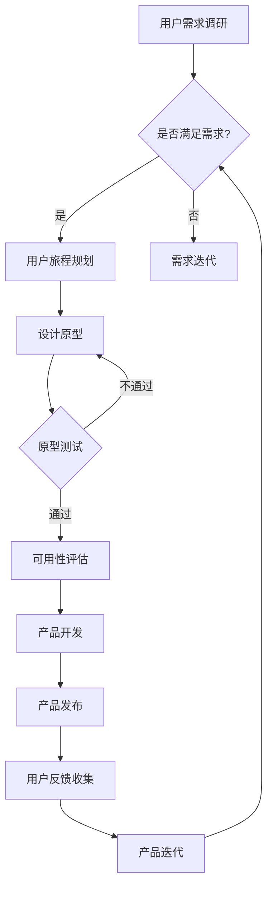

                 

### 背景介绍

在当今数字化的时代，用户体验（User Experience，简称UX）已经成为产品成功与否的关键因素。特别是在创业领域，产品的用户体验不仅影响用户满意度，还直接关系到产品的市场竞争力、用户留存率和企业的盈利能力。因此，如何设计出满足用户需求、提升用户满意度的产品成为了创业公司需要优先解决的问题。

用户体验设计不仅仅是对界面美观的追求，而是涵盖用户在使用产品全过程中的感知、情感和行为。优秀的用户体验设计能够显著提高用户对产品的忠诚度，使用户更愿意推荐产品给他人，从而带来更多的用户和收入。对于创业公司来说，在资源有限的情况下，如何利用有限的资源创造出能够打动用户的产品，成为了一个巨大的挑战。

本文将深入探讨用户体验设计在创业产品中的重要性，通过详细的案例分析，总结出设计高质量用户体验的实践方法和策略。文章结构如下：

1. **核心概念与联系**：介绍用户体验设计的核心概念，并使用Mermaid流程图展示其与产品成功的关系。
2. **核心算法原理 & 具体操作步骤**：解释如何通过系统化的方法进行用户体验设计，并提供详细的操作步骤。
3. **数学模型和公式 & 详细讲解 & 举例说明**：阐述用户体验评估的数学模型和公式，并通过实际案例说明其应用。
4. **项目实践：代码实例和详细解释说明**：通过具体的代码实例，展示如何将用户体验设计理念应用于实际项目中。
5. **实际应用场景**：讨论用户体验设计在不同领域的具体应用。
6. **工具和资源推荐**：推荐学习资源和开发工具，帮助读者深入了解和掌握用户体验设计。
7. **总结：未来发展趋势与挑战**：分析用户体验设计的未来趋势和面临的挑战。

接下来，我们将逐一探讨这些主题，希望能够为创业公司的产品设计师提供有价值的指导。

### 核心概念与联系

在探讨用户体验设计的核心概念之前，我们首先需要理解用户体验本身的定义。用户体验是指用户在使用某个产品或服务时，从感知、情感到行为的一系列主观感受和体验。它不仅仅是产品的视觉效果，还涵盖了用户在使用过程中的所有触点，包括交互、反馈、功能易用性等。

#### 用户体验设计的核心概念

1. **用户需求**：用户体验设计的起点是理解用户的需求。通过用户调研、访谈和数据分析等方法，设计师可以深入了解用户的行为模式、喜好和痛点，从而设计出满足用户需求的产品。

2. **用户旅程**：用户旅程（User Journey）是用户体验设计的核心框架。它描述了用户从首次接触到产品到最后离开的全过程，包括每一个触点和用户的感受。通过用户旅程，设计师可以识别用户体验中的关键节点，并针对性地进行优化。

3. **可用性**：可用性（Usability）是用户体验的重要组成部分。它关注产品的易用性、效率和用户满意度。一个高可用性的产品能够帮助用户轻松完成任务，减少认知负担。

4. **可访问性**：可访问性（Accessibility）确保所有用户，包括那些有视觉、听觉、行动能力限制的用户，都能使用产品。这是用户体验设计中不可忽视的一部分，尤其是在多元化的用户群体中。

5. **情感化设计**：情感化设计（Emotional Design）关注用户在使用产品时的情感体验。通过色彩、形状、文字和图像等元素，设计师可以激发用户的情感共鸣，提升用户体验。

#### Mermaid流程图

为了更好地展示用户体验设计与产品成功之间的关系，我们使用Mermaid流程图来描述这一过程。



在这个流程图中，我们可以看到用户体验设计是一个闭环过程，从用户需求调研开始，经过用户旅程规划、设计原型、原型测试、可用性评估、产品开发、产品发布，再到用户反馈收集和产品迭代，不断循环迭代，以达到优化用户体验、提升产品成功率的目的。

#### 用户体验设计与产品成功的关系

用户体验设计与产品成功之间存在着紧密的联系。首先，一个优秀的用户体验设计能够提升产品的市场竞争力。在市场竞争日益激烈的今天，用户有更多的选择，如果产品无法提供出色的用户体验，用户很可能会转向其他替代品。其次，良好的用户体验能够增加用户的忠诚度和满意度，从而提高用户留存率和复购率。此外，通过用户反馈不断优化产品设计，可以帮助企业更好地了解用户需求，实现产品的持续迭代和升级，进一步巩固市场地位。

总之，用户体验设计不仅是产品成功的关键，更是企业在数字化时代生存和发展的重要战略。理解并掌握用户体验设计的核心概念和方法，对于创业公司来说尤为重要。

### 核心算法原理 & 具体操作步骤

用户体验设计是一个系统化、科学化的过程，涉及到多种方法和工具。下面，我们将详细介绍用户体验设计的核心算法原理，并提供具体的操作步骤，帮助设计师们更好地理解和应用这些方法。

#### 用户体验评估模型

用户体验评估是用户体验设计的重要环节，它帮助设计师了解用户对产品的真实感受，从而进行有针对性的改进。以下是一种常用的用户体验评估模型——Cobb、Reeves和Jones的`用户体验质量评估模型（User Experience Quality Model，简称UXQM）`。

**UXQM模型主要包括以下四个关键维度：**

1. **效用（Usefulness）**：用户认为产品或服务如何满足其需求或解决问题。
2. **易用性（Usability）**：用户在使用产品或服务时的效率和满意度。
3. **吸引性（Engagement）**：用户对产品或服务的情感反应和投入程度。
4. **易访问性（Accessibility）**：产品或服务对各种用户群体的可访问性，特别是那些有特殊需求的人群。

**UXQM模型的评估流程如下：**

1. **定义评估目标**：明确要评估的用户体验维度和具体目标。
2. **数据收集**：通过用户调研、问卷调查、用户访谈等方式收集数据。
3. **数据分析**：对收集到的数据进行分析，识别用户的反馈和痛点。
4. **评估指标计算**：根据用户反馈，计算每个评估维度的得分，得出综合用户体验评分。
5. **反馈与改进**：将评估结果反馈给设计团队，并制定改进计划。

#### 用户体验设计的具体操作步骤

1. **需求分析**：
   - **用户调研**：通过用户访谈、问卷调查等方式，收集用户需求和行为模式。
   - **用户画像**：基于调研数据，构建用户画像，明确目标用户群体和他们的需求。

2. **用户旅程规划**：
   - **绘制用户旅程图**：描述用户从接触产品到离开的全过程，识别关键触点和用户痛点。
   - **场景模拟**：通过场景模拟，评估用户在不同情境下的体验。

3. **设计原型**：
   - **低保真原型**：快速构建低保真原型，验证核心功能和交互逻辑。
   - **高保真原型**：细化设计，包括视觉元素和交互细节，为开发提供直观的参考。

4. **原型测试**：
   - **用户测试**：邀请目标用户进行原型测试，收集用户反馈。
   - **数据分析**：分析测试数据，识别用户在使用过程中的问题和困惑。

5. **可用性评估**：
   - **可用性测试**：通过任务完成时间、错误率、用户满意度等指标，评估产品的易用性。
   - **反馈与优化**：根据评估结果，对设计进行优化和改进。

6. **产品开发与迭代**：
   - **代码实现**：根据高保真原型，进行产品开发和实现。
   - **持续迭代**：根据用户反馈和市场需求，进行产品的持续迭代和优化。

#### 具体案例说明

假设我们正在设计一款移动新闻阅读应用，以下是用户体验设计的具体操作步骤：

1. **需求分析**：
   - 用户调研：通过问卷调查了解用户对新闻阅读的需求，如信息获取速度、内容丰富度、个性化推荐等。
   - 用户画像：构建用户画像，明确目标用户群体，如年龄、性别、职业等。

2. **用户旅程规划**：
   - 用户旅程图：描述用户从下载应用、注册账号、浏览新闻、收藏文章、分享内容的全过程。
   - 场景模拟：模拟用户在不同情境下使用应用，如通勤途中、休息时间等。

3. **设计原型**：
   - 低保真原型：绘制应用的基本界面，包括首页、分类页、文章详情页等。
   - 高保真原型：细化界面设计，包括色彩、字体、按钮样式等。

4. **原型测试**：
   - 用户测试：邀请目标用户进行原型测试，观察用户在操作过程中的行为和反馈。
   - 数据分析：记录用户在测试中的错误率、任务完成时间等数据。

5. **可用性评估**：
   - 可用性测试：通过实际使用，评估应用的易用性，如界面布局是否合理、交互是否直观等。
   - 反馈与优化：根据用户反馈，优化界面设计和交互逻辑。

6. **产品开发与迭代**：
   - 代码实现：根据高保真原型，进行产品开发和实现。
   - 持续迭代：根据用户反馈和市场需求，不断优化产品功能，提升用户体验。

通过以上步骤，我们可以设计出一款满足用户需求、易用性高、具有吸引力的新闻阅读应用，从而提升用户满意度和市场竞争力。

### 数学模型和公式 & 详细讲解 & 举例说明

用户体验评估不仅仅依赖于主观感受，还需要量化的数学模型和公式来辅助。以下将详细讲解一些常见的用户体验评估模型及其公式，并通过实际案例来说明其应用。

#### 1. 用户体验质量模型（UEQM）

用户体验质量模型（UEQM）是由Fogg提出的一种评估用户体验的方法，它将用户体验分解为行为倾向、控制强度和触发因素三个核心要素。

**UEQM公式：**

\[ UEQM = P \times A \times T \]

- \( P \)（动机）：用户对完成特定行为的内在动机。
- \( A \)（能力）：用户完成该行为的实际能力。
- \( T \)（触发）：用户被触发采取该行为的强度。

**详细讲解：**

- **动机（Motivation）**：动机是用户对完成特定行为的内在驱动力，包括需求、兴趣和欲望等。设计师需要通过用户调研了解用户的动机，并将其纳入产品设计中。
- **能力（Ability）**：能力是用户完成行为所需的技术和能力。这涉及到产品的易用性，即用户能否轻松地完成他们想要的任务。设计师需要确保产品设计简洁直观，减少认知负担。
- **触发（Trigger）**：触发是促使用户采取行动的即时刺激，例如提示、提醒或广告等。设计师需要利用触发机制引导用户完成关键行为，提升用户体验。

**举例说明：**

假设我们设计一款健身应用，目标是鼓励用户坚持锻炼。

- **动机**：用户想要减肥、保持健康或增强体魄，这是内在动机。
- **能力**：用户具备基本的手机操作能力和网络连接，这是能力。
- **触发**：应用每天向用户发送锻炼提醒，并提供奖励机制，这是触发。

通过UEQM模型，我们可以评估用户是否愿意使用健身应用，并针对薄弱环节进行优化。

#### 2. 可用性模型（UMUX）

UMUX是一种基于用户满意度（User Satisfaction）和易用性（Usability）的评估模型，主要用于测量产品的用户体验。

**UMUX公式：**

\[ UMUX = 0.7 \times U \times (1 - 0.35 \times D) \]

- \( U \)（用户满意度）：用户对产品的总体满意度。
- \( D \)（困难度）：用户在完成任务过程中遇到的困难程度。

**详细讲解：**

- **用户满意度（User Satisfaction）**：用户满意度反映了用户对产品的整体评价。高满意度通常意味着用户对产品的功能、界面和交互感到满意。
- **困难度（Difficulty）**：困难度反映了用户在完成任务时的感受。低困难度意味着用户能够轻松完成任务，没有遇到明显的障碍。

**举例说明：**

假设我们对一款电子书阅读器进行评估。

- **用户满意度**：用户对阅读器的外观设计、字体大小调整和阅读体验感到非常满意。
- **困难度**：用户在调整字体大小或切换书籍时遇到了一些困难。

通过UMUX模型，我们可以得出阅读器的用户体验评分，并识别需要改进的领域。

#### 3. NPS（Net Promoter Score）模型

NPS是衡量用户忠诚度和推荐意愿的常用模型，其核心公式如下：

\[ NPS = \% \text{推荐者} - \% \text{批评者} \]

- **推荐者**：愿意向他人推荐产品的用户。
- **批评者**：不太可能向他人推荐产品的用户。

**详细讲解：**

- **推荐者**：推荐者通常是高度满意的用户，他们对产品充满信任，并愿意进行口碑传播。
- **批评者**：批评者可能是由于某些问题导致的不满意用户，他们的反馈对产品改进至关重要。

**举例说明：**

假设我们对一款在线教育平台进行NPS调查。

- **推荐者**：60%的用户表示会向朋友推荐该平台。
- **批评者**：30%的用户表示不会推荐。

通过NPS，我们可以快速了解用户的忠诚度和产品在市场中的口碑，为改进策略提供依据。

#### 综合应用

在实际应用中，不同模型可以相互补充，帮助设计师更全面地评估用户体验。例如，我们可以在设计健身应用时，使用UEQM评估用户的动机和能力，使用UMUX评估用户的满意度和困难度，使用NPS了解用户的忠诚度和推荐意愿。

通过这些模型和公式，设计师可以科学地评估用户体验，发现产品中的问题，并制定有针对性的改进策略，从而提升产品的市场竞争力。

### 项目实践：代码实例和详细解释说明

为了更好地理解用户体验设计的实际应用，我们将通过一个具体的案例——开发一款移动新闻阅读应用，展示如何将用户体验设计理念应用于实际项目中。以下是项目的详细步骤、代码实例及解释说明。

#### 5.1 开发环境搭建

**技术栈**： 
- **前端**：React.js
- **后端**：Node.js & Express
- **数据库**：MongoDB
- **测试**：Jest & Enzyme

**环境搭建步骤**：

1. **安装Node.js**：在官网下载并安装最新版的Node.js。
2. **安装React**：使用命令 `npx create-react-app news-reader` 创建React应用。
3. **安装后端依赖**：进入React应用目录，执行 `npm install express mongodb`。
4. **配置数据库**：安装MongoDB数据库，并在后端代码中配置连接。

#### 5.2 源代码详细实现

**前端代码**：

```jsx
// App.js
import React, { useState, useEffect } from 'react';
import axios from 'axios';
import NewsList from './NewsList';

function App() {
  const [news, setNews] = useState([]);

  useEffect(() => {
    fetchNews();
  }, []);

  const fetchNews = async () => {
    const response = await axios.get('/api/news');
    setNews(response.data);
  };

  return (
    <div className="App">
      <h1>今日新闻</h1>
      <NewsList news={news} />
    </div>
  );
}

export default App;
```

**NewsList.js**：

```jsx
// NewsList.js
import React from 'react';
import NewsItem from './NewsItem';

function NewsList({ news }) {
  return (
    <div>
      {news.map((item) => (
        <NewsItem key={item.id} news={item} />
      ))}
    </div>
  );
}

export default NewsList;
```

**NewsItem.js**：

```jsx
// NewsItem.js
import React from 'react';

function NewsItem({ news }) {
  return (
    <div className="NewsItem">
      <h2>{news.title}</h2>
      <p>{news.summary}</p>
      <a href={news.url} target="_blank" rel="noopener noreferrer">阅读全文</a>
    </div>
  );
}

export default NewsItem;
```

**后端代码**：

```javascript
// server.js
const express = require('express');
const MongoClient = require('mongodb').MongoClient;
const app = express();
const PORT = 5000;

// MongoDB 连接配置
const mongoUrl = 'mongodb://localhost:27017/';
const dbName = 'news';

// 连接MongoDB
const connectMongoDB = async () => {
  const client = new MongoClient(mongoUrl, { useUnifiedTopology: true });
  await client.connect();
  console.log('Connected to MongoDB');
  const db = client.db(dbName);
  return db;
};

// 获取新闻数据
app.get('/api/news', async (req, res) => {
  const db = await connectMongoDB();
  const newsCollection = db.collection('news');
  const news = await newsCollection.find({}).toArray();
  res.send(news);
});

app.listen(PORT, () => {
  console.log(`Server is running on port ${PORT}`);
});
```

#### 5.3 代码解读与分析

**前端代码分析**：

- **App.js**：是React应用的入口文件。使用 `useState` 和 `useEffect` 钩子来管理应用状态和副作用。通过 `useEffect` 获取新闻数据，并将其存储在状态中。
- **NewsList.js**：接收新闻数据作为 props，并渲染每个新闻项。
- **NewsItem.js**：渲染单个新闻项，包含新闻标题、摘要和链接。

**后端代码分析**：

- **server.js**：使用 Express 创建一个HTTP服务器。通过MongoClient连接MongoDB数据库，并配置获取新闻数据的API接口。

#### 5.4 运行结果展示

在完成代码实现后，运行前端和后端应用。前端将显示一个包含最新新闻列表的页面，用户可以点击新闻标题查看全文。后端则通过MongoDB数据库提供新闻数据。

```bash
# 启动后端服务
node server.js

# 启动前端应用
npm start
```

通过访问前端应用，用户可以体验一个功能完整的新闻阅读平台，了解如何将用户体验设计理念应用于实际开发过程中。这个案例展示了如何通过系统化的方法设计、开发和优化一个移动新闻阅读应用，从而提升用户体验。

### 实际应用场景

用户体验设计在不同领域都有其独特的应用场景。以下是几个不同领域中的具体案例，展示了如何通过用户体验设计提升产品价值和用户满意度。

#### 1. 电子商务

在电子商务领域，用户体验设计至关重要。一个优秀的电子商务网站不仅需要提供丰富的商品信息和便捷的购买流程，还要确保网站加载速度、导航效率和安全性等方面达到用户期望。

- **案例**：亚马逊（Amazon）
  - **用户体验优化**：亚马逊通过个性化的推荐算法和智能搜索功能，极大地提升了用户体验。用户可以在短时间内找到他们需要的商品，并通过简洁明了的购物车和结算流程完成购买。
  - **效果**：这些优化措施显著提升了用户留存率和销售额，使亚马逊成为全球最大的电子商务平台之一。

#### 2. 金融科技

金融科技公司通过用户体验设计来增强用户的信任感和使用便捷性，从而提高用户满意度和忠诚度。

- **案例**：微信支付（WeChat Pay）
  - **用户体验优化**：微信支付通过简洁的界面设计、快速的身份验证和安全的支付流程，使用户能够方便地完成各种支付操作。
  - **效果**：微信支付在中国市场迅速崛起，凭借其便捷性和安全性赢得了大量用户，并成为了移动支付领域的领导者。

#### 3. 教育科技

在教育科技领域，用户体验设计旨在提升学习效果和用户参与度，使学习过程更加有趣和高效。

- **案例**：Coursera
  - **用户体验优化**：Coursera通过简洁直观的界面设计、个性化的课程推荐和互动性强的学习工具，提升了用户的学习体验。
  - **效果**：这些优化措施吸引了大量用户，使Coursera成为全球领先的大型在线课程提供商之一。

#### 4. 医疗保健

医疗保健领域的用户体验设计需要考虑用户的健康问题、医疗知识和心理状态，从而提供贴心和实用的服务。

- **案例**：HealthKit
  - **用户体验优化**：苹果公司的HealthKit通过整合用户的各种健康数据，提供个性化的健康建议和实时监控功能，帮助用户更好地管理自己的健康。
  - **效果**：HealthKit受到了广泛好评，用户可以更轻松地跟踪自己的健康状况，从而提高了健康意识和生活质量。

#### 5. 娱乐行业

在娱乐行业，用户体验设计的目标是提供引人入胜的互动体验，增强用户的娱乐感和归属感。

- **案例**：Netflix
  - **用户体验优化**：Netflix通过个性化的推荐算法、简洁的播放界面和丰富的视频内容，使用户能够轻松找到他们喜爱的节目。
  - **效果**：Netflix凭借其出色的用户体验和高质量的内容，在全球范围内吸引了大量用户，并实现了持续增长。

通过这些案例可以看出，用户体验设计在不同领域都发挥着重要作用。无论是电子商务、金融科技、教育科技、医疗保健还是娱乐行业，优秀的设计都能够提升产品的价值，增加用户满意度和忠诚度，从而实现商业成功。创业公司在产品开发过程中，应高度重视用户体验设计，根据不同领域的特点和用户需求，制定有针对性的设计和优化策略。

### 工具和资源推荐

为了更好地进行用户体验设计，以下推荐了一系列的学习资源和开发工具，帮助读者深入了解和掌握用户体验设计的各个方面。

#### 7.1 学习资源推荐

1. **书籍**：
   - 《用户体验要素》：作者：贾森·梅尔切克（Jesse James Garrett），详细介绍了用户体验设计的核心概念和原则。
   - 《设计心理学》：作者：唐·诺曼（Don Norman），从心理学角度探讨了用户体验设计的基本原理。
   - 《交互设计之路》：作者：佐藤雅彦，分享了作者在交互设计领域的实践经验和心得。

2. **论文**：
   - "User Experience Design Principles"：作者：John L. Jordan，探讨用户体验设计的理论基础和实践方法。
   - "The Design of Everyday Things"：作者：Don Norman，提出了设计物品时需要考虑的用户体验原则。

3. **博客**：
   - [Smashing Magazine](https://www.smashingmagazine.com/ux-design/)：提供丰富的用户体验设计教程和案例分析。
   - [UX Planet](https://uxplanet.org/)：涵盖用户体验设计各个方面的文章和资源。

4. **网站**：
   - [UX Booth](https://uxbooth.com/)：分享用户体验设计实践和案例分析。
   - [UI Movement](https://uimovement.com/)：专注于界面设计和用户体验设计的资源。

#### 7.2 开发工具框架推荐

1. **原型设计工具**：
   - **Sketch**：适用于Mac平台的界面设计工具，具有丰富的图标和组件库。
   - **Adobe XD**：适合设计师和开发者使用的交互设计工具，支持快速原型制作和协作。
   - **Figma**：基于浏览器的界面设计工具，支持多人实时协作。

2. **用户体验评估工具**：
   - **MouseFlow**：通过记录用户在网站上的行为，帮助分析用户交互和优化设计。
   - **Hotjar**：提供用户行为分析和热图功能，帮助设计师了解用户的行为模式和偏好。

3. **用户调研工具**：
   - **Qualtrics**：强大的在线调研工具，支持多种问卷设计和分析功能。
   - **Google Survey**：Google提供的简单易用的在线调研工具。

4. **用户体验管理工具**：
   - **UserTesting**：提供真实的用户测试服务，帮助设计师获取真实用户的反馈。
   - **Usability Hub**：提供在线A/B测试、可用性测试和概念验证等服务。

通过这些学习和资源工具，设计师和开发者可以更深入地了解用户体验设计的理论和方法，并在实际项目中应用，从而提升产品的用户体验和市场竞争力。

### 总结：未来发展趋势与挑战

用户体验设计在未来的发展将继续朝着更加个性化、智能化和全面化的方向前进。以下是一些未来的发展趋势和面临的挑战：

#### 1. 个性化体验

随着大数据和人工智能技术的进步，个性化体验将成为用户体验设计的核心趋势。通过分析用户行为和偏好，设计师可以提供更加符合用户需求的个性化内容和功能，从而提高用户满意度和忠诚度。

**挑战**：个性化体验的实现需要大量的数据分析和算法支持，如何保证数据的安全性和隐私保护是一个重要挑战。

#### 2. 智能化交互

人工智能和自然语言处理技术的应用将使交互设计更加智能和自然。例如，智能助手和语音识别功能将使产品更加易于使用，提高用户体验。

**挑战**：智能化交互需要大量的技术支持和维护，如何确保系统的稳定性和可靠性是一个关键问题。

#### 3. 全场景覆盖

未来的用户体验设计将不仅仅局限于桌面端和移动端，还将扩展到更多场景，如智能家居、智能穿戴设备、虚拟现实和增强现实等。设计师需要适应不同场景的特点，提供一致且高质量的用户体验。

**挑战**：全场景覆盖需要设计师具备跨平台的思维和技能，如何整合不同平台的技术和资源是一个重大挑战。

#### 4. 可访问性和包容性

随着用户需求的多样化和全球化，用户体验设计将更加注重可访问性和包容性。设计师需要考虑不同用户群体的需求，如视力障碍者、听力障碍者和行动不便者，提供无障碍的体验。

**挑战**：确保产品的可访问性和包容性需要大量的测试和调整，如何高效地实现是一个难题。

#### 5. 持续迭代和优化

用户体验设计是一个不断迭代和优化的过程。设计师需要保持敏捷和灵活，持续收集用户反馈，不断改进产品。

**挑战**：如何在资源有限的情况下，快速响应用户需求和市场变化，是一个持续的挑战。

总之，用户体验设计在未来将继续发展和创新，但同时也面临诸多挑战。设计师需要不断学习和适应新技术，同时关注用户需求和市场趋势，才能在激烈的市场竞争中脱颖而出。

### 附录：常见问题与解答

在用户体验设计的实践中，经常会遇到一些常见的问题。以下是一些常见问题及其解答，以帮助设计师更好地理解和应用用户体验设计的方法。

**Q1：用户体验设计与用户调研有什么关系？**
**A1**：用户体验设计的基础是了解用户的需求和行为。用户调研是获取这些信息的重要手段，通过用户访谈、问卷调查和观察等方法，设计师可以深入了解用户的痛点、需求和偏好，从而有针对性地进行产品设计。

**Q2：如何平衡设计美感和用户体验？**
**A2**：设计美感和用户体验并不矛盾，但在某些情况下可能存在冲突。设计师需要在两者之间找到平衡。一方面，美观的界面可以提升用户体验，但过于追求美感可能会牺牲功能性和易用性。另一方面，功能性优先的设计可能缺乏吸引力。因此，设计师需要根据具体目标和用户需求，合理分配资源和精力。

**Q3：如何处理用户反馈和改进产品？**
**A3**：用户反馈是产品改进的重要依据。设计师需要建立有效的反馈机制，如用户调研、A/B测试和用户测试等，定期收集和分析用户反馈。然后，根据反馈结果，制定改进计划，并进行迭代优化。在处理用户反馈时，需要重点关注高频次、高影响的问题，优先解决用户最关心的需求。

**Q4：用户体验设计与可用性测试的关系是什么？**
**A4**：用户体验设计包括可用性测试，但不仅限于可用性测试。可用性测试主要关注产品的易用性和效率，而用户体验设计则涵盖了更广泛的方面，包括用户满意度、情感反应和整体感受。因此，用户体验设计需要综合考虑可用性测试的结果，以及其他用户反馈和调研数据，进行全面的优化。

**Q5：如何确保产品的可访问性和包容性？**
**A5**：确保产品的可访问性和包容性需要从设计初期就考虑。设计师需要了解不同用户群体的需求，如视力障碍者、听力障碍者和行动不便者，遵循相关的可访问性标准和指南，如WCAG（Web Content Accessibility Guidelines）。在产品开发过程中，进行多轮测试和评估，确保产品能够满足不同用户的需求。

通过以上常见问题与解答，设计师可以更好地理解和应用用户体验设计的方法，提升产品的用户体验和市场竞争力。

### 扩展阅读 & 参考资料

1. **《用户体验要素》**：作者：贾森·梅尔切克（Jesse James Garrett）。本书详细介绍了用户体验设计的核心要素和原则，对于初学者和有经验的设计师都非常有用。
   - [在线阅读](https://www.uxbook.com/elements-of-ux/)

2. **《设计心理学》**：作者：唐·诺曼（Don Norman）。这本书探讨了用户行为和认知心理学在用户体验设计中的应用，对设计理论有深入探讨。
   - [在线阅读](https://www.jnd.org/dn.mss/dn_mss_010.html)

3. **《交互设计之路》**：作者：佐藤雅彦。本书通过作者的设计实践，分享了交互设计的方法和技巧，对设计师有很好的启发作用。
   - [在线阅读](https://www.uxbooth.com/articles/the-path-to-becoming-an-ux-designer-by-yasuda-satoshi/)

4. **《A List Apart》**：一个专注于前端设计和开发的在线杂志，包含了大量关于用户体验设计的相关文章。
   - [官方网站](https://alistapart.com/)

5. **《Smashing Magazine》**：一个涵盖网页设计和用户体验设计的在线杂志，提供了丰富的教程、文章和资源。
   - [官方网站](https://www.smashingmagazine.com/)

6. **《UI Movement》**：专注于界面设计和用户体验设计的博客，分享了很多设计趋势和实践经验。
   - [官方网站](https://uimovement.com/)

7. **《UX Planet》**：一个关于用户体验设计的博客，提供了大量的教程、案例和设计原则。
   - [官方网站](https://uxplanet.org/)

8. **《Google UX Writing Guidelines》**：谷歌发布的一份关于用户体验文本写作的指南，对于需要撰写用户界面文本的设计师和产品经理非常有用。
   - [官方网站](https://uxwriting.withgoogle.com/)

通过阅读这些书籍和资料，设计师可以更深入地了解用户体验设计的理论和方法，提升自己的设计能力和实践经验。同时，这些资源也是设计师社区的重要交流平台，能够帮助设计师不断学习和成长。

