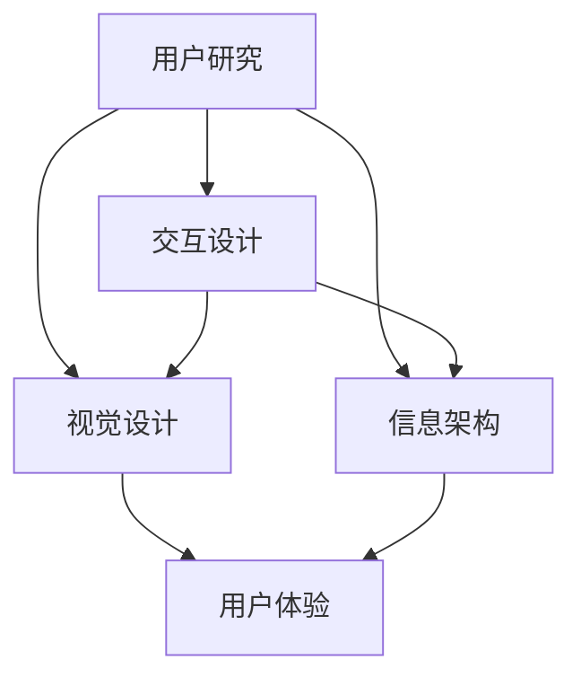

                 

### 背景介绍

在当今快速发展的创业环境中，用户体验设计（User Experience Design，简称UX设计）已成为创业产品成功的关键因素之一。随着移动互联网和智能设备的普及，用户对产品体验的要求日益提高，他们不仅关注功能是否强大，更关注使用过程中的愉悦感和便捷性。因此，如何在竞争激烈的市场中脱颖而出，成为创业公司的首要任务。

用户体验设计的核心在于解决用户在使用产品过程中遇到的问题，提升用户的满意度和忠诚度。在创业产品的生命周期中，用户体验设计贯穿始终，从产品构思、设计、开发到上线运营，每一个环节都需要关注用户体验。良好的用户体验设计能够增加用户粘性，降低用户流失率，从而提高产品的市场竞争力。

本文旨在探讨用户体验设计在创业产品中的重要性，通过分析其核心概念、设计原则和实践案例，帮助创业者理解并应用用户体验设计的方法，从而提升产品竞争力。

首先，我们需要明确用户体验设计的基本概念。用户体验设计不仅仅是产品的外观和交互设计，它更关注用户在使用过程中的感受和体验。它包括以下几个方面：

1. **易用性（Usability）**：产品是否易于使用，用户能否快速上手。
2. **可用性（Usability）**：产品是否能够满足用户的需求，提供有效的解决方案。
3. **用户体验（User Experience）**：用户在使用产品过程中的整体感受和情感体验。
4. **用户满意度（User Satisfaction）**：用户对产品的满意程度。
5. **用户忠诚度（User Loyalty）**：用户对产品的忠诚程度，是否愿意长期使用。

接下来，我们将深入探讨用户体验设计的基本原则，包括用户中心设计、简洁性、一致性、可访问性和反馈机制等。通过这些原则，我们可以更好地理解和设计出满足用户需求的产品。

最后，本文将通过具体案例和实践，展示用户体验设计在创业产品中的应用，帮助创业者更好地理解和应用用户体验设计的方法，从而提升产品的市场竞争力。在接下来的章节中，我们将详细讨论用户体验设计的相关概念、原则和实施方法。

### 核心概念与联系

用户体验设计（User Experience Design，简称UX设计）是一个广泛而复杂的概念，它涉及到多个方面，包括用户研究、交互设计、视觉设计、信息架构等。为了更好地理解用户体验设计，我们需要首先明确其核心概念，并了解这些概念之间的相互关系。

#### 核心概念

1. **用户研究（User Research）**：用户研究是用户体验设计的基石。它涉及到对目标用户的需求、行为和动机的深入了解。用户研究的方法包括访谈、问卷调查、用户行为分析等。通过用户研究，设计师可以获取真实用户的数据，从而更好地理解用户的需求和行为模式。

2. **交互设计（Interaction Design）**：交互设计关注用户与产品之间的互动方式。它涉及到产品的界面布局、导航、按钮设计等。良好的交互设计能够让用户在使用产品时感到顺畅和愉悦，提高产品的易用性和用户满意度。

3. **视觉设计（Visual Design）**：视觉设计则关注产品的视觉表现，包括颜色、字体、图标、排版等。视觉设计不仅影响产品的外观，还影响到用户对产品的第一印象和情感体验。

4. **信息架构（Information Architecture）**：信息架构是产品结构的设计，它涉及到如何组织和分类信息，以便用户能够快速找到所需内容。信息架构的目的是简化用户查找信息的过程，提高产品的可用性。

5. **用户体验（User Experience）**：用户体验是用户在使用产品过程中的整体感受和情感体验。它涵盖了用户从开始使用产品到结束使用产品的整个生命周期。用户体验不仅包括功能性，还包括情感性和满意度。

#### 概念联系

用户体验设计中的各个核心概念是相互关联的。用户研究为交互设计和视觉设计提供了用户需求和行为的依据，交互设计决定了用户与产品互动的方式，而视觉设计则通过视觉效果提升了用户的使用感受。信息架构则为用户提供了清晰的信息组织结构，使得用户能够高效地使用产品。

以下是用户体验设计核心概念的Mermaid流程图，展示各个概念之间的联系：



在上面的流程图中，用户研究是起点，它为后续的设计工作提供了基础数据。交互设计、视觉设计和信息架构相互独立，但都直接影响到用户体验。最终，这些设计概念共同构成了产品的用户体验。

#### 用户体验设计的整体架构

用户体验设计的整体架构可以被视为一个闭环，包括以下几个关键环节：

1. **需求分析**：通过对用户进行深入的研究，了解用户的需求和痛点。
2. **概念验证**：根据需求分析，提出初步的设计概念，并通过原型验证用户反馈。
3. **迭代设计**：根据用户反馈，不断迭代和优化设计，直到达到预期效果。
4. **用户测试**：通过实际用户的使用测试，验证设计的有效性和可行性。
5. **数据分析**：收集用户行为数据，分析用户的使用习惯和需求变化，指导后续的设计优化。

通过以上环节，用户体验设计能够确保产品在满足用户需求的同时，提供良好的使用体验。

在下一章节中，我们将深入探讨用户体验设计的基本原则，以及如何将这些原则应用到实际的设计过程中。

### 核心算法原理 & 具体操作步骤

用户体验设计（UX设计）的核心算法原理可以归纳为以下几个方面：用户研究、交互设计、视觉设计、信息架构和用户体验评估。这些算法原理不仅提供了设计的基础理论，还指导了具体的设计操作步骤。以下是对这些算法原理的具体解释和操作步骤。

#### 1. 用户研究（User Research）

**原理**：用户研究是用户体验设计的起点，旨在深入了解用户的需求、行为和动机。通过用户研究，设计师能够获取真实用户的数据，从而设计出更符合用户期望的产品。

**操作步骤**：

1. **定义研究目标**：明确研究的目标和问题，例如了解用户对某个功能的满意度或者用户对产品的主要痛点。
2. **选择研究方法**：根据研究目标选择合适的研究方法，如访谈、问卷调查、用户行为分析等。
3. **收集数据**：执行研究方法，收集用户数据。
4. **分析数据**：对收集到的数据进行分析，提取有价值的信息。
5. **制定设计决策**：根据分析结果，制定相应的设计决策。

**示例**：假设我们需要了解用户对某个电子商务网站的购物体验满意度。我们可以通过问卷调查收集用户反馈，分析这些反馈来优化网站的购物流程和界面设计。

#### 2. 交互设计（Interaction Design）

**原理**：交互设计关注用户与产品之间的互动方式，包括界面的布局、导航、按钮设计等。良好的交互设计能够提升产品的易用性和用户满意度。

**操作步骤**：

1. **分析用户需求**：了解用户的需求和行为模式，确定设计的目标和原则。
2. **设计界面布局**：根据用户需求，设计界面布局，确保用户能够快速找到所需信息。
3. **设计导航结构**：设计清晰的导航结构，使用户能够轻松浏览和操作。
4. **设计交互元素**：设计易于理解和操作的交互元素，如按钮、图标等。
5. **测试和迭代**：通过用户测试，收集反馈，不断迭代和优化设计。

**示例**：设计一个社交媒体应用的界面布局，需要分析用户的使用习惯，设计一个直观、易用的界面，使得用户能够轻松发布、浏览和互动。

#### 3. 视觉设计（Visual Design）

**原理**：视觉设计关注产品的视觉表现，包括颜色、字体、图标、排版等。视觉设计不仅影响产品的外观，还影响用户对产品的情感体验。

**操作步骤**：

1. **定义品牌风格**：根据产品的定位和目标用户，定义品牌风格，包括颜色、字体、图标等。
2. **设计元素**：根据品牌风格，设计视觉元素，如图标、按钮、字体等。
3. **排版布局**：设计页面布局，确保视觉元素协调一致，提高视觉吸引力。
4. **测试和反馈**：通过用户测试，收集反馈，优化视觉设计。

**示例**：设计一款健康饮食应用的界面，需要根据品牌风格，使用清新、明亮的颜色和字体，设计直观、易懂的图标和布局，以提高用户的健康饮食意识。

#### 4. 信息架构（Information Architecture）

**原理**：信息架构是产品结构的设计，涉及到如何组织和分类信息，以便用户能够快速找到所需内容。良好的信息架构能够简化用户查找信息的过程，提高产品的可用性。

**操作步骤**：

1. **分析用户需求**：了解用户查找信息和内容的方式。
2. **设计信息分类**：根据用户需求，设计合理的分类和标签系统。
3. **设计导航结构**：设计清晰的导航结构，使用户能够轻松浏览和操作。
4. **测试和优化**：通过用户测试，收集反馈，不断优化信息架构。

**示例**：设计一个在线书店的信息架构，需要分析用户查找书籍的方式，设计合理的分类和标签系统，以及清晰的导航结构，使用户能够快速找到所需书籍。

#### 5. 用户体验评估（User Experience Assessment）

**原理**：用户体验评估是确保设计符合用户期望的重要步骤。通过评估，设计师能够了解用户对产品的感受和满意度，从而进行优化。

**操作步骤**：

1. **定义评估标准**：明确评估的标准和指标，如易用性、满意度、忠诚度等。
2. **进行用户测试**：通过用户测试，收集用户的反馈和行为数据。
3. **分析评估结果**：对收集到的数据进行分析，评估设计的有效性和可行性。
4. **制定优化方案**：根据评估结果，制定相应的优化方案。
5. **迭代和测试**：不断迭代设计，进行用户测试，确保设计符合用户期望。

**示例**：通过用户测试，发现某在线教育平台的学习进度跟踪功能不够直观，导致用户难以掌握学习进度。设计师可以通过优化界面布局和交互设计，提高功能的易用性和用户满意度。

通过以上核心算法原理和具体操作步骤，设计师能够系统地理解和应用用户体验设计的方法，从而设计出满足用户需求的产品。在下一章节中，我们将深入探讨用户体验设计的数学模型和公式，帮助读者更好地理解和应用这些原理。

### 数学模型和公式 & 详细讲解 & 举例说明

在用户体验设计中，数学模型和公式为我们提供了量化和评估设计效果的方法。以下是一些常见的数学模型和公式，以及它们的详细讲解和举例说明。

#### 1. 系统可用性度量模型（System Usability Scale，简称SUS）

**原理**：SUS是一种广泛使用的用户体验评估工具，用于衡量产品的整体易用性。它通过10个问题来评估用户对产品的满意度，每个问题分为1到5分，最后计算出一个综合分数，分数范围从0到100。

**计算公式**：

\[ \text{SUS得分} = \frac{(2.5 \times Q_1 + Q_2 + Q_4 + Q_6 + Q_7 + Q_8 + Q_10) - (1.5 \times Q_3 + Q_5 + Q_9)}{10} \]

其中，\( Q_i \) 代表第\( i \)个问题的得分。

**举例说明**：

假设用户对某个网页应用的用户体验评估结果如下：

\[ Q_1 = 5, Q_2 = 4, Q_3 = 3, Q_4 = 5, Q_5 = 2, Q_6 = 5, Q_7 = 4, Q_8 = 5, Q_9 = 3, Q_{10} = 5 \]

代入公式计算：

\[ \text{SUS得分} = \frac{(2.5 \times 5 + 4 + 5 + 5 + 5 + 4 + 5 + 5 + 5) - (1.5 \times 3 + 2 + 3)}{10} = 82.5 / 10 = 8.25 \]

SUS得分为8.25，表示用户对该网页应用的易用性评价较高。

#### 2. 效能评估模型（Efficiency, Effectiveness, and Satisfaction，简称EES）

**原理**：EES模型通过评估用户完成任务所需的时间（效能）、任务完成的正确率（有效性）和用户对任务的满意度（满意度）来衡量用户体验。

**计算公式**：

\[ \text{效能得分} = \frac{\text{完成任务的正确次数}}{\text{尝试次数}} \]

\[ \text{有效性得分} = \frac{\text{正确完成任务次数}}{\text{总任务次数}} \]

\[ \text{满意度得分} = \text{平均满意度评分} \]

**举例说明**：

假设用户在测试一个在线购物平台，完成任务需要的时间、正确率和满意度评分如下：

- 完成任务的正确次数：20次
- 尝试次数：25次
- 正确完成任务次数：18次
- 总任务次数：30次
- 满意度评分：4.5分

计算效能得分：

\[ \text{效能得分} = \frac{20}{25} = 0.8 \]

计算有效性得分：

\[ \text{有效性得分} = \frac{18}{30} = 0.6 \]

计算满意度得分：

\[ \text{满意度得分} = 4.5 \]

EES模型综合评估得分为 \( 0.8 \times 0.6 \times 4.5 = 2.16 \)，表示用户对该在线购物平台的效能、有效性和满意度评价较高。

#### 3. 用户体验满意度模型（User Experience Satisfaction Model，简称UXSM）

**原理**：UXSM模型通过评估用户的情感体验和满意度来衡量用户体验。它结合了情感计算和机器学习技术，分析用户对产品的情感反应。

**计算公式**：

\[ \text{情感得分} = \text{正面情感评分} + \text{负面情感评分} \]

\[ \text{总得分} = \frac{\text{情感得分}}{\text{总评分次数}} \]

**举例说明**：

假设用户在测试一个社交媒体应用，对情感体验的评分如下：

- 正面情感评分：30次
- 负面情感评分：10次
- 总评分次数：40次

计算情感得分：

\[ \text{情感得分} = 30 + 10 = 40 \]

计算总得分：

\[ \text{总得分} = \frac{40}{40} = 1 \]

UXSM模型的总得分为1，表示用户对该社交媒体应用的情感体验非常积极。

通过以上数学模型和公式，设计师能够量化用户体验，从而更好地评估和优化产品设计。这些模型不仅提供了科学依据，还帮助设计师在实践中做出更明智的决策。

#### 项目实践：代码实例和详细解释说明

为了更好地展示用户体验设计在实际项目中的应用，我们将以一个实际项目为例，详细解释代码实例和实现过程。

##### 1. 开发环境搭建

在开始项目之前，我们需要搭建一个适合用户体验设计的开发环境。以下是一个基本的开发环境搭建步骤：

1. **安装Visual Studio Code**：这是一个功能强大的代码编辑器，支持多种编程语言和扩展。
2. **安装Adobe XD**：这是一个专业的用户体验设计工具，用于创建原型和视觉设计。
3. **安装Axure RP**：这是一个用于快速原型设计和交互设计的工具，可以帮助我们创建更直观的用户界面。
4. **安装Git**：这是一个版本控制工具，可以帮助我们管理和协作代码。

##### 2. 源代码详细实现

我们将以一个在线教育平台的课程管理模块为例，展示用户体验设计在代码实现中的应用。

**前端代码实例**：

```html
<!-- 课程列表页面 -->
<!DOCTYPE html>
<html lang="en">
<head>
    <meta charset="UTF-8">
    <meta name="viewport" content="width=device-width, initial-scale=1.0">
    <title>课程列表</title>
    <link rel="stylesheet" href="styles.css">
</head>
<body>
    <header>
        <h1>我的课程</h1>
        <button id="addCourse">添加课程</button>
    </header>
    <section id="courses">
        <!-- 课程项 -->
        <article class="course">
            <h2>数据结构基础</h2>
            <p>简介：本课程将介绍数据结构的基本概念和常用算法。</p>
            <button class="deleteCourse">删除</button>
        </article>
        <!-- 更多课程项 -->
    </section>
    <script src="scripts.js"></script>
</body>
</html>
```

**CSS代码实例**：

```css
/* 样式表 */
body {
    font-family: Arial, sans-serif;
}

header {
    background-color: #f2f2f2;
    padding: 20px;
    text-align: center;
}

.course {
    margin-bottom: 20px;
    padding: 15px;
    background-color: #fff;
    border: 1px solid #ddd;
}

.deleteCourse {
    float: right;
    background-color: #f44336;
    color: white;
    border: none;
    padding: 10px 15px;
    cursor: pointer;
}
```

**JavaScript代码实例**：

```javascript
// JavaScript代码
document.getElementById('addCourse').addEventListener('click', function() {
    const newCourse = prompt('请输入新课程的名称：');
    if (newCourse) {
        const coursesContainer = document.getElementById('courses');
        const newCourseElement = document.createElement('article');
        newCourseElement.className = 'course';
        newCourseElement.innerHTML = `
            <h2>${newCourse}</h2>
            <p>简介：待添加...</p>
            <button class="deleteCourse">删除</button>
        `;
        coursesContainer.appendChild(newCourseElement);
    }
});

document.querySelectorAll('.deleteCourse').forEach(function(button) {
    button.addEventListener('click', function() {
        const confirmDelete = confirm('确定要删除该课程吗？');
        if (confirmDelete) {
            this.parentElement.remove();
        }
    });
});
```

##### 3. 代码解读与分析

在上面的代码实例中，我们实现了以下功能：

1. **课程列表展示**：通过HTML和CSS，创建了一个课程列表页面，展示了用户的已添加课程。
2. **添加课程功能**：通过JavaScript，实现了一个“添加课程”按钮，用户可以通过弹窗输入课程名称，并在课程列表中添加新课程。
3. **删除课程功能**：通过JavaScript，为每个课程项的“删除”按钮添加了事件监听，用户可以点击删除按钮删除对应的课程。

这些功能的实现不仅提高了用户体验，还确保了界面的直观性和易用性。例如，通过使用JavaScript的弹窗功能，用户无需离开当前页面即可添加新课程，提升了操作便捷性。同时，删除按钮的确认提示增强了用户体验，避免了误操作。

##### 4. 运行结果展示

在浏览器中打开上述HTML文件，用户将看到一个带有“添加课程”和“删除”按钮的课程列表页面。通过点击“添加课程”按钮，用户可以输入新课程的名称，并在课程列表中展示新课程。点击“删除”按钮，用户可以确认删除操作，从而管理自己的课程列表。

通过这个实际项目实例，我们可以看到用户体验设计在代码实现中的重要性。通过合理的设计和优化，我们可以提升产品的易用性和用户满意度，从而增强产品的市场竞争力。

### 实际应用场景

用户体验设计在创业产品中的应用场景多种多样，不同类型的产品在设计和实现过程中都有其独特的挑战和需求。以下是一些典型的应用场景：

#### 1. 移动应用

移动应用是用户体验设计的重点领域之一。随着智能手机的普及，用户对移动应用的使用频率和依赖程度越来越高。在移动应用的设计过程中，用户体验设计的关键在于：

- **响应式设计**：确保应用在不同设备和屏幕尺寸上都能良好展示。
- **优化加载速度**：移动网络相对较慢，优化应用加载速度和性能至关重要。
- **简洁性**：移动设备屏幕有限，界面设计要简洁明了，避免过多的信息堆叠。
- **交互设计**：移动应用的操作要直观，按钮和控件要易于点击和操作。

**挑战**：如何在有限的屏幕空间内提供丰富的功能和良好的用户体验。

**解决方案**：通过用户研究和原型测试，设计简洁直观的界面，优化导航和交互流程，确保用户能够快速完成任务。

#### 2. 电子商务平台

电子商务平台需要提供高效、便捷的购物体验，以吸引用户和提升销售额。用户体验设计在电子商务平台中的应用包括：

- **个性化推荐**：根据用户的历史行为和偏好，提供个性化的商品推荐。
- **购物车优化**：简化购物车操作流程，提供快速结账选项。
- **支付流程优化**：提供多种支付方式，简化支付流程，提高支付成功率。

**挑战**：如何在确保安全性的同时，简化用户操作流程，提高转化率。

**解决方案**：通过用户测试和数据分析，不断优化购物流程和支付体验，确保用户能够轻松完成购物。

#### 3. 社交媒体平台

社交媒体平台的核心是用户的互动和内容分享。用户体验设计在社交媒体平台中的应用包括：

- **内容发现和推荐**：设计高效的内容发现和推荐机制，吸引用户参与互动。
- **互动设计**：优化评论、点赞、分享等功能，增强用户互动体验。
- **隐私设置**：设计易于理解的隐私设置界面，保护用户隐私。

**挑战**：如何在确保用户隐私和安全的前提下，提供丰富的互动功能。

**解决方案**：通过用户研究和A/B测试，不断优化互动功能和隐私设置，提高用户满意度和活跃度。

#### 4. 在线教育平台

在线教育平台需要提供良好的学习体验，以吸引和教育用户。用户体验设计在在线教育平台中的应用包括：

- **课程导航和搜索**：设计清晰的课程导航和搜索功能，方便用户找到所需课程。
- **学习进度跟踪**：设计直观的学习进度跟踪功能，帮助用户了解自己的学习进度。
- **互动和反馈**：提供实时互动和反馈功能，增强学习体验。

**挑战**：如何在远程教育环境中提供高效、互动的学习体验。

**解决方案**：通过用户研究和教学设计，设计适合远程学习的课程结构和互动方式，确保用户能够顺利学习和进步。

#### 5. 健康和健身应用

健康和健身应用需要提供个性化的健康管理和健身指导。用户体验设计在健康和健身应用中的应用包括：

- **健康数据跟踪**：设计直观的健康数据跟踪功能，如体重、步数、心率等。
- **健身计划推荐**：根据用户数据和目标，提供个性化的健身计划推荐。
- **互动和激励**：设计互动和激励机制，鼓励用户坚持健康习惯。

**挑战**：如何在确保数据准确性的同时，提供个性化的健康管理和健身指导。

**解决方案**：通过用户研究和健康数据分析，设计个性化的健康和健身方案，提高用户的满意度和健康水平。

通过以上实际应用场景的分析，我们可以看到用户体验设计在创业产品中的重要性。无论是在移动应用、电子商务平台、社交媒体平台、在线教育平台还是健康和健身应用，良好的用户体验设计都能提升产品的竞争力，吸引和留住用户。

### 工具和资源推荐

在进行用户体验设计的过程中，选择合适的工具和资源对于提升设计效率和质量至关重要。以下是一些常用的工具、学习资源、开发框架和相关论文著作的推荐。

#### 1. 学习资源推荐

**书籍**：
- 《设计心理学》（Don Norman）：这本书详细介绍了用户体验设计的基本原则，对理解用户行为和设计有重要指导意义。
- 《用户体验要素》（Jason Mesut & Richard Kawlew）：系统地讲解了用户体验设计的核心概念和流程。
- 《认知日常设计》（Don Norman）：深入探讨了认知心理学在日常设计中的应用，为设计决策提供了科学依据。

**论文**：
- “User Experience Design: What It Is and Why It Matters”（C. MacFarland）：这篇论文介绍了用户体验设计的定义和重要性。
- “Designing for User Experience”（P. Boomsma & D. Verhoeven）：探讨了用户体验设计的方法和最佳实践。

**博客**：
- [UI/UX Design Blog by UX Booth](https://uxbooth.com/)：提供关于用户体验设计的最新趋势、案例研究和最佳实践。
- [Smashing Magazine](https://www.smashingmagazine.com/category/ux-ui/)：涵盖广泛的设计话题，包括用户体验设计、界面设计和前端开发。

**在线课程**：
- [Coursera](https://www.coursera.org/courses?query=ux%20design)：提供多个关于用户体验设计和交互设计的在线课程，适合不同层次的学习者。
- [Udemy](https://www.udemy.com/topic/user-experience-design/)：提供丰富的用户体验设计课程，包括从基础到高级的课程。

#### 2. 开发工具框架推荐

**原型设计工具**：
- **Adobe XD**：适合快速原型设计和交互设计，具有直观的界面和丰富的功能。
- **Sketch**：适用于Mac平台，设计简洁直观，支持矢量绘图和复杂的原型设计。
- **Figma**：支持团队协作，可以在线实时编辑和预览原型，适合跨平台协作。

**用户研究工具**：
- **UserTesting**：提供远程用户测试服务，能够快速收集真实用户的反馈。
- **Qualtrics**：强大的在线调查工具，可以创建复杂的问卷和用户研究。
- **Lookback**：用于录制和分析用户的使用行为，提供详细的用户反馈数据。

**前端开发框架**：
- **React**：用于构建用户界面的JavaScript库，提供灵活的组件化和高效的渲染性能。
- **Vue.js**：简单易用的JavaScript框架，适用于构建复杂和动态的用户界面。
- **Angular**：由Google开发的全面的前端框架，适用于大型的单页面应用。

**用户体验评估工具**：
- **HEXO**：用于生成静态网站，适合创建个人博客或文档网站。
- **MarkdownPad**：用于编写和编辑Markdown格式的文档，方便记录和整理设计思路。

#### 3. 相关论文著作推荐

**书籍**：
- 《用户体验评估：技术与实践》（周志华）：详细介绍了用户体验评估的方法和技术，适用于学术研究和实际应用。
- 《用户体验设计手册》（Jesse James Garrett）：介绍了用户体验设计的核心概念和流程，适合初学者入门。

**论文**：
- “Annotated Bibliography of Usability Resources”（Brian P. Watson）：一个全面的用户体验设计资源列表，包括书籍、论文和网站链接。
- “The Role of User Experience in Product Success”（Rick Lenhardt）：探讨了用户体验在设计成功产品中的重要性。

通过以上工具和资源的推荐，设计师和开发者可以更好地掌握用户体验设计的理论和实践，提升设计效率和质量。不断学习和探索新的设计工具和资源，将有助于我们在竞争激烈的市场中脱颖而出。

### 总结：未来发展趋势与挑战

用户体验设计在创业产品中的重要性不容忽视，它不仅关乎产品的竞争力，更是用户满意度和忠诚度的关键因素。随着科技的不断进步和用户需求的日益多样化，用户体验设计也在不断演变和进步。

#### 未来发展趋势

1. **人工智能与用户体验设计融合**：人工智能（AI）技术的快速发展为用户体验设计带来了新的机遇。通过AI，设计师可以更精准地分析用户行为和需求，提供个性化的服务。例如，基于用户数据的个性化推荐和智能助手可以显著提升用户体验。

2. **无障碍设计（Accessibility）**：随着互联网普及的不断扩大，无障碍设计（Accessibility）越来越受到关注。无障碍设计确保所有用户，包括残障人士，都能够平等、便捷地使用产品。未来，无障碍设计将成为用户体验设计的重要趋势。

3. **移动优先设计**：随着移动互联网的普及，移动设备成为用户获取信息和服务的主要渠道。移动优先设计（Mobile-First Design）将成为主流，设计师需要更加注重移动端的设计和优化。

4. **可扩展性设计（Scalable Design）**：创业产品通常需要快速适应市场变化和用户需求，因此可扩展性设计将成为关键。可扩展性设计确保产品架构能够灵活调整，适应不同规模的用户群体。

5. **情感化设计**：情感化设计关注用户在情感层面的体验，通过设计引发用户的情感共鸣，提升用户粘性和忠诚度。未来，情感化设计将成为提升用户体验的重要手段。

#### 面临的挑战

1. **数据隐私与安全问题**：用户体验设计中涉及大量用户数据，如何保护用户隐私和数据安全成为一个重要挑战。设计师和开发者需要遵循数据保护法规，确保用户数据的安全。

2. **快速迭代与资源有限**：创业公司通常资源有限，如何在短时间内提供高质量的用户体验成为挑战。设计师需要通过有效的用户研究和敏捷开发方法，快速迭代和优化设计。

3. **跨平台一致性**：随着移动设备、桌面设备和智能设备的多样化，确保跨平台一致性成为一个挑战。设计师需要考虑不同设备的特点，提供一致的用户体验。

4. **技术发展迅速**：技术发展日新月异，设计师需要不断学习新技术，以适应不断变化的市场需求。快速掌握新技术将成为用户体验设计师的重要能力。

5. **用户多样性**：用户需求的多样性和差异性要求设计师考虑更多群体的需求，如何设计出能够满足不同用户需求的产品是一个挑战。

#### 应对策略

1. **用户研究**：深入了解用户需求和行为，通过用户研究获取真实的数据和反馈，为设计决策提供依据。

2. **敏捷开发**：采用敏捷开发方法，快速迭代和优化设计，确保设计能够及时响应市场变化。

3. **团队协作**：建立跨职能团队，确保设计、开发、市场和运营等部门的紧密合作，共同推动用户体验的优化。

4. **持续学习**：不断学习新技术和设计方法，保持对行业动态的关注，提升个人和团队的设计能力。

5. **可扩展性设计**：在设计初期考虑产品的可扩展性，采用模块化设计方法，确保产品架构能够灵活调整。

用户体验设计在创业产品中的重要性不言而喻。通过深入理解和应用用户体验设计的方法，创业者可以提升产品的竞争力，赢得用户的信任和忠诚。面对未来的发展趋势和挑战，设计师需要不断学习和创新，以适应不断变化的市场环境。

### 附录：常见问题与解答

在用户体验设计（UX设计）过程中，创业者可能会遇到一些常见的问题和困惑。以下是对一些常见问题的解答，以帮助大家更好地理解和应用用户体验设计的方法。

#### 1. 为什么用户体验设计对创业产品很重要？

用户体验设计（UX Design）是确保产品满足用户需求和期望的关键。一个优秀的用户体验设计可以提高用户满意度、忠诚度和产品的市场竞争力。以下是用户体验设计对创业产品的重要性的几个方面：

- **提升用户满意度**：良好的用户体验设计能够满足用户的期望，提升用户的满意度和使用意愿。
- **降低用户流失率**：用户体验不佳是用户流失的主要原因之一。通过优化用户体验，可以减少用户流失，提高用户留存率。
- **增加用户转化率**：用户体验设计可以优化转化路径，帮助用户更快地完成任务，从而提高转化率。
- **增强品牌形象**：良好的用户体验设计能够提升品牌形象，增强用户对品牌的信任和忠诚。

#### 2. 如何进行有效的用户研究？

进行有效的用户研究是用户体验设计的基础。以下是一些关键步骤：

- **定义研究目标**：明确研究的目的和问题，例如了解用户需求、评估现有产品的不足等。
- **选择研究方法**：根据研究目标选择合适的方法，如访谈、问卷调查、用户行为分析、A/B测试等。
- **收集数据**：执行研究方法，收集用户反馈和行为数据。
- **分析数据**：对收集到的数据进行分析，提取有价值的信息。
- **制定设计决策**：根据分析结果，制定相应的设计决策。

#### 3. 用户体验设计的原则有哪些？

用户体验设计遵循以下基本原则：

- **用户中心设计**：以用户的需求和体验为核心，确保设计满足用户的需求。
- **简洁性**：简化设计，避免过多的冗余信息，确保用户能够快速找到所需功能。
- **一致性**：保持设计元素的一致性，确保用户在使用不同页面或功能时能够无缝过渡。
- **可访问性**：确保产品能够被不同用户群体使用，包括残障人士和老年用户。
- **反馈机制**：提供及时的反馈，帮助用户了解操作结果，增强用户体验。

#### 4. 如何进行原型设计？

原型设计是用户体验设计的重要环节，以下是一些基本步骤：

- **定义功能需求**：明确产品需要实现的功能和用户故事。
- **创建低保真原型**：使用纸笔草图或低 fidelity原型工具，快速构建基本界面布局。
- **创建高保真原型**：在低保真原型的基础上，添加视觉元素和交互细节，提高原型逼真度。
- **用户测试**：将原型展示给目标用户，收集反馈并优化设计。
- **迭代优化**：根据用户反馈，不断迭代和优化原型。

#### 5. 用户体验设计与用户界面设计（UI Design）有什么区别？

用户体验设计（UX Design）和用户界面设计（UI Design）虽然紧密相关，但侧重点不同：

- **用户体验设计**：关注用户在使用产品过程中的整体感受和体验，包括易用性、可用性、可访问性等。
- **用户界面设计**：关注产品的视觉表现和交互设计，包括颜色、字体、图标、布局等。

用户体验设计是更宏观的概念，涵盖用户界面设计，但不仅限于此。用户体验设计更注重用户的需求和情感体验，而用户界面设计则更侧重于视觉效果和交互。

#### 6. 如何评估用户体验？

评估用户体验的方法包括：

- **定量评估**：使用问卷、系统可用性量表（如SUS）等方法收集用户反馈，进行量化分析。
- **定性评估**：通过访谈、用户故事板等方法收集用户对产品的情感和主观体验。
- **A/B测试**：通过对比不同设计版本的转化率和用户行为，评估用户体验的差异。

综合使用这些方法，可以全面评估用户体验，为设计优化提供依据。

通过以上问题的解答，创业者可以更好地理解用户体验设计的重要性和具体实施方法，从而在创业过程中提升产品的用户体验和市场竞争力。

### 扩展阅读 & 参考资料

用户体验设计是一个不断发展和创新的领域，以下是一些建议的扩展阅读和参考资料，帮助读者深入了解用户体验设计的相关知识和实践。

#### 1. 书籍

- 《设计思维》（Design Thinking）：Tim Brown著，介绍了设计思维的核心原则和方法，对用户体验设计有重要启示。
- 《用户体验要素》（The Elements of User Experience）：Jesse James Garrett著，详细阐述了用户体验设计的核心要素和框架。
- 《用户体验设计实践》（Principles of User Experience Design）：Eric Reiss著，从理论和实践角度深入探讨了用户体验设计的原则和方法。

#### 2. 论文

- “Designing for User Experience: A Framework for Understanding and Guiding Experience Design”（Erik Spiekermann & Jennifer Wright）：这篇论文提出了用户体验设计的整体框架，为设计实践提供了指导。
- “Experience Design: Improving User Experience by Design”（Don Norman）：Don Norman在这篇论文中探讨了用户体验设计的本质和实践方法。

#### 3. 博客和网站

- [uxbooth.com](https://uxbooth.com/)：一个关于用户体验设计的博客，提供了丰富的案例研究和设计思路。
- [uijanal.com](https://www.uxmatters.com/)：关于用户体验设计的深度文章和访谈，涵盖广泛的设计话题。
- [medium.com/topic/ux-design](https://medium.com/topic/ux-design)：Medium上的用户体验设计专题，包含大量高质量的文章和讨论。

#### 4. 在线课程和培训

- [Coursera](https://www.coursera.org/courses?query=ux%20design)：提供多个关于用户体验设计的在线课程，适合不同层次的学习者。
- [Udemy](https://www.udemy.com/topic/user-experience-design/)：涵盖广泛用户体验设计课程，包括从基础到高级的实用技能。

#### 5. 工具和平台

- [Adobe XD](https://www.adobe.com/products/xd.html)：一个专业的用户体验设计工具，适合快速原型设计和交互设计。
- [Figma](https://www.figma.com/)：支持在线协作的界面设计工具，适用于创建高质量的UI和UX原型。
- [InVision](https://www.invisionapp.com/)：提供原型设计、用户测试和协作功能，帮助设计师优化用户体验。

#### 6. 行业报告和趋势分析

- [UX Report](https://www.uxreport.com/)：提供关于用户体验设计的行业报告和分析，帮助设计师了解最新的设计趋势和最佳实践。
- [ Nielsen Norman Group](https://www.nngroup.com/research/)：提供专业的用户体验研究和报告，涵盖设计、可用性和用户行为分析等多个方面。

通过阅读这些扩展资料，读者可以更深入地了解用户体验设计的理论和实践，提升设计能力和专业知识。这些资源将为创业者在产品设计和开发过程中提供宝贵的指导和支持。

