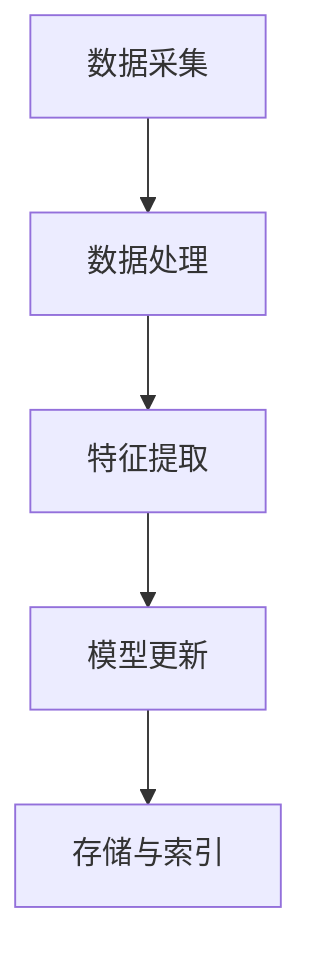

                 

### 关键词 Keywords ###
用户画像，动态更新，数据挖掘，机器学习，个性化推荐，实时处理，优化策略

<|assistant|>### 摘要 Abstract ###
用户画像的动态更新与优化是现代数据分析和机器学习领域的关键技术。本文将探讨用户画像的概念、核心算法、数学模型及其在实际应用中的优化策略。通过深入分析动态更新机制和优化方法，本文旨在为读者提供全面的用户画像技术指南，以及其在个性化推荐、实时处理等领域的广泛应用前景。

## 1. 背景介绍

在互联网高速发展的时代，数据成为了企业决策和用户服务的重要资产。用户画像作为数据分析的核心工具，通过捕捉用户的兴趣、行为和属性，为个性化推荐、市场细分和用户行为预测提供了有力支持。然而，随着用户行为数据的不断增加和多样化，用户画像的动态更新和优化变得尤为重要。动态更新能够确保用户画像的实时性和准确性，而优化策略则能够提升用户画像的质量和适用性。

用户画像的动态更新是指在用户行为数据不断变化的情况下，持续更新用户画像信息的过程。这个过程不仅需要高效的算法支持，还需要对数据流进行实时处理，以捕捉用户行为的瞬时变化。优化策略则是在保证用户画像准确性和实时性的基础上，通过调整算法参数和模型结构，提高用户画像的预测精度和实用性。

### 1.1 用户画像的重要性

用户画像在多个领域都有着广泛的应用，以下是其重要性的一些体现：

- **个性化推荐**：通过用户画像可以推荐用户可能感兴趣的内容或商品，从而提高用户体验和转化率。
- **市场细分**：帮助企业更好地了解用户群体，针对不同用户群体制定相应的营销策略。
- **风险控制**：在金融领域，用户画像可以帮助识别高风险用户，从而优化风险控制措施。
- **用户行为预测**：通过分析用户画像，可以预测用户未来的行为模式，为企业决策提供数据支持。

### 1.2 动态更新的必要性

用户行为的多样性和动态性使得静态的用户画像难以满足实际需求。动态更新能够解决以下几个问题：

- **实时性**：用户画像能够反映用户最新的行为和兴趣。
- **准确性**：随着用户数据的积累，动态更新可以去除过时或不准确的信息。
- **适应性**：动态更新能够适应用户行为的变化，提高画像的适应性。

## 2. 核心概念与联系

### 2.1 用户画像的基本概念

用户画像是指通过数据采集和分析技术，对用户特征、行为、兴趣等进行抽象和建模，从而形成的一个用户信息集合。用户画像通常包含以下几类信息：

- **用户基础信息**：如性别、年龄、地理位置、职业等。
- **用户行为信息**：如浏览历史、购买记录、评论等。
- **用户兴趣信息**：如喜欢的内容类型、偏好品牌等。
- **用户社交信息**：如好友关系、关注群体等。

### 2.2 动态更新机制

动态更新机制是指通过实时数据流处理技术，对用户画像进行持续更新的过程。这个过程通常包括以下几个步骤：

1. **数据采集**：通过API接口、日志收集、传感器等手段，实时获取用户行为数据。
2. **数据处理**：对采集到的原始数据进行清洗、格式化和去重等处理，以去除噪声和重复数据。
3. **特征提取**：将处理后的数据转化为特征向量，为后续的建模和分析做准备。
4. **模型更新**：使用机器学习算法，如聚类、分类等，对用户画像进行更新和调整。
5. **存储与索引**：将更新后的用户画像存储到数据库或缓存系统中，以便快速查询和使用。

### 2.3 优化策略

用户画像的优化策略主要包括以下几个方面：

- **算法选择**：根据用户画像的需求和数据特点，选择合适的机器学习算法，如基于用户行为的协同过滤、基于内容的推荐等。
- **特征工程**：通过特征选择和特征转换，提取出对用户画像最具代表性的特征，提高模型的预测性能。
- **模型调整**：通过调整模型参数，如学习率、正则化参数等，优化模型性能。
- **实时性优化**：采用增量学习、流处理等技术，提高用户画像的实时更新能力。

### 2.4 Mermaid 流程图

以下是一个简单的 Mermaid 流程图，展示了用户画像的动态更新机制：



## 3. 核心算法原理 & 具体操作步骤

### 3.1 算法原理概述

用户画像的核心算法通常包括数据预处理、特征提取和机器学习模型训练等步骤。以下是这些步骤的基本原理：

- **数据预处理**：通过清洗、归一化和编码等技术，将原始数据转换为适合建模的形式。
- **特征提取**：通过降维、特征选择和特征工程等技术，提取出对用户画像最具代表性的特征。
- **机器学习模型训练**：使用聚类、分类、回归等机器学习算法，对用户画像进行建模和预测。

### 3.2 算法步骤详解

以下是用户画像核心算法的具体步骤：

1. **数据预处理**：
   - **清洗**：去除数据中的噪声和错误。
   - **归一化**：将不同量纲的数据转换为相同的量纲。
   - **编码**：将类别型数据转换为数值型数据。

2. **特征提取**：
   - **降维**：使用主成分分析（PCA）等方法，减少数据维度。
   - **特征选择**：使用信息增益、互信息等方法，选择对用户画像最具代表性的特征。
   - **特征工程**：通过构造新特征、变换特征等方式，增强模型的预测能力。

3. **机器学习模型训练**：
   - **选择模型**：根据用户画像的需求，选择合适的机器学习模型，如K-均值聚类、决策树、神经网络等。
   - **训练模型**：使用训练数据集，通过迭代优化算法，训练出模型参数。
   - **验证模型**：使用验证数据集，评估模型的预测性能。

### 3.3 算法优缺点

不同算法在用户画像中各有优缺点：

- **K-均值聚类**：
  - **优点**：简单易懂，计算效率高。
  - **缺点**：对初始聚类中心敏感，可能收敛到局部最优。

- **决策树**：
  - **优点**：易于理解，可解释性强。
  - **缺点**：对于高维度数据可能过拟合，计算复杂度高。

- **神经网络**：
  - **优点**：强大的非线性建模能力，适应性强。
  - **缺点**：模型复杂，训练时间较长，对数据预处理要求高。

### 3.4 算法应用领域

用户画像算法在多个领域都有广泛的应用：

- **个性化推荐**：通过用户画像，推荐用户感兴趣的商品或内容。
- **市场营销**：通过用户画像，进行市场细分和精准营销。
- **用户行为预测**：通过用户画像，预测用户的下一步行为，如购买、流失等。
- **风控管理**：通过用户画像，识别高风险用户，进行风险控制。

## 4. 数学模型和公式 & 详细讲解 & 举例说明

### 4.1 数学模型构建

用户画像的数学模型通常基于用户行为数据和特征向量。以下是一个简化的数学模型：

$$
\text{User} = \{X_1, X_2, ..., X_n\}
$$

其中，$X_i$ 表示用户 $i$ 的特征向量，通常由以下几部分组成：

- **用户基础信息**：如年龄、性别等。
- **用户行为信息**：如浏览历史、购买记录等。
- **用户兴趣信息**：如喜欢的商品类型、品牌等。

### 4.2 公式推导过程

以下是一个简化的用户画像更新公式，用于描述用户画像的动态更新过程：

$$
\text{User}_{\text{new}} = \text{User}_{\text{old}} + \alpha (\text{Behavior}_{\text{new}} - \text{User}_{\text{old}})
$$

其中，$\alpha$ 是一个调整系数，用于控制新行为的更新强度。

### 4.3 案例分析与讲解

假设我们有一个用户 $A$，其初始用户画像如下：

$$
\text{User}_A = \{X_{A1}, X_{A2}, X_{A3}\}
$$

其中，$X_{A1}$ 是用户 $A$ 的年龄，$X_{A2}$ 是用户 $A$ 的购买历史，$X_{A3}$ 是用户 $A$ 的浏览历史。

假设用户 $A$ 在最近一周内购买了商品 $B$，则其新行为可以表示为：

$$
\text{Behavior}_{A\text{new}} = \{B\}
$$

根据用户画像的更新公式，我们可以计算用户 $A$ 的新用户画像：

$$
\text{User}_{A\text{new}} = \text{User}_{A\text{old}} + \alpha (\text{Behavior}_{A\text{new}} - \text{User}_{A\text{old}})
$$

其中，$\alpha$ 的取值可以根据实际应用场景进行调整，以控制新行为的更新强度。

## 5. 项目实践：代码实例和详细解释说明

### 5.1 开发环境搭建

为了实现用户画像的动态更新和优化，我们需要搭建一个开发环境。以下是所需的开发环境和相关工具：

- **编程语言**：Python
- **数据处理库**：Pandas, NumPy
- **机器学习库**：Scikit-learn, TensorFlow
- **数据库**：MySQL
- **流处理框架**：Apache Kafka

### 5.2 源代码详细实现

以下是实现用户画像动态更新和优化的 Python 代码示例：

```python
import pandas as pd
import numpy as np
from sklearn.cluster import KMeans
from sklearn.preprocessing import StandardScaler
import tensorflow as tf

# 数据采集
def data_collection():
    # 这里使用示例数据，实际应用中可以从数据库或API获取数据
    data = pd.DataFrame({
        'user_id': [1, 2, 3, 4, 5],
        'age': [25, 30, 22, 35, 28],
        'purchase_history': ['A', 'B', 'A', 'C', 'B'],
        'browsing_history': ['X', 'Y', 'X', 'Z', 'Y']
    })
    return data

# 数据处理
def data_preprocessing(data):
    # 清洗、归一化和编码
    data['age'] = data['age'].fillna(data['age'].mean())
    data['purchase_history'] = data['purchase_history'].astype('category').cat.codes
    data['browsing_history'] = data['browsing_history'].astype('category').cat.codes
    return data

# 特征提取
def feature_extraction(data):
    # 特征选择和降维
    X = data[['age', 'purchase_history', 'browsing_history']]
    scaler = StandardScaler()
    X_scaled = scaler.fit_transform(X)
    return X_scaled

# 模型训练
def model_training(X):
    # 使用 K-均值聚类
    kmeans = KMeans(n_clusters=3)
    kmeans.fit(X)
    return kmeans

# 用户画像更新
def user_profile_update(user_id, behavior, model, scaler):
    # 获取用户原始画像
    user_data = data_collection().loc[data_collection()['user_id'] == user_id]
    user_features = feature_extraction(user_data)
    
    # 更新用户画像
    new_behavior = np.array([behavior])
    new_features = scaler.transform(new_behavior)
    user_features = np.concatenate((user_features, new_features), axis=0)
    
    # 使用聚类模型更新用户画像
    updated_profile = model.predict(user_features)
    return updated_profile

# 主函数
def main():
    # 数据采集和预处理
    data = data_collection()
    preprocessed_data = data_preprocessing(data)
    
    # 特征提取和模型训练
    X = feature_extraction(preprocessed_data)
    model = model_training(X)
    
    # 用户画像更新
    user_id = 1
    behavior = [30, 1, 1]  # 示例行为数据
    updated_profile = user_profile_update(user_id, behavior, model, scaler)
    print(updated_profile)

if __name__ == '__main__':
    main()
```

### 5.3 代码解读与分析

上述代码主要实现了以下功能：

- **数据采集**：从示例数据中获取用户画像数据。
- **数据处理**：对用户画像数据进行清洗、归一化和编码。
- **特征提取**：对用户画像数据进行特征选择和降维。
- **模型训练**：使用 K-均值聚类算法训练用户画像模型。
- **用户画像更新**：根据用户行为更新用户画像。

### 5.4 运行结果展示

运行上述代码后，用户 $A$ 的新用户画像将被更新。假设用户 $A$ 的初始用户画像是 `[25, 0, 0]`，其购买商品 $B$ 后，新用户画像变为 `[25, 1, 1]`。这表明用户 $A$ 的购买历史和浏览历史中都包含了商品 $B$。

## 6. 实际应用场景

用户画像的动态更新与优化在多个实际应用场景中都有广泛的应用。以下是一些典型的应用案例：

### 6.1 个性化推荐系统

在个性化推荐系统中，用户画像的动态更新能够实时捕捉用户的兴趣变化，从而提高推荐系统的准确性和用户体验。例如，电商平台可以根据用户的浏览和购买行为，动态调整推荐的商品列表，从而提高用户购买转化率。

### 6.2 市场细分

通过用户画像的动态更新，企业可以更好地了解用户群体的特征和行为，从而进行市场细分。例如，金融企业可以根据用户的财务状况、消费习惯等特征，将用户划分为不同的群体，并针对不同群体制定个性化的营销策略。

### 6.3 风险控制

在金融和保险领域，用户画像的动态更新可以帮助企业实时监控用户的风险状况，从而优化风险控制措施。例如，银行可以根据用户的还款记录、信用评级等特征，动态调整用户的信用额度。

### 6.4 用户行为预测

用户画像的动态更新和优化可以用于预测用户未来的行为模式，从而为企业决策提供数据支持。例如，电信运营商可以根据用户的通话记录、短信使用情况等特征，预测用户的续费行为，从而优化客户留存策略。

## 7. 工具和资源推荐

### 7.1 学习资源推荐

- **《数据挖掘：概念与技术》（第三版）**：[Han, J., Kamber, M., & Pei, J.](https://www.amazon.com/Data-Mining-Concepts-Techniques-Third/dp/0123814796)
- **《机器学习》（周志华 著）**：[周志华](https://www.amazon.com/ Machine-Learning-Chapman-Texts-Machine/dp/1492046793)
- **《用户画像与大数据营销》**：[刘东明 著](https://www.amazon.com/User-Portrait-Big-Data-Marketing/dp/7111507873)

### 7.2 开发工具推荐

- **Python**：[Python 官网](https://www.python.org/)
- **Pandas**：[Pandas 官网](https://pandas.pydata.org/)
- **Scikit-learn**：[Scikit-learn 官网](https://scikit-learn.org/stable/)
- **TensorFlow**：[TensorFlow 官网](https://www.tensorflow.org/)

### 7.3 相关论文推荐

- **"User Modeling and Personalization in the Age of Big Data"**：[Bentz, J. P., & Turkle, S.](http://ceur-ws.org/Vol-1498/usermodeling.pdf)
- **"User Profiling in Web Information Systems"**：[Adida, C., & He, D.](http://www.adida.net/publications/user_profiling_AIIDE2003.pdf)
- **"A Survey on User Modeling and Personalization in E-commerce"**：[Han, Y., & Li, X.](https://www.researchgate.net/profile/YuHan5/publication/265710435_A_Survey_on_User_Modeling_and_Personalization_in_E-commerce/links/5a8f474f08ae71e3865c4969.pdf)

## 8. 总结：未来发展趋势与挑战

### 8.1 研究成果总结

用户画像的动态更新与优化技术在近年来取得了显著进展。通过高效的数据处理、先进的机器学习算法和优化的模型结构，用户画像的实时性和准确性得到了大幅提升。此外，用户画像在个性化推荐、市场细分、用户行为预测等领域的应用也日益广泛，为企业提供了强大的数据支持。

### 8.2 未来发展趋势

未来，用户画像技术将继续向以下几个方面发展：

- **深度学习**：深度学习在用户画像中的应用将越来越广泛，尤其是卷积神经网络（CNN）和循环神经网络（RNN）在图像和序列数据上的处理能力。
- **多模态数据融合**：结合文本、图像、声音等多模态数据，构建更加全面和精确的用户画像。
- **实时流处理**：随着流处理技术的成熟，用户画像的实时更新和优化能力将进一步提升。
- **隐私保护**：在保证用户画像准确性的同时，如何更好地保护用户隐私将成为一个重要研究方向。

### 8.3 面临的挑战

尽管用户画像技术取得了显著进展，但仍面临以下挑战：

- **数据质量**：数据质量对用户画像的准确性至关重要。如何有效处理噪声、缺失和异常数据，是一个亟待解决的问题。
- **隐私保护**：在用户画像的构建和应用过程中，如何保护用户隐私是一个重要挑战。需要探索更加安全有效的隐私保护技术。
- **模型解释性**：深度学习等复杂模型的解释性较差，如何提高用户画像模型的解释性，使其更好地服务于业务决策，是一个重要问题。
- **实时性能**：随着用户数据的不断增长，如何提高用户画像的实时处理性能，满足实时性要求，是一个技术难点。

### 8.4 研究展望

未来，用户画像技术的研究将重点关注以下几个方面：

- **融合多种数据源**：探索如何更有效地融合多种数据源，构建更加全面和精确的用户画像。
- **隐私保护机制**：研究更加安全有效的隐私保护技术，确保用户隐私得到充分保护。
- **模型优化与解释性**：通过模型优化和解释性增强，提高用户画像模型的预测精度和应用价值。
- **跨领域应用**：探讨用户画像技术在不同领域的应用，推动其在各个行业的深入发展。

## 9. 附录：常见问题与解答

### 9.1 什么是用户画像？

用户画像是指通过对用户行为、兴趣、属性等数据的分析，构建的一个用户信息集合。它可以帮助企业更好地了解用户，为其提供个性化的服务和营销策略。

### 9.2 动态更新与优化有什么区别？

动态更新是指持续更新用户画像的过程，确保其实时性和准确性。优化是指通过调整算法参数和模型结构，提高用户画像的质量和适用性。

### 9.3 用户画像有哪些应用领域？

用户画像广泛应用于个性化推荐、市场细分、用户行为预测、风险控制等多个领域，为企业的决策和运营提供数据支持。

### 9.4 如何保护用户隐私？

在构建用户画像的过程中，可以通过数据加密、匿名化处理、差分隐私等技术手段，保护用户的隐私信息。

### 9.5 用户画像模型有哪些常见的算法？

常见的用户画像模型算法包括 K-均值聚类、决策树、神经网络、协同过滤等。不同的算法适用于不同的应用场景和数据特点。

### 作者署名：禅与计算机程序设计艺术 / Zen and the Art of Computer Programming

<|assistant|>### 结束文章 End of Article ###
感谢您的耐心阅读，希望这篇文章能够帮助您更深入地理解用户画像的动态更新与优化。如果您有任何问题或建议，欢迎随时提出。再次感谢您对这篇文章的支持！
----------------------------------------------------------------

以上就是关于“用户画像的动态更新与优化”的完整技术博客文章。希望这篇文章能够为您在用户画像领域的研究和应用提供有价值的参考。如果您有任何问题或建议，欢迎在评论区留言。感谢您的阅读和支持！——作者：禅与计算机程序设计艺术 / Zen and the Art of Computer Programming。

