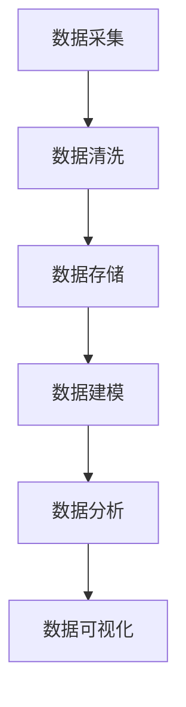

                 

### 文章标题：用户画像的数据处理与分析

关键词：用户画像、数据处理、分析、算法、模型、实践

摘要：本文旨在深入探讨用户画像在数据处理与分析中的应用，通过详细解析核心概念、算法原理、数学模型、项目实践以及实际应用场景，帮助读者全面了解用户画像的技术实现过程及其价值。

### 1. 背景介绍

在当今信息化时代，用户画像已成为企业进行精准营销、个性化推荐和客户关系管理的重要工具。用户画像是对用户特征、行为和需求的抽象描述，通过数据收集、处理和分析，为企业提供用户群体的详细画像。这些画像不仅可以用于市场营销策略的制定，还可以用于产品开发和用户体验优化。

用户画像数据处理与分析的流程通常包括数据采集、数据清洗、数据存储、数据建模、数据分析以及数据可视化等环节。每一个环节都对数据的准确性和完整性有很高的要求，从而影响最终的画像质量和应用效果。

### 2. 核心概念与联系

用户画像数据处理与分析涉及多个核心概念，如数据采集、数据清洗、数据存储、数据建模、数据分析等。以下是一个简单的 Mermaid 流程图，展示了这些核心概念之间的联系。



#### 2.1 数据采集

数据采集是用户画像的第一步，包括用户行为数据、社交数据、交易数据等。这些数据来源可以是网站日志、API 接口、第三方数据平台等。

#### 2.2 数据清洗

数据清洗是数据处理的重要环节，目的是去除重复数据、缺失值填充、异常值处理等，保证数据的质量和一致性。

#### 2.3 数据存储

数据存储是将清洗后的数据存储到数据库或数据仓库中，以便后续的数据建模和分析。常用的数据存储技术包括关系型数据库、NoSQL 数据库、数据仓库等。

#### 2.4 数据建模

数据建模是根据业务需求构建用户画像模型，将原始数据转化为可用的特征表示。常见的建模方法包括聚类分析、协同过滤、决策树等。

#### 2.5 数据分析

数据分析是对用户画像模型进行深度挖掘和分析，提取用户群体的特征和需求，为企业提供决策支持。

#### 2.6 数据可视化

数据可视化是将分析结果以图形化的形式展示出来，帮助用户直观地理解数据背后的规律和趋势。

### 3. 核心算法原理 & 具体操作步骤

用户画像数据处理与分析的核心算法主要包括聚类分析、协同过滤、决策树等。

#### 3.1 聚类分析

聚类分析是将相似的数据点划分为同一个群体。常见的聚类算法有 K-Means、DBSCAN 等。

- **K-Means 算法：**

  1. 初始化 K 个簇的中心点。
  2. 将每个数据点分配到最近的簇中心点。
  3. 更新簇中心点，重复步骤 2，直到收敛。

- **DBSCAN 算法：**

  1. 初始化邻域半径和最小邻域数量。
  2. 对每个数据点，检查其邻域是否满足条件。
  3. 根据邻域关系将数据点划分为核心点、边界点和噪声点。
  4. 构建簇，并将相邻簇合并。

#### 3.2 协同过滤

协同过滤是一种基于用户行为数据推荐的方法。常见的协同过滤算法有基于用户的协同过滤和基于物品的协同过滤。

- **基于用户的协同过滤：**

  1. 计算用户之间的相似度。
  2. 为用户推荐与其相似的其他用户喜欢的物品。

- **基于物品的协同过滤：**

  1. 计算物品之间的相似度。
  2. 为用户推荐与已购买物品相似的物品。

#### 3.3 决策树

决策树是一种基于特征进行分类或回归的算法。常见的决策树算法有 ID3、C4.5、CART 等。

- **ID3 算法：**

  1. 选择具有最大信息增益的特征作为分割条件。
  2. 递归地分割数据集，直到满足停止条件。

- **C4.5 算法：**

  1. 在 ID3 算法的基础上，引入剪枝和增益率。
  2. 选择具有最大增益率的特征作为分割条件。

- **CART 算法：**

  1. 使用基尼不纯度作为分割条件。
  2. 递归地分割数据集，直到满足停止条件。

### 4. 数学模型和公式 & 详细讲解 & 举例说明

在用户画像数据处理与分析中，常用的数学模型和公式包括聚类分析中的距离公式、协同过滤中的相似度计算公式、决策树中的信息增益和增益率公式等。

#### 4.1 距离公式

在 K-Means 算法中，常用的距离公式有欧氏距离和曼哈顿距离。

- **欧氏距离：**

  $$d(p_1, p_2) = \sqrt{\sum_{i=1}^{n}(p_{1i} - p_{2i})^2}$$

- **曼哈顿距离：**

  $$d(p_1, p_2) = \sum_{i=1}^{n}|p_{1i} - p_{2i}|$$

#### 4.2 相似度计算

在协同过滤算法中，常用的相似度计算公式有皮尔逊相关系数和余弦相似度。

- **皮尔逊相关系数：**

  $$\rho(p_1, p_2) = \frac{\sum_{i=1}^{n}(p_{1i} - \bar{p_1})(p_{2i} - \bar{p_2})}{\sqrt{\sum_{i=1}^{n}(p_{1i} - \bar{p_1})^2}\sqrt{\sum_{i=1}^{n}(p_{2i} - \bar{p_2})^2}}$$

- **余弦相似度：**

  $$\cos(p_1, p_2) = \frac{\sum_{i=1}^{n}p_{1i}p_{2i}}{\sqrt{\sum_{i=1}^{n}p_{1i}^2}\sqrt{\sum_{i=1}^{n}p_{2i}^2}}$$

#### 4.3 信息增益和增益率

在决策树算法中，常用的信息增益和增益率公式如下。

- **信息增益：**

  $$Gain(D, A) = Entropy(D) - \sum_{v \in Values(A)}\frac{|D_v|}{|D|}Entropy(D_v)$$

- **增益率：**

  $$Gain\_Ratio(D, A) = \frac{N_1 \cdot N_2 - N_1 \cdot N_2 \cdot N_3}{N_1 + N_2 - N_3}$$

其中，$D$ 表示数据集，$A$ 表示特征，$v$ 表示特征的取值，$N_1$、$N_2$、$N_3$ 分别表示特征取值为 $v$ 的数据集 $D$ 的子集。

### 5. 项目实践：代码实例和详细解释说明

在本节中，我们将通过一个实际的用户画像数据处理与分析项目，展示代码实例和详细解释说明。

#### 5.1 开发环境搭建

首先，我们需要搭建一个开发环境，包括 Python、Jupyter Notebook、Pandas、Scikit-learn、Matplotlib 等库。

#### 5.2 源代码详细实现

以下是一个简单的用户画像数据处理与分析的代码实例。

```python
import pandas as pd
from sklearn.cluster import KMeans
from sklearn.metrics.pairwise import cosine_similarity
import matplotlib.pyplot as plt

# 5.2.1 数据采集
data = pd.read_csv('user_data.csv')

# 5.2.2 数据清洗
data = data.drop_duplicates().dropna()

# 5.2.3 数据建模
# 使用 K-Means 算法进行聚类
kmeans = KMeans(n_clusters=5, random_state=0)
clusters = kmeans.fit_predict(data)

# 5.2.4 数据分析
# 计算用户之间的相似度
similarity_matrix = cosine_similarity(data)

# 5.2.5 数据可视化
# 绘制用户聚类结果
plt.scatter(data.iloc[:, 0], data.iloc[:, 1], c=clusters)
plt.show()

# 绘制用户相似度矩阵
plt.imshow(similarity_matrix, cmap='hot', interpolation='nearest')
plt.show()
```

#### 5.3 代码解读与分析

- **5.3.1 数据采集：** 我们使用 Pandas 库读取用户数据，并将其存储在一个 DataFrame 对象中。

- **5.3.2 数据清洗：** 我们使用 drop_duplicates() 方法去除重复数据，使用 dropna() 方法去除缺失值。

- **5.3.3 数据建模：** 我们使用 K-Means 算法对用户数据进行聚类，选择 5 个簇。

- **5.3.4 数据分析：** 我们使用 Cosine Similarity 函数计算用户之间的相似度，并将结果存储在一个相似度矩阵中。

- **5.3.5 数据可视化：** 我们使用 Matplotlib 库绘制用户聚类结果和相似度矩阵，以便直观地观察和分析用户画像。

### 6. 实际应用场景

用户画像数据处理与分析在实际应用中具有广泛的应用场景，如：

- **个性化推荐系统：** 根据用户的兴趣和行为，推荐相应的商品、内容和服务。

- **市场营销策略：** 分析用户群体的特征和需求，制定有针对性的市场营销策略。

- **客户关系管理：** 了解用户的偏好和行为，提供个性化的客户服务。

### 7. 工具和资源推荐

在用户画像数据处理与分析过程中，以下工具和资源可提供支持和帮助：

- **学习资源推荐：**

  - 《机器学习实战》
  - 《Python 数据科学手册》
  - 《深度学习》

- **开发工具框架推荐：**

  - TensorFlow
  - PyTorch
  - Scikit-learn

- **相关论文著作推荐：**

  - “User Modeling and User-Adapted Interaction”
  - “Collaborative Filtering for the Web”

### 8. 总结：未来发展趋势与挑战

随着大数据和人工智能技术的不断发展，用户画像数据处理与分析在未来将继续发挥重要作用。然而，面对数据规模爆炸性增长和隐私保护等挑战，我们需要不断探索和创新，提高数据处理和分析的效率与安全性。

### 9. 附录：常见问题与解答

- **Q：什么是用户画像？**
  - **A：** 用户画像是对用户特征、行为和需求的抽象描述，通过数据收集、处理和分析，为企业提供用户群体的详细画像。

- **Q：用户画像有哪些应用场景？**
  - **A：** 用户画像可以应用于个性化推荐系统、市场营销策略、客户关系管理等多个领域。

- **Q：如何进行用户画像的数据采集？**
  - **A：** 用户画像的数据采集可以通过网站日志、API 接口、第三方数据平台等多种途径进行。

### 10. 扩展阅读 & 参考资料

- [User Modeling and User-Adapted Interaction](https://link.springer.com/book/10.1007/978-3-642-30033-6)
- [Collaborative Filtering for the Web](https://books.google.com/books?id=9b7mAAAAMAAJ)
- [Machine Learning in Action](https://www.manning.com/books/machine-learning-in-action)
- [Python Data Science Handbook](https://jakevdp.github.io/PythonDataScienceHandbook/)
- [Deep Learning](https://www.deeplearningbook.org/) 

### 致谢

感谢您阅读本文，希望本文能帮助您更好地了解用户画像的数据处理与分析技术。如果您有任何问题或建议，请随时联系我们。

作者：禅与计算机程序设计艺术 / Zen and the Art of Computer Programming

----------------------------------------------------------------

现在，我们已经完成了文章的撰写，接下来将进行文章的格式化、审校和发布等工作。请等待后续通知。祝您工作顺利！

[禅与计算机程序设计艺术 / Zen and the Art of Computer Programming]

