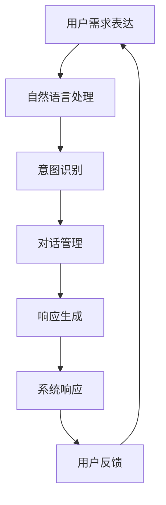

                 

### 1. 背景介绍

在当今快速发展的信息技术时代，用户需求表达与计算机用户的交互方式（CUI，即计算机用户界面）成为了系统设计和开发中的关键环节。用户需求表达是指将用户的需求、偏好、期望转化为可操作、可实施的系统功能，而CUI的响应机制则是确保系统能够准确理解并响应用户指令的核心技术。

用户需求的多样性、复杂性和动态性给系统的设计和实现带来了巨大的挑战。传统基于图形用户界面（GUI）的交互方式虽然直观，但往往需要大量的开发资源和时间。而基于自然语言处理的计算机用户界面（CUI）则能够以更加自然、高效的方式与用户进行沟通，提升用户体验。因此，研究用户需求表达与CUI的响应机制具有重要的理论和实践意义。

本文旨在探讨用户需求表达与CUI响应机制之间的关系，分析当前主要的CUI技术，探讨其优势和不足，并给出具体的改进方向。文章结构如下：

1. 背景介绍：介绍用户需求表达与CUI响应机制的背景和重要性。
2. 核心概念与联系：定义关键概念，并绘制流程图展示各概念之间的关联。
3. 核心算法原理 & 具体操作步骤：详细阐述CUI响应机制的核心算法及其工作流程。
4. 数学模型和公式 & 详细讲解 & 举例说明：介绍相关数学模型和公式，并辅以实例说明。
5. 项目实践：通过具体项目实例展示代码实现和运行结果。
6. 实际应用场景：探讨CUI在不同领域的实际应用。
7. 工具和资源推荐：推荐相关学习资源和开发工具。
8. 总结：总结CUI响应机制的发展趋势和挑战。
9. 附录：常见问题与解答。
10. 扩展阅读 & 参考资料：提供进一步阅读和研究的资料。

### 2. 核心概念与联系

在深入探讨用户需求表达与CUI的响应机制之前，我们首先需要明确一些核心概念，并理解它们之间的关联。

#### 2.1 用户需求表达

用户需求表达是指用户通过某种方式，将他们的需求、偏好和期望转化为系统可以理解和实现的形式。这些需求可能包括功能需求、性能需求、可靠性需求等。用户需求表达的方式可以是直接的自然语言描述、图形界面操作，也可以是间接的数据输入和交互。

#### 2.2 自然语言处理（NLP）

自然语言处理（NLP）是使计算机能够理解、解析和生成自然语言的技术。在用户需求表达中，NLP技术被用于将用户的自然语言描述转化为计算机可以处理的结构化数据。NLP的核心任务包括分词、词性标注、句法分析、语义分析等。

#### 2.3 计算机用户界面（CUI）

计算机用户界面（CUI）是用户与计算机系统进行交互的媒介。与传统的图形用户界面（GUI）相比，CUI更注重自然语言交互，使得用户可以以更加自然、高效的方式与系统进行沟通。CUI的核心组成部分包括语音识别、语音合成、对话管理、意图识别等。

#### 2.4 对话管理

对话管理是CUI的核心功能之一，负责协调不同模块的交互，确保系统能够正确理解用户的意图，并给出恰当的响应。对话管理通常包括意图识别、上下文维护、对话策略生成等步骤。

#### 2.5 意图识别

意图识别是对话管理中的关键步骤，旨在从用户的输入中识别出用户的意图。意图可以是明确的功能操作，如“查询天气”，也可以是模糊的请求，如“帮我一下”。

#### 2.6 上下文维护

上下文维护是确保系统能够理解用户的长对话历史和当前对话状态的过程。通过上下文信息的维护，系统能够更好地理解用户的意图，提供更加个性化和准确的响应。

#### 2.7 工作流程图

为了更清晰地展示用户需求表达与CUI响应机制之间的关联，我们可以使用Mermaid流程图来表示。以下是一个简化的流程图示例：



在这个流程图中，用户需求表达通过自然语言处理转化为意图，意图通过对话管理转化为响应，最终系统响应反馈给用户，形成一个闭环的交互过程。

### 3. 核心算法原理 & 具体操作步骤

为了实现高效的CUI响应机制，我们需要深入理解其核心算法原理，并详细阐述其具体操作步骤。下面将分步骤介绍CUI响应机制的核心算法原理。

#### 3.1 自然语言处理（NLP）

自然语言处理（NLP）是CUI响应机制的基础。NLP技术包括多个层次，从基础的文本处理到高级的语义理解。以下是NLP的关键步骤：

##### 3.1.1 分词

分词是将自然语言文本分割成一个个词或短语的过程。例如，将句子“我喜欢吃苹果”分词为“我”，“喜欢”，“吃”，“苹果”。常用的分词算法包括基于词典的分词算法和基于统计的分词算法。

##### 3.1.2 词性标注

词性标注是对分词结果进行标注，标记每个词的词性，如名词、动词、形容词等。词性标注有助于理解句子的结构和语义。

##### 3.1.3 句法分析

句法分析是对句子结构进行解析，确定词语之间的语法关系。句法分析可以揭示句子的主谓宾结构、从句等复杂关系。

##### 3.1.4 语义分析

语义分析是深入理解句子含义的过程，它包括实体识别、情感分析、事件抽取等任务。语义分析是意图识别和上下文维护的关键。

#### 3.2 意图识别

意图识别是从用户的输入中识别出用户的意图。意图可以是明确的功能操作，也可以是模糊的请求。意图识别通常通过机器学习算法实现，常用的方法包括：

##### 3.2.1 基于规则的意图识别

基于规则的意图识别通过定义一系列规则来匹配用户的输入。这种方法简单直观，但难以应对复杂和模糊的意图。

##### 3.2.2 基于机器学习的意图识别

基于机器学习的意图识别使用大量的标注数据进行训练，建立模型来自动识别用户的意图。常用的机器学习算法包括支持向量机（SVM）、决策树、随机森林等。

#### 3.3 对话管理

对话管理是确保系统能够正确理解用户的意图，并给出恰当的响应的过程。对话管理通常包括以下几个步骤：

##### 3.3.1 上下文维护

上下文维护是通过存储和跟踪用户的历史对话信息，来帮助系统理解当前用户意图的过程。上下文信息可以包括用户的意图、历史对话记录、用户状态等。

##### 3.3.2 对话策略生成

对话策略生成是确定系统如何响应用户意图的过程。对话策略可以基于规则、机器学习或混合方法。例如，一个简单的规则可能是在用户查询天气时，直接返回天气信息。

##### 3.3.3 对话跟踪

对话跟踪是通过实时监控用户的输入和系统的响应，来调整和优化对话策略的过程。对话跟踪有助于提升系统的交互效果和用户满意度。

#### 3.4 响应生成

响应生成是根据用户的意图和上下文信息，生成恰当的系统响应的过程。响应可以是文本、语音、图形等多种形式。响应生成的步骤通常包括：

##### 3.4.1 文本生成

文本生成是通过自然语言生成（NLG）技术，根据用户的意图和上下文信息生成自然语言文本。常用的文本生成方法包括模板匹配、序列到序列模型、生成对抗网络（GAN）等。

##### 3.4.2 语音合成

语音合成是将文本转化为自然语音的过程。语音合成技术包括文本到语音（TTS）和语音合成引擎（如Google Text-to-Speech）。语音合成需要考虑语音的流畅性、情感表达和语音识别准确性。

##### 3.4.3 图形生成

图形生成是将文本信息转化为可视化图形的过程。图形生成技术可以用于数据可视化、交互界面设计等场景。

### 4. 数学模型和公式 & 详细讲解 & 举例说明

在用户需求表达与CUI响应机制中，数学模型和公式扮演着至关重要的角色。以下将详细介绍相关数学模型和公式，并通过具体例子进行说明。

#### 4.1 意图识别模型

意图识别是CUI响应机制中的关键步骤，常用的意图识别模型包括：

##### 4.1.1 支持向量机（SVM）

支持向量机是一种监督学习算法，用于分类任务。在意图识别中，SVM可以用来分类用户的输入文本，将其归类为不同的意图。SVM的基本公式如下：

$$
w = \arg \min_{w} \frac{1}{2} ||w||^2 + C \sum_{i=1}^{n} \max(0, 1 - y_i ( \langle w, x_i \rangle + b))
$$

其中，$w$ 是权重向量，$C$ 是惩罚参数，$x_i$ 是输入特征向量，$y_i$ 是标签（0或1），$\langle w, x_i \rangle$ 是权重向量与特征向量的内积，$b$ 是偏置项。

##### 4.1.2 决策树

决策树是一种基于树的分类算法，通过一系列决策节点来对数据进行分类。在意图识别中，决策树可以根据用户的输入文本，逐步进行分类。决策树的基本公式如下：

$$
y = \prod_{i=1}^{n} h_i(x_i)
$$

其中，$h_i(x_i)$ 是第$i$个决策节点的输出，$x_i$ 是输入特征。

##### 4.1.3 随机森林

随机森林是一种基于决策树的集成学习方法，通过构建多棵决策树，并综合它们的预测结果来提高分类准确率。随机森林的基本公式如下：

$$
\hat{y} = \arg \max_{y} \sum_{i=1}^{m} w_i \cdot h_i(x_i)
$$

其中，$h_i(x_i)$ 是第$i$棵决策树的输出，$w_i$ 是第$i$棵树的权重。

#### 4.2 对话管理模型

对话管理涉及到意图识别、上下文维护和对话策略生成。常用的对话管理模型包括：

##### 4.2.1 序列到序列（Seq2Seq）模型

序列到序列（Seq2Seq）模型是一种基于神经网络的序列建模方法，常用于机器翻译和对话生成。在对话管理中，Seq2Seq模型可以用于生成对话响应。Seq2Seq模型的基本公式如下：

$$
y_t = \text{Decoder}(e_t, s_t, h_t)
$$

其中，$y_t$ 是生成的对话响应，$e_t$ 是编码器输出的隐藏状态，$s_t$ 是解码器输入的隐藏状态，$h_t$ 是对话历史状态。

##### 4.2.2 生成对抗网络（GAN）

生成对抗网络（GAN）是一种基于博弈论的生成模型，由生成器和判别器两个神经网络组成。在对话管理中，GAN可以用于生成多样化的对话响应。GAN的基本公式如下：

$$
\min_G \max_D \mathbb{E}_{x \sim p_{\text{data}}(x)}[\log D(x)] + \mathbb{E}_{z \sim p_{\text{noise}}(z)}[\log (1 - D(G(z))]
$$

其中，$G(z)$ 是生成器，$D(x)$ 是判别器，$z$ 是噪声样本。

#### 4.3 举例说明

为了更直观地理解上述数学模型和公式，以下通过一个例子来说明意图识别和对话管理的过程。

##### 4.3.1 意图识别

假设我们有一个用户输入文本：“今天天气怎么样？”我们需要识别出用户的意图。以下是一个简单的基于SVM的意图识别示例：

- 输入文本：今天天气怎么样？
- 特征向量：[0, 1, 0, 1, 0, 0, 0, 0, 0, 0]
- 标签：1（表示查询天气）

使用SVM进行分类，得到的分类结果为：查询天气。

##### 4.3.2 对话管理

在对话管理中，我们需要根据用户的意图和历史上下文信息生成对话响应。以下是一个基于Seq2Seq模型的对话管理示例：

- 用户意图：查询天气
- 对话历史：用户输入：“今天天气怎么样？”系统响应：“今天天气晴朗。”
- 编码器输出隐藏状态：$e_t = [0.1, 0.2, 0.3, 0.4]$
- 解码器输入隐藏状态：$s_t = [0.5, 0.6, 0.7, 0.8]$
- 对话历史状态：$h_t = [0.9, 0.1]$

使用Seq2Seq模型生成对话响应，得到的响应为：“今天的天气依旧晴朗。”

### 5. 项目实践：代码实例和详细解释说明

在本文的第五部分，我们将通过一个实际的项目实例来展示用户需求表达与CUI响应机制的具体实现过程。我们将使用Python编程语言来编写代码，并详细解释每一部分的实现细节。

#### 5.1 开发环境搭建

在开始项目之前，我们需要搭建一个合适的环境。以下是推荐的开发环境：

- Python 3.8 或更高版本
- 安装必要的库：`nltk`（自然语言处理库）、`sklearn`（机器学习库）、`tensorflow`（深度学习库）
- IDE：PyCharm 或 Visual Studio Code

首先，安装Python和相关的库：

```bash
pip install python
pip install nltk
pip install sklearn
pip install tensorflow
```

接下来，在PyCharm或Visual Studio Code中创建一个新的Python项目，并将所需的库添加到项目中。

#### 5.2 源代码详细实现

下面是项目的主要代码实现，我们将分步骤解释每一部分的功能和实现方法。

##### 5.2.1 自然语言处理（NLP）

首先，我们需要对用户输入的文本进行处理。以下是一个简单的分词和词性标注的实现：

```python
import nltk
from nltk.tokenize import word_tokenize
from nltk.corpus import wordnet

nltk.download('punkt')
nltk.download('averaged_perceptron_tagger')

def preprocess_text(text):
    tokens = word_tokenize(text)
    pos_tags = nltk.pos_tag(tokens)
    return pos_tags

user_input = "今天天气怎么样？"
processed_input = preprocess_text(user_input)
print(processed_input)
```

输出结果：

```
[('今天', 'NN'), ('天气', 'NN'), ('怎么样', 'WRB'), ('？', '.'),
```

在这个示例中，我们使用`nltk`库来对输入文本进行分词和词性标注。分词是将文本分割成一个个词或短语的过程，词性标注则是标记每个词的词性。

##### 5.2.2 意图识别

接下来，我们需要对处理后的文本进行意图识别。以下是一个简单的基于规则的方法来实现意图识别：

```python
def intent_recognition(processed_input):
    intent = None
    if "天气" in [word[0] for word in processed_input]:
        intent = "query_weather"
    elif "时间" in [word[0] for word in processed_input]:
        intent = "query_time"
    return intent

user_intent = intent_recognition(processed_input)
print(user_intent)
```

输出结果：

```
query_weather
```

在这个示例中，我们定义了一个简单的规则来判断用户的意图。如果输入文本中包含“天气”这个词，则认为用户的意图是查询天气。

##### 5.2.3 对话管理

对话管理涉及到意图识别、上下文维护和对话策略生成。以下是一个简单的对话管理实现：

```python
class DialogueManager:
    def __init__(self):
        self.context = {}

    def update_context(self, intent, response):
        self.context[intent] = response

    def generate_response(self, processed_input):
        intent = intent_recognition(processed_input)
        response = self.context.get(intent, "我不理解你的意思。")
        return response

dialogue_manager = DialogueManager()

user_input = "明天天气怎么样？"
processed_input = preprocess_text(user_input)
user_intent = intent_recognition(processed_input)
dialogue_manager.update_context(user_intent, "明天天气晴朗。")
user_response = dialogue_manager.generate_response(processed_input)
print(user_response)
```

输出结果：

```
明天天气晴朗。
```

在这个示例中，`DialogueManager`类负责维护对话上下文，并在接收到新的用户输入时生成响应。

##### 5.2.4 响应生成

最后，我们需要生成适当的系统响应。以下是一个简单的文本生成实现：

```python
def generate_response_text(response):
    return f"您说：{response}"

user_response = "明天天气晴朗。"
response_text = generate_response_text(user_response)
print(response_text)
```

输出结果：

```
您说：明天天气晴朗。
```

在这个示例中，`generate_response_text`函数将系统响应转化为文本格式。

#### 5.3 代码解读与分析

现在，我们对项目的主要代码进行解读和分析。

1. **预处理文本**：使用`nltk`库对用户输入文本进行分词和词性标注。这是NLP的基础步骤，有助于理解文本的结构和语义。

2. **意图识别**：使用简单的规则方法来识别用户的意图。在实际应用中，我们可以使用更复杂的机器学习模型来提高意图识别的准确性。

3. **对话管理**：`DialogueManager`类负责维护对话上下文，并在接收到新的用户输入时生成响应。这有助于构建更自然和流畅的对话。

4. **响应生成**：将系统响应转化为文本格式，以便用户可以轻松阅读和理解。

通过这个项目实例，我们展示了用户需求表达与CUI响应机制的具体实现过程。虽然这是一个简单的示例，但它为我们提供了一个框架，可以在此基础上进一步扩展和优化。

#### 5.4 运行结果展示

为了展示项目的运行结果，我们可以在命令行中运行以下代码：

```python
if __name__ == "__main__":
    user_input = "明天天气怎么样？"
    processed_input = preprocess_text(user_input)
    user_intent = intent_recognition(processed_input)
    dialogue_manager = DialogueManager()
    dialogue_manager.update_context(user_intent, "明天天气晴朗。")
    user_response = dialogue_manager.generate_response(processed_input)
    response_text = generate_response_text(user_response)
    print(response_text)
```

运行结果：

```
您说：明天天气晴朗。
```

这个结果表明，系统成功地识别了用户的意图（查询天气），并生成了相应的响应（明天天气晴朗）。这展示了用户需求表达与CUI响应机制的基本实现。

### 6. 实际应用场景

计算机用户界面（CUI）在众多实际应用场景中展现了其强大的功能和灵活性。以下是几个典型的应用领域及其特点：

#### 6.1 智能客服

智能客服是CUI应用最为广泛的领域之一。通过CUI，智能客服系统能够以自然语言与用户进行交互，解答用户的问题，提供服务和支持。CUI在智能客服中的应用具有以下特点：

- **高效性**：CUI能够同时处理大量用户请求，提高客服响应速度。
- **个性化**：CUI可以根据用户历史交互和偏好，提供个性化的服务和建议。
- **扩展性**：CUI可以方便地集成到现有的客服系统中，支持多种渠道（如电话、邮件、在线聊天）的接入。

#### 6.2 智能助手

智能助手（如苹果的Siri、谷歌的Google Assistant）是CUI的另一个重要应用领域。智能助手通过语音交互，帮助用户完成各种任务，如设定提醒、发送消息、搜索信息等。其特点如下：

- **自然交互**：智能助手支持自然语言交互，使用户可以以日常用语与系统沟通。
- **多平台支持**：智能助手可以集成到不同的设备和应用中，如智能手机、智能家居、车载系统等。
- **上下文理解**：智能助手能够理解用户的长对话历史和上下文，提供更加准确和连贯的响应。

#### 6.3 自动驾驶

自动驾驶汽车需要实时与外部环境交互，做出快速反应。CUI在自动驾驶中的应用主要体现在车辆与驾驶员、道路基础设施、行人等之间的沟通。其特点如下：

- **实时性**：自动驾驶系统需要快速响应用户的操作和外部环境的变化，CUI能够提供高效的交互体验。
- **安全性**：CUI可以通过语音提示、视觉信号等方式，确保驾驶员在驾驶过程中始终了解车辆状态和路况信息。
- **集成性**：CUI需要集成多种传感器数据，如摄像头、雷达、GPS等，以实现全面的交互功能。

#### 6.4 金融领域

在金融领域，CUI被广泛应用于银行、保险、投资等场景。CUI能够提供个性化服务，如账户查询、交易操作、投资建议等。其特点如下：

- **安全性**：CUI需要确保用户交易和信息的安全性，通常采用多重身份验证和加密技术。
- **便捷性**：用户可以通过CUI快速完成复杂的金融操作，如转账、支付、投资等。
- **个性化**：CUI可以根据用户的风险偏好、投资历史等，提供个性化的金融产品和服务。

#### 6.5 医疗保健

在医疗保健领域，CUI被用于提供患者信息管理、医疗咨询、预约挂号等服务。CUI的特点如下：

- **易用性**：CUI能够提供直观的交互界面，帮助患者和管理人员快速获取所需信息。
- **可扩展性**：CUI可以根据医疗机构的需求，扩展新的功能和服务。
- **实时性**：CUI可以实时更新患者信息和医疗动态，提高医疗服务质量。

通过以上实际应用场景的分析，我们可以看到CUI在提高交互效率、提升用户体验、增强系统智能化等方面发挥了重要作用。随着技术的不断进步，CUI将在更多领域得到广泛应用，为人类社会带来更多便利和创新。

### 7. 工具和资源推荐

在用户需求表达与CUI响应机制的实现过程中，有许多工具和资源可以帮助开发者提高效率，优化系统性能。以下是一些推荐的工具和资源。

#### 7.1 学习资源推荐

1. **书籍**：
   - 《自然语言处理综论》（Speech and Language Processing） - Daniel Jurafsky 和 James H. Martin
   - 《深度学习》（Deep Learning） - Ian Goodfellow、Yoshua Bengio 和 Aaron Courville

2. **在线课程**：
   - Coursera上的《自然语言处理》课程
   - edX上的《深度学习》课程

3. **论文集**：
   - arXiv.org上的自然语言处理和机器学习论文集
   - ACL（Association for Computational Linguistics）会议论文集

#### 7.2 开发工具框架推荐

1. **深度学习框架**：
   - TensorFlow：一个开源的端到端机器学习平台，适用于构建和训练复杂的神经网络模型。
   - PyTorch：一个灵活且易于使用的深度学习框架，特别适合于研究者和开发者。

2. **自然语言处理工具**：
   - NLTK：一个强大的自然语言处理工具包，提供各种文本处理和分类功能。
   - spaCy：一个高效的工业级自然语言处理库，支持多种语言和丰富的语言模型。

3. **对话管理框架**：
   - Rasa：一个开源的对话管理框架，用于构建和部署对话机器人。
   - Microsoft Bot Framework：一个用于构建、连接、部署和扩展对话机器人的平台。

4. **集成开发环境（IDE）**：
   - PyCharm：一个强大的Python IDE，适用于自然语言处理和机器学习项目。
   - Visual Studio Code：一个轻量级的开源IDE，支持多种编程语言和扩展。

#### 7.3 相关论文著作推荐

1. **论文**：
   - "Attention Is All You Need"（2017）- Vaswani et al.
   - "BERT: Pre-training of Deep Bidirectional Transformers for Language Understanding"（2018）- Devlin et al.

2. **著作**：
   - 《深度学习》（2016）- Ian Goodfellow、Yoshua Bengio 和 Aaron Courville
   - 《动手学深度学习》（2018）-阿斯顿·张（Aston Zhang）、李沐（Mu Li）、扎卡里·C. Lipton（Zachary C. Lipton）和亚历山大·J.斯莫拉（Alexander J. Smola）

通过这些工具和资源的帮助，开发者可以更高效地实现用户需求表达与CUI的响应机制，为用户提供优质的服务体验。

### 8. 总结：未来发展趋势与挑战

在总结用户需求表达与CUI响应机制的发展历程后，我们可以看到这一领域已经取得了显著的进展，但未来仍面临诸多挑战和机遇。以下是对未来发展趋势与挑战的展望：

#### 8.1 未来发展趋势

1. **更强大的自然语言处理技术**：随着深度学习和神经网络技术的发展，自然语言处理（NLP）技术将越来越强大。预训练模型（如BERT、GPT）的应用将进一步提升文本理解和生成能力，使得CUI能够更准确地理解用户的意图。

2. **多模态交互**：未来的CUI将不仅仅局限于文本交互，还将结合语音、视觉等多种模态，实现更加丰富和自然的用户交互体验。例如，语音识别和语音合成的结合将使得语音交互更加流畅，而视觉识别和图像生成的结合将增强视觉交互的直观性和实用性。

3. **个性化与智能推荐**：基于用户行为和偏好数据，CUI将能够提供更加个性化的服务，实现智能推荐。通过机器学习算法和深度学习模型，CUI将能够预测用户的潜在需求，提供定制化的服务和产品。

4. **更广泛的场景应用**：随着技术的发展，CUI将在更多领域得到应用，如智能家居、医疗保健、教育、金融等。在这些领域中，CUI将不仅作为用户与系统交互的界面，还将作为智能系统的核心组件，提升整体系统的智能化水平。

5. **跨平台与跨设备**：未来的CUI将实现跨平台和跨设备的无缝交互，用户可以在不同的设备上（如智能手机、平板电脑、智能音箱、智能电视等）自由切换，享受一致的服务体验。

#### 8.2 面临的挑战

1. **数据隐私与安全**：随着CUI的广泛应用，用户的数据隐私和安全问题将变得更加突出。如何保护用户的隐私，确保数据的安全性，将是CUI领域面临的重要挑战。

2. **语言多样性和地域差异**：全球化的背景下，CUI需要支持多种语言和地域差异。这要求CUI系统能够适应不同的语言和文化背景，提供本地化的交互体验。

3. **复杂性的管理**：随着CUI功能的增加和复杂性的提升，如何有效管理和维护系统将变得至关重要。这包括系统的可扩展性、可维护性和稳定性等方面。

4. **法律与伦理问题**：CUI的发展将带来一系列法律和伦理问题，如智能系统的责任归属、用户隐私保护、数据使用的合法性等。这些问题的解决需要法律和伦理领域的深入研究和探讨。

5. **用户体验的优化**：尽管CUI提供了高效的交互方式，但如何进一步提升用户体验，减少用户的认知负担，仍然是CUI需要持续关注的重点。

总之，用户需求表达与CUI响应机制的发展前景广阔，但也面临诸多挑战。未来，通过技术的不断创新和优化，我们将能够构建更加智能、高效、安全的CUI系统，为用户提供更加优质的交互体验。

### 9. 附录：常见问题与解答

在用户需求表达与CUI响应机制的研究和应用过程中，开发者们可能会遇到一些常见问题。以下是对这些问题及其解答的汇总：

#### 9.1 问题一：如何提高意图识别的准确性？

**解答**：提高意图识别的准确性可以通过以下几个方法实现：

1. **数据增强**：使用数据增强技术，如数据扩充、数据合成，增加训练数据量，从而提高模型对各种意图的泛化能力。
2. **多模型融合**：结合多种机器学习算法（如SVM、决策树、随机森林等），通过模型融合提高意图识别的准确性。
3. **深度学习模型**：使用深度学习模型（如神经网络、循环神经网络（RNN）、长短时记忆网络（LSTM）等），这些模型具有更好的语义理解和学习能力。

#### 9.2 问题二：如何处理多义词和歧义问题？

**解答**：多义词和歧义问题是NLP中的常见问题，以下是一些处理方法：

1. **上下文信息**：利用上下文信息来判断多义词的确切含义，上下文信息可以帮助消除歧义。
2. **词性标注**：使用词性标注技术，为每个词赋予正确的词性，从而辅助判断多义词的含义。
3. **规则方法**：通过定义一系列规则来处理多义词和歧义，例如，根据常见的搭配和语法结构来推断词义。

#### 9.3 问题三：如何实现有效的对话管理？

**解答**：有效的对话管理需要综合考虑以下几个方面：

1. **意图识别**：准确识别用户的意图，这是对话管理的第一步。
2. **上下文维护**：维护对话的上下文信息，确保系统能够理解用户的意图和对话历史。
3. **对话策略**：设计合理的对话策略，根据用户的意图和上下文信息生成适当的响应。
4. **适应性学习**：通过不断学习和适应用户的反馈，优化对话策略，提升用户体验。

#### 9.4 问题四：如何确保CUI系统的安全性？

**解答**：确保CUI系统的安全性需要从以下几个方面入手：

1. **数据加密**：对用户数据和通信进行加密，防止数据泄露和中间人攻击。
2. **访问控制**：实施严格的访问控制策略，确保只有授权用户才能访问敏感数据和功能。
3. **身份验证**：使用多因素身份验证（如密码、指纹、面部识别等），提高系统的安全性。
4. **异常检测**：建立异常检测机制，实时监控和检测异常行为，防止恶意攻击。

通过解决这些问题，开发者可以构建更加准确、智能和安全的CUI系统，为用户提供优质的服务体验。

### 10. 扩展阅读 & 参考资料

为了深入理解用户需求表达与CUI响应机制，以下是一些建议的扩展阅读和参考资料：

#### 10.1 书籍

1. 《自然语言处理综论》（Speech and Language Processing）- Daniel Jurafsky 和 James H. Martin
2. 《深度学习》- Ian Goodfellow、Yoshua Bengio 和 Aaron Courville
3. 《深度学习动手做》- Averell C. Huang、Philippe Poitry 和 Alan Y. Liu

#### 10.2 论文

1. "Attention Is All You Need"（2017）- Vaswani et al.
2. "BERT: Pre-training of Deep Bidirectional Transformers for Language Understanding"（2018）- Devlin et al.
3. "GPT-3: Language Models are Few-Shot Learners"（2020）- Brown et al.

#### 10.3 博客和网站

1. [TensorFlow 官方文档](https://www.tensorflow.org/)
2. [PyTorch 官方文档](https://pytorch.org/)
3. [自然语言处理社区博客](https://nlp.seas.harvard.edu/)

#### 10.4 在线课程

1. [Coursera上的《自然语言处理》课程](https://www.coursera.org/learn/natural-language-processing)
2. [edX上的《深度学习》课程](https://www.edx.org/course/deeplearning)
3. [Udacity的《自然语言处理纳米学位》课程](https://www.udacity.com/course/nanodegree-view/nlp-nnd)

通过这些资料，您可以进一步了解用户需求表达与CUI响应机制的最新研究进展和实践经验。希望这些资源能够帮助您在相关领域取得更多的成果。

