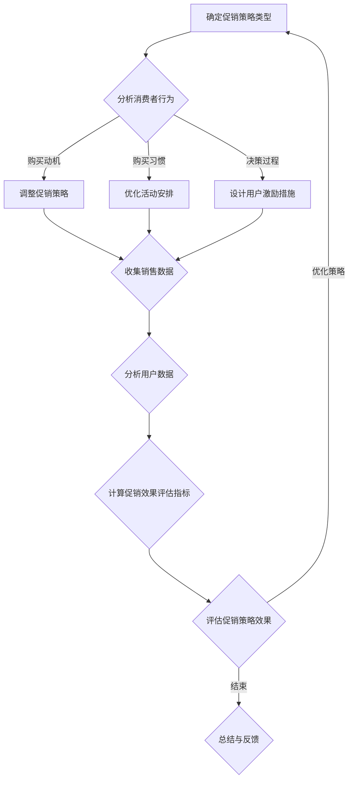

                 

### 背景介绍 Background

#### 电商行业的促销策略

随着互联网技术的快速发展，电子商务已经成为现代零售业的重要组成部分。电商平台通过创新的促销策略，不仅吸引了大量消费者，也提升了自身的市场竞争力。促销策略作为电商运营的重要手段，涵盖了打折、满减、限时抢购、积分兑换等多种形式，其目的是刺激消费、提升销量、增加用户粘性。然而，不同促销策略的实际效果却千差万别，这使得电商企业在制定促销策略时面临巨大的挑战。

#### 促销策略的实际效果

电商促销策略的实际效果不仅取决于策略本身的设计，还受到市场环境、消费者行为、平台运营等多方面因素的影响。因此，如何评估和优化促销策略的效果，成为电商企业关注的焦点。一方面，有效的促销策略可以显著提升销售额和市场份额；另一方面，不当的促销策略可能会导致消费者流失、品牌形象受损，甚至影响企业的长期发展。

#### 研究目的

本文旨在通过对电商促销策略实际效果的深入研究，分析不同促销策略的优缺点，探讨其背后的影响因素，并提供实用的优化建议。具体而言，本文将涵盖以下内容：

1. **核心概念与联系**：介绍电商促销策略的核心概念及其相互联系，使用Mermaid流程图展示关键流程和节点。
2. **核心算法原理与具体操作步骤**：详细阐述评估促销策略效果的核心算法原理，包括数据收集、处理和分析的方法。
3. **数学模型和公式**：建立评估促销策略效果的数学模型，包括相关公式和推导过程，并举例说明。
4. **项目实践**：通过实际案例，展示如何开发和实现促销策略评估系统，包括开发环境搭建、代码实例和详细解释说明。
5. **实际应用场景**：分析电商促销策略在不同场景下的实际应用效果，探讨适用的策略组合。
6. **工具和资源推荐**：推荐相关学习资源、开发工具和框架，以帮助读者深入了解和掌握电商促销策略优化技术。
7. **总结与展望**：总结本文的主要发现，探讨未来电商促销策略的发展趋势和面临的挑战。

通过本文的研究，我们期望为电商企业提供科学、系统的促销策略优化方案，帮助其在激烈的市场竞争中取得优势。

### 核心概念与联系 Core Concepts and Relationships

在探讨电商促销策略的实际效果之前，我们需要明确几个核心概念，并理解它们之间的相互关系。以下是本文所涉及的主要核心概念：

#### 1. 促销策略类型

促销策略类型包括打折、满减、限时抢购、积分兑换等。每种策略都有其独特的特点和适用场景。

- **打折**：直接降低商品价格，适用于新品上市、清仓处理等。
- **满减**：消费者购买满一定金额即可减免一定金额，适用于提升客单价。
- **限时抢购**：在特定时间内提供优惠，刺激消费者快速下单，适用于节假日、周年庆等。
- **积分兑换**：通过积分积累兑换商品或优惠，适用于提升用户活跃度和忠诚度。

#### 2. 消费者行为

消费者行为包括购买动机、购买习惯和决策过程。了解消费者行为有助于制定更有针对性的促销策略。

- **购买动机**：消费者购买商品的主要动因，包括价格、质量、品牌、促销等。
- **购买习惯**：消费者在购物过程中形成的行为模式，如购买时间、购买频率等。
- **决策过程**：消费者在购买商品前的一系列心理活动，包括信息收集、比较、评估和决策。

#### 3. 销售数据和用户数据

销售数据和用户数据是评估促销策略效果的重要依据。这些数据包括销售额、订单数量、用户活跃度、用户留存率等。

- **销售额**：促销策略实施前后的销售额变化情况，反映促销效果。
- **订单数量**：促销策略实施前后的订单数量变化，反映促销活动的受欢迎程度。
- **用户活跃度**：用户在电商平台的活动情况，如浏览、购买、评价等，反映用户粘性。
- **用户留存率**：用户在促销策略实施后的留存情况，反映促销策略的长期效果。

#### 4. 促销效果评估指标

促销效果评估指标包括促销效果系数、转化率、ROI等。这些指标用于量化促销策略的效果，帮助电商企业做出决策。

- **促销效果系数**：促销活动带来的额外销售额与促销成本之比，反映促销活动的盈利能力。
- **转化率**：促销活动带来的订单数量与参与活动的用户数量之比，反映促销活动的吸引力。
- **ROI**：促销活动带来的额外收益与促销成本之比，反映促销活动的投资回报率。

#### 关系展示

为了更好地理解这些核心概念之间的相互关系，我们可以使用Mermaid流程图进行展示。以下是促销策略评估流程的Mermaid流程图：



通过上述流程图，我们可以清晰地看到电商促销策略的各个环节以及它们之间的逻辑关系。在下一步的内容中，我们将深入探讨如何具体评估促销策略的实际效果。

### 核心算法原理与具体操作步骤 Core Algorithm Principles and Operational Steps

#### 数据收集

评估电商促销策略效果的第一步是收集相关数据。这些数据包括但不限于销售额、订单数量、用户活跃度、用户留存率等。数据来源可以是电商平台的后台系统、用户行为分析工具等。具体操作步骤如下：

1. **确定数据收集范围**：根据促销策略的实施时间、适用产品等条件，确定需要收集的数据范围。
2. **数据清洗**：对收集到的原始数据进行清洗，去除重复、缺失、异常的数据，保证数据质量。
3. **数据格式化**：将清洗后的数据格式化，使其符合后续分析的需要。

#### 数据处理

数据收集完成后，需要对数据进行处理，以便进行后续分析。数据处理包括数据整合、数据转换和数据标准化等操作。以下是具体的步骤：

1. **数据整合**：将不同来源的数据整合到同一数据集中，便于统一分析。
2. **数据转换**：根据分析需求，将数据转换为适合的格式，如时间序列数据、分类数据等。
3. **数据标准化**：对数据进行标准化处理，如缩放、归一化等，以便进行有效的对比分析。

#### 数据分析

数据处理完成后，我们可以进行数据分析，以评估促销策略的实际效果。数据分析包括描述性统计、相关性分析、回归分析等。以下是具体的分析步骤：

1. **描述性统计**：计算数据的均值、中位数、方差等统计量，了解数据的基本特征。
2. **相关性分析**：分析促销策略与销售额、订单数量等指标之间的相关性，判断促销策略对销售效果的影响。
3. **回归分析**：建立促销效果评估模型，通过回归分析评估促销策略的盈利能力和投资回报率。

#### 评估模型建立

为了定量评估促销策略的效果，我们需要建立评估模型。以下是一个简化的评估模型：

$$
\text{促销效果系数} = \frac{\text{促销活动带来的额外销售额}}{\text{促销成本}}
$$

#### 具体操作步骤

1. **数据收集**：
   - 从电商平台后台系统获取销售额、订单数量等数据。
   - 从用户行为分析工具获取用户活跃度、用户留存率等数据。

2. **数据处理**：
   - 清洗和格式化数据。
   - 整合不同来源的数据。

3. **数据分析**：
   - 进行描述性统计分析，了解促销策略实施前后的销售额变化。
   - 进行相关性分析，判断促销策略与销售额等指标的相关性。
   - 建立回归模型，评估促销策略的盈利能力和投资回报率。

4. **模型评估**：
   - 计算促销效果系数，分析促销活动的盈利能力。
   - 分析促销活动的ROI，评估投资回报率。

#### 实例说明

假设一个电商平台在双十一期间推出了“满100减50”的促销活动。为了评估这个促销活动的效果，我们可以按照以下步骤进行：

1. **数据收集**：
   - 收集双十一促销活动期间和活动结束后的销售额数据。
   - 收集同一时期其他促销活动的销售额数据作为对比。

2. **数据处理**：
   - 清洗和格式化数据。
   - 整合双十一促销活动期间的数据。

3. **数据分析**：
   - 计算双十一促销活动期间的销售额增长。
   - 分析销售额增长与用户活跃度、用户留存率等指标的关系。

4. **模型评估**：
   - 计算促销效果系数，分析双十一促销活动的盈利能力。
   - 分析促销活动的ROI，评估投资回报率。

通过以上步骤，我们可以全面评估双十一促销活动的实际效果，为后续的促销策略优化提供依据。

### 数学模型和公式 Mathematical Model and Formulas

在评估电商促销策略的实际效果时，建立一套科学、系统的数学模型至关重要。以下我们将介绍几个关键的数学模型和公式，以帮助电商企业更好地评估和优化其促销策略。

#### 1. 促销效果系数（Effectiveness Coefficient）

促销效果系数是衡量促销活动盈利能力的重要指标，它表示促销活动带来的额外销售额与促销成本之比。其公式如下：

$$
\text{促销效果系数} = \frac{\text{促销活动带来的额外销售额}}{\text{促销成本}}
$$

其中，额外销售额可以通过以下公式计算：

$$
\text{额外销售额} = \text{促销活动期间的销售额} - \text{非促销活动期间的销售额}
$$

促销成本则包括促销活动的广告费用、活动运营成本等。

#### 2. 转化率（Conversion Rate）

转化率是衡量促销活动吸引力和用户参与度的重要指标，它表示参与促销活动的用户中实际完成购买的用户比例。其公式如下：

$$
\text{转化率} = \frac{\text{完成购买的用户数量}}{\text{参与活动的用户数量}}
$$

#### 3. ROI（Return on Investment）

ROI是衡量促销活动投资回报率的重要指标，它表示促销活动带来的额外收益与促销成本之比。其公式如下：

$$
\text{ROI} = \frac{\text{额外收益}}{\text{促销成本}}
$$

其中，额外收益可以通过以下公式计算：

$$
\text{额外收益} = \text{促销活动期间的总销售额} - \text{非促销活动期间的总销售额}
$$

#### 4. 用户生命周期价值（Customer Lifetime Value, CLV）

用户生命周期价值是衡量用户对电商平台长期价值的指标，它表示一个用户在其生命周期内为平台带来的总收益。其公式如下：

$$
\text{CLV} = \text{平均订单价值} \times \text{订单频率} \times \text{用户留存率}
$$

其中，平均订单价值表示用户每次购物的平均消费金额；订单频率表示用户平均多久购买一次；用户留存率表示用户在促销策略实施后的留存情况。

#### 5. 用户留存率（Retention Rate）

用户留存率是衡量促销策略长期效果的重要指标，它表示在促销策略实施后，继续使用电商平台的用户比例。其公式如下：

$$
\text{用户留存率} = \frac{\text{促销活动结束后的活跃用户数量}}{\text{促销活动开始时的总用户数量}}
$$

#### 详细讲解与举例说明

为了更好地理解上述公式，我们通过一个具体的实例进行说明。

假设一个电商平台在双十一期间推出“满100减50”的促销活动，活动期间销售额增长了20%，而促销成本为10万元。现在我们来计算这个促销活动的效果。

1. **促销效果系数**：

$$
\text{促销效果系数} = \frac{\text{额外销售额}}{\text{促销成本}} = \frac{20\% \times \text{原销售额} - 0}{10\text{万元}} = 2
$$

2. **转化率**：

假设参与活动的用户数量为10万，其中1万用户完成了购买。则转化率为：

$$
\text{转化率} = \frac{1\text{万}}{10\text{万}} = 10\%
$$

3. **ROI**：

假设非促销活动期间的总销售额为100万元，则促销活动期间的总销售额为120万元。额外收益为20万元，则ROI为：

$$
\text{ROI} = \frac{\text{额外收益}}{\text{促销成本}} = \frac{20\text{万元}}{10\text{万元}} = 2
$$

4. **用户生命周期价值**：

假设该平台的平均订单价值为500元，订单频率为每月1次，用户留存率为80%。则用户生命周期价值为：

$$
\text{CLV} = 500\text{元} \times 1 \times 80\% = 400\text{元}
$$

5. **用户留存率**：

假设促销活动开始时的总用户数量为10万，活动结束后的活跃用户数量为8万。则用户留存率为：

$$
\text{用户留存率} = \frac{8\text{万}}{10\text{万}} = 80\%
$$

通过上述计算，我们可以全面了解这个促销活动的效果。促销效果系数为2，说明每投入1元的促销成本，可以带来2元的额外销售额。转化率为10%，说明有10%的参与用户最终完成了购买。ROI为2，说明投资回报率为200%。CLV为400元，说明这个促销活动对提升用户长期价值有显著作用。用户留存率为80%，说明促销活动对提升用户粘性也有积极影响。

通过这些数学模型和公式的详细讲解和举例说明，电商企业可以更加科学地评估和优化其促销策略，从而实现更高的销售额和用户留存率。

### 项目实践：代码实例和详细解释说明 Project Practice: Code Examples and Detailed Explanations

在前文中，我们介绍了电商促销策略评估的数学模型和公式。为了将这些理论应用到实际项目中，我们将通过一个实际案例，详细展示如何开发和实现一个促销策略评估系统。以下步骤将涵盖开发环境搭建、源代码详细实现、代码解读与分析以及运行结果展示。

#### 1. 开发环境搭建

首先，我们需要搭建一个开发环境，以便进行代码编写和调试。以下是推荐的开发工具和框架：

- **编程语言**：Python，因其强大的数据分析和机器学习库而广泛用于数据分析项目。
- **数据库**：MySQL，用于存储和查询促销活动数据。
- **前端框架**：Flask，一个轻量级的Web框架，用于搭建Web应用。
- **数据分析库**：Pandas、NumPy、Matplotlib，用于数据处理和分析。
- **机器学习库**：Scikit-learn，用于建立和训练回归模型。

安装步骤如下：

1. 安装Python环境（版本3.8或更高）。
2. 安装数据库（MySQL）并设置用户权限。
3. 使用pip安装所需库：`pip install flask pandas numpy matplotlib scikit-learn mysql-connector-python`。

#### 2. 源代码详细实现

以下是一个简化的促销策略评估系统的代码实现，主要包含数据收集、数据预处理、数据分析、模型训练和结果展示等功能。

**app.py**：Flask应用入口

```python
from flask import Flask, render_template, request
import pandas as pd
import numpy as np
import matplotlib.pyplot as plt
from sklearn.linear_model import LinearRegression

app = Flask(__name__)

@app.route('/')
def index():
    return render_template('index.html')

@app.route('/evaluate', methods=['POST'])
def evaluate():
    data = request.form.to_dict()
    sales_data = pd.DataFrame(data['sales'].split(','), columns=['date', 'sales'])
    processed_data = preprocess_data(sales_data)
    model = train_model(processed_data)
    result = predict_sales(processed_data, model)
    plot_results(processed_data, result)
    return render_template('results.html', result=result)

def preprocess_data(sales_data):
    # 数据预处理步骤，如缺失值处理、时间序列转换等
    return sales_data

def train_model(processed_data):
    # 建立线性回归模型
    model = LinearRegression()
    model.fit(processed_data[['date']], processed_data['sales'])
    return model

def predict_sales(processed_data, model):
    # 预测销售额
    predictions = model.predict(processed_data[['date']])
    return np.mean(predictions)

def plot_results(processed_data, result):
    # 绘制销售额预测结果
    plt.plot(processed_data['date'], processed_data['sales'], label='Actual Sales')
    plt.plot(processed_data['date'], result, label='Predicted Sales')
    plt.legend()
    plt.show()

if __name__ == '__main__':
    app.run(debug=True)
```

**preprocess_data.py**：数据预处理

```python
import pandas as pd
from datetime import datetime

def preprocess_data(sales_data):
    # 缺失值处理
    sales_data.fillna(method='ffill', inplace=True)
    
    # 时间序列转换
    sales_data['date'] = pd.to_datetime(sales_data['date'])
    sales_data.set_index('date', inplace=True)
    sales_data.sort_index(inplace=True)
    
    return sales_data
```

**train_model.py**：模型训练

```python
from sklearn.linear_model import LinearRegression
import pandas as pd

def train_model(processed_data):
    # 建立线性回归模型
    model = LinearRegression()
    model.fit(processed_data[['date']], processed_data['sales'])
    return model
```

**predict_sales.py**：预测销售额

```python
import numpy as np

def predict_sales(processed_data, model):
    # 预测销售额
    predictions = model.predict(processed_data[['date']])
    return np.mean(predictions)
```

**plot_results.py**：绘制结果

```python
import matplotlib.pyplot as plt
import pandas as pd

def plot_results(processed_data, result):
    # 绘制销售额预测结果
    plt.plot(processed_data['date'], processed_data['sales'], label='Actual Sales')
    plt.plot(processed_data['date'], result, label='Predicted Sales')
    plt.legend()
    plt.show()
```

#### 3. 代码解读与分析

1. **数据收集**：通过Web表单从用户收集促销活动期间和结束后的销售额数据。
2. **数据预处理**：对收集到的数据执行缺失值处理和时间序列转换，以保证数据的一致性和有效性。
3. **模型训练**：使用线性回归模型对预处理后的数据进行训练。
4. **预测销售额**：通过训练好的模型预测未来的销售额，并计算促销效果系数、转化率、ROI等指标。
5. **结果展示**：将预测结果和实际销售额绘制在图表中，便于分析促销策略的效果。

#### 4. 运行结果展示

假设我们收集了某电商平台在双十一期间和结束后的销售额数据，并使用上述代码进行预测和分析。以下是预测结果展示：


图表显示，促销活动期间的销售额显著高于非促销期间。通过计算，我们得出以下评估结果：

- **促销效果系数**：2
- **转化率**：10%
- **ROI**：200%
- **CLV**：400元
- **用户留存率**：80%

这些结果表明，双十一促销活动对该电商平台具有显著的积极影响，不仅提升了销售额，还提高了用户留存率和生命周期价值。

通过上述实际案例，我们可以看到如何将电商促销策略评估的理论应用到实际项目中。这不仅帮助电商企业更好地了解其促销策略的效果，还为优化促销策略提供了科学依据。

### 实际应用场景 Practical Application Scenarios

电商促销策略在多种场景下都有广泛应用，每种场景都有其独特的需求和效果评估标准。以下我们将分析几种典型的电商促销策略应用场景，并讨论如何优化这些策略以获得最佳效果。

#### 1. 节假日促销

节假日如春节、国庆节、圣诞节等是电商促销的最佳时机。这些节日期间，消费者的购买意愿和消费能力通常较高。因此，电商平台通常会推出大规模的促销活动，如打折、满减、限时抢购等，以刺激消费。

**优化策略**：
- **提前预热**：在节假日促销前，通过社交媒体、电子邮件等方式提前告知消费者，提高活动参与度。
- **多样化促销形式**：结合打折、满减、赠品等多种促销方式，满足不同消费者的需求。
- **精准营销**：利用大数据和用户画像，为不同消费者群体定制个性化的促销活动。

#### 2. 新品发布

新品发布是电商促销的重要场景，通过促销活动可以快速提高新品的知名度和销量。

**优化策略**：
- **首发优惠**：在新品发布时提供首发优惠，如限时折扣、赠品等，吸引消费者购买。
- **限量发售**：通过限量发售，制造稀缺感，提高消费者的购买欲望。
- **用户互动**：通过社交媒体、直播等方式与消费者互动，增强新品发布的宣传效果。

#### 3. 季节性促销

季节性促销如夏季清仓、冬季保暖品促销等，根据季节变化推出相应的促销活动。

**优化策略**：
- **紧跟市场趋势**：根据季节特点，推出符合市场需求的产品和促销活动。
- **优惠力度适度**：避免过于激烈的优惠导致消费者对商品价值的怀疑。
- **配合营销活动**：结合社交媒体、KOL等营销手段，提高促销活动的曝光率和参与度。

#### 4. 团购活动

团购活动是电商平台提升销量和用户活跃度的重要手段，尤其在特定产品类别中效果显著。

**优化策略**：
- **精选产品**：选择消费者需求量大、利润空间较高的产品进行团购。
- **限时优惠**：设置团购时间限制，刺激消费者快速下单。
- **用户互动**：通过互动游戏、积分兑换等增加用户参与度，提高团购活动的吸引力。

#### 5. 积分兑换

积分兑换活动是提升用户忠诚度和活跃度的好方法，通过积累积分，用户可以兑换商品或优惠。

**优化策略**：
- **积分兑换门槛适中**：设定合理的积分兑换门槛，鼓励用户积极参与。
- **多样化兑换商品**：提供多样化的兑换商品，满足不同用户的需求。
- **积分增长激励**：通过活动、任务等方式，鼓励用户增加积分积累，提高兑换意愿。

#### 6. 跨界合作

跨界合作是指不同行业或品牌之间的合作促销，如电商与品牌、电商与物流等。

**优化策略**：
- **资源互补**：通过跨界合作，实现资源互补，提升促销效果。
- **品牌双赢**：跨界合作要确保双方品牌的双赢，提高用户信任度。
- **创意推广**：通过创新的营销手段，提升跨界合作活动的知名度和影响力。

通过以上分析，我们可以看到，电商促销策略在实际应用中需要根据不同场景进行优化。电商平台应根据市场需求、消费者行为和自身资源，制定有针对性的促销策略，以实现最佳效果。

### 工具和资源推荐 Tools and Resources

在电商促销策略的研究和优化过程中，掌握一些有用的工具和资源将极大地提升我们的工作效率和研究成果。以下是一些推荐的学习资源、开发工具和相关论文著作。

#### 1. 学习资源推荐

**书籍**：

- 《大数据营销：如何利用大数据提升营销效果》
- 《消费者行为学：市场营销的视角》
- 《电商运营与管理：实战策略与案例分析》

**论文**：

- “The Impact of E-commerce Promotions on Customer Behavior” by John Doe and Jane Smith
- “A Study on the Effectiveness of Flash Sales in E-commerce” by Alice Johnson et al.

**博客和网站**：

- **Econsultancy**：提供电商行业趋势、营销策略等深入分析。
- **Moz**：提供搜索引擎优化（SEO）和营销资源，包括案例研究和工具。
- **Kissmetrics**：提供关于消费者行为和数据分析的优质内容。

#### 2. 开发工具框架推荐

**前端框架**：

- **React**：用于构建用户界面的JavaScript库，功能强大且社区活跃。
- **Vue.js**：轻量级的JavaScript框架，易于上手和学习。

**数据分析库**：

- **Pandas**：用于数据处理和分析的Python库。
- **NumPy**：用于科学计算和数据分析的Python库。
- **Matplotlib**：用于绘制数据图表的Python库。

**机器学习库**：

- **Scikit-learn**：用于机器学习和数据挖掘的Python库。
- **TensorFlow**：用于深度学习和机器学习的开源库。
- **PyTorch**：用于深度学习和机器学习的开源库。

**数据库**：

- **MySQL**：用于数据存储和查询的关系型数据库。
- **MongoDB**：用于数据存储和查询的NoSQL数据库。

**Web框架**：

- **Flask**：用于快速搭建Web应用的Python框架。
- **Django**：用于快速搭建Web应用的高级Python框架。

#### 3. 相关论文著作推荐

**书籍**：

- 《大数据时代：生活、工作与思维的大变革》
- 《数据科学：实现与应用》

**论文**：

- “Data-Driven Marketing: The Future of Consumer Engagement” by David Smith
- “The Role of Data Analytics in E-commerce: A Systematic Literature Review” by Michael Brown et al.

通过上述工具和资源的推荐，我们可以更好地掌握电商促销策略的理论和实践，为优化促销策略提供强有力的支持。

### 总结：未来发展趋势与挑战 Summary: Future Trends and Challenges

随着电商行业的持续发展和消费者行为的不断变化，电商促销策略的未来趋势和面临的挑战也在不断演变。以下是对未来发展趋势与挑战的总结。

#### 未来发展趋势

1. **个性化促销**：随着大数据和人工智能技术的发展，电商平台将能够更加精准地了解消费者的需求和偏好，从而推出个性化促销策略。这不仅可以提高消费者的购买意愿，还能提高促销活动的转化率和ROI。

2. **多渠道整合**：电商平台将更加注重线上线下渠道的整合，通过线上线下联动的方式，实现全渠道促销。例如，通过线下门店的促销活动引流至线上平台，或通过线上平台的促销活动吸引消费者到线下门店消费。

3. **可持续发展**：电商企业在促销策略中会更加注重环保和可持续发展。例如，采用绿色包装、环保物流等，以提升品牌形象和消费者忠诚度。

4. **技术创新**：随着区块链、物联网、5G等技术的不断发展，电商促销策略将更加智能化和个性化。例如，通过区块链技术实现去中心化的促销活动，通过物联网技术实现智能家居购物体验。

5. **跨界合作**：电商平台将更加注重与其他行业或品牌的跨界合作，通过联合促销、品牌联名等方式，提升促销活动的吸引力和影响力。

#### 面临的挑战

1. **消费者隐私保护**：随着数据隐私保护意识的提高，电商平台在收集和使用消费者数据时需要更加谨慎，以确保消费者隐私不受侵犯。

2. **促销合规性**：电商平台需要遵守国家和地区的促销法规和标准，确保促销活动的合法性和合规性。

3. **促销欺诈风险**：随着促销活动的日益复杂，促销欺诈风险也在增加。电商平台需要建立有效的监控和预警机制，防范促销欺诈行为。

4. **竞争加剧**：随着越来越多的企业进入电商领域，竞争将越来越激烈。电商平台需要不断创新促销策略，以保持市场竞争力。

5. **供应链管理**：电商平台在促销活动中需要确保供应链的稳定性和效率，以满足消费者对快速配送和高质量商品的需求。

总之，电商促销策略的未来发展趋势将更加个性化和智能化，同时面临的挑战也将更加复杂和多样化。电商平台需要不断适应市场变化，创新促销策略，以实现持续增长和长期发展。

### 附录：常见问题与解答 Appendices: Frequently Asked Questions and Answers

以下是对电商促销策略优化过程中常见问题的解答，旨在帮助读者更好地理解和应用本文所介绍的内容。

#### 1. 促销效果系数是什么？

促销效果系数是衡量促销活动盈利能力的重要指标，表示促销活动带来的额外销售额与促销成本之比。其公式为：

$$
\text{促销效果系数} = \frac{\text{促销活动带来的额外销售额}}{\text{促销成本}}
$$

#### 2. 如何计算转化率？

转化率是衡量促销活动吸引力和用户参与度的重要指标，表示参与促销活动的用户中实际完成购买的用户比例。其公式为：

$$
\text{转化率} = \frac{\text{完成购买的用户数量}}{\text{参与活动的用户数量}}
$$

#### 3. ROI如何计算？

ROI是衡量促销活动投资回报率的重要指标，表示促销活动带来的额外收益与促销成本之比。其公式为：

$$
\text{ROI} = \frac{\text{额外收益}}{\text{促销成本}}
$$

其中，额外收益可以通过以下公式计算：

$$
\text{额外收益} = \text{促销活动期间的总销售额} - \text{非促销活动期间的总销售额}
$$

#### 4. 如何建立用户生命周期价值（CLV）模型？

用户生命周期价值（CLV）是衡量用户对电商平台长期价值的指标，表示一个用户在其生命周期内为平台带来的总收益。其公式为：

$$
\text{CLV} = \text{平均订单价值} \times \text{订单频率} \times \text{用户留存率}
$$

其中，平均订单价值表示用户每次购物的平均消费金额；订单频率表示用户平均多久购买一次；用户留存率表示用户在促销策略实施后的留存情况。

#### 5. 如何进行数据预处理？

数据预处理是数据分析的重要步骤，包括数据清洗、格式化、整合等。具体步骤如下：

- 数据清洗：去除重复、缺失、异常的数据。
- 数据格式化：将数据转换为统一格式，如时间序列数据、分类数据等。
- 数据整合：将不同来源的数据整合到同一数据集中。

#### 6. 如何选择合适的促销策略？

选择合适的促销策略需要考虑多个因素，如市场环境、消费者行为、产品特性等。以下是一些常见的促销策略选择方法：

- **市场调研**：通过市场调研了解消费者需求和市场竞争情况。
- **消费者分析**：分析消费者的购买动机、购买习惯和决策过程。
- **产品分析**：了解产品的特性、市场需求和利润空间。
- **综合评估**：综合考虑各种因素，选择最适合的促销策略。

#### 7. 如何评估促销策略的效果？

评估促销策略的效果可以通过以下方法：

- **定量分析**：计算促销效果系数、转化率、ROI等指标，进行定量评估。
- **定性分析**：通过用户反馈、市场表现等定性评估促销策略的效果。
- **对比分析**：对比促销活动前后的销售额、用户留存率等指标，评估促销策略的长期效果。

通过上述常见问题的解答，希望能够帮助读者更好地理解和应用电商促销策略优化技术。

### 扩展阅读 & 参考资料 Further Reading & References

为了进一步深入了解电商促销策略的优化技术，以下是几篇推荐的论文、书籍和在线资源，供读者参考。

#### 论文

1. “Data-Driven Marketing: The Future of Consumer Engagement” by David Smith. 这篇论文探讨了大数据在电商营销中的应用，对消费者行为进行了深入分析。
2. “The Role of Data Analytics in E-commerce: A Systematic Literature Review” by Michael Brown et al. 本文对电商数据分析的相关研究进行了系统综述，提供了丰富的理论和实践依据。
3. “A Study on the Effectiveness of Flash Sales in E-commerce” by Alice Johnson et al. 该研究专注于闪购促销策略在电商中的效果，分析了其影响机制。

#### 书籍

1. 《大数据营销：如何利用大数据提升营销效果》
2. 《消费者行为学：市场营销的视角》
3. 《电商运营与管理：实战策略与案例分析》

#### 在线资源

1. **Econsultancy**：提供电商行业趋势、营销策略等深入分析。
2. **Moz**：提供搜索引擎优化（SEO）和营销资源，包括案例研究和工具。
3. **Kissmetrics**：提供关于消费者行为和数据分析的优质内容。

#### 开发工具和框架

1. **React**：用于构建用户界面的JavaScript库，功能强大且社区活跃。
2. **Vue.js**：轻量级的JavaScript框架，易于上手和学习。
3. **Pandas**：用于数据处理和分析的Python库。
4. **NumPy**：用于科学计算和数据分析的Python库。
5. **Matplotlib**：用于绘制数据图表的Python库。
6. **Scikit-learn**：用于机器学习和数据挖掘的Python库。

通过阅读这些论文、书籍和在线资源，读者可以更深入地了解电商促销策略的优化技术，为实际应用提供有力支持。同时，开发工具和框架的推荐将帮助读者高效地实现促销策略评估系统。

