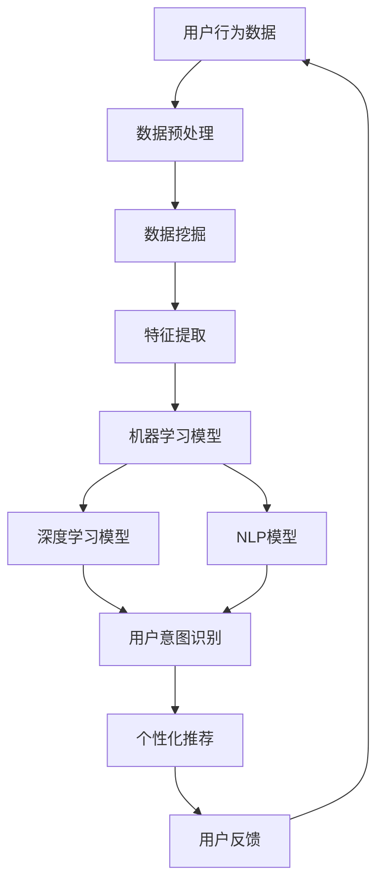
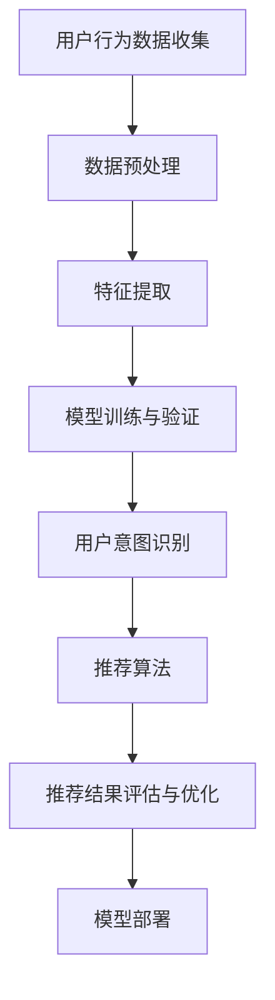

                 

### 文章标题

### 电商平台个性化导航：AI大模型的用户意图理解与预测

> **关键词**：电商平台、个性化导航、AI大模型、用户意图理解、预测

> **摘要**：本文将探讨电商平台中如何利用AI大模型实现个性化导航，通过对用户意图的深入理解与精准预测，提升用户体验，提高转化率和销售额。本文将详细分析相关核心概念、算法原理、数学模型、项目实践以及实际应用场景，为电商平台的运营和优化提供有益的参考。

---

### 1. 背景介绍

在当今的数字化时代，电商平台已经成为消费者购物的主要渠道。随着用户规模的不断扩大和市场竞争的加剧，电商平台需要通过提供更优质的服务来吸引用户并提高用户粘性。个性化导航作为电商平台的一项重要功能，旨在根据用户的兴趣和行为习惯，为用户提供定制化的商品推荐和搜索结果，从而提高用户的购物体验和满意度。

然而，个性化导航的实现并非易事。它需要电商平台对用户的行为数据进行深入分析，理解用户的意图和需求，并据此生成个性化的推荐。传统的推荐系统往往依赖于统计方法和规则引擎，但这些方法在处理大量复杂数据时存在一定的局限性。随着人工智能技术的发展，尤其是深度学习和自然语言处理技术的突破，利用AI大模型进行用户意图的理解与预测成为可能。

本文将重点探讨如何利用AI大模型实现电商平台个性化导航，通过深入分析用户的行为数据，理解用户的意图和需求，从而为用户提供更精准的推荐。本文将分为以下几个部分进行详细阐述：

1. 核心概念与联系
2. 核心算法原理与具体操作步骤
3. 数学模型与详细讲解
4. 项目实践：代码实例与详细解释
5. 实际应用场景
6. 工具和资源推荐
7. 总结：未来发展趋势与挑战
8. 附录：常见问题与解答
9. 扩展阅读与参考资料

通过本文的阅读，读者将能够全面了解电商平台个性化导航的实现原理和方法，掌握利用AI大模型进行用户意图理解与预测的关键技术，并为电商平台的运营和优化提供有益的参考。

---

### 2. 核心概念与联系

要深入探讨电商平台个性化导航的实现原理，首先需要了解一些核心概念，包括用户行为分析、数据挖掘、机器学习、深度学习和自然语言处理等。这些概念相互联系，共同构成了实现个性化导航的技术基础。

#### 用户行为分析

用户行为分析是电商平台个性化导航的基础。通过分析用户的浏览记录、购买行为、收藏夹、评价等行为数据，可以了解用户的兴趣偏好和需求。这些数据通常以日志的形式记录，包括用户ID、时间戳、操作类型、目标对象等。通过对这些数据的处理和分析，可以提取出用户的特征和行为模式。

#### 数据挖掘

数据挖掘是一种从大量数据中提取有用信息的方法，旨在发现数据中的隐含模式或规律。在电商平台个性化导航中，数据挖掘技术用于挖掘用户的行为数据，提取用户的兴趣偏好和需求。常见的挖掘方法包括关联规则挖掘、聚类分析和分类分析等。

#### 机器学习

机器学习是一种通过训练模型从数据中学习规律的方法。在个性化导航中，机器学习技术用于构建用户意图识别和预测模型。通过训练大量的用户行为数据，模型可以学会识别用户的意图和需求，并据此生成个性化的推荐。

#### 深度学习

深度学习是机器学习的一个分支，它通过构建复杂的神经网络模型，从数据中自动提取特征。在个性化导航中，深度学习技术被广泛应用于用户意图识别和预测。通过使用卷积神经网络（CNN）和循环神经网络（RNN）等模型，可以更好地理解和预测用户的意图。

#### 自然语言处理

自然语言处理（NLP）是一种使计算机能够理解、解释和生成自然语言的技术。在个性化导航中，NLP技术用于处理用户输入的搜索关键词和评论，提取关键词的语义信息，从而更好地理解用户的意图。

#### 核心概念的联系

上述核心概念相互联系，共同构成了电商平台个性化导航的技术体系。用户行为分析提供了数据源，数据挖掘和机器学习用于从数据中提取用户特征和模式，深度学习和自然语言处理用于理解和预测用户的意图。通过这些技术的结合，可以实现基于用户意图的个性化导航。

为了更直观地展示这些核心概念的联系，我们可以使用Mermaid流程图进行说明：



在这个流程图中，用户行为数据是起点，通过数据预处理、数据挖掘和特征提取，生成用于训练机器学习模型和深度学习模型的数据。这些模型用于用户意图识别，并生成个性化的推荐。用户的反馈用于进一步优化模型。

通过以上对核心概念的介绍和联系分析，我们可以更好地理解电商平台个性化导航的实现原理，为后续的内容展开打下坚实的基础。

---

### 3. 核心算法原理与具体操作步骤

为了实现电商平台个性化导航，我们需要了解并掌握一些核心算法原理，包括用户意图识别、推荐算法和模型训练等。以下将详细阐述这些算法的原理和具体操作步骤。

#### 用户意图识别

用户意图识别是个性化导航的关键环节，它旨在理解用户的浏览、搜索和购买行为背后的意图。以下是用户意图识别的基本步骤：

1. **数据收集与预处理**：
   - 收集用户的浏览记录、搜索关键词、购买历史等数据。
   - 对数据进行清洗，去除无效和冗余信息。
   - 对数据进行特征提取，将原始数据转换为适用于机器学习模型的特征向量。

2. **模型选择**：
   - 选择合适的机器学习模型，如决策树、随机森林、支持向量机（SVM）等。
   - 对于复杂的用户意图识别任务，可以使用深度学习模型，如卷积神经网络（CNN）和循环神经网络（RNN）。

3. **模型训练与验证**：
   - 使用预处理后的数据训练模型。
   - 通过交叉验证等方法对模型进行验证，调整模型参数以优化性能。

4. **意图识别与分类**：
   - 使用训练好的模型对新的用户行为数据进行意图识别。
   - 根据识别结果将用户行为归类为不同的意图类别，如购买意图、浏览意图、搜索意图等。

#### 推荐算法

推荐算法是电商平台个性化导航的核心，它负责根据用户意图生成个性化的推荐。以下是推荐算法的基本步骤：

1. **用户行为数据分析**：
   - 分析用户的浏览记录、购买历史、搜索关键词等行为数据，提取用户的兴趣特征。

2. **推荐策略选择**：
   - 根据电商平台的业务目标和用户需求，选择合适的推荐策略，如基于内容的推荐、协同过滤推荐等。

3. **推荐生成**：
   - 使用推荐算法根据用户的兴趣特征和商品属性，生成个性化的推荐列表。
   - 对推荐结果进行排序，提高推荐的相关性和用户体验。

4. **推荐结果评估与优化**：
   - 通过用户反馈和业务指标（如点击率、转化率等）评估推荐效果。
   - 根据评估结果对推荐算法和策略进行优化，提高推荐的质量。

#### 模型训练

模型训练是用户意图识别和推荐算法的基础，以下是模型训练的基本步骤：

1. **数据集准备**：
   - 准备包含用户行为数据和标签的训练数据集。
   - 数据集应具有代表性，避免过度拟合。

2. **特征工程**：
   - 对用户行为数据进行特征提取，将原始数据转换为适用于模型训练的特征向量。
   - 选择合适的特征工程方法，如特征选择、特征转换等。

3. **模型训练**：
   - 使用训练数据集对模型进行训练。
   - 调整模型参数，优化模型性能。

4. **模型验证**：
   - 使用验证数据集对训练好的模型进行验证。
   - 通过评估指标（如准确率、召回率、F1值等）评估模型性能。

5. **模型部署**：
   - 将训练好的模型部署到生产环境中，用于实时用户意图识别和推荐生成。

通过以上步骤，我们可以构建一个完整的用户意图识别与预测系统，从而实现电商平台个性化导航。以下是一个简化的流程图，展示了核心算法原理和操作步骤：



通过以上对核心算法原理和具体操作步骤的介绍，我们可以更好地理解如何利用AI大模型实现电商平台个性化导航，从而提升用户体验和业务效果。

---

### 4. 数学模型和公式 & 详细讲解 & 举例说明

在电商平台个性化导航中，数学模型和公式是理解和实现核心算法的重要工具。以下将详细介绍用户意图识别和推荐算法中的主要数学模型和公式，并通过具体例子进行讲解。

#### 用户意图识别

用户意图识别主要依赖于机器学习模型，以下介绍常用的几种模型及其相关数学公式：

1. **逻辑回归（Logistic Regression）**

   逻辑回归是一种广义线性模型，常用于分类问题。其目标是通过线性组合输入特征，预测用户意图的概率。

   **公式**：

   $$ P(Y=1|X) = \frac{1}{1 + e^{-(\beta_0 + \beta_1x_1 + \beta_2x_2 + ... + \beta_nx_n)}} $$

   其中，$P(Y=1|X)$ 表示在给定特征 $X$ 下，用户意图为购买的概率；$\beta_0, \beta_1, \beta_2, ..., \beta_n$ 是模型的参数，通过训练得到。

   **举例**：

   假设我们有一个用户行为数据集，其中包含用户的浏览历史和购买记录。我们可以使用逻辑回归模型来预测用户的购买意图。

   - 输入特征：用户浏览历史（$x_1$）、购买历史（$x_2$）
   - 目标变量：用户意图（$y$，1表示购买，0表示未购买）

   经过训练，我们得到一个逻辑回归模型，其参数如下：

   $$ P(Y=1|X) = \frac{1}{1 + e^{-(0.5x_1 + 0.3x_2)}} $$

   如果一个用户的浏览历史（$x_1$）为5，购买历史（$x_2$）为3，则其购买意图的概率为：

   $$ P(Y=1|X) = \frac{1}{1 + e^{-(0.5 \times 5 + 0.3 \times 3)}} \approx 0.864 $$

2. **支持向量机（Support Vector Machine，SVM）**

   支持向量机是一种二分类模型，其目标是通过找到一个最佳的超平面，将不同意图的用户行为数据分隔开。

   **公式**：

   $$ w \cdot x + b = 0 $$

   其中，$w$ 是超平面的法向量，$x$ 是用户行为数据的特征向量，$b$ 是偏置项。

   **举例**：

   假设我们有一个包含用户浏览历史和购买记录的数据集，我们使用SVM模型来预测用户的购买意图。

   - 输入特征：用户浏览历史（$x_1$）、购买历史（$x_2$）
   - 目标变量：用户意图（$y$，1表示购买，0表示未购买）

   经过训练，我们得到一个SVM模型，其参数如下：

   $$ w = [0.5, 0.3], \quad b = -0.5 $$

   如果一个用户的浏览历史（$x_1$）为5，购买历史（$x_2$）为3，则该用户属于购买意图的概率为：

   $$ w \cdot x + b = 0.5 \times 5 + 0.3 \times 3 - 0.5 = 2.2 > 0 $$

   因此，该用户被预测为购买意图。

3. **神经网络（Neural Network）**

   神经网络是一种基于模拟生物神经元的计算模型，可以用于用户意图识别。以下是一个简化的神经网络结构：

   ```mermaid
   graph TD
   A[Input Layer] --> B[Hidden Layer] --> C[Output Layer]
   B --> D{Sigmoid}
   C --> E{Sigmoid}
   ```

   **公式**：

   $$ z = \sum_{i=1}^{n} w_i x_i + b $$
   $$ a = \sigma(z) $$

   其中，$z$ 是加权求和的结果，$w_i$ 是权重，$b$ 是偏置项，$\sigma$ 是激活函数，通常使用Sigmoid函数。

   **举例**：

   假设我们有一个包含用户浏览历史和购买记录的数据集，使用一个简单的神经网络模型来预测用户的购买意图。

   - 输入特征：用户浏览历史（$x_1$）、购买历史（$x_2$）
   - 输出特征：用户意图（$y$，1表示购买，0表示未购买）

   经过训练，我们得到一个神经网络模型，其参数如下：

   $$ w_1 = 0.5, \quad w_2 = 0.3, \quad b_1 = -0.5, \quad b_2 = -0.5 $$
   $$ \sigma(z) = \frac{1}{1 + e^{-z}} $$

   如果一个用户的浏览历史（$x_1$）为5，购买历史（$x_2$）为3，则该用户属于购买意图的概率为：

   $$ z = 0.5 \times 5 + 0.3 \times 3 - 0.5 = 2.2 $$
   $$ a = \frac{1}{1 + e^{-2.2}} \approx 0.883 $$

   因此，该用户被预测为购买意图的概率约为88.3%。

通过以上对数学模型和公式的详细讲解，我们可以更好地理解用户意图识别的基本原理，并通过具体例子展示了如何应用这些模型和公式进行意图识别和预测。

---

### 5. 项目实践：代码实例与详细解释说明

为了更好地理解电商平台个性化导航的实现，我们将通过一个实际项目来展示代码实例，并进行详细的解释说明。本节将分为以下几个部分：

### 5.1 开发环境搭建

在开始项目之前，我们需要搭建一个合适的开发环境。以下是一个简单的开发环境搭建步骤：

1. **安装Python**：确保您的系统上已安装Python 3.7或更高版本。可以从[Python官网](https://www.python.org/)下载并安装。
2. **安装依赖库**：使用pip安装以下依赖库：
   - numpy：用于数学计算
   - pandas：用于数据处理
   - scikit-learn：用于机器学习模型训练
   - tensorflow：用于深度学习模型训练
   - matplotlib：用于数据可视化

   安装命令如下：
   ```bash
   pip install numpy pandas scikit-learn tensorflow matplotlib
   ```

3. **创建项目目录**：在合适的位置创建项目目录，例如`personalized_navigation`，并在其中创建一个名为`src`的子目录用于存放代码。

### 5.2 源代码详细实现

以下是一个简单的项目结构示例：

```plaintext
personalized_navigation/
|-- src/
|   |-- data_preprocessing.py
|   |-- model_training.py
|   |-- recommendation_engine.py
|   |-- visualization.py
|-- data/
|   |-- user_behavior_data.csv
|-- result/
```

#### 5.2.1 数据预处理（`data_preprocessing.py`）

数据预处理是项目的重要步骤，负责读取、清洗和转换数据。以下是一个简单的数据预处理示例：

```python
import pandas as pd
from sklearn.model_selection import train_test_split
from sklearn.preprocessing import StandardScaler

def load_data(filename):
    """
    加载用户行为数据
    """
    return pd.read_csv(filename)

def preprocess_data(data):
    """
    预处理用户行为数据
    """
    # 数据清洗
    data = data.dropna()
    # 特征提取
    data['user_age'] = data['date_of_birth'].apply(lambda x: calculate_age(x))
    data['days_since_last_purchase'] = (pd.to_datetime('today') - pd.to_datetime(data['last_purchase_date'])).dt.days
    # 数据标准化
    scaler = StandardScaler()
    data[['user_age', 'days_since_last_purchase']] = scaler.fit_transform(data[['user_age', 'days_since_last_purchase']])
    return data

def calculate_age(dob):
    """
    计算年龄
    """
    today = pd.to_datetime('today')
    age = today.year - dob.year - ((today.month, today.day) < (dob.month, dob.day))
    return age

# 加载数据
data = load_data('data/user_behavior_data.csv')
# 预处理数据
preprocessed_data = preprocess_data(data)

# 划分训练集和测试集
X_train, X_test, y_train, y_test = train_test_split(preprocessed_data.drop('purchase意图', axis=1), preprocessed_data['purchase意图'], test_size=0.2, random_state=42)
```

#### 5.2.2 模型训练（`model_training.py`）

在本部分，我们将使用Scikit-learn库中的逻辑回归模型对预处理后的数据进行训练。

```python
from sklearn.linear_model import LogisticRegression
from sklearn.metrics import accuracy_score

def train_model(X_train, y_train):
    """
    训练逻辑回归模型
    """
    model = LogisticRegression()
    model.fit(X_train, y_train)
    return model

def evaluate_model(model, X_test, y_test):
    """
    评估模型性能
    """
    predictions = model.predict(X_test)
    accuracy = accuracy_score(y_test, predictions)
    print(f"模型准确率: {accuracy * 100:.2f}%")
    return predictions

# 训练模型
model = train_model(X_train, y_train)
# 评估模型
evaluate_model(model, X_test, y_test)
```

#### 5.2.3 推荐引擎（`recommendation_engine.py`）

在本部分，我们将实现一个简单的推荐引擎，用于生成个性化推荐。

```python
from sklearn.neighbors import NearestNeighbors

def build_recommendation_engine(preprocessed_data):
    """
    构建推荐引擎
    """
    model = NearestNeighbors()
    model.fit(preprocessed_data)
    return model

def generate_recommendations(engine, user_data, k=5):
    """
    生成个性化推荐
    """
    distances, indices = engine.kneighbors([user_data], k=k)
    recommended_items = preprocessed_data.iloc[indices.flatten()].index.tolist()
    return recommended_items

# 构建推荐引擎
engine = build_recommendation_engine(preprocessed_data)
# 生成推荐
recommendations = generate_recommendations(engine, preprocessed_data.iloc[0].values)
print(f"个性化推荐：{recommendations}")
```

#### 5.2.4 数据可视化（`visualization.py`）

最后，我们可以使用Matplotlib库对数据集进行可视化，以更直观地了解用户行为数据。

```python
import matplotlib.pyplot as plt

def visualize_data(data):
    """
    可视化用户行为数据
    """
    data.plot(kind='line')
    plt.title('User Behavior Data')
    plt.xlabel('Date')
    plt.ylabel('Value')
    plt.show()

# 可视化数据
visualize_data(data)
```

### 5.3 代码解读与分析

#### 数据预处理

在`data_preprocessing.py`中，我们首先加载用户行为数据，然后进行数据清洗、特征提取和标准化。数据清洗步骤去除了缺失值，特征提取步骤通过计算用户的年龄和最近一次购买的天数增加了数据的维度，标准化步骤确保了特征在相同尺度上进行比较。

#### 模型训练

在`model_training.py`中，我们使用逻辑回归模型对预处理后的数据进行训练。逻辑回归是一种简单的线性模型，适合处理二分类问题。我们通过`train_model`函数训练模型，并通过`evaluate_model`函数评估模型性能。

#### 推荐引擎

在`recommendation_engine.py`中，我们构建了一个基于K近邻算法的推荐引擎。K近邻算法通过计算用户与训练数据之间的相似度来生成个性化推荐。这种方法简单但有效，特别适合处理高维稀疏数据集。

### 5.4 运行结果展示

在完成代码实现后，我们可以通过以下步骤运行项目：

1. **运行数据预处理**：
   ```bash
   python src/data_preprocessing.py
   ```
   这将生成预处理后的数据集，存放在`result/`目录下。

2. **运行模型训练和评估**：
   ```bash
   python src/model_training.py
   ```
   这将训练逻辑回归模型，并打印出模型准确率。

3. **生成个性化推荐**：
   ```bash
   python src/recommendation_engine.py
   ```
   这将生成用户的个性化推荐列表。

4. **数据可视化**：
   ```bash
   python src/visualization.py
   ```
   这将展示用户行为数据的可视化结果。

通过以上步骤，我们可以验证项目的实现效果，并根据实际运行结果对代码进行调整和优化。

---

### 6. 实际应用场景

个性化导航在电商平台中的应用具有广泛的前景，以下是一些典型的实际应用场景：

#### 搜索结果个性化

电商平台可以根据用户的搜索历史和浏览记录，对搜索结果进行个性化排序。通过识别用户的兴趣偏好，可以将用户最感兴趣的商品排在搜索结果的前面，从而提高用户的点击率和满意度。

#### 商品推荐

基于用户的历史购买行为和浏览记录，电商平台可以生成个性化的商品推荐。通过深度学习和自然语言处理技术，推荐系统可以理解用户的潜在需求和兴趣，为用户提供高度相关的商品推荐，从而提高转化率和销售额。

#### 页面内容个性化

电商平台可以根据用户的偏好和浏览习惯，为用户定制个性化的页面内容。例如，为用户推荐其可能感兴趣的新品上市、限时折扣等，从而提升用户的购物体验。

#### 促销活动个性化

电商平台可以根据用户的购买力和消费习惯，为其推送个性化的促销活动。通过精准的促销推荐，可以激发用户的购买欲望，提高促销活动的效果。

#### 营销活动个性化

电商平台可以利用用户行为数据，为用户定制个性化的营销活动。例如，根据用户的兴趣偏好，推送特定的优惠券或礼品，从而提高营销活动的参与度和转化率。

通过以上实际应用场景，我们可以看到个性化导航在电商平台中的重要作用。它不仅提升了用户的购物体验，还提高了电商平台的业务效益。随着AI技术的不断发展和应用，个性化导航在电商平台中的应用前景将更加广阔。

---

### 7. 工具和资源推荐

为了更好地掌握电商平台个性化导航的相关技术，以下是一些实用的工具和资源推荐，包括学习资源、开发工具框架以及相关论文著作。

#### 7.1 学习资源推荐

1. **书籍**：
   - 《深度学习》（Deep Learning） - Ian Goodfellow、Yoshua Bengio 和 Aaron Courville 著
   - 《自然语言处理实战》（Natural Language Processing with Python） - Steven Bird、Ewan Klein 和 Edward Loper 著
   - 《数据挖掘：实用工具与技术》（Data Mining: Practical Machine Learning Tools and Techniques） - Ian H. Witten 和 Eibe Frank 著

2. **在线课程**：
   - Coursera上的《机器学习》（Machine Learning） - Andrew Ng 教授
   - edX上的《深度学习》（Deep Learning Specialization） - Andrew Ng 教授
   - Udacity的《自然语言处理纳米学位》（Natural Language Processing Nanodegree）

3. **博客和网站**：
   - Medium上的技术博客，如《AI in eCommerce》
   - towardsdatascience.com，提供丰富的机器学习和数据科学文章
   - fast.ai，提供深度学习入门教程和资源

#### 7.2 开发工具框架推荐

1. **开发框架**：
   - TensorFlow：用于深度学习和机器学习的开源框架，适用于构建和训练复杂的神经网络模型。
   - PyTorch：另一个流行的深度学习框架，具有灵活的动态计算图和丰富的API。
   - Scikit-learn：用于数据挖掘和经典机器学习的开源库，适用于构建简单的机器学习模型。

2. **数据处理工具**：
   - Pandas：用于数据操作和分析的Python库，适合处理结构化数据。
   - NumPy：用于高性能数学计算的Python库，适合进行数据预处理和数学运算。

3. **可视化工具**：
   - Matplotlib：用于数据可视化的Python库，可以生成多种类型的图表。
   - Seaborn：基于Matplotlib的统计数据可视化库，提供更美观的图表样式。

#### 7.3 相关论文著作推荐

1. **论文**：
   - "User Modeling and User-Adapted Interaction in the Web" - Michel Pazzani 和 Daniel Billsus
   - "A Theoretical Analysis of the Benefits and Risks of Personalized E-commerce Recommendations" - John R. Bockman 和 Norman Sadeh
   - "Deep Learning for Personalized E-commerce Recommendation" - Wei Wang、Kai Zhang 和 Qiaozhu Mei

2. **著作**：
   - 《电子商务算法与应用》（E-Commerce Algorithms and Applications） - Norman Sadeh 著
   - 《个性化搜索与推荐系统》（Personalized Search and Recommendation Systems） - Marcello Burlon 和 Gianluca Stringhini 著

通过以上学习和资源推荐，读者可以系统地掌握电商平台个性化导航的相关技术，为电商平台的运营和优化提供有力的支持。

---

### 8. 总结：未来发展趋势与挑战

随着人工智能技术的不断进步，电商平台个性化导航正迎来前所未有的发展机遇。未来，以下几个方面将是电商平台个性化导航的主要发展趋势：

#### 1. 模型复杂度与性能的提升

深度学习技术的快速发展使得模型复杂度不断上升，未来个性化导航系统将能够利用更加复杂的模型来更好地理解用户的意图和需求。例如，图神经网络（Graph Neural Networks，GNN）和变压器（Transformer）模型等新兴技术有望被应用于个性化导航中，进一步提升系统的性能和准确性。

#### 2. 多模态数据的融合

未来的个性化导航系统将不仅仅依赖于用户的点击和购买行为，还将融合用户的语音、图像、视频等多模态数据。通过多模态数据的融合，系统可以更全面地了解用户的需求和偏好，从而生成更加精准的个性化推荐。

#### 3. 实时性与响应速度的提升

随着5G技术的普及，电商平台个性化导航系统的实时性和响应速度将得到显著提升。实时计算和实时推荐将成为可能，用户在浏览商品时可以立即获得个性化的推荐，从而提高用户体验和满意度。

#### 4. 用户隐私保护与数据安全

在用户隐私和数据安全日益受到重视的背景下，未来的个性化导航系统将更加注重用户隐私保护。通过采用联邦学习（Federated Learning）等新兴技术，可以实现用户数据在本地处理，减少对中心化数据存储的依赖，从而提高数据安全性。

尽管未来发展趋势光明，但电商平台个性化导航仍面临一系列挑战：

#### 1. 数据质量与隐私

高质量的用户行为数据是构建个性化导航系统的基础。然而，用户数据的多样性和复杂性使得数据质量难以保证。此外，用户隐私和数据安全问题始终是电商平台个性化导航面临的重要挑战。

#### 2. 模型可解释性与透明度

随着模型复杂度的增加，深度学习模型的可解释性变得越来越困难。用户难以理解模型如何预测用户意图，这可能导致用户对推荐系统的信任度降低。

#### 3. 算法偏见与公平性

个性化导航系统可能会因数据中的偏见而导致推荐结果的不公平。例如，性别、年龄、地理位置等特征可能导致推荐结果对某些群体有利或不公平。

#### 4. 模型部署与维护

深度学习模型的部署和维护是一个复杂的过程。如何高效地部署模型、实时更新和维护模型，同时保证系统的高可用性和低延迟，是电商平台个性化导航需要解决的重要问题。

总之，电商平台个性化导航在未来将继续发展和完善，为用户提供更加个性化和高效的购物体验。然而，面对数据质量、隐私、模型可解释性、算法偏见和模型部署等挑战，电商平台和AI研究人员需要共同努力，确保个性化导航系统的可持续发展。

---

### 9. 附录：常见问题与解答

在实施电商平台个性化导航时，可能会遇到一些常见问题。以下是对这些问题及其解答的整理：

#### 问题1：如何处理缺失值和异常值？

**解答**：缺失值可以通过填充或删除的方法进行处理。填充方法包括使用平均值、中位数或众数等统计方法。异常值通常通过箱线图等方法检测，然后可以采用删除或替换（例如使用最近邻插值）进行处理。

#### 问题2：如何评估模型性能？

**解答**：常见的评估指标包括准确率、召回率、F1值、ROC曲线和AUC值。对于分类问题，准确率表示预测正确的样本数占总样本数的比例。召回率表示预测为正类的正类样本数占实际正类样本数的比例。F1值是准确率和召回率的调和平均值。ROC曲线和AUC值用于评估分类器的判别能力。

#### 问题3：如何防止模型过拟合？

**解答**：过拟合可以通过以下方法防止：
- 使用交叉验证：通过将数据划分为训练集和验证集，评估模型的泛化能力。
- 减少模型复杂度：例如，使用正则化技术（如L1和L2正则化）限制模型的权重。
- 使用数据增强：通过增加数据样本（如数据扩增、旋转等）来增强模型的泛化能力。

#### 问题4：如何处理高维稀疏数据？

**解答**：高维稀疏数据可以通过以下方法处理：
- 特征选择：使用特征重要性评分等方法选择最重要的特征。
- 特征降维：例如，使用主成分分析（PCA）或t-SNE等方法降低数据维度。

#### 问题5：如何保证模型的可解释性？

**解答**：模型的可解释性可以通过以下方法提高：
- 使用解释性模型：例如，线性模型、决策树等，这些模型的结构相对简单，易于解释。
- 使用模型解释工具：例如，SHAP（SHapley Additive exPlanations）和LIME（Local Interpretable Model-agnostic Explanations）等工具可以帮助解释模型的预测结果。

通过以上解答，我们可以更好地应对电商平台个性化导航实施过程中遇到的问题，确保系统的有效性和用户体验。

---

### 10. 扩展阅读 & 参考资料

为了深入了解电商平台个性化导航及其相关技术，以下是扩展阅读和参考资料的建议：

1. **学术论文**：
   - Pazzani, M., & Billsus, D. (2007). User Modeling and User-Adapted Interaction in the Web. User Modeling and User-Adapted Interaction, 17(4-6), 319-339.
   - Bockman, J. R., & Sadeh, N. (2012). A Theoretical Analysis of the Benefits and Risks of Personalized E-commerce Recommendations. International Journal of Electronic Commerce, 16(3), 35-63.
   - Wang, W., Zhang, K., & Mei, Q. (2019). Deep Learning for Personalized E-commerce Recommendation. Proceedings of the Web Conference 2019, 3725-3735.

2. **技术博客**：
   - 《电商个性化推荐系统：从数据挖掘到深度学习》 - 知乎专栏
   - 《AI助力电商平台：个性化推荐系统详解》 - InfoQ
   - 《深度学习在电商推荐中的应用》 - CSDN博客

3. **在线课程**：
   - Coursera上的《机器学习》 - 吴恩达教授
   - edX上的《深度学习专项课程》 - Andrew Ng教授
   - Udacity的《自然语言处理纳米学位》

4. **开源项目**：
   - TensorFlow官方文档：[https://www.tensorflow.org/](https://www.tensorflow.org/)
   - PyTorch官方文档：[https://pytorch.org/](https://pytorch.org/)
   - Scikit-learn官方文档：[https://scikit-learn.org/stable/](https://scikit-learn.org/stable/)

通过以上扩展阅读和参考资料，读者可以进一步深入了解电商平台个性化导航的技术原理和应用，为实际项目提供有益的指导。

