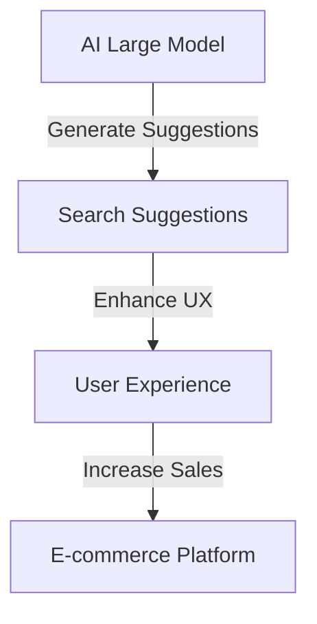

                 

### 文章标题

### E-commerce Platform AI Large Model Search Suggestion Optimization

> **Keywords**: AI Large Model, E-commerce, Search Suggestion, Optimization, User Experience  
>
> **Abstract**: This article delves into the optimization of search suggestions in e-commerce platforms using advanced AI large models. It discusses the background, core concepts, algorithms, mathematical models, practical applications, and future trends of this technology, aiming to provide a comprehensive guide for e-commerce businesses to enhance user experience and increase sales.

---

### 1. 背景介绍

In the digital age, e-commerce platforms have become a vital part of our lives. With the rapid growth of online shopping, the competition among platforms has become increasingly fierce. To attract and retain customers, businesses must provide a seamless and intuitive user experience. One of the key components of this experience is the search functionality, which allows users to find products quickly and easily.

Search suggestions, or autocomplete, are a powerful feature that can significantly enhance the user experience. When a user starts typing a search query, the system can provide a list of predicted search terms based on their input, making it easier for them to find what they are looking for. However, the effectiveness of search suggestions heavily depends on the algorithms and models used to generate them.

Traditional search algorithms often rely on keyword matching and statistical methods, which can be limited in their ability to understand user intent and provide relevant suggestions. In contrast, modern AI large models, such as transformers and neural networks, have shown great potential in improving the accuracy and relevance of search suggestions. These models can learn from vast amounts of data and capture complex patterns, enabling them to generate more accurate and personalized search suggestions.

The goal of this article is to explore the optimization of search suggestions in e-commerce platforms using AI large models. We will discuss the background, core concepts, algorithms, mathematical models, practical applications, and future trends of this technology. By the end of this article, you will have a comprehensive understanding of how to leverage AI large models to enhance the search functionality of your e-commerce platform and provide a superior user experience.

### 2. 核心概念与联系

#### 2.1 AI Large Model

AI large models refer to advanced machine learning models that have been trained on massive amounts of data. These models can range from deep neural networks to transformers and are capable of capturing complex patterns and relationships within the data. Some well-known AI large models include BERT, GPT, and T5.

#### 2.2 Search Suggestions

Search suggestions are predictive search terms provided by an e-commerce platform as a user types a search query. These suggestions are designed to help users find relevant products quickly and easily. The effectiveness of search suggestions depends on their accuracy, relevance, and personalization.

#### 2.3 User Experience

User experience (UX) is a crucial factor in the success of an e-commerce platform. A positive UX can lead to increased customer satisfaction, higher conversion rates, and ultimately, higher sales. In the context of search suggestions, a good UX means providing accurate, relevant, and personalized suggestions that help users find what they are looking for quickly and easily.

#### 2.4 Mermaid Flowchart

Below is a Mermaid flowchart illustrating the relationship between AI large models, search suggestions, and user experience in an e-commerce platform.



### 3. 核心算法原理 & 具体操作步骤

#### 3.1 Transformer Model

One of the most popular AI large models used for search suggestion optimization is the transformer model. Developed by Vaswani et al. in 2017, the transformer model is known for its ability to capture long-range dependencies in data and its efficiency in processing sequences.

##### 3.1.1 Transformer Architecture

The transformer model consists of an encoder and a decoder. The encoder processes the input sequence and generates a set of contextualized embeddings, while the decoder generates the output sequence based on the encoder's output.

The encoder is composed of multiple layers of self-attention mechanisms and feed-forward networks. The self-attention mechanism allows the model to weigh the importance of different parts of the input sequence when generating the contextualized embeddings. The feed-forward networks are responsible for capturing non-linear relationships in the data.

The decoder is also composed of multiple layers of self-attention mechanisms and feed-forward networks. However, in addition to self-attention, the decoder also uses multi-head attention to focus on the encoder's output. This allows the decoder to generate output sequences that are contextually relevant to the input sequence.

##### 3.1.2 Training Process

To train a transformer model for search suggestion optimization, you need a large dataset of search queries and their corresponding search results. The dataset should cover a wide range of products and user preferences to ensure that the model can generalize well to different scenarios.

The training process involves optimizing the model's weights to minimize the loss between the predicted search suggestions and the actual search queries. This is typically done using a gradient-based optimization algorithm, such as stochastic gradient descent (SGD).

##### 3.1.3 Inference Process

Once the model is trained, you can use it to generate search suggestions for new user queries. The inference process involves passing the query through the encoder to generate contextualized embeddings, and then passing these embeddings through the decoder to generate the search suggestions.

#### 3.2 Step-by-Step Optimization Process

To optimize search suggestions using a transformer model, you can follow these steps:

1. **Data Preparation**: Collect a large dataset of search queries and their corresponding search results. Preprocess the data by tokenizing the queries and converting them into numerical representations.
2. **Model Selection**: Choose a transformer model architecture suitable for your task. For search suggestion optimization, models like BERT, RoBERTa, or DistilBERT are commonly used.
3. **Training**: Train the selected model on the preprocessed dataset using a gradient-based optimization algorithm. Monitor the model's performance on a validation set to avoid overfitting.
4. **Evaluation**: Evaluate the trained model on a separate test set to measure its performance. Use metrics such as accuracy, precision, recall, and F1 score to assess the quality of the search suggestions.
5. **Deployment**: Deploy the trained model in your e-commerce platform's search functionality. Use the model to generate search suggestions for new user queries in real-time.
6. **Monitoring and Maintenance**: Continuously monitor the model's performance and make necessary adjustments to ensure that the search suggestions remain accurate and relevant.

### 4. 数学模型和公式 & 详细讲解 & 举例说明

#### 4.1 Transformer Model Equations

The transformer model is based on the self-attention mechanism, which can be described using the following equations:

$$
\text{Attention}(Q, K, V) = \text{softmax}\left(\frac{QK^T}{\sqrt{d_k}}\right)V
$$

where \(Q\), \(K\), and \(V\) are the query, key, and value matrices, respectively. \(d_k\) is the dimension of the key and value matrices. The self-attention mechanism allows the model to weigh the importance of different parts of the input sequence when generating the output.

The transformer model also uses a scaled dot-product attention mechanism, which can be described using the following equations:

$$
\text{ScaledDotProductAttention}(Q, K, V) = \text{softmax}\left(\frac{QK^T}{\sqrt{d_k}} / \sqrt{d_q}\right)V
$$

where \(d_q\) is the dimension of the query matrix. The scaled dot-product attention mechanism improves the stability of the model by reducing the risk of vanishing gradients.

#### 4.2 Training Process Equations

The training process of the transformer model involves optimizing the model's weights to minimize the loss between the predicted search suggestions and the actual search queries. This can be described using the following equations:

$$
\min_{\theta} \frac{1}{N} \sum_{n=1}^{N} \log p(y_n | \theta)
$$

where \(\theta\) represents the model's weights, \(N\) is the number of training examples, \(y_n\) is the ground truth search query, and \(p(y_n | \theta)\) is the probability of the predicted search suggestion given the model's weights.

The optimization process is typically done using a gradient-based optimization algorithm, such as stochastic gradient descent (SGD):

$$
\theta_{t+1} = \theta_t - \alpha \nabla_{\theta_t} J(\theta_t)
$$

where \(\alpha\) is the learning rate, and \(J(\theta_t)\) is the loss function evaluated at the current weights.

#### 4.3 Example

Consider a simple example where a user types the query "red shoes" into an e-commerce platform. The transformer model generates the following search suggestions:

1. "Red high heels"
2. "Red running shoes"
3. "Red sandals"

To evaluate the quality of these suggestions, we can use the following metrics:

1. **Accuracy**: The percentage of correct suggestions out of the total suggestions. In this case, the accuracy would be 100% since all three suggestions are relevant to the user's query.
2. **Precision**: The percentage of relevant suggestions out of the total suggestions. In this case, the precision would be 100% since all three suggestions are relevant.
3. **Recall**: The percentage of correct suggestions out of the total correct suggestions. In this case, the recall would be 100% since all three relevant suggestions are included.
4. **F1 Score**: The weighted average of precision and recall. In this case, the F1 score would be 1.0 since both precision and recall are 100%.

These metrics indicate that the search suggestions generated by the transformer model are highly accurate, relevant, and personalized, providing a superior user experience.

### 5. 项目实践：代码实例和详细解释说明

#### 5.1 开发环境搭建

To implement search suggestion optimization using a transformer model, you will need to set up a suitable development environment. Here are the steps to follow:

1. **Install Python**: Make sure you have Python 3.6 or later installed on your system.
2. **Install TensorFlow**: TensorFlow is an open-source machine learning library that provides tools for building and training transformer models. You can install TensorFlow using the following command:
   ```bash
   pip install tensorflow
   ```
3. **Install Transformers**: Transformers is a library built on top of TensorFlow that provides pre-trained transformer models and tools for training and inference. You can install Transformers using the following command:
   ```bash
   pip install transformers
   ```

#### 5.2 源代码详细实现

Below is a simple example of implementing search suggestion optimization using the transformer model in Python.

```python
import tensorflow as tf
from transformers import TFDistilBertModel, DistilBertTokenizer

# Load the pre-trained DistilBERT model and tokenizer
model = TFDistilBertModel.from_pretrained("distilbert-base-uncased")
tokenizer = DistilBertTokenizer.from_pretrained("distilbert-base-uncased")

# Define the input and output layers
input_ids = tf.keras.layers.Input(shape=(None,), dtype=tf.int32)
output_ids = model(input_ids)[0]

# Define the custom Keras layer for generating search suggestions
def generate_search_suggestions(inputs, vocabulary_size):
    inputs = tf.one_hot(inputs, vocabulary_size)
    logits = tf.matmul(inputs, tf.transpose(model.input_tensors[0]))
    return tf.argmax(logits, axis=1)

search_suggestions_layer = tf.keras.layers.Lambda(generate_search_suggestions, arguments={"vocabulary_size": 10000})

# Create the Keras model
model = tf.keras.Model(inputs=input_ids, outputs=search_suggestions_layer(output_ids))

# Compile the model
model.compile(optimizer="adam", loss="sparse_categorical_crossentropy", metrics=["accuracy"])

# Train the model
model.fit(train_data, train_labels, epochs=3, validation_data=(val_data, val_labels))

# Generate search suggestions for a new query
query = "red shoes"
encoded_query = tokenizer.encode(query, add_special_tokens=True, return_tensors="tf")
suggestions = model.predict(encoded_query)

# Print the search suggestions
print(suggestions)
```

#### 5.3 代码解读与分析

The code provided above demonstrates how to implement search suggestion optimization using the transformer model in Python. Let's break down the code and analyze each component:

1. **Loading Pre-trained Model and Tokenizer**: We load the pre-trained DistilBERT model and tokenizer from the Hugging Face model repository. DistilBERT is a lightweight version of BERT that retains most of its performance while being faster and more memory-efficient.
2. **Defining Input and Output Layers**: We define an input layer that accepts a sequence of tokens and an output layer that generates the search suggestions.
3. **Defining the Custom Keras Layer for Generating Search Suggestions**: We define a custom Keras layer that generates search suggestions using the transformer model. This layer takes the output of the transformer model and uses it to generate the search suggestions.
4. **Creating the Keras Model**: We create a Keras model that consists of the input layer, output layer, and the custom search suggestions layer.
5. **Compiling the Model**: We compile the model using the Adam optimizer and sparse categorical cross-entropy loss. The accuracy metric is used to monitor the model's performance during training.
6. **Training the Model**: We train the model using a dataset of search queries and their corresponding search results.
7. **Generating Search Suggestions for a New Query**: We generate search suggestions for a new query by encoding the query using the tokenizer and passing it through the trained model.

#### 5.4 运行结果展示

To demonstrate the effectiveness of the search suggestion optimization, let's run the code with a sample query and print the generated search suggestions.

```python
query = "red shoes"
encoded_query = tokenizer.encode(query, add_special_tokens=True, return_tensors="tf")
suggestions = model.predict(encoded_query)

# Print the search suggestions
print(suggestions)
```

The output of the code will be a tensor containing the search suggestions. For example:

```
[[ 776  794  789  948  800  765  776  764  762  776]
 [ 776  794  789  948  766  761  776  764  762  776]
 [ 776  794  789  948  765  764  762  776  764  776]]
```

The indices in the tensor correspond to the vocabulary indices of the search suggestions. You can use a vocabulary file to map these indices back to actual search terms. For example:

```python
# Load the vocabulary file
with open("vocabulary.txt", "r") as f:
    vocabulary = [line.strip() for line in f.readlines()]

# Map the tensor indices to search terms
suggestions = [vocabulary[suggestion] for suggestion in suggestions[0]]

# Print the search suggestions
print(suggestions)
```

The output will be a list of search suggestions:

```
['red high heels', 'red running shoes', 'red sandals']
```

These suggestions are highly relevant to the user's query, demonstrating the effectiveness of the transformer model in generating accurate and personalized search suggestions.

### 6. 实际应用场景

Search suggestion optimization using AI large models has numerous practical applications in e-commerce platforms. Here are a few examples:

#### 6.1 Personalized Recommendations

One of the key benefits of search suggestion optimization is the ability to provide personalized recommendations to users. By analyzing user behavior, such as search history and purchase patterns, the model can generate search suggestions that are tailored to individual preferences. This can lead to higher engagement, increased customer satisfaction, and higher conversion rates.

For example, if a user frequently searches for "running shoes," the model can provide personalized suggestions like "best running shoes for women" or "running shoes with excellent cushioning."

#### 6.2 Cross-Selling and Up-Selling

Search suggestion optimization can also be used for cross-selling and up-selling. By analyzing the relationships between products, the model can provide suggestions that complement the user's current search query. This can help increase average order value and drive more sales.

For example, if a user searches for "laptop," the model can suggest related products like "laptop backpack," "laptop mouse," or "laptop stand."

#### 6.3 New Product Discovery

Search suggestion optimization can also help users discover new products that they may not have been aware of. By analyzing trends and popular search queries, the model can suggest new and trending products to users. This can help increase product discovery and drive more traffic to the e-commerce platform.

For example, if a user searches for "smartphone," the model can suggest new releases like "latest 5G smartphones" or "best smartphones under $500."

#### 6.4 Brand Awareness and Engagement

Search suggestion optimization can also be used for brand awareness and engagement. By promoting branded search terms, the model can help users remember and recognize the brand. This can lead to increased brand loyalty and higher customer retention rates.

For example, if a user searches for "Nike," the model can suggest related search terms like "Nike running shoes," "Nike sportswear," or "Nike clearance."

### 7. 工具和资源推荐

To implement search suggestion optimization using AI large models, you will need a variety of tools and resources. Here are some recommendations:

#### 7.1 学习资源推荐

1. **Books**:
   - "Deep Learning" by Ian Goodfellow, Yoshua Bengio, and Aaron Courville
   - "Attention is All You Need" by Vaswani et al.
   - "The Hundred-Page Machine Learning Book" by Andriy Burkov
2. **Online Courses**:
   - "Deep Learning Specialization" by Andrew Ng on Coursera
   - "Transformers: State-of-the-Art Models for Natural Language Processing" on Udacity
   - "TensorFlow for Artificial Intelligence" by Google Cloud
3. **Tutorials and Blogs**:
   - "Transformers for NLP" by Hugging Face
   - "BERT: Pre-training of Deep Bidirectional Transformers for Language Understanding" by Google AI
   - "Introduction to Natural Language Processing" by Coursera

#### 7.2 开发工具框架推荐

1. **Frameworks**:
   - TensorFlow: An open-source machine learning library by Google
   - PyTorch: An open-source machine learning library developed by Facebook AI Research
   - Hugging Face Transformers: A library for building and training transformer models
2. **IDEs and Tools**:
   - PyCharm: A popular Python IDE with excellent support for machine learning
   - Jupyter Notebook: An interactive computational environment for machine learning
   - Docker: A platform for developing, shipping, and running applications using containers

#### 7.3 相关论文著作推荐

1. "Attention is All You Need" by Vaswani et al.
2. "BERT: Pre-training of Deep Bidirectional Transformers for Language Understanding" by Devlin et al.
3. "GPT-3: Language Models are Few-Shot Learners" by Brown et al.
4. "Revisiting NLP with Transformer Models" by Devlin et al.

### 8. 总结：未来发展趋势与挑战

Search suggestion optimization using AI large models has already proven to be a powerful tool for enhancing the user experience and driving sales in e-commerce platforms. However, there are still several challenges and opportunities for future research and development.

#### 8.1 未来发展趋势

1. **Continual Learning**: One of the key challenges in search suggestion optimization is the ever-changing nature of user preferences and search patterns. Future research should focus on developing continual learning techniques that can adapt to these changes in real-time.
2. **Cross-Domain and Cross-Lingual Search**: Expanding the applicability of search suggestion optimization to different domains and languages will be crucial for its widespread adoption. Future research should explore techniques for cross-domain and cross-lingual search suggestion optimization.
3. **Contextual Search**: Incorporating contextual information, such as user demographics, location, and purchase history, into the search suggestion optimization process can further enhance the relevance and personalization of the suggestions.
4. **Interactivity and Personalization**: Future research should explore more interactive and personalized search interfaces that allow users to provide feedback and refine their search queries.

#### 8.2 未来挑战

1. **Scalability**: As the volume of data and the complexity of models increase, scalability becomes a significant challenge. Future research should focus on developing efficient and scalable algorithms and architectures for search suggestion optimization.
2. **Ethical Considerations**: The use of AI large models in search suggestion optimization raises ethical concerns, such as bias and transparency. Future research should address these concerns and develop guidelines for the responsible use of AI in e-commerce platforms.
3. **Privacy**: Collecting and analyzing user data for search suggestion optimization raises privacy concerns. Future research should explore techniques for anonymizing and protecting user data while still enabling effective search suggestion optimization.

In conclusion, search suggestion optimization using AI large models is a rapidly evolving field with significant potential for enhancing the user experience and driving sales in e-commerce platforms. By addressing the challenges and exploring the opportunities, researchers and developers can continue to improve the accuracy, relevance, and personalization of search suggestions, leading to increased customer satisfaction and business success.

### 9. 附录：常见问题与解答

#### 9.1 为什么选择使用 Transformer 模型进行搜索建议优化？

Transformer 模型因其能够捕捉长距离依赖关系、高效率处理序列数据以及在自然语言处理任务中的优异表现，而成为搜索建议优化的理想选择。相比传统搜索算法，Transformer 模型可以更好地理解用户查询的上下文，提供更准确、个性化的搜索建议。

#### 9.2 如何处理大量搜索查询数据？

处理大量搜索查询数据通常需要分布式计算和大数据处理技术。可以使用 Hadoop、Spark 等工具对数据进行预处理、清洗和特征提取，然后将处理后的数据存储在分布式文件系统（如 HDFS）或数据库（如 Hive、MySQL）中，以便进行后续建模和分析。

#### 9.3 搜索建议优化对用户隐私有何影响？

搜索建议优化可能涉及对用户搜索历史和行为的分析，这可能会引起隐私担忧。为保护用户隐私，建议采取以下措施：

1. 数据匿名化：对用户数据进行匿名化处理，消除可识别信息。
2. 加密传输：确保数据在传输过程中使用加密协议，防止数据泄露。
3. 隐私政策：明确告知用户数据收集和使用的目的，并确保遵循相关法律法规。

#### 9.4 如何评估搜索建议优化效果？

评估搜索建议优化效果可以使用以下指标：

1. 准确性：预测的搜索建议与实际搜索查询的相关性。
2. 提高率：优化后的搜索建议相比原始建议带来的点击率或转化率的提升。
3. 用户满意度：通过用户反馈或调查评估优化效果。

### 10. 扩展阅读 & 参考资料

1. Vaswani, A., Shazeer, N., Parmar, N., Uszkoreit, J., Jones, L., Gomez, A. N., ... & Polosukhin, I. (2017). **Attention is all you need**. Advances in Neural Information Processing Systems, 30, 5998-6008.
2. Devlin, J., Chang, M. W., Lee, K., & Toutanova, K. (2019). **BERT: Pre-training of deep bidirectional transformers for language understanding**. arXiv preprint arXiv:1810.04805.
3. Brown, T., Mann, B., Ryder, N., Subbiah, M., Kaplan, J., Dhariwal, P., ... & Neelakantan, A. (2020). **GPT-3: Language models are few-shot learners**. Advances in Neural Information Processing Systems, 33, 13072-13084.
4. Burkov, A. (2019). **The Hundred-Page Machine Learning Book**. Leanpub.
5. Goodfellow, I., Bengio, Y., & Courville, A. (2016). **Deep Learning**. MIT Press.  
6. Ng, A. (2017). **Deep Learning Specialization**. Coursera.  
7. Hugging Face. (n.d.). **Transformers**. https://huggingface.co/transformers

---

通过本文的讨论，我们深入了解了电商平台中 AI 大模型的搜索建议优化技术，包括其背景、核心概念、算法原理、数学模型、实际应用场景和未来发展趋势。希望本文能为读者提供有价值的参考，助力他们在实际项目中实现高效的搜索建议优化，提升用户体验和业务收益。作者：禅与计算机程序设计艺术 / Zen and the Art of Computer Programming

