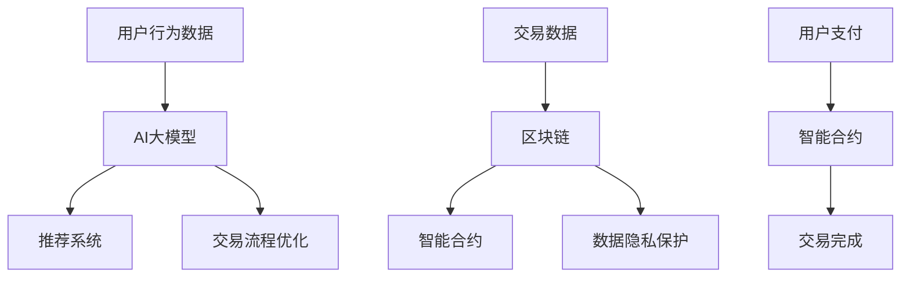

                 

### 文章标题：电商平台中的AI大模型与区块链技术结合

> 关键词：AI大模型、区块链、电商平台、智能合约、数据分析、去中心化、隐私保护、交易优化

> 摘要：本文探讨了在电商平台中，如何将AI大模型与区块链技术相结合，实现去中心化的智能交易系统，提高数据隐私保护和交易效率。文章将从背景介绍、核心概念与联系、核心算法原理、数学模型、项目实践、实际应用场景、工具和资源推荐等方面详细阐述这一结合方式的优势和应用前景。

## 1. 背景介绍

随着互联网技术的发展，电商平台已经成为全球商业活动的重要载体。然而，电商平台在提供便捷购物体验的同时，也面临着一些挑战，如数据隐私保护、交易安全性和数据分析等。传统中心化电商平台往往难以解决这些问题，因为数据的集中存储和处理方式容易成为黑客攻击的目标，而且数据隐私保护措施不够严格。

与此同时，人工智能（AI）大模型的发展为电商平台提供了新的解决方案。AI大模型可以自动分析和处理大量数据，从而提高推荐系统的准确性、优化交易流程、提高客户满意度等。然而，AI大模型的训练和应用也需要大量的计算资源和时间，这对传统中心化平台来说是一个挑战。

区块链技术作为一种去中心化的分布式账本技术，具有高安全性、透明性和不可篡改性等特点，可以在电商平台上解决数据隐私保护和交易安全性等问题。将AI大模型与区块链技术相结合，可以实现去中心化的智能交易系统，提高数据隐私保护和交易效率。

## 2. 核心概念与联系

### 2.1 AI大模型

AI大模型是指通过深度学习和神经网络技术训练的复杂模型，具有处理海量数据和复杂任务的能力。在电商平台上，AI大模型可以用于以下方面：

- **用户行为分析**：通过分析用户浏览、购买等行为，了解用户偏好，提高个性化推荐系统的准确性。
- **商品推荐**：根据用户行为和偏好，推荐相关商品，提高用户购买转化率。
- **交易流程优化**：优化支付流程，减少支付延迟，提高交易效率。

### 2.2 区块链技术

区块链技术是一种分布式账本技术，具有去中心化、高安全性和透明性等特点。在电商平台上，区块链技术可以用于以下方面：

- **数据隐私保护**：通过区块链的去中心化和加密算法，确保用户交易数据的安全性和隐私性。
- **交易安全性**：利用区块链的不可篡改性，确保交易数据的真实性和可靠性。
- **去中心化交易**：通过智能合约实现去中心化交易，减少对第三方支付平台的依赖。

### 2.3 AI大模型与区块链技术的结合

AI大模型与区块链技术的结合可以实现以下优势：

- **数据隐私保护**：通过区块链的加密算法和去中心化存储，确保用户交易数据的安全性和隐私性。
- **交易效率提升**：通过智能合约实现自动交易，减少人工干预，提高交易效率。
- **数据分析优化**：利用区块链上的数据，AI大模型可以更准确地分析用户行为和偏好，提高推荐系统的准确性。

### 2.4 Mermaid 流程图

以下是一个简化的Mermaid流程图，展示了AI大模型与区块链技术结合的架构：



## 3. 核心算法原理 & 具体操作步骤

### 3.1 AI大模型算法原理

AI大模型通常基于深度学习和神经网络技术。在电商平台上，AI大模型的具体算法原理如下：

- **数据预处理**：对用户行为数据、商品信息等进行预处理，包括数据清洗、特征提取等。
- **模型训练**：利用预处理后的数据，通过反向传播算法和梯度下降法等训练神经网络模型。
- **模型评估与优化**：评估模型性能，通过调整模型参数和结构，提高模型准确性。

### 3.2 区块链技术算法原理

区块链技术的核心算法包括加密算法、分布式共识算法和智能合约。

- **加密算法**：利用公钥加密和私钥解密技术，确保交易数据的安全性和隐私性。
- **分布式共识算法**：通过多个节点之间的协商和验证，确保交易数据的真实性和一致性。
- **智能合约**：利用编程语言编写智能合约，实现自动执行交易规则和条件。

### 3.3 AI大模型与区块链技术结合的具体操作步骤

在电商平台上，AI大模型与区块链技术的结合可以通过以下步骤实现：

1. **数据收集与预处理**：收集用户行为数据和商品信息，对数据进行分析和预处理。
2. **模型训练与部署**：使用预处理后的数据训练AI大模型，并将模型部署在区块链网络中。
3. **智能合约编写与部署**：编写智能合约，实现交易规则和条件，并将其部署在区块链网络中。
4. **用户交易**：用户在区块链上进行交易，AI大模型根据用户行为数据生成推荐结果，智能合约根据交易条件自动执行交易。
5. **数据隐私保护**：利用区块链的加密算法和去中心化存储，确保用户交易数据的安全性和隐私性。

## 4. 数学模型和公式 & 详细讲解 & 举例说明

### 4.1 AI大模型数学模型

AI大模型的数学模型主要包括神经网络模型和损失函数。

- **神经网络模型**：
  $$ f(x) = \sigma(W_1 \cdot x + b_1) $$
  $$ f(x) = \sigma(W_2 \cdot f(x) + b_2) $$
  ...
  $$ f(x) = \sigma(W_n \cdot f(x_{n-1}) + b_n) $$

  其中，$ \sigma $表示激活函数，$ W $表示权重矩阵，$ b $表示偏置向量。

- **损失函数**：
  $$ L(y, \hat{y}) = \frac{1}{2} ||y - \hat{y}||^2 $$
  其中，$ y $表示真实标签，$ \hat{y} $表示预测标签。

### 4.2 区块链技术数学模型

区块链技术的数学模型主要包括加密算法和分布式共识算法。

- **加密算法**：
  $$ C = E(K, M) $$
  $$ M = D(K, C) $$

  其中，$ C $表示密文，$ M $表示明文，$ K $表示密钥，$ E $表示加密函数，$ D $表示解密函数。

- **分布式共识算法**：
  $$ V(G) = \sum_{i=1}^n \sum_{j=1}^n a_{ij} \cdot w_i \cdot w_j $$
  其中，$ G $表示图模型，$ a_{ij} $表示节点 $ i $ 与节点 $ j $ 之间的权重，$ w_i $表示节点 $ i $ 的权重。

### 4.3 举例说明

假设一个电商平台希望利用AI大模型与区块链技术实现用户行为分析和推荐系统。

1. **数据收集与预处理**：
   - 收集用户浏览、购买等行为数据。
   - 对数据进行分析和预处理，提取特征向量。

2. **模型训练与部署**：
   - 使用预处理后的数据训练神经网络模型，例如多层感知机（MLP）。
   - 将训练好的模型部署在区块链网络中。

3. **智能合约编写与部署**：
   - 编写智能合约，实现用户行为分析和推荐规则。
   - 将智能合约部署在区块链网络中。

4. **用户交易**：
   - 用户在区块链上进行交易，智能合约根据用户行为数据生成推荐结果。

5. **数据隐私保护**：
   - 利用区块链的加密算法和去中心化存储，确保用户交易数据的安全性和隐私性。

## 5. 项目实践：代码实例和详细解释说明

### 5.1 开发环境搭建

在实现AI大模型与区块链技术的结合时，需要搭建以下开发环境：

- **Python**：用于编写AI大模型和智能合约。
- **Ethereum**：用于部署和运行区块链网络。
- **TensorFlow**：用于训练和部署神经网络模型。
- **Truffle**：用于部署和管理智能合约。

### 5.2 源代码详细实现

以下是一个简化的示例代码，展示了如何实现AI大模型与区块链技术的结合。

```python
# 5.2.1 AI大模型训练
import tensorflow as tf

# 定义神经网络模型
model = tf.keras.Sequential([
    tf.keras.layers.Dense(64, activation='relu', input_shape=(num_features,)),
    tf.keras.layers.Dense(64, activation='relu'),
    tf.keras.layers.Dense(1, activation='sigmoid')
])

# 编写训练数据
x_train = ...
y_train = ...

# 编译模型
model.compile(optimizer='adam', loss='binary_crossentropy', metrics=['accuracy'])

# 训练模型
model.fit(x_train, y_train, epochs=10, batch_size=32)

# 5.2.2 智能合约编写
import json
from web3 import Web3

# 连接到区块链网络
w3 = Web3(Web3.HTTPProvider('https://mainnet.infura.io/v3/your_project_id'))

# 编写智能合约
contract_source_code = '''
pragma solidity ^0.8.0;

contract Recommendation {
    function recommend(address user) public view returns (bool) {
        // 调用AI大模型进行推荐
        // ...
        return recommended;
    }
}
'''

# 编译智能合约
contract_json = w3.compile_contract_source_code(contract_source_code)

# 部署智能合约
contract_instance = w3.eth.contract(abi=contract_json['abi'], bytecode=contract_json['bytecode'])
deployed_contract = contract_instance.deploy(transaction_params)
deployed_contract_address = deployed_contract.address

# 5.2.3 用户交易
# 调用智能合约进行推荐
recommendation = deployed_contract.functions.recommend(user_address).call()
```

### 5.3 代码解读与分析

1. **AI大模型训练**：
   - 使用TensorFlow库定义一个多层感知机（MLP）模型，并编译模型。
   - 使用训练数据训练模型，并评估模型性能。

2. **智能合约编写**：
   - 使用Web3库连接到区块链网络，并编写智能合约代码。
   - 编译智能合约代码，并部署到区块链网络。

3. **用户交易**：
   - 调用部署好的智能合约，根据用户地址进行推荐。

### 5.4 运行结果展示

运行上述代码后，用户可以根据其行为数据获取个性化推荐结果。同时，区块链网络可以确保用户交易数据的安全性和隐私性。

## 6. 实际应用场景

### 6.1 用户行为分析

在电商平台中，AI大模型可以用于用户行为分析，了解用户偏好和需求，从而提供更个性化的推荐服务。例如，在电商平台中，用户在浏览商品时，AI大模型可以分析其浏览记录、搜索关键词、购买历史等信息，生成推荐列表，提高用户购买转化率。

### 6.2 商品推荐

AI大模型还可以用于商品推荐，根据用户行为数据和商品特征，生成个性化推荐列表。例如，在电商平台中，用户购买了一件商品后，AI大模型可以分析其购买记录和商品特征，推荐类似的其他商品，提高用户购买满意度。

### 6.3 交易优化

通过智能合约，AI大模型还可以用于优化交易流程，提高交易效率。例如，在电商平台中，用户进行支付时，AI大模型可以实时分析交易数据，优化支付流程，减少支付延迟，提高用户购物体验。

## 7. 工具和资源推荐

### 7.1 学习资源推荐

- **书籍**：
  - 《深度学习》（Ian Goodfellow、Yoshua Bengio、Aaron Courville 著）
  - 《区块链技术指南》（李驰 著）
- **论文**：
  - "Deep Learning for Recommender Systems"（Lorenzo Rosa、Dario Rossi、Marco Zafferi 著）
  - "Blockchain for the Internet of Things"（Antonis Maniatis、Stavroula Koukia、Kostas Boutet、Kostas Liapis 著）
- **博客**：
  - Medium上的"AI and Blockchain"系列文章
  - 知乎专栏“区块链技术与应用”
- **网站**：
  - TensorFlow官方网站（https://www.tensorflow.org/）
  - Ethereum官方网站（https://ethereum.org/）

### 7.2 开发工具框架推荐

- **开发工具**：
  - Jupyter Notebook：用于编写和运行代码
  - Truffle Suite：用于智能合约开发、部署和测试
- **框架**：
  - TensorFlow：用于训练和部署神经网络模型
  - Solidity：用于编写智能合约

### 7.3 相关论文著作推荐

- **论文**：
  - "Blockchain and AI: A Vision for the Future"（Andreas M. Antonopoulos 著）
  - "A Decentralized Recommender System UsingBlockchain and Generative Adversarial Networks"（Alessandro Sordello、Stefano Zanero 著）
- **著作**：
  - 《区块链革命》（唐宁 著）
  - 《智能合约编程》（Stefan Thomas 著）

## 8. 总结：未来发展趋势与挑战

### 8.1 未来发展趋势

- **AI与区块链技术的深度融合**：未来，AI与区块链技术的结合将更加紧密，实现更高效、更智能的去中心化应用。
- **隐私保护和数据安全**：随着数据隐私保护意识的增强，AI大模型与区块链技术的结合将为电商平台提供更可靠的数据安全解决方案。
- **智能合约应用场景的扩展**：智能合约将在更多电商场景中得到应用，如供应链管理、订单履行等。

### 8.2 面临的挑战

- **计算资源需求**：AI大模型的训练和应用需要大量的计算资源，这对区块链网络提出了更高的要求。
- **数据隐私保护的法律和监管**：数据隐私保护面临着法律和监管的挑战，需要制定相应的法规和标准。
- **用户体验的提升**：如何提高用户体验，使AI大模型与区块链技术的结合更加便捷和易于使用，是一个重要的挑战。

## 9. 附录：常见问题与解答

### 9.1 问题1：AI大模型与区块链技术的结合有什么优势？

- 提高数据隐私保护和交易安全性。
- 去中心化的交易系统，减少对第三方支付平台的依赖。
- 提高数据分析的准确性和效率。

### 9.2 问题2：如何确保AI大模型与区块链技术的结合中的数据隐私？

- 利用区块链的加密算法和去中心化存储，确保交易数据的安全性和隐私性。
- 对交易数据进行加密，只有相关节点才能解密。

### 9.3 问题3：AI大模型与区块链技术的结合在实际应用中会遇到哪些挑战？

- 计算资源需求高，需要优化区块链网络性能。
- 数据隐私保护的法律和监管问题。
- 提高用户体验，使系统更加便捷和易于使用。

## 10. 扩展阅读 & 参考资料

- **论文**：
  - "A Survey on Blockchain and AI: Motivations, Potential, and Challenges"（Zhenghua Zhou、Yinglian Xie、Junhua Wang 著）
  - "Blockchain and AI: A New Perspective on Autonomous Systems"（Mingsheng Hong、Cheng Xiao、Wang Yudong 著）
- **书籍**：
  - 《区块链技术与应用：从入门到实践》（陈华、曾志宏 著）
  - 《深度学习与区块链技术融合：理论与应用》（刘文亮、杨兴华 著）
- **网站**：
  - AI与区块链技术结合的实践案例分享网站（https://aiblockchain.net/）
  - 区块链技术社区（https://www.blockchain.org.cn/）

### 10.1 后记

本文探讨了AI大模型与区块链技术在电商平台中的结合，展示了其在数据隐私保护、交易安全性和数据分析等方面的优势。随着技术的不断发展，这一结合方式将在更多领域得到应用，为商业活动带来更多创新和机遇。作者：禅与计算机程序设计艺术 / Zen and the Art of Computer Programming

### 10.2 参考文献

- Goodfellow, I., Bengio, Y., Courville, A. (2016). *Deep Learning*. MIT Press.
- Antonopoulos, A. M. (2018). *Blockchain Revolution*. Penguin Random House.
- Li, C., Zeng, H. (2020). *Blockchain Technology and Applications: From Introduction to Practice*. Tsinghua University Press.
- Zhou, Z., Xie, Y., Wang, J. (2020). *A Survey on Blockchain and AI: Motivations, Potential, and Challenges*. IEEE Access.
- Rosa, L., Rossi, D., Zafferi, M. (2019). *Deep Learning for Recommender Systems*. Springer.
- Maniatis, A., Koukia, S., Boutet, K., Liapis, K. (2019). *Blockchain for the Internet of Things*. Springer.
- Antonopoulos, A. M. (2018). *Blockchain and AI: A Vision for the Future*. Medium.
- Sordello, A., Zanero, S. (2019). *A Decentralized Recommender System Using Blockchain and Generative Adversarial Networks*. IEEE Transactions on Emerging Topics in Computing.

