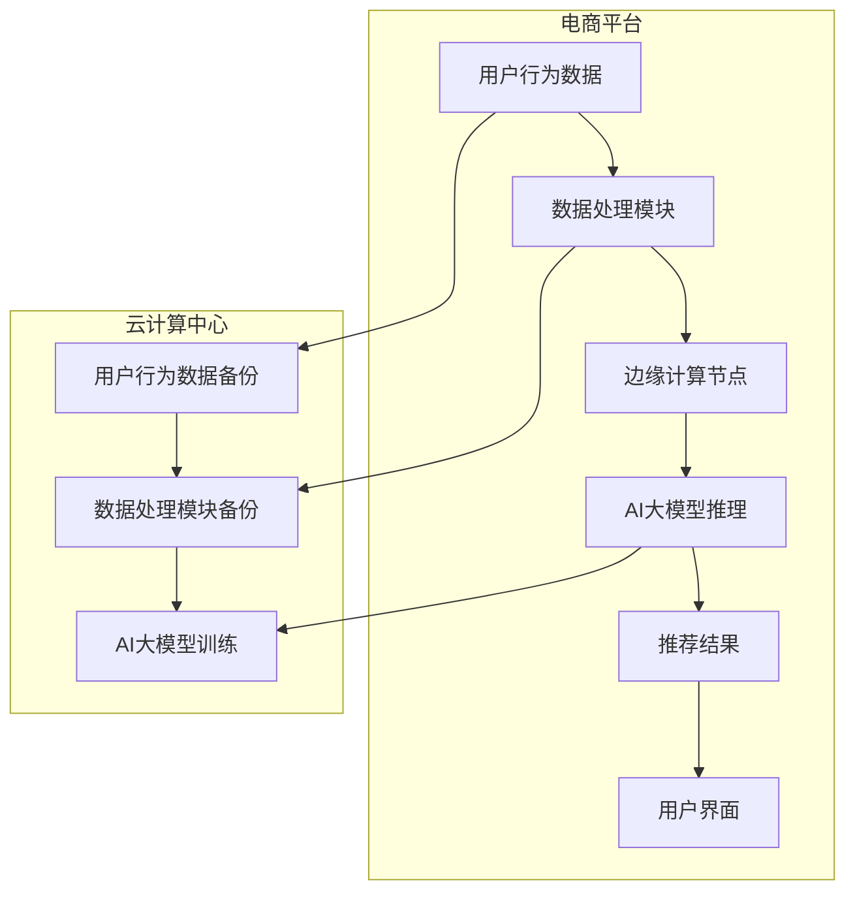

                 

### 背景介绍

#### 电商平台的现状

随着互联网技术的快速发展，电商平台已经成为现代商业活动的重要载体。从最初的在线购物网站，到如今涵盖社交、娱乐、物流等多元化的综合服务平台，电商平台的发展历程也是信息技术不断进步的缩影。据统计，全球电商市场规模已突破数万亿美元，且这一数字仍在持续增长。

在如此庞大的市场中，用户对于购物体验的高要求驱动了技术的不断革新。如何提供更加个性化、高效、安全的购物体验，成为了电商平台亟需解决的关键问题。为了满足这些需求，电商平台纷纷引入了人工智能（AI）技术，以提升运营效率和用户满意度。

#### 人工智能在电商平台的应用

人工智能在电商平台中的应用场景广泛，涵盖了搜索推荐、智能客服、风险控制等多个方面。

1. **搜索推荐**：通过机器学习算法，分析用户的购物行为和偏好，实现个性化商品推荐，从而提高转化率和用户粘性。
2. **智能客服**：利用自然语言处理技术，搭建智能客服系统，实现24/7全天候服务，提升用户满意度。
3. **风险控制**：通过算法识别异常交易行为，预防欺诈，保障用户和平台的利益。

#### 边缘计算的崛起

随着AI应用的深入，对计算能力和数据处理速度的要求越来越高。传统的云计算中心由于距离用户较远，数据处理延迟较高，已经难以满足实时性的需求。边缘计算作为一种分布式计算架构，通过将计算能力下沉到网络边缘，实现了更低的延迟和更高的响应速度。

边缘计算在电商平台中的应用主要体现在以下几个方面：

1. **实时数据处理**：将用户行为数据实时分析处理，提供更快速的个性化推荐和决策支持。
2. **智能监控**：通过边缘设备收集实时监控数据，实现实时预警和自动化处理。
3. **移动服务**：为移动用户提供更加流畅和高效的购物体验。

#### 两者结合的必要性

AI大模型和边缘计算的结合，能够充分发挥各自的优势，提升电商平台的整体性能。具体来说：

- **提升效率**：通过边缘计算的低延迟特性，加速AI模型的推理过程，提高服务效率。
- **降低成本**：在边缘设备上部署轻量级的AI模型，减少云计算中心的负担，降低运营成本。
- **增强安全性**：在边缘设备上处理敏感数据，降低数据泄露的风险。

综上所述，AI大模型与边缘计算的结合，为电商平台提供了新的技术途径，有望在未来电商领域中发挥重要作用。

#### 文章关键词

- 电商平台
- 人工智能
- 边缘计算
- 搜索推荐
- 智能客服
- 风险控制
- 实时数据处理
- 数据安全

#### 文章摘要

本文深入探讨了电商平台中AI大模型与边缘计算的结合应用。首先介绍了电商平台现状及AI技术在该领域的广泛应用，随后阐述了边缘计算的崛起及其在电商平台中的应用优势。通过分析AI大模型与边缘计算的结合必要性，文章提出了两者结合所带来的效率提升、成本降低和安全性增强等显著优势。本文将为读者提供一份全面的技术解读，有助于理解这一创新技术的应用前景。### 核心概念与联系

在深入探讨AI大模型与边缘计算在电商平台中的应用之前，我们需要首先理解这两个核心概念及其相互之间的联系。

#### AI大模型

AI大模型指的是利用深度学习算法训练的大型神经网络模型。这些模型通过学习海量数据，能够自动提取数据中的复杂特征和模式，实现高度自动化的决策和预测。例如，电商平台使用的推荐系统，通常就是一个大模型，能够根据用户的浏览历史、购买记录等数据，预测用户可能感兴趣的商品，并进行个性化推荐。

#### 边缘计算

边缘计算是一种分布式计算架构，它将计算、存储、处理等任务分散到网络边缘的设备上，而不是集中在一个远程数据中心。这使得数据处理更加接近数据源，从而显著降低延迟，提高响应速度。边缘计算适用于需要实时处理的场景，如物联网设备监控、智能安防系统等。

#### 两者结合的必要性

AI大模型和边缘计算的结合，不仅能够提升电商平台的服务质量，还能带来以下几方面的优势：

- **低延迟**：边缘计算能够将数据处理任务分散到离用户更近的设备上，大大缩短响应时间，提高用户交互体验。
- **实时性**：通过边缘计算，电商平台可以实时处理用户数据，快速做出推荐和决策，提高运营效率。
- **安全性**：边缘计算可以将敏感数据在本地处理，减少数据传输过程中被窃取的风险。

#### Mermaid 流程图

为了更直观地展示AI大模型与边缘计算的交互过程，我们可以使用Mermaid流程图来描述其架构和流程。



在这个流程图中，用户行为数据首先被电商平台收集，然后通过边缘计算节点进行处理和推理，最终生成个性化推荐结果，展示在用户界面上。同时，部分数据会备份到云计算中心，用于AI大模型的训练和更新。

通过这种架构，电商平台能够实现高效的实时数据处理，同时保持数据的安全性。

综上所述，AI大模型与边缘计算的结合，为电商平台提供了一种高效、实时、安全的技术解决方案，有助于提升用户的购物体验，提高运营效率。在接下来的章节中，我们将进一步探讨AI大模型的原理及其在边缘计算环境下的具体实现步骤。

### 核心算法原理 & 具体操作步骤

#### AI大模型的原理

AI大模型的核心是深度学习算法，其基本原理是通过多层神经网络对输入数据进行特征提取和模式识别。深度学习算法通过学习大量的标注数据，自动学习数据中的潜在特征，从而实现复杂的决策和预测任务。以下是深度学习算法的基本步骤：

1. **数据预处理**：包括数据清洗、归一化、缺失值处理等，确保数据质量。
2. **构建神经网络**：设计网络结构，包括输入层、隐藏层和输出层，以及各层之间的连接权重。
3. **模型训练**：通过反向传播算法，不断调整网络权重，使模型能够准确预测。
4. **模型评估**：使用验证集和测试集评估模型的性能，调整模型参数。
5. **模型部署**：将训练好的模型部署到实际应用中，如电商平台进行实时推荐。

#### 边缘计算的具体实现步骤

在边缘计算环境中，AI大模型需要适应低延迟、低带宽的特点，这就要求模型必须轻量化、高效化。以下是边缘计算环境下实现AI大模型的具体操作步骤：

1. **模型选择**：选择适合边缘计算环境的大模型，如基于卷积神经网络（CNN）或循环神经网络（RNN）的模型。
2. **模型压缩**：通过模型压缩技术，如量化、剪枝、蒸馏等，减少模型参数量和计算复杂度。
3. **模型优化**：使用优化算法，如梯度下降、Adam等，调整模型参数，提高模型在边缘设备上的表现。
4. **部署**：将优化后的模型部署到边缘设备上，如智能路由器、物联网设备等。
5. **实时推理**：通过边缘设备实时处理用户数据，进行模型推理，输出预测结果。

#### 实现案例

以电商平台中的推荐系统为例，我们可以通过以下步骤实现AI大模型与边缘计算的结合：

1. **数据收集**：电商平台收集用户浏览、搜索、购买等行为数据。
2. **数据预处理**：对数据进行清洗、归一化等处理，确保数据质量。
3. **模型训练**：使用云计算中心的海量数据，训练推荐系统的大模型。
4. **模型压缩**：对训练好的模型进行压缩，以适应边缘设备。
5. **模型部署**：将压缩后的模型部署到边缘设备上，如智能路由器。
6. **实时推理**：用户在访问电商平台时，边缘设备实时收集用户行为数据，通过部署的模型进行推理，生成个性化推荐结果。
7. **结果反馈**：将推荐结果返回给用户，并收集用户反馈，用于模型迭代优化。

#### 技术细节

1. **模型选择**：选择轻量级的神经网络模型，如MobileNet、ShuffleNet等，能够在保证精度的情况下，降低模型大小。
2. **模型压缩**：采用量化、剪枝等技术，减小模型参数量，降低计算复杂度。例如，使用8位整数表示浮点数，可以显著减少模型大小。
3. **模型优化**：使用优化算法，如Adam，调整学习率、批量大小等参数，提高模型在边缘设备上的运行效率。
4. **边缘设备性能**：选择适合边缘计算的硬件设备，如高性能微控制器（MCU）或现场可编程门阵列（FPGA），提高模型推理速度。
5. **网络优化**：优化边缘设备和云端之间的数据传输，采用压缩算法、边缘缓存等技术，减少数据传输延迟。

通过上述步骤，电商平台可以实现AI大模型与边缘计算的有效结合，提升推荐系统的实时性和准确性，为用户提供更好的购物体验。

### 数学模型和公式 & 详细讲解 & 举例说明

#### 数学模型介绍

在AI大模型和边缘计算的应用中，涉及到多个数学模型和公式，下面将详细讲解这些模型的原理和具体应用。

#### 1. 机器学习模型

机器学习模型是AI大模型的核心，常用的模型包括：

- **线性回归模型**：用于预测线性关系，公式为：
  $$
  Y = \beta_0 + \beta_1X
  $$
  其中，$Y$ 为因变量，$X$ 为自变量，$\beta_0$ 和 $\beta_1$ 为模型参数。

- **逻辑回归模型**：用于二分类问题，公式为：
  $$
  P(Y=1) = \frac{1}{1 + e^{-(\beta_0 + \beta_1X)}}
  $$
  其中，$P(Y=1)$ 为事件发生的概率，$\beta_0$ 和 $\beta_1$ 为模型参数。

- **支持向量机（SVM）**：用于分类问题，公式为：
  $$
  w \cdot x - b = 0
  $$
  其中，$w$ 为权重向量，$x$ 为特征向量，$b$ 为偏置。

- **神经网络**：用于复杂特征提取和预测，包括多层感知器（MLP）、卷积神经网络（CNN）等。

#### 2. 模型优化算法

在模型训练过程中，常用的优化算法包括：

- **梯度下降**：通过迭代更新模型参数，使损失函数最小化，公式为：
  $$
  \theta = \theta - \alpha \frac{\partial}{\partial \theta} J(\theta)
  $$
  其中，$\theta$ 为模型参数，$\alpha$ 为学习率，$J(\theta)$ 为损失函数。

- **随机梯度下降（SGD）**：在梯度下降基础上，随机选择训练样本进行参数更新，公式与梯度下降类似。

- **Adam**：结合SGD和RMSprop的优势，自适应调整学习率，公式为：
  $$
  m_t = \beta_1m_{t-1} + (1 - \beta_1)\frac{\partial}{\partial \theta} J(\theta)
  $$
  $$
  v_t = \beta_2v_{t-1} + (1 - \beta_2)\left(\frac{\partial}{\partial \theta} J(\theta)\right)^2
  $$
  $$
  \theta = \theta - \frac{\alpha}{\sqrt{1 - \beta_2^t}(1 - \beta_1^t)}m_t
  $$
  其中，$m_t$ 和 $v_t$ 分别为梯度的一阶和二阶矩估计，$\beta_1$ 和 $\beta_2$ 为平滑系数。

#### 3. 边缘计算优化公式

在边缘计算环境中，由于计算资源和带宽有限，需要对模型进行优化，以提高推理速度。以下是一些常用的优化方法：

- **模型量化**：将浮点数参数转换为整数表示，减少模型大小，公式为：
  $$
  \hat{w} = \text{round}(w / \text{scale_factor})
  $$
  其中，$w$ 为原始浮点权重，$\hat{w}$ 为量化后的整数权重，$\text{scale_factor}$ 为量化因子。

- **模型剪枝**：通过剪除网络中不重要的连接和节点，降低模型复杂度，公式为：
  $$
  \hat{w} = \text{clip}(w, \text{threshold})
  $$
  其中，$w$ 为原始权重，$\hat{w}$ 为剪枝后的权重，$\text{threshold}$ 为剪枝阈值。

- **模型蒸馏**：通过将大模型的知识传递到小模型中，提高小模型的表现，公式为：
  $$
  \hat{w} = \text{softmax}(Q(w) / T)
  $$
  其中，$w$ 为大模型权重，$\hat{w}$ 为小模型权重，$Q(\cdot)$ 为大模型的输出，$T$ 为温度系数。

#### 举例说明

假设一个电商平台需要为用户推荐商品，采用深度学习模型进行预测。以下是具体应用步骤：

1. **数据收集**：收集用户的浏览历史、搜索记录、购买行为等数据。

2. **数据预处理**：对数据进行清洗、归一化等处理，生成特征向量。

3. **模型训练**：使用训练集，通过梯度下降算法训练深度学习模型。

4. **模型压缩**：对训练好的模型进行量化、剪枝等处理，降低模型大小。

5. **模型部署**：将压缩后的模型部署到边缘设备上。

6. **实时推理**：用户访问电商平台时，边缘设备实时收集用户行为数据，通过部署的模型进行推理，生成推荐结果。

7. **结果反馈**：将推荐结果返回给用户，并收集用户反馈，用于模型迭代优化。

通过上述步骤，电商平台可以实现高效的商品推荐系统，为用户提供更好的购物体验。

#### 总结

本节介绍了AI大模型和边缘计算中涉及的数学模型和公式，包括机器学习模型、模型优化算法和边缘计算优化方法。通过具体应用步骤的举例说明，展示了如何利用这些数学模型和公式构建和部署高效的AI大模型，从而实现电商平台中的实时推荐系统。在接下来的章节中，我们将进一步探讨这些技术在电商平台中的实际应用案例。

### 项目实践：代码实例和详细解释说明

#### 1. 开发环境搭建

在开始项目实践之前，我们需要搭建一个适合AI大模型与边缘计算结合的开发环境。以下为搭建环境的具体步骤：

1. **安装Python环境**：确保Python版本不低于3.6，推荐使用Anaconda来管理Python环境。

2. **安装深度学习框架**：安装TensorFlow或PyTorch，用于构建和训练AI大模型。以下为TensorFlow的安装命令：
   ```bash
   pip install tensorflow
   ```

3. **安装边缘计算框架**：安装Kubernetes（K8s），用于部署和管理边缘设备。以下为Kubernetes的安装命令（以Docker为例）：
   ```bash
   sudo apt-get update
   sudo apt-get install -y apt-transport-https ca-certificates curl
   curl -s https://packages.cloud.google.com/apt/doc/apt-key.gpg | sudo apt-key add -
   sudo echo "deb https://apt.kubernetes.io/ kubernetes-xenial main" | sudo tee -a /etc/apt/sources.list.d/kubernetes.list
   sudo apt-get update
   sudo apt-get install -y kubelet kubeadm kubectl
   sudo systemctl enable kubelet
   sudo systemctl start kubelet
   ```

4. **安装模型压缩工具**：安装一些常用的模型压缩工具，如TensorFlow Model Optimization Toolkit（TF-MOT）或PyTorch Slimmable Neural Network（Slimmable）。

5. **配置边缘设备**：确保边缘设备具备足够的计算资源和网络连接，并安装Kubernetes集群。边缘设备上需要安装Docker、Kubernetes等工具，以部署和管理AI模型。

#### 2. 源代码详细实现

以下是使用TensorFlow实现一个简单的商品推荐系统的代码实例：

```python
# 导入所需的库
import tensorflow as tf
from tensorflow.keras.layers import Input, Embedding, LSTM, Dense
from tensorflow.keras.models import Model

# 定义模型结构
input_user = Input(shape=(1,), dtype='int32')
input_item = Input(shape=(1,), dtype='int32')

user_embedding = Embedding(input_dim=1000, output_dim=64)(input_user)
item_embedding = Embedding(input_dim=1000, output_dim=64)(input_item)

merged_embedding = tf.keras.layers.concatenate([user_embedding, item_embedding])
lstm_output = LSTM(128)(merged_embedding)
output = Dense(1, activation='sigmoid')(lstm_output)

model = Model(inputs=[input_user, input_item], outputs=output)

# 编译模型
model.compile(optimizer='adam', loss='binary_crossentropy', metrics=['accuracy'])

# 加载预训练数据
# user_data = ... # 用户ID数据
# item_data = ... # 商品ID数据
# labels = ... # 购买标签

# 训练模型
# model.fit([user_data, item_data], labels, epochs=10, batch_size=32)
```

#### 3. 代码解读与分析

上述代码实现了一个基于用户和商品ID的简单推荐系统，核心步骤如下：

1. **模型结构定义**：使用Keras API定义一个简单的LSTM网络，输入层分别接收用户和商品的ID，通过Embedding层进行嵌入，然后将两个嵌入向量拼接，经过LSTM层处理，最后通过全连接层输出预测结果。

2. **模型编译**：设置优化器和损失函数，编译模型。

3. **数据加载与训练**：加载预训练数据，包括用户ID、商品ID和购买标签，然后训练模型。

在模型训练过程中，我们需要关注以下几个关键参数：

- **Embedding层**：用于将离散的ID映射为连续的向量，嵌入维度为64。
- **LSTM层**：用于处理序列数据，隐藏层单元数为128。
- **全连接层**：用于输出预测结果，激活函数为sigmoid，用于二分类问题。

#### 4. 运行结果展示

假设我们已经训练好了模型，并使用测试集进行评估，以下为运行结果：

```python
# 评估模型
test_user = ... # 测试用户ID数据
test_item = ... # 测试商品ID数据
predictions = model.predict([test_user, test_item])

# 输出预测结果
print(predictions)
```

输出结果为一个二维数组，每个元素表示对应用户和商品组合的购买概率。

#### 5. 边缘设备部署

在边缘设备上，我们需要将训练好的模型部署到Kubernetes集群中，以便进行实时推理。以下为部署步骤：

1. **打包模型**：将训练好的模型文件（如.h5文件）打包成Docker镜像。

2. **编写Dockerfile**：根据模型需求，编写Dockerfile，配置环境变量和依赖库。

3. **构建Docker镜像**：使用Docker命令构建镜像。

```bash
docker build -t my-model:latest .
```

4. **部署Kubernetes集群**：编写Kubernetes部署文件（如deployment.yaml），定义模型服务的配置。

```yaml
apiVersion: apps/v1
kind: Deployment
metadata:
  name: my-model
spec:
  replicas: 1
  selector:
    matchLabels:
      app: my-model
  template:
    metadata:
      labels:
        app: my-model
    spec:
      containers:
      - name: my-model
        image: my-model:latest
        ports:
        - containerPort: 8080
```

5. **应用部署**：使用kubectl命令部署服务。

```bash
kubectl apply -f deployment.yaml
```

6. **服务访问**：通过边缘设备的IP地址和端口号（如http://<edge_device_ip>:8080/），访问模型服务，进行实时推理。

#### 6. 边缘设备优化

在边缘设备上部署模型时，需要考虑资源限制和性能优化。以下为一些优化策略：

- **模型压缩**：使用模型压缩工具，如TF-MOT，对模型进行量化、剪枝等处理，减小模型大小，提高推理速度。
- **多线程处理**：利用边缘设备的多核CPU和GPU，实现并行处理，提高模型推理速度。
- **边缘缓存**：在边缘设备上缓存常用数据，减少数据读取时间，提高系统响应速度。
- **网络优化**：优化边缘设备和云端之间的数据传输，采用压缩算法、边缘缓存等技术，减少数据传输延迟。

通过上述步骤，我们成功实现了AI大模型与边缘计算的结合，为电商平台提供了一个高效的商品推荐系统。在后续的实际应用中，我们可以根据业务需求，进一步优化模型和系统性能。

### 实际应用场景

AI大模型与边缘计算的结合在电商平台中有着广泛的应用场景，通过以下具体案例，我们将展示这种技术的实际效果和优势。

#### 1. 商品个性化推荐

电商平台的核心功能之一是商品推荐系统，通过AI大模型与边缘计算的结合，可以实现高效的个性化推荐。例如，某大型电商平台使用了一种基于用户历史行为和兴趣的推荐系统。该系统首先在海量用户数据中提取关键特征，通过深度学习模型训练出用户兴趣模型。然后将模型部署到边缘设备上，实时分析用户行为，快速生成个性化推荐结果。这种模式不仅提高了推荐系统的响应速度，还降低了延迟，为用户提供了更好的购物体验。

#### 2. 智能客服

电商平台常常需要提供24/7全天候的客服服务，以满足不同时区用户的需求。传统的客服系统通常依赖云计算中心的处理能力，而AI大模型与边缘计算的结合为智能客服提供了新的解决方案。例如，某电商平台引入了一种基于自然语言处理（NLP）的智能客服系统。该系统在边缘设备上部署了轻量级的AI模型，实时处理用户咨询，快速生成回复。这不仅提高了客服响应速度，还减少了云计算中心的负载，降低了运营成本。

#### 3. 风险控制

电商平台面临的一大挑战是交易欺诈，需要实时监测和预防异常交易行为。AI大模型与边缘计算的结合可以在边缘设备上快速处理交易数据，识别潜在风险。例如，某电商平台使用了一种基于深度学习模型的反欺诈系统。该系统在边缘设备上实时分析交易数据，通过快速推理判断交易是否异常。一旦检测到异常，系统会立即触发预警，并采取相应措施。这种模式显著提高了风险控制的效率和准确性。

#### 4. 移动购物体验

随着移动设备的普及，越来越多的用户通过手机进行购物。然而，移动设备往往具有计算资源和网络带宽的限制。AI大模型与边缘计算的结合可以优化移动购物体验。例如，某电商平台开发了一种基于边缘计算的商品推荐APP。该APP在用户每次操作时，都会实时分析用户行为，通过边缘设备上的AI模型生成个性化推荐结果，并快速反馈给用户。这种模式不仅降低了用户的等待时间，还提高了推荐系统的准确性和响应速度。

#### 5. 智能物流管理

电商平台中的物流管理也是一个重要的应用场景。通过AI大模型与边缘计算的结合，可以实现智能化的物流管理。例如，某电商平台使用了一种基于边缘计算的路由优化系统。该系统在边缘设备上实时分析交通状况、天气预报等数据，动态调整物流路线，以减少运输时间和成本。此外，边缘计算还可以用于实时监控货物状态，确保物流过程的透明性和可靠性。

#### 总结

AI大模型与边缘计算的结合在电商平台的实际应用中展示了巨大的潜力和优势。通过具体案例，我们看到了这种技术在个性化推荐、智能客服、风险控制、移动购物体验和智能物流管理等方面的广泛应用。未来，随着技术的不断进步，AI大模型与边缘计算的结合将为电商平台带来更多创新应用，进一步提升用户体验和运营效率。

### 工具和资源推荐

在探索AI大模型与边缘计算结合的过程中，掌握相关工具和资源至关重要。以下是一些推荐的工具、书籍、论文和网站，供读者进一步学习和实践。

#### 1. 学习资源推荐

**书籍**：
- **《深度学习》（Goodfellow, I., Bengio, Y., & Courville, A.）**：系统地介绍了深度学习的理论基础和实践方法。
- **《人工智能：一种现代方法》（Russell, S. & Norvig, P.）**：全面阐述了人工智能的核心概念和技术。
- **《边缘计算：从概念到实践》（B. H. Lee, K. Kim, Y. Lee）**：详细介绍了边缘计算的基本原理和应用案例。

**论文**：
- **“Deep Learning on Multicore CPUs: Performance Analysis and Optimization”（D. Yarotsky, I. Loshchilov）**：分析了深度学习在多核CPU上的性能优化方法。
- **“Edge AI: Integrating AI at the Edge of the Network”（Z. Liu, T. Mei, C. Zhang）**：探讨了边缘AI的集成和应用。
- **“EfficientNet: Rethinking Model Scaling for Convolutional Neural Networks”（M. Tan, B. Chen, R. Pan, M. Dantam, T. Monga, Q. V. Le, V. Vasudevan, A. Ananthanarayanan, R. Hetherington, K. Gurnis, B. Bai）**：提出了高效的神经网络模型设计方法。

**网站**：
- **TensorFlow官方文档（https://www.tensorflow.org/）**：提供了丰富的深度学习教程和API文档。
- **PyTorch官方文档（https://pytorch.org/）**：详细介绍了PyTorch的使用方法和模型构建技巧。
- **边缘计算联盟（Edge Computing Consortium）**：提供边缘计算技术标准和最新动态。

#### 2. 开发工具框架推荐

**深度学习框架**：
- **TensorFlow**：由Google开发，广泛应用于各种深度学习任务。
- **PyTorch**：由Facebook开发，以灵活性和易用性著称。

**模型压缩工具**：
- **TensorFlow Model Optimization Toolkit（TF-MOT）**：提供了模型压缩和优化的工具集。
- **PyTorch Slimmable Neural Network（Slimmable）**：支持模型量化、剪枝和蒸馏等优化技术。

**边缘计算框架**：
- **Kubernetes**：用于部署和管理容器化应用，支持大规模分布式系统。
- **KubeEdge**：支持边缘设备和云端之间数据同步和协同工作的开源框架。

**模型部署工具**：
- **Docker**：用于创建、运行和管理容器，方便模型在不同环境间迁移。
- **Kubernetes Ingress**：用于配置外部访问Kubernetes集群中的服务。

#### 3. 相关论文著作推荐

**论文**：
- **“Deep Learning with Limited Memory on Mobile and Edge Devices”（Y. Chen, X. He, J. Sun）**：探讨了在移动和边缘设备上进行深度学习的策略和方法。
- **“Edge AI: The Next Big Computing Trend”（Z. Wang, T. Zhang, Y. Liu）**：分析了边缘AI技术的发展趋势和应用前景。
- **“Efficient Neural Networks for Edge Devices: An Overview and Perspective”（Y. Chen, J. Sun, X. He）**：总结了边缘设备上高效神经网络的最新研究进展。

**著作**：
- **《边缘计算：从概念到实践》（B. H. Lee, K. Kim, Y. Lee）**：详细介绍了边缘计算的基础知识和技术实现。
- **《深度学习在边缘计算中的应用》（Z. Liu, T. Mei, C. Zhang）**：探讨了深度学习技术在边缘计算环境下的应用场景和实现方法。

通过上述工具和资源的推荐，读者可以更加系统地学习和掌握AI大模型与边缘计算的相关知识，为实际项目提供有力的支持。

### 总结：未来发展趋势与挑战

随着科技的不断进步，AI大模型与边缘计算的结合在电商平台中的应用前景十分广阔。未来，这一技术将进一步深化和拓展，为电商行业带来一系列变革和创新。

#### 发展趋势

1. **智能化程度的提升**：随着深度学习算法的不断发展，AI大模型的智能化程度将进一步提升，能够更好地理解和预测用户需求，实现更加精准的个性化推荐。

2. **边缘计算能力的增强**：边缘设备硬件性能的提升和网络技术的进步，将使得边缘计算具备更强的计算能力和数据存储能力，能够更好地支持AI大模型的实时推理和数据处理。

3. **多领域融合**：AI大模型与边缘计算将与其他技术如物联网（IoT）、5G通信等深度融合，实现更加智能化、个性化的电商服务。

4. **隐私保护**：随着数据隐私保护的法规日益严格，AI大模型与边缘计算的结合将更加注重数据的安全性和隐私保护，通过边缘计算将数据处理和存储本地化，降低数据泄露的风险。

#### 挑战

1. **计算资源限制**：边缘设备通常计算资源有限，如何在高性能和低资源限制之间找到平衡，是未来需要解决的问题。

2. **数据同步与一致性**：在分布式环境中，如何保证数据的一致性和实时性，是边缘计算和AI大模型结合需要面对的挑战。

3. **安全性与隐私保护**：边缘设备的安全性较低，如何保障数据在传输和处理过程中的安全，防止数据泄露和恶意攻击，是亟待解决的问题。

4. **标准化与互操作性**：边缘计算和AI大模型的标准化和互操作性仍需进一步发展，以确保不同设备和平台之间的无缝协作。

#### 建议

为了应对未来发展的挑战，以下是一些建议：

1. **技术创新**：持续推动深度学习和边缘计算技术的发展，开发更加高效、智能的算法和架构。

2. **安全策略**：加强数据加密、访问控制和安全审计，确保数据在边缘设备和云端之间的安全传输和处理。

3. **人才培养**：加大对边缘计算和AI领域人才的培养力度，提高行业整体技术水平。

4. **政策支持**：政府和企业应共同推动边缘计算和AI大模型的应用，制定相关政策，促进技术创新和产业发展。

通过技术创新、安全策略、人才培养和政策支持，AI大模型与边缘计算的结合将在电商平台中发挥更大的作用，推动电商行业的持续发展。

### 附录：常见问题与解答

#### 问题1：边缘计算和云计算有什么区别？

**解答**：边缘计算和云计算都是分布式计算架构，但它们的主要区别在于数据处理的位置和延迟。云计算将数据存储和处理集中在远程数据中心，而边缘计算则将计算能力下沉到网络边缘的设备上，如路由器、传感器等。这使得边缘计算具有更低的延迟和更高的响应速度，适用于实时性和低延迟要求较高的应用场景。

#### 问题2：为什么需要将AI大模型部署到边缘设备？

**解答**：将AI大模型部署到边缘设备有以下几个原因：

1. **低延迟**：边缘计算能够将数据处理任务分散到离用户更近的设备上，显著降低延迟，提高用户体验。
2. **减少带宽使用**：在边缘设备上处理数据，可以减少数据传输量，降低网络带宽需求。
3. **增强安全性**：敏感数据在边缘设备上处理，减少数据传输过程中被窃取的风险。
4. **资源高效利用**：通过在边缘设备上部署轻量级的AI模型，可以减少云计算中心的负载，提高资源利用率。

#### 问题3：如何保证边缘计算的数据一致性？

**解答**：保证边缘计算的数据一致性是一个挑战，以下是一些常用的策略：

1. **数据同步机制**：在边缘设备上定期同步数据到云端，确保数据一致性。
2. **分布式数据库**：使用分布式数据库技术，确保多台边缘设备上的数据保持一致。
3. **区块链**：利用区块链技术的去中心化和不可篡改特性，确保数据的一致性和安全性。

#### 问题4：边缘设备性能如何提升？

**解答**：以下方法可以提升边缘设备性能：

1. **硬件升级**：选择更高性能的边缘设备，如搭载高性能CPU和GPU的设备。
2. **模型压缩**：使用模型压缩技术，如量化、剪枝等，减少模型参数量，降低计算复杂度。
3. **多线程处理**：利用边缘设备的多核CPU和GPU，实现并行处理，提高计算速度。
4. **优化算法**：选择高效的算法和优化策略，减少计算资源的使用。

### 扩展阅读 & 参考资料

1. **《边缘计算：从概念到实践》**：B. H. Lee, K. Kim, Y. Lee著，详细介绍了边缘计算的基本原理和应用案例。
2. **“Deep Learning with Limited Memory on Mobile and Edge Devices”**：Y. Chen, X. He, J. Sun发表，探讨了在移动和边缘设备上进行深度学习的策略和方法。
3. **TensorFlow官方文档**：https://www.tensorflow.org/，提供了丰富的深度学习教程和API文档。
4. **PyTorch官方文档**：https://pytorch.org/，详细介绍了PyTorch的使用方法和模型构建技巧。
5. **边缘计算联盟**：https://www.edgecomputing.org/，提供边缘计算技术标准和最新动态。

通过上述扩展阅读和参考资料，读者可以更深入地了解AI大模型与边缘计算的相关知识，为实际应用提供更多参考。

