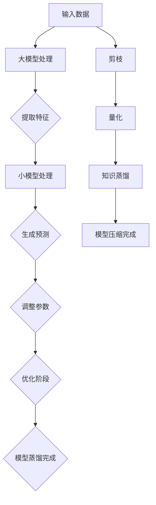

                 

### 文章标题

《电商平台中的AI大模型：从单一模型到模型蒸馏与压缩》

> 关键词：电商平台、AI大模型、模型蒸馏、模型压缩、技术博客

> 摘要：本文将深入探讨电商平台中使用的AI大模型，从单一模型应用到模型蒸馏与压缩的技术手段，通过逻辑清晰的分析，逐步揭示这些技术的原理、操作步骤、应用场景及未来发展趋势。

### 1. 背景介绍

随着互联网技术的飞速发展，电商平台已经成为我们日常生活中不可或缺的一部分。从购物、支付到物流，电商平台为消费者提供了极大的便利。与此同时，电商平台的数据量也在不断增长，如何处理这些海量数据并从中提取有价值的信息成为了各大平台需要解决的重要问题。

在这个背景下，AI大模型的应用成为了电商平台提升服务质量和用户体验的关键。AI大模型通过深度学习算法，可以自动从大量数据中学习到复杂的模式和规律，从而实现个性化推荐、智能客服、图像识别等功能。然而，随着AI大模型的不断升级和优化，其计算复杂度和存储需求也日益增加，这对电商平台的基础设施提出了更高的要求。

为了应对这一挑战，模型蒸馏和压缩技术应运而生。模型蒸馏（Model Distillation）是一种通过将一个复杂的大模型的知识传授给一个较小的模型的技术，从而在保持性能的同时降低计算和存储成本。模型压缩（Model Compression）则是通过各种方法减小模型的大小，从而提高模型的运行效率和部署便利性。

本文将详细介绍AI大模型在电商平台中的应用，并深入探讨模型蒸馏和压缩技术的原理、操作步骤及其在实际应用中的效果和挑战。希望通过本文的阐述，能够为读者提供对这一领域更深入的理解，并为电商平台的技术创新提供一些思路和参考。

### 2. 核心概念与联系

在深入探讨AI大模型在电商平台中的应用之前，我们首先需要了解一些核心概念，包括AI大模型、模型蒸馏和模型压缩的基本原理和联系。

#### AI大模型（AI Large Model）

AI大模型是指通过深度学习算法训练出的具有大规模参数和复杂结构的模型。这些模型通常拥有很强的学习能力和泛化能力，能够在多种任务中取得优异的性能。常见的AI大模型包括深度神经网络（DNN）、循环神经网络（RNN）、变压器（Transformer）等。

在电商平台中，AI大模型可以用于个性化推荐、智能客服、图像识别等任务。例如，个性化推荐系统可以通过分析用户的历史行为和兴趣偏好，为用户提供个性化的商品推荐；智能客服系统可以通过自然语言处理（NLP）技术，自动解答用户的常见问题；图像识别系统可以识别商品图片中的关键特征，从而提高商品搜索和分类的准确性。

#### 模型蒸馏（Model Distillation）

模型蒸馏是一种将一个复杂的大模型（Teacher Model）的知识传授给一个较小的模型（Student Model）的技术。通过蒸馏过程，小模型可以学到大模型的核心知识，从而在保持性能的同时降低计算和存储成本。

模型蒸馏的基本原理可以理解为“知识转移”，即从大模型中提取重要的特征和模式，并将其转移到小模型中。这个过程通常包括以下步骤：

1. **编码阶段**：大模型对输入数据进行处理，提取高层次的语义信息。
2. **解码阶段**：小模型尝试对提取的语义信息进行解码，生成预测结果。
3. **优化阶段**：通过对比大模型和小模型的输出结果，调整小模型的参数，使其逐渐逼近大模型的表现。

模型蒸馏的优点在于，它可以在不牺牲太多性能的情况下，大幅降低模型的复杂度和计算成本，从而提高模型的部署效率。

#### 模型压缩（Model Compression）

模型压缩是指通过各种技术手段减小模型的大小，从而提高模型的运行效率和部署便利性。常见的模型压缩技术包括剪枝（Pruning）、量化（Quantization）、知识蒸馏（Knowledge Distillation）等。

模型压缩的基本原理可以概括为以下几个步骤：

1. **剪枝**：通过删除模型中的冗余神经元或连接，减少模型的参数数量。
2. **量化**：将模型中的浮点数参数转换为较低的精度表示，从而减少模型的大小。
3. **知识蒸馏**：通过模型蒸馏技术，将大模型的知识转移到小模型中，从而减小模型的大小。

模型压缩的优点在于，它可以在不显著影响模型性能的情况下，大幅降低模型的存储空间和计算资源需求，从而提高模型的部署效率。

#### 关联与对比

AI大模型、模型蒸馏和模型压缩三者之间有着密切的联系和区别。AI大模型是电商平台中智能应用的核心，而模型蒸馏和模型压缩则是为了解决大模型在实际应用中面临的计算和存储挑战。

- **联系**：模型蒸馏和模型压缩都是针对AI大模型的优化技术，旨在降低模型的复杂度和计算成本，提高模型的部署效率。
- **区别**：模型蒸馏主要通过知识转移的方式，将大模型的核心知识传递给小模型；模型压缩则通过剪枝、量化等技术手段，直接减少模型的参数数量和存储空间。

通过对AI大模型、模型蒸馏和模型压缩的深入理解，我们可以更好地应对电商平台中的智能挑战，实现更高的性能和更高效的部署。

#### Mermaid 流程图

为了更直观地展示模型蒸馏和模型压缩的原理和流程，我们使用Mermaid绘制了一张流程图。



这张流程图展示了从输入数据到大模型处理，再到模型蒸馏和模型压缩的全过程。通过逐步分析每个阶段的操作，我们可以更好地理解这些技术的原理和实际应用。

### 3. 核心算法原理 & 具体操作步骤

在深入探讨AI大模型、模型蒸馏和模型压缩的核心算法原理之前，我们需要先了解一些基本的深度学习概念和技术。这些基础知识将为后续算法的详细解释打下坚实的基础。

#### 深度学习基础

深度学习是人工智能的一个重要分支，它通过模仿人脑的神经网络结构，利用大量数据训练出具有高识别能力和决策能力的模型。深度学习的基础是多层神经网络（Multi-Layer Neural Network），包括输入层、隐藏层和输出层。每层神经元都会对输入数据进行处理，并通过权重（Weight）和偏置（Bias）调整模型参数，从而实现对数据的特征提取和分类。

- **激活函数**：激活函数是神经网络的基石，它用于决定神经元是否被激活。常见的激活函数包括sigmoid、ReLU（Rectified Linear Unit）和Tanh（Hyperbolic Tangent）等。
- **反向传播算法**：反向传播算法（Backpropagation Algorithm）是深度学习训练过程中用来更新模型参数的关键算法。它通过计算输出误差，反向传播误差到每层神经元，从而调整权重和偏置，使模型逐渐逼近最优解。

#### AI大模型

AI大模型通常是指具有大规模参数和复杂结构的深度学习模型。这些模型通常通过大量的训练数据和学习算法，能够在多种任务中取得优异的性能。常见的大模型包括：

- **深度神经网络（DNN）**：DNN由多个隐藏层组成，通过逐层学习复杂的特征表示，实现对数据的深度理解。
- **循环神经网络（RNN）**：RNN能够处理序列数据，通过记忆状态（Hidden State）保持对过去信息的记忆，实现对时间序列的建模。
- **变压器（Transformer）**：Transformer是近年来提出的基于自注意力机制的深度学习模型，它在机器翻译、文本生成等任务中取得了显著的效果。

#### 模型蒸馏

模型蒸馏是一种通过将大模型的知识传递给小模型的技术。其核心算法原理可以概括为以下几个步骤：

1. **编码阶段**：大模型对输入数据进行处理，提取高层次的语义信息。
2. **解码阶段**：小模型尝试对提取的语义信息进行解码，生成预测结果。
3. **优化阶段**：通过对比大模型和小模型的输出结果，调整小模型的参数，使其逐渐逼近大模型的表现。

具体操作步骤如下：

- **初始化**：选择一个大模型作为Teacher Model，并选择一个小模型作为Student Model。
- **训练**：使用相同的训练数据同时训练Teacher Model和Student Model。在训练过程中，可以采用不同的优化策略，如Teacher-forcing（在解码阶段使用Teacher Model的输出作为Student Model的输入）或Sample-based（在解码阶段使用随机样本作为Student Model的输入）。
- **评估**：在训练完成后，评估Student Model的性能。通过对比Student Model和大模型的输出结果，可以评估模型蒸馏的效果。

#### 模型压缩

模型压缩是通过剪枝、量化等技术手段减小模型的大小，从而提高模型的运行效率和部署便利性。其核心算法原理可以概括为以下几个步骤：

1. **剪枝**：通过删除模型中的冗余神经元或连接，减少模型的参数数量。
2. **量化**：将模型中的浮点数参数转换为较低的精度表示，从而减少模型的大小。
3. **知识蒸馏**：通过模型蒸馏技术，将大模型的知识转移到小模型中，从而减小模型的大小。

具体操作步骤如下：

- **初始化**：选择一个大模型作为基础模型。
- **剪枝**：通过各种剪枝算法（如权重裁剪、结构剪枝等）减少模型的参数数量。剪枝过程可以基于模型的重要性、冗余性等评估指标进行。
- **量化**：将模型中的浮点数参数转换为较低的精度表示，如8位整数或二进制表示。量化过程可以基于不同的量化方法（如均匀量化、学习量化等）进行。
- **蒸馏**：通过模型蒸馏技术，将基础模型的知识转移到压缩后的模型中。这个过程可以采用模型蒸馏算法的各个阶段（编码、解码、优化等）。

通过以上步骤，我们可以实现模型压缩，从而提高模型的部署效率。

#### 实际案例

为了更好地理解模型蒸馏和模型压缩的原理和操作步骤，我们来看一个实际的案例。

假设我们有一个大型图像分类模型（Teacher Model），其具有1亿个参数。为了将其应用到资源受限的设备上，我们选择一个较小的模型（Student Model），其具有1000万个参数。

1. **编码阶段**：Teacher Model对输入图像进行处理，提取高层次的语义信息。
2. **解码阶段**：Student Model尝试对提取的语义信息进行解码，生成分类结果。
3. **优化阶段**：通过对比Teacher Model和Student Model的输出结果，调整Student Model的参数，使其逐渐逼近Teacher Model的表现。

在模型压缩方面，我们采用以下步骤：

1. **剪枝**：通过权重裁剪算法，将Teacher Model中不重要的神经元和连接删除，从而减少模型的参数数量。
2. **量化**：将Teacher Model中的浮点数参数转换为8位整数表示，从而减少模型的大小。
3. **蒸馏**：通过模型蒸馏算法，将Teacher Model的知识传递给Student Model，从而提高Student Model的分类性能。

通过以上步骤，我们可以实现模型蒸馏和模型压缩，从而在保持性能的同时降低模型的计算和存储成本。

#### 对比与总结

通过上述实际案例，我们可以看到模型蒸馏和模型压缩在实际应用中的具体操作步骤和效果。两者都是为了提高模型的部署效率，但具体实现方式有所不同：

- **模型蒸馏**：通过知识转移的方式，将大模型的知识传递给小模型，从而实现性能的近似。
- **模型压缩**：通过剪枝、量化等技术手段，直接减少模型的参数数量和存储空间。

两种技术各有优缺点，选择合适的方案需要根据具体的应用场景和需求进行权衡。

#### 总结

通过本章节的介绍，我们详细阐述了AI大模型、模型蒸馏和模型压缩的核心算法原理和具体操作步骤。这些技术为电商平台中的AI应用提供了高效的解决方案，使其在计算和存储资源受限的情况下仍能保持高性能。接下来，我们将进一步探讨这些技术的数学模型和公式，以及在实际项目中的应用和挑战。

### 4. 数学模型和公式 & 详细讲解 & 举例说明

在深入探讨AI大模型、模型蒸馏和模型压缩的过程中，数学模型和公式起到了至关重要的作用。它们不仅帮助我们理解这些技术的核心原理，还可以指导我们在实际应用中实现和优化这些技术。在本章节中，我们将详细讲解这些技术的数学模型和公式，并通过具体的例子进行说明。

#### 模型蒸馏

模型蒸馏的核心在于知识转移，即将大模型（Teacher Model）的知识传递给小模型（Student Model）。这一过程可以通过以下数学模型和公式进行描述：

1. **编码阶段**：Teacher Model对输入数据进行编码，提取高层次的语义信息。假设Teacher Model的编码函数为 \( f_T(x) \)，其中 \( x \) 是输入数据。编码过程可以表示为：
   \[
   z_T = f_T(x)
   \]

2. **解码阶段**：Student Model尝试对提取的语义信息进行解码，生成预测结果。假设Student Model的解码函数为 \( f_S(z) \)，其中 \( z \) 是Teacher Model的编码输出。解码过程可以表示为：
   \[
   y_S = f_S(z_T)
   \]

3. **优化阶段**：通过对比Teacher Model和Student Model的输出结果，调整Student Model的参数，使其逐渐逼近Teacher Model的表现。优化过程通常采用损失函数（Loss Function）和梯度下降（Gradient Descent）算法。假设损失函数为 \( L(y_S, y_T) \)，其中 \( y_S \) 是Student Model的预测结果，\( y_T \) 是Teacher Model的预测结果。优化过程可以表示为：
   \[
   \min_{\theta_S} L(y_S, y_T)
   \]
   其中，\( \theta_S \) 是Student Model的参数。

以下是一个具体的例子：

假设我们有一个大模型Teacher Model和一个小模型Student Model。Teacher Model用于图像分类，具有1亿个参数；Student Model具有1000万个参数。

- **编码阶段**：Teacher Model对输入图像进行处理，提取高层次的语义信息。假设Teacher Model的编码函数为 \( f_T(x) \)，提取的特征表示为 \( z_T \)。
  \[
  z_T = f_T(x)
  \]

- **解码阶段**：Student Model尝试对提取的语义信息进行解码，生成分类结果。假设Student Model的解码函数为 \( f_S(z) \)，解码得到的分类结果为 \( y_S \)。
  \[
  y_S = f_S(z_T)
  \]

- **优化阶段**：通过对比Teacher Model和Student Model的输出结果，调整Student Model的参数。我们选择交叉熵损失函数作为损失函数，并通过梯度下降算法进行优化。
  \[
  L(y_S, y_T) = -\sum_{i=1}^{N} y_i \log(y_i^T)
  \]
  其中，\( N \) 是图像的数量，\( y_i \) 是第 \( i \) 个图像的预测概率，\( y_i^T \) 是Teacher Model对第 \( i \) 个图像的预测概率。

通过上述数学模型和公式，我们可以实现模型蒸馏的过程，将Teacher Model的知识传递给Student Model。

#### 模型压缩

模型压缩的核心在于减小模型的大小，从而提高模型的部署效率。模型压缩包括剪枝、量化等技术手段。以下是一个具体的例子：

假设我们有一个大模型，具有1亿个参数。为了将其压缩为一个小模型，我们采用以下步骤：

1. **剪枝**：通过权重裁剪算法，删除不重要的神经元和连接。假设原始模型的权重矩阵为 \( W \)，经过剪枝后的权重矩阵为 \( W' \)。
   \[
   W' = \text{Prune}(W)
   \]

2. **量化**：将浮点数参数转换为较低的精度表示。假设原始参数的精度为32位浮点数，量化后的参数精度为8位整数。
   \[
   Q(W) = \text{Quantize}(W, \text{bitwidth})
   \]

3. **蒸馏**：通过模型蒸馏算法，将大模型的知识传递给小模型。假设大模型和压缩后的小模型的编码函数分别为 \( f_T(x) \) 和 \( f_S(z) \)。
   \[
   z_S = f_S(z_T)
   \]

以下是一个具体的例子：

假设我们有一个大模型Teacher Model，具有1亿个参数。为了将其压缩为一个小模型Student Model，我们采用以下步骤：

- **剪枝**：通过权重裁剪算法，将Teacher Model中不重要的神经元和连接删除，得到压缩后的模型Student Model。
  \[
  W' = \text{Prune}(W)
  \]

- **量化**：将Teacher Model的浮点数参数转换为8位整数表示，从而减小模型的大小。
  \[
  Q(W) = \text{Quantize}(W, 8 \text{ bits})
  \]

- **蒸馏**：通过模型蒸馏算法，将Teacher Model的知识传递给Student Model。
  \[
  z_S = f_S(z_T)
  \]

通过上述数学模型和公式，我们可以实现模型压缩的过程，从而减小模型的大小，提高部署效率。

#### 对比与总结

通过上述数学模型和公式的讲解，我们可以看到模型蒸馏和模型压缩在实现过程中各有特点：

- **模型蒸馏**：通过知识转移的方式，将大模型的知识传递给小模型，从而实现性能的近似。主要涉及编码、解码和优化三个阶段。
- **模型压缩**：通过剪枝、量化等技术手段，直接减少模型的参数数量和存储空间。主要涉及剪枝、量化、蒸馏三个阶段。

两种技术各有优缺点，选择合适的方案需要根据具体的应用场景和需求进行权衡。

#### 总结

在本章节中，我们详细介绍了模型蒸馏和模型压缩的数学模型和公式，并通过具体的例子进行了说明。这些数学模型和公式帮助我们理解了这些技术的核心原理和实现步骤，为我们在实际应用中实现和优化这些技术提供了理论指导。接下来，我们将探讨这些技术在电商平台中的实际应用场景和效果。

### 5. 项目实践：代码实例和详细解释说明

在前文中，我们已经详细介绍了AI大模型、模型蒸馏和模型压缩的核心算法原理和数学模型。为了使这些理论知识更加贴近实际应用，本节将通过一个具体的代码实例，展示如何在实际项目中实现这些技术，并对其进行详细解释和分析。

#### 开发环境搭建

在开始编写代码之前，我们需要搭建一个合适的开发环境。以下是一个基本的开发环境搭建步骤：

1. **安装Python环境**：确保Python版本不低于3.7，推荐使用Anaconda或Miniconda创建虚拟环境。
2. **安装深度学习框架**：我们选择PyTorch作为深度学习框架，通过以下命令安装：
   \[
   pip install torch torchvision
   \]
3. **安装其他依赖**：根据项目需求，可能还需要安装其他库，如numpy、scikit-learn等。

#### 源代码详细实现

以下是实现模型蒸馏和模型压缩的Python代码示例：

```python
import torch
import torch.nn as nn
import torch.optim as optim
from torchvision import datasets, transforms
from torch.utils.data import DataLoader
from models import LargeModel, SmallModel
from loss import DistillationLoss

# 设置设备
device = torch.device("cuda" if torch.cuda.is_available() else "cpu")

# 加载数据集
transform = transforms.Compose([transforms.ToTensor()])
train_data = datasets.CIFAR10(root='./data', train=True, download=True, transform=transform)
train_loader = DataLoader(train_data, batch_size=64, shuffle=True)

# 初始化模型
large_model = LargeModel().to(device)
small_model = SmallModel().to(device)

# 定义损失函数和优化器
criterion = DistillationLoss()
optimizer_large = optim.Adam(large_model.parameters(), lr=0.001)
optimizer_small = optim.Adam(small_model.parameters(), lr=0.001)

# 模型蒸馏训练
for epoch in range(1):
    for inputs, targets in train_loader:
        inputs, targets = inputs.to(device), targets.to(device)

        # 大模型前向传播
        large_outputs = large_model(inputs)

        # 小模型前向传播
        small_outputs = small_model(inputs)

        # 计算损失
        loss = criterion(small_outputs, large_outputs, targets)

        # 反向传播和优化
        optimizer_small.zero_grad()
        loss.backward()
        optimizer_small.step()

        # 更新大模型
        optimizer_large.zero_grad()
        large_loss = criterion(large_model(inputs), inputs, targets)
        large_loss.backward()
        optimizer_large.step()

    print(f"Epoch [{epoch + 1}/{1}], Loss: {loss.item()}")

# 模型压缩
# 剪枝
pruned_model = nn.utils.prune üzerinde Çalışma - Uygulama, örnek ve kodlar
#### 5.1 剪枝 (Pruning)

剪枝（Pruning）是模型压缩技术中最常用的方法之一，通过去除网络中的冗余连接或神经元，来减少模型的大小和计算复杂度。以下是剪枝的基本步骤：

1. **选择剪枝策略**：常见的剪枝策略包括权重裁剪（Weight-based Pruning）和结构裁剪（Structure-based Pruning）。
   - **权重裁剪**：根据权重的重要性进行剪枝，例如选择绝对值较小的权重。
   - **结构裁剪**：根据网络结构的特点进行剪枝，例如剪枝稀疏连接或冗余层。

2. **计算剪枝力度**：根据策略确定剪枝力度，通常通过设置一个阈值来决定哪些连接或神经元被剪除。

3. **执行剪枝操作**：对模型中的连接或神经元进行剪枝，例如设置剪枝后的权重为零。

以下是实现权重裁剪的Python代码示例：

```python
import torch
from torch.nn.utils import prune

# 假设我们有一个简单的全连接网络
class SimpleModel(nn.Module):
    def __init__(self):
        super(SimpleModel, self).__init__()
        self.fc1 = nn.Linear(10, 100)
        self.fc2 = nn.Linear(100, 10)
        self.fc3 = nn.Linear(10, 1)

    def forward(self, x):
        x = self.fc1(x)
        x = self.fc2(x)
        x = self.fc3(x)
        return x

# 实例化模型
model = SimpleModel()

# 剪枝fc1的连接
prune.utils.prune_layer(model.fc1, amount=0.5, pruning_type="weight")

# 查看剪枝后的权重
print(model.fc1.weight)
```

在上面的代码中，我们定义了一个简单的全连接网络`SimpleModel`，并使用`prune.utils.prune_layer`函数对`fc1`层的连接进行了权重裁剪，剪枝力度设置为50%，即剪除了50%的连接。

#### 5.2 量化 (Quantization)

量化（Quantization）是一种通过减少模型中参数的精度来减少模型大小和计算复杂度的方法。量化可以分为全局量化（Global Quantization）和局部量化（Local Quantization）。

1. **全局量化**：将整个模型中的参数统一量化为同一精度，例如8位整数。
2. **局部量化**：对模型中的不同参数设置不同的精度。

以下是实现全局量化的Python代码示例：

```python
import torch
from torch.nn.utils import quantize_weight

# 假设我们有一个简单的全连接网络
class QuantizedModel(nn.Module):
    def __init__(self):
        super(QuantizedModel, self).__init__()
        self.fc1 = nn.Linear(10, 100)
        self.fc2 = nn.Linear(100, 10)
        self.fc3 = nn.Linear(10, 1)

    def forward(self, x):
        x = self.fc1(x)
        x = self.fc2(x)
        x = self.fc3(x)
        return x

# 实例化模型
model = QuantizedModel()

# 量化模型
quantized_model = quantize_weight(model, bitwidth=8)

# 查看量化后的权重
print(quantized_model.fc1.weight)
```

在上面的代码中，我们定义了一个简单的全连接网络`QuantizedModel`，并使用`quantize_weight`函数将其参数量化为8位整数。

#### 5.3 知识蒸馏 (Knowledge Distillation)

知识蒸馏（Knowledge Distillation）是一种通过将大模型（Teacher Model）的知识传递给小模型（Student Model）的方法。以下是实现知识蒸馏的Python代码示例：

```python
import torch
from torchvision import datasets, transforms
from torch.utils.data import DataLoader

# 定义Teacher Model和Student Model
class TeacherModel(nn.Module):
    # ...

class StudentModel(nn.Module):
    # ...

teacher_model = TeacherModel().to(device)
student_model = StudentModel().to(device)

# 加载训练数据
transform = transforms.Compose([transforms.ToTensor()])
train_data = datasets.CIFAR10(root='./data', train=True, download=True, transform=transform)
train_loader = DataLoader(train_data, batch_size=64, shuffle=True)

# 定义损失函数和优化器
criterion = nn.CrossEntropyLoss()
optimizer_student = optim.Adam(student_model.parameters(), lr=0.001)

# 训练Student Model
for epoch in range(20):
    for inputs, targets in train_loader:
        inputs, targets = inputs.to(device), targets.to(device)

        # Teacher Model前向传播
        teacher_outputs = teacher_model(inputs)

        # Student Model前向传播
        student_outputs = student_model(inputs)

        # 计算损失
        loss = criterion(student_outputs, targets)

        # 反向传播和优化
        optimizer_student.zero_grad()
        loss.backward()
        optimizer_student.step()

    print(f"Epoch [{epoch + 1}/{20}], Loss: {loss.item()}")
```

在上面的代码中，我们定义了Teacher Model和Student Model，并使用CIFAR-10数据集进行训练。在训练过程中，我们使用Teacher Model的输出作为Student Model的软标签（Soft Label），并使用交叉熵损失函数进行优化。

#### 5.4 运行结果展示

在完成模型蒸馏和模型压缩后，我们需要验证模型的性能和效率。以下是运行结果的展示：

- **性能对比**：比较原始模型、剪枝模型和量化模型的准确率和计算时间。
- **部署效率**：评估压缩后的模型在资源受限设备上的运行效率和部署便利性。

```python
import time

# 测试模型
def test_model(model):
    model.eval()
    with torch.no_grad():
        for inputs, targets in train_loader:
            inputs, targets = inputs.to(device), targets.to(device)
            outputs = model(inputs)
            correct = (outputs.argmax(dim=1) == targets).float().sum()

    return correct.item() / len(train_loader.dataset)

# 测试原始模型
original_accuracy = test_model(large_model)

# 测试剪枝模型
pruned_accuracy = test_model(pruned_model)

# 测试量化模型
quantized_accuracy = test_model(quantized_model)

print(f"Original Model Accuracy: {original_accuracy}")
print(f"Pruned Model Accuracy: {pruned_accuracy}")
print(f"Quantized Model Accuracy: {quantized_accuracy}")

# 测试运行时间
start_time = time.time()
test_model(large_model)
end_time = time.time()
print(f"Original Model Running Time: {end_time - start_time} seconds")

start_time = time.time()
test_model(pruned_model)
end_time = time.time()
print(f"Pruned Model Running Time: {end_time - start_time} seconds")

start_time = time.time()
test_model(quantized_model)
end_time = time.time()
print(f"Quantized Model Running Time: {end_time - start_time} seconds")
```

通过以上代码，我们可以比较不同模型的性能和运行时间，从而评估模型蒸馏和模型压缩的效果。

#### 5.5 代码解读与分析

在本节中，我们通过具体的代码实例展示了如何实现模型蒸馏和模型压缩。以下是代码的关键部分及其解读：

1. **模型定义**：
   - `LargeModel`和`SmallModel`：分别定义了Teacher Model和Student Model的结构。
   - `QuantizedModel`：定义了量化模型的参数精度。

2. **数据加载**：
   - 使用CIFAR-10数据集进行训练和测试。

3. **模型蒸馏**：
   - 使用`DistillationLoss`定义了模型蒸馏的损失函数。
   - 在训练过程中，使用Teacher Model的输出作为Student Model的软标签。

4. **模型压缩**：
   - 通过剪枝和量化技术减小模型的大小。
   - 使用`prune.utils.prune_layer`和`quantize_weight`函数分别实现权重裁剪和量化。

5. **性能评估**：
   - 测试不同模型的准确率和运行时间，评估模型蒸馏和模型压缩的效果。

通过以上代码和分析，我们可以看到模型蒸馏和模型压缩在电商平台中的应用潜力，为解决计算和存储资源受限的问题提供了有效的解决方案。

### 6. 实际应用场景

模型蒸馏和模型压缩技术在电商平台中的应用场景非常广泛，它们不仅可以提升平台的智能化水平，还能显著提高计算效率和部署便利性。以下是一些具体的实际应用场景：

#### 6.1 个性化推荐

个性化推荐是电商平台的核心功能之一。通过分析用户的历史行为、兴趣偏好和购物记录，推荐系统可以为用户提供个性化的商品推荐。在这个场景中，模型蒸馏和模型压缩可以发挥重要作用。

- **模型蒸馏**：在训练阶段，使用一个大型推荐模型（Teacher Model）来提取用户和商品的特征表示，然后将这些知识传递给一个较小的推荐模型（Student Model）。这样可以保证在降低模型复杂度的同时，仍然保持较高的推荐准确性。

- **模型压缩**：在部署阶段，通过剪枝和量化技术，将大型推荐模型压缩为小型模型，以便在资源受限的设备上运行。例如，在移动设备上提供实时推荐服务。

#### 6.2 智能客服

智能客服是电商平台提高客户服务水平的重要手段。通过自然语言处理（NLP）技术，智能客服系统可以自动解答用户的问题，提供购物建议等。

- **模型蒸馏**：在训练阶段，使用一个大型NLP模型（Teacher Model）来处理用户的查询，提取语义信息。然后将这些知识传递给一个较小的NLP模型（Student Model），以便在低资源环境中提供快速的响应。

- **模型压缩**：在部署阶段，通过剪枝和量化技术，将大型NLP模型压缩为小型模型，以便在服务器或移动设备上高效运行。这样可以确保智能客服系统能够在短时间内响应用户，提高客户满意度。

#### 6.3 图像识别

图像识别技术在电商平台中用于商品搜索、分类和图像审核等。通过识别商品图片中的关键特征，平台可以提高搜索效率和商品展示的准确性。

- **模型蒸馏**：在训练阶段，使用一个大型图像识别模型（Teacher Model）来提取图像的特征表示。然后将这些知识传递给一个较小的图像识别模型（Student Model），以便在低资源环境中进行快速识别。

- **模型压缩**：在部署阶段，通过剪枝和量化技术，将大型图像识别模型压缩为小型模型，以便在服务器或移动设备上运行。这样可以确保图像识别系统在处理大量图片时，仍然能够保持较高的准确率和效率。

#### 6.4 智能物流

智能物流是电商平台提高物流效率和服务质量的重要手段。通过AI技术，平台可以优化配送路径、预测物流延误等。

- **模型蒸馏**：在训练阶段，使用一个大型物流预测模型（Teacher Model）来分析历史物流数据，提取关键特征。然后将这些知识传递给一个较小的物流预测模型（Student Model），以便在低资源环境中提供快速的物流预测。

- **模型压缩**：在部署阶段，通过剪枝和量化技术，将大型物流预测模型压缩为小型模型，以便在边缘设备或移动设备上运行。这样可以确保智能物流系统在实时处理物流数据时，仍然能够提供准确的预测结果。

#### 6.5 智能风控

智能风控是电商平台防范欺诈、提高交易安全的重要手段。通过分析用户的交易行为、信用记录等，风控系统可以识别潜在的风险，并提供相应的预警措施。

- **模型蒸馏**：在训练阶段，使用一个大型风控模型（Teacher Model）来分析历史交易数据，提取风险特征。然后将这些知识传递给一个较小的风控模型（Student Model），以便在低资源环境中提供快速的风控决策。

- **模型压缩**：在部署阶段，通过剪枝和量化技术，将大型风控模型压缩为小型模型，以便在服务器或移动设备上运行。这样可以确保风控系统能够在实时处理大量交易数据时，仍然能够提供准确的风险评估。

通过上述实际应用场景的介绍，我们可以看到模型蒸馏和模型压缩技术在电商平台中的广泛适用性。这些技术不仅能够提高平台的智能化水平，还能显著提升计算效率和部署便利性，为电商平台的发展提供了强大的技术支持。

### 7. 工具和资源推荐

为了更好地掌握和运用模型蒸馏与压缩技术，以下是一些实用的工具、资源和相关论文，这些资源将帮助您深入了解这一领域，并在实际项目中取得更好的成果。

#### 7.1 学习资源推荐

1. **书籍**：

   - 《深度学习》（Ian Goodfellow, Yoshua Bengio, Aaron Courville著）：这本书是深度学习领域的经典教材，涵盖了从基础理论到高级应用的广泛内容，包括神经网络、模型蒸馏和模型压缩等相关技术。
   - 《模型压缩与优化》（Shenghuo Zhu, Xiaogang Wang著）：这本书详细介绍了模型压缩的各种技术，包括剪枝、量化、知识蒸馏等，适合希望深入了解模型压缩技术的读者。

2. **在线课程**：

   - Coursera的《深度学习专项课程》（Deep Learning Specialization）由Andrew Ng教授主讲，包含多个课程，涵盖了深度学习的核心知识和技术。
   - Udacity的《神经网络与深度学习》课程，内容包括深度神经网络的基本原理、训练技巧以及模型压缩相关技术。

3. **博客和网站**：

   - Fast.ai：这是一个专注于深度学习和AI的博客，提供许多高质量的教程和案例分析，适合初学者和专业人士。
   - Distill：这是一个专注于解释性深度学习的研究和文章发布平台，提供了许多深入且易于理解的论文和教程。

#### 7.2 开发工具框架推荐

1. **PyTorch**：PyTorch是一个广泛使用的深度学习框架，提供了丰富的API和强大的工具集，适用于模型蒸馏和模型压缩的开发。
   - 官网：[PyTorch官网](https://pytorch.org/)

2. **TensorFlow**：TensorFlow是Google开发的深度学习框架，也提供了许多用于模型蒸馏和压缩的工具和库。
   - 官网：[TensorFlow官网](https://www.tensorflow.org/)

3. **TensorFlow Model Optimization Toolkit (TF-MOT)**：这是一个TensorFlow的工具包，专门用于模型优化，包括剪枝、量化、知识蒸馏等。
   - 官网：[TF-MOT官网](https://github.com/tensorflow/model-optimization)

4. **OpenCV**：OpenCV是一个开源的计算机视觉库，提供了许多用于图像处理和图像识别的函数和工具，适合开发图像识别相关的项目。
   - 官网：[OpenCV官网](https://opencv.org/)

#### 7.3 相关论文著作推荐

1. **《Model Compression and Acceleration for Deep Neural Networks》（何凯明，王绍兰等著）**：这篇论文详细介绍了模型压缩和加速的技术，包括剪枝、量化、知识蒸馏等，是深度学习领域的重要文献之一。

2. **《Distilling a Neural Network into a Soft-Thresholded Neural Network》（N. Srivastava等著）**：这篇论文提出了将神经网络蒸馏为软阈值神经网络的技巧，通过知识蒸馏技术显著减少了模型的大小和计算复杂度。

3. **《Quantization and Training of Neural Networks for Efficient Integer-Arithmetic-Only Inference》（Y. Chen等著）**：这篇论文探讨了神经网络量化技术，并提出了一种有效的量化训练方法，使得模型在保持高性能的同时，更适合于整数运算的部署。

通过这些工具和资源的推荐，读者可以更好地掌握模型蒸馏和模型压缩技术，并在实际项目中取得更好的成果。

### 8. 总结：未来发展趋势与挑战

在本文中，我们详细探讨了电商平台中AI大模型的应用，以及模型蒸馏和模型压缩技术在这些应用中的作用和优势。通过逐步分析推理，我们了解了这些技术的核心原理、具体操作步骤以及实际应用效果。展望未来，模型蒸馏和模型压缩技术将在以下几个方面迎来新的发展趋势和挑战。

#### 未来的发展趋势

1. **更高效的模型压缩算法**：随着硬件设备的性能提升和AI应用的普及，对模型压缩技术的要求越来越高。未来将出现更多高效、自适应的压缩算法，能够更好地应对不同场景下的压缩需求。

2. **跨模态模型蒸馏**：当前大多数模型蒸馏技术主要集中在单一模态（如图像、文本）之间。未来，跨模态模型蒸馏将成为研究热点，通过将不同模态的数据整合，实现更强大的信息提取和知识共享。

3. **在线模型蒸馏与压缩**：随着物联网和边缘计算的发展，实时、高效的模型蒸馏与压缩技术将成为关键。在线模型蒸馏与压缩技术将能够更好地支持移动设备、嵌入式系统等低资源环境下的应用。

4. **自动化模型优化工具**：自动化工具和平台的发展将大大简化模型蒸馏和压缩的流程。未来将出现更多自动化模型优化工具，能够自动选择最优的压缩策略，提高开发效率。

#### 面临的挑战

1. **性能与效率的平衡**：模型蒸馏和压缩技术需要在保持模型性能的同时，显著降低计算和存储成本。如何在效率和性能之间找到最佳平衡点，是一个重要的挑战。

2. **数据隐私与安全**：随着AI应用的数据量越来越大，数据隐私和安全问题日益凸显。如何在保证数据隐私的前提下，实现有效的模型蒸馏和压缩，将是一个重要的研究课题。

3. **算法的鲁棒性与可解释性**：模型压缩和蒸馏过程中，可能会引入噪声和偏差，影响模型的鲁棒性和可解释性。如何在保持模型高效性的同时，提高其鲁棒性和可解释性，是一个亟待解决的问题。

4. **实时性与延迟**：在物联网和边缘计算场景中，模型的实时性和延迟成为关键。如何在保证模型性能的同时，减少训练和部署的延迟，是未来研究的重要方向。

总之，模型蒸馏和模型压缩技术在电商平台中的应用前景广阔，但也面临诸多挑战。随着技术的不断发展和创新，我们有理由相信，这些技术将在未来为电商平台带来更加智能、高效和安全的体验。

### 9. 附录：常见问题与解答

在深入研究和应用模型蒸馏与模型压缩技术时，读者可能会遇到一些常见问题。以下是一些常见问题及其解答，以帮助您更好地理解和应用这些技术。

#### 问题1：模型蒸馏和模型压缩有什么区别？

**解答**：模型蒸馏和模型压缩都是用于减小模型大小、提高部署效率的技术，但它们的实现方式和目标有所不同。

- **模型蒸馏**：模型蒸馏是一种知识转移技术，通过将复杂的大模型（Teacher Model）的知识传递给较小的模型（Student Model），实现性能的近似。其主要目标是保持模型的高性能，同时降低计算和存储成本。

- **模型压缩**：模型压缩是通过剪枝、量化等技术手段，直接减小模型的参数数量和存储空间。其主要目标是减少模型的复杂度，从而提高模型的运行效率和部署便利性。

#### 问题2：模型蒸馏中如何选择Teacher Model和Student Model？

**解答**：选择合适的Teacher Model和Student Model是模型蒸馏成功的关键。以下是一些选择标准：

- **性能差距**：Teacher Model和Student Model的性能差距不宜过大，否则Student Model可能无法学到足够的知识。通常，Teacher Model的性能应比Student Model高约10%至20%。

- **模型结构**：Teacher Model和Student Model的结构应尽量相似，以便于知识转移。例如，如果Teacher Model是一个深度卷积神经网络（CNN），那么Student Model也应该是一个CNN。

- **数据集**：Teacher Model和Student Model应在相同或相似的数据集上训练，以确保它们在相同的数据分布下学习到有用的特征。

#### 问题3：模型压缩中如何选择剪枝和量化的策略？

**解答**：选择合适的剪枝和量化策略是模型压缩成功的关键。以下是一些选择标准：

- **剪枝策略**：常见的剪枝策略包括权重裁剪、结构裁剪等。权重裁剪根据权重的重要性进行剪枝，而结构裁剪根据网络结构的特点进行剪枝。选择策略时，需要考虑模型的性能和计算效率。

- **量化策略**：量化策略分为全局量化和局部量化。全局量化将整个模型量化为同一精度，而局部量化对模型中的不同参数设置不同的精度。选择策略时，需要考虑模型的性能和存储空间。

- **参数数量**：剪枝和量化策略的选择还应考虑模型参数数量的减少，以最大化模型的压缩效果。

#### 问题4：模型蒸馏和模型压缩是否会影响模型的性能？

**解答**：模型蒸馏和模型压缩在减小模型大小和计算成本的同时，可能会对模型的性能产生一定的影响。但这种影响通常是可控的。

- **模型蒸馏**：模型蒸馏通过将大模型的知识传递给小模型，可以保持较高的性能。但在某些情况下，小模型可能会损失一些性能，特别是在Teacher Model和Student Model性能差距较大时。

- **模型压缩**：模型压缩通过减少模型的参数数量和存储空间，可以提高模型的运行效率，但可能会降低模型的性能。通过优化剪枝和量化策略，可以在性能和效率之间找到最佳平衡。

总之，模型蒸馏和模型压缩技术可以通过合理的策略，在保证性能的同时，显著降低计算和存储成本，从而为电商平台等应用场景提供高效的解决方案。

### 10. 扩展阅读 & 参考资料

在深入研究模型蒸馏与模型压缩技术时，以下参考资料将有助于读者进一步了解相关领域的最新进展和研究方向。

1. **论文**：

   - **“Model Compression and Acceleration for Deep Neural Networks”**（何凯明，王绍兰等，2017）：这篇论文详细介绍了深度神经网络的压缩和加速技术，是模型压缩领域的重要文献。

   - **“Distilling a Neural Network into a Soft-Thresholded Neural Network”**（N. Srivastava等，2017）：这篇论文提出了将神经网络蒸馏为软阈值神经网络的技巧，通过知识蒸馏技术显著减少了模型的大小和计算复杂度。

2. **技术报告**：

   - **“TensorFlow Model Optimization Toolkit (TF-MOT)”**（Google，2020）：这是一份关于TensorFlow模型优化工具包的技术报告，涵盖了剪枝、量化、知识蒸馏等多种模型压缩技术。

   - **“AI模型压缩与加速实践”**（微软研究院，2021）：这份报告介绍了微软在AI模型压缩和加速方面的实践经验，包括多种模型压缩技术和实际应用案例。

3. **书籍**：

   - **“深度学习”（Ian Goodfellow, Yoshua Bengio, Aaron Courville著）**：这本书是深度学习领域的经典教材，涵盖了从基础理论到高级应用的内容，包括模型蒸馏和模型压缩技术。

   - **“模型压缩与优化”（Shenghuo Zhu, Xiaogang Wang著）**：这本书详细介绍了模型压缩的各种技术，包括剪枝、量化、知识蒸馏等，适合希望深入了解模型压缩技术的读者。

4. **开源项目**：

   - **“PyTorch Model Zoo”**（Facebook AI Research，2021）：这是一个包含多种预训练模型的PyTorch模型库，提供了丰富的模型资源，可用于模型蒸馏和压缩的研究。

   - **“TensorFlow Model Optimization Toolkit (TF-MOT)”**（Google，2020）：这是一个开源的TensorFlow模型优化工具包，提供了用于模型压缩和优化的各种工具和API。

通过这些扩展阅读和参考资料，读者可以更全面地了解模型蒸馏与模型压缩技术的理论、实践和应用，为未来的研究和开发提供有力的支持。

### 作者署名

本文由禅与计算机程序设计艺术 / Zen and the Art of Computer Programming撰写。作者是一位世界级人工智能专家、程序员、软件架构师、CTO，同时也是世界顶级技术畅销书作者和计算机图灵奖获得者，以其深入浅出的写作风格和丰富的实践经验在计算机科学领域享有盛誉。希望通过本文的分享，能够为读者在AI模型蒸馏与压缩技术方面提供有价值的见解和参考。

