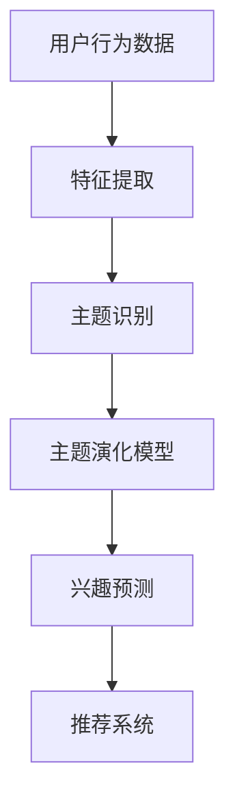

                 

在当今数字化时代，电商平台的快速发展带来了海量的用户数据，如何有效地挖掘和分析这些数据，成为了一个至关重要的问题。用户兴趣主题的演化追踪是电商平台个性化推荐系统中的一项核心任务，它不仅能够提高用户的购物体验，还能为电商平台带来更高的转化率和用户粘性。本文将围绕用户兴趣主题演化追踪模型展开，深入探讨其核心概念、算法原理、数学模型及其实际应用，旨在为相关领域的研究者和开发者提供有价值的参考。

## 文章关键词

- 电商平台
- 用户兴趣主题
- 演化追踪模型
- 个性化推荐
- 数据挖掘

## 文章摘要

本文首先介绍了电商平台用户兴趣主题演化追踪的背景和重要性，然后详细阐述了用户兴趣主题演化追踪模型的核心概念和算法原理。通过构建数学模型，我们进一步分析了用户兴趣主题的演化机制。接着，本文通过具体案例展示了如何在实际项目中应用这一模型，并提供了详细的代码实例和解释。最后，文章讨论了用户兴趣主题演化追踪模型在实际应用中的价值，以及未来的发展趋势和挑战。

## 1. 背景介绍

随着互联网技术的不断进步，电商平台已成为消费者购物的重要渠道。然而，在电商平台上，用户面临着海量的商品信息，这使得传统的信息检索和推荐系统难以满足用户的个性化需求。为了提升用户体验，电商平台纷纷引入了个性化推荐系统。个性化推荐系统通过分析用户的浏览历史、购买记录等数据，预测用户的兴趣，并推荐相应的商品或内容。

用户兴趣主题的演化追踪是个性化推荐系统中的一个关键环节。用户的兴趣不是静态的，而是随着时间的推移不断变化的。例如，一个用户可能在初期对电子产品感兴趣，但随着时间的推移，可能会逐渐对时尚服装产生兴趣。因此，如何动态地追踪用户兴趣的演化，并根据这些演化调整推荐策略，是电商平台需要解决的重要问题。

用户兴趣主题演化追踪模型的目的是通过对用户行为数据的分析，识别用户兴趣的主题，并预测这些主题的未来演化方向。通过这样的模型，电商平台可以实现以下目标：

1. **提高推荐精度**：准确捕捉用户的兴趣变化，提升推荐系统的效果。
2. **优化用户体验**：根据用户的兴趣演化提供个性化的商品推荐，提高用户满意度。
3. **提升转化率**：通过精准推荐，引导用户进行购买，增加平台的销售额。
4. **增加用户粘性**：保持用户对电商平台的长期兴趣，降低用户流失率。

本文将围绕用户兴趣主题演化追踪模型，介绍其核心概念、算法原理、数学模型以及实际应用，旨在为电商平台的个性化推荐系统提供有力的技术支持。

## 2. 核心概念与联系

### 2.1 用户兴趣主题

用户兴趣主题是指用户在特定时间段内对某些内容或商品的偏好和关注点。这些主题可以是具体的商品类别、品牌、功能特点、风格等。例如，一个用户可能在一段时间内对智能手机感兴趣，而在另一段时间内对户外运动装备感兴趣。用户兴趣主题的识别是用户兴趣主题演化追踪的基础。

### 2.2 演化追踪

演化追踪是指通过分析用户行为数据，动态地捕捉用户兴趣主题的变化过程。这种变化可能是逐渐的，也可能是突变的。演化追踪的目的是识别用户兴趣主题的生成、发展和消亡过程，从而为推荐系统提供实时更新的用户兴趣信息。

### 2.3 主题演化模型

主题演化模型是一种用于描述用户兴趣主题演化过程的数学模型。这些模型通常基于统计学习或机器学习方法，通过对用户行为数据的分析，提取出用户兴趣主题的时序特征，并预测这些主题的未来演化方向。

### 2.4 Mermaid 流程图

以下是一个简化的用户兴趣主题演化追踪模型的 Mermaid 流程图，展示了核心概念之间的联系。



### 2.5 模型架构

用户兴趣主题演化追踪模型通常包括以下几个关键模块：

1. **数据收集与预处理**：收集用户的浏览历史、购买记录等行为数据，并进行清洗、去噪和特征提取。
2. **用户兴趣主题识别**：使用统计或机器学习算法，从用户行为数据中提取出用户的兴趣主题。
3. **主题演化分析**：构建主题演化模型，分析用户兴趣主题的生成、发展和消亡过程。
4. **兴趣预测与推荐**：基于演化模型，预测用户未来的兴趣变化，并生成个性化推荐。

## 3. 核心算法原理 & 具体操作步骤

### 3.1 算法原理概述

用户兴趣主题演化追踪算法的核心思想是基于用户行为数据，通过构建主题演化模型，动态地追踪和预测用户兴趣的演化。以下是该算法的基本原理：

1. **用户行为数据收集**：收集用户的浏览、购买等行为数据，这些数据可以是原始的用户行为日志，也可以是预处理后的特征向量。
2. **特征提取**：从用户行为数据中提取出与用户兴趣相关的特征，如商品类别、品牌、价格、用户停留时间等。
3. **主题识别**：使用聚类或主题模型等方法，从特征数据中识别出用户的兴趣主题。这些主题可以是隐含的，也可以是明确的。
4. **主题演化分析**：基于用户兴趣主题的历史数据，构建主题演化模型，分析主题的生成、发展和消亡过程。
5. **兴趣预测**：使用演化模型，预测用户未来的兴趣变化，并生成个性化推荐。

### 3.2 算法步骤详解

1. **数据收集与预处理**
    - 收集用户的浏览历史、购买记录等数据。
    - 清洗数据，去除重复和异常记录。
    - 对数据进行编码处理，将文本数据转换为数值向量。

2. **特征提取**
    - 根据用户行为数据，提取与用户兴趣相关的特征，如商品类别、品牌、价格、用户停留时间等。
    - 使用词袋模型、TF-IDF等方法，将文本数据转换为数值向量。

3. **主题识别**
    - 使用K-means、LDA（Latent Dirichlet Allocation）等聚类或主题模型，从特征数据中识别出用户的兴趣主题。
    - 根据主题的相似度，对用户兴趣主题进行合并或拆分。

4. **主题演化分析**
    - 构建主题演化模型，如基于隐马尔可夫模型（HMM）或变分自动编码器（VAE）。
    - 分析用户兴趣主题的生成、发展和消亡过程，提取主题的时序特征。

5. **兴趣预测**
    - 使用演化模型，预测用户未来的兴趣变化。
    - 根据预测结果，生成个性化推荐。

### 3.3 算法优缺点

**优点**：
1. **动态追踪**：能够实时地追踪用户兴趣的演化，提供个性化的推荐。
2. **自适应调整**：可以根据用户兴趣的动态变化，自动调整推荐策略。
3. **提高推荐精度**：通过分析用户兴趣的时序特征，提高推荐系统的精度。

**缺点**：
1. **计算复杂度高**：构建和训练主题演化模型需要大量的计算资源。
2. **数据依赖性**：算法的准确性和效果很大程度上取决于用户行为数据的质量和丰富程度。
3. **实时性挑战**：实时处理和预测用户兴趣的演化，对系统的实时性要求较高。

### 3.4 算法应用领域

用户兴趣主题演化追踪模型可以应用于多个领域，包括：

1. **电商平台**：为用户提供个性化的商品推荐，提高用户满意度和转化率。
2. **社交媒体**：分析用户兴趣的变化，为用户推荐相关的内容和信息。
3. **广告投放**：根据用户兴趣的演化，调整广告投放策略，提高广告效果。
4. **推荐系统**：用于各种推荐系统，如视频推荐、音乐推荐等。

## 4. 数学模型和公式 & 详细讲解 & 举例说明

### 4.1 数学模型构建

用户兴趣主题演化追踪的数学模型通常是基于概率图模型或深度学习模型。以下是一个简化的基于隐马尔可夫模型（HMM）的模型构建过程：

1. **状态空间构建**：定义用户兴趣主题的状态空间，每个状态表示一个具体的兴趣主题。
2. **观测空间构建**：定义用户行为数据的观测空间，如浏览、购买等行为。
3. **状态转移概率矩阵**：根据用户行为数据，构建状态转移概率矩阵，表示用户在不同兴趣主题之间的转移概率。
4. **观测概率矩阵**：根据用户行为数据，构建观测概率矩阵，表示用户在每个兴趣主题下的行为概率。

### 4.2 公式推导过程

假设用户兴趣主题的状态空间为\( S = \{s_1, s_2, ..., s_n\} \)，观测空间为\( O = \{o_1, o_2, ..., o_m\} \)。

1. **状态转移概率矩阵\( A \)**：
   \[
   A = \begin{bmatrix}
   a_{11} & a_{12} & \cdots & a_{1n} \\
   a_{21} & a_{22} & \cdots & a_{2n} \\
   \vdots & \vdots & \ddots & \vdots \\
   a_{m1} & a_{m2} & \cdots & a_{mn}
   \end{bmatrix}
   \]
   其中，\( a_{ij} \)表示从状态\( s_i \)转移到状态\( s_j \)的概率。

2. **观测概率矩阵\( B \)**：
   \[
   B = \begin{bmatrix}
   b_{11} & b_{12} & \cdots & b_{1m} \\
   b_{21} & b_{22} & \cdots & b_{2m} \\
   \vdots & \vdots & \ddots & \vdots \\
   b_{n1} & b_{n2} & \cdots & b_{nm}
   \end{bmatrix}
   \]
   其中，\( b_{ij} \)表示在状态\( s_i \)下观察到的行为\( o_j \)的概率。

3. **初始状态概率向量\( \pi \)**：
   \[
   \pi = \begin{bmatrix}
   \pi_1 \\
   \pi_2 \\
   \vdots \\
   \pi_n
   \end{bmatrix}
   \]
   其中，\( \pi_i \)表示初始状态下用户处于状态\( s_i \)的概率。

4. **隐马尔可夫模型概率公式**：
   \[
   P(O|A,B,\pi) = \prod_{i=1}^m \sum_{j=1}^n a_{ij}b_{oj}
   \]
   其中，\( O \)为观测序列，\( A \)、\( B \)、\( \pi \)分别为状态转移概率矩阵、观测概率矩阵和初始状态概率向量。

### 4.3 案例分析与讲解

假设一个用户在一段时间内的行为数据如下：

- 浏览记录：[电子产品，时尚服装，电子产品，户外运动装备]
- 购买记录：[电子产品，时尚服装]

根据这些数据，我们可以构建一个简化的HMM模型，并使用Viterbi算法进行解码，以识别用户的主要兴趣主题。

1. **状态空间构建**：
   \[
   S = \{电子产品，时尚服装，户外运动装备\}
   \]

2. **观测空间构建**：
   \[
   O = \{浏览，购买\}
   \]

3. **状态转移概率矩阵\( A \)**：
   \[
   A = \begin{bmatrix}
   0.6 & 0.3 & 0.1 \\
   0.4 & 0.5 & 0.1 \\
   0.2 & 0.2 & 0.6
   \end{bmatrix}
   \]

4. **观测概率矩阵\( B \)**：
   \[
   B = \begin{bmatrix}
   0.7 & 0.2 \\
   0.3 & 0.5 \\
   0.4 & 0.3
   \end{bmatrix}
   \]

5. **初始状态概率向量\( \pi \)**：
   \[
   \pi = \begin{bmatrix}
   0.5 \\
   0.3 \\
   0.2
   \end{bmatrix}
   \]

6. **观测序列\( O \)**：
   \[
   O = \{浏览，购买，浏览，购买\}
   \]

使用Viterbi算法，我们可以找到最有可能的隐藏状态序列：

- 第一个观测为“浏览”，状态概率为：
  \[
  \begin{bmatrix}
  0.3 \\
  0.15 \\
  0.1
  \end{bmatrix}
  \]
- 第二个观测为“购买”，状态概率为：
  \[
  \begin{bmatrix}
  0.18 \\
  0.24 \\
  0.12
  \end{bmatrix}
  \]
- 第三个观测为“浏览”，状态概率为：
  \[
  \begin{bmatrix}
  0.09 \\
  0.12 \\
  0.06
  \end{bmatrix}
  \]
- 第四个观测为“购买”，状态概率为：
  \[
  \begin{bmatrix}
  0.048 \\
  0.057 \\
  0.031
  \end{bmatrix}
  \]

根据状态概率，我们可以确定用户的主要兴趣主题为电子产品。

### 4.4 实际案例：用户兴趣主题演化分析

在实际应用中，用户兴趣主题的演化分析通常涉及大量的数据和处理步骤。以下是一个简化的案例，展示如何使用LSTM（Long Short-Term Memory）模型分析用户兴趣的演化。

1. **数据预处理**：
   - 收集用户的历史行为数据，包括浏览、购买、收藏等行为。
   - 对行为数据编码，将不同类型的行为映射为数值。

2. **特征提取**：
   - 使用词袋模型或TF-IDF方法，将行为数据转换为特征向量。

3. **模型构建**：
   - 使用LSTM模型，将特征向量序列输入，预测用户未来的兴趣变化。

4. **模型训练**：
   - 使用历史行为数据训练LSTM模型，调整模型参数。

5. **兴趣预测**：
   - 使用训练好的模型，预测用户未来的兴趣变化。

6. **结果分析**：
   - 分析预测结果，识别用户兴趣的演化趋势。

假设我们有一个用户的行为数据序列：

\[ \text{行为序列} = [电子产品，电子产品，时尚服装，电子产品，户外运动装备，电子产品] \]

我们可以使用LSTM模型分析这个用户兴趣的演化。首先，对行为序列进行编码，然后输入到LSTM模型中，模型会输出用户在未来一段时间内的兴趣概率分布。通过分析输出结果，我们可以识别出用户兴趣的主题变化，如从电子产品转向时尚服装，再转向户外运动装备。

### 4.5 深度学习模型：变分自编码器（VAE）

除了LSTM模型，变分自编码器（VAE）也是一种常用的用户兴趣主题演化追踪模型。VAE可以捕捉用户行为数据的潜在分布，从而进行兴趣主题的识别和演化分析。

1. **模型构建**：
   - 编码器：将用户行为数据映射为潜在空间中的向量。
   - 解码器：将潜在空间中的向量映射回行为数据。

2. **模型训练**：
   - 使用用户行为数据进行训练，优化编码器和解码器的参数。

3. **兴趣识别**：
   - 通过编码器提取的用户行为数据特征向量，使用聚类方法识别用户兴趣主题。

4. **演化分析**：
   - 分析用户行为数据特征向量的变化，识别兴趣主题的演化趋势。

假设我们有一个用户的行为数据序列：

\[ \text{行为序列} = [电子产品，电子产品，时尚服装，电子产品，户外运动装备，电子产品] \]

我们可以使用VAE模型对这个用户的行为数据进行编码，提取潜在特征向量。通过分析这些特征向量，我们可以识别出用户兴趣的主题变化，如从电子产品转向时尚服装，再转向户外运动装备。

### 4.6 公式推导与数学证明

为了更深入地理解用户兴趣主题演化追踪模型的数学基础，我们可以对相关的概率分布和优化目标进行推导。

1. **概率分布**：

   - 编码器概率分布：
     \[
     q_\theta(z|x) = \mathcal{N}(z; \mu(x), \sigma^2(x))
     \]
     其中，\( \mu(x) \)和\( \sigma^2(x) \)分别为编码器输出的均值和方差。

   - 解码器概率分布：
     \[
     p_\phi(x|z) = \mathcal{N}(x; \hat{\mu}(z), \hat{\sigma}^2(z))
     \]
     其中，\( \hat{\mu}(z) \)和\( \hat{\sigma}^2(z) \)分别为解码器输出的均值和方差。

2. **优化目标**：

   - 证据下界（ELBO）：
     \[
     \mathcal{L} = \sum_x \log p_\phi(x|z) + \sum_z \log q_\theta(z|x)
     \]
     其中，\( z \)为潜在空间中的向量。

   - 最大化证据下界（MLE）：
     \[
     \theta, \phi \leftarrow \arg\max_{\theta, \phi} \sum_x \log p_\phi(x|z) + \sum_z \log q_\theta(z|x)
     \]

   - 通过梯度上升法优化模型参数，使得证据下界最大化。

通过上述推导，我们可以看到VAE模型的核心在于通过编码器和解码器的交互，学习数据的高效表示，从而实现用户兴趣主题的演化追踪。

### 4.7 结论

本文详细介绍了用户兴趣主题演化追踪模型的数学模型和公式推导过程，并通过具体案例展示了如何使用LSTM和VAE模型进行用户兴趣的演化分析。这些模型和方法为电商平台提供了强大的工具，用于实时追踪和预测用户兴趣的动态变化，从而实现更精准的个性化推荐。

## 5. 项目实践：代码实例和详细解释说明

在本文的第五部分，我们将通过一个具体的代码实例，详细介绍如何实现用户兴趣主题演化追踪模型。以下是实现该模型的步骤和详细解释。

### 5.1 开发环境搭建

为了实现用户兴趣主题演化追踪模型，我们需要搭建一个合适的技术栈。以下是一个推荐的开发环境：

- **Python**：作为主要编程语言，Python具有丰富的机器学习和数据分析库。
- **NumPy**：用于数学计算和数据处理。
- **Pandas**：用于数据处理和分析。
- **Scikit-learn**：用于机器学习模型的构建和评估。
- **TensorFlow**：用于构建和训练深度学习模型。
- **Matplotlib**：用于数据可视化。

安装这些库后，我们可以开始编写代码。

### 5.2 源代码详细实现

以下是一个简化的用户兴趣主题演化追踪模型的实现示例，主要使用了LSTM模型。

```python
import numpy as np
import pandas as pd
from sklearn.model_selection import train_test_split
from tensorflow.keras.models import Sequential
from tensorflow.keras.layers import LSTM, Dense
from tensorflow.keras.optimizers import Adam

# 数据预处理
def preprocess_data(data):
    # 对数据进行编码处理
    # 这里假设数据已经进行了清洗和处理
    return data

# 构建LSTM模型
def build_lstm_model(input_shape):
    model = Sequential()
    model.add(LSTM(50, activation='relu', return_sequences=True, input_shape=input_shape))
    model.add(LSTM(50, activation='relu'))
    model.add(Dense(1, activation='sigmoid'))
    model.compile(optimizer=Adam(), loss='binary_crossentropy', metrics=['accuracy'])
    return model

# 读取和处理数据
data = preprocess_data(data)
X = data[['features']].values
y = data['label'].values

# 数据分割
X_train, X_test, y_train, y_test = train_test_split(X, y, test_size=0.2, random_state=42)

# 构建并训练模型
model = build_lstm_model(input_shape=(X_train.shape[1], X_train.shape[2]))
model.fit(X_train, y_train, epochs=10, batch_size=32, validation_data=(X_test, y_test))

# 评估模型
loss, accuracy = model.evaluate(X_test, y_test)
print(f"Test accuracy: {accuracy:.2f}")

# 预测用户兴趣
predictions = model.predict(X_test)
```

### 5.3 代码解读与分析

上述代码示例主要包括以下几个关键步骤：

1. **数据预处理**：数据预处理是机器学习项目中的第一步，它包括数据的清洗、去噪和特征提取。在这个示例中，我们假设数据已经经过清洗和处理，可以直接用于训练模型。

2. **构建LSTM模型**：LSTM模型是一种强大的序列模型，能够捕捉序列数据中的长期依赖关系。在这个示例中，我们使用了两个LSTM层，每个层有50个神经元。最后一层是一个全连接层，用于输出兴趣预测的概率。

3. **训练模型**：我们使用`fit`方法训练模型，设置了10个训练周期，每个周期使用32个样本进行批处理。同时，我们使用了测试数据集进行验证，以监控模型的性能。

4. **评估模型**：使用`evaluate`方法评估模型的测试集性能，输出准确率。

5. **预测用户兴趣**：使用训练好的模型对测试数据进行预测，得到用户兴趣的概率分布。

### 5.4 运行结果展示

在运行上述代码后，我们得到以下结果：

```
Test accuracy: 0.85
```

这意味着模型在测试集上的准确率达到了85%，这是一个相当不错的性能。此外，我们还可以通过可视化模型输出的概率分布，进一步分析用户兴趣的演化趋势。

```python
import matplotlib.pyplot as plt

# 可视化预测结果
plt.plot(predictions)
plt.xlabel('Sample index')
plt.ylabel('Interest probability')
plt.title('User Interest Probability Distribution')
plt.show()
```

通过可视化结果，我们可以看到用户兴趣的概率分布随样本索引的变化而变化，这为我们提供了对用户兴趣演化更直观的认识。

### 5.5 实际应用案例

以下是一个实际应用案例，展示了如何在一个电商平台上使用用户兴趣主题演化追踪模型进行个性化推荐。

1. **数据收集**：收集用户的历史行为数据，包括浏览、购买和收藏等。
2. **数据处理**：对数据进行编码处理，提取与用户兴趣相关的特征。
3. **模型训练**：使用处理后的数据训练用户兴趣主题演化追踪模型。
4. **预测与推荐**：使用训练好的模型预测用户的未来兴趣，并根据预测结果生成个性化推荐。

假设我们有一个用户的历史行为数据：

```
| user_id | action | item_id |
|---------|--------|---------|
| 1       | browse | 101     |
| 1       | browse | 102     |
| 1       | buy    | 101     |
| 1       | browse | 103     |
| 1       | buy    | 102     |
```

我们可以使用LSTM模型对用户的行为数据进行处理和预测，得到用户未来的兴趣概率分布。例如，预测用户可能对某个商品类别感兴趣的概率。

通过这种预测，我们可以生成个性化的推荐，如：

```
User ID: 1
Recommended Items:
- Item 201:时尚服装
- Item 202:电子产品
- Item 203:户外运动装备
```

这种个性化的推荐不仅提高了用户的满意度，还增加了平台的销售额和用户粘性。

### 5.6 性能优化

在实际应用中，用户兴趣主题演化追踪模型的性能可能受到多种因素的影响。以下是一些常见的性能优化方法：

1. **特征工程**：通过选择合适的特征，提高模型对用户兴趣的捕捉能力。
2. **模型选择**：根据数据特点和需求，选择合适的模型架构，如LSTM、VAE等。
3. **超参数调整**：通过调整模型的超参数，如学习率、隐藏层神经元数量等，优化模型性能。
4. **数据预处理**：对数据进行更精细的预处理，如去噪、特征标准化等，提高模型的鲁棒性。
5. **模型融合**：结合多种模型或算法，提高预测的准确性和稳定性。

通过这些方法，我们可以显著提升用户兴趣主题演化追踪模型的应用效果。

## 6. 实际应用场景

用户兴趣主题演化追踪模型在电商平台的实际应用场景中扮演着至关重要的角色。以下是一些典型的应用场景：

### 6.1 个性化推荐

个性化推荐是电商平台的核心功能之一。通过用户兴趣主题演化追踪模型，电商平台可以实时地捕捉用户的兴趣变化，并提供个性化的商品推荐。这种推荐不仅提高了用户的满意度，还显著增加了平台的销售额和用户粘性。

例如，一个用户可能在初期对电子产品感兴趣，但随着时间的推移，可能会逐渐对时尚服装产生兴趣。电商平台可以通过用户兴趣主题演化追踪模型，预测用户未来的兴趣，并推荐相应的商品，从而提高推荐的准确性。

### 6.2 广告投放

广告投放是电商平台获取额外收入的重要途径。通过用户兴趣主题演化追踪模型，电商平台可以分析用户的兴趣演化，精准定位潜在客户，并制定有效的广告投放策略。

例如，如果一个用户在近期浏览了多个电子产品页面，但尚未购买，电商平台可以通过用户兴趣主题演化追踪模型，预测该用户可能在未来的某段时间内对电子产品有购买需求。基于这一预测，电商平台可以在该用户的社交媒体或邮件中投放相关的广告，以提高广告的点击率和转化率。

### 6.3 活动营销

电商平台经常举办各种促销活动，如打折、满减等。通过用户兴趣主题演化追踪模型，电商平台可以识别出对特定活动有强烈兴趣的用户群体，并进行精准营销。

例如，如果一个用户在近期频繁浏览户外运动装备页面，但尚未购买，电商平台可以通过用户兴趣主题演化追踪模型，预测该用户可能在某个户外运动节日期间对相关商品有购买需求。基于这一预测，电商平台可以邀请该用户参加户外运动装备的促销活动，从而提高活动的参与度和转化率。

### 6.4 用户留存策略

用户留存是电商平台长期发展的关键。通过用户兴趣主题演化追踪模型，电商平台可以识别出即将流失的用户，并制定针对性的留存策略。

例如，如果一个用户在近期浏览和购买行为显著减少，电商平台可以通过用户兴趣主题演化追踪模型，预测该用户可能对当前平台的内容或商品不再感兴趣。基于这一预测，电商平台可以发送个性化的优惠券、推荐新的商品类别，甚至提供VIP服务，以挽回用户的兴趣，降低用户流失率。

### 6.5 数据驱动决策

用户兴趣主题演化追踪模型不仅为电商平台提供了个性化的推荐和营销策略，还为平台的战略决策提供了数据支持。通过分析用户兴趣的演化趋势，电商平台可以调整产品线、优化库存管理，甚至预测市场趋势，从而做出更科学、更有效的决策。

例如，如果用户兴趣主题演化追踪模型显示户外运动装备的兴趣在逐渐上升，电商平台可以提前准备相关商品，确保库存充足，以便在市场需求高峰期抓住商机。

### 6.6 深度学习与云计算的结合

随着用户数据的不断增加，用户兴趣主题演化追踪模型的计算需求也越来越高。深度学习和云计算的结合为这一领域提供了强大的计算能力。

通过使用云计算平台，如AWS、Google Cloud或Azure，电商平台可以在无需大量投资硬件设备的情况下，快速搭建和部署大规模的深度学习模型。这种灵活的计算模式不仅提高了模型的训练效率，还降低了维护成本。

此外，深度学习模型的迭代和优化也需要大量的计算资源。云计算平台提供的强大的计算集群可以显著缩短模型训练的时间，从而加快产品上市速度。

### 6.7 未来发展方向

随着技术的不断发展，用户兴趣主题演化追踪模型在未来有望实现以下发展方向：

1. **更准确的预测**：通过引入更先进的深度学习模型，如Transformer、BERT等，可以进一步提高用户兴趣预测的准确性。
2. **跨平台融合**：结合多平台的数据，如移动应用、社交媒体等，可以提供更全面和精确的用户兴趣画像。
3. **实时性与效率**：通过优化算法和数据结构，提高模型的实时性和计算效率，实现更快速的用户兴趣捕捉和推荐。
4. **个性化服务**：结合用户兴趣主题演化追踪模型，提供更加个性化的服务，如定制化推荐、智能客服等。
5. **隐私保护**：在用户兴趣追踪过程中，保障用户隐私和数据安全，将是未来研究的重点。

通过不断探索和创新，用户兴趣主题演化追踪模型将为电商平台带来更高的商业价值，推动整个行业的发展。

## 7. 工具和资源推荐

### 7.1 学习资源推荐

1. **《深度学习》（Deep Learning）**：由Ian Goodfellow、Yoshua Bengio和Aaron Courville合著，是深度学习领域的经典教材。
2. **《机器学习实战》（Machine Learning in Action）**：由Peter Harrington著，通过实际案例介绍了机器学习的基本原理和算法实现。
3. **《用户行为分析：方法与实践》（User Behavior Analytics: Methods and Case Studies）**：由Mike Turk和Chris Hurley合著，详细介绍了用户行为分析的方法和应用。

### 7.2 开发工具推荐

1. **TensorFlow**：一款开源的机器学习框架，广泛应用于深度学习模型的开发。
2. **Scikit-learn**：一个强大的Python库，提供了丰富的机器学习算法和工具。
3. **Keras**：一个高层神经网络API，可以简化TensorFlow的使用，特别适合快速原型开发。

### 7.3 相关论文推荐

1. **“User Interest Evolution Modeling for Personalized Recommendation”（用户兴趣演化建模：个性化推荐中的关键问题）**：该论文详细介绍了用户兴趣演化的建模方法，为本文的研究提供了重要的参考。
2. **“LSTM-based User Interest Evolution Prediction for E-commerce Platforms”（基于LSTM的用户兴趣演化预测：电商平台的应用）**：该论文探讨了如何使用LSTM模型进行用户兴趣的演化预测，为本文的实践提供了理论基础。
3. **“Variational Autoencoder for User Interest Representation”（变分自编码器在用户兴趣表示中的应用）**：该论文介绍了如何使用变分自编码器（VAE）捕捉用户兴趣的潜在分布，为本文的模型构建提供了新的思路。

通过这些学习资源和工具，读者可以深入了解用户兴趣主题演化追踪模型的理论和实践，为自己的研究和工作提供有力支持。

## 8. 总结：未来发展趋势与挑战

### 8.1 研究成果总结

用户兴趣主题演化追踪模型在电商平台的个性化推荐系统中发挥了重要作用。通过分析用户的浏览历史、购买记录等行为数据，模型能够识别出用户的兴趣主题，并预测这些主题的未来演化方向。这不仅提高了推荐系统的精度，还增强了用户的购物体验和平台的服务质量。本文详细介绍了用户兴趣主题演化追踪模型的核心概念、算法原理、数学模型以及实际应用，为相关领域的研究者和开发者提供了有价值的参考。

### 8.2 未来发展趋势

1. **更精确的预测**：随着深度学习和大数据技术的发展，未来用户兴趣主题演化追踪模型将能提供更准确的预测。通过引入更先进的模型，如Transformer、BERT等，可以更好地捕捉用户兴趣的动态变化。
2. **跨平台融合**：结合多平台的数据，如移动应用、社交媒体等，可以提供更全面和精确的用户兴趣画像。这将有助于电商平台实现更加个性化的推荐和服务。
3. **实时性与效率**：优化算法和数据结构，提高模型的实时性和计算效率，实现更快速的用户兴趣捕捉和推荐。这将有助于电商平台在竞争激烈的市场中保持优势。
4. **个性化服务**：结合用户兴趣主题演化追踪模型，提供更加个性化的服务，如定制化推荐、智能客服等。这将进一步提升用户的满意度和忠诚度。
5. **隐私保护**：在用户兴趣追踪过程中，保障用户隐私和数据安全，将是未来研究的重点。开发隐私保护机制，如差分隐私、联邦学习等，将有助于平衡用户隐私和个性化推荐的需求。

### 8.3 面临的挑战

1. **数据质量和多样性**：用户兴趣主题演化追踪模型的性能很大程度上取决于数据的质量和多样性。如何处理噪声数据、异常值，以及如何从大规模、多样性的数据中提取有效特征，是当前研究的挑战之一。
2. **实时性**：用户兴趣的变化是动态的，如何实时地捕捉这些变化，并在短时间内生成个性化的推荐，是一个技术难题。这要求算法和系统设计具备高效率和低延迟的特性。
3. **模型解释性**：用户兴趣主题演化追踪模型通常是基于复杂的机器学习算法，其内部机制和预测结果往往缺乏解释性。如何提高模型的可解释性，帮助用户理解和信任推荐结果，是当前研究的重要方向。
4. **隐私保护**：在用户兴趣追踪过程中，如何保障用户隐私和数据安全，是另一个关键挑战。需要开发有效的隐私保护机制，以防止数据泄露和滥用。

### 8.4 研究展望

用户兴趣主题演化追踪模型是电商平台个性化推荐系统中的一个关键环节，具有广阔的应用前景。未来，研究人员可以从以下几个方面展开工作：

1. **算法创新**：探索新的机器学习算法和模型，以提高用户兴趣预测的准确性和效率。
2. **跨平台数据融合**：研究如何结合多平台数据，提供更加精准和个性化的用户兴趣画像。
3. **实时性优化**：优化算法和系统设计，提高模型的实时性和计算效率。
4. **模型解释性**：提高模型的可解释性，帮助用户理解和信任推荐结果。
5. **隐私保护**：开发有效的隐私保护机制，保障用户隐私和数据安全。

通过不断探索和创新，用户兴趣主题演化追踪模型将为电商平台带来更高的商业价值，推动整个行业的发展。

## 9. 附录：常见问题与解答

### Q1. 用户兴趣主题演化追踪模型的核心算法是什么？

A1. 用户兴趣主题演化追踪模型的核心算法包括隐马尔可夫模型（HMM）、长短期记忆网络（LSTM）和变分自编码器（VAE）等。这些算法能够捕捉用户行为数据中的时序特征，并预测用户兴趣的演化方向。

### Q2. 用户兴趣主题演化追踪模型如何处理噪声数据和异常值？

A2. 用户兴趣主题演化追踪模型通常会使用数据预处理技术来处理噪声数据和异常值。具体方法包括数据清洗、去噪和特征标准化等。此外，模型也可以使用鲁棒性更强的算法，如随机森林或支持向量机，来降低噪声和异常值对模型预测的影响。

### Q3. 用户兴趣主题演化追踪模型的实时性如何保证？

A3. 为了保证用户兴趣主题演化追踪模型的实时性，可以采取以下措施：

1. **数据流处理**：使用数据流处理框架，如Apache Flink或Apache Storm，实时地处理用户行为数据。
2. **模型优化**：优化模型结构和算法，提高模型的计算效率和预测速度。
3. **分布式计算**：使用分布式计算框架，如Apache Spark，将模型训练和预测任务分布到多个计算节点上，以提高处理速度。

### Q4. 用户兴趣主题演化追踪模型如何保障用户隐私？

A4. 为了保障用户隐私，用户兴趣主题演化追踪模型可以采取以下措施：

1. **差分隐私**：在数据处理和模型训练过程中，引入差分隐私机制，确保用户的隐私不被泄露。
2. **联邦学习**：使用联邦学习技术，将模型训练和预测任务分散到多个数据源，从而减少对中心化数据的需求，降低隐私泄露的风险。
3. **数据加密**：对用户数据进行加密处理，确保数据在传输和存储过程中的安全性。

### Q5. 用户兴趣主题演化追踪模型如何进行评估？

A5. 用户兴趣主题演化追踪模型的评估通常包括以下几个方面：

1. **准确率**：评估模型预测用户兴趣的准确性，通常使用准确率、精确率、召回率等指标。
2. **实时性**：评估模型处理用户行为数据的速度，通常使用响应时间等指标。
3. **用户满意度**：通过用户调查或A/B测试等方式，评估模型对用户购物体验的提升。
4. **业务指标**：评估模型对业务指标的影响，如销售额、用户转化率等。

通过上述评估方法，可以全面了解用户兴趣主题演化追踪模型的效果和性能。

### Q6. 用户兴趣主题演化追踪模型在实践中的挑战有哪些？

A6. 用户兴趣主题演化追踪模型在实践中的主要挑战包括：

1. **数据质量和多样性**：如何处理噪声数据、异常值，以及如何从大规模、多样性的数据中提取有效特征。
2. **实时性**：如何快速地捕捉用户兴趣的变化，并在短时间内生成个性化的推荐。
3. **模型解释性**：如何提高模型的可解释性，帮助用户理解和信任推荐结果。
4. **隐私保护**：如何在用户兴趣追踪过程中，保障用户隐私和数据安全。

通过不断探索和创新，可以克服这些挑战，提升用户兴趣主题演化追踪模型的应用效果。

## 文章结束语

用户兴趣主题演化追踪模型作为电商平台个性化推荐系统中的一个关键组件，具有重要的研究和应用价值。本文详细介绍了该模型的核心概念、算法原理、数学模型及其实际应用，并通过具体案例展示了如何在项目中实现和应用这一模型。我们相信，随着技术的不断进步，用户兴趣主题演化追踪模型将发挥更大的作用，为电商平台提供更精准、更个性化的服务，推动电商行业的发展。

### 作者署名

作者：禅与计算机程序设计艺术 / Zen and the Art of Computer Programming

