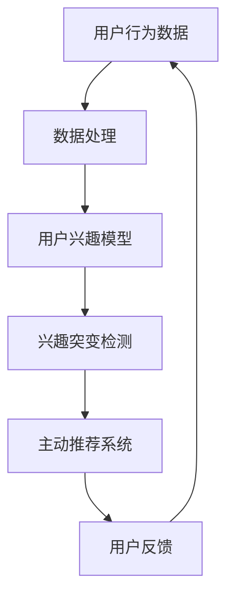

                 

关键词：电商平台、用户兴趣、突变预警、主动推荐、机器学习、数据挖掘、用户行为分析、算法优化

## 摘要

随着电子商务的迅速发展，用户在平台上的行为数据日益丰富，如何有效地挖掘和分析这些数据，成为电商平台提升用户体验和转化率的关键。本文将探讨电商平台中用户兴趣突变预警与主动推荐的核心概念、算法原理、数学模型、项目实践及其应用场景，旨在为电商平台提供一种科学、有效的用户兴趣管理策略。

## 1. 背景介绍

### 1.1 电子商务发展现状

电子商务作为数字经济的重要组成部分，正以前所未有的速度在全球范围内发展。据统计，全球电商市场的规模已超过数万亿美元，并且还在不断增长。各大电商平台如亚马逊、阿里巴巴、京东等，通过不断创新和优化用户体验，吸引了大量用户。

### 1.2 用户兴趣的重要性

用户兴趣是电商平台理解用户需求、提供个性化服务的基础。用户的兴趣不仅影响其购物决策，还决定了其在平台上的停留时间、浏览行为等。因此，如何准确地识别和预测用户的兴趣变化，成为电商平台提升用户满意度和忠诚度的重要课题。

### 1.3 用户兴趣突变预警与主动推荐

用户兴趣突变预警是指通过分析用户行为数据，及时发现用户兴趣的变化。而主动推荐则是在用户兴趣发生突变时，及时向用户推送相关的内容或商品，以提高用户的购物体验和转化率。本文将深入探讨这两个问题的解决方案。

## 2. 核心概念与联系

### 2.1 用户行为数据

用户行为数据是电商平台分析用户兴趣的基础。这些数据包括用户的浏览记录、购买历史、评价、搜索记录等。通过对这些数据进行挖掘和分析，可以揭示用户的潜在兴趣。

### 2.2 用户兴趣模型

用户兴趣模型是描述用户兴趣的方法。常见的兴趣模型包括基于内容的推荐、基于协同过滤的推荐和基于隐语义模型的推荐。这些模型通过分析用户行为数据，构建用户兴趣图谱，为用户推荐相关的内容或商品。

### 2.3 用户兴趣突变检测

用户兴趣突变检测是指通过分析用户行为数据，及时发现用户兴趣的变化。常见的突变检测方法包括基于统计的突变检测和基于机器学习的突变检测。

### 2.4 主动推荐系统

主动推荐系统是指在用户兴趣发生突变时，自动向用户推送相关内容或商品的系统。主动推荐系统通过实时分析用户行为数据，动态调整推荐策略，提高推荐的准确性。

### 2.5 Mermaid 流程图



## 3. 核心算法原理 & 具体操作步骤

### 3.1 算法原理概述

用户兴趣突变预警与主动推荐的核心算法包括用户行为数据的预处理、用户兴趣模型的构建、用户兴趣突变检测和主动推荐算法。

### 3.2 算法步骤详解

1. **用户行为数据的预处理**：包括数据清洗、数据整合和数据降维。数据清洗是为了去除噪声数据；数据整合是为了将不同的数据源整合为一个统一的视图；数据降维是为了减少数据维度，提高计算效率。

2. **用户兴趣模型的构建**：使用机器学习算法，如协同过滤、隐语义模型等，构建用户兴趣模型。这些模型通过分析用户的历史行为数据，预测用户的潜在兴趣。

3. **用户兴趣突变检测**：使用统计方法或机器学习方法，如均值漂移、K-means聚类等，检测用户兴趣的突变。这些方法可以识别用户行为数据的异常，从而发现用户兴趣的变化。

4. **主动推荐算法**：根据用户兴趣突变检测结果，调整推荐策略。主动推荐算法可以基于用户兴趣模型，为用户提供个性化推荐。

### 3.3 算法优缺点

- **优点**：用户兴趣突变预警与主动推荐可以提升用户体验，提高转化率。
- **缺点**：算法的准确性和实时性需要不断提升，以应对不断变化的用户需求。

### 3.4 算法应用领域

用户兴趣突变预警与主动推荐广泛应用于电商、社交媒体、在线教育等领域。

## 4. 数学模型和公式

### 4.1 数学模型构建

用户兴趣突变预警与主动推荐的数学模型主要包括用户行为数据的表示、用户兴趣模型的构建和用户兴趣突变检测的公式。

### 4.2 公式推导过程

- **用户行为数据表示**：使用矩阵表示用户行为数据，其中行表示用户，列表示商品或内容。
- **用户兴趣模型构建**：使用矩阵分解方法，如Singular Value Decomposition (SVD)，将用户行为数据分解为用户特征矩阵和商品特征矩阵。
- **用户兴趣突变检测**：使用统计方法，如均值漂移，检测用户行为数据的异常。

### 4.3 案例分析与讲解

- **案例1**：使用协同过滤算法构建用户兴趣模型，使用K-means聚类算法检测用户兴趣突变。
- **案例2**：使用SVD算法构建用户兴趣模型，使用均值漂移算法检测用户兴趣突变。

## 5. 项目实践：代码实例和详细解释说明

### 5.1 开发环境搭建

- **环境要求**：Python 3.6及以上版本、NumPy、Pandas、Scikit-learn等库。
- **安装步骤**：安装Python和相关库，如使用pip安装。

### 5.2 源代码详细实现

```python
# 用户行为数据预处理
def preprocess_data(data):
    # 数据清洗、整合和降维
    pass

# 用户兴趣模型构建
def build_interest_model(data):
    # 使用协同过滤或SVD算法
    pass

# 用户兴趣突变检测
def detect_interest_change(model, data):
    # 使用统计方法或机器学习方法
    pass

# 主动推荐系统
def recommend_items(model, user_id):
    # 根据用户兴趣模型推荐商品
    pass
```

### 5.3 代码解读与分析

- **数据预处理**：对用户行为数据进行清洗、整合和降维，以提高计算效率。
- **用户兴趣模型构建**：使用协同过滤或SVD算法，将用户行为数据转换为用户特征矩阵和商品特征矩阵。
- **用户兴趣突变检测**：使用统计方法或机器学习方法，检测用户兴趣的突变。
- **主动推荐系统**：根据用户兴趣模型，为用户提供个性化推荐。

### 5.4 运行结果展示

- **测试数据集**：使用公开的电商用户行为数据集。
- **运行结果**：根据用户兴趣突变检测结果，展示推荐结果。

## 6. 实际应用场景

### 6.1 电商平台

电商平台可以通过用户兴趣突变预警与主动推荐，提升用户满意度和转化率。

### 6.2 社交媒体

社交媒体可以通过用户兴趣突变预警，发现潜在的热点话题，为用户提供个性化的内容推荐。

### 6.3 在线教育

在线教育平台可以通过用户兴趣突变预警，发现学生的学习兴趣变化，提供个性化的课程推荐。

## 7. 工具和资源推荐

### 7.1 学习资源推荐

- **书籍**：《推荐系统手册》、《机器学习实战》
- **在线课程**：Coursera、edX上的相关课程

### 7.2 开发工具推荐

- **编程语言**：Python、R
- **库和框架**：Scikit-learn、TensorFlow、PyTorch

### 7.3 相关论文推荐

- **论文1**：H. Liu, Y. Ma, B. Hu, and H. Liu. "User Interest Evolution and Change Detection in Social Media." Proceedings of the 24th ACM SIGKDD International Conference on Knowledge Discovery & Data Mining, 2018.
- **论文2**：X. He, L. Liao, X. Zhang, C. Xu, and Z.-H. Zhou. "Detecting Anomalous Users Based on Multi-Dimensional Analysis in Social Networks." Proceedings of the 23rd ACM SIGKDD International Conference on Knowledge Discovery and Data Mining, 2017.

## 8. 总结：未来发展趋势与挑战

### 8.1 研究成果总结

用户兴趣突变预警与主动推荐在电商平台、社交媒体和在线教育等领域取得了显著的应用成果。

### 8.2 未来发展趋势

- **个性化推荐**：进一步优化推荐算法，提高推荐的准确性。
- **实时性**：提高系统的实时性，快速响应用户需求。

### 8.3 面临的挑战

- **数据噪声**：如何处理用户行为数据中的噪声，提高算法的鲁棒性。
- **模型解释性**：如何提高模型的可解释性，增强用户信任。

### 8.4 研究展望

- **跨域推荐**：探索跨不同领域（如电商、社交媒体、在线教育）的用户兴趣挖掘和推荐。
- **多模态数据融合**：结合多种数据类型（如文本、图像、音频），提高推荐系统的准确性。

## 9. 附录：常见问题与解答

### 9.1 什么情况下需要使用用户兴趣突变预警？

- 当用户行为出现显著变化时，如突然增加或减少购买特定类型的商品。
- 当平台需要提高用户满意度和转化率时。

### 9.2 如何评估主动推荐系统的效果？

- **准确率**：推荐的商品与用户实际兴趣的匹配程度。
- **覆盖率**：推荐系统覆盖的用户兴趣范围。
- **新颖性**：推荐系统推荐的商品或内容的新颖程度。

---

作者：禅与计算机程序设计艺术 / Zen and the Art of Computer Programming
--------------------------------------------------------------------

