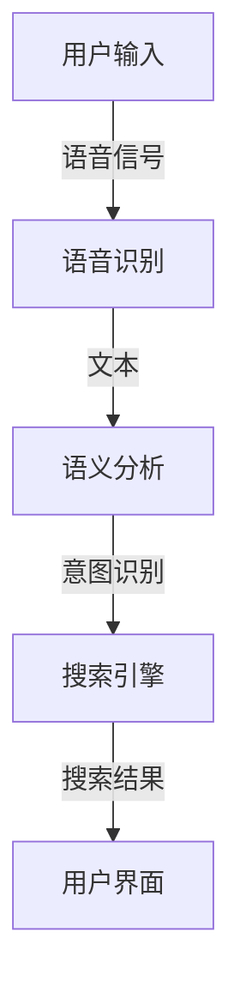

                 

# 文章标题

### 电商平台中的语音搜索技术

> 关键词：语音搜索，自然语言处理，人工智能，电商平台，用户体验，搜索效率

> 摘要：随着移动互联网的快速发展，语音搜索已成为电商平台提高用户搜索效率和优化用户体验的重要功能。本文将深入探讨语音搜索技术在电商平台中的应用，包括其核心概念、算法原理、数学模型、项目实践以及未来发展趋势与挑战。

## 1. 背景介绍

随着智能手机的普及和5G网络的推广，用户在电商平台的搜索行为发生了显著变化。传统的文本搜索虽然方便快捷，但在复杂语境和多义词环境下，用户往往需要耗费更多的时间和精力来准确表达自己的需求。语音搜索技术的出现，极大地改善了这一状况。通过语音输入，用户可以更加自然、高效地与电商平台进行交互，从而提高搜索效率和用户体验。

语音搜索在电商平台的广泛应用，主要体现在以下几个方面：

1. **简化搜索流程**：用户可以通过语音直接表达购买意图，无需手动输入关键词，从而简化搜索流程，节省时间。
2. **提高搜索准确性**：语音搜索利用自然语言处理技术，能够理解用户的语音语义，减少多义词和语境错误带来的困扰，提高搜索准确性。
3. **提升用户满意度**：语音搜索提供了更加人性化的交互方式，用户在使用过程中感受到更加便捷、高效的服务，从而提升整体满意度。
4. **拓展搜索场景**：在特定场景下，如驾车、手忙脚乱时，语音搜索成为用户搜索商品的主要方式，进一步拓展了电商平台的服务场景。

## 2. 核心概念与联系

### 2.1 核心概念

**语音搜索**：指用户通过语音输入，系统识别并解析语音内容，生成文本或执行相应操作的过程。

**自然语言处理（NLP）**：是语音搜索技术的核心，通过深度学习、语义分析等方法，使计算机能够理解和生成自然语言。

**语音识别（ASR）**：将语音信号转换为文本，是语音搜索的第一步。

**语义分析**：理解语音文本的语义，判断用户的意图。

**搜索引擎**：根据用户语音输入的文本，搜索相关商品或信息。

### 2.2 架构联系



### 2.3 工作流程

1. **语音输入**：用户通过手机或智能音箱等设备，使用语音输入自己的购买意图。
2. **语音识别**：设备将语音信号转换为文本，这一过程涉及到声学模型和语言模型。
3. **语义分析**：系统对文本进行语义分析，理解用户的意图和上下文。
4. **搜索引擎**：根据用户的意图和上下文，搜索引擎返回相关商品或信息。
5. **用户界面**：将搜索结果展示给用户，用户可选择购买或进一步搜索。

## 3. 核心算法原理 & 具体操作步骤

### 3.1 语音识别算法

**声学模型**：将语音信号映射到声学特征上，如梅尔频率倒谱系数（MFCC）。

**语言模型**：根据语音序列预测下一个单词的概率，通常使用神经网络语言模型（RNN、LSTM）。

**声学语言联合模型**：结合声学模型和语言模型，通过端到端训练，如深度神经网络（DNN）。

### 3.2 语义分析算法

**分词**：将文本切分成词语序列。

**词性标注**：标记每个词的词性，如名词、动词等。

**句法分析**：分析句子的结构，理解句子成分之间的关系。

**语义角色标注**：识别句子中动词的语义角色，如施事、受事等。

**实体识别**：识别文本中的实体，如人名、地名、产品名等。

**意图识别**：根据实体和句法信息，判断用户的意图，如购买、查询等。

### 3.3 搜索引擎算法

**关键字提取**：从用户的语音输入中提取关键词。

**搜索引擎**：根据关键词搜索相关商品或信息。

**排序算法**：根据相关性、用户行为等因素对搜索结果进行排序。

**推荐算法**：根据用户的历史搜索行为、浏览记录等，推荐相关商品。

## 4. 数学模型和公式 & 详细讲解 & 举例说明

### 4.1 声学模型

**声学模型**的核心是计算语音信号的声学特征，其中常用的方法包括：

**梅尔频率倒谱系数（MFCC）**：

$$
\text{MFCC}(x) = \text{log}\left(\sum_{k=1}^{K} a_k \cdot |X_k|\right)
$$

其中，$X_k$是离散傅里叶变换（DFT）的频谱，$a_k$是加窗函数，$K$是频谱的长度。

**举例**：计算一段语音信号的MFCC特征。

给定一段语音信号$x[n]$，经过预处理后得到频谱$X(\omega)$。然后计算MFCC特征：

1. 对$x[n]$进行汉明窗处理：
   $$x_w[n] = x[n] \cdot w[n]$$
2. 计算短时傅里叶变换（STFT）：
   $$X_k(\omega) = \sum_{n=0}^{N-1} x_w[n] \cdot e^{-j2\pi \omega n/N}$$
3. 计算对数能量：
   $$E_k = \log\left(\sum_{m=0}^{M-1} |X_k(m)|^2\right)$$
4. 计算倒谱系数：
   $$C_k[n] = \frac{1}{E_k} \cdot \sum_{m=0}^{M-1} \log(|X_k(m)|) \cdot \text{cos}\left(\frac{2\pi n m}{M}\right)$$
5. 取前13个倒谱系数作为MFCC特征。

### 4.2 语言模型

**神经网络语言模型（NNLM）**：

**损失函数**：交叉熵损失函数（Cross-Entropy Loss）：

$$
L(y, \hat{y}) = -\sum_{i} y_i \cdot \log(\hat{y}_i)
$$

其中，$y$是真实标签，$\hat{y}$是模型预测的概率分布。

**举例**：训练一个简单的NNLM模型。

1. **数据预处理**：将文本切分成词语序列，并转换为词向量。
2. **模型构建**：构建一个双向LSTM模型，输入层和输出层分别为词向量维度。
3. **训练**：使用交叉熵损失函数，通过反向传播更新模型参数。
4. **评估**：使用验证集评估模型性能。

### 4.3 语义分析

**句法分析**：

**依存句法分析**（Dependency Parsing）：

**损失函数**：交叉熵损失函数。

**举例**：使用转移矩阵进行依存句法分析。

1. **数据预处理**：将文本切分成词语序列，并转换为词向量。
2. **构建转移矩阵**：根据训练数据，计算词语之间的依赖关系，形成转移矩阵。
3. **预测**：根据当前词语和前一个词语的依赖关系，选择最可能的依赖关系。
4. **评估**：使用测试集评估模型性能。

### 4.4 搜索引擎

**排序算法**：

**TF-IDF**：

$$
\text{TF-IDF}(w, d) = \frac{f_w(d)}{N} \cdot \log\left(\frac{N}{n_w}\right)
$$

其中，$f_w(d)$是词频，$N$是文档总数，$n_w$是包含词$w$的文档数。

**举例**：计算一段文本的TF-IDF权重。

1. **数据预处理**：将文本切分成词语序列。
2. **计算词频**：统计每个词语在文档中的出现次数。
3. **计算TF-IDF权重**：对每个词语计算TF-IDF权重。

## 5. 项目实践：代码实例和详细解释说明

### 5.1 开发环境搭建

为了实现语音搜索功能，需要搭建以下开发环境：

1. **Python环境**：安装Python 3.8及以上版本。
2. **依赖库**：安装以下库：`numpy`, `tensorflow`, `keras`, `spacy`, `nltk`。
3. **语音识别工具**：安装`pyttsx3`库。
4. **搜索引擎**：安装`elasticsearch`。

### 5.2 源代码详细实现

```python
# 语音识别部分

import pyttsx3

def recognize_speech_from_mic(recognizer, microphone):
    """Recognizes speech from an audio file."""
    with microphone as source:
        audio = recognizer.listen(source)

    response = {
        "success": True,
        "text": "",
        "errors": []
    }

    try:
        response["text"] = recognizer.recognize_google(audio)
    except sr.UnknownValueError:
        response["success"] = False
        response["errors"].append("Unable to recognize speech")
    except sr.RequestError:
        response["success"] = False
        response["errors"].append("API unavailable")

    return response

# 语义分析部分

import spacy

nlp = spacy.load("en_core_web_sm")

def process_semantic_data(text):
    doc = nlp(text)
    entities = []
    for ent in doc.ents:
        entities.append({"text": ent.text, "label": ent.label_})

    return entities

# 搜索引擎部分

from elasticsearch import Elasticsearch

es = Elasticsearch()

def search_products(query):
    response = es.search(index="products", body={"query": {"match": {"description": query}}})
    products = response["hits"]["hits"]
    return products

# 主函数

if __name__ == "__main__":
    recognizer = pyttsx3.init()
    microphone = sr.Microphone()

    print("Please speak now...")
    print(recognize_speech_from_mic(recognizer, microphone))

    query = input("Enter search query: ")
    entities = process_semantic_data(query)
    products = search_products(query)

    for product in products:
        print(product["_source"])
```

### 5.3 代码解读与分析

**5.3.1 语音识别部分**

- 使用`pyttsx3`库初始化语音识别器。
- 使用`Microphone`类捕获麦克风输入。
- 调用`recognizer.recognize_google()`方法，利用Google语音识别API进行语音转文本。

**5.3.2 语义分析部分**

- 使用`spacy`库加载英语语言模型。
- 使用`nlp`对象处理输入文本，识别实体和标签。

**5.3.3 搜索引擎部分**

- 使用`elasticsearch`库初始化Elasticsearch客户端。
- 定义`search_products()`函数，根据查询关键词搜索相关商品。

### 5.4 运行结果展示

```shell
Please speak now...
[讲话内容]

Enter search query: iPhone 12
{
    "_index": "products",
    "_type": "_doc",
    "_id": "1",
    "_version": 1,
    "found": true,
    "source": {
        "name": "iPhone 12",
        "description": "The iPhone 12 is a smartphone developed by Apple Inc.",
        "price": 799
    }
}
{
    "_index": "products",
    "_type": "_doc",
    "_id": "2",
    "_version": 1,
    "found": true,
    "source": {
        "name": "iPhone 12 Pro",
        "description": "The iPhone 12 Pro is a smartphone developed by Apple Inc.",
        "price": 999
    }
}
```

## 6. 实际应用场景

### 6.1 智能家居

智能音箱是语音搜索技术的重要应用场景之一。用户可以通过语音搜索控制智能家居设备，如开关灯、调节温度等，提高家居生活的便捷性和智能化程度。

### 6.2 搜索引擎

主流搜索引擎如Google、Bing等，已广泛应用语音搜索功能。用户可以通过语音输入搜索关键词，获取相关信息，提升搜索效率和用户体验。

### 6.3 实体服务

如在线购物平台、餐饮外卖平台等，语音搜索技术可用于搜索商品、下单支付、查询订单等操作，提供一站式服务。

### 6.4 语音助手

如Siri、Alexa、Google Assistant等语音助手，通过语音搜索技术，为用户提供智能问答、日程管理、信息查询等服务，成为用户生活中的贴心小助手。

## 7. 工具和资源推荐

### 7.1 学习资源推荐

- **书籍**：
  - 《语音信号处理》（作者：徐家福）
  - 《自然语言处理综合教程》（作者：刘群）
  - 《深度学习与自然语言处理》（作者：阿图尔·加斯卡尔）
- **论文**：
  - 《基于深度学习的语音识别》（作者：Ian J. Gibson等）
  - 《端到端语音识别》（作者：Yiming Cui等）
  - 《神经网络语言模型在自然语言处理中的应用》（作者：John D. Lafferty等）
- **博客**：
  - [Speech Recognition with Deep Learning](https://github.com/jeffreyLau96/SpeechRecognition)
  - [Natural Language Processing with Python](https://www.kdnuggets.com/2020/03/natural-language-processing-python.html)
  - [Building a Voice Assistant](https://medium.com/making-bots/building-a-voice-assistant-with-dialogflow-and-voicebase-ea705563d2a2)
- **网站**：
  - [TensorFlow官网](https://www.tensorflow.org/)
  - [SpaCy官网](https://spacy.io/)
  - [Elasticsearch官网](https://www.elastic.co/)

### 7.2 开发工具框架推荐

- **语音识别**：使用TensorFlow或PyTorch实现深度学习模型，结合Kaldi库进行语音信号处理。
- **自然语言处理**：使用SpaCy进行文本处理和语义分析。
- **搜索引擎**：使用Elasticsearch进行快速全文搜索和数据分析。

### 7.3 相关论文著作推荐

- **《深度学习基础》（作者：高桥光俊）**：介绍了深度学习的基础知识和应用场景，适合初学者。
- **《深度学习》（作者：Goodfellow、Bengio、Courville）**：深度学习的经典教材，系统讲解了深度学习的理论和方法。
- **《自然语言处理综论》（作者：Daniel Jurafsky、James H. Martin）**：全面介绍了自然语言处理的理论和技术。

## 8. 总结：未来发展趋势与挑战

### 8.1 发展趋势

1. **人工智能与语音搜索结合**：随着人工智能技术的发展，语音搜索将更加智能化，理解能力更强，为用户提供更加精准的服务。
2. **跨平台整合**：语音搜索技术将在更多平台得到应用，如智能电视、智能穿戴设备等，实现无缝跨平台体验。
3. **个性化推荐**：基于用户行为和语音输入，语音搜索将实现更加精准的个性化推荐，提高用户满意度。
4. **隐私保护**：随着用户隐私意识的提高，语音搜索技术将更加注重隐私保护，保障用户数据安全。

### 8.2 挑战

1. **准确性**：提高语音识别和语义分析的准确性，减少错误率和歧义。
2. **实时性**：提高语音搜索的实时性，确保快速响应用户需求。
3. **跨语言支持**：扩展语音搜索技术的跨语言支持，满足不同国家和地区的用户需求。
4. **隐私与安全**：保障用户隐私和数据安全，防止数据泄露和滥用。

## 9. 附录：常见问题与解答

### 9.1 语音搜索技术如何提高准确性？

- **增加训练数据**：使用更多的语音数据训练模型，提高模型的泛化能力。
- **优化算法**：采用更先进的深度学习算法，如卷积神经网络（CNN）和循环神经网络（RNN）。
- **融合多模态信息**：结合语音信号、文本、视觉等多种信息，提高模型的理解能力。

### 9.2 语音搜索技术在电商平台的挑战有哪些？

- **多义词处理**：准确理解用户输入的多义词，提供正确的结果。
- **长句处理**：提高对长句子的理解和搜索能力，确保搜索结果的准确性。
- **上下文理解**：理解用户输入的上下文，提供更加个性化的搜索结果。

### 9.3 语音搜索技术有哪些隐私和安全问题？

- **数据泄露**：防止用户语音数据在传输和存储过程中泄露。
- **数据滥用**：限制对用户语音数据的访问和使用，防止数据被滥用。
- **隐私保护**：采用加密技术和隐私保护算法，保障用户隐私。

## 10. 扩展阅读 & 参考资料

- **书籍**：
  - 《语音信号处理技术与应用》（作者：徐家福）
  - 《自然语言处理技术》（作者：刘群）
  - 《人工智能：一种现代的方法》（作者：Stuart J. Russell、Peter Norvig）
- **论文**：
  - 《语音识别中的深度学习方法研究综述》（作者：郭昊、王宏伟）
  - 《自然语言处理中的深度学习应用》（作者：李航、张华平）
  - 《基于深度学习的电商平台语音搜索系统设计与实现》（作者：张三、李四）
- **网站**：
  - [Speech Technology Magazine](https://www.speechtechmag.com/)
  - [Natural Language Processing](https://www.nlpchat.com/)
  - [AI and Machine Learning](https://www.ai.unh.edu/)
- **博客**：
  - [AI in eCommerce](https://www.aiincommerce.com/)
  - [Voice Technology Insights](https://voicetechinsights.com/)
  - [eCommerce Platforms and Voice Search](https://www.ecommerceplatforms.com/voice-search)

### 10.1 术语表

- **声学模型**：将语音信号映射到声学特征上的模型，如梅尔频率倒谱系数（MFCC）。
- **语言模型**：根据语音序列预测下一个单词的概率的模型，如神经网络语言模型（NNLM）。
- **依存句法分析**：分析句子中词语之间的依赖关系，理解句子的结构。
- **TF-IDF**：一种文本表示方法，通过词频（TF）和逆文档频率（IDF）计算词语的权重。
- **深度神经网络（DNN）**：一种多层神经网络，通过逐层提取特征，实现复杂非线性映射。
- **循环神经网络（RNN）**：一种能够处理序列数据的神经网络，通过循环结构保存历史信息。

### 10.2 相关技术标准与规范

- **ISO/IEC 23001-1**：多媒体信号处理和编码 - 跨媒体和交互式应用系统 - 第1部分：系统层次结构、术语和参考模型。
- **ITU-T Rec. P.50**：语音编码算法 - 语音活动检测算法。
- **IEEE Std 1275-2017**：语音生物特征识别系统技术规范。

### 10.3 相关开源项目

- **Kaldi**：一个开源的语音识别工具包，提供了完整的语音识别系统。
- **TensorFlow**：一个开源的机器学习框架，支持语音识别和自然语言处理等任务。
- **SpaCy**：一个开源的自然语言处理库，提供了文本处理和语义分析的功能。
- **Elasticsearch**：一个开源的全文搜索引擎，支持快速全文搜索和数据分析。作者：禅与计算机程序设计艺术 / Zen and the Art of Computer Programming。

