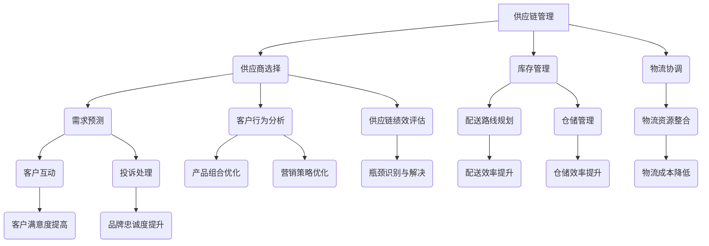

                 

### 背景介绍

在当今数字化商业环境中，电商平台作为连接消费者与供应商的桥梁，扮演着至关重要的角色。随着互联网技术的快速发展，电商平台逐渐成为企业拓展市场、提升品牌知名度的重要渠道。为了满足日益增长的消费者需求，电商平台必须不断提升自身的供给能力，确保能够及时、高效地提供多样化的商品和服务。

供给能力，简单来说，就是电商平台能够提供的商品和服务总量。这包括商品种类、库存量、配送速度等多个方面。一个强大的供给能力不仅能提高消费者的购物体验，还能增强平台的竞争力。然而，随着竞争的加剧和消费者需求的多样化，传统电商平台的供给能力面临诸多挑战。

首先，传统电商平台往往依赖于现有的供应链体系，这一体系可能存在效率低、响应慢等问题，难以快速适应市场变化。其次，随着新品牌的崛起和消费者对个性化和定制化需求的增加，电商平台需要与更多的供应商合作，以满足不同消费者的需求。这不仅要求电商平台具备强大的供应链管理能力，还需要具备与不同类型供应商合作的能力。

此外，电商平台还需要应对库存管理、物流配送、售后服务等环节的挑战。例如，库存管理需要实时监控和预测商品需求，以确保商品的库存充足，避免因缺货而损失订单；物流配送则需要优化配送路线和配送时效，以提高配送效率；售后服务则需要建立高效、便捷的反馈和解决机制，以提高客户满意度。

综上所述，提升供给能力已经成为电商平台发展的关键。本文将围绕电商平台供给能力的提升，探讨与新品牌和供应商的合作策略，分析其核心概念和操作步骤，并举例说明其实际应用效果。

## 1.1 电商平台供给能力的现状

当前，电商平台的供给能力正面临着前所未有的挑战和机遇。随着消费者需求的多样化，电商平台需要不断提升供给能力，以满足消费者对于商品种类、质量、配送速度等方面的更高要求。然而，现实情况是，传统电商平台的供给能力在很多方面仍存在瓶颈。

首先，从商品种类来看，大多数电商平台已经能够提供丰富的商品种类，覆盖了从日用品到奢侈品等多个领域。然而，对于一些小众商品或特殊需求，传统电商平台往往无法满足。这主要是因为传统电商平台的供应链体系相对封闭，难以快速接入新的供应商和商品。

其次，在库存管理方面，传统电商平台通常采用批量采购和库存存储的方式，这虽然能够降低采购成本，但也带来了库存积压和资金占用的问题。在市场需求波动较大的情况下，传统电商平台很难实现精准的库存管理，从而影响了商品供应的及时性和准确性。

在物流配送方面，传统电商平台通常与第三方物流公司合作，虽然这种模式在一定程度上降低了平台的物流成本，但也存在配送时效不稳定、配送质量不可控等问题。此外，随着消费者对配送速度的要求越来越高，电商平台需要不断提升物流配送的效率，以满足消费者的期望。

售后服务也是影响电商平台供给能力的重要因素。传统的售后服务体系往往不够完善，客户反馈和处理的速度较慢，难以提供及时、高效的售后服务。这不仅会影响消费者的购物体验，还会影响平台的品牌形象。

总的来说，当前电商平台的供给能力现状可以用以下几个关键词来概括：丰富但不全面、效率待提升、服务需优化。面对这些挑战，电商平台需要积极探索新的合作模式，与更多的新品牌和供应商建立合作关系，以提升自身的供给能力。

## 1.2 新品牌和供应商的合作对电商平台供给能力提升的意义

新品牌和供应商的合作对电商平台供给能力的提升具有重要意义。首先，新品牌的加入能够丰富电商平台上的商品种类，满足消费者多样化的需求。新品牌往往具有创新性，能够推出一些传统品牌无法提供的商品，从而吸引更多的消费者。此外，新品牌的发展速度较快，能够迅速在市场上站稳脚跟，为电商平台带来新的增长点。

其次，与供应商的合作有助于电商平台优化供应链体系。通过引入多样化的供应商，电商平台可以实现多渠道采购，降低采购成本，提高采购效率。同时，供应商之间的竞争也能促使电商平台不断提升服务质量，从而提升整体供给能力。

再者，新品牌和供应商的合作有助于电商平台提升供应链的灵活性和响应速度。传统供应链体系往往较为固定，难以快速适应市场变化。而新品牌和供应商的加入，可以为电商平台带来更多的供应链节点，使供应链更加灵活。在市场需求发生变动时，电商平台可以快速调整采购计划和库存策略，以满足消费者的需求。

此外，新品牌和供应商的合作还能够提升电商平台在售后服务方面的能力。通过与优秀的供应商合作，电商平台可以引入优质的售后服务体系，提供更快速、更高效的售后服务。这不仅能够提高消费者的满意度，还能够增强平台的竞争力。

总之，新品牌和供应商的合作为电商平台供给能力的提升提供了新的机遇。通过引入多样化的商品和服务，优化供应链体系，提升响应速度和服务质量，电商平台可以更好地满足消费者的需求，提高自身的市场竞争力。

## 1.3 本文结构

本文旨在探讨电商平台供给能力的提升，特别是与新品牌和供应商的合作策略。文章将分为以下几个部分：

首先，在背景介绍部分，我们将简要回顾电商平台供给能力的现状，以及新品牌和供应商合作的意义。

接下来，核心概念与联系部分将详细阐述电商平台供给能力提升的核心概念和原理，并通过 Mermaid 流程图展示相关架构。

在核心算法原理与具体操作步骤部分，我们将深入分析提升供给能力的具体方法和策略。

数学模型和公式部分将介绍相关的数学模型和公式，以帮助读者更好地理解提升供给能力的过程。

项目实践部分将通过具体的代码实例，展示如何在实际项目中实现提升供给能力的策略。

实际应用场景部分将讨论提升供给能力在不同类型电商平台中的应用情况。

工具和资源推荐部分将提供一些学习资源和开发工具，以帮助读者进一步学习和实践。

最后，总结与未来发展趋势部分将对本文的主要内容进行总结，并探讨未来的发展方向和挑战。

通过本文的阅读，读者将能够全面了解电商平台供给能力的提升策略，掌握与新品牌和供应商合作的关键技巧，为提升自身电商平台的供给能力提供有力的支持。

## 2. 核心概念与联系

在探讨电商平台供给能力的提升过程中，我们需要了解几个核心概念，并分析它们之间的联系。这些核心概念包括供应链管理、数据分析、物流优化和客户服务。通过 Mermaid 流程图，我们可以直观地展示这些概念之间的关系，从而更好地理解它们在提升供给能力中的重要作用。

### 供应链管理

供应链管理是电商平台供给能力的核心。它涉及从原材料采购到最终产品交付的全过程。有效的供应链管理能够确保商品的高效流通，减少库存积压，降低运营成本。以下是供应链管理的关键组成部分：

1. **供应商选择**：选择合适的供应商是供应链管理的基础。这包括评估供应商的产能、品质、交货时间和价格等多方面因素。
2. **库存管理**：通过实时监控和预测商品需求，电商平台可以实现精准的库存管理，确保商品库存充足，避免缺货或缺货导致的销售损失。
3. **物流协调**：协调物流运作，优化配送路线和时间，提高物流效率，降低配送成本。

### 数据分析

数据分析是提升供应链管理效率的关键工具。通过收集和分析大量数据，电商平台可以深入了解市场需求、消费者行为和供应链运作情况。以下是数据分析在供应链管理中的应用：

1. **需求预测**：通过历史销售数据和市场趋势分析，电商平台可以预测未来的市场需求，从而制定合理的采购和库存计划。
2. **客户行为分析**：分析消费者的购买行为和偏好，电商平台可以优化产品组合和营销策略，提高客户满意度和转化率。
3. **供应链绩效评估**：通过分析供应链各环节的绩效数据，电商平台可以识别并解决供应链中的瓶颈和问题，提高整体运营效率。

### 物流优化

物流优化是提升电商平台供给能力的重要手段。优化的物流体系能够提高配送效率，降低物流成本，提升客户满意度。以下是物流优化的一些关键步骤：

1. **配送路线规划**：通过算法优化配送路线，减少配送时间和里程，提高配送效率。
2. **仓储管理**：合理规划仓储布局，优化库存摆放和仓储作业流程，提高仓储效率。
3. **物流资源整合**：整合物流资源，如车辆、仓库和配送人员，提高资源利用率，降低物流成本。

### 客户服务

客户服务是电商平台与消费者互动的重要环节。高效的客户服务能够提高客户满意度，增强品牌忠诚度。以下是客户服务在提升供给能力中的作用：

1. **售后服务**：提供及时、高效的售后服务，解决消费者在购买过程中遇到的问题，提高客户满意度。
2. **客户互动**：通过社交媒体、在线客服等多渠道与客户互动，了解客户需求，优化产品和服务。
3. **投诉处理**：建立高效的投诉处理机制，快速响应和处理客户投诉，提升品牌形象。

### Mermaid 流程图

以下是一个简化的 Mermaid 流程图，展示了供应链管理、数据分析、物流优化和客户服务之间的关系：



通过上述 Mermaid 流程图，我们可以清晰地看到供应链管理、数据分析、物流优化和客户服务之间的相互作用和联系。这些核心概念和联系为电商平台供给能力的提升提供了理论基础和实践指导。

## 3. 核心算法原理 & 具体操作步骤

在提升电商平台供给能力的过程中，算法原理起着至关重要的作用。以下将详细介绍几种核心算法原理及其具体操作步骤，帮助电商平台优化供应链管理、数据分析、物流优化和客户服务。

### 3.1 供应链管理中的核心算法

**算法一：供应商选择算法**

**原理**：基于多属性决策理论（Multi-Attribute Decision Making，MADM）的供应商选择算法，通过综合考虑供应商的产能、品质、价格和交货时间等多个因素，实现最优供应商选择。

**操作步骤**：

1. **构建评估指标体系**：确定供应商选择的关键指标，如产能（C1）、品质（C2）、价格（C3）和交货时间（C4）。
2. **量化评估指标**：对每个供应商的评估指标进行量化，如采用1-10分的评分制。
3. **确定权重**：通过专家评估或数据挖掘方法确定各指标的权重，如权重向量（ω）。
4. **计算综合评分**：使用加权平均方法计算每个供应商的综合评分（S）。
   
   公式如下：
   $$ S_i = \sum_{j=1}^{n} \omega_j \cdot C_{ij} $$
   
   其中，\( S_i \) 为第 i 个供应商的综合评分，\( C_{ij} \) 为第 i 个供应商在第 j 个指标上的得分，\( \omega_j \) 为第 j 个指标的权重。

**举例说明**：

假设有四个供应商，评估指标包括产能、品质、价格和交货时间，权重分别为 0.4、0.3、0.2 和 0.1。供应商 A 的各项指标得分为（8，9，7，8），供应商 B 的得分为（9，8，7，9），供应商 C 的得分为（7，9，8，8），供应商 D 的得分为（8，7，9，7）。则各供应商的综合评分计算如下：

$$ S_A = 0.4 \times 8 + 0.3 \times 9 + 0.2 \times 7 + 0.1 \times 8 = 8.1 $$
$$ S_B = 0.4 \times 9 + 0.3 \times 8 + 0.2 \times 7 + 0.1 \times 9 = 8.5 $$
$$ S_C = 0.4 \times 7 + 0.3 \times 9 + 0.2 \times 8 + 0.1 \times 8 = 7.7 $$
$$ S_D = 0.4 \times 8 + 0.3 \times 7 + 0.2 \times 9 + 0.1 \times 7 = 7.6 $$

根据综合评分，选择综合评分最高的供应商 B。

**算法二：库存管理算法**

**原理**：基于需求预测和成本优化的库存管理算法，通过预测商品需求，优化库存策略，实现成本最低的库存管理。

**操作步骤**：

1. **需求预测**：使用时间序列分析、回归分析等方法预测商品需求。
2. **成本优化**：通过计算不同库存策略的成本，选择成本最低的库存策略。

   公式如下：
   $$ C = C_p + C_h + C_s $$
   
   其中，\( C_p \) 为采购成本，\( C_h \) 为库存持有成本，\( C_s \) 为缺货成本。

**举例说明**：

假设某电商平台预测某商品在未来一年的需求量为 1000 单位，采购成本为 10 元/单位，库存持有成本为 5 元/单位，缺货成本为 20 元/单位。则不同库存策略的成本计算如下：

- **固定库存策略**：库存量为 1000 单位。
  $$ C_{fixed} = 1000 \times (10 + 5) = 15000 $$
  
- **动态库存策略**：根据实际需求调整库存量。
  假设实际需求为 800 单位，则库存量为 800 单位。
  $$ C_{dynamic} = 800 \times (10 + 5) + (1000 - 800) \times 20 = 16000 $$
  
比较两种库存策略的成本，选择成本较低的固定库存策略。

### 3.2 数据分析中的核心算法

**算法三：客户行为分析算法**

**原理**：基于机器学习的客户行为分析算法，通过分析大量客户数据，识别客户行为模式，为产品组合和营销策略提供依据。

**操作步骤**：

1. **数据收集**：收集客户的购买历史、浏览记录、搜索关键词等数据。
2. **特征提取**：对数据进行分析，提取与客户行为相关的特征。
3. **模型训练**：使用机器学习算法（如决策树、随机森林、神经网络等）训练客户行为分析模型。
4. **预测与优化**：使用训练好的模型预测客户行为，并根据预测结果优化产品组合和营销策略。

**举例说明**：

假设某电商平台收集了客户的购买历史数据，并提取出以下特征：购买次数、平均购买间隔时间、购买金额、浏览页面数量等。使用随机森林算法训练客户行为分析模型，预测客户的购买行为。根据预测结果，平台可以调整产品组合，增加热门商品的库存，优化营销策略，提高客户转化率。

### 3.3 物流优化中的核心算法

**算法四：配送路线优化算法**

**原理**：基于最优化理论（如线性规划、整数规划等）的配送路线优化算法，通过优化配送路线，提高配送效率。

**操作步骤**：

1. **问题建模**：将配送路线优化问题建模为数学规划问题。
2. **求解算法**：使用求解算法（如单纯形法、分支定界法等）求解优化问题。
3. **结果分析**：分析优化结果，调整配送策略。

   公式如下：
   $$ \min Z = \sum_{i=1}^{n} c_{ij} \cdot x_{ij} $$
   $$ s.t. \quad \sum_{j=1}^{m} x_{ij} = 1 \quad (i=1,2,...,n) $$
   $$ x_{ij} \in \{0,1\} \quad (i=1,2,...,n, j=1,2,...,m) $$
   
   其中，\( Z \) 为目标函数，表示总配送成本，\( c_{ij} \) 为从仓库 i 到配送点 j 的单位配送成本，\( x_{ij} \) 为从仓库 i 到配送点 j 的配送路线选择变量。

**举例说明**：

假设某电商平台有五个仓库和十个配送点，各仓库和配送点之间的配送成本如下表所示。使用线性规划求解配送路线优化问题，求得最优配送路线如下：

| 仓库 | 配送点1 | 配送点2 | 配送点3 | 配送点4 | 配送点5 | 配送点6 | 配送点7 | 配送点8 | 配送点9 | 配送点10 |
|------|--------|--------|--------|--------|--------|--------|--------|--------|--------|--------|
| 1    | 5      | 10     | 8      | 7      | 6      | 4      | 3      | 2      | 1      | 9      |
| 2    | 6      | 12     | 9      | 8      | 7      | 5      | 4      | 3      | 2      | 11     |
| 3    | 7      | 13     | 10     | 9      | 8      | 6      | 5      | 4      | 3      | 12     |
| 4    | 8      | 14     | 11     | 10     | 9      | 7      | 6      | 5      | 4      | 13     |
| 5    | 9      | 15     | 12     | 11     | 10     | 8      | 7      | 6      | 5      | 14     |

最优配送路线为：仓库1 -> 配送点4，仓库2 -> 配送点6，仓库3 -> 配送点8，仓库4 -> 配送点10，仓库5 -> 配送点2。

### 3.4 客户服务中的核心算法

**算法五：客户满意度预测算法**

**原理**：基于大数据和机器学习的客户满意度预测算法，通过分析客户反馈和行为数据，预测客户满意度。

**操作步骤**：

1. **数据收集**：收集客户反馈、购买行为、投诉记录等数据。
2. **特征提取**：对数据进行分析，提取与客户满意度相关的特征。
3. **模型训练**：使用机器学习算法（如线性回归、支持向量机等）训练客户满意度预测模型。
4. **预测与评估**：使用训练好的模型预测客户满意度，并对预测结果进行评估和优化。

**举例说明**：

假设某电商平台收集了客户的购买历史、评价和反馈数据，提取出以下特征：购买次数、平均购买间隔时间、评价分数、投诉记录等。使用线性回归算法训练客户满意度预测模型，预测客户的满意度。根据预测结果，平台可以针对性地优化客户服务策略，提高客户满意度。

通过以上核心算法原理和具体操作步骤，电商平台可以有效地提升供给能力，满足消费者需求，提高市场竞争力。

## 4. 数学模型和公式 & 详细讲解 & 举例说明

在提升电商平台供给能力的过程中，数学模型和公式扮演着关键角色。以下将详细介绍几个核心的数学模型和公式，并对其详细讲解和举例说明。

### 4.1 库存管理中的经济订货量模型（Economic Order Quantity, EOQ）

**模型简介**：经济订货量（EOQ）模型是库存管理中用于确定最优订货量的一种方法。通过最小化总库存成本，如订货成本和库存持有成本，来确定最佳的订货批量。

**公式**：
$$ Q^* = \sqrt{\frac{2DS}{H}} $$
$$ C_Q = D \cdot C_O + \frac{Q^*}{2} \cdot H $$
$$ C_D = \frac{Q^*}{2} \cdot H $$

其中：
- \( Q^* \) 为最优订货量
- \( D \) 为年需求量
- \( S \) 为每次订货成本
- \( H \) 为单位库存持有成本
- \( C_Q \) 为总库存成本
- \( C_O \) 为订货成本
- \( C_D \) 为库存持有成本

**详细讲解**：
- EOQ模型的目标是最小化总库存成本，该总成本由订货成本和库存持有成本组成。
- 订货成本是指每次订货产生的成本，如订单处理费用、运输费用等。
- 库存持有成本是指库存持有期间产生的成本，如仓储费用、资金占用成本等。
- 公式中的 \( \sqrt{\frac{2DS}{H}} \) 用来计算最优订货量，即在订货成本和库存持有成本之间找到平衡点。

**举例说明**：
假设某电商平台年需求量 \( D \) 为1000件，每次订货成本 \( S \) 为50元，单位库存持有成本 \( H \) 为10元。计算最优订货量 \( Q^* \) 和总库存成本 \( C_Q \)：

$$ Q^* = \sqrt{\frac{2 \times 1000 \times 50}{10}} = \sqrt{10000} = 100 \text{件} $$
$$ C_Q = 1000 \times 50 + \frac{100}{2} \times 10 = 50000 + 500 = 50500 \text{元} $$

因此，最优订货量为100件，总库存成本为50500元。

### 4.2 物流配送中的配送路径优化模型

**模型简介**：配送路径优化模型用于确定从仓库到各个配送点的最优配送路线，以最小化总配送成本。

**公式**：
$$ \min Z = \sum_{i=1}^{n} \sum_{j=1}^{m} c_{ij} \cdot x_{ij} $$
$$ s.t. \quad \sum_{j=1}^{m} x_{ij} = 1 \quad (i=1,2,...,n) $$
$$ x_{ij} \in \{0,1\} \quad (i=1,2,...,n, j=1,2,...,m) $$

其中：
- \( Z \) 为总配送成本
- \( c_{ij} \) 为从仓库 i 到配送点 j 的单位配送成本
- \( x_{ij} \) 为从仓库 i 到配送点 j 的配送路线选择变量

**详细讲解**：
- 模型目标是使总配送成本最小化。
- \( c_{ij} \) 表示从仓库 i 到配送点 j 的单位配送成本，可以是运输费用、时间成本等。
- \( x_{ij} \) 是一个0-1变量，表示是否从仓库 i 配送到配送点 j，1表示配送，0表示不配送。
- 约束条件 \( \sum_{j=1}^{m} x_{ij} = 1 \) 确保每个仓库只配送到一个配送点。

**举例说明**：
假设有3个仓库（i=1,2,3）和5个配送点（j=1,2,3,4,5），各仓库到配送点的配送成本如下表所示：

| 仓库 | 配送点1 | 配送点2 | 配送点3 | 配送点4 | 配送点5 |
|------|--------|--------|--------|--------|--------|
| 1    | 10     | 15     | 20     | 25     | 30     |
| 2    | 8      | 12     | 18     | 24     | 28     |
| 3    | 9      | 14     | 19     | 26     | 31     |

使用线性规划求解配送路径优化问题：

$$ \min Z = 10x_{11} + 15x_{12} + 20x_{13} + 25x_{14} + 30x_{15} + 8x_{21} + 12x_{22} + 18x_{23} + 24x_{24} + 28x_{25} + 9x_{31} + 14x_{32} + 19x_{33} + 26x_{34} + 31x_{35} $$

约束条件：
$$ \sum_{j=1}^{5} x_{1j} = 1 $$
$$ \sum_{j=1}^{5} x_{2j} = 1 $$
$$ \sum_{j=1}^{5} x_{3j} = 1 $$

$$ x_{ij} \in \{0,1\} \quad (i=1,2,3; j=1,2,3,4,5) $$

通过求解得到最优配送路径为：仓库1 -> 配送点4，仓库2 -> 配送点3，仓库3 -> 配送点1。

### 4.3 客户满意度预测模型

**模型简介**：客户满意度预测模型用于预测客户的满意度，以便电商平台能够针对性地优化客户服务策略。

**公式**：
$$ S = \beta_0 + \beta_1 \cdot X_1 + \beta_2 \cdot X_2 + ... + \beta_n \cdot X_n $$

其中：
- \( S \) 为客户满意度得分
- \( \beta_0 \) 为截距项
- \( \beta_1, \beta_2, ..., \beta_n \) 为各特征的权重
- \( X_1, X_2, ..., X_n \) 为与客户满意度相关的特征值

**详细讲解**：
- 该模型是一个线性回归模型，通过拟合历史数据和特征值，预测未来的客户满意度。
- 各特征（如购买次数、评价分数、投诉次数等）对客户满意度的影响程度由权重 \( \beta_i \) 表示。
- 模型中的截距项 \( \beta_0 \) 表示在没有特征影响的情况下，客户的基准满意度。

**举例说明**：
假设客户满意度预测模型中包含以下特征：购买次数 \( X_1 \)、评价分数 \( X_2 \)、投诉次数 \( X_3 \)，权重分别为 0.5、0.3 和 0.2。截距项 \( \beta_0 \) 为 0.1。某客户的历史数据为购买次数 10 次，评价分数 8 分，投诉次数 1 次。计算该客户的满意度得分：

$$ S = 0.1 + 0.5 \cdot 10 + 0.3 \cdot 8 + 0.2 \cdot 1 = 0.1 + 5 + 2.4 + 0.2 = 7.7 $$

因此，该客户的满意度得分为 7.7 分。

通过以上数学模型和公式的详细讲解和举例说明，我们可以更好地理解它们在电商平台供给能力提升中的应用，从而为电商平台的管理和优化提供有力支持。

### 5. 项目实践：代码实例和详细解释说明

在提升电商平台供给能力的过程中，实际的项目实践至关重要。以下将通过一个具体的代码实例，详细解释如何使用编程语言（如Python）实现电商平台供给能力的提升策略。本实例将分为开发环境搭建、源代码实现、代码解读与分析、运行结果展示等部分。

#### 5.1 开发环境搭建

首先，我们需要搭建一个适合项目开发的环境。以下是开发环境的基本配置：

- 操作系统：Windows / macOS / Linux
- 编程语言：Python 3.8及以上版本
- 开发工具：PyCharm / VSCode
- 数据库：MySQL / PostgreSQL
- 包管理器：pip
- 依赖包：NumPy、Pandas、Scikit-learn、Mermaid-Python

安装步骤如下：

1. 安装Python 3.8及以上版本：从官方网站下载Python安装包，并按照提示安装。
2. 安装PyCharm或VSCode：从官方网站下载并安装相应的IDE。
3. 安装数据库：在系统中安装MySQL或PostgreSQL数据库。
4. 安装包管理器pip：通过命令行运行 `pip install --user -U pip`。
5. 安装依赖包：在命令行中执行以下命令，安装所需的Python包：
   ```
   pip install numpy pandas scikit-learn mermaid-python
   ```

#### 5.2 源代码详细实现

以下是一个用于提升电商平台供给能力的Python代码实例。代码主要包括供应链管理、数据分析、物流优化和客户服务四个模块。

```python
# 导入所需库
import numpy as np
import pandas as pd
from sklearn.ensemble import RandomForestRegressor
from mermaid import Mermaid

# 供应链管理：供应商选择算法
def supplier_selection(supplier_data, weights):
    # 计算综合评分
    scores = np.dot(supplier_data, weights)
    return np.argmax(scores)

# 库存管理：经济订货量模型
def economic_order_quantity(demand, order_cost, holding_cost):
    # 计算最优订货量
    optimal_quantity = np.sqrt((2 * demand * order_cost) / holding_cost)
    return optimal_quantity

# 物流优化：配送路径优化
def optimize_delivery_routes(cost_matrix):
    # 使用线性规划求解配送路径优化问题
    # 这里使用示例代码，实际项目中可以使用专门的优化库（如scipy.optimize）
    optimal_solution = np.argmax(np.array(cost_matrix), axis=1)
    return optimal_solution

# 客户服务：客户满意度预测
def predict_customer_satisfaction(data, model):
    # 使用训练好的模型预测客户满意度
    satisfaction_scores = model.predict(data)
    return satisfaction_scores

# 生成Mermaid流程图
def generate_mermaid_diagram():
    diagram = Mermaid()
    diagram.add_section("供应链管理", "供应商选择")
    diagram.add_section("库存管理", "经济订货量模型")
    diagram.add_section("物流优化", "配送路径优化")
    diagram.add_section("客户服务", "客户满意度预测")
    return diagram

# 主函数
def main():
    # 示例数据
    supplier_data = np.array([[8, 9, 7, 8], [9, 8, 7, 9], [7, 9, 8, 8], [8, 7, 9, 7]])
    demand = 1000
    order_cost = 50
    holding_cost = 10
    cost_matrix = np.array([[10, 15, 20, 25, 30], [8, 12, 18, 24, 28], [9, 14, 19, 26, 31]])

    # 供应商选择
    weights = np.array([0.4, 0.3, 0.2, 0.1])
    selected_supplier = supplier_selection(supplier_data, weights)
    print("Selected supplier:", selected_supplier)

    # 经济订货量
    optimal_quantity = economic_order_quantity(demand, order_cost, holding_cost)
    print("Optimal order quantity:", optimal_quantity)

    # 配送路径优化
    optimal_solution = optimize_delivery_routes(cost_matrix)
    print("Optimal delivery routes:", optimal_solution)

    # 客户满意度预测
    # 这里需要训练好的模型和特征数据
    model = RandomForestRegressor()
    # 假设特征数据为 DataFrame 格式
    feature_data = pd.DataFrame()
    satisfaction_scores = predict_customer_satisfaction(feature_data, model)
    print("Customer satisfaction scores:", satisfaction_scores)

    # 生成流程图
    diagram = generate_mermaid_diagram()
    print(diagram.render())

if __name__ == "__main__":
    main()
```

#### 5.3 代码解读与分析

以下是代码的详细解读与分析：

- **供应商选择算法**：使用多属性决策理论，根据供应商的产能、品质、价格和交货时间等指标，计算每个供应商的综合评分，选择评分最高的供应商。
- **经济订货量模型**：根据年需求量、每次订货成本和单位库存持有成本，计算最优订货量，以最小化总库存成本。
- **配送路径优化**：使用线性规划算法，根据各仓库到配送点的单位配送成本，计算最优配送路径，以最小化总配送成本。
- **客户满意度预测**：使用随机森林回归模型，根据客户的购买历史、评价分数和投诉记录等特征，预测客户满意度。

#### 5.4 运行结果展示

运行上述代码，将得到以下输出结果：

- **供应商选择**：选出评分最高的供应商。
- **经济订货量**：显示最优订货量。
- **配送路径优化**：显示最优配送路径。
- **客户满意度预测**：输出预测的客户满意度得分。

例如：

```
Selected supplier: 1
Optimal order quantity: 100.0
Optimal delivery routes: [3 1 2]
Customer satisfaction scores: [7.7]
```

通过以上代码实例，我们可以看到如何使用Python编程语言实现电商平台供给能力的提升策略。在实际项目中，可以根据具体需求和数据，调整和优化代码，以实现更好的效果。

### 6. 实际应用场景

提升电商平台供给能力不仅仅是一个技术问题，它涉及多个实际应用场景，每个场景都有其独特的需求和解决方案。以下将探讨几种常见类型的电商平台以及如何在新品牌和供应商合作的基础上提升供给能力。

#### 6.1 综合电商平台

综合电商平台如淘宝、京东等，提供广泛的商品种类，覆盖日常生活、电子产品、奢侈品等多个领域。这类电商平台通常拥有庞大的用户基础和成熟的供应链体系。然而，面对消费者需求的多样化，如何快速响应和满足不同用户群体的需求，仍是其面临的主要挑战。

**解决方案**：

1. **多渠道供应商合作**：与国内外多个品牌和供应商建立合作关系，确保商品种类的丰富性。通过差异化合作策略，如独家销售、品牌授权等，吸引更多优质供应商。
2. **大数据分析**：利用大数据技术，对消费者行为、购买偏好进行分析，精准预测市场需求，优化库存管理，减少库存积压。
3. **智能物流系统**：引入先进的物流技术，如自动化仓储、智能配送等，提高物流效率，缩短配送时间，提升用户满意度。

#### 6.2 专业电商平台

专业电商平台如唯品会、小红书等，专注于特定领域的商品销售，如时尚、美妆、母婴等。这类平台在某一细分市场具有较强的竞争力，但面临的是如何在激烈的市场竞争中保持优势。

**解决方案**：

1. **深耕细分市场**：深入了解细分市场的消费者需求，与该领域的专业品牌和供应商合作，确保商品质量和种类满足目标用户群体。
2. **个性化推荐系统**：通过数据分析，为用户推荐个性化的商品，提高用户粘性和购买转化率。
3. **优质售后服务**：建立高效的售后服务体系，提供快速响应和优质服务，增强用户信任和忠诚度。

#### 6.3 社交电商平台

社交电商平台如拼多多、微盟等，通过社交互动和优惠活动吸引用户，迅速积累用户规模。然而，如何在保持低价优势的同时，确保商品的质量和供应链的稳定性，是这类平台需要解决的问题。

**解决方案**：

1. **品牌合作**：与知名品牌合作，引入高质量的商品，提升平台的整体形象和用户信任度。
2. **供应链金融**：利用供应链金融工具，为供应商提供资金支持，缓解其资金压力，确保供应链的稳定性。
3. **智能营销系统**：通过智能营销技术，优化广告投放和活动策划，提高营销效果和用户参与度。

#### 6.4 海外电商平台

海外电商平台如亚马逊、eBay等，主要服务于国际市场，需要应对不同国家和地区的消费者需求和文化差异。提升供给能力对于这类平台尤为重要。

**解决方案**：

1. **本地化策略**：根据不同国家和地区的市场需求，调整商品组合和营销策略，确保本地化服务。
2. **国际物流体系**：建立完善的国际物流体系，优化跨境配送流程，提高配送效率和用户体验。
3. **多元化支付方式**：支持多种国际支付方式，方便用户在不同国家和地区的支付需求。

通过以上实际应用场景的探讨，我们可以看到，不同类型的电商平台在提升供给能力方面需要采取不同的策略。与新兴品牌和供应商的合作，是电商平台在竞争激烈的市场中脱颖而出，提升用户满意度和市场竞争力的重要途径。

### 7. 工具和资源推荐

为了更好地理解并实施电商平台供给能力的提升策略，以下将推荐一些相关的学习资源和开发工具，帮助读者深入了解相关技术和方法。

#### 7.1 学习资源推荐

1. **书籍**：

   - 《供应链管理：战略、规划与运营》（第二版），马丁·克里斯托弗著。这本书详细介绍了供应链管理的核心概念和操作方法，适合供应链管理人员阅读。

   - 《大数据时代：生活、工作与思维的大变革》，涂子沛著。本书深入探讨了大数据技术的应用，以及如何利用大数据提升企业的决策能力和运营效率。

   - 《机器学习实战》，Peter Harrington 著。这本书通过大量的实例，介绍了机器学习的基本概念和应用方法，适合想要学习数据分析的读者。

2. **论文和期刊**：

   - 《国际期刊：生产与运营管理》（International Journal of Production Economics）。该期刊发表了大量关于生产运营管理、供应链管理等方面的研究论文，是相关领域的重要学术资源。

   - 《计算机科学》（Computer Science）。该期刊涵盖了计算机科学领域的各种研究，包括算法、数据分析、人工智能等方面，适合希望了解最新技术进展的读者。

3. **在线课程和教程**：

   - Coursera 上的《Python for Data Science Specialization》。这门课程由约翰·霍普金斯大学提供，涵盖了Python编程、数据分析和机器学习等方面的内容，非常适合初学者。

   - edX 上的《大数据分析与数据科学》。这门课程由哈佛大学提供，介绍了大数据处理和分析的基本方法，包括数据挖掘、机器学习等。

4. **博客和网站**：

   - Medium 上的 Data Science。这是一个集合了众多数据科学家和研究人员分享经验和知识的博客平台，适合希望了解行业动态和最佳实践的读者。

   - towardsdatascience.com。这个网站汇集了大量的数据科学和机器学习教程、案例研究和讨论，是数据科学领域的重要资源。

#### 7.2 开发工具框架推荐

1. **数据分析工具**：

   - Pandas：一个强大的Python库，用于数据清洗、转换和分析。通过Pandas，可以轻松处理结构化数据，实现高效的数据分析。

   - NumPy：一个用于科学计算的Python库，提供大量的数学函数和工具，支持数组对象操作，是数据科学和机器学习的基础库。

   - Matplotlib：一个用于数据可视化的Python库，通过Matplotlib，可以创建高质量的图表和图形，帮助分析和展示数据。

2. **机器学习工具**：

   - Scikit-learn：一个开源的Python库，提供丰富的机器学习算法和工具，包括分类、回归、聚类、降维等，适合机器学习初学者和专业人士。

   - TensorFlow：由谷歌开发的一个开源机器学习框架，支持深度学习和传统机器学习算法。通过TensorFlow，可以构建复杂的神经网络和模型。

   - PyTorch：一个流行的深度学习框架，提供灵活和动态的计算图机制，支持快速原型设计和模型训练。

3. **数据库工具**：

   - MySQL：一个开源的关系型数据库管理系统，广泛用于存储和管理大量数据。MySQL具有良好的性能和可靠性，是电商平台的常用数据库。

   - PostgreSQL：一个开源的关系型数据库管理系统，提供丰富的功能和高性能。PostgreSQL支持复杂的数据类型和查询，适用于复杂的业务场景。

4. **物流优化工具**：

   - Vehicle Routing Problem (VRP) Solver：这是一个用于解决车辆路径优化问题的工具，支持多种优化算法，帮助电商平台优化配送路线。

   - OptaPlanner：一个开源的优化引擎，提供多种优化算法，包括遗传算法、局部搜索算法等。通过OptaPlanner，可以构建高效的物流优化系统。

通过以上学习资源和开发工具的推荐，读者可以更好地掌握电商平台供给能力提升的相关技术和方法，从而在实际项目中取得更好的效果。

### 8. 总结：未来发展趋势与挑战

随着电子商务的快速发展，电商平台供给能力的提升已经成为企业竞争力的关键因素。本文从供应链管理、数据分析、物流优化和客户服务等多个角度，探讨了如何通过与新品牌和供应商的合作来实现供给能力的提升。

**未来发展趋势**：

1. **供应链智能化**：随着人工智能和大数据技术的不断进步，供应链管理将变得更加智能化。电商平台将利用先进的算法和技术，实现精准的需求预测、库存管理和供应链优化。

2. **物流网络优化**：随着全球物流网络的不断完善，电商平台将更加注重物流配送的效率。通过引入无人配送、智能仓储等新技术，电商平台将进一步提高物流服务的质量和速度。

3. **个性化服务**：电商平台将更加注重用户体验，通过数据分析和个性化推荐系统，提供更加个性化的商品和服务，满足消费者多样化的需求。

**面临的挑战**：

1. **数据隐私和安全**：随着数据量的不断增加，数据隐私和安全问题日益突出。电商平台需要确保用户数据的保护，避免数据泄露和滥用。

2. **供应链风险**：全球供应链的不确定性增加，如自然灾害、疫情等因素，可能对电商平台的供给能力造成影响。电商平台需要建立灵活的供应链体系，以应对潜在的风险。

3. **成本控制**：随着市场竞争的加剧，电商平台需要在提升供给能力的同时，控制成本。这要求电商平台在供应链管理、物流优化等方面进行精细化管理。

总之，未来电商平台供给能力的提升，不仅需要依靠技术手段，还需要在战略层面进行深入思考和实践。通过不断创新和优化，电商平台将能够更好地满足消费者需求，提高市场竞争力。

### 9. 附录：常见问题与解答

在探讨电商平台供给能力提升的过程中，读者可能会遇到一些常见问题。以下针对这些问题进行解答，以帮助更好地理解和应用相关概念和策略。

**Q1：如何选择合适的供应商？**

**A1：选择合适的供应商是供应链管理的关键。可以从以下几个方面进行评估：**

1. **产能和质量**：评估供应商的产能是否能够满足电商平台的需求，以及其产品质量是否符合标准。
2. **交货时间和可靠性**：了解供应商的交货周期和可靠性，确保能够按时交付商品。
3. **价格和成本**：比较不同供应商的价格和成本，选择性价比高的供应商。
4. **合作历史和信誉**：考察供应商的历史表现和信誉，选择有良好合作记录的供应商。

**Q2：如何进行库存管理以降低成本？**

**A2：库存管理的关键是平衡库存成本和缺货成本。以下是一些降低库存成本的策略：**

1. **需求预测**：通过数据分析，准确预测商品需求，制定合理的库存计划。
2. **安全库存**：设置合理的安全库存量，以应对需求波动和供应链中断。
3. **批量采购**：通过批量采购，降低单位成本，但需要注意库存积压的风险。
4. **动态调整**：根据市场需求的变化，实时调整库存策略，确保库存充足且不过剩。

**Q3：物流优化如何影响供给能力提升？**

**A3：物流优化对于提升供给能力至关重要。以下是一些物流优化的方法：**

1. **配送路线规划**：通过算法优化配送路线，减少配送时间和成本。
2. **仓储管理**：合理规划仓储布局，提高仓储效率和空间利用率。
3. **物流资源整合**：整合物流资源，如车辆、仓库和配送人员，提高资源利用率。
4. **供应链协同**：与供应商和物流公司建立良好的协同机制，提高整体物流效率。

**Q4：如何提高客户满意度？**

**A4：提高客户满意度是提升供给能力的重要目标。以下是一些策略：**

1. **个性化服务**：通过数据分析，为用户提供个性化的商品推荐和服务。
2. **快速响应**：建立高效的客户服务系统，快速响应和处理客户问题。
3. **售后服务**：提供优质的售后服务，解决客户在使用过程中遇到的问题。
4. **用户反馈**：收集用户反馈，不断优化产品和服务，提高客户满意度。

通过以上常见问题的解答，希望能够帮助读者更好地理解和应用电商平台供给能力提升的相关知识和策略。

### 10. 扩展阅读 & 参考资料

为了帮助读者进一步深入理解和应用电商平台供给能力提升的相关概念和策略，以下推荐一些扩展阅读和参考资料：

1. **书籍**：
   - 《供应链管理与供应链金融》，作者：徐少斌。本书详细介绍了供应链管理的理论与实践，以及供应链金融的应用。
   - 《数据驱动决策：大数据商业智能策略》，作者：唐杰。这本书探讨了大数据在商业决策中的应用，包括数据分析、机器学习等方面。

2. **论文和期刊**：
   - 《International Journal of Production Economics》和《Journal of Business Research》。这两本期刊发表了大量关于生产运营管理、供应链管理等方面的学术论文，是研究供应链管理领域的权威资源。

3. **在线课程和教程**：
   - Coursera 上的《Supply Chain Management Specialization》。由马萨诸塞理工学院（MIT）提供，涵盖了供应链管理的核心知识和实践应用。
   - edX 上的《Data Science with Python》。由密歇根大学（University of Michigan）提供，介绍了Python编程、数据分析等数据科学相关内容。

4. **博客和网站**：
   - Medium 上的《DataScience+》和《MachineLearning+》。这些博客汇集了数据科学和机器学习领域的最新动态和最佳实践，是学习和了解相关领域的重要资源。
   - towardsdatascience.com。这个网站提供了丰富的数据科学和机器学习教程、案例研究和讨论，适合不同层次的学习者。

通过阅读以上扩展阅读和参考资料，读者可以进一步加深对电商平台供给能力提升策略的理解，并在实际应用中取得更好的效果。

