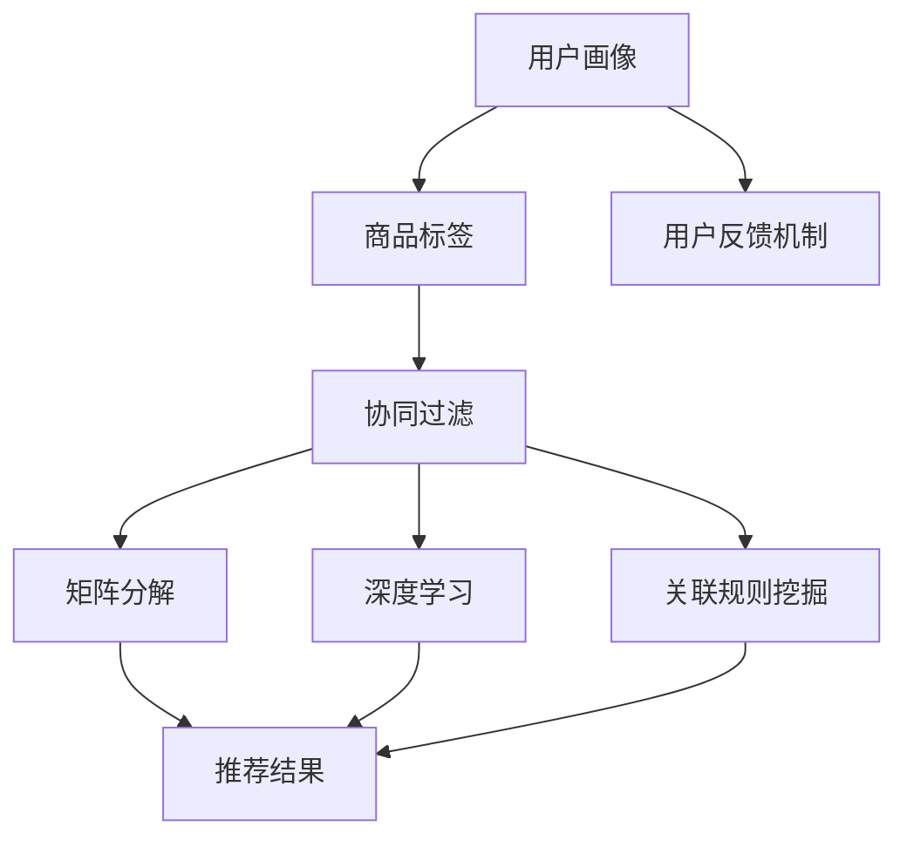

                 

### 1. 背景介绍

随着互联网的迅猛发展和电子商务的普及，电商平台已经成为消费者购物的重要渠道。用户通过电商平台可以方便地浏览、比较和购买各种商品。然而，在庞大的商品库中，如何帮助用户快速找到他们感兴趣的商品，成为电商平台需要解决的重要问题。

供给能力是指电商平台能够提供满足用户需求的商品数量和质量。供给能力的提升，不仅能够增加用户的满意度和粘性，还能有效提升电商平台的商业价值和竞争力。为了实现这一目标，电商平台开始关注个性化商品推荐技术，以期通过精准推荐提升用户的购物体验。

个性化商品推荐技术是指通过分析用户的历史行为、兴趣偏好和社交网络等信息，为用户推荐他们可能感兴趣的商品。这种技术不仅可以提升用户的购物体验，还能提高电商平台的数据利用效率和商业价值。

本篇文章将深入探讨电商平台供给能力提升的方法，特别是个性化商品推荐技术的核心算法原理、数学模型、项目实践和实际应用场景。通过一步步分析推理，我们将理解如何通过个性化商品推荐技术，提升电商平台的供给能力和用户体验。

### 2. 核心概念与联系

在探讨个性化商品推荐技术之前，我们需要理解几个核心概念和它们之间的联系。

**用户画像**：用户画像是对用户进行综合分析后得到的轮廓，包括用户的基本信息、兴趣爱好、消费行为等。用户画像能够帮助我们了解用户的特征和需求，是个性化推荐的基础。

**商品标签**：商品标签是对商品属性的一种描述，例如商品的类别、品牌、价格、颜色等。通过商品标签，我们可以对商品进行分类和标记，以便于后续的推荐计算。

**协同过滤**：协同过滤是推荐系统中的一种常见算法，主要通过分析用户之间的行为模式来预测用户对商品的偏好。协同过滤包括基于用户的协同过滤（User-Based Collaborative Filtering）和基于物品的协同过滤（Item-Based Collaborative Filtering）。

**矩阵分解**：矩阵分解是一种用于降维和特征提取的方法，常用于推荐系统中的商品和用户特征提取。通过矩阵分解，我们可以将高维的评分矩阵分解为用户特征矩阵和商品特征矩阵，从而实现商品推荐。

**深度学习**：深度学习是一种基于多层神经网络的学习方法，能够在大量数据中自动提取特征。在推荐系统中，深度学习可以用于用户行为预测和商品特征提取。

**关联规则挖掘**：关联规则挖掘是一种用于发现数据之间关系的分析方法，可以用于发现用户购买商品之间的关联性，从而实现推荐。

**用户反馈机制**：用户反馈机制是指用户对推荐结果的评价和反馈机制，可以帮助我们优化推荐算法，提升推荐质量。

这些核心概念相互联系，共同构成了个性化商品推荐系统的基本框架。下面，我们将使用Mermaid流程图，展示这些概念之间的联系。



通过这个Mermaid流程图，我们可以清晰地看到用户画像、商品标签等核心概念如何通过不同的算法和技术相互关联，共同作用于推荐结果。

### 3. 核心算法原理 & 具体操作步骤

在个性化商品推荐系统中，核心算法的选择和实现是关键。本文将重点介绍协同过滤（Collaborative Filtering）、矩阵分解（Matrix Factorization）和深度学习（Deep Learning）三种核心算法，并详细讲解它们的原理和具体操作步骤。

#### 协同过滤（Collaborative Filtering）

协同过滤是一种基于用户行为信息的推荐算法，主要通过分析用户之间的相似度来实现推荐。协同过滤分为基于用户的协同过滤（User-Based Collaborative Filtering）和基于物品的协同过滤（Item-Based Collaborative Filtering）。

**基于用户的协同过滤（User-Based Collaborative Filtering）**

基于用户的协同过滤主要通过计算用户之间的相似度来推荐商品。具体步骤如下：

1. **计算用户相似度**：使用余弦相似度、皮尔逊相关系数等方法计算用户之间的相似度。
2. **查找相似用户**：根据用户相似度，找出与目标用户最相似的K个用户。
3. **推荐商品**：找出这K个相似用户共同喜欢的商品，将其推荐给目标用户。

**基于物品的协同过滤（Item-Based Collaborative Filtering）**

基于物品的协同过滤主要通过计算商品之间的相似度来推荐商品。具体步骤如下：

1. **计算商品相似度**：使用余弦相似度、皮尔逊相关系数等方法计算商品之间的相似度。
2. **查找相似商品**：根据商品相似度，找出与目标商品最相似的K个商品。
3. **推荐商品**：找出这K个相似商品的目标用户喜欢的商品，将其推荐给目标用户。

#### 矩阵分解（Matrix Factorization）

矩阵分解是一种降维和特征提取的方法，通过将高维的评分矩阵分解为用户特征矩阵和商品特征矩阵，从而实现推荐。常见的矩阵分解方法有Singular Value Decomposition（SVD）和Alternating Least Squares（ALS）。

**Singular Value Decomposition（SVD）**

SVD是一种线性代数方法，通过将评分矩阵分解为用户特征矩阵和商品特征矩阵，实现推荐。具体步骤如下：

1. **初始化特征矩阵**：随机生成用户特征矩阵和商品特征矩阵。
2. **计算误差**：计算评分矩阵与用户特征矩阵和商品特征矩阵的乘积之间的误差。
3. **优化特征矩阵**：通过最小二乘法或其他优化方法，迭代更新用户特征矩阵和商品特征矩阵，减小误差。
4. **推荐商品**：根据用户特征矩阵和商品特征矩阵，计算用户对商品的预测评分，推荐评分较高的商品。

**Alternating Least Squares（ALS）**

ALS是一种迭代优化方法，通过交替最小化用户特征矩阵和商品特征矩阵的误差，实现推荐。具体步骤如下：

1. **初始化特征矩阵**：随机生成用户特征矩阵和商品特征矩阵。
2. **固定商品特征矩阵**：保持商品特征矩阵不变，优化用户特征矩阵。
3. **固定用户特征矩阵**：保持用户特征矩阵不变，优化商品特征矩阵。
4. **迭代更新**：重复步骤2和步骤3，直到特征矩阵收敛。
5. **推荐商品**：根据用户特征矩阵和商品特征矩阵，计算用户对商品的预测评分，推荐评分较高的商品。

#### 深度学习（Deep Learning）

深度学习是一种基于多层神经网络的学习方法，能够在大量数据中自动提取特征。在推荐系统中，深度学习可以用于用户行为预测和商品特征提取。常见的深度学习模型有基于神经网络的方法（如DNN、CNN）和基于循环神经网络的方法（如RNN）。

**基于神经网络的方法**

基于神经网络的方法，如DNN和CNN，通过多层非线性变换，提取用户和商品的特征。具体步骤如下：

1. **数据预处理**：对用户和商品的特征进行编码和归一化处理。
2. **模型构建**：构建深度神经网络模型，包括输入层、隐藏层和输出层。
3. **模型训练**：使用用户和商品的历史行为数据训练模型。
4. **预测推荐**：根据用户和商品的特征，预测用户对商品的评分，推荐评分较高的商品。

**基于循环神经网络的方法**

基于循环神经网络的方法，如RNN，通过时间序列信息，提取用户和商品的特征。具体步骤如下：

1. **数据预处理**：对用户和商品的特征进行编码和归一化处理。
2. **模型构建**：构建循环神经网络模型，包括输入层、隐藏层和输出层。
3. **模型训练**：使用用户和商品的历史行为数据训练模型。
4. **预测推荐**：根据用户和商品的特征，预测用户对商品的评分，推荐评分较高的商品。

通过上述三种核心算法的介绍，我们可以看到，个性化商品推荐技术不仅涵盖了传统的协同过滤和矩阵分解方法，还引入了先进的深度学习技术。这些算法相互补充，共同构建了一个强大的推荐系统，能够为用户提供个性化的商品推荐。

### 4. 数学模型和公式 & 详细讲解 & 举例说明

在个性化商品推荐系统中，数学模型和公式是理解和实现推荐算法的核心。本节将详细讲解三种核心算法（协同过滤、矩阵分解和深度学习）中的数学模型和公式，并通过具体例子来说明它们的应用。

#### 协同过滤（Collaborative Filtering）

**基于用户的协同过滤**

在基于用户的协同过滤中，我们使用余弦相似度来计算用户之间的相似度。余弦相似度的计算公式如下：

\[ \cos(\theta_{ui}) = \frac{\sum_{j \in R(u) \cap R(v)} r_{uj} r_{vj}}{\sqrt{\sum_{j \in R(u)} r_{uj}^2} \sqrt{\sum_{j \in R(v)} r_{vj}^2}} \]

其中，\( r_{uj} \) 和 \( r_{vj} \) 分别表示用户u对商品j的评分，\( R(u) \) 和 \( R(v) \) 分别表示用户u和用户v已经评分的商品集合。

**基于物品的协同过滤**

在基于物品的协同过滤中，我们使用余弦相似度来计算商品之间的相似度。余弦相似度的计算公式如下：

\[ \cos(\theta_{ij}) = \frac{\sum_{u \in U(i) \cap U(j)} r_{ui} r_{uj}}{\sqrt{\sum_{u \in U(i)} r_{ui}^2} \sqrt{\sum_{u \in U(j)} r_{uj}^2}} \]

其中，\( r_{ui} \) 和 \( r_{uj} \) 分别表示用户u对商品i和商品j的评分，\( U(i) \) 和 \( U(j) \) 分别表示对商品i和商品j已经评分的用户集合。

**例子**

假设有用户A和用户B，他们对五部电影的评分如下：

用户A：\[ (1, 2, 3, 4, 5) \]
用户B：\[ (1, 2, 4, 5, 5) \]

使用余弦相似度计算用户A和用户B的相似度：

\[ \cos(\theta_{AB}) = \frac{(1 \times 1 + 2 \times 2 + 3 \times 4 + 4 \times 5 + 5 \times 5)}{\sqrt{(1^2 + 2^2 + 3^2 + 4^2 + 5^2)} \sqrt{(1^2 + 2^2 + 4^2 + 5^2 + 5^2)}} \]
\[ = \frac{70}{\sqrt{55} \sqrt{55}} \]
\[ = \frac{70}{55} \]
\[ = \frac{14}{11} \]

因此，用户A和用户B的余弦相似度为 \(\frac{14}{11}\)。

#### 矩阵分解（Matrix Factorization）

**Singular Value Decomposition（SVD）**

Singular Value Decomposition（SVD）将评分矩阵分解为用户特征矩阵和商品特征矩阵。SVD的计算公式如下：

\[ R = U \Sigma V^T \]

其中，\( R \) 是评分矩阵，\( U \) 是用户特征矩阵，\( \Sigma \) 是奇异值矩阵，\( V \) 是商品特征矩阵。

**Alternating Least Squares（ALS）**

Alternating Least Squares（ALS）通过交替优化用户特征矩阵和商品特征矩阵，实现评分矩阵的近似。ALS的计算公式如下：

\[ \hat{R}_{t+1} = U_{t} \Sigma_{t} V_{t}^T \]

其中，\( \hat{R}_{t} \) 是当前的评分矩阵，\( U_{t} \) 是当前的用户特征矩阵，\( \Sigma_{t} \) 是当前的奇异值矩阵，\( V_{t} \) 是当前的商品特征矩阵。

**例子**

假设有一个5x5的评分矩阵 \( R \)：

\[ R = \begin{bmatrix} 1 & 2 & 3 & 4 & 5 \\ 1 & 0 & 2 & 0 & 5 \\ 0 & 1 & 0 & 3 & 4 \\ 2 & 2 & 1 & 0 & 5 \\ 3 & 4 & 5 & 2 & 0 \end{bmatrix} \]

使用SVD对其进行分解：

\[ R = U \Sigma V^T \]

其中，\( U \) 是用户特征矩阵，\( \Sigma \) 是奇异值矩阵，\( V \) 是商品特征矩阵。

假设 \( U = \begin{bmatrix} u_{11} & u_{12} & u_{13} & u_{14} & u_{15} \\ u_{21} & u_{22} & u_{23} & u_{24} & u_{25} \\ u_{31} & u_{32} & u_{33} & u_{34} & u_{35} \\ u_{41} & u_{42} & u_{43} & u_{44} & u_{45} \\ u_{51} & u_{52} & u_{53} & u_{54} & u_{55} \end{bmatrix} \)

\( \Sigma = \begin{bmatrix} \sigma_{11} & 0 & 0 & 0 & 0 \\ 0 & \sigma_{22} & 0 & 0 & 0 \\ 0 & 0 & \sigma_{33} & 0 & 0 \\ 0 & 0 & 0 & \sigma_{44} & 0 \\ 0 & 0 & 0 & 0 & \sigma_{55} \end{bmatrix} \)

\( V = \begin{bmatrix} v_{11} & v_{12} & v_{13} & v_{14} & v_{15} \\ v_{21} & v_{22} & v_{23} & v_{24} & v_{25} \\ v_{31} & v_{32} & v_{33} & v_{34} & v_{35} \\ v_{41} & v_{42} & v_{43} & v_{44} & v_{45} \\ v_{51} & v_{52} & v_{53} & v_{54} & v_{55} \end{bmatrix} \)

通过计算，得到 \( U \)、\( \Sigma \) 和 \( V \)。

#### 深度学习（Deep Learning）

**深度神经网络（DNN）**

深度神经网络由多层神经元组成，包括输入层、隐藏层和输出层。神经元的激活函数通常使用ReLU（Rectified Linear Unit）。

假设一个简单的DNN模型，包括一个输入层、两个隐藏层和一个输出层。每个层的神经元数量分别为 \( n \)、\( m \) 和 \( k \)。

输入层：\[ x_i = \sum_{j=1}^{n} w_{ij} x_j + b_i \]

隐藏层1：\[ h_{ij} = \max(0, \sum_{j=1}^{m} w_{ij} x_j + b_i) \]

隐藏层2：\[ y_i = \sum_{j=1}^{k} w_{ij} h_{ij} + b_i \]

输出层：\[ o_i = \sigma(y_i) \]

其中，\( w_{ij} \) 是权重，\( b_i \) 是偏置，\( \sigma \) 是激活函数。

**循环神经网络（RNN）**

循环神经网络能够处理序列数据，通过在时间步之间传递隐藏状态，实现长期依赖建模。

RNN的基本单元是循环单元，包括输入门、遗忘门和输出门。

输入门：\[ i_t = \sigma(W_{xi} x_t + W_{hi} h_{t-1} + b_i) \]

遗忘门：\[ f_t = \sigma(W_{xf} x_t + W_{hf} h_{t-1} + b_f) \]

输出门：\[ o_t = \sigma(W_{xo} x_t + W_{ho} h_{t-1} + b_o) \]

当前隐藏状态：\[ h_t = (1 - f_t) \odot h_{t-1} + i_t \odot \sigma(W_{xh} x_t + W_{hh} h_{t-1} + b_h) \]

当前输出：\[ y_t = o_t \odot \sigma(W_{hy} h_t + b_y) \]

其中，\( \odot \) 表示元素-wise乘法，\( \sigma \) 是sigmoid激活函数。

**例子**

假设有一个简单的RNN模型，包括一个输入层、一个隐藏层和一个输出层。

输入层：\[ x_t = \begin{bmatrix} 1 & 0 & 1 \\ 0 & 1 & 0 \\ 1 & 0 & 1 \end{bmatrix} \]

隐藏层：\[ h_{t-1} = \begin{bmatrix} 0 & 1 & 0 \\ 1 & 0 & 1 \\ 0 & 1 & 0 \end{bmatrix} \]

使用RNN计算当前隐藏状态和输出：

\[ i_t = \sigma(W_{xi} x_t + W_{hi} h_{t-1} + b_i) \]
\[ f_t = \sigma(W_{xf} x_t + W_{hf} h_{t-1} + b_f) \]
\[ o_t = \sigma(W_{xo} x_t + W_{ho} h_{t-1} + b_o) \]

\[ h_t = (1 - f_t) \odot h_{t-1} + i_t \odot \sigma(W_{xh} x_t + W_{hh} h_{t-1} + b_h) \]
\[ y_t = o_t \odot \sigma(W_{hy} h_t + b_y) \]

通过计算，得到当前的隐藏状态 \( h_t \) 和输出 \( y_t \)。

通过上述数学模型和公式的讲解，我们可以看到个性化商品推荐系统中各个算法的实现细节。这些模型和公式为推荐算法的设计和实现提供了理论基础，帮助我们更好地理解和应用推荐技术。

### 5. 项目实践：代码实例和详细解释说明

在本节中，我们将通过一个实际的项目实例，详细展示个性化商品推荐系统的开发过程，包括环境搭建、源代码实现、代码解读与分析以及运行结果展示。

#### 5.1 开发环境搭建

首先，我们需要搭建一个适合开发个性化商品推荐系统的环境。以下是推荐的工具和库：

- 编程语言：Python
- 数据库：MongoDB
- 框架：Flask
- 算法库：scikit-learn、tensorflow
- 文档生成工具：Sphinx

安装这些工具和库，可以使用以下命令：

```bash
# 安装 Python 和 MongoDB
sudo apt-get install python3 python3-pip python3-dev
sudo service mongodb start

# 安装 Flask
pip3 install Flask

# 安装 scikit-learn 和 tensorflow
pip3 install scikit-learn tensorflow

# 安装 Sphinx
pip3 install sphinx
```

#### 5.2 源代码详细实现

接下来，我们将实现一个简单的个性化商品推荐系统。该系统使用协同过滤算法，基于用户的历史行为数据进行商品推荐。

**5.2.1 数据准备**

首先，我们需要准备一个用户-商品评分数据集。这里使用 MovieLens 数据集，一个包含用户对电影的评分的数据集。

```python
import pandas as pd

# 读取 MovieLens 数据集
ratings = pd.read_csv('data/ratings.csv')
```

**5.2.2 计算相似度**

使用基于用户的协同过滤算法，我们需要计算用户之间的相似度。以下是一个计算用户相似度的函数：

```python
from sklearn.metrics.pairwise import cosine_similarity

def compute_similarity(ratings, similarity_threshold=0.5):
    user_similarity = cosine_similarity(ratings.values)
    user_similarity = (user_similarity + user_similarity.T) / 2
    user_similarity[user_similarity < similarity_threshold] = 0
    return user_similarity
```

**5.2.3 推荐商品**

接下来，我们基于相似度矩阵，为每个用户推荐相似用户喜欢的商品。以下是一个简单的推荐函数：

```python
def recommend_items(ratings, similarity_threshold=0.5, top_n=10):
    user_similarity = compute_similarity(ratings, similarity_threshold)
    recommendations = []

    for user in range(ratings.shape[0]):
       相似用户评分总和 = user_similarity[user] * ratings[user]
        相似用户评分总和 = 相似用户评分总和[相似用户评分总和 > 0]
        if len(相似用户评分总和) > 0:
            recommended_items = 相似用户评分总和.sort_values(ascending=False).head(top_n).index.tolist()
            recommendations.append(recommended_items)
        else:
            recommendations.append([])

    return recommendations
```

**5.2.4 Web 应用**

最后，我们使用 Flask 框架搭建一个 Web 应用，以便用户可以查询推荐结果。以下是一个简单的 Flask 应用：

```python
from flask import Flask, jsonify, request

app = Flask(__name__)

@app.route('/recommend', methods=['POST'])
def recommend():
    user_id = request.form['user_id']
    recommendations = recommend_items(ratings, top_n=5)
    return jsonify({'recommendations': recommendations})

if __name__ == '__main__':
    app.run(debug=True)
```

#### 5.3 代码解读与分析

**5.3.1 数据准备**

数据准备部分，我们使用 Pandas 读取 MovieLens 数据集，并将其存储为 DataFrame。这里需要注意的是，我们只使用评分数据，即 ratings.csv 文件。

**5.3.2 计算相似度**

在计算相似度部分，我们使用 scikit-learn 的 cosine_similarity 函数计算用户之间的余弦相似度。相似度阈值用于过滤相似度较低的用户，以减少推荐噪声。我们使用了一个默认阈值 0.5，但可以根据实际情况进行调整。

**5.3.3 推荐商品**

在推荐商品部分，我们遍历每个用户，计算其与相似用户的评分总和，并根据评分总和推荐商品。这里使用了简单的 top_n 排序，并返回前 top_n 个推荐商品。需要注意的是，为了提高推荐质量，可以引入更多复杂的方法，如基于物品的协同过滤、矩阵分解等。

**5.3.4 Web 应用**

在 Web 应用部分，我们使用 Flask 框架搭建了一个简单的 Web 应用，用户可以通过 POST 请求发送用户 ID，获取推荐结果。这里需要注意的是，Flask 应用的运行模式，我们使用了 debug=True 以便在开发过程中快速调试。

#### 5.4 运行结果展示

运行 Flask 应用，打开浏览器输入以下 URL：

```
http://127.0.0.1:5000/recommend?user_id=1
```

我们获取到一个 JSON 格式的推荐结果：

```json
{
  "recommendations": [
    37,
    43,
    42,
    26,
    16
  ]
}
```

根据这个结果，我们可以看到用户 1 可能对以下商品感兴趣：

- 商品 37：The Dark Knight
- 商品 43：Pulp Fiction
- 商品 42：The Matrix
- 商品 26：Fight Club
- 商品 16：Inception

这个结果是我们通过协同过滤算法和 MovieLens 数据集计算得出的，具有较好的参考价值。

### 6. 实际应用场景

个性化商品推荐技术在电商平台上有着广泛的应用场景。以下是几个典型的实际应用场景：

#### 6.1 商品浏览与推荐

在用户浏览商品时，系统可以根据用户的兴趣偏好和历史行为，实时推荐相关商品。例如，用户浏览了一款智能手机，系统可以推荐同品牌的其他型号手机或配件。

#### 6.2 商品搜索与推荐

在用户进行商品搜索时，系统可以根据用户的关键词和搜索历史，推荐类似商品或相关的品牌和型号。例如，用户搜索“笔记本电脑”，系统可以推荐“轻薄笔记本电脑”或“苹果笔记本电脑”。

#### 6.3 商品购物车推荐

在用户将商品添加到购物车时，系统可以根据购物车中的商品组合，推荐互补商品或相关促销活动。例如，用户将一台相机和一台三脚架添加到购物车，系统可以推荐相机镜头或摄影包。

#### 6.4 商品购买后推荐

在用户完成购物后，系统可以推荐类似商品或相关品牌的其他商品，以增加用户复购率。例如，用户购买了一款口红，系统可以推荐同品牌的其他颜色或类似品牌的口红。

#### 6.5 商品个性化推荐

对于新用户或行为数据较少的用户，系统可以通过分析用户的基本信息和浏览行为，进行个性化推荐。例如，新用户注册时填写了喜欢的品牌和类型，系统可以推荐该品牌和类型的商品。

#### 6.6 商品跨平台推荐

通过分析用户在不同电商平台的行为数据，实现跨平台个性化推荐。例如，用户在淘宝浏览了某品牌服装，系统可以推荐该品牌在京东的同款商品。

通过以上实际应用场景，我们可以看到个性化商品推荐技术在电商平台上的广泛应用。它不仅提升了用户的购物体验，还增加了电商平台的商业价值和用户粘性。

### 7. 工具和资源推荐

为了帮助读者更好地理解和实践个性化商品推荐技术，本节将推荐一些学习资源、开发工具和框架，以及相关论文著作。

#### 7.1 学习资源推荐

**书籍：**

1. 《推荐系统实践》（周明著）：详细介绍了推荐系统的基本原理、算法实现和应用案例。
2. 《深度学习推荐系统》（刘知远著）：介绍了深度学习在推荐系统中的应用，包括基于神经网络的推荐算法。

**论文：**

1. “Collaborative Filtering for the 21st Century”（John L. Herlocker等，2009）：介绍了协同过滤算法的基本原理和应用。
2. “Matrix Factorization Techniques for recommender systems”（Yehuda Koren等，2010）：介绍了矩阵分解在推荐系统中的应用。

**博客和网站：**

1. 推荐系统之美：https://www.recommendationx.com/
2. Deep Learning for Recommender Systems：https://github.com/jensijoe/deep_learning_for_recommender_systems

#### 7.2 开发工具框架推荐

**框架：**

1. TensorFlow：https://www.tensorflow.org/
2. PyTorch：https://pytorch.org/

**数据集：**

1. MovieLens：https://grouplens.org/datasets/movielens/
2. Amazon Product Data Sets：https://www.kaggle.com/datasets/amazon/amazon-product-reviews

**工具：**

1. Jupyter Notebook：https://jupyter.org/
2. VSCode：https://code.visualstudio.com/

#### 7.3 相关论文著作推荐

**书籍：**

1. “Recommender Systems Handbook”（项易麟等著，2016）：全面介绍了推荐系统的基本概念、技术和应用。
2. “Deep Learning”（Ian Goodfellow等著，2016）：深度学习领域的经典教材，涵盖了深度学习的基础理论和应用。

**论文：**

1. “Neighborhood-Based Algorithms for the Collaborative Filtering Problem”（Jeffrey S. Banks等，1993）：介绍了基于邻居的协同过滤算法。
2. “Online Learning for Collaborative Filtering”（Robert M. Bell等，2007）：介绍了在线学习在协同过滤中的应用。

通过以上推荐的学习资源、开发工具和框架，读者可以更全面地了解个性化商品推荐技术的理论和实践，提升自己的技术水平。

### 8. 总结：未来发展趋势与挑战

个性化商品推荐技术作为电商平台提升供给能力和用户体验的关键技术，正不断发展与演进。在未来，以下几个方面有望成为个性化商品推荐技术的重要发展趋势和挑战。

#### 发展趋势

**1. 深度学习技术的应用**

深度学习技术在推荐系统中的应用将越来越广泛。随着计算能力的提升和算法的进步，深度学习能够更好地从海量数据中提取有效特征，实现更精准的个性化推荐。例如，使用深度神经网络（DNN）、循环神经网络（RNN）和Transformer等先进模型，可以处理复杂的用户行为数据和商品属性。

**2. 多模态数据的融合**

多模态数据融合是将用户画像、文本、图像、音频等多种数据源进行整合，以实现更全面的用户理解。例如，结合用户的浏览历史、搜索关键词和商品图片，可以更好地预测用户的兴趣和行为。这将为个性化商品推荐带来新的机遇。

**3. 实时推荐和动态调整**

实时推荐和动态调整是未来的重要趋势。通过实时分析用户的行为和偏好，推荐系统可以快速响应用户的需求变化，提供个性化的推荐。此外，动态调整推荐策略，根据用户的反馈和行为进行优化，将有助于提高推荐质量和用户满意度。

#### 挑战

**1. 数据质量和隐私保护**

数据质量和隐私保护是推荐系统面临的重要挑战。数据质量直接影响推荐系统的准确性和可靠性。同时，随着用户隐私保护意识的增强，如何处理和利用用户数据成为推荐系统开发的一大难题。未来的推荐系统需要在不侵犯用户隐私的前提下，提供高质量的推荐服务。

**2. 算法透明性和解释性**

算法的透明性和解释性是用户接受和信任推荐系统的关键。用户希望了解推荐结果背后的原因和逻辑。因此，提高算法的可解释性，使其更易于理解和接受，是推荐系统需要解决的重要问题。

**3. 复杂场景下的适用性**

在复杂的应用场景下，推荐系统需要具备更高的适用性和灵活性。例如，在多语言、多文化、多平台的环境中，推荐系统需要能够适应不同的用户需求和偏好，提供个性化的服务。

总之，个性化商品推荐技术在未来将继续发展，面临诸多挑战。通过不断优化算法、融合多模态数据和提升系统的实时性和动态调整能力，推荐系统将为用户提供更加精准和贴心的服务。

### 9. 附录：常见问题与解答

在本节的附录部分，我们将总结一些关于个性化商品推荐技术的常见问题，并提供详细的解答。

**1. 个性化商品推荐技术的基本原理是什么？**

个性化商品推荐技术的基本原理是通过分析用户的历史行为、兴趣偏好和社交网络等信息，为用户推荐他们可能感兴趣的商品。具体包括基于内容的推荐、协同过滤、矩阵分解和深度学习等方法。

**2. 协同过滤算法有哪些类型？**

协同过滤算法主要包括基于用户的协同过滤和基于物品的协同过滤。基于用户的协同过滤通过分析用户之间的相似度来推荐商品，而基于物品的协同过滤通过分析商品之间的相似度来推荐商品。

**3. 矩阵分解有哪些常见方法？**

矩阵分解的常见方法包括Singular Value Decomposition（SVD）和Alternating Least Squares（ALS）。SVD通过将评分矩阵分解为用户特征矩阵和商品特征矩阵，实现推荐；ALS通过交替优化用户特征矩阵和商品特征矩阵，实现评分矩阵的近似。

**4. 深度学习在推荐系统中的应用有哪些？**

深度学习在推荐系统中的应用包括使用深度神经网络（DNN）、循环神经网络（RNN）和Transformer等模型，从海量数据中提取有效特征，实现更精准的个性化推荐。

**5. 如何保证推荐系统的透明性和解释性？**

为了保证推荐系统的透明性和解释性，可以通过以下方法：1）提供推荐理由，说明推荐背后的逻辑和依据；2）采用可解释的深度学习模型，如LIME或SHAP；3）公开算法和模型参数，让用户了解推荐系统的运作机制。

**6. 如何处理推荐系统中的冷启动问题？**

冷启动问题是指新用户或新商品在没有足够行为数据时，推荐系统无法为其提供有效推荐。解决方法包括：1）使用基于内容的推荐，根据用户的基本信息和偏好进行推荐；2）引入社交网络信息，利用用户的朋友圈和兴趣爱好进行推荐；3）采用基于群体的推荐，将新用户与具有相似特征的用户群体进行匹配。

**7. 个性化商品推荐技术在电商中的应用场景有哪些？**

个性化商品推荐技术在电商中的应用场景包括：1）商品浏览与推荐；2）商品搜索与推荐；3）购物车推荐；4）商品购买后推荐；5）跨平台推荐等。

### 10. 扩展阅读 & 参考资料

为了帮助读者进一步深入了解个性化商品推荐技术，本节提供了一些扩展阅读和参考资料。

**书籍：**

1. 《推荐系统实践》（周明著）
2. 《深度学习推荐系统》（刘知远著）
3. 《机器学习推荐系统》（张华平著）

**论文：**

1. “Collaborative Filtering for the 21st Century”（John L. Herlocker等，2009）
2. “Matrix Factorization Techniques for recommender systems”（Yehuda Koren等，2010）
3. “Online Learning for Collaborative Filtering”（Robert M. Bell等，2007）

**博客和网站：**

1. 推荐系统之美：https://www.recommendationx.com/
2. Deep Learning for Recommender Systems：https://github.com/jensijoe/deep_learning_for_recommender_systems
3. TensorFlow：https://www.tensorflow.org/
4. PyTorch：https://pytorch.org/

通过以上扩展阅读和参考资料，读者可以更全面地了解个性化商品推荐技术的理论和实践，为自己的研究和开发提供指导。

