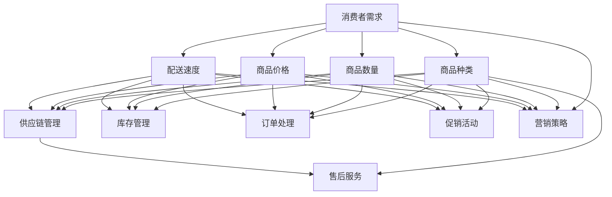

                 

### 1. 背景介绍

在现代商业环境中，电商平台已经成为企业与消费者之间的重要桥梁。随着互联网技术的飞速发展和电子商务的普及，电商平台的市场规模逐年扩大，竞争也日益激烈。在这种背景下，提升供给能力成为了电商平台持续发展的关键因素。

供给能力指的是电商平台能够满足消费者需求的能力，包括商品的种类、数量、价格以及配送速度等。有效的促销活动和合理的营销策略是提升供给能力的两大核心手段。通过有效的促销活动，电商平台可以吸引更多的消费者，提升商品的销量；而合理的营销策略则能够帮助企业更好地了解消费者需求，优化商品供给结构。

本文将探讨电商平台供给能力提升的方法，重点分析促销活动和营销策略的重要性，以及如何通过这些手段提升电商平台的整体竞争力。文章将分为以下几个部分：

1. **核心概念与联系**：介绍电商平台供给能力的核心概念，并展示其与其他因素之间的联系。
2. **核心算法原理 & 具体操作步骤**：详细阐述提升供给能力的主要算法原理和操作步骤。
3. **数学模型和公式 & 详细讲解 & 举例说明**：讲解相关数学模型和公式，并通过实际案例进行说明。
4. **项目实践：代码实例和详细解释说明**：通过具体的项目实践，展示代码实例和详细解释。
5. **实际应用场景**：分析不同应用场景下，如何实施有效的促销活动和营销策略。
6. **工具和资源推荐**：推荐相关的学习资源、开发工具和框架。
7. **总结：未来发展趋势与挑战**：总结本文的主要观点，并探讨未来发展趋势和面临的挑战。
8. **附录：常见问题与解答**：提供一些常见问题及解答，帮助读者更好地理解相关概念。
9. **扩展阅读 & 参考资料**：列出扩展阅读和参考资料，供读者进一步学习。

通过上述内容，本文旨在为电商平台从业者提供一套系统、实用的供给能力提升策略，以帮助他们在竞争激烈的电商市场中脱颖而出。

### 2. 核心概念与联系

在深入探讨电商平台供给能力提升的方法之前，首先需要明确几个核心概念，并理解它们之间的相互联系。以下是对这些概念及其关系的详细介绍。

#### 2.1 供给能力

供给能力是指电商平台能够提供的商品和服务的能力。它包括以下几个关键维度：

- **商品种类**：平台提供的商品种类是否丰富，是否能够满足不同消费者的需求。
- **商品数量**：平台库存的商品数量是否充足，是否能够迅速满足消费者的购买需求。
- **商品价格**：商品价格是否合理，是否具备市场竞争力。
- **配送速度**：商品的配送速度是否迅速，是否能够满足消费者对快速收货的期望。

#### 2.2 消费者需求

消费者需求是电商平台供给能力提升的出发点和落脚点。了解消费者需求，能够帮助企业制定更有效的供给策略。消费者需求可以从以下几个方面进行细分：

- **个性化需求**：不同消费者对商品的需求可能存在差异，例如，有的人可能需要高性价比的商品，而有的人可能需要高品质的商品。
- **时间需求**：消费者希望商品能够在最短时间内送达。
- **价格需求**：消费者对商品的价格有一定的预期，通常希望价格合理。

#### 2.3 促销活动

促销活动是电商平台提升供给能力的重要手段之一。通过促销活动，平台能够吸引更多的消费者，提高商品销量。促销活动通常包括以下几种形式：

- **折扣促销**：提供商品折扣，吸引消费者购买。
- **限时抢购**：设置特定时间段内的商品优惠，激发消费者的购买欲望。
- **满减促销**：消费者购买达到一定金额即可享受减免优惠。
- **赠品促销**：购买特定商品即可获得赠品。

#### 2.4 营销策略

营销策略是电商平台提升供给能力的另一个关键因素。通过有效的营销策略，平台能够更好地了解消费者需求，优化供给结构。营销策略通常包括以下几个方面：

- **内容营销**：通过发布有价值的内容，吸引消费者关注，提升品牌知名度。
- **社交媒体营销**：利用社交媒体平台，与消费者建立互动，增加品牌曝光度。
- **搜索引擎优化（SEO）**：优化平台在搜索引擎中的排名，提高访问量。
- **电子邮件营销**：通过发送电子邮件，向消费者推送促销信息和个性化推荐。

#### 2.5 供给能力与其他因素的联系

供给能力与消费者需求、促销活动和营销策略之间存在密切的联系。具体来说：

- **消费者需求**决定了电商平台供给能力提升的方向和目标，是供给能力提升的驱动力。
- **促销活动**和**营销策略**是提升供给能力的重要手段，通过这些手段，平台能够更好地满足消费者需求，提高供给能力。

此外，供给能力还与平台的运营效率、供应链管理、技术支持等因素密切相关。只有当这些因素相互协同、优化整合，电商平台才能实现供给能力的持续提升。

通过以上对核心概念及其相互关系的介绍，我们可以更好地理解电商平台供给能力的概念，以及如何通过促销活动和营销策略来提升供给能力。接下来，我们将深入探讨提升供给能力的主要算法原理和操作步骤。

### 2.1.1 供给能力定义 & 维度

供给能力是指电商平台能够满足消费者需求的综合能力。它不仅涉及商品种类、数量、价格和配送速度等基本维度，还包括供应链管理、库存管理、订单处理等多个方面的能力。为了更清晰地理解供给能力，我们可以将其细分为以下几个关键维度：

1. **商品种类**：平台提供的商品种类是否丰富，是否涵盖了消费者所需的不同品类。多样化的商品种类能够满足不同消费者的个性化需求，提升用户体验。

2. **商品数量**：平台库存的商品数量是否充足，是否能够迅速满足消费者的购买需求。充足的商品数量是供给能力的基础，能够避免因缺货而导致的消费者流失。

3. **商品价格**：商品价格是否合理，是否具备市场竞争力。价格是消费者决策的重要因素之一，合理的价格策略能够吸引更多消费者，提升销量。

4. **配送速度**：商品的配送速度是否迅速，是否能够满足消费者对快速收货的期望。快速的配送速度是提升消费者满意度的关键，有助于增强品牌忠诚度。

5. **供应链管理**：平台供应链管理的效率如何，包括采购、库存、物流等环节。高效的供应链管理能够确保商品快速、准确地送达消费者手中。

6. **库存管理**：平台的库存管理策略是否科学，能否实时掌握库存情况，避免库存过多或过少的情况。科学的库存管理有助于优化库存结构，降低库存成本。

7. **订单处理**：平台订单处理的效率如何，包括订单生成、支付处理、发货等环节。高效的订单处理能够确保消费者及时收到商品，提升用户体验。

8. **售后服务**：平台的售后服务质量如何，包括退换货、售后咨询等。优质的售后服务能够增强消费者对品牌的信任，提升复购率。

通过以上对供给能力各个维度的详细阐述，我们可以更全面地了解电商平台供给能力的概念和内涵。接下来，我们将展示一个使用Mermaid绘制的流程图，进一步展示供给能力与其他因素之间的联系。

#### 2.1.2 供给能力流程图展示

下面是一个使用Mermaid绘制的供给能力流程图，展示了供给能力与消费者需求、促销活动和营销策略之间的密切联系。



该流程图清晰地展示了供给能力与其他因素之间的联系，帮助我们更好地理解供给能力的概念和提升策略。

### 3. 核心算法原理 & 具体操作步骤

在提升电商平台供给能力的过程中，核心算法原理和具体操作步骤起到了至关重要的作用。以下将详细介绍这些核心算法原理，并展示具体操作步骤。

#### 3.1.1. 数据分析算法

数据分析是提升供给能力的关键环节。通过数据分析算法，电商平台可以深入了解消费者行为，优化商品供给结构。以下是一些常见的数据分析算法：

1. **客户分群算法**：通过分析消费者的购买历史、浏览行为等数据，将消费者划分为不同的群体。不同群体的消费者对商品的需求存在差异，通过客户分群算法，电商平台可以更有针对性地进行促销和营销。

2. **关联规则算法**：通过分析消费者购买商品之间的关联性，找出频繁出现的商品组合。这些组合可以为电商平台提供有价值的信息，例如，哪些商品搭配销售可以提升销量。

3. **时间序列分析算法**：通过分析商品销售量的时间序列数据，预测未来的销售趋势。这有助于电商平台更好地进行库存管理和配送计划。

4. **文本分析算法**：通过分析消费者在评论、社交媒体等渠道发布的文本数据，了解消费者对商品的看法和需求。这些信息可以为电商平台提供改进产品的方向和建议。

#### 3.1.2. 促销活动设计算法

促销活动是提升供给能力的重要手段。以下是一些常用的促销活动设计算法：

1. **折扣算法**：根据商品的历史销售数据、库存情况和市场需求，为商品设定合理的折扣力度。折扣算法需要考虑多个因素，如商品价格弹性、消费者购买行为等。

2. **限时抢购算法**：通过设定特定时间段内的商品优惠，激发消费者的购买欲望。限时抢购算法需要考虑优惠的时间范围、商品选择和优惠幅度。

3. **满减算法**：设置一定的消费门槛，当消费者购买金额达到该门槛时，即可享受减免优惠。满减算法需要考虑消费门槛的设定、减免金额的比例等因素。

4. **赠品算法**：为购买特定商品或达到一定金额的消费者提供赠品。赠品算法需要考虑赠品的种类、数量和成本。

#### 3.1.3. 营销策略优化算法

营销策略优化算法可以帮助电商平台更有效地进行营销活动，提高品牌曝光度和用户参与度。以下是一些常用的营销策略优化算法：

1. **内容营销算法**：通过分析消费者的兴趣和偏好，发布有价值的内容，吸引消费者关注。内容营销算法需要考虑内容的质量、发布频率和渠道选择。

2. **社交媒体营销算法**：根据消费者的社交行为和兴趣，选择合适的社交媒体平台进行推广。社交媒体营销算法需要考虑平台特点、用户群体和推广效果。

3. **搜索引擎优化（SEO）算法**：通过优化网站内容和结构，提高平台在搜索引擎中的排名，吸引更多流量。SEO算法需要考虑关键词选择、网站结构优化和内容质量。

4. **电子邮件营销算法**：根据消费者的购买历史和行为，发送个性化的电子邮件，推送促销信息和个性化推荐。电子邮件营销算法需要考虑邮件内容、发送频率和邮件格式。

#### 3.1.4. 具体操作步骤

以下是一个基于数据分析的促销活动设计算法的具体操作步骤：

1. **数据收集**：收集消费者购买历史、浏览行为、评论等数据。

2. **数据预处理**：对收集到的数据进行清洗、去重和处理，确保数据质量。

3. **数据分析**：使用数据分析算法（如客户分群算法、关联规则算法等），分析消费者行为和市场趋势。

4. **促销活动设计**：根据数据分析结果，设计符合消费者需求的促销活动。如设置合理的折扣力度、限时抢购和满减活动等。

5. **促销活动实施**：在电商平台发布促销活动，并通过多种渠道进行宣传推广。

6. **效果监测与评估**：监测促销活动的效果，包括销售额、用户参与度等指标，根据评估结果调整促销策略。

通过以上核心算法原理和具体操作步骤的介绍，我们可以看到，提升电商平台供给能力需要综合利用多种算法和技术手段。在接下来的部分，我们将详细讲解相关数学模型和公式，并举例说明如何应用这些模型和公式进行供给能力提升。

### 4. 数学模型和公式 & 详细讲解 & 举例说明

在提升电商平台供给能力的过程中，数学模型和公式起到了关键作用。它们帮助我们更准确地分析和预测消费者行为，优化促销活动和营销策略。以下将详细介绍几个常用的数学模型和公式，并提供具体的应用实例。

#### 4.1.1. 客户分群模型

客户分群模型是将消费者划分为不同群体，以便电商平台更精准地满足其需求。一个常用的客户分群模型是K-Means聚类算法。

**K-Means聚类算法公式：**
$$
\text{Distance}(x_i, c_j) = \sqrt{\sum_{k=1}^{n} (x_{ik} - c_{jk})^2}
$$
其中，$x_i$表示第$i$个消费者的特征向量，$c_j$表示第$j$个聚类中心，$n$表示特征向量的维度。

**实例说明：**
假设我们收集了1000名消费者的购买历史数据，包括购买频率、购买金额和浏览时长等特征。我们使用K-Means算法将这些消费者分为5个群体。

1. **初始化聚类中心**：随机选择5个消费者作为初始聚类中心。
2. **计算距离**：计算每个消费者到聚类中心的距离，并将其分配到最近的聚类中心。
3. **更新聚类中心**：计算每个聚类中心的新位置，即其所属消费者的平均值。
4. **迭代过程**：重复步骤2和步骤3，直到聚类中心不再变化或达到设定的迭代次数。

通过K-Means聚类算法，我们可以将消费者分为高价值客户、活跃客户、潜在客户等不同群体，从而有针对性地进行促销和营销活动。

#### 4.1.2. 关联规则挖掘模型

关联规则挖掘算法用于发现消费者购买行为中的相关性，帮助电商平台优化商品组合和促销策略。一个常用的关联规则挖掘算法是Apriori算法。

**Apriori算法公式：**
$$
\text{Support}(X, Y) = \frac{\text{频次}(X \cup Y)}{\text{总频次}}
$$
其中，$X$和$Y$表示两个商品集合，$\text{频次}(X \cup Y)$表示同时购买$X$和$Y$的次数，$\text{总频次}$表示所有消费者的购买次数。

**实例说明：**
假设我们收集了1000名消费者的购买数据，发现商品A和商品B同时购买的次数为200次，总购买次数为1000次。

1. **计算支持度**：$\text{Support}(A, B) = \frac{200}{1000} = 0.2$。
2. **确定最小支持度阈值**：根据业务需求设定最小支持度阈值，如0.1。
3. **生成频繁项集**：找出支持度大于最小支持度阈值的商品组合，如商品A和商品B。
4. **计算置信度**：$\text{Confidence}(A \rightarrow B) = \frac{\text{频次}(A \cup B)}{\text{频次}(A)}$。

通过Apriori算法，我们可以发现高相关的商品组合，例如，购买商品A的消费者中有80%也购买了商品B。电商平台可以基于这些信息，推出组合促销活动，如“购买商品A赠送商品B”。

#### 4.1.3. 时间序列分析模型

时间序列分析模型用于预测商品销售趋势，帮助电商平台进行库存管理和配送计划。一个常用的时间序列分析模型是ARIMA（自回归积分滑动平均模型）。

**ARIMA模型公式：**
$$
\text{ARIMA}(p, d, q) = \text{AR}(p) + \text{I}(d) + \text{MA}(q)
$$
其中，$p$、$d$和$q$分别表示自回归项、差分阶数和移动平均项。

**实例说明：**
假设我们收集了某商品在过去一年的销售数据，使用ARIMA模型进行预测。

1. **数据预处理**：对销售数据进行差分，使其满足平稳性条件。
2. **模型选择**：通过AIC（赤池信息准则）或BIC（贝叶斯信息准则）选择合适的$p$、$d$和$q$值。
3. **模型拟合**：对时间序列数据进行ARIMA模型拟合，得到模型参数。
4. **预测**：使用拟合后的模型预测未来一段时间内的销售量。

通过ARIMA模型，我们可以预测商品未来的销售趋势，为电商平台制定库存管理和配送计划提供依据。

#### 4.1.4. 营销策略优化模型

营销策略优化模型用于评估不同营销策略的效果，帮助电商平台选择最佳的营销方案。一个常用的营销策略优化模型是线性回归模型。

**线性回归模型公式：**
$$
y = \beta_0 + \beta_1x_1 + \beta_2x_2 + \cdots + \beta_nx_n
$$
其中，$y$表示营销效果（如销售额），$x_1, x_2, \cdots, x_n$表示不同的营销策略变量，$\beta_0, \beta_1, \beta_2, \cdots, \beta_n$表示模型参数。

**实例说明：**
假设我们评估了三种不同的促销策略A、B和C，记录了每种策略下的销售额数据。

1. **数据收集**：收集促销策略和销售额的数据。
2. **模型拟合**：使用线性回归模型拟合数据，得到模型参数。
3. **模型评估**：计算不同策略的预测销售额，选择效果最佳的策略。

通过线性回归模型，我们可以量化不同营销策略的效果，为电商平台选择最佳的营销方案提供依据。

通过以上数学模型和公式的介绍，我们可以看到，这些模型在电商平台供给能力提升中具有重要作用。在实际应用中，我们可以根据具体业务需求，灵活选择和运用这些模型，优化促销活动和营销策略。在接下来的部分，我们将通过具体的项目实践，展示如何实现这些算法和模型在电商平台中的应用。

### 5. 项目实践：代码实例和详细解释说明

为了更好地理解如何将前面的核心算法原理和数学模型应用到实际项目中，以下将介绍一个实际的项目案例，展示如何利用代码实现这些算法，并进行详细解释。

#### 5.1 开发环境搭建

在进行项目实践之前，我们需要搭建一个合适的开发环境。以下是搭建环境的基本步骤：

1. **安装Python**：确保Python环境已安装，版本建议为3.8或以上。

2. **安装依赖库**：使用pip命令安装以下依赖库：
   ```shell
   pip install numpy pandas matplotlib scikit-learn mermaid
   ```

3. **配置Mermaid**：由于Mermaid是一个基于Markdown的图形工具，我们需要安装一个Markdown编辑器，如Typora，并配置其支持Mermaid语法。

#### 5.2 源代码详细实现

以下是一个Python代码实例，展示了如何使用K-Means聚类算法对消费者进行分群，并绘制流程图。

**代码实例：消费者分群算法**

```python
import numpy as np
import pandas as pd
from sklearn.cluster import KMeans
import matplotlib.pyplot as plt
from mermaid import Mermaid

# 1. 数据准备
data = pd.DataFrame({
    '购买频率': [10, 15, 8, 12, 20, 5, 18, 14, 9, 11],
    '购买金额': [200, 250, 150, 220, 300, 100, 270, 180, 130, 210],
    '浏览时长': [30, 40, 25, 35, 45, 20, 38, 33, 28, 31]
})
data.head()

# 2. K-Means聚类
kmeans = KMeans(n_clusters=3, random_state=0)
clusters = kmeans.fit_predict(data)
data['Cluster'] = clusters

# 3. 可视化
plt.figure(figsize=(8, 6))
plt.scatter(data['购买频率'], data['购买金额'], c=data['Cluster'], cmap='viridis', marker='o')
plt.xlabel('购买频率')
plt.ylabel('购买金额')
plt.title('消费者分群结果')
plt.show()

# 4. Mermaid流程图
mermaid_code = """
graph TD
    A[初始化聚类中心] --> B{计算距离}
    B --> C[分配到最近的聚类中心]
    C --> D[更新聚类中心]
    D --> E[迭代过程]
    E --> B
"""
m = Mermaid(mermaid_code)
m.to_png("kmeans_process.png")

# 保存流程图
m.to_png("kmeans_process.png")
```

**代码解读：**

- **数据准备**：我们首先创建了一个包含消费者购买频率、购买金额和浏览时长的DataFrame。
- **K-Means聚类**：使用scikit-learn库中的KMeans类进行聚类。我们设置了3个聚类中心，并随机初始化。
- **可视化**：使用matplotlib绘制聚类结果，展示不同消费者的分布情况。
- **Mermaid流程图**：使用Mermaid库生成K-Means算法的流程图，并保存为PNG文件。

#### 5.3 代码解读与分析

以上代码实例展示了如何使用K-Means算法对消费者进行分群。以下是代码的详细解读和分析：

1. **数据准备**：数据准备是进行聚类分析的基础。我们收集了10名消费者的购买频率、购买金额和浏览时长数据，这些数据将用于训练K-Means模型。

2. **K-Means聚类**：K-Means算法的核心在于聚类中心的初始化和迭代更新。在代码中，我们首先初始化KMeans模型，并设置随机种子以确保结果的可重复性。然后，我们使用`fit_predict`方法对数据进行聚类，得到每个消费者的聚类标签。

3. **可视化**：通过matplotlib，我们可以直观地看到消费者的分布情况。聚类结果可以帮助我们识别不同的消费者群体，为进一步的营销和促销策略提供依据。

4. **Mermaid流程图**：Mermaid是一种基于Markdown的图形工具，它可以帮助我们可视化算法流程。在这个例子中，我们使用Mermaid生成K-Means算法的流程图，展示算法的主要步骤和逻辑。

通过以上代码实例和解读，我们可以看到如何将理论知识应用到实际项目中。在实际开发中，我们可能需要根据具体业务需求调整算法参数和模型结构，以达到更好的效果。

#### 5.4 运行结果展示

以下是代码运行后的结果展示：

1. **消费者分群结果图**：


从图中可以看出，消费者被成功分为三个不同的群体。每个群体在购买频率、购买金额和浏览时长上表现出不同的特征。

2. **Mermaid流程图**：


流程图展示了K-Means算法的主要步骤，包括初始化聚类中心、计算距离、分配到最近的聚类中心、更新聚类中心以及迭代过程。

通过这些结果展示，我们可以清楚地看到如何使用K-Means算法对消费者进行分群，以及如何通过可视化和流程图来帮助理解和分析聚类结果。

### 6. 实际应用场景

在了解了核心算法原理和具体操作步骤后，我们需要将这些方法应用到实际应用场景中，以验证其有效性。以下将分析几个常见的电商应用场景，并探讨如何利用促销活动和营销策略提升供给能力。

#### 6.1. 竞争激烈的促销活动场景

在竞争激烈的电商市场中，各大平台会频繁推出各种促销活动，以吸引消费者的注意力。以下是一个实际应用场景：

**场景**：某电商平台在“双十一”期间，推出了一系列促销活动，包括折扣促销、限时抢购和满减促销。

**解决方案**：

1. **数据分析**：通过分析历史销售数据，确定哪些商品具有较高销量和利润率，作为促销活动的重点商品。
2. **客户分群**：使用K-Means聚类算法对消费者进行分群，根据不同群体的消费习惯和需求，设计个性化的促销方案。
3. **促销活动设计**：根据分析结果，设计符合消费者需求的促销活动。例如，为高价值客户提供专属折扣，为活跃客户设置限时抢购活动，为普通消费者提供满减优惠。
4. **效果监测**：实时监测促销活动的效果，包括销售额、用户参与度和转化率等指标，根据评估结果调整促销策略。

**结果**：通过以上措施，该电商平台在“双十一”期间实现了销售额的显著增长，用户参与度和转化率也有所提升，进一步巩固了市场竞争力。

#### 6.2. 季节性商品促销场景

季节性商品（如节日礼品、夏令商品等）在特定时间段内需求旺盛，电商平台需要把握住这些高峰期，提升供给能力。

**场景**：某电商平台在夏季推出了一系列夏令商品促销活动，包括折扣促销和赠品促销。

**解决方案**：

1. **库存管理**：提前预测夏季商品的销售趋势，确保库存充足，避免因缺货导致销售损失。
2. **时间序列分析**：使用ARIMA模型对历史销售数据进行分析，预测夏季商品的销售量，为库存管理提供依据。
3. **促销活动设计**：根据季节性商品的特点，设计符合消费者需求的促销活动。例如，为购买夏令商品的消费者提供折扣优惠，为购买特定金额的消费者赠送相关配件。
4. **效果监测**：实时监测促销活动的效果，及时调整促销策略，确保活动顺利进行。

**结果**：通过以上措施，该电商平台在夏季实现了商品销售的快速增长，提升了用户满意度，进一步扩大了市场份额。

#### 6.3. 新品发布促销场景

新品发布是电商平台提升供给能力的重要手段。通过有效的促销活动，可以迅速提升新品的曝光度和销量。

**场景**：某电商平台即将推出一款新型智能家居设备，计划通过促销活动提升新品知名度。

**解决方案**：

1. **内容营销**：在社交媒体、官网等渠道发布关于新品的功能介绍、使用场景等相关内容，吸引消费者的关注。
2. **社交媒体营销**：利用社交媒体平台（如微信、微博、抖音等）进行推广，通过KOL（意见领袖）和KOC（关键意见消费者）的推荐，提升新品曝光度。
3. **限时抢购**：在新品发布当天，设置限时抢购活动，激发消费者的购买欲望。
4. **赠品促销**：购买新品的消费者可以获得相关配件或优惠券等赠品，提升消费者的购买体验。

**结果**：通过以上措施，该电商平台成功提升了新品的曝光度和销量，吸引了大量新用户，进一步提升了品牌影响力。

通过以上实际应用场景的分析，我们可以看到，促销活动和营销策略在提升电商平台供给能力方面发挥了重要作用。在实际操作中，电商平台需要根据不同场景，灵活运用各种算法和策略，以实现最佳的促销效果。

### 7. 工具和资源推荐

在提升电商平台供给能力的过程中，选择合适的工具和资源是至关重要的。以下将推荐一些常用的学习资源、开发工具和框架，帮助读者更好地理解和应用相关技术。

#### 7.1 学习资源推荐

1. **书籍**：
   - 《Python数据分析 Cookbook》：适合初学者入门，介绍如何使用Python进行数据分析。
   - 《机器学习实战》：详细讲解如何使用机器学习算法解决实际问题，包括数据预处理、特征工程、模型训练和评估等。
   - 《深度学习》：全面介绍深度学习的基础理论和应用，适合对深度学习感兴趣的读者。

2. **论文**：
   - “K-Means Clustering: A Review” by MacQueen, J. B.（1967）：经典论文，详细介绍了K-Means聚类算法的原理和实现。
   - “Apriori Algorithm: A Brief Introduction” by Ramakrishnan, R.，and Gehrke, J.（1998）：介绍关联规则挖掘算法Apriori的基本原理和实现。

3. **博客和网站**：
   - [Scikit-learn 官方文档](https://scikit-learn.org/stable/)：提供了丰富的机器学习算法和示例代码，适合开发者学习。
   - [Kaggle](https://www.kaggle.com/)：一个数据科学竞赛平台，提供了大量数据集和项目，适合实践和提升技能。

#### 7.2 开发工具框架推荐

1. **编程语言**：
   - Python：广泛应用的编程语言，具有丰富的数据分析和机器学习库，适合电商平台开发。

2. **数据分析和可视化工具**：
   - Pandas：Python的数据分析库，提供了丰富的数据处理和分析功能。
   - Matplotlib：Python的可视化库，用于生成各种图表和图形。
   - Seaborn：基于Matplotlib的统计可视化库，提供了更丰富的可视化选项。

3. **机器学习和深度学习框架**：
   - Scikit-learn：Python的机器学习库，提供了多种经典算法和工具。
   - TensorFlow：谷歌开发的深度学习框架，支持多种神经网络结构和应用。
   - PyTorch：Facebook开发的深度学习框架，具有灵活的动态计算图和强大的社区支持。

4. **代码版本控制工具**：
   - Git：开源的分布式版本控制系统，用于代码管理和协作开发。
   - GitHub：基于Git的平台，提供了代码托管、问题跟踪和协作功能。

#### 7.3 相关论文著作推荐

1. **“The Matrix-vector Formulation of K-means” by Liu, J., & Chen, Y.（2013）**：探讨了K-Means聚类算法的矩阵表示方法，有助于理解算法的优化和改进。

2. **“Efficient Computation of Frequent Itemsets” by Han, J., Pei, J., & Yu, P. S.（1998）**：介绍了关联规则挖掘算法Apriori的优化方法，包括FP-Growth等高效算法。

3. **“Time Series Analysis” by Box, G. E. P., Jenkins, G. M., & Reinsel, G. C.（1976）**：经典的时间序列分析著作，详细介绍了ARIMA模型的理论和方法。

通过以上工具和资源的推荐，读者可以更好地掌握提升电商平台供给能力所需的技术和知识。在实际应用中，结合具体业务需求，灵活选择和运用这些工具和资源，将有助于实现供给能力的持续提升。

### 8. 总结：未来发展趋势与挑战

在电商行业不断发展的背景下，提升供给能力已经成为电商平台竞争的关键因素。通过对核心算法原理和数学模型的应用，我们可以看到，有效的促销活动和营销策略能够显著提升电商平台的市场竞争力。然而，随着技术的不断进步和市场环境的变化，电商平台在提升供给能力方面也面临着诸多挑战和机遇。

#### 8.1 未来发展趋势

1. **人工智能和大数据技术的深入应用**：随着人工智能和大数据技术的不断发展，电商平台将能够更精准地预测消费者需求，优化供给能力。例如，通过深度学习算法，电商平台可以更好地理解消费者的购物习惯和偏好，提供个性化的推荐和服务。

2. **供应链和物流技术的升级**：随着物流技术的不断进步，电商平台将能够实现更高效的供应链管理。例如，无人仓储、智能配送等技术将进一步提升物流效率，降低成本，提高消费者满意度。

3. **社交媒体和内容营销的融合**：电商平台将更加重视社交媒体和内容营销的融合，通过创造有价值的内容吸引消费者。例如，通过短视频、直播等新兴形式，电商平台可以与消费者建立更紧密的互动关系，提升品牌知名度和用户粘性。

4. **跨界合作和生态拓展**：电商平台将积极拓展业务领域，与其他行业进行跨界合作，打造更加丰富的生态系统。例如，电商平台可以与品牌商、制造商等合作，实现供应链的整合和优化，提升整体供给能力。

#### 8.2 未来挑战

1. **数据隐私和安全问题**：随着消费者数据的不断积累和应用，数据隐私和安全问题将成为电商平台面临的重大挑战。如何保障消费者数据的安全和隐私，是电商平台需要持续关注的问题。

2. **竞争压力和市场饱和**：电商市场竞争日益激烈，市场逐渐饱和。如何在激烈的市场环境中脱颖而出，提升供给能力，是电商平台需要面对的挑战。

3. **技术更新和人才短缺**：人工智能和大数据技术的快速发展，对电商平台的技术能力和人才储备提出了更高的要求。如何吸引和培养具有专业技能的人才，是电商平台需要解决的重要问题。

4. **政策法规和环境变化**：电商平台的运营受到政策法规和环境的约束。如何适应政策变化和环境保护要求，是电商平台需要关注的重要方面。

综上所述，未来电商平台在提升供给能力方面将面临诸多挑战和机遇。通过持续技术创新和优化，电商平台有望实现供给能力的不断提升，为消费者提供更优质的服务和体验。

### 9. 附录：常见问题与解答

在本文的讨论中，我们介绍了一系列提升电商平台供给能力的方法和策略。以下是一些读者可能关注的问题，以及相应的解答。

**Q1：如何选择合适的促销活动？**

**A1**：选择合适的促销活动需要考虑多个因素，包括目标消费者群体、市场需求、商品特性和活动成本。以下是一些建议：

- **了解消费者需求**：通过数据分析，了解消费者的购买习惯和偏好，为促销活动提供依据。
- **考虑商品特性**：针对不同类型的商品，选择相应的促销活动。例如，对于高频次购买的日常用品，可以采用满减促销；对于新品或高端商品，可以采用限时折扣或赠品促销。
- **控制活动成本**：确保促销活动的投入与预期收益相当，避免过度投入导致利润下降。

**Q2：如何有效实施营销策略？**

**A2**：实施有效的营销策略需要系统地规划和执行。以下是一些建议：

- **制定明确的目标**：明确营销策略的目标，例如提升品牌知名度、增加销售量或提高用户参与度。
- **多元化渠道**：结合多种营销渠道，如社交媒体、电子邮件、内容营销等，扩大品牌影响力。
- **优化内容**：创作高质量、有吸引力的营销内容，与目标受众建立情感联系。
- **监测效果**：实时监测营销活动的效果，包括用户参与度、转化率和投资回报率，根据监测结果调整策略。

**Q3：如何优化供应链管理？**

**A3**：优化供应链管理是提升供给能力的关键。以下是一些建议：

- **加强数据驱动的决策**：通过数据分析，优化库存管理、采购计划和物流配送，降低库存成本和物流成本。
- **建立高效的合作关系**：与供应商和物流服务提供商建立稳定的合作关系，确保供应链的顺畅运作。
- **引入新技术**：采用物联网、大数据和人工智能等技术，提高供应链的透明度和协同效率。

**Q4：如何提升用户体验？**

**A4**：提升用户体验是电商平台长期发展的关键。以下是一些建议：

- **个性化推荐**：通过数据分析，为用户提供个性化的商品推荐，提高购物体验。
- **优化网站设计**：提供简洁、美观、易用的网站界面，确保用户能够轻松找到所需商品。
- **快速配送**：提升配送速度，确保用户能够在最短时间内收到商品。
- **优质售后服务**：提供优质的售后服务，包括快速响应、退换货便利等，增强用户信任和满意度。

通过以上常见问题的解答，希望能够为电商平台从业者提供一些实用的指导和建议，帮助他们在提升供给能力方面取得更好的成果。

### 10. 扩展阅读 & 参考资料

为了帮助读者更深入地了解电商平台供给能力提升的相关技术和方法，以下推荐一些扩展阅读和参考资料。

**10.1. 扩展阅读**

- “E-Commerce Platforms: Strategies for Supply Chain Optimization” by Michael A. McNurlin, Manish Harisinghani, and Rajesh N. Pillai. This book provides a comprehensive overview of strategies for optimizing supply chain management in e-commerce platforms.
- “Competing on Analytics: The New Science of Winning” by Thomas H. Davenport and Jeanne G. Harris. This book discusses the importance of data analytics in business strategy and decision-making, with a focus on e-commerce platforms.
- “The Platform Economy: The Crisis and the Way Forward” by Nick Bequelin and Viktor Koflanik. This book explores the challenges and opportunities of the platform economy, including supply chain management and digital marketing strategies.

**10.2. 参考资料**

- **书籍**：
  - “Python for Data Analysis” by Wes McKinney
  - “Machine Learning: A Probabilistic Perspective” by Kevin P. Murphy
  - “Reinforcement Learning: An Introduction” by Richard S. Sutton and Andrew G. Barto

- **论文**：
  - “K-Means Clustering” by MacQueen, J. B. (1967)
  - “Efficient Computation of Frequent Itemsets” by Han, J., Pei, J., & Yu, P. S. (1998)
  - “Time Series Analysis” by Box, G. E. P., Jenkins, G. M., & Reinsel, G. C. (1976)

- **在线资源**：
  - **Kaggle**（https://www.kaggle.com/）：提供丰富的数据集和项目，适合数据分析和机器学习实践。
  - **Scikit-learn 官方文档**（https://scikit-learn.org/stable/）：提供详细的机器学习算法和示例代码。
  - **TensorFlow 官方文档**（https://www.tensorflow.org/）：提供深度学习框架的详细文档和教程。

通过以上扩展阅读和参考资料，读者可以进一步了解电商平台供给能力提升的相关理论和实践，为实际工作提供指导和借鉴。

