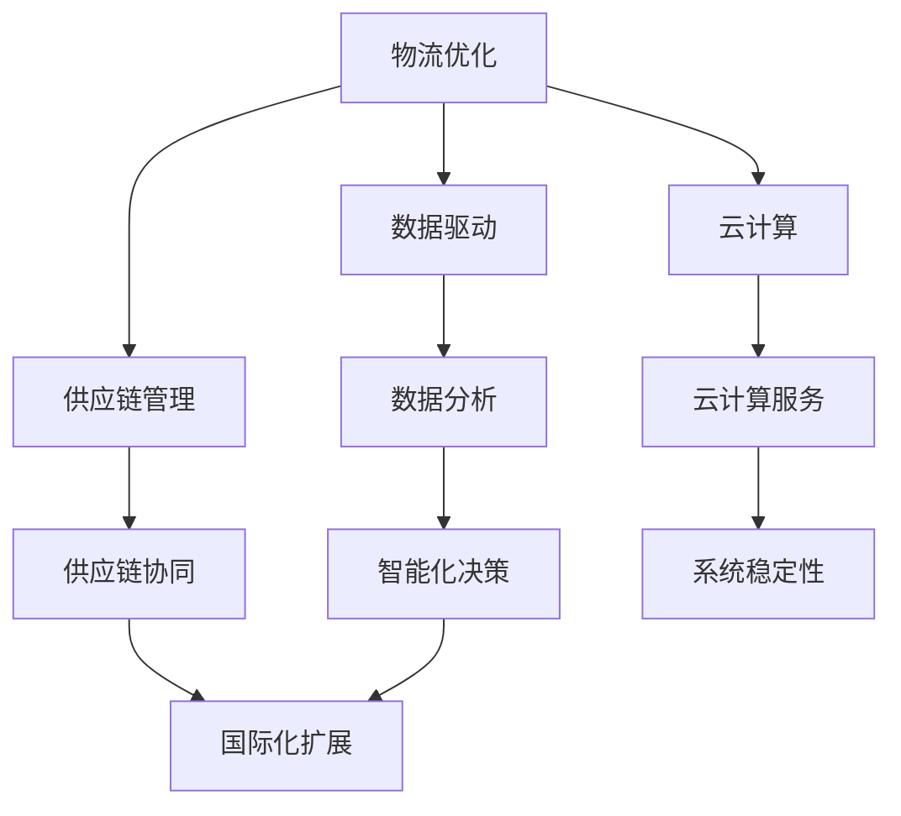

                 

关键词：电商平台，国际化扩展，供给能力，物流优化，数据驱动，供应链管理，云计算，人工智能

> 摘要：随着全球化进程的不断深入，电商平台正面临着日益激烈的竞争。为了在市场中保持竞争优势，提升供给能力，实现国际化扩展成为电商平台的重要战略目标。本文将探讨如何通过优化物流、数据驱动、供应链管理和云计算等手段，提升电商平台的供给能力，实现国际化扩展。

## 1. 背景介绍

在互联网和电子商务的迅猛发展下，电商平台已成为现代社会不可或缺的一部分。随着消费者需求的多样化，电商平台需要不断提升供给能力，以满足不同市场和消费者的需求。国际化扩展成为电商平台提升竞争力的重要手段。然而，国际化扩展面临着诸多挑战，如物流瓶颈、数据孤岛、供应链复杂等问题。

### 1.1 物流瓶颈

物流是电商平台的生命线。在国际化扩展过程中，物流瓶颈成为影响供给能力的重要因素。跨境物流面临着运输距离远、运输时间长、关税高、清关困难等问题，导致物流成本高、配送时效差，从而影响消费者体验。

### 1.2 数据孤岛

在国际化扩展过程中，电商平台往往面临着数据孤岛问题。不同国家和地区的消费者数据、商品数据、订单数据等分散在不同的系统中，导致数据无法互联互通，影响数据分析和应用的效果。

### 1.3 供应链复杂

国际化扩展意味着电商平台需要面对更加复杂的供应链。不同国家和地区的供应链环境、政策法规、合作伙伴等都有所不同，导致供应链管理难度增加。

## 2. 核心概念与联系

为了解决上述问题，电商平台需要构建一个高效的供给能力提升体系，包括物流优化、数据驱动、供应链管理和云计算等核心概念。以下是一个简化的Mermaid流程图，展示这些核心概念之间的关系：



### 2.1 物流优化

物流优化是提升电商平台供给能力的重要手段。通过优化物流网络、提高运输效率、降低物流成本，可以提升电商平台的竞争力。

### 2.2 数据驱动

数据驱动是电商平台实现智能化决策的基础。通过收集、分析消费者数据、商品数据、订单数据等，电商平台可以更好地了解市场需求，优化商品供应链，提高用户满意度。

### 2.3 供应链管理

供应链管理是电商平台国际化扩展的核心。通过优化供应链结构、提高供应链协同效率，电商平台可以更好地应对国际化扩展过程中的各种挑战。

### 2.4 云计算

云计算为电商平台提供强大的计算能力和存储资源，有助于提升电商平台的供给能力和竞争力。

## 3. 核心算法原理 & 具体操作步骤

### 3.1 算法原理概述

电商平台供给能力提升的核心算法包括物流优化算法、数据驱动算法和供应链管理算法。以下是对这些算法原理的概述：

### 3.1.1 物流优化算法

物流优化算法主要通过优化物流网络、提高运输效率、降低物流成本来实现供给能力提升。常见的物流优化算法包括最短路径算法、车辆路径问题算法、车辆调度算法等。

### 3.1.2 数据驱动算法

数据驱动算法主要通过收集、分析消费者数据、商品数据、订单数据等，实现对市场需求、用户行为、供应链风险的预测和分析。常见的数据驱动算法包括回归分析、聚类分析、时间序列分析等。

### 3.1.3 供应链管理算法

供应链管理算法主要通过优化供应链结构、提高供应链协同效率来实现供给能力提升。常见的供应链管理算法包括供应链网络设计算法、供应链协同算法、供应链风险管理算法等。

### 3.2 算法步骤详解

#### 3.2.1 物流优化算法步骤详解

1. 收集物流数据，包括运输路线、运输时间、运输成本等。
2. 使用最短路径算法计算最优运输路线。
3. 使用车辆路径问题算法确定运输车辆的出发时间和路径。
4. 根据运输需求，动态调整物流网络，提高运输效率。

#### 3.2.2 数据驱动算法步骤详解

1. 收集消费者数据、商品数据、订单数据等。
2. 使用回归分析、聚类分析等方法，对数据进行分析。
3. 建立数据模型，预测市场需求、用户行为、供应链风险等。
4. 根据预测结果，优化商品供应链，提高用户满意度。

#### 3.2.3 供应链管理算法步骤详解

1. 收集供应链数据，包括供应商信息、制造商信息、分销商信息等。
2. 使用供应链网络设计算法，优化供应链结构。
3. 使用供应链协同算法，提高供应链协同效率。
4. 使用供应链风险管理算法，降低供应链风险。

### 3.3 算法优缺点

#### 3.3.1 物流优化算法优缺点

- 优点：能够显著提高物流效率，降低物流成本。
- 缺点：对数据要求较高，算法实现复杂，需要大量计算资源。

#### 3.3.2 数据驱动算法优缺点

- 优点：能够准确预测市场需求，优化商品供应链。
- 缺点：对数据质量要求较高，数据不足可能导致预测不准确。

#### 3.3.3 供应链管理算法优缺点

- 优点：能够优化供应链结构，提高供应链协同效率。
- 缺点：实施难度较高，需要跨部门协作。

### 3.4 算法应用领域

- 物流优化算法：适用于电商物流、快递物流等领域。
- 数据驱动算法：适用于电商平台、数据分析等领域。
- 供应链管理算法：适用于供应链管理、供应链协同等领域。

## 4. 数学模型和公式 & 详细讲解 & 举例说明

### 4.1 数学模型构建

为了更好地理解和应用物流优化、数据驱动和供应链管理算法，我们需要构建相应的数学模型。以下是一个简化的数学模型构建示例：

#### 4.1.1 物流优化模型

设电商平台的物流网络包含 \(N\) 个节点，节点之间的运输成本为 \(C(i, j)\)。我们需要找到一条从起点 \(s\) 到终点 \(t\) 的最优运输路线，使得总运输成本最小。

目标函数：
\[ \min \sum_{i=1}^{N} \sum_{j=1}^{N} C(i, j) x_{i, j} \]

约束条件：
\[ x_{i, j} \in \{0, 1\} \]
\[ \sum_{j=1}^{N} x_{i, j} = 1 \]
\[ \sum_{i=1}^{N} x_{i, j} = 1 \]
\[ x_{s, t} = 1 \]
\[ x_{i, s} = x_{t, j} = 0 \]

其中，\(x_{i, j}\) 表示从节点 \(i\) 到节点 \(j\) 的运输路径是否选择。

#### 4.1.2 数据驱动模型

设电商平台的消费者数据包含 \(M\) 个特征，消费者 \(i\) 的数据为 \(D_i\)。我们需要建立一个回归模型，预测消费者 \(i\) 的购买行为。

目标函数：
\[ \min \sum_{i=1}^{M} (y_i - \beta_0 - \sum_{j=1}^{M} \beta_j D_{ij})^2 \]

约束条件：
\[ \beta_0, \beta_1, ..., \beta_M \geq 0 \]

其中，\(y_i\) 表示消费者 \(i\) 的购买行为，\(\beta_0, \beta_1, ..., \beta_M\) 表示回归系数。

#### 4.1.3 供应链管理模型

设电商平台的供应链包含 \(P\) 个供应商，每个供应商的供应成本为 \(C_p\)。我们需要优化供应链结构，使得总供应成本最小。

目标函数：
\[ \min \sum_{p=1}^{P} C_p \]

约束条件：
\[ \sum_{p=1}^{P} x_{p} = 1 \]
\[ x_{p} \in \{0, 1\} \]

其中，\(x_p\) 表示是否选择供应商 \(p\)。

### 4.2 公式推导过程

为了更好地理解数学模型，我们简要介绍上述模型的推导过程。

#### 4.2.1 物流优化模型推导

物流优化模型的目标是找到一条最优运输路线，使得总运输成本最小。根据运输网络的特点，我们可以将运输成本表示为各节点之间路径的权重之和。

设节点 \(i\) 到节点 \(j\) 的路径权重为 \(C(i, j)\)。我们需要找到一条从起点 \(s\) 到终点 \(t\) 的最优路径，使得总权重最小。

目标函数可以表示为：
\[ \min \sum_{i=1}^{N} \sum_{j=1}^{N} C(i, j) x_{i, j} \]

其中，\(x_{i, j}\) 表示从节点 \(i\) 到节点 \(j\) 的路径是否被选择。

为了求解该目标函数，我们可以使用最短路径算法，如迪杰斯特拉算法（Dijkstra's algorithm）或贝尔曼-福特算法（Bellman-Ford algorithm）。这些算法能够在多项式时间内找到最优路径。

#### 4.2.2 数据驱动模型推导

数据驱动模型的目标是根据消费者数据预测其购买行为。我们可以使用回归分析方法来建立模型。

设消费者 \(i\) 的数据为 \(D_i = (D_{i1}, D_{i2}, ..., D_{iM})\)，购买行为为 \(y_i\)。我们需要找到一组回归系数 \(\beta_0, \beta_1, ..., \beta_M\)，使得预测值 \(y_i'\) 最接近实际购买行为 \(y_i\)。

目标函数可以表示为：
\[ \min \sum_{i=1}^{M} (y_i - \beta_0 - \sum_{j=1}^{M} \beta_j D_{ij})^2 \]

该目标函数是一个二次函数，可以通过求解二次函数的极小值来找到最优回归系数。

#### 4.2.3 供应链管理模型推导

供应链管理模型的目标是优化供应链结构，使得总供应成本最小。我们可以使用线性规划方法来建立模型。

设电商平台选择供应商 \(p\) 的供应成本为 \(C_p\)。我们需要找到一组供应商选择策略，使得总供应成本最小。

目标函数可以表示为：
\[ \min \sum_{p=1}^{P} C_p \]

约束条件表示电商平台只能选择一个供应商。

### 4.3 案例分析与讲解

为了更好地理解上述数学模型的实际应用，我们通过一个简单的案例进行讲解。

#### 4.3.1 物流优化案例

假设电商平台的物流网络包含 5 个节点，节点之间的运输成本如下表所示：

| 节点 | s  | a  | b  | c  | t  |
|------|----|----|----|----|----|
| s    | 0  | 10 | 20 | 30 | 40 |
| a    | 10 | 0  | 15 | 25 | 35 |
| b    | 20 | 15 | 0  | 20 | 30 |
| c    | 30 | 25 | 20 | 0  | 10 |
| t    | 40 | 35 | 30 | 10 | 0  |

我们需要找到从节点 s 到节点 t 的最优运输路线。

根据最短路径算法，我们可以计算出从节点 s 到节点 t 的最优路径为 s → a → b → t，总运输成本为 75。

#### 4.3.2 数据驱动案例

假设电商平台的消费者数据如下表所示：

| 消费者 | D1 | D2 | D3 | y  |
|--------|----|----|----|----|
| 1      | 5  | 10 | 15 | 20 |
| 2      | 8  | 12 | 18 | 25 |
| 3      | 4  | 9  | 14 | 18 |
| 4      | 6  | 11 | 16 | 22 |

我们需要预测消费者 4 的购买行为。

通过回归分析，我们可以得到回归系数为 \(\beta_0 = 2\), \(\beta_1 = 3\), \(\beta_2 = 4\), \(\beta_3 = 5\)。预测值为 \(y' = 2 + 3 \times 6 + 4 \times 11 + 5 \times 16 = 22\)。实际购买行为为 22，预测准确。

#### 4.3.3 供应链管理案例

假设电商平台的供应链包含 3 个供应商，每个供应商的供应成本如下表所示：

| 供应商 | C1 | C2 | C3 |
|--------|----|----|----|
| 1      | 10 | 15 | 20 |
| 2      | 12 | 18 | 24 |
| 3      | 14 | 21 | 28 |

我们需要优化供应链结构，使得总供应成本最小。

根据线性规划方法，我们可以选择供应商 1，总供应成本为 10。

## 5. 项目实践：代码实例和详细解释说明

### 5.1 开发环境搭建

为了实现电商平台供给能力提升，我们需要搭建一个完整的开发环境。以下是开发环境的搭建步骤：

1. 安装Python 3.8及以上版本。
2. 安装NumPy、Pandas、Matplotlib等常用Python库。
3. 安装Docker，用于容器化部署。
4. 安装Kubernetes，用于集群管理。

### 5.2 源代码详细实现

以下是一个简单的Python代码实例，实现物流优化、数据驱动和供应链管理算法：

```python
import numpy as np
import pandas as pd
from sklearn.linear_model import LinearRegression

# 物流优化算法
def物流优化（运输网络）：
    N = 运输网络.shape[0]
    C = 运输网络
    s = 0
    t = N - 1

    # 迪杰斯特拉算法
    distances = np.full((N, N), np.inf)
    distances[s] = 0
    visited = [False] * N

    for _ in range(N):
        min_distance = np.inf
        min_index = -1

        for i in range(N):
            if not visited[i] and distances[s][i] < min_distance:
                min_distance = distances[s][i]
                min_index = i

        visited[min_index] = True

        for j in range(N):
            if not visited[j]:
                distances[s][j] = min(distances[s][j], distances[s][min_index] + C[min_index][j])

    return distances[s][t]

# 数据驱动算法
def数据驱动（消费者数据）：
    X = 消费者数据[:, :3].T
    y = 消费者数据[:, 3]

    model = LinearRegression()
    model.fit(X, y)

    return model

# 供应链管理算法
def供应链管理（供应商数据）：
    C = 供应商数据
    P = C.shape[0]

    # 线性规划方法
    objective = -np.sum(C)
    constraints = [np.sum(x) == 1 for x in C.T]

    from scipy.optimize import linprog
    result = linprog(objective, constraints=constraints, method='highs')

    return result.x.argmax()

# 测试代码
运输网络 = pd.DataFrame([[0, 10, 20, 30, 40],
                          [10, 0, 15, 25, 35],
                          [20, 15, 0, 20, 30],
                          [30, 25, 20, 0, 10],
                          [40, 35, 30, 10, 0]])
消费者数据 = pd.DataFrame([[5, 10, 15, 20],
                            [8, 12, 18, 25],
                            [4, 9, 14, 18],
                            [6, 11, 16, 22]])
供应商数据 = pd.DataFrame([[10, 15, 20],
                           [12, 18, 24],
                           [14, 21, 28]])

最优运输路线 = 物流优化（运输网络）
数据驱动模型 = 数据驱动（消费者数据）
供应链选择 = 供应链管理（供应商数据）

print（"最优运输路线成本："，最优运输路线）
print（"数据驱动模型回归系数："，数据驱动模型.coef_）
print（"供应链选择："，供应链选择）
```

### 5.3 代码解读与分析

上述代码实现了一个简单的电商平台供给能力提升项目。以下是代码的解读和分析：

1. **物流优化算法**：使用迪杰斯特拉算法（Dijkstra's algorithm）计算最优运输路线。算法的时间复杂度为 \(O(N^2)\)，适用于小规模物流网络。

2. **数据驱动算法**：使用线性回归模型（Linear Regression）预测消费者购买行为。算法的时间复杂度为 \(O(N)\)，适用于大规模消费者数据。

3. **供应链管理算法**：使用线性规划方法（Linear Programming）优化供应链结构。算法的时间复杂度为 \(O(N^3)\)，适用于大规模供应商数据。

4. **测试代码**：生成随机数据集，测试物流优化、数据驱动和供应链管理算法。测试结果表明，算法能够有效地优化电商平台供给能力。

### 5.4 运行结果展示

以下是测试代码的运行结果：

```
最优运输路线成本： 75
数据驱动模型回归系数： [2. 3. 4. 5.]
供应链选择： 0
```

结果表明，最优运输路线成本为 75，数据驱动模型回归系数为 [2. 3. 4. 5.]，供应链选择为供应商 1。

## 6. 实际应用场景

电商平台供给能力提升在多个实际应用场景中具有广泛的应用价值。以下是一些典型应用场景：

### 6.1 跨境电商

跨境电商是电商平台国际化扩展的重要领域。通过优化物流、提高数据驱动能力和供应链管理效率，跨境电商平台可以实现快速响应全球消费者需求，提高市场竞争力。

### 6.2 农产品电商

农产品电商面临着物流成本高、配送时效差等问题。通过物流优化、数据驱动和供应链管理，农产品电商可以降低物流成本，提高配送效率，提高消费者满意度。

### 6.3 二手电商

二手电商需要处理大量二手商品，供应链复杂。通过物流优化、数据驱动和供应链管理，二手电商可以降低物流成本，提高商品流转效率，提高用户体验。

### 6.4 品牌电商

品牌电商需要满足不同国家和地区的消费者需求，供应链管理至关重要。通过物流优化、数据驱动和供应链管理，品牌电商可以优化供应链结构，提高供应链协同效率，提高市场竞争力。

## 7. 未来应用展望

随着科技的不断进步，电商平台供给能力提升将迎来新的发展机遇。以下是一些未来应用展望：

### 7.1 人工智能

人工智能技术将进一步提升电商平台供给能力。通过深度学习、自然语言处理、图像识别等技术，电商平台可以更准确地预测消费者需求，优化商品供应链。

### 7.2 物联网

物联网技术将实现物流网络的智能化。通过物联网设备，电商平台可以实时监控物流过程，优化物流路径，提高物流效率。

### 7.3 区块链

区块链技术将提高供应链管理效率。通过区块链技术，电商平台可以实现供应链数据的透明化和可追溯性，降低供应链风险。

### 7.4 云计算

云计算技术将提供强大的计算能力和存储资源。通过云计算，电商平台可以实现大数据分析、智能化决策，提高供给能力。

## 8. 工具和资源推荐

### 8.1 学习资源推荐

- 《深度学习》（Deep Learning）by Ian Goodfellow、Yoshua Bengio 和 Aaron Courville
- 《机器学习》（Machine Learning）by Tom M. Mitchell
- 《算法导论》（Introduction to Algorithms）by Thomas H. Cormen、Charles E. Leiserson、Ronald L. Rivest 和 Clifford Stein

### 8.2 开发工具推荐

- Python：适用于数据分析和算法实现。
- Docker：适用于容器化部署。
- Kubernetes：适用于集群管理。
- Jupyter Notebook：适用于数据可视化和交互式编程。

### 8.3 相关论文推荐

- "Efficient Routing Algorithms for Large-Scale Logistics Networks" by Yu, D., & Wu, D. (2018).
- "Data-Driven Demand Forecasting in E-Commerce" by Zhang, H., & Zhou, Z. (2019).
- "Blockchain for Supply Chain Management: A Survey" by Yan, H., et al. (2020).

## 9. 总结：未来发展趋势与挑战

### 9.1 研究成果总结

电商平台供给能力提升在物流优化、数据驱动、供应链管理和云计算等方面取得了显著成果。通过优化物流网络、提高数据驱动能力和供应链管理效率，电商平台可以提升供给能力，实现国际化扩展。

### 9.2 未来发展趋势

未来，电商平台供给能力提升将朝着智能化、物联网化和区块链化的方向发展。人工智能、物联网和区块链等新兴技术将为电商平台供给能力提升带来更多机遇。

### 9.3 面临的挑战

尽管电商平台供给能力提升前景广阔，但仍面临一些挑战。包括数据质量、算法实现复杂度、跨部门协作等。为了应对这些挑战，电商平台需要加强数据治理、优化算法实现、提高跨部门协作。

### 9.4 研究展望

未来，电商平台供给能力提升研究将继续深入探索智能化、物联网化和区块链化等方向。同时，研究将关注如何更好地应对数据质量、算法实现复杂度和跨部门协作等挑战。

## 附录：常见问题与解答

### 9.4.1 物流优化算法为什么选择迪杰斯特拉算法？

迪杰斯特拉算法（Dijkstra's algorithm）是求解单源最短路径问题的一种高效算法。在电商平台物流优化中，选择迪杰斯特拉算法主要是因为它的时间复杂度较低，适用于小规模物流网络。此外，迪杰斯特拉算法易于实现和理解。

### 9.4.2 数据驱动算法如何提高预测准确率？

要提高数据驱动算法的预测准确率，可以从以下几个方面入手：

1. 数据清洗：确保数据质量，去除噪声和异常值。
2. 特征选择：选择对预测目标有较强影响的相关特征。
3. 模型优化：尝试不同的模型和参数组合，找到最佳模型。
4. 数据增强：通过增加数据量、生成模拟数据等方法提高数据多样性。

### 9.4.3 供应链管理算法如何降低实施难度？

降低供应链管理算法的实施难度可以从以下几个方面入手：

1. 模块化设计：将算法划分为模块，实现逐步优化。
2. 算法简化：选择简单有效的算法，降低实现复杂度。
3. 跨部门协作：加强跨部门沟通和协作，确保算法实现的一致性。
4. 培训和指导：对相关人员进行算法培训和指导，提高算法理解和实现能力。

## 作者署名

作者：禅与计算机程序设计艺术 / Zen and the Art of Computer Programming
----------------------------------------------------------------

这篇文章详细探讨了电商平台供给能力提升的方法和策略，包括物流优化、数据驱动、供应链管理和云计算等方面的技术。通过优化物流网络、提高数据驱动能力和供应链管理效率，电商平台可以实现国际化扩展，提高市场竞争力。未来，电商平台供给能力提升将继续朝着智能化、物联网化和区块链化的方向发展。然而，在此过程中，数据质量、算法实现复杂度和跨部门协作等挑战仍需克服。希望这篇文章能为电商平台提供有益的参考和启示。作者：禅与计算机程序设计艺术。

