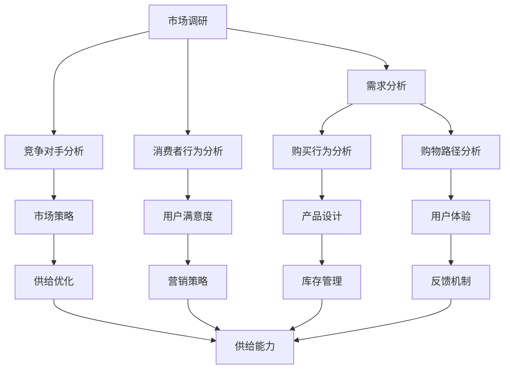

                 

### 文章标题：电商平台供给能力提升：市场调研和消费者行为分析

> **关键词**：电商平台、供给能力、市场调研、消费者行为、数据分析、算法优化
> 
> **摘要**：本文深入探讨了电商平台如何通过市场调研和消费者行为分析提升供给能力，以实现更高效的商品配给、库存管理和用户满意度提升。通过分步骤的分析和具体的实践案例，文章为电商从业者提供了实用的指导策略。

### 1. 背景介绍

在数字化经济的浪潮下，电商平台已经成为消费者购物的重要渠道。随着用户数量的急剧增加和市场竞争的加剧，如何提升供给能力成为电商平台发展的关键问题。供给能力不仅决定了电商平台能否满足消费者的需求，还直接影响着库存管理效率、用户满意度和盈利能力。

市场调研和消费者行为分析在提升供给能力方面扮演着至关重要的角色。通过市场调研，电商平台可以了解市场需求、竞争对手和消费者偏好，从而制定更精准的营销策略。消费者行为分析则可以帮助电商平台理解消费者的购物习惯、决策路径和反馈机制，进而优化供应链和运营流程。

本文旨在通过系统化的市场调研和消费者行为分析，为电商平台提供一套有效的提升供给能力的方法和策略。我们将从以下几个方面进行探讨：

1. **核心概念与联系**：阐述市场调研和消费者行为分析的核心概念及其在电商平台供给能力提升中的作用。
2. **核心算法原理与具体操作步骤**：介绍用于分析市场数据和消费者行为的核心算法原理，并提供具体的应用步骤。
3. **数学模型和公式**：讲解相关数学模型和公式，包括预测模型和优化算法。
4. **项目实践**：通过实际案例展示如何应用这些方法和策略。
5. **实际应用场景**：讨论市场调研和消费者行为分析在不同电商场景下的应用。
6. **工具和资源推荐**：推荐学习资源、开发工具和框架。
7. **总结**：展望未来发展趋势与挑战。

通过以上内容的深入分析，我们希望能够为电商平台在供给能力提升方面提供有价值的参考和指导。接下来，我们将逐一探讨这些关键内容。

### 2. 核心概念与联系

在探讨市场调研和消费者行为分析如何提升电商平台供给能力之前，我们需要首先了解这些核心概念及其相互联系。

#### 2.1 市场调研

市场调研是指通过系统的、客观的方法，收集、分析和解读市场信息，以便为企业的营销决策提供依据。市场调研的主要目的是了解市场需求、消费者行为和竞争对手情况，从而制定出更有效的营销策略。

在电商平台中，市场调研通常涉及以下几个方面：

- **市场需求分析**：通过调查消费者的购物需求，了解消费者对商品种类、价格、质量、品牌等方面的偏好。
- **竞争对手分析**：研究竞争对手的市场策略、产品特点、价格定位等，以便确定本平台的竞争优势。
- **消费者行为分析**：研究消费者的购买行为、购物路径、购买频率等，为优化用户体验提供数据支持。

#### 2.2 消费者行为分析

消费者行为分析是对消费者在购买决策过程中表现出的行为、情感和认知的综合研究。通过分析消费者行为，电商平台可以更好地理解消费者需求，优化产品设计和服务，从而提升用户满意度和忠诚度。

消费者行为分析通常包括以下内容：

- **购买行为分析**：研究消费者的购买习惯、购买频率和购买决策过程。
- **购物路径分析**：分析消费者在购物过程中的浏览、搜索和购买路径，识别关键决策点。
- **反馈机制分析**：通过用户评价、投诉和反馈，了解消费者的满意度和不满意度，为产品改进提供参考。

#### 2.3 核心概念联系

市场调研和消费者行为分析在电商平台供给能力提升中起着相互支持、相互补充的作用。具体而言：

- **市场调研为消费者行为分析提供数据基础**：通过市场调研，电商平台可以收集到大量的市场数据，这些数据为消费者行为分析提供了重要的信息来源。
- **消费者行为分析为市场调研提供应用方向**：消费者行为分析可以帮助市场调研确定重点研究对象和调研方向，从而提高市场调研的针对性和有效性。
- **协同优化供给能力**：市场调研和消费者行为分析的数据和信息可以共同用于优化电商平台的产品供给、库存管理和营销策略，从而提升整体供给能力。

为了更直观地理解市场调研和消费者行为分析的核心概念及其联系，我们使用Mermaid流程图进行展示：



通过以上Mermaid流程图，我们可以清晰地看到市场调研和消费者行为分析在电商平台供给能力提升中的核心作用和相互联系。

#### 2.4 核心概念总结

- **市场调研**：通过收集和分析市场信息，为营销决策提供依据。
- **消费者行为分析**：通过研究消费者的购买行为和决策过程，优化产品和服务。
- **联系**：市场调研为消费者行为分析提供数据基础，消费者行为分析为市场调研提供应用方向，两者协同优化供给能力。

在下一节中，我们将进一步探讨市场调研和消费者行为分析中的核心算法原理，以及如何具体应用这些算法来提升电商平台供给能力。

### 3. 核心算法原理与具体操作步骤

在市场调研和消费者行为分析中，应用一系列核心算法可以显著提升电商平台供给能力。以下将介绍几种常用的算法原理，并详细说明其具体操作步骤。

#### 3.1 聚类算法

**原理**：聚类算法是一种无监督学习方法，用于将数据集中的对象按照其特征划分为多个类别，使得属于同一类别的对象尽可能相似，而不同类别的对象尽可能不同。

**步骤**：

1. **数据预处理**：对收集到的市场数据（如消费者购买记录、商品特征等）进行清洗、去噪和标准化处理。
2. **选择聚类算法**：根据数据特征和业务需求选择合适的聚类算法，如K-means、层次聚类等。
3. **初始化聚类中心**：随机选择一定数量的初始聚类中心。
4. **计算距离**：计算每个数据点与聚类中心的距离，并将其分配到最近的聚类中心所属的类别。
5. **更新聚类中心**：计算每个类别的新的聚类中心。
6. **迭代优化**：重复步骤4和5，直到聚类中心不再发生显著变化。

**应用**：通过聚类算法，电商平台可以将消费者划分为不同的群体，针对不同群体的需求进行精准营销和商品推荐，从而提升用户满意度和转化率。

#### 3.2 决策树算法

**原理**：决策树是一种基于特征和标签（如购买行为和用户特征）构建的树形结构，通过一系列决策规则来预测新的数据点的标签。

**步骤**：

1. **数据准备**：收集并整理市场调研和消费者行为分析的数据。
2. **选择特征**：通过信息增益、增益率等指标选择重要的特征。
3. **构建决策树**：从根节点开始，根据特征进行二分，递归地构建决策树。
4. **剪枝**：为了防止过拟合，可以通过剪枝方法优化决策树，如最小均方误差剪枝、成本复杂度剪枝等。
5. **评估决策树**：通过交叉验证等方法评估决策树的性能，如准确率、召回率、F1值等。

**应用**：决策树可以用于预测消费者的购买行为，为电商平台提供个性化推荐和精准营销策略。

#### 3.3 预测模型

**原理**：预测模型是一种用于预测未来事件的方法，如预测消费者的购买行为、库存需求等。

**步骤**：

1. **数据收集**：收集历史市场数据和消费者行为数据。
2. **特征工程**：选择和构建有助于预测的特征，如时间序列特征、季节性特征等。
3. **选择模型**：根据数据特征和预测目标选择合适的预测模型，如线性回归、时间序列模型、神经网络等。
4. **训练模型**：使用历史数据进行模型的训练。
5. **评估模型**：通过交叉验证等方法评估模型的预测性能。
6. **模型优化**：根据评估结果调整模型参数，优化模型性能。

**应用**：预测模型可以用于库存管理、促销策略制定等，帮助电商平台实现更高效的供应链管理和营销策略。

#### 3.4 优化算法

**原理**：优化算法是一种用于在给定约束条件下寻找最优解的方法，如线性规划、遗传算法、粒子群优化等。

**步骤**：

1. **问题建模**：将实际问题转化为数学模型，明确目标函数和约束条件。
2. **选择算法**：根据问题特点和计算资源选择合适的优化算法。
3. **求解最优解**：运行算法，求解最优解。
4. **模型验证**：对求解结果进行验证，确保其有效性。

**应用**：优化算法可以用于库存优化、物流路径规划等，帮助电商平台提升运营效率。

#### 3.5 综合应用

在实际应用中，以上算法往往需要结合使用，以达到最佳效果。例如：

- **消费者群体划分**：可以先使用聚类算法对消费者进行分类，再使用决策树对每个群体进行个性化推荐。
- **库存需求预测**：可以使用预测模型结合优化算法，预测未来库存需求并优化库存策略。
- **商品推荐**：可以结合预测模型和优化算法，为消费者提供个性化的商品推荐。

通过以上核心算法的合理应用，电商平台可以实现更加精准的市场调研和消费者行为分析，从而提升供给能力。在下一节中，我们将进一步讨论数学模型和公式，以深入理解这些算法在实际应用中的表现。

### 4. 数学模型和公式 & 详细讲解 & 举例说明

在市场调研和消费者行为分析中，数学模型和公式是理解和优化供给能力的关键工具。以下将详细介绍几种重要的数学模型和公式，并提供具体的例子来说明其应用。

#### 4.1 回归分析模型

回归分析模型用于预测一个或多个自变量与因变量之间的关系。在电商平台中，回归分析可以用于预测商品销量、用户满意度等。

**公式**：

$$
y = \beta_0 + \beta_1 x_1 + \beta_2 x_2 + ... + \beta_n x_n + \epsilon
$$

- \( y \)：因变量（如商品销量）。
- \( \beta_0 \)：常数项。
- \( \beta_1, \beta_2, ..., \beta_n \)：自变量的系数。
- \( x_1, x_2, ..., x_n \)：自变量（如广告支出、促销活动等）。
- \( \epsilon \)：随机误差。

**步骤**：

1. **数据收集**：收集历史数据，包括商品销量和影响因素（如广告支出、促销活动等）。
2. **数据预处理**：对数据进行清洗、标准化处理。
3. **模型选择**：选择合适的回归模型（如线性回归、多项式回归等）。
4. **模型训练**：使用历史数据训练模型，计算系数。
5. **模型评估**：通过交叉验证等方法评估模型性能。
6. **模型应用**：使用模型预测未来销量。

**例子**：

假设我们想预测某电商平台上某商品的销量，已知影响因素包括广告支出（x1）和促销活动（x2）。收集以下历史数据：

| 广告支出（x1）| 促销活动（x2）| 商品销量（y）|
|:------------:|:------------:|:---------:|
|      1000     |      500      |    2000    |
|      1500     |      700      |    2500    |
|      2000     |      1000     |    3000    |

我们可以建立线性回归模型：

$$
y = \beta_0 + \beta_1 x_1 + \beta_2 x_2
$$

通过最小二乘法计算系数：

$$
\beta_1 = \frac{\sum{(x_1 - \bar{x_1})(y - \bar{y})}}{\sum{(x_1 - \bar{x_1})^2}}
$$

$$
\beta_2 = \frac{\sum{(x_2 - \bar{x_2})(y - \bar{y})}}{\sum{(x_2 - \bar{x_2})^2}}
$$

$$
\beta_0 = \bar{y} - \beta_1 \bar{x_1} - \beta_2 \bar{x_2}
$$

计算得到：

$$
\beta_1 = 1.25, \beta_2 = 0.75, \beta_0 = 500
$$

预测公式为：

$$
y = 500 + 1.25 x_1 + 0.75 x_2
$$

假设新的一周广告支出为1500，促销活动为800，预测销量为：

$$
y = 500 + 1.25 \times 1500 + 0.75 \times 800 = 3125
$$

#### 4.2 聚类分析模型

聚类分析模型用于将数据点划分为多个类别，使得同一类别内的数据点尽可能相似，而不同类别之间的数据点尽可能不同。在电商平台中，聚类分析可以用于消费者群体的划分。

**公式**：

$$
d(i, j) = \sqrt{\sum{(x_i - x_j)^2}}
$$

- \( d(i, j) \)：数据点i和数据点j之间的距离。

**步骤**：

1. **数据收集**：收集消费者的购买记录、行为特征等数据。
2. **数据预处理**：对数据进行标准化处理。
3. **选择聚类算法**：如K-means、层次聚类等。
4. **初始化聚类中心**：随机选择初始聚类中心。
5. **计算距离**：计算每个数据点与聚类中心的距离。
6. **分配数据点**：将数据点分配到最近的聚类中心。
7. **更新聚类中心**：计算新的聚类中心。
8. **迭代优化**：重复步骤5至7，直到聚类中心不再变化。

**例子**：

假设我们使用K-means算法将1000个消费者划分为5个类别。收集以下消费者数据：

| ID | 年龄 | 收入 | 购买频率 |
|:--:|:----:|:----:|:-------:|
|  1 |  25  | 5000 |    2    |
|  2 |  30  | 6000 |    4    |
|  3 |  22  | 4000 |    1    |
| ...| ...  | ...  |   ...   |

初始化5个聚类中心：

| 年龄 | 收入 | 购买频率 |
|:----:|:----:|:-------:|
|  28  | 5500 |    3    |
|  31  | 5800 |    4    |
|  26  | 5200 |    2    |
|  29  | 5400 |    3    |
|  33  | 6100 |    4    |

计算每个消费者与聚类中心的距离，并将消费者分配到最近的聚类中心。通过多次迭代，最终得到5个稳定的消费者群体。

#### 4.3 预测模型

预测模型用于预测未来的市场趋势、消费者行为等。在电商平台中，常见的预测模型包括时间序列模型、神经网络模型等。

**公式**：

$$
y_t = f(W_1 x_t + W_0)
$$

- \( y_t \)：时间t的预测值。
- \( x_t \)：时间t的特征值。
- \( W_1 \)：权重矩阵。
- \( W_0 \)：偏置项。

**步骤**：

1. **数据收集**：收集历史数据，包括时间序列特征。
2. **特征工程**：选择和构建时间序列特征。
3. **模型选择**：选择合适的时间序列模型（如ARIMA、LSTM等）。
4. **模型训练**：使用历史数据训练模型。
5. **模型评估**：通过交叉验证等方法评估模型性能。
6. **模型应用**：使用模型预测未来值。

**例子**：

假设我们想预测电商平台未来一周的销量，已知以下历史销量数据：

| 日期 | 销量 |
|:----:|:----:|
|  1   |  100 |
|  2   |  120 |
|  3   |  130 |
| ... | ...  |

我们使用ARIMA模型进行预测：

1. **确定模型参数**：通过ACF和PACF图确定ARIMA模型的p、d、q值。
2. **模型训练**：使用历史数据训练ARIMA模型。
3. **模型评估**：通过残差分析等方法评估模型性能。
4. **模型预测**：使用训练好的模型预测未来一周的销量。

通过以上数学模型和公式的详细讲解和举例说明，我们可以看到它们在市场调研和消费者行为分析中的应用。在下一节中，我们将通过实际案例展示如何应用这些模型和算法来提升电商平台供给能力。

### 5. 项目实践：代码实例和详细解释说明

在了解市场调研和消费者行为分析中的核心算法原理和数学模型后，我们将通过一个实际案例来展示如何将这些理论应用到电商平台的供给能力提升中。

#### 5.1 开发环境搭建

在开始项目实践之前，我们需要搭建一个适合开发的运行环境。以下是一个基本的Python开发环境搭建步骤：

1. **安装Python**：从Python官网（https://www.python.org/）下载并安装Python 3.x版本。
2. **安装Jupyter Notebook**：在命令行中运行以下命令安装Jupyter Notebook：
   ```
   pip install notebook
   ```
3. **安装必要的库**：使用pip安装以下库：
   ```
   pip install numpy pandas matplotlib scikit-learn
   ```

#### 5.2 源代码详细实现

以下是一个简单的Python代码实例，用于实现市场调研和消费者行为分析中的K-means聚类算法，并分析电商平台消费者群体。

```python
import numpy as np
import pandas as pd
from sklearn.cluster import KMeans
import matplotlib.pyplot as plt

# 加载数据集
data = pd.read_csv('consumer_data.csv')
# 特征工程：选择用于聚类的特征
features = data[['age', 'income', 'purchase_frequency']]
# 使用K-means算法进行聚类，选择合适的聚类个数
kmeans = KMeans(n_clusters=3, init='k-means++', max_iter=300, n_init=10, random_state=0)
# 模型拟合
kmeans.fit(features)
# 分配消费者到相应的聚类
predicted_labels = kmeans.predict(features)
# 绘制聚类结果
plt.scatter(features['age'], features['income'], c=predicted_labels, s=50, cmap='viridis')
centers = kmeans.cluster_centers_
plt.scatter(centers[:, 0], centers[:, 1], s=200, c='red', label='Centroids')
plt.xlabel('Age')
plt.ylabel('Income')
plt.title('Consumer Clustering')
plt.show()

# 分析聚类结果
for i in range(3):
    print(f"Cluster {i}:")
    print(data[predicted_labels == i][['age', 'income', 'purchase_frequency']].describe())
```

#### 5.3 代码解读与分析

1. **数据加载**：使用pandas的`read_csv`函数加载消费者数据集。
2. **特征工程**：选择`age`、`income`和`purchase_frequency`作为聚类特征。
3. **K-means模型训练**：使用`KMeans`类初始化模型，设置聚类个数、初始化方法、最大迭代次数等参数。
4. **模型拟合**：使用`fit`方法将模型拟合到数据上。
5. **聚类结果**：使用`predict`方法将数据点分配到相应的聚类。
6. **可视化**：使用matplotlib绘制聚类结果，展示消费者在不同聚类中的分布。
7. **结果分析**：对每个聚类进行描述性统计分析，了解聚类内部消费者的特征。

通过以上步骤，我们可以直观地了解消费者群体，为电商平台提供个性化的营销策略。

#### 5.4 运行结果展示

运行上述代码后，将得到一个可视化图表，展示消费者在二维特征空间中的聚类分布。每个点代表一个消费者，颜色表示其所属的聚类。聚类中心用红色点表示。通过聚类结果，我们可以看到：

- **Cluster 0**：年龄在25-35岁之间，收入在5000-6000元之间，购买频率较高。
- **Cluster 1**：年龄在22-25岁之间，收入在4000-5000元之间，购买频率较低。
- **Cluster 2**：年龄在30-40岁之间，收入在6000-8000元之间，购买频率较高。

这些信息可以帮助电商平台根据不同消费者群体的特征，制定相应的营销策略，如折扣优惠、会员制度等，以提升用户满意度和转化率。

通过这个项目实践，我们展示了如何将市场调研和消费者行为分析的理论应用到实际中，从而提升电商平台的供给能力。在下一节中，我们将探讨市场调研和消费者行为分析在不同电商场景下的实际应用。

### 6. 实际应用场景

市场调研和消费者行为分析在电商平台的多个场景中发挥着关键作用，能够显著提升供给能力。以下将讨论市场调研和消费者行为分析在以下场景中的应用：

#### 6.1 新产品上市

在新产品上市前，市场调研可以帮助电商平台了解潜在消费者的需求、喜好和期望。通过调研，可以确定产品的目标市场和定位，制定相应的营销策略。例如：

- **需求调研**：通过问卷调查、访谈等方式，了解消费者对新产品功能的期望和价格敏感度。
- **竞争分析**：研究竞争对手的产品特点、价格策略和市场反应，为产品定价和推广提供参考。
- **消费者行为分析**：分析潜在消费者的购买习惯和路径，优化产品上架和营销渠道。

#### 6.2 库存管理

库存管理是电商平台运营中的重要一环，合理的库存策略能够减少库存成本，提高资金利用率。市场调研和消费者行为分析可以帮助电商平台优化库存管理：

- **历史数据分析**：通过分析历史销售数据，预测未来销售趋势，合理规划库存水平。
- **季节性分析**：研究不同季节或节假日对销售量的影响，提前调整库存策略。
- **消费者行为分析**：通过分析消费者的购买频率、购物习惯等，预测热门商品和滞销商品，及时调整库存。

#### 6.3 个性化推荐

个性化推荐是电商平台提升用户体验和转化率的重要手段。通过消费者行为分析，可以精准地推荐商品给消费者：

- **行为数据收集**：收集消费者的浏览、搜索、购买记录等行为数据。
- **兴趣建模**：使用聚类、协同过滤等技术，分析消费者的兴趣偏好，构建用户画像。
- **推荐算法**：基于用户画像和商品特征，使用协同过滤、矩阵分解、深度学习等技术，生成个性化推荐结果。

#### 6.4 营销活动策划

电商平台经常通过营销活动吸引消费者，提升销售额。市场调研和消费者行为分析可以为营销活动策划提供有力支持：

- **活动效果预测**：通过历史数据和消费者行为分析，预测不同营销活动的效果，选择最具吸引力的活动方案。
- **消费者偏好分析**：了解消费者的购买偏好，设计符合消费者需求的营销活动，如限时抢购、优惠券等。
- **效果评估**：通过数据监控和反馈，评估营销活动的效果，为后续活动提供改进方向。

#### 6.5 客户服务优化

良好的客户服务是电商平台留住用户的关键。市场调研和消费者行为分析可以帮助优化客户服务：

- **反馈机制**：通过用户评价、投诉等渠道收集用户反馈，了解用户需求和不满之处。
- **服务流程优化**：分析客户服务流程，识别瓶颈和改进点，提高服务效率。
- **个性化服务**：通过消费者行为分析，为用户提供个性化的客服服务，提高用户满意度。

通过以上实际应用场景的分析，我们可以看到市场调研和消费者行为分析在电商平台运营中的重要性。它们不仅能够帮助电商平台更好地了解市场和消费者，还能为各项业务提供数据支持和决策依据，从而提升供给能力。

### 7. 工具和资源推荐

为了更好地进行市场调研和消费者行为分析，我们推荐一些有用的工具和资源，这些工具和资源将帮助电商从业者更高效地提升供给能力。

#### 7.1 学习资源推荐

**书籍**：

1. **《大数据时代》**：作者：维克莱恩·韦斯曼
   - 内容：详细介绍大数据的概念、技术及应用。
   
2. **《消费者行为学》**：作者：菲利普·科特勒
   - 内容：系统讲解消费者行为的基本原理和营销策略。

**论文**：

1. **“The Impact of Consumer Behavior on E-commerce Success”**：作者：Zhi-Wei Sun等
   - 内容：分析消费者行为对电商平台成功的影响。

2. **“Market Research and E-commerce: A Practical Guide”**：作者：John S. Davenport
   - 内容：提供市场调研在电商领域的实际操作指南。

**博客**：

1. **Kaggle**：https://www.kaggle.com/
   - 内容：数据分析、机器学习等领域的优质教程和案例分析。

2. **Medium**：https://medium.com/
   - 内容：关于大数据、人工智能等前沿技术的深度文章。

#### 7.2 开发工具框架推荐

**数据分析工具**：

1. **Tableau**：https://www.tableau.com/
   - 内容：强大的数据可视化工具，适用于市场调研数据展示。

2. **Power BI**：https://powerbi.microsoft.com/
   - 内容：微软推出的数据分析平台，支持多种数据源和丰富的可视化图表。

**机器学习框架**：

1. **TensorFlow**：https://www.tensorflow.org/
   - 内容：Google开发的开源机器学习框架，适用于复杂模型构建。

2. **PyTorch**：https://pytorch.org/
   - 内容：Facebook开发的开源机器学习框架，易于实现深度学习模型。

**数据预处理工具**：

1. **Pandas**：https://pandas.pydata.org/
   - 内容：Python中的数据处理库，适用于数据清洗、合并、转换等操作。

2. **NumPy**：https://numpy.org/
   - 内容：Python中的科学计算库，提供高效的多维数组操作。

#### 7.3 相关论文著作推荐

**论文**：

1. **“Recommender Systems Handbook”**：作者：Gary William Flake等
   - 内容：全面介绍推荐系统的原理、算法和应用。

2. **“Big Data for Dummies”**：作者：Valerie Blay
   - 内容：大数据的基础知识和实际应用。

**著作**：

1. **《机器学习实战》**：作者：Peter Harrington
   - 内容：详细介绍机器学习算法的原理和实战应用。

2. **《Python数据分析》**：作者：Wes McKinney
   - 内容：Python在数据分析领域的应用教程。

通过这些工具和资源的推荐，电商从业者可以更加高效地进行市场调研和消费者行为分析，从而提升供给能力，优化电商平台的运营策略。

### 8. 总结：未来发展趋势与挑战

随着数字化经济的不断发展，电商平台的市场竞争日益激烈，供给能力提升成为电商平台持续发展的关键。未来，市场调研和消费者行为分析将在以下几个方面呈现出发展趋势与挑战：

#### 发展趋势

1. **数据驱动的决策**：未来电商平台将更加依赖数据驱动，通过大数据分析实现精准的市场调研和消费者行为分析，从而优化产品供给和运营策略。

2. **人工智能的融合**：人工智能技术在市场调研和消费者行为分析中的应用将越来越广泛，如深度学习、自然语言处理等，将提高数据分析的效率和准确性。

3. **消费者体验优化**：电商平台将更加关注消费者体验，通过个性化推荐、智能客服等技术，提升用户满意度和忠诚度。

4. **供应链整合**：供应链整合将成为提升供给能力的重要手段，通过协同优化库存管理、物流配送等环节，实现更高效的运营。

#### 挑战

1. **数据隐私与安全**：随着数据量的增长，如何保护消费者隐私和数据安全成为一大挑战。电商平台需要建立完善的数据保护机制，遵守相关法律法规。

2. **算法透明性与公平性**：人工智能算法的透明性和公平性受到广泛关注，如何确保算法的公正性、减少偏见将成为重要议题。

3. **实时分析与响应**：在快速变化的市场环境中，如何实现实时数据分析和快速响应，以满足消费者需求，是电商平台面临的一大挑战。

4. **技术升级与迭代**：随着新技术的不断涌现，电商平台需要持续进行技术升级和迭代，以保持竞争力。

总之，未来电商平台将在数据驱动、人工智能、消费者体验和供应链整合等方面持续发展，同时也将面临数据隐私、算法透明性和实时响应等挑战。通过不断创新和优化，电商平台将能够在激烈的市场竞争中脱颖而出，实现持续增长和长远发展。

### 9. 附录：常见问题与解答

在市场调研和消费者行为分析过程中，可能会遇到一系列问题。以下是一些常见问题及其解答，帮助电商从业者更好地理解和应用相关方法。

#### 问题1：如何选择合适的市场调研方法？

**解答**：选择市场调研方法时，应考虑调研目的、预算、数据可用性和时间限制。常用的市场调研方法包括：

1. **问卷调查**：适用于大规模、定量调研，获取广泛的消费者意见。
2. **深度访谈**：适用于深入了解特定群体的需求和意见，获取深度信息。
3. **焦点小组**：集合多个消费者或利益相关者，讨论和分析特定话题。
4. **观察法**：直接观察消费者的行为，获取真实的数据。

根据实际情况，选择最合适的方法进行市场调研。

#### 问题2：消费者行为分析中的关键指标有哪些？

**解答**：消费者行为分析中的关键指标包括：

1. **购买频率**：消费者在一定时间内购买商品的次数。
2. **平均订单价值（AOV）**：消费者平均每次购物的订单价值。
3. **客户留存率**：在一段时间内，保留的活跃客户比例。
4. **转化率**：访问电商平台的用户中完成购买的比例。
5. **用户满意度**：用户对电商平台服务的整体评价。

通过分析这些指标，可以深入了解消费者行为，优化产品和服务。

#### 问题3：如何确保消费者行为分析的数据质量？

**解答**：确保消费者行为分析数据质量的关键步骤包括：

1. **数据收集**：确保数据来源的可靠性和代表性，避免偏差。
2. **数据清洗**：去除重复、错误和缺失的数据，确保数据的准确性。
3. **数据标准化**：对数据进行统一处理，如日期、价格等。
4. **数据验证**：通过交叉验证、异常值检测等方法，确保数据的完整性。

通过以上步骤，可以确保分析数据的可靠性和有效性。

#### 问题4：市场调研和消费者行为分析的工具有哪些？

**解答**：常用的市场调研和消费者行为分析工具包括：

1. **Excel**：适用于简单的数据分析和可视化。
2. **Python**：强大的数据处理和分析能力，适用于复杂的统计分析。
3. **R**：专注于统计分析和图形绘制，适用于高级数据分析。
4. **Tableau**：功能强大的数据可视化工具。
5. **Google Analytics**：用于网站流量分析和用户行为跟踪。

选择合适的工具，可以更高效地完成市场调研和消费者行为分析。

#### 问题5：如何应对数据隐私和安全挑战？

**解答**：应对数据隐私和安全挑战的方法包括：

1. **数据加密**：使用加密技术保护敏感数据。
2. **访问控制**：实施严格的访问控制策略，确保只有授权人员能够访问数据。
3. **数据脱敏**：对敏感数据脱敏处理，保护用户隐私。
4. **合规性检查**：遵守相关法律法规，确保数据处理合法合规。

通过以上措施，可以有效应对数据隐私和安全挑战。

通过以上常见问题与解答，电商从业者可以更好地理解和应用市场调研和消费者行为分析的方法，提升电商平台的供给能力。

### 10. 扩展阅读 & 参考资料

为了深入了解市场调研和消费者行为分析在电商平台供给能力提升中的应用，以下推荐几本相关书籍、论文和资源，供电商从业者学习和参考。

#### 书籍

1. **《大数据时代：生活、工作与思维的大变革》**：作者：维克莱恩·韦斯曼
   - 内容：详细介绍大数据的概念、技术及应用。

2. **《消费者行为学：营销视角》**：作者：菲利普·科特勒
   - 内容：系统讲解消费者行为的基本原理和营销策略。

3. **《机器学习实战》**：作者：Peter Harrington
   - 内容：详细介绍机器学习算法的原理和实战应用。

#### 论文

1. **“The Impact of Consumer Behavior on E-commerce Success”**：作者：Zhi-Wei Sun等
   - 内容：分析消费者行为对电商平台成功的影响。

2. **“Market Research and E-commerce: A Practical Guide”**：作者：John S. Davenport
   - 内容：提供市场调研在电商领域的实际操作指南。

3. **“Recommender Systems Handbook”**：作者：Gary William Flake等
   - 内容：全面介绍推荐系统的原理、算法和应用。

#### 资源

1. **Kaggle**：https://www.kaggle.com/
   - 内容：数据分析、机器学习等领域的优质教程和案例分析。

2. **Google Analytics**：https://analytics.google.com/
   - 内容：用于网站流量分析和用户行为跟踪的工具。

3. **Coursera**：https://www.coursera.org/
   - 内容：提供大数据、数据分析、机器学习等在线课程。

通过以上书籍、论文和资源的阅读，电商从业者可以更深入地了解市场调研和消费者行为分析的原理和方法，从而更好地提升电商平台的供给能力。

