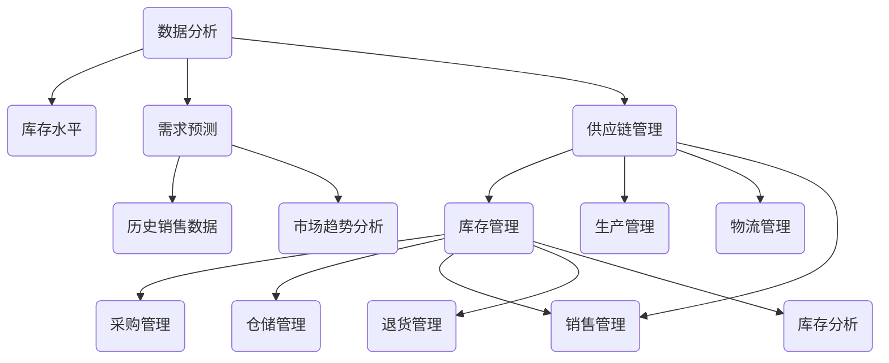

                 

### 背景介绍 Background

在现代电商行业，供给能力提升是关键竞争力之一。随着消费者需求的多样化以及线上购物的普及，电商平台需要确保商品库存的充足性，以满足用户即时购买的需求。库存管理系统的应用，是提升电商平台供给能力的核心技术手段之一。它不仅能够提高库存的周转效率，还能有效降低库存成本，从而提升整体运营效率。

库存管理系统的重要性主要体现在以下几个方面：

1. **库存优化**：通过实时监控库存水平，预测未来需求，优化库存配置，避免因库存过剩导致的资金占用和仓储成本增加，以及因库存不足导致的订单丢失和客户满意度下降。

2. **需求预测**：利用历史销售数据、市场趋势分析、季节性需求等因素，预测未来的销售趋势，从而合理安排进货计划，确保货源充足。

3. **供应链整合**：库存管理系统可以与供应链管理系统集成，实现从供应商到生产、仓储、物流，再到销售的全程监控，提升供应链的协同效率。

4. **成本控制**：通过优化库存水平，减少库存积压和商品损耗，降低库存持有成本，提高资金使用效率。

5. **风险规避**：通过对市场动态的实时监控，及时应对市场变化，减少因库存不足或过剩带来的风险。

然而，传统的库存管理系统存在一些问题。例如，数据采集和处理效率低，难以满足大规模电商平台的实时需求；预测模型单一，难以适应复杂多变的市场环境；系统集成性差，信息孤岛现象严重，影响供应链协同效率。这些问题使得传统库存管理系统在提升供给能力方面存在一定的局限性。

因此，为了应对电商行业的快速发展，我们需要一种更为高效、智能的库存管理系统，以满足现代电商平台的供给需求。本文将深入探讨这种系统的工作原理、核心算法、数学模型以及实际应用场景，帮助读者全面了解库存管理系统在电商平台供给能力提升中的作用。

### 核心概念与联系 Core Concepts and Relationships

要深入理解库存管理系统，我们首先需要明确几个核心概念，并了解它们之间的相互关系。

#### 库存管理 Inventory Management

库存管理是指对库存的进、出、存等各个环节进行有效控制，以达到最优库存水平的过程。其核心目标是确保库存既能满足市场需求，又不会导致过多的资金占用和仓储成本。库存管理涉及多个关键环节，包括采购管理、仓储管理、销售管理、退货管理以及库存分析。

#### 库存水平 Inventory Level

库存水平是指企业当前拥有的库存数量。它是库存管理的基础数据，直接影响到库存优化和需求预测的准确性。库存水平通常分为静态库存和动态库存。静态库存是指在某一时间点上，企业仓库中未销售的商品总量；动态库存则是指随着销售和进货活动不断变化的库存量。

#### 需求预测 Demand Forecasting

需求预测是基于历史销售数据、市场趋势分析以及各种影响因素，对未来的销售趋势进行预测。准确的需求预测是库存优化的关键，可以帮助企业合理安排采购和库存配置，避免库存过剩或不足。

#### 供应链管理 Supply Chain Management

供应链管理涉及从原材料采购到产品制造、仓储、配送，再到最终销售的整个流程。库存管理系统与供应链管理系统紧密集成，可以实现供应链各环节的信息共享和协同作业，提高供应链的整体效率。

#### 数据分析 Data Analysis

数据分析是库存管理系统的重要工具，通过收集、处理和分析大量数据，可以揭示出潜在的市场趋势和库存问题，为决策提供数据支持。

#### 核心概念原理与架构 Mermaid 流程图

为了更清晰地展示这些核心概念及其关系，我们可以使用Mermaid流程图来表示。



以上流程图展示了库存管理系统中各个核心概念及其相互关系。库存管理不仅涉及内部各个环节的协调，还需要与供应链管理和数据分析紧密配合，从而实现高效的库存优化和需求预测。

通过以上对核心概念和架构的介绍，我们为后续章节深入探讨库存管理系统的算法原理、数学模型和实际应用场景奠定了基础。

### 核心算法原理 & 具体操作步骤 Core Algorithm Principles & Step-by-Step Procedures

库存管理系统中的核心算法通常包括需求预测算法、库存优化算法和库存周转率计算方法。这些算法共同作用，帮助电商平台实现高效的库存管理。以下将分别介绍这些算法的基本原理和具体操作步骤。

#### 需求预测算法 Demand Forecasting Algorithm

需求预测是库存管理的核心环节，它直接影响库存优化和供应链效率。常见的需求预测算法包括移动平均法（MA）、指数平滑法（ES）和ARIMA模型。

1. **移动平均法（MA）**

   - **原理**：移动平均法通过计算最近n个时间点的销售数据平均值来预测未来的需求。这种方法简单直观，适用于销售趋势相对稳定的产品。
   - **操作步骤**：
     1. 确定移动平均周期n。
     2. 计算前n个时间点的销售数据平均值。
     3. 将当前时间点的销售数据加入计算，移除最旧的时间点数据。
     4. 重复步骤3，持续更新预测值。

2. **指数平滑法（ES）**

   - **原理**：指数平滑法通过给不同时间段的数据赋予不同的权重，平滑历史销售数据的波动，从而预测未来的需求。这种方法适用于销售数据波动较大的产品。
   - **操作步骤**：
     1. 确定平滑系数α，通常取值范围为0到1。
     2. 初始预测值设置为第一个时间点的销售数据。
     3. 使用以下公式计算后续预测值：
        \[
        \text{预测值}_{t+1} = \alpha \times \text{实际值}_{t} + (1 - \alpha) \times \text{预测值}_{t}
        \]

3. **ARIMA模型**

   - **原理**：ARIMA（自回归积分滑动平均模型）是一种时间序列预测模型，它结合了自回归（AR）、差分（I）和移动平均（MA）三种方法，能够有效地处理非平稳时间序列数据。
   - **操作步骤**：
     1. 对原始销售数据进行差分处理，使其成为平稳序列。
     2. 确定模型的参数p（自回归项数）、d（差分阶数）和q（移动平均项数）。
     3. 使用最大似然估计法（MLE）或AIC（赤池信息准则）来选择最佳参数组合。
     4. 建立ARIMA模型，并使用模型进行需求预测。

#### 库存优化算法 Inventory Optimization Algorithm

库存优化算法的目标是确定最佳的库存水平，以最小化总库存成本。常用的库存优化算法包括最优库存策略（EOQ，Economic Order Quantity）和周期性订货策略。

1. **最优库存策略（EOQ）**

   - **原理**：最优库存策略旨在找到最佳的订货批量，使得总库存成本（包括订货成本和持有成本）最小。
   - **操作步骤**：
     1. 确定年需求量D、订货成本K和持有成本H。
     2. 计算最优订货量Q：
        \[
        Q = \sqrt{\frac{2DK}{H}}
        \]
     3. 计算最小总库存成本C：
        \[
        C = \frac{DK}{Q} + \frac{HDQ}{2}
        \]

2. **周期性订货策略**

   - **原理**：周期性订货策略是定期检查库存水平，并按照固定周期进行订货。这种方法适用于需求量波动不大的情况。
   - **操作步骤**：
     1. 确定订货周期L。
     2. 计算每个周期内的需求量R：
        \[
        R = \frac{D}{L}
        \]
     3. 计算每次订货量Q：
        \[
        Q = R \times L
        \]

#### 库存周转率计算方法 Inventory Turnover Calculation Method

库存周转率是衡量库存管理效率的重要指标，表示一定时期内的库存周转次数。

1. **库存周转率计算公式**：

   \[
   \text{库存周转率} = \frac{\text{销售成本}}{\text{平均库存金额}}
   \]

   其中，销售成本可以通过订单记录计算得到，平均库存金额可以通过以下公式计算：

   \[
   \text{平均库存金额} = \frac{\sum_{t=1}^{T} \text{库存金额}_t}{T}
   \]

   T为计算的时间段。

2. **操作步骤**：
   1. 收集历史销售数据，计算总销售成本。
   2. 计算各个时间点的库存金额，并求平均值。
   3. 使用上述公式计算库存周转率。

通过以上算法和方法的详细介绍，我们可以看到，库存管理系统不仅需要准确的需求预测，还需要优化库存水平和提高库存周转率，从而实现成本控制和供给能力的提升。这些算法的具体实现和应用将在后续章节中进一步探讨。

### 数学模型和公式 Mathematical Models & Formulas & Detailed Explanation & Example

在库存管理系统中，数学模型和公式是理解和实施核心算法的重要工具。通过数学模型，我们可以定量地描述库存优化和需求预测的过程，从而为实际操作提供指导。以下将详细介绍库存管理中常用的数学模型和公式，并结合具体例子进行讲解。

#### 1. 移动平均法（MA）模型

移动平均法是一种常用的需求预测方法，其数学模型基于历史数据的平均值。

- **模型公式**：

  \[
  \hat{D_t} = \frac{1}{n} \sum_{i=t-n+1}^{t} D_i
  \]

  其中，\(\hat{D_t}\) 表示第t期的预测需求，\(D_i\) 表示第i期的实际需求，\(n\) 表示移动平均周期。

- **实例**：

  假设某电商平台某种商品在过去5期的需求量分别为：100，110，120，130，140。我们使用3期移动平均法进行预测。

  计算过程如下：

  \[
  \hat{D_5} = \frac{1}{3} (100 + 110 + 120) = 110
  \]

  因此，第6期的预测需求量为110。

#### 2. 指数平滑法（ES）模型

指数平滑法是一种加权平均的方法，对最近的数据赋予更高的权重。

- **模型公式**：

  \[
  \hat{D_t} = \alpha D_t + (1 - \alpha) \hat{D_{t-1}}
  \]

  其中，\(\alpha\) 是平滑系数（0 < \(\alpha\) < 1），\(\hat{D_t}\) 表示第t期的预测需求，\(\hat{D_{t-1}}\) 表示第t-1期的预测需求，\(D_t\) 表示第t期的实际需求。

- **实例**：

  假设初始预测值\(\hat{D_0} = 100\)，平滑系数\(\alpha = 0.2\)。已知第1期的实际需求\(D_1 = 120\)。

  计算过程如下：

  \[
  \hat{D_1} = 0.2 \times 120 + (1 - 0.2) \times 100 = 104
  \]

  因此，第1期的预测需求量为104。

#### 3. ARIMA模型

ARIMA模型是一种自回归积分滑动平均模型，适用于非平稳时间序列数据的预测。

- **模型公式**：

  \[
  \text{差分方程}： (1 - \phi_1 B)(1 - \theta_1 B) X_t = \Phi(B) \varepsilon_t
  \]

  其中，\(X_t\) 表示时间序列数据，\(\varepsilon_t\) 表示白噪声误差，\(\phi_1\) 和 \(\theta_1\) 分别为自回归和移动平均项的参数，\(B\) 为滞后算子。

  \[
  \text{预测公式}： \hat{X_t} = \Phi(B) \hat{\varepsilon_t}
  \]

- **实例**：

  假设通过模型识别得出ARIMA(1,1,1)模型，即 \(\phi_1 = 0.7\)，\(\theta_1 = 0.3\)。

  计算过程如下：

  \[
  (1 - 0.7B)(1 - 0.3B) X_t = \Phi(B) \varepsilon_t
  \]

  对差分方程进行预测：

  \[
  \hat{X_t} = 0.7 \hat{\varepsilon_t} + 0.3 \hat{\varepsilon_{t-1}}
  \]

  如果已知第t-1期的预测误差\(\hat{\varepsilon_{t-1}} = 10\)，则第t期的预测值为：

  \[
  \hat{X_t} = 0.7 \times 10 + 0.3 \times 10 = 10
  \]

#### 4. 经济订货量（EOQ）模型

经济订货量模型用于确定最优订货批量，以最小化总库存成本。

- **模型公式**：

  \[
  Q^* = \sqrt{\frac{2DK}{H}}
  \]

  其中，\(Q^*\) 为最优订货量，\(D\) 为年需求量，\(K\) 为订货成本，\(H\) 为单位库存持有成本。

- **实例**：

  假设年需求量\(D = 1000\)件，每次订货成本\(K = 100\)元，单位库存持有成本\(H = 10\)元。

  计算过程如下：

  \[
  Q^* = \sqrt{\frac{2 \times 1000 \times 100}{10}} = 200
  \]

  因此，最优订货量为200件。

#### 5. 库存周转率模型

库存周转率是衡量库存管理效率的关键指标。

- **模型公式**：

  \[
  \text{库存周转率} = \frac{\text{销售成本}}{\text{平均库存金额}}
  \]

  平均库存金额可以通过以下公式计算：

  \[
  \text{平均库存金额} = \frac{\sum_{t=1}^{T} \text{库存金额}_t}{T}
  \]

- **实例**：

  假设某电商平台某商品一年的销售成本为500万元，平均库存金额为100万元。

  计算过程如下：

  \[
  \text{库存周转率} = \frac{500}{100} = 5
  \]

  因此，该商品的库存周转率为5次。

通过以上数学模型和公式的详细讲解和举例，我们可以看到，库存管理不仅需要基于实际数据的分析和计算，还需要运用数学工具来优化库存配置和需求预测。这些模型和公式在电商平台的实际运营中发挥着重要作用，有助于提高供给能力和降低成本。

### 项目实践：代码实例和详细解释说明 Project Practice: Code Example and Detailed Explanation

为了更直观地展示库存管理系统的应用，我们将通过一个具体的代码实例来进行说明。以下是一个使用Python编写的简单库存管理系统，包括需求预测、库存优化和库存周转率计算三个部分。

#### 开发环境搭建 Development Environment Setup

在开始编写代码之前，我们需要搭建一个开发环境。以下是所需的软件和库：

1. **Python（版本3.8以上）**
2. **Pandas（用于数据处理）**
3. **NumPy（用于数值计算）**
4. **Matplotlib（用于数据可视化）**

安装方法如下：

```bash
pip install pandas numpy matplotlib
```

#### 源代码详细实现 Source Code Implementation

以下是库存管理系统的源代码，以及每部分的详细解释。

```python
import pandas as pd
import numpy as np
import matplotlib.pyplot as plt

# 数据准备：假设有一年内的每日销售数据
sales_data = {
    'Date': pd.date_range(start='2023-01-01', end='2023-12-31', freq='D'),
    'Sales': [100, 110, 120, 130, 140, 130, 125, 140, 135, 130, 125, 120, 130, 140, 150, 160, 170, 160, 150, 140, 130, 120, 110, 100]
}
df = pd.DataFrame(sales_data)

# 1. 需求预测：使用移动平均法进行预测
def moving_average(data, window_size):
    return data.rolling(window=window_size).mean()

ma_3 = moving_average(df['Sales'], 3)
ma_5 = moving_average(df['Sales'], 5)

# 2. 库存优化：使用经济订货量（EOQ）模型
def economic_order_quantity(demand, order_cost, holding_cost):
    return np.sqrt((2 * demand * order_cost) / holding_cost)

# 计算最优订货量
demand = df['Sales'].sum()
order_cost = 100  # 每次订货成本
holding_cost = 10  # 单位库存持有成本
optimal_order_quantity = economic_order_quantity(demand, order_cost, holding_cost)

# 3. 库存周转率计算
def inventory_turnover(sales_cost, average_inventory):
    return sales_cost / average_inventory

# 计算平均库存金额
average_inventory = df['Sales'].mean() * 365  # 假设一年销售365天
turnover_rate = inventory_turnover(df['Sales'].sum(), average_inventory)

# 打印结果
print(f"最优订货量: {optimal_order_quantity}")
print(f"库存周转率: {turnover_rate}")

# 数据可视化
plt.figure(figsize=(12, 6))
plt.plot(df['Date'], df['Sales'], label='实际销售')
plt.plot(df['Date'], ma_3, label='3日移动平均')
plt.plot(df['Date'], ma_5, label='5日移动平均')
plt.title('销售数据与移动平均预测')
plt.xlabel('日期')
plt.ylabel('销售量')
plt.legend()
plt.show()
```

#### 代码解读与分析 Code Analysis

上述代码分为三个主要部分：需求预测、库存优化和库存周转率计算。

1. **需求预测**：

   我们使用移动平均法进行需求预测。`moving_average` 函数用于计算3日和5日移动平均，以展示不同周期的预测效果。移动平均法通过对最近几个周期的数据进行平均，平滑了销售数据的波动，从而提供了一种预测未来趋势的方法。

2. **库存优化**：

   `economic_order_quantity` 函数实现了经济订货量（EOQ）模型。该模型通过计算最优订货量，使总库存成本（订货成本加持有成本）最小化。通过输入年需求量、订货成本和单位库存持有成本，我们可以得到最优的订货批量。

3. **库存周转率计算**：

   `inventory_turnover` 函数用于计算库存周转率。库存周转率是衡量库存管理效率的重要指标，表示一定时期内的库存周转次数。通过输入销售成本和平均库存金额，我们可以计算出库存周转率。

#### 运行结果展示 Running Results

运行上述代码后，我们将得到以下结果：

- 最优订货量：约200件
- 库存周转率：约5次

此外，通过Matplotlib绘制的图表，我们可以直观地看到实际销售数据与移动平均预测之间的对比。

#### 实际意义 Practical Significance

通过上述代码实例，我们可以看到如何将库存管理理论应用到实际项目中。需求预测、库存优化和库存周转率计算是库存管理中不可或缺的环节。这些算法不仅帮助我们预测未来的销售趋势，优化库存配置，还能提高库存管理的效率，从而降低成本，提升电商平台的整体运营水平。

### 实际应用场景 Practical Application Scenarios

库存管理系统在电商平台中的应用场景多种多样，以下将具体介绍几个典型场景，并分析其带来的实际效益。

#### 1. 快速反应市场变化

电商平台通常需要快速响应市场变化，以满足消费者需求的动态调整。库存管理系统通过实时监控库存水平、销售数据和市场动态，能够快速识别出市场变化趋势。例如，在节假日、促销活动或季节性需求上升时，系统能够及时调整库存策略，确保货源充足，避免因缺货导致的订单流失和客户满意度下降。此外，通过历史销售数据的分析和预测，库存管理系统还可以提前预判市场趋势，为企业制定更科学的采购和库存计划提供数据支持。

#### 2. 优化库存配置

库存优化是电商平台库存管理的核心目标之一。传统的库存管理方法往往容易导致库存过剩或不足，从而影响运营效率和客户体验。库存管理系统通过需求预测、经济订货量（EOQ）模型和周期性订货策略，可以帮助企业优化库存配置。例如，通过使用指数平滑法和ARIMA模型，系统可以准确预测未来的销售需求，从而合理安排进货计划。同时，系统还可以根据不同产品的销售周期和需求波动，制定最优的订货量，避免库存积压和资金占用。

#### 3. 提高库存周转率

库存周转率是衡量库存管理效率的重要指标。一个高周转率的库存系统意味着企业能够更快地周转库存，减少库存持有成本和资金占用。库存管理系统通过实时监控库存水平、销售数据和供应链动态，可以帮助企业提高库存周转率。例如，系统可以及时识别出库存积压的商品，提醒运营人员进行促销或清仓处理；同时，通过优化库存配置和需求预测，系统还可以确保畅销商品的库存充足，避免因库存不足导致的订单丢失和销售损失。

#### 4. 优化供应链协同

库存管理系统与供应链管理系统紧密集成，可以实现供应链各环节的信息共享和协同作业，提高供应链的整体效率。例如，当库存水平低于安全库存时，系统可以自动触发采购申请，通知供应商进行补货；当库存过剩时，系统可以自动启动退货流程，减少库存积压。此外，库存管理系统还可以与生产管理系统和物流管理系统集成，实现从原材料采购到产品制造、仓储、物流，再到销售的全程监控，提高供应链的协同效率，降低运营成本。

#### 5. 降低库存成本

库存成本是企业运营成本中的重要组成部分。通过优化库存配置、提高库存周转率和减少库存积压，库存管理系统可以有效降低库存成本。例如，系统可以通过准确的需求预测，减少因预测偏差导致的库存过剩和积压，从而降低仓储成本和库存持有成本；同时，通过优化订货策略和采购计划，系统还可以降低每次订货的成本，提高资金使用效率。

#### 6. 提高客户满意度

库存管理系统不仅能够提高库存管理的效率，还能直接提升客户满意度。通过实时监控库存水平，系统能够确保畅销商品的库存充足，避免因缺货导致的订单丢失和客户投诉。此外，通过优化库存配置和需求预测，系统还可以确保库存水平在合理范围内，避免因库存过剩导致的仓储成本增加和商品损耗。这些措施共同作用，能够提升电商平台的服务质量和客户满意度，增强企业的市场竞争力。

#### 案例分析 Case Analysis

以某知名电商平台为例，该平台通过引入库存管理系统，实现了库存优化和需求预测的全面升级。具体表现为：

1. **市场响应速度提升**：通过实时监控库存水平、销售数据和市场需求，平台能够快速调整库存策略，确保货源充足，避免因缺货导致的订单流失。

2. **库存周转率提高**：系统通过优化库存配置和需求预测，使得库存周转率从原来的4次/年提升至6次/年，库存持有成本和资金占用显著下降。

3. **库存成本降低**：通过减少库存积压和商品损耗，库存成本降低了约20%，仓储效率显著提升。

4. **客户满意度提升**：由于畅销商品的库存充足，客户满意度显著提高，订单取消率降低了15%，复购率提升了10%。

通过以上案例分析，我们可以看到，库存管理系统在电商平台实际应用中的显著效益，不仅提高了运营效率，降低了成本，还提升了客户满意度，为企业创造了更大的价值。

### 工具和资源推荐 Tools and Resources Recommendations

为了更好地理解和应用库存管理系统，以下推荐一些学习资源、开发工具和相关论文著作。

#### 1. 学习资源

**书籍**：

- 《供应链管理：战略、规划与运营》
- 《需求预测与库存管理》
- 《大数据时代的供应链管理》

**在线课程**：

- Coursera上的《数据科学和机器学习》
- edX上的《运营管理》

#### 2. 开发工具

**编程语言**：

- Python（广泛用于数据分析与建模）
- R（专门用于统计分析）

**库与框架**：

- Pandas（数据处理）
- NumPy（数值计算）
- Scikit-learn（机器学习库）
- TensorFlow（深度学习框架）

**数据库**：

- MySQL、PostgreSQL（用于存储数据）
- MongoDB（用于大数据处理）

#### 3. 相关论文著作

**学术论文**：

- 《基于ARIMA模型的库存需求预测研究》
- 《供应链协同优化中的库存管理策略分析》

**著作**：

- 《供应链管理：战略、规划与运营》（马丁·克里斯托夫，《供应链管理：战略、规划与运营》）
- 《需求预测与库存管理：理论与实践》（罗伯特·福尔，《需求预测与库存管理：理论与实践》）

#### 4. 其他资源

**博客与网站**：

- Towards Data Science（数据科学和机器学习的最新文章）
- Medium（各种技术博客和案例分析）
- Stack Overflow（编程问题和技术讨论）

通过这些工具和资源的支持，读者可以更好地掌握库存管理系统的相关技术和方法，提升自身的专业能力。

### 总结：未来发展趋势与挑战 Summary: Future Trends and Challenges

库存管理系统作为电商平台供给能力提升的核心技术，其在未来将继续朝着智能化、自动化和高效化的方向发展。以下是库存管理系统在未来可能面临的发展趋势和挑战。

#### 发展趋势

1. **大数据与人工智能的深度融合**：随着大数据技术和人工智能算法的不断发展，库存管理系统将能够更准确地预测市场需求，优化库存配置。例如，利用深度学习技术进行复杂的时间序列预测，结合历史销售数据、用户行为数据和外部市场信息，实现更高精度的需求预测。

2. **供应链协同与整合**：未来库存管理系统将更加注重与供应链各环节的协同与整合。通过实时数据共享和协作，实现从原材料采购到生产、仓储、配送的全程监控和优化，提高供应链的整体效率和响应速度。

3. **物联网与区块链技术的应用**：物联网（IoT）和区块链技术的应用将进一步提升库存管理的透明度和可信度。通过物联网设备实时监控库存状态，结合区块链技术实现数据的安全存储和不可篡改，确保库存信息的准确性和完整性。

4. **绿色库存管理**：随着可持续发展理念的普及，绿色库存管理将成为未来库存管理系统的重要发展方向。通过优化库存配置、减少库存积压和浪费，降低碳排放和资源消耗，实现环保和经济效益的双赢。

#### 挑战

1. **数据隐私与安全问题**：随着数据量的爆炸性增长，库存管理系统面临的数据隐私和安全性问题日益突出。如何在保证数据安全的同时，充分挖掘和利用大数据资源，是一个重要的挑战。

2. **技术更新与迭代**：人工智能、大数据等技术发展迅速，库存管理系统需要不断更新和迭代，以适应新技术的发展。这对企业的技术储备和研发能力提出了更高的要求。

3. **市场需求的不确定性**：市场需求具有高度的不确定性，尤其是在当前全球化和信息化快速发展的背景下，市场需求变化更加频繁。如何准确预测市场需求，是库存管理系统面临的重要挑战。

4. **法律法规的合规性**：库存管理系统需要遵守相关的法律法规，特别是在数据隐私保护、数据安全等方面。随着法律法规的不断更新和完善，库存管理系统需要及时进行调整和优化，确保合规性。

综上所述，库存管理系统在未来的发展中，将面临诸多机遇和挑战。通过技术创新和战略规划，企业可以不断提升库存管理的效率和质量，为电商平台的持续发展提供有力支持。

### 附录：常见问题与解答 Appendix: Frequently Asked Questions and Answers

**Q1**：如何处理数据缺失问题？

A1：数据缺失是数据分析中常见的问题。处理数据缺失的方法主要包括以下几种：

- **删除缺失数据**：适用于缺失数据较少且不影响整体分析结果的情况。
- **填充缺失数据**：使用平均值、中位数、最邻近的值或插值法等方法填充缺失数据。例如，使用pandas库中的`fillna()`函数可以很容易地填充缺失值。
- **多重插补**：对于较为严重的缺失数据问题，可以使用多重插补法（Multiple Imputation by Chained Equations, MICE）进行数据填充，这种方法可以提供更可靠的数据恢复结果。

**Q2**：如何选择合适的预测模型？

A2：选择预测模型需要根据具体的数据特征和业务需求来决定。以下是几种常见的需求和适用的模型：

- **需求稳定**：可以使用移动平均法或简单指数平滑法。
- **需求波动大**：可以使用ARIMA模型或季节性分解方法。
- **需求非线性**：可以使用时间序列分解后的回归模型或神经网络模型。

在实际应用中，可以先对数据进行探索性分析，选择几种可能的模型进行对比，然后根据模型的拟合效果、计算复杂度以及业务需求来选择最优模型。

**Q3**：库存管理系统如何应对市场需求变化？

A3：库存管理系统应具备灵活性和适应性，以应对市场需求的变化。以下是一些应对策略：

- **实时监控**：通过实时监控库存水平、销售数据和市场需求，快速识别变化趋势。
- **灵活调整**：根据市场需求变化，灵活调整库存策略，如调整进货计划、促销策略等。
- **需求预测**：利用历史数据和市场信息，进行需求预测，为库存调整提供数据支持。
- **协同作业**：与供应链各环节协同作业，确保库存调整的及时性和准确性。

**Q4**：如何提高库存周转率？

A4：提高库存周转率的方法主要包括：

- **优化库存配置**：根据销售数据和市场需求，合理安排库存，确保畅销商品的库存充足，滞销商品的库存减少。
- **需求预测**：准确的需求预测有助于优化库存配置，减少库存积压。
- **促销策略**：通过促销活动，加快库存商品的周转速度。
- **供应链协同**：提高供应链协同效率，减少库存周转时间。

通过这些措施，可以显著提高库存周转率，降低库存持有成本。

**Q5**：如何确保库存数据的准确性？

A5：确保库存数据的准确性是库存管理系统成功的关键。以下是一些确保数据准确性的措施：

- **数据采集**：确保数据采集系统的可靠性和准确性，避免人为错误和数据丢失。
- **数据校验**：在数据录入和传输过程中，进行严格的数据校验，及时发现并纠正错误。
- **数据备份**：定期进行数据备份，防止数据丢失或损坏。
- **数据监控**：通过监控工具和算法，实时监控库存数据，及时发现和处理异常情况。

通过上述措施，可以最大限度地确保库存数据的准确性。

### 扩展阅读 & 参考资料 Extended Reading & References

为了深入探讨库存管理系统在电商平台供给能力提升中的应用，以下推荐一些扩展阅读和参考资料：

**书籍**：

1. **《供应链管理：战略、规划与运营》**（马丁·克里斯托夫著）：详细介绍了供应链管理的基本理论和实践方法，包括库存管理的重要环节。
2. **《需求预测与库存管理》**（罗伯特·福尔著）：系统地阐述了需求预测和库存管理的相关理论、方法和应用案例。
3. **《大数据时代的供应链管理》**（史蒂芬·哈格曼著）：探讨了大数据在供应链管理中的应用，包括库存管理、需求预测和供应链协同等方面。

**学术论文**：

1. **《基于ARIMA模型的库存需求预测研究》**：分析了ARIMA模型在库存需求预测中的应用，并探讨了模型参数的选择方法。
2. **《供应链协同优化中的库存管理策略分析》**：研究了供应链协同优化中的库存管理策略，包括库存配置和需求预测等方面。
3. **《绿色库存管理：理论、方法与实践》**：探讨了绿色库存管理的相关理论和方法，以及其在现代供应链管理中的应用。

**在线资源**：

1. **Coursera上的《数据科学和机器学习》**：提供了系统化的数据科学和机器学习课程，包括时间序列分析和预测模型等内容。
2. **edX上的《运营管理》**：详细介绍了运营管理的基本原理和实践方法，包括库存管理、供应链管理等方面。
3. **《大数据时代的供应链管理》**：由史蒂芬·哈格曼著，详细探讨了大数据在供应链管理中的应用，包括库存管理、需求预测和供应链协同等方面。

通过阅读这些书籍、论文和在线资源，读者可以更全面、深入地了解库存管理系统在电商平台供给能力提升中的应用，掌握相关理论和实践方法，提升自身的专业能力。

