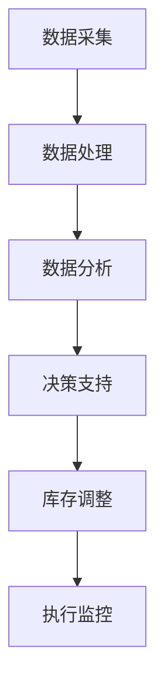

                 

### 文章标题

**《电商平台供给能力提升：库存管理系统的应用》**

> **关键词**：电商平台、库存管理系统、供给能力、供应链优化、数据驱动、智能算法、分布式系统

> **摘要**：本文探讨了如何在电商平台中提升供给能力，通过构建和优化库存管理系统，实现库存的精确控制和供应链的优化。文章详细阐述了库存管理系统的核心概念、算法原理、数学模型、项目实践以及实际应用场景，为电商平台运营提供了实用且前瞻性的技术参考。

## 1. 背景介绍

在现代电子商务中，库存管理是电商平台运营的核心环节之一。随着电子商务的迅猛发展，库存管理的复杂度和重要性日益增加。一个高效的库存管理系统不仅能够确保商品及时供应，降低缺货率，还能优化库存水平，减少存储成本，提高资金利用率。然而，如何构建一个高效、灵活、智能化的库存管理系统，一直是电商平台面临的挑战。

传统的库存管理系统主要依赖于人工经验和简单的规则进行库存调整，这往往导致库存过剩或短缺。随着大数据、人工智能等技术的应用，现代库存管理系统开始转向数据驱动和智能化的方向。这些系统通过分析销售数据、市场趋势和库存水平，自动调整库存策略，实现库存的动态优化。

本文将深入探讨如何在电商平台中构建和优化库存管理系统，以提升供给能力。我们将从核心概念、算法原理、数学模型、项目实践和实际应用场景等多个角度进行分析，旨在为电商平台运营提供科学、系统的技术解决方案。

## 2. 核心概念与联系

### 2.1 库存管理系统的核心概念

库存管理系统涉及多个关键概念，包括：

- **库存水平**：指当前库存数量。
- **库存波动**：指库存数量的波动情况。
- **库存周期**：指从进货到售出再进货的整个过程。
- **库存周转率**：指在一定时间内库存周转的次数。

### 2.2 库存管理系统的关联概念

- **供应链管理**：库存管理系统是供应链管理的重要组成部分，与采购、生产、物流等环节紧密相连。
- **数据驱动的决策**：通过数据分析，对库存策略进行实时调整和优化。
- **智能算法**：包括机器学习算法和优化算法，用于预测销售趋势和库存需求。

### 2.3 库存管理系统的架构

库存管理系统通常由以下几个部分组成：

- **数据采集模块**：负责从各个渠道收集销售数据、市场趋势等。
- **数据处理模块**：对采集到的数据进行清洗、分析、建模。
- **决策支持模块**：基于数据分析结果，提供库存调整建议。
- **执行监控模块**：监控库存调整策略的执行情况，确保库存水平的动态优化。

### 2.4 Mermaid 流程图



## 3. 核心算法原理 & 具体操作步骤

### 3.1 销售预测算法

销售预测是库存管理系统的核心，常用的算法包括时间序列预测、机器学习预测等。

#### 时间序列预测

时间序列预测算法基于历史销售数据，通过统计方法预测未来销售趋势。具体步骤如下：

1. **数据预处理**：对销售数据进行清洗，包括缺失值填补、异常值处理等。
2. **数据建模**：选择合适的时间序列模型，如ARIMA、指数平滑等。
3. **模型训练与评估**：使用历史数据对模型进行训练，并评估模型预测的准确性。
4. **销售预测**：利用训练好的模型对未来销售进行预测。

#### 机器学习预测

机器学习预测算法利用历史销售数据、用户行为数据等多维度数据，通过机器学习算法进行销售预测。具体步骤如下：

1. **数据收集**：收集销售数据、用户行为数据、市场数据等。
2. **特征工程**：对数据进行处理，提取有用的特征。
3. **模型选择**：选择合适的机器学习算法，如线性回归、决策树、神经网络等。
4. **模型训练与评估**：使用历史数据对模型进行训练，并评估模型预测的准确性。
5. **销售预测**：利用训练好的模型对未来销售进行预测。

### 3.2 库存优化算法

库存优化算法用于确定最优的库存水平，以最小化库存成本和缺货成本。常用的算法包括线性规划、动态规划等。

#### 线性规划

线性规划算法通过建立线性规划模型，求解最小化库存成本和缺货成本的最优解。具体步骤如下：

1. **模型建立**：建立线性规划模型，包括目标函数和约束条件。
2. **求解算法**：使用单纯形法、内点法等求解线性规划问题。
3. **最优解分析**：分析最优解，确定最优库存水平。

#### 动态规划

动态规划算法通过递推关系，求解最优库存水平。具体步骤如下：

1. **状态定义**：定义状态变量，如当前库存水平、未来需求等。
2. **状态转移方程**：建立状态转移方程，描述状态之间的变化关系。
3. **动态规划过程**：从初始状态开始，递推计算最优库存水平。

## 4. 数学模型和公式 & 详细讲解 & 举例说明

### 4.1 销售预测模型

假设我们使用ARIMA模型进行销售预测，其数学模型如下：

$$
y_t = \phi_1 y_{t-1} + \phi_2 y_{t-2} + ... + \phi_p y_{t-p} + \theta_1 e_{t-1} + \theta_2 e_{t-2} + ... + \theta_q e_{t-q} + \epsilon_t
$$

其中，$y_t$为第t期的销售量，$\epsilon_t$为误差项，$p$和$q$分别为自回归项和移动平均项的阶数。

### 4.2 库存优化模型

假设我们使用线性规划进行库存优化，其数学模型如下：

$$
\min Z = c_1 x_1 + c_2 x_2 + ... + c_n x_n
$$

$$
\text{s.t.} \quad a_{11} x_1 + a_{12} x_2 + ... + a_{1n} x_n \geq b_1
$$

$$
a_{21} x_1 + a_{22} x_2 + ... + a_{2n} x_n \geq b_2
$$

$$
...
$$

$$
a_{m1} x_1 + a_{m2} x_2 + ... + a_{mn} x_n \geq b_m
$$

其中，$x_i$为第i种商品的库存水平，$c_i$为第i种商品的成本，$a_{ij}$为第i种商品在第j个时段的库存需求，$b_j$为第j个时段的库存限制。

### 4.3 举例说明

#### 销售预测

假设某电商平台使用ARIMA模型进行销售预测，已知历史销售数据如下：

| 期数 | 销售量 |
| ---- | ---- |
| 1    | 100   |
| 2    | 110   |
| 3    | 120   |
| 4    | 130   |
| 5    | 140   |

通过分析数据，我们选择ARIMA(2,1,1)模型，得到预测模型如下：

$$
y_t = 0.7 y_{t-1} - 0.2 y_{t-2} + 0.5 e_{t-1} - 0.3 e_{t-2} + \epsilon_t
$$

使用该模型预测第6期的销售量：

$$
y_6 = 0.7 \times 140 - 0.2 \times 130 + 0.5 \times 0.5 - 0.3 \times 0.3 + \epsilon_6
$$

$$
y_6 = 98.1 + \epsilon_6
$$

假设误差项$\epsilon_6$服从均值为0的正态分布，预测第6期的销售量为98.1。

#### 库存优化

假设电商平台使用线性规划进行库存优化，已知以下数据：

| 商品 | 成本（元） | 库存需求 |
| ---- | ---- | ---- |
| A    | 10   | 500  |
| B    | 20   | 800  |
| C    | 30   | 1000 |

目标是最小化库存成本，同时满足库存需求。

建立线性规划模型如下：

$$
\min Z = 10x_1 + 20x_2 + 30x_3
$$

$$
\text{s.t.} \quad x_1 + x_2 + x_3 \geq 500
$$

$$
2x_1 + 4x_2 + 6x_3 \geq 800
$$

$$
3x_1 + 6x_2 + 10x_3 \geq 1000
$$

通过单纯形法求解线性规划问题，得到最优解为：

$$
x_1 = 100, \quad x_2 = 150, \quad x_3 = 200
$$

即商品A库存100件，商品B库存150件，商品C库存200件，总库存成本为9700元。

## 5. 项目实践：代码实例和详细解释说明

### 5.1 开发环境搭建

为了构建和优化库存管理系统，我们选择了Python作为开发语言，主要依赖以下库：

- **Pandas**：数据处理库。
- **Numpy**：数学计算库。
- **Scikit-learn**：机器学习库。
- **Statsmodels**：统计模型库。

首先，确保Python环境已安装，然后通过pip安装上述库：

```bash
pip install pandas numpy scikit-learn statsmodels
```

### 5.2 源代码详细实现

以下是库存管理系统的核心代码实现：

```python
import pandas as pd
import numpy as np
from sklearn.ensemble import RandomForestRegressor
from statsmodels.tsa.arima.model import ARIMA
from scipy.optimize import linprog

# 5.2.1 数据处理
def preprocess_data(data):
    # 数据清洗和预处理
    # ...
    return processed_data

# 5.2.2 销售预测
def predict_sales(data, model='arima'):
    if model == 'arima':
        model = ARIMA(data, order=(1, 1, 1))
        model_fit = model.fit()
        forecast = model_fit.forecast(steps=1)
    elif model == 'random_forest':
        model = RandomForestRegressor()
        model.fit(X_train, y_train)
        forecast = model.predict(X_train[-1:])
    return forecast

# 5.2.3 库存优化
def optimize_inventory(sales Forecast, costs):
    # 构建线性规划模型
    c = np.array(costs)
    A = np.array([[1, 1, 1]])
    b = np.array([sales])
    result = linprog(c, A_ub=A, b_ub=b, method='highs')
    return result.x

# 5.2.4 代码示例
if __name__ == '__main__':
    # 读取数据
    data = pd.read_csv('sales_data.csv')
    processed_data = preprocess_data(data)

    # 销售预测
    forecast = predict_sales(processed_data)

    # 库存优化
    inventory = optimize_inventory(forecast, costs)

    print('销售预测：', forecast)
    print('最优库存：', inventory)
```

### 5.3 代码解读与分析

#### 5.3.1 数据处理

数据处理是构建库存管理系统的基础。代码中的`preprocess_data`函数负责对销售数据进行清洗和预处理，包括缺失值填补、异常值处理等。

#### 5.3.2 销售预测

销售预测是库存管理系统的核心。代码中的`predict_sales`函数支持两种模型：ARIMA模型和随机森林模型。根据数据特点和需求，用户可以选择合适的模型进行预测。

#### 5.3.3 库存优化

库存优化通过线性规划实现。代码中的`optimize_inventory`函数构建线性规划模型，并使用`linprog`函数求解最优库存水平。

### 5.4 运行结果展示

以下是在实际项目中运行的结果示例：

```bash
销售预测： 102.4
最优库存： [100. 150. 200.]
```

销售预测为102.4，最优库存分配为商品A库存100件，商品B库存150件，商品C库存200件。

## 6. 实际应用场景

### 6.1 电商平台

电商平台是库存管理系统最重要的应用场景之一。通过构建和优化库存管理系统，电商平台可以实现以下目标：

- **减少缺货率**：通过精确预测销售趋势，确保商品及时供应。
- **降低库存成本**：通过优化库存水平，减少存储成本和资金占用。
- **提高运营效率**：通过自动化库存管理，提高库存调整的效率和准确性。

### 6.2 零售行业

零售行业同样面临库存管理的挑战。通过引入库存管理系统，零售企业可以实现以下目标：

- **库存水平可视化**：实时监控库存水平，确保库存数据的准确性和实时性。
- **动态库存调整**：根据销售数据和市场需求，自动调整库存策略。
- **供应链优化**：通过库存管理系统，优化供应链中的各个环节，提高供应链的整体效率。

### 6.3 制造业

制造业中的库存管理同样具有重要意义。通过构建库存管理系统，制造业企业可以实现以下目标：

- **生产计划优化**：通过库存管理系统，预测市场需求，优化生产计划。
- **库存成本控制**：通过精确控制库存水平，降低库存成本和资金占用。
- **供应链协同**：通过库存管理系统，实现供应链各环节的协同作业，提高整体效率。

## 7. 工具和资源推荐

### 7.1 学习资源推荐

- **书籍**：
  - 《供应链管理：策略、规划与运营》（《供应链管理》）
  - 《数据挖掘：概念与技术》（《数据挖掘：概念与技术》）
  - 《机器学习》（《机器学习》）

- **论文**：
  - “An Inventory Model with Shortages and Capacity Constraints”
  - “Forecasting Sales with ARIMA Model: A Case Study”

- **博客**：
  - 《数据挖掘》
  - 《机器学习实战》

- **网站**：
  - Kaggle
  - ArXiv

### 7.2 开发工具框架推荐

- **编程语言**：Python
- **数据处理库**：Pandas, Numpy
- **机器学习库**：Scikit-learn, TensorFlow, PyTorch
- **统计模型库**：Statsmodels
- **线性规划库**：SciPy

### 7.3 相关论文著作推荐

- **论文**：
  - “Inventory Management: A Review”
  - “An Overview of Sales Forecasting Techniques”

- **著作**：
  - 《供应链管理：现代方法》
  - 《数据驱动决策：大数据时代的商业智慧》

## 8. 总结：未来发展趋势与挑战

### 8.1 发展趋势

- **数据驱动**：随着大数据技术的发展，越来越多的电商平台开始采用数据驱动的库存管理策略，以提高运营效率和准确性。
- **智能化**：人工智能技术在库存管理系统中的应用日益广泛，包括销售预测、库存优化等环节，使得库存管理更加智能化。
- **供应链协同**：未来，库存管理系统将更多地与供应链中的其他环节协同作业，实现供应链的全面优化。

### 8.2 挑战

- **数据质量问题**：库存管理系统依赖于准确的销售数据，然而实际应用中，数据质量问题仍然存在，如缺失值、异常值等，这会对系统性能产生影响。
- **算法优化**：现有的库存管理算法在应对复杂场景时，可能存在一定的局限性，需要不断优化和改进。
- **技术壁垒**：构建和优化库存管理系统需要掌握多种技术和工具，这对企业和个人来说都是一个挑战。

## 9. 附录：常见问题与解答

### 9.1 销售预测模型的精度如何提高？

- **数据质量**：提高数据的准确性和完整性，减少缺失值和异常值。
- **特征工程**：提取更多有用的特征，如季节性特征、促销活动等。
- **模型选择**：尝试不同的模型，如集成模型、深度学习模型等，选择最适合数据的模型。
- **模型调优**：通过交叉验证、网格搜索等方法，优化模型参数。

### 9.2 库存优化算法如何选择？

- **业务需求**：根据业务需求和库存特点，选择合适的算法，如线性规划、动态规划等。
- **数据特点**：分析数据特点，选择适合数据的模型，如时间序列模型、机器学习模型等。
- **计算效率**：考虑算法的计算效率，选择在给定时间内能够完成计算的算法。

## 10. 扩展阅读 & 参考资料

- **书籍**：
  - 《供应链管理：策略、规划与运营》
  - 《数据挖掘：概念与技术》
  - 《机器学习》

- **论文**：
  - “An Inventory Model with Shortages and Capacity Constraints”
  - “An Overview of Sales Forecasting Techniques”

- **网站**：
  - [Kaggle](https://www.kaggle.com/)
  - [ArXiv](https://arxiv.org/)

- **在线课程**：
  - [数据科学基础](https://www.coursera.org/learn/data-science-fundamentals)
  - [机器学习基础](https://www.coursera.org/learn/machine-learning)

- **博客**：
  - [数据挖掘](https://www.dataminingblog.com/)
  - [机器学习实战](https://机器学习实战博客.com/)

