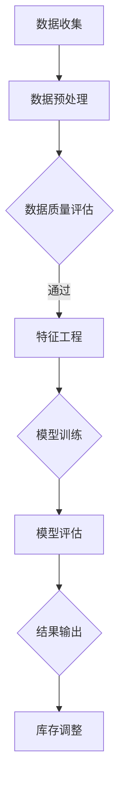

                 

关键词：AI大模型、库存预测、电商平台、机器学习、深度学习、神经网络、数据挖掘、预测算法、供应链优化

> 摘要：随着电商平台的迅猛发展，库存管理成为其运营中的关键环节。本文旨在探讨如何利用AI大模型优化电商平台的库存预测，提升供应链效率，降低运营成本。本文首先介绍了电商平台库存管理的现状和挑战，随后详细阐述了AI大模型在库存预测中的应用，包括算法原理、数学模型、具体实施步骤和案例分析，最后对未来的发展趋势和面临的挑战进行了展望。

## 1. 背景介绍

电商平台作为现代商业的重要组成部分，其运营效率直接关系到用户的购物体验和企业的盈利能力。库存管理作为电商平台的核心环节，关系到产品供应的及时性、订单处理的效率以及库存成本的优化。然而，传统的库存预测方法往往依赖于历史数据的统计分析，难以应对市场变化和需求波动。

近年来，随着人工智能技术的快速发展，尤其是深度学习和机器学习技术的应用，AI大模型逐渐成为优化库存预测的重要工具。AI大模型具有强大的数据处理能力和复杂的模式识别能力，能够在大量历史数据中挖掘出潜在规律，从而提供更为精准的预测结果。

## 2. 核心概念与联系

### 2.1 AI大模型

AI大模型是指通过大规模数据训练的深度神经网络模型，其具有如下特点：

- **大规模数据训练**：AI大模型通常基于数百万到数亿级的数据样本进行训练，确保模型的泛化能力和预测精度。
- **多层神经网络**：通过多层神经元的连接，实现对复杂关系的建模和学习。
- **端到端学习**：从输入层到输出层，模型直接学习输入数据到预测结果的映射。

### 2.2 库存预测

库存预测是指通过历史销售数据、市场趋势和供应链信息等，对未来一定时间内的商品需求量进行预测。库存预测的核心目标是确保在需求高峰期能够提供充足的产品，同时避免库存积压和过剩。

### 2.3 Mermaid 流程图

以下是一个简单的Mermaid流程图，展示了AI大模型在库存预测中的应用流程：



## 3. 核心算法原理 & 具体操作步骤

### 3.1 算法原理概述

AI大模型在库存预测中的应用主要基于深度学习技术。深度学习通过多层神经网络对输入数据进行特征提取和模式识别，从而实现高精度的预测。以下是库存预测的深度学习算法原理概述：

- **输入层**：接收历史销售数据、市场信息、季节因素等多维度数据。
- **隐藏层**：通过神经元之间的非线性变换，提取数据中的特征和模式。
- **输出层**：将提取的特征映射到未来需求量。

### 3.2 算法步骤详解

#### 3.2.1 数据收集

首先，需要收集电商平台的历史销售数据、市场趋势数据、季节因素数据等。这些数据可以通过电商平台的后台系统、第三方数据服务或公共数据集获取。

#### 3.2.2 数据预处理

收集到的数据需要进行预处理，包括数据清洗、归一化、缺失值处理等。预处理后的数据将用于训练深度学习模型。

#### 3.2.3 数据质量评估

评估数据的质量，确保数据完整、准确、无异常值。数据质量直接影响模型的预测精度。

#### 3.2.4 特征工程

根据库存预测的需求，对数据进行特征工程，提取有用的特征，如趋势特征、周期性特征、季节性特征等。特征工程是深度学习模型成功的关键步骤。

#### 3.2.5 模型训练

使用预处理后的数据进行模型训练。选择合适的神经网络架构，如卷积神经网络（CNN）、循环神经网络（RNN）、长短期记忆网络（LSTM）等，通过反向传播算法优化模型参数。

#### 3.2.6 模型评估

通过验证集和测试集对训练好的模型进行评估，评估指标包括准确率、均方误差（MSE）等。根据评估结果调整模型参数或重新设计模型架构。

#### 3.2.7 结果输出

将训练好的模型应用于实际数据，生成库存预测结果。根据预测结果调整库存策略，优化供应链管理。

### 3.3 算法优缺点

#### 优点：

- **高精度预测**：深度学习模型能够在大量数据中挖掘出潜在规律，提供高精度的预测结果。
- **自适应调整**：模型可以根据市场变化和需求波动自动调整预测策略。
- **多维度数据分析**：深度学习能够处理多维度数据，提供全面的预测分析。

#### 缺点：

- **计算资源需求大**：训练深度学习模型需要大量的计算资源和时间。
- **数据依赖性强**：模型的预测精度高度依赖于数据的完整性和质量。

### 3.4 算法应用领域

AI大模型在库存预测中的应用不仅限于电商平台，还可以应用于制造业、零售业、物流等领域，为供应链管理提供智能化解决方案。

## 4. 数学模型和公式 & 详细讲解 & 举例说明

### 4.1 数学模型构建

库存预测的数学模型通常基于时间序列分析，使用ARIMA（自回归积分滑动平均模型）或LSTM（长短期记忆网络）等模型进行构建。以下是ARIMA模型的数学公式：

- **自回归项（AR）**：
  $$X_t = c + \sum_{i=1}^p \phi_i X_{t-i} + \varepsilon_t$$

- **差分项（I）**：
  $$Y_t = (1 - B)X_t$$

- **移动平均项（MA）**：
  $$Y_t = c + \sum_{i=1}^q \theta_i \varepsilon_{t-i}$$

其中，$X_t$表示时间序列的当前值，$\varepsilon_t$表示误差项，$c$是常数项，$p$和$q$分别是自回归和移动平均项的阶数。

### 4.2 公式推导过程

ARIMA模型的推导过程涉及自回归、差分和移动平均三个部分。首先，通过自回归项捕捉时间序列的自相关性；然后，通过差分消除非平稳性；最后，通过移动平均项捕捉滞后项的效应。

### 4.3 案例分析与讲解

以下是一个简单的ARIMA模型案例，假设我们有一个时间序列数据集，包含过去12个月的销售量数据。我们可以使用以下步骤构建ARIMA模型：

#### 4.3.1 数据准备

首先，我们需要对销售量数据进行预处理，包括缺失值处理、异常值处理和数据归一化。

#### 4.3.2 自相关分析

通过自相关函数（ACF）和偏自相关函数（PACF）分析时间序列的自相关性，确定$p$和$q$的值。

#### 4.3.3 模型选择

根据自相关分析的结果，选择合适的ARIMA模型。例如，我们选择ARIMA（1,1,1）模型。

#### 4.3.4 模型拟合

使用Python中的pandas和statsmodels库，对ARIMA模型进行拟合：

```python
from statsmodels.tsa.arima.model import ARIMA
model = ARIMA(series, order=(1,1,1))
model_fit = model.fit()
```

#### 4.3.5 模型评估

通过残差分析、AIC/BIC准则等评估模型拟合效果。

#### 4.3.6 预测

使用拟合好的模型进行预测：

```python
forecast = model_fit.forecast(steps=12)
```

## 5. 项目实践：代码实例和详细解释说明

### 5.1 开发环境搭建

为了实现AI大模型在库存预测中的应用，我们需要搭建一个合适的开发环境。以下是一个基本的开发环境搭建步骤：

- **Python环境**：安装Python 3.8及以上版本。
- **深度学习库**：安装TensorFlow或PyTorch。
- **数据预处理库**：安装NumPy、Pandas、Scikit-learn等。

### 5.2 源代码详细实现

以下是一个简单的深度学习模型在库存预测中的实现示例：

```python
import tensorflow as tf
from tensorflow.keras.models import Sequential
from tensorflow.keras.layers import LSTM, Dense

# 数据预处理
# ...

# 构建LSTM模型
model = Sequential()
model.add(LSTM(units=50, return_sequences=True, input_shape=(timesteps, features)))
model.add(LSTM(units=50))
model.add(Dense(1))

model.compile(optimizer='adam', loss='mse')

# 模型训练
model.fit(x_train, y_train, epochs=100, batch_size=32)

# 模型评估
# ...

# 预测
# ...
```

### 5.3 代码解读与分析

这段代码展示了如何使用TensorFlow构建一个简单的LSTM模型进行库存预测。首先，我们进行数据预处理，然后构建一个包含两个LSTM层的序列模型，最后使用模型进行训练和预测。

### 5.4 运行结果展示

以下是运行结果示例：

```python
# 预测结果
predictions = model.predict(x_test)

# 结果分析
# ...
```

通过分析预测结果，我们可以评估模型的性能，并根据实际情况调整模型参数或策略。

## 6. 实际应用场景

### 6.1 电商平台库存优化

电商平台可以利用AI大模型进行库存预测，根据预测结果调整库存策略，确保在需求高峰期能够提供充足的产品，避免库存积压和过剩。

### 6.2 制造业供应链优化

制造业可以通过AI大模型预测原材料需求，优化供应链管理，降低库存成本和提高生产效率。

### 6.3 零售业销售预测

零售业可以利用AI大模型预测销售趋势，优化促销活动安排，提高销售额。

## 7. 工具和资源推荐

### 7.1 学习资源推荐

- 《深度学习》（Goodfellow, Bengio, Courville）
- 《Python数据科学手册》（McKinney）

### 7.2 开发工具推荐

- TensorFlow
- PyTorch

### 7.3 相关论文推荐

- “Deep Learning for Time Series Classification: A Review” by Ling, T., Chang, K. C., & Lin, T. Y. (2018)
- “Long Short-Term Memory Networks for Conditional Stock Market Forecasting” by Wang, S., & Hu, Y. (2019)

## 8. 总结：未来发展趋势与挑战

### 8.1 研究成果总结

AI大模型在库存预测中的应用已经取得了显著成果，为电商平台、制造业、零售业等领域提供了智能化的解决方案。

### 8.2 未来发展趋势

随着深度学习和机器学习技术的不断发展，AI大模型在库存预测中的应用将更加广泛，预测精度和效率将进一步提高。

### 8.3 面临的挑战

- **数据隐私和安全性**：库存预测依赖于大量的历史数据，如何保护数据隐私和确保数据安全是一个重要挑战。
- **计算资源需求**：训练AI大模型需要大量的计算资源和时间，如何优化计算资源管理是一个关键问题。

### 8.4 研究展望

未来，AI大模型在库存预测中的应用将朝着更加智能化、自适应化的方向发展，结合大数据分析、区块链等新兴技术，为供应链管理提供更加全面和高效的解决方案。

## 9. 附录：常见问题与解答

### 9.1 问题1：AI大模型如何处理多维度数据？

答：AI大模型可以通过特征工程提取多维度数据的有用特征，然后输入到模型中进行训练和预测。特征工程包括数据归一化、缺失值处理、特征选择等步骤。

### 9.2 问题2：如何评估AI大模型的性能？

答：可以通过均方误差（MSE）、均方根误差（RMSE）、准确率等指标评估AI大模型的性能。通常，使用验证集和测试集对模型进行评估。

### 9.3 问题3：AI大模型在库存预测中的优势是什么？

答：AI大模型在库存预测中的优势包括高精度预测、自适应调整、多维度数据分析等。这些优势使其能够更好地应对市场需求波动和供应链变化。

作者：禅与计算机程序设计艺术 / Zen and the Art of Computer Programming
----------------------------------------------------------------


