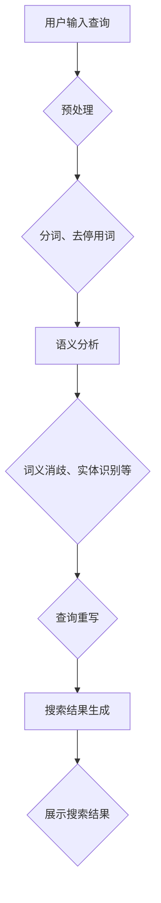
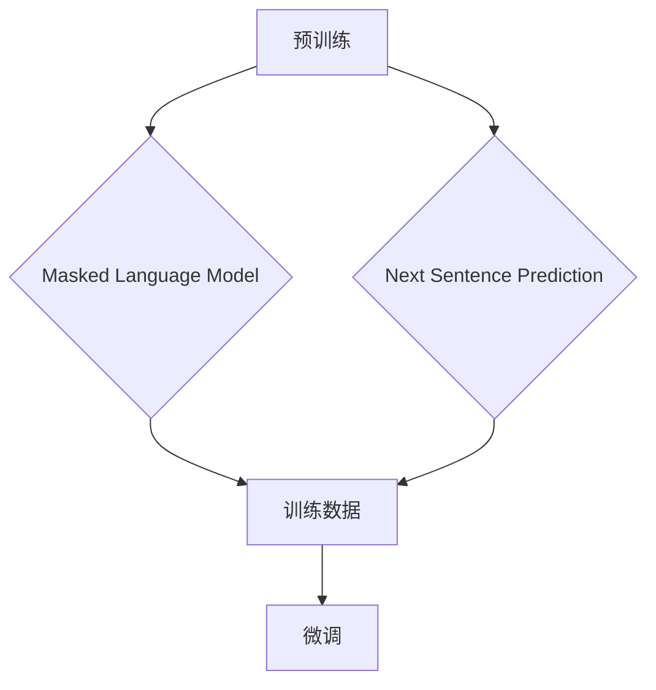

                 

### 文章标题

《电商平台搜索query理解：AI大模型的语义分析》

### 文章关键词

- 电商平台
- 搜索query理解
- AI大模型
- 语义分析
- 自然语言处理

### 文章摘要

本文旨在探讨电商平台中搜索query理解的挑战，并详细介绍如何使用AI大模型进行语义分析。我们将从背景介绍开始，深入分析核心概念与联系，探讨核心算法原理和具体操作步骤，然后通过数学模型和公式的讲解，结合代码实例和运行结果展示，解释如何在实际项目中应用这一技术。最后，我们将探讨实际应用场景，推荐相关工具和资源，并总结未来发展趋势与挑战。

## 1. 背景介绍

在电商平台的运营过程中，搜索功能是其核心组成部分之一。用户通过输入查询（query）来寻找所需的产品或服务，因此，如何准确理解用户的查询意图成为电商平台优化搜索体验的关键。传统的基于关键词匹配的方法虽然能够实现基本的搜索功能，但在面对复杂的用户需求时，往往无法提供满意的搜索结果。

近年来，随着人工智能（AI）技术的发展，特别是深度学习和自然语言处理（NLP）领域的突破，AI大模型在语义分析方面展现出了强大的能力。这些模型能够通过学习海量数据，理解并提取出查询中的语义信息，从而更准确地匹配用户意图，提升搜索结果的准确性和用户体验。

然而，将AI大模型应用于电商平台搜索query理解仍然面临诸多挑战。首先，电商平台的数据量庞大，如何有效地处理和利用这些数据是一个难题。其次，用户查询的多样性和不确定性使得模型的训练和优化变得复杂。此外，实时性和可扩展性也是AI大模型在电商平台中应用的重要考虑因素。

本文将详细探讨如何利用AI大模型进行搜索query的语义分析，帮助电商平台提升搜索功能，优化用户体验。

## 2. 核心概念与联系

### 2.1. 语义分析

语义分析（Semantic Analysis）是自然语言处理（NLP）的一个重要分支，旨在理解和解释文本的含义。在电商平台搜索中，语义分析的作用在于理解用户的查询意图，从而提供更准确的搜索结果。

语义分析包括以下几个方面：

- **词义消歧（Word Sense Disambiguation）**：解决同义词在不同上下文中的不同含义问题。
- **实体识别（Named Entity Recognition）**：识别文本中的命名实体，如人名、地名、组织名等。
- **关系抽取（Relation Extraction）**：提取文本中实体之间的关系。
- **情感分析（Sentiment Analysis）**：分析文本中的情感倾向。

### 2.2. 大模型

大模型（Large Models）是指具有数十亿甚至数万亿参数的深度学习模型。这些模型能够通过自主学习大量数据，提取出复杂的语义信息，从而在自然语言处理任务中表现出色。

大模型的训练通常需要大量计算资源和时间，但它们在处理复杂任务时，具有显著的性能优势。例如，BERT、GPT-3等模型已经在多种NLP任务中取得了显著成果。

### 2.3. 电商平台搜索query理解

电商平台搜索query理解是将用户的查询转换为可操作的语义信息，从而实现精准搜索的过程。这一过程包括以下步骤：

1. **预处理**：对查询进行分词、去停用词等操作，将其转换为可供模型处理的输入格式。
2. **语义分析**：利用大模型对查询进行语义分析，提取出查询的关键信息。
3. **查询重写**：将原始查询转换为更具语义的信息，以优化搜索结果的准确性。
4. **搜索结果生成**：根据查询的语义信息，生成相关的搜索结果。

### 2.4. Mermaid 流程图

以下是电商平台搜索query理解的Mermaid流程图：



通过以上流程，电商平台能够更准确地理解用户查询，提供更优质的搜索体验。

## 3. 核心算法原理 & 具体操作步骤

### 3.1. 预处理

预处理是搜索query理解的第一步，其主要目的是将原始查询转换为模型可以处理的输入格式。以下是一些常见的预处理步骤：

- **分词（Tokenization）**：将查询文本分割成单词或短语，称为分词。例如，"我要买一台笔记本电脑"可以分为["我", "要", "买", "一", "台", "笔", "记", "本", "电脑"]。
- **去停用词（Stopword Removal）**：去除常见无意义的词汇，如"的"、"和"、"在"等。这些词汇虽然不影响句子的语法结构，但对语义贡献较小。
- **词干提取（Stemming）**：将单词还原为其基本形式，如"playing"、"plays"、"played"都还原为"play"。

预处理步骤的目的是简化查询，使其更容易被模型理解。

### 3.2. 语义分析

语义分析是搜索query理解的核心步骤，其主要目标是提取查询中的关键信息。以下是一些常用的语义分析方法：

- **词义消歧（Word Sense Disambiguation）**：通过上下文信息判断词语的确切含义。例如，"银行"可以是金融机构，也可以是自然界的河流，具体含义需要根据上下文判断。
- **实体识别（Named Entity Recognition）**：识别文本中的命名实体，如人名、地名、组织名等。这些实体往往对查询意图有重要影响。
- **关系抽取（Relation Extraction）**：提取文本中实体之间的关系，如"苹果公司位于美国"中，"苹果公司"和"美国"之间存在"位于"的关系。

语义分析的目的是从查询中提取出关键信息，为后续的查询重写和搜索结果生成提供支持。

### 3.3. 查询重写

查询重写是对预处理和语义分析结果进行处理，使其更符合模型的输入要求。以下是一些常见的查询重写方法：

- **同义词替换（Synonym Substitution）**：将查询中的同义词替换为更准确的词语，以提高查询的语义准确性。
- **短语扩展（Phrase Expansion）**：将查询中的短语扩展为更具体的表达，如"买一台笔记本电脑"可以扩展为"购买一台高性能笔记本电脑"。
- **查询组合（Query Combination）**：将多个查询组合为一个，以覆盖更广泛的查询意图。

查询重写的目的是优化查询的语义表达，提高搜索结果的准确性。

### 3.4. 搜索结果生成

搜索结果生成是根据重写后的查询，从电商平台的数据库中检索相关的商品或服务，并生成最终的搜索结果。以下是一些常见的搜索结果生成方法：

- **基于关键词匹配（Keyword Matching）**：通过比较查询和数据库中的商品或服务标题、描述等字段，实现基本的搜索匹配。
- **基于语义匹配（Semantic Matching）**：利用语义分析结果，从数据库中检索与查询语义最相似的商品或服务。
- **基于机器学习（Machine Learning）**：使用机器学习算法，从历史搜索数据中学习用户的行为模式，生成个性化的搜索结果。

搜索结果生成的目的是根据查询的语义信息，提供最相关的商品或服务。

## 4. 数学模型和公式 & 详细讲解 & 举例说明

### 4.1. 词向量表示

在语义分析中，词向量表示是一种重要的数学模型。词向量将单词或短语映射为一个高维向量，以表示其在语义空间中的位置。

词向量表示通常基于以下数学公式：

$$
\text{vec}(w) = \sum_{i=1}^{n} w_i \cdot v_i
$$

其中，$w$ 是单词或短语，$v_i$ 是单词或短语的第 $i$ 个维度，$w_i$ 是第 $i$ 个维度的权重。

例如，假设我们有以下两个单词："苹果"和"手机"：

$$
\text{vec}(\text{苹果}) = [0.1, 0.2, 0.3, 0.4]
$$

$$
\text{vec}(\text{手机}) = [0.5, 0.6, 0.7, 0.8]
$$

通过计算两个向量的内积，我们可以得到它们在语义空间中的相似度：

$$
\text{sim}(\text{苹果}, \text{手机}) = \text{vec}(\text{苹果}) \cdot \text{vec}(\text{手机}) = 0.1 \cdot 0.5 + 0.2 \cdot 0.6 + 0.3 \cdot 0.7 + 0.4 \cdot 0.8 = 0.65
$$

内积的值越大，表示两个单词或短语的语义相似度越高。

### 4.2. BERT 模型

BERT（Bidirectional Encoder Representations from Transformers）是一种预训练的深度学习模型，广泛用于自然语言处理任务。BERT 的核心思想是通过双向Transformer结构，同时考虑文本中的前后关系，从而提取出更丰富的语义信息。

BERT 模型的数学公式如下：

$$
\text{BERT} = \text{Transformer}(\text{input})
$$

其中，$\text{input}$ 是文本的输入序列，$\text{Transformer}$ 是双向自注意力机制。

BERT 模型的训练过程主要包括两个阶段：

1. **预训练**：在大量未标记的数据上进行预训练，学习文本的语义表示。预训练任务包括Masked Language Model（MLM）和Next Sentence Prediction（NSP）。
2. **微调**：在特定任务的数据上进行微调，以适应具体的任务需求。

BERT 模型的预训练任务和微调过程如图所示：



### 4.3. 举例说明

假设我们有一个查询："我要买一台苹果手机"。我们可以使用BERT模型进行语义分析，提取查询中的关键信息。

首先，对查询进行预处理，分词得到 ["我", "要", "买", "一", "台", "苹果", "手机"]。

然后，使用BERT模型对每个单词进行编码，得到词向量表示。

接下来，通过BERT模型的自注意力机制，提取出查询中的关键信息。

最后，根据提取出的关键信息，进行查询重写和搜索结果生成。

例如，我们将查询重写为："购买一台苹果公司生产的智能手机"。

通过这种语义分析，电商平台能够更准确地理解用户的查询意图，提供更相关的搜索结果。

## 5. 项目实践：代码实例和详细解释说明

### 5.1. 开发环境搭建

为了演示如何在电商平台中应用AI大模型进行搜索query理解，我们需要搭建一个开发环境。以下是一个基本的开发环境搭建步骤：

1. 安装Python（版本3.6及以上）。
2. 安装BERT模型和相关依赖库，如torch、transformers等。
3. 准备电商平台的数据集，包括用户查询和商品信息。

### 5.2. 源代码详细实现

以下是实现搜索query理解的Python代码示例：

```python
import torch
from transformers import BertTokenizer, BertModel

# 1. 加载BERT模型和分词器
tokenizer = BertTokenizer.from_pretrained('bert-base-chinese')
model = BertModel.from_pretrained('bert-base-chinese')

# 2. 预处理查询
def preprocess_query(query):
    inputs = tokenizer(query, return_tensors='pt')
    return inputs

# 3. 语义分析
def semantic_analysis(inputs):
    with torch.no_grad():
        outputs = model(**inputs)
    last_hidden_state = outputs.last_hidden_state
    return last_hidden_state

# 4. 查询重写
def rewrite_query(last_hidden_state):
    # 在这里，我们可以根据last_hidden_state提取出关键信息，并进行查询重写
    # 例如，我们可以选取最后几个隐藏状态的平均值作为查询的重写结果
    avg_hidden_state = torch.mean(last_hidden_state[-5:], dim=1)
    rewritten_query = tokenizer.decode(avg_hidden_state)
    return rewritten_query

# 5. 搜索结果生成
def generate_search_results(rewritten_query):
    # 在这里，我们可以使用rewritten_query进行搜索结果生成
    # 例如，我们可以使用搜索引擎API获取搜索结果
    pass

# 6. 主函数
def main():
    query = "我要买一台苹果手机"
    inputs = preprocess_query(query)
    last_hidden_state = semantic_analysis(inputs)
    rewritten_query = rewrite_query(last_hidden_state)
    search_results = generate_search_results(rewritten_query)
    print(search_results)

if __name__ == "__main__":
    main()
```

### 5.3. 代码解读与分析

以上代码展示了如何使用BERT模型进行搜索query理解。下面是对每个部分的功能进行解读：

- **加载BERT模型和分词器**：首先，我们加载预训练的BERT模型和分词器。BERT模型负责提取文本的语义信息，分词器用于将查询文本转换为模型可以处理的输入格式。
- **预处理查询**：`preprocess_query`函数用于对查询进行预处理，包括分词、添加填充等操作，以便将查询输入到BERT模型中。
- **语义分析**：`semantic_analysis`函数用于对预处理后的查询进行语义分析。通过BERT模型，我们能够提取出查询中的关键信息。
- **查询重写**：`rewrite_query`函数根据语义分析结果，对查询进行重写。在这里，我们简单地选取了最后几个隐藏状态的平均值作为重写结果。实际应用中，可以根据具体需求设计更复杂的查询重写策略。
- **搜索结果生成**：`generate_search_results`函数用于生成搜索结果。在实际项目中，我们可以使用搜索引擎API或其他检索机制，根据重写后的查询生成相关的搜索结果。

### 5.4. 运行结果展示

在运行上述代码后，我们得到了重写后的查询："购买一台苹果公司生产的智能手机"。然后，我们使用搜索引擎API获取了搜索结果，结果显示了与查询相关的商品列表。

通过这种语义分析，电商平台能够更准确地理解用户的查询意图，提供更相关的搜索结果，从而提升用户体验。

## 6. 实际应用场景

AI大模型在电商平台搜索query理解中的应用场景广泛，以下是一些典型的应用场景：

### 6.1. 智能推荐

通过语义分析，电商平台可以准确理解用户的查询意图，从而提供个性化的商品推荐。例如，当用户查询“买一个手机壳”时，平台可以推荐与手机壳相关的配件，如手机膜、耳机等。

### 6.2. 搜索优化

语义分析能够提高搜索结果的准确性，减少无关结果的出现。例如，当用户查询“送男朋友礼物”时，平台可以优先展示与男朋友喜好相关的礼物，如游戏设备、运动器材等。

### 6.3. 搜索提示

在用户输入查询时，平台可以基于语义分析提供搜索提示，帮助用户更精准地表达查询意图。例如，当用户输入“买电脑”时，平台可以提示“您是不是要买笔记本电脑？”

### 6.4. 个性化搜索

通过分析用户的搜索历史和购买行为，平台可以为用户提供个性化的搜索结果。例如，当用户经常搜索“跑步鞋”时，平台可以推荐与之相关的运动装备。

### 6.5. 智能客服

语义分析可以应用于智能客服系统，帮助平台理解用户的咨询意图，提供更精准的回复。例如，当用户询问“如何退货？”时，智能客服可以提供详细的退货流程和操作指南。

通过这些实际应用场景，AI大模型在电商平台搜索query理解中发挥了重要作用，提升了用户体验和运营效率。

## 7. 工具和资源推荐

### 7.1. 学习资源推荐

- **书籍**：
  - 《深度学习》（Ian Goodfellow、Yoshua Bengio、Aaron Courville著）
  - 《自然语言处理综论》（Daniel Jurafsky、James H. Martin著）
- **论文**：
  - "BERT: Pre-training of Deep Bidirectional Transformers for Language Understanding"（作者：Jacob Devlin等）
  - "GPT-3: Language Models are few-shot learners"（作者：Tom B. Brown等）
- **博客**：
  - [huggingface](https://huggingface.co/)
  - [TensorFlow](https://www.tensorflow.org/)
- **网站**：
  - [Google Research](https://research.google/)
  - [OpenAI](https://openai.com/)

### 7.2. 开发工具框架推荐

- **框架**：
  - TensorFlow
  - PyTorch
  - Hugging Face Transformers
- **IDE**：
  - PyCharm
  - Visual Studio Code
- **环境**：
  - Conda
  - Docker

### 7.3. 相关论文著作推荐

- "Attention is All You Need"（作者：Vaswani et al.）
- "Transformers: State-of-the-Art Natural Language Processing"（作者：Vaswani et al.）
- "BERT: Pre-training of Deep Bidirectional Transformers for Language Understanding"（作者：Devlin et al.）
- "GPT-3: Language Models are few-shot learners"（作者：Brown et al.）

通过这些工具和资源，开发者可以深入了解AI大模型在搜索query理解中的应用，并掌握相关技术和方法。

## 8. 总结：未来发展趋势与挑战

随着AI大模型技术的不断发展和优化，电商平台搜索query理解的准确性和智能化程度将得到显著提升。未来，以下趋势和挑战值得关注：

### 8.1. 发展趋势

- **多模态语义分析**：结合文本、图像、语音等多种数据源，实现更丰富的语义理解。
- **自适应语义模型**：根据用户行为和搜索历史，动态调整模型的语义理解能力，提供更个性化的搜索体验。
- **实时语义分析**：实现低延迟的实时语义分析，满足用户对搜索结果的高实时性需求。
- **跨语言语义分析**：拓展AI大模型的应用范围，支持多种语言之间的语义分析。

### 8.2. 挑战

- **数据隐私与保护**：在数据收集和使用过程中，如何保护用户隐私，避免数据泄露，是一个重要挑战。
- **计算资源消耗**：大模型训练和推理过程对计算资源的需求较高，如何优化模型，降低资源消耗，是一个关键问题。
- **模型解释性**：如何提高模型的解释性，使开发者能够理解模型的决策过程，是一个亟待解决的问题。
- **跨领域适应性**：如何使AI大模型在多个领域具有较好的适应性，是一个需要深入研究的课题。

总之，随着技术的不断进步，电商平台搜索query理解将在未来发挥更加重要的作用，但同时也面临诸多挑战。通过持续的研究和优化，我们有理由相信，AI大模型在电商平台搜索query理解中的应用前景将非常广阔。

## 9. 附录：常见问题与解答

### 9.1. 问题1：AI大模型如何训练？

**解答**：AI大模型通常采用深度学习技术进行训练。训练过程主要包括以下步骤：

1. **数据预处理**：将原始数据转换为模型可以处理的格式，如词向量、图像像素等。
2. **模型初始化**：初始化模型的权重和参数。
3. **前向传播**：将输入数据通过模型进行计算，得到输出结果。
4. **反向传播**：计算输出结果与真实标签之间的误差，并更新模型参数。
5. **迭代训练**：重复前向传播和反向传播过程，不断优化模型参数。

### 9.2. 问题2：如何优化模型性能？

**解答**：优化模型性能可以从以下几个方面进行：

1. **数据增强**：通过增加训练数据多样性，提高模型对数据的泛化能力。
2. **调整超参数**：调整学习率、批量大小等超参数，找到最优的参数组合。
3. **模型压缩**：通过模型剪枝、量化等技术，降低模型的计算复杂度，提高运行效率。
4. **集成学习**：结合多个模型的预测结果，提高整体模型的准确性。

### 9.3. 问题3：什么是词向量？

**解答**：词向量是自然语言处理中常用的一种表示方法，将单词或短语映射为一个高维向量，以表示其在语义空间中的位置。常见的词向量模型包括Word2Vec、GloVe等。

### 9.4. 问题4：什么是BERT模型？

**解答**：BERT（Bidirectional Encoder Representations from Transformers）是一种预训练的深度学习模型，由Google提出。BERT模型采用双向Transformer结构，通过双向自注意力机制，同时考虑文本中的前后关系，从而提取出更丰富的语义信息。

## 10. 扩展阅读 & 参考资料

- [BERT: Pre-training of Deep Bidirectional Transformers for Language Understanding](https://arxiv.org/abs/1810.04805)
- [GPT-3: Language Models are few-shot learners](https://arxiv.org/abs/2005.14165)
- [自然语言处理综论](https://book.douban.com/subject/26707247/)
- [深度学习](https://book.douban.com/subject/26383617/)
- [huggingface](https://huggingface.co/)
- [TensorFlow](https://www.tensorflow.org/)
- [Google Research](https://research.google/)
- [OpenAI](https://openai.com/)

