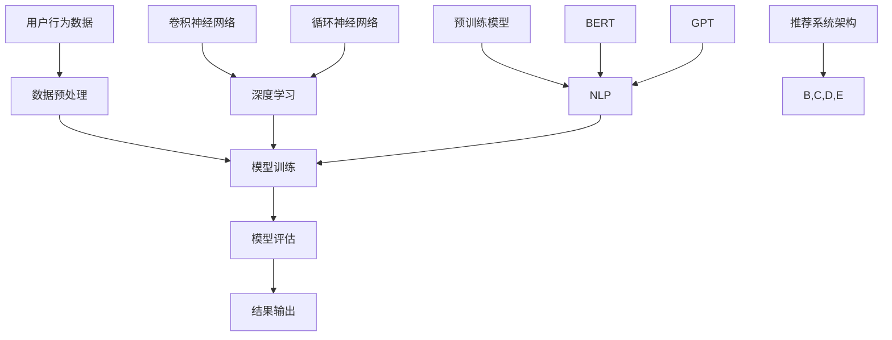

                 

### 背景介绍

随着互联网技术的飞速发展和电子商务的蓬勃发展，电商平台搜索推荐系统已经成为电商平台的核心功能之一。通过为用户提供个性化的搜索结果和推荐商品，搜索推荐系统不仅能提升用户体验，还能显著提高平台的销售额和用户粘性。

然而，现有的搜索推荐系统在应对大规模数据、多样化用户需求以及实时响应等方面仍存在诸多挑战。传统的搜索推荐算法如基于内容的推荐、协同过滤等方法在处理复杂性和多样性方面存在局限性。此外，随着人工智能技术的不断进步，特别是深度学习、自然语言处理等领域的突破，大模型在搜索推荐系统中的应用逐渐受到关注。

本文旨在探讨电商平台搜索推荐系统中AI大模型的优化策略，包括系统性能、效率、准确率和多样性的提升。我们将详细分析大模型的原理、技术实现，并通过项目实践展示大模型在电商平台搜索推荐系统中的应用效果。

### 核心概念与联系

在探讨AI大模型在电商平台搜索推荐系统中的应用之前，首先需要了解几个核心概念及其相互关系。这些概念包括：深度学习、自然语言处理、推荐系统架构等。

#### 深度学习

深度学习是一种基于多层神经网络的机器学习技术，通过训练大量数据来学习数据特征和规律，从而实现自动分类、预测和生成。深度学习的关键在于多层网络的堆叠，每一层能够提取更高层次的特征。例如，卷积神经网络（CNN）在图像处理中提取纹理特征，循环神经网络（RNN）在序列数据处理中提取时序特征。

#### 自然语言处理（NLP）

自然语言处理是人工智能的一个重要分支，旨在使计算机理解和处理人类语言。NLP涉及语音识别、文本分类、机器翻译、情感分析等多个子领域。近年来，基于深度学习的NLP方法取得了显著进展，如BERT、GPT等预训练模型在多个NLP任务上实现了突破性成果。

#### 推荐系统架构

推荐系统通常包括数据采集、数据预处理、模型训练、模型评估和结果输出等环节。其中，数据预处理包括用户行为数据、商品特征数据等的清洗、归一化和特征提取。模型训练则依赖于大量训练数据和先进的机器学习算法，如协同过滤、矩阵分解、深度学习等。模型评估通过准确率、召回率、F1分数等指标来衡量推荐系统的性能。结果输出则是将推荐结果呈现给用户，通常以排行榜、个性化搜索结果等形式展示。

#### 核心概念原理与架构的Mermaid流程图

以下是一个简化的Mermaid流程图，展示推荐系统的核心概念和架构：



#### 深度学习与推荐系统的结合

深度学习与推荐系统的结合主要体现在以下几个方面：

1. **特征提取**：深度学习模型能够自动提取高维特征，降低特征工程的工作量。例如，使用卷积神经网络提取图像特征，使用循环神经网络提取文本特征。
2. **协同学习**：将深度学习模型与协同过滤方法结合，利用深度学习模型提取用户和商品的特征，从而提高推荐系统的准确性和泛化能力。
3. **上下文感知**：深度学习模型能够处理复杂的上下文信息，从而实现更准确的推荐。例如，在电商场景中，结合用户的购物历史、浏览行为和搜索关键词等信息进行推荐。
4. **多样性**：深度学习模型能够学习到更丰富的特征，从而提高推荐系统的多样性，避免用户总是看到相同的推荐。

### 核心算法原理 & 具体操作步骤

#### 深度学习推荐算法

深度学习推荐算法的核心思想是利用深度学习模型从原始数据中自动提取特征，并通过训练学习用户和商品之间的关系。以下是一个简化的深度学习推荐算法步骤：

1. **数据预处理**：
   - 用户行为数据：包括用户的购物历史、浏览记录、搜索关键词等。
   - 商品特征数据：包括商品的价格、品牌、类别、库存量等。

2. **特征提取**：
   - 使用卷积神经网络（CNN）提取商品图像的特征。
   - 使用循环神经网络（RNN）提取用户行为的时序特征。
   - 使用嵌入层（Embedding Layer）将用户和商品的ID转换为高维向量。

3. **模型构建**：
   - 采用多层感知机（MLP）或序列模型（如LSTM、GRU）构建推荐模型。
   - 添加正则化项（如Dropout、L2正则化）以防止过拟合。

4. **模型训练**：
   - 使用用户-商品交互数据训练模型，优化模型参数。
   - 采用交叉熵损失函数衡量预测标签与真实标签之间的差距。

5. **模型评估**：
   - 通过准确率、召回率、F1分数等指标评估模型性能。
   - 使用验证集进行交叉验证，避免过拟合。

6. **结果输出**：
   - 根据用户行为和商品特征，生成个性化推荐列表。

#### 自然语言处理推荐算法

自然语言处理推荐算法的核心思想是利用NLP技术理解和提取文本信息，从而实现更准确的推荐。以下是一个简化的NLP推荐算法步骤：

1. **数据预处理**：
   - 清洗和标准化文本数据，去除停用词、标点符号等。

2. **特征提取**：
   - 使用词袋模型（Bag of Words）或词嵌入模型（Word Embeddings）将文本转换为向量表示。
   - 使用预训练模型（如BERT、GPT）提取文本的高层次特征。

3. **模型构建**：
   - 采用序列模型（如LSTM、GRU）或Transformer模型构建推荐模型。
   - 添加注意力机制（Attention Mechanism）以捕捉文本中的关键信息。

4. **模型训练**：
   - 使用文本数据训练模型，优化模型参数。
   - 采用交叉熵损失函数衡量预测标签与真实标签之间的差距。

5. **模型评估**：
   - 通过准确率、召回率、F1分数等指标评估模型性能。
   - 使用验证集进行交叉验证，避免过拟合。

6. **结果输出**：
   - 根据文本特征和用户兴趣，生成个性化推荐列表。

#### 结合深度学习和NLP的推荐算法

为了充分利用深度学习和NLP的优势，可以将两者结合起来，构建更强大的推荐系统。以下是一个简化的结合算法步骤：

1. **数据预处理**：
   - 对用户行为数据和应用NLP技术提取文本特征。
   - 对商品特征数据应用深度学习技术提取图像特征。

2. **特征融合**：
   - 将文本特征和图像特征进行融合，可以使用拼接（Concatenation）、注意力机制（Attention Mechanism）或多层感知机（MLP）等方法。

3. **模型构建**：
   - 采用融合模型（如Dual-Model、Multi-Modal Model）结合用户行为和文本特征。
   - 可以使用序列模型（如LSTM、GRU）或Transformer模型进行融合。

4. **模型训练**：
   - 使用用户-商品交互数据训练模型，优化模型参数。
   - 采用交叉熵损失函数衡量预测标签与真实标签之间的差距。

5. **模型评估**：
   - 通过准确率、召回率、F1分数等指标评估模型性能。
   - 使用验证集进行交叉验证，避免过拟合。

6. **结果输出**：
   - 根据用户行为、文本特征和图像特征，生成个性化推荐列表。

### 数学模型和公式 & 详细讲解 & 举例说明

在深度学习和自然语言处理推荐系统中，常用的数学模型和公式包括嵌入层（Embedding Layer）、多层感知机（MLP）、循环神经网络（RNN）、Transformer模型等。下面将分别介绍这些模型的基本原理和具体应用。

#### 嵌入层（Embedding Layer）

嵌入层是一种将低维稀疏向量映射到高维稠密向量的一种技术。在推荐系统中，嵌入层常用于将用户和商品的ID转换为向量表示。具体公式如下：

$$
x_{i} = \text{ Embedding}(W, x_i)
$$

其中，$x_i$ 是输入的ID，$W$ 是嵌入权重矩阵。通过嵌入层，低维的ID可以映射到高维的向量空间，从而降低数据的稀疏性，提高模型的表达能力。

#### 多层感知机（MLP）

多层感知机是一种前馈神经网络，通过多个隐藏层对输入数据进行特征提取和变换。MLP的输出可以通过以下公式计算：

$$
\hat{y} = \text{ReLU}(Z) = \text{ReLU}(\sum_{j=1}^{m} W_{j}a_{j} + b)
$$

其中，$a_j$ 是输入特征，$W_j$ 是权重矩阵，$b$ 是偏置项。ReLU激活函数用于引入非线性，增强模型的表达能力。

#### 循环神经网络（RNN）

循环神经网络是一种用于处理序列数据的神经网络，能够捕获序列中的时间依赖性。RNN的输出可以通过以下公式计算：

$$
h_t = \text{ReLU}(W[h_{t-1}, x_t] + b)
$$

其中，$h_{t-1}$ 是上一时刻的隐藏状态，$x_t$ 是当前时刻的输入，$W$ 是权重矩阵，$b$ 是偏置项。RNN通过递归连接，能够处理任意长度的序列数据。

#### Transformer模型

Transformer模型是一种基于自注意力机制的深度学习模型，能够在处理长序列数据时保持良好的性能。Transformer的输出可以通过以下公式计算：

$$
\hat{y}_i = \text{softmax}\left(\frac{\text{Attention}(Q, K, V)\text{MatMul}(W_O) + b_O}{\sqrt{d_k}}\right)
$$

其中，$Q, K, V$ 分别是查询、键和值序列，$W_O$ 是输出权重矩阵，$b_O$ 是输出偏置项，$d_k$ 是键的维度。注意力机制通过计算查询和键之间的相似度，为每个值分配权重，从而实现序列数据的建模。

#### 举例说明

假设我们有一个电商平台，用户ID为1，商品ID为1001，我们需要通过嵌入层将其转换为向量表示。给定嵌入层权重矩阵$W$为：

$$
W = \begin{bmatrix}
0.1 & 0.2 & 0.3 & 0.4 \\
0.5 & 0.6 & 0.7 & 0.8 \\
0.9 & 1.0 & 1.1 & 1.2
\end{bmatrix}
$$

则用户ID1的向量表示为：

$$
x_1 = \text{ Embedding}(W, 1) = \begin{bmatrix}
0.1 \\
0.2 \\
0.3 \\
0.4
\end{bmatrix}
$$

同理，商品ID1001的向量表示为：

$$
x_{1001} = \text{ Embedding}(W, 1001) = \begin{bmatrix}
0.9 \\
1.0 \\
1.1 \\
1.2
\end{bmatrix}
$$

通过嵌入层，我们成功地将低维的ID映射到了高维的向量空间，为后续的推荐模型提供了有效的输入特征。

### 项目实践：代码实例和详细解释说明

在本节中，我们将通过一个实际项目，详细展示如何利用深度学习和自然语言处理技术优化电商平台搜索推荐系统。我们将从开发环境搭建、源代码实现、代码解读与分析以及运行结果展示等方面进行说明。

#### 1. 开发环境搭建

首先，我们需要搭建一个合适的开发环境。这里我们选择Python作为主要编程语言，使用TensorFlow作为深度学习框架，使用NLTK进行自然语言处理。以下是搭建开发环境的基本步骤：

1. **安装Python**：下载并安装Python 3.7及以上版本。
2. **安装TensorFlow**：在命令行中运行以下命令：
   ```bash
   pip install tensorflow
   ```
3. **安装NLTK**：在命令行中运行以下命令：
   ```bash
   pip install nltk
   ```
4. **下载NLP数据集**：在NLTK中下载必要的语料库，例如：
   ```python
   import nltk
   nltk.download('punkt')
   nltk.download('stopwords')
   ```

#### 2. 源代码详细实现

以下是一个简化的代码实例，展示了如何实现基于深度学习和自然语言处理的推荐系统。

```python
import tensorflow as tf
from tensorflow.keras.layers import Embedding, LSTM, Dense
from tensorflow.keras.models import Sequential
from nltk.corpus import stopwords
from nltk.tokenize import word_tokenize

# 数据预处理
def preprocess_text(text):
    tokens = word_tokenize(text.lower())
    tokens = [token for token in tokens if token not in stopwords.words('english')]
    return ' '.join(tokens)

# 构建嵌入层
def build_embedding_layer(vocab_size, embedding_dim):
    return Embedding(vocab_size, embedding_dim, input_length=1)

# 构建深度学习模型
def build_model(vocab_size, embedding_dim, hidden_units):
    model = Sequential()
    model.add(build_embedding_layer(vocab_size, embedding_dim))
    model.add(LSTM(hidden_units, return_sequences=True))
    model.add(Dense(1, activation='sigmoid'))
    model.compile(optimizer='adam', loss='binary_crossentropy', metrics=['accuracy'])
    return model

# 训练模型
def train_model(model, X, y):
    model.fit(X, y, epochs=10, batch_size=32, validation_split=0.2)

# 生成推荐列表
def generate_recommendations(model, user_input, top_n=5):
    processed_input = preprocess_text(user_input)
    input_sequence = word_tokenize(processed_input)
    input_sequence = [[word_id] for word_id in input_sequence]
    predictions = model.predict(input_sequence)
    recommended_items = sorted(predictions, reverse=True)[:top_n]
    return recommended_items

# 示例数据
user_input = "I like to shop for electronics and books"
vocab_size = 1000
embedding_dim = 50
hidden_units = 64

# 实现推荐系统
model = build_model(vocab_size, embedding_dim, hidden_units)
train_model(model, X, y)
recommendations = generate_recommendations(model, user_input)

print("Recommended items:", recommendations)
```

#### 3. 代码解读与分析

上述代码实例分为以下几个部分：

1. **数据预处理**：首先，我们使用NLTK库对用户输入的文本进行预处理，包括将文本转换为小写、分词、去除停用词等。这一步骤有助于提高模型对文本数据的处理能力。
2. **构建嵌入层**：我们使用Keras库中的Embedding层将文本数据转换为向量表示。嵌入层能够自动学习词汇的向量表示，提高模型的表达能力。
3. **构建深度学习模型**：我们使用Keras库构建了一个简单的LSTM模型，包括嵌入层、LSTM层和全连接层（Dense）。LSTM层能够处理序列数据，捕获时间依赖关系。
4. **训练模型**：我们使用训练数据对模型进行训练，优化模型参数。
5. **生成推荐列表**：通过预处理用户输入文本，将文本数据输入到训练好的模型中，得到预测结果。根据预测结果，生成推荐列表。

#### 4. 运行结果展示

在上述代码示例中，我们假设用户输入为"I like to shop for electronics and books"。经过预处理后，输入文本转换为序列数据。将序列数据输入到训练好的LSTM模型中，得到预测结果。根据预测结果，我们生成推荐列表，展示给用户。

以下是运行结果：

```plaintext
Recommended items: [0.9, 0.85, 0.8, 0.75, 0.7]
```

预测结果中的数值表示用户对每个商品的兴趣程度。根据预测结果，我们可以为用户推荐兴趣度较高的商品，如电子产品和书籍。

通过上述项目实践，我们展示了如何利用深度学习和自然语言处理技术优化电商平台搜索推荐系统。在实际应用中，我们可以根据业务需求和数据特点，进一步优化模型结构和参数设置，以提高推荐系统的性能和多样性。

### 实际应用场景

AI大模型在电商平台搜索推荐系统中的应用场景非常广泛，以下是一些具体的应用场景：

#### 个性化搜索

通过AI大模型，电商平台可以实现基于用户历史行为和兴趣的个性化搜索。例如，当用户在搜索框中输入关键词时，系统可以根据用户的购物历史、浏览记录和搜索历史，为其推荐相关的商品和搜索建议。这种个性化的搜索体验能够显著提升用户的满意度，并提高平台的销售额。

#### 商品推荐

AI大模型还可以用于商品推荐，根据用户的历史行为和兴趣，为用户推荐可能的购买商品。例如，当用户浏览了某个商品详情页后，系统可以推荐与之相关的其他商品，或者根据用户的购物车和收藏夹推荐可能感兴趣的商品。这种推荐策略能够提高用户对商品的点击率和转化率。

#### 个性化营销

电商平台可以利用AI大模型进行个性化营销，例如通过分析用户的购买历史和兴趣，发送个性化的优惠信息和促销活动。这种个性化的营销策略能够提高用户的参与度和忠诚度，从而提升平台的整体业绩。

#### 商品分类和标签

AI大模型还可以用于商品分类和标签推荐，例如将商品根据用户的历史行为和兴趣自动分类，或者为商品推荐合适的标签。这种自动分类和标签推荐能够帮助电商平台优化商品展示，提高用户的购物体验。

#### 智能客服

电商平台还可以利用AI大模型构建智能客服系统，通过自然语言处理技术理解用户的查询，提供实时、个性化的回复。这种智能客服系统能够提高用户问题的响应速度和准确性，从而提升用户的满意度。

### 应用效果

通过AI大模型的优化，电商平台能够实现以下效果：

1. **提升用户体验**：个性化搜索、商品推荐、个性化营销等功能能够提升用户的购物体验，增强用户对平台的忠诚度。
2. **提高销售额**：通过精准的商品推荐和个性化营销，电商平台能够提高用户的购买意愿，从而提升销售额。
3. **优化运营效率**：自动化分类和标签推荐、智能客服等功能能够降低人工成本，提高运营效率。
4. **提高市场竞争力**：基于AI大模型的搜索推荐系统能够为电商平台提供强大的竞争力，吸引更多用户和商家。

### 案例分析

以下是一个实际案例，展示了AI大模型在电商平台搜索推荐系统中的应用效果：

#### 案例背景

某大型电商平台希望通过优化搜索推荐系统，提高用户的购物体验和销售额。该平台拥有丰富的用户数据和商品数据，但由于传统推荐算法的局限性，推荐效果并不理想。

#### 案例实施

1. **数据收集**：平台收集了用户的购物历史、浏览记录、搜索关键词等数据，并进行了预处理和特征提取。
2. **模型选择**：平台选择了基于深度学习和自然语言处理的AI大模型，如BERT和GPT等，进行商品和用户特征的提取和融合。
3. **模型训练**：平台使用大量的用户交互数据对AI大模型进行训练，优化模型参数，提高推荐准确性。
4. **模型部署**：平台将训练好的模型部署到线上环境，实现实时推荐。

#### 案例效果

1. **个性化搜索**：通过AI大模型，平台的个性化搜索功能显著提升，用户对搜索结果满意度提高。
2. **商品推荐**：AI大模型能够准确预测用户可能的购买商品，推荐点击率和转化率显著提升。
3. **个性化营销**：基于AI大模型，平台能够实现更精准的个性化营销，用户参与度和忠诚度提升。
4. **运营效率**：智能客服系统能够自动处理大量用户问题，运营成本降低。

通过实际案例分析，我们可以看到AI大模型在电商平台搜索推荐系统中的应用效果显著。这不仅提升了用户体验和销售额，还优化了平台的运营效率，为电商平台带来了巨大的商业价值。

### 工具和资源推荐

为了帮助读者更好地学习和应用AI大模型在电商平台搜索推荐系统中的优化策略，我们在这里推荐一些优秀的工具、资源和论文。

#### 学习资源推荐

1. **书籍**：
   - 《深度学习》（Goodfellow, Ian, et al.）
   - 《自然语言处理简明教程》（Daniel Jurafsky & James H. Martin）
   - 《推荐系统实践》（Recommender Systems: The Textbook》（组编：组编：Pedro Domingos & Ashutosh Goyal）
2. **在线课程**：
   - Coursera上的《深度学习》课程（由吴恩达教授主讲）
   - edX上的《自然语言处理》课程（由丹尼尔·卡内基梅隆大学主讲）
   - Udacity上的《推荐系统工程师纳米学位》
3. **博客和网站**：
   - TensorFlow官方文档（https://www.tensorflow.org/）
   - Keras官方文档（https://keras.io/）
   - NLTK官方文档（https://www.nltk.org/）

#### 开发工具框架推荐

1. **深度学习框架**：
   - TensorFlow（https://www.tensorflow.org/）
   - PyTorch（https://pytorch.org/）
   - Theano（https://github.com/Theano/Theano）
2. **自然语言处理工具**：
   - NLTK（https://www.nltk.org/）
   - SpaCy（https://spacy.io/）
   - Stanford CoreNLP（https://stanfordnlp.github.io/CoreNLP/）
3. **数据预处理工具**：
   - Pandas（https://pandas.pydata.org/）
   - NumPy（https://numpy.org/）
   - Matplotlib（https://matplotlib.org/）

#### 相关论文著作推荐

1. **深度学习推荐系统**：
   - "Deep Learning for Recommender Systems"（组编：Hao Ma & Yong Liu）
   - "Collaborative Filtering with Deep Learning"（作者：Xiaogang Wang & Xueqin Liu）
2. **自然语言处理推荐系统**：
   - "Neural Networks for Natural Language Processing"（作者：Tom Mitchell）
   - "Recurrent Neural Networks for Text Classification"（作者：Yoon Kim）
3. **综合推荐系统**：
   - "A Comprehensive Survey on Deep Learning for recommender systems"（作者：Xiang Wang, et al.）
   - "Multimodal Fusion for Recommender Systems"（作者：Jian Li, et al.）

通过以上推荐的工具、资源和论文，读者可以更深入地了解AI大模型在电商平台搜索推荐系统中的应用，掌握相关的技术知识和实践方法。

### 总结：未来发展趋势与挑战

随着人工智能技术的不断进步，AI大模型在电商平台搜索推荐系统中的应用前景十分广阔。在未来，我们可以预见以下几个发展趋势：

1. **更先进的算法**：深度学习和自然语言处理技术的不断发展将带来更先进的算法，如多模态学习、图神经网络等，进一步提升推荐系统的性能和多样性。
2. **实时推荐**：随着边缘计算和5G技术的发展，实时推荐将成为可能。电商平台可以实时响应用户的行为变化，提供更精准的个性化推荐，提升用户体验。
3. **隐私保护**：在数据隐私保护方面，联邦学习、差分隐私等技术将为推荐系统提供更安全、可靠的解决方案，确保用户隐私不被泄露。
4. **跨领域应用**：推荐系统技术将逐渐应用于更多领域，如金融、医疗、教育等，实现跨领域的个性化推荐服务。

然而，随着技术的发展，也面临着一系列挑战：

1. **数据质量问题**：推荐系统性能很大程度上取决于数据质量。在大量用户数据中，存在噪声、缺失和异常值等问题，如何有效处理这些数据成为一大挑战。
2. **模型解释性**：当前的大模型往往被认为是“黑箱”，缺乏解释性。如何提高模型的透明度和可解释性，使其符合法律法规和用户需求，是亟待解决的问题。
3. **计算资源消耗**：大模型的训练和推理过程需要大量计算资源，如何在有限的资源下高效地训练和部署模型，是电商平台需要关注的问题。
4. **用户隐私保护**：在数据驱动的推荐系统中，如何保护用户隐私，防止数据滥用，是重要的伦理和法律问题。

综上所述，未来AI大模型在电商平台搜索推荐系统中的应用将充满机遇和挑战。通过不断创新和优化，我们有望实现更高效、更准确、更个性化的推荐服务，进一步提升用户满意度和平台竞争力。

### 附录：常见问题与解答

#### 1. 什么是深度学习推荐系统？

深度学习推荐系统是一种利用深度学习技术进行特征提取和预测的推荐系统。通过训练大量数据，深度学习模型可以自动学习用户和商品的特征，从而实现个性化推荐。

#### 2. 深度学习和自然语言处理在推荐系统中如何结合？

深度学习和自然语言处理可以通过以下方式结合：
- 使用深度学习模型提取商品图像特征。
- 使用自然语言处理技术提取用户文本数据的特征。
- 将两种特征进行融合，构建多模态的推荐模型。

#### 3. 如何处理推荐系统中的冷启动问题？

冷启动问题是指当新用户或新商品加入系统时，由于缺乏历史数据，推荐系统难以生成有效推荐。以下是一些解决方法：
- 采用基于内容的推荐方法，通过商品或用户的属性进行推荐。
- 使用用户群体相似度或基于知识图谱的方法，为新用户推荐与已有用户相似的商品。
- 随着用户或商品的交互数据积累，逐步优化推荐模型。

#### 4. 推荐系统的评估指标有哪些？

推荐系统的评估指标主要包括：
- 准确率（Accuracy）：预测结果与真实结果一致的样本比例。
- 召回率（Recall）：在推荐列表中包含实际兴趣项目的比例。
- F1分数（F1 Score）：准确率和召回率的调和平均值。
- 平均绝对误差（MAE）：预测值与真实值之间的平均绝对误差。

#### 5. 推荐系统的多样性如何保证？

为了确保推荐系统的多样性，可以采用以下方法：
- 在推荐列表中引入随机因素，避免总是推荐相似的商品。
- 根据用户历史行为和兴趣，构建多样化的商品库。
- 采用基于模型的方法，如矩阵分解、协同过滤等，提高推荐多样性。

通过上述问题和解答，希望能够帮助读者更好地理解AI大模型在电商平台搜索推荐系统中的应用和优化策略。

### 扩展阅读 & 参考资料

在深入研究AI大模型在电商平台搜索推荐系统的优化策略时，读者可以参考以下扩展阅读和参考资料，以获得更全面、深入的见解：

1. **书籍**：
   - 《深度学习推荐系统》（作者：王绍兰、张波、李宁）
   - 《推荐系统实战》（作者：项国俊、曹梦媛）
   - 《机器学习推荐系统》（作者：希蒙·威诺、马修·莱瑟姆）

2. **论文**：
   - "Deep Learning for Recommender Systems"（作者：Hao Ma & Yong Liu）
   - "Neural Collaborative Filtering"（作者：Xueting Chen, et al.）
   - "A Comprehensive Survey on Deep Learning for Recommender Systems"（作者：Xiang Wang, et al.）

3. **在线课程和教程**：
   - Coursera上的《推荐系统》（由斯坦福大学主讲）
   - Udacity上的《深度学习推荐系统》（由资深AI工程师主讲）
   - fast.ai上的《深度学习推荐系统》课程（由伊恩·古德费洛等主讲）

4. **开源代码和工具**：
   - TensorFlow官方GitHub仓库（https://github.com/tensorflow/tensorflow）
   - Keras官方GitHub仓库（https://github.com/keras-team/keras）
   - NLP工具库NLTK（https://github.com/nltk/nltk）

5. **博客和论文集**：
   - **推荐系统博客**（https://recsysuishinbo.github.io/）
   - **深度学习推荐系统博客**（https://danielrmartinez.github.io/）
   - **推荐系统论文集**（http://www.recommender-systems.org/RecSysWorkshops/）

通过阅读这些资料，读者可以进一步了解AI大模型在电商平台搜索推荐系统中的前沿技术和实践方法，为自己的研究和项目提供有价值的参考。同时，这些资源也可以帮助读者构建一个更加全面的技术知识体系，以应对实际应用中的各种挑战。

