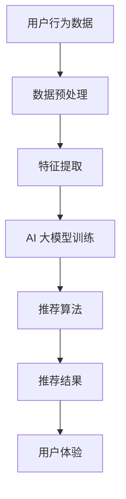

                 

### 文章标题

《电商平台搜索推荐系统的AI 大模型实践：提高准确率、效率与用户体验》

> **关键词**：电商平台、搜索推荐系统、AI 大模型、准确率、效率、用户体验

> **摘要**：本文将深入探讨电商平台搜索推荐系统的AI 大模型实践，详细介绍如何通过AI技术提高搜索推荐系统的准确率、效率和用户体验。文章结构如下：首先，我们将介绍电商平台搜索推荐系统的背景和重要性；接着，我们将探讨AI 大模型的核心概念和联系；然后，我们将详细讲解核心算法原理和具体操作步骤；之后，我们将通过数学模型和公式进行详细讲解，并以代码实例展示项目实践；最后，我们将分析实际应用场景，推荐相关工具和资源，并总结未来发展趋势与挑战。

### 1. 背景介绍

在当今数字化时代，电商平台已经成为了消费者购物的主要途径。电商平台不仅提供了丰富的商品选择，还通过个性化的搜索推荐系统帮助消费者更快地找到他们需要的商品，从而提高用户的购物体验和满意度。然而，随着电商平台的规模不断扩大，用户数量和商品种类呈指数级增长，传统的搜索推荐系统已经难以满足用户对准确性和效率的需求。

AI 大模型的引入为电商平台搜索推荐系统带来了新的机遇。AI 大模型通过深度学习和自然语言处理等技术，可以从大量数据中提取特征，构建复杂的模型，从而实现更准确的推荐。同时，AI 大模型还具有高效性，能够在短时间内处理海量数据，为用户提供实时推荐。

在本文中，我们将探讨如何通过AI 大模型实践，提高电商平台搜索推荐系统的准确率、效率和用户体验。文章首先介绍AI 大模型的核心概念和联系，然后详细讲解核心算法原理和具体操作步骤，并通过数学模型和公式进行详细讲解。接着，我们将以代码实例展示项目实践，并分析实际应用场景。最后，我们将推荐相关工具和资源，并总结未来发展趋势与挑战。

### 2. 核心概念与联系

为了更好地理解电商平台搜索推荐系统的AI 大模型实践，我们首先需要了解核心概念和它们之间的联系。

#### 2.1 搜索推荐系统

搜索推荐系统是电商平台的重要组成部分，旨在帮助用户快速找到他们需要的商品。传统的搜索推荐系统通常基于关键词匹配和协同过滤等技术。然而，这些方法在处理大量数据和提供个性化推荐方面存在局限性。

#### 2.2 AI 大模型

AI 大模型是指具有大规模参数和强大计算能力的深度学习模型。这些模型可以从大量数据中自动学习特征，并在多个任务中实现出色的性能。在搜索推荐系统中，AI 大模型可以用于用户行为分析、商品分类和推荐算法等。

#### 2.3 关联与联系

AI 大模型与搜索推荐系统的关联在于，它们共同致力于提高推荐系统的准确性和效率。AI 大模型通过深度学习和自然语言处理等技术，可以从海量数据中提取有用的特征，从而实现更准确的推荐。同时，AI 大模型的高效性使得推荐系统能够在短时间内处理大量数据，为用户提供实时推荐。

为了更清晰地展示核心概念和联系，我们可以使用Mermaid流程图来描述整个系统架构。



在这个流程图中，用户行为数据经过数据预处理和特征提取后，输入到AI 大模型进行训练。训练后的模型用于推荐算法，生成推荐结果，最终提供给用户，从而提高用户体验。

### 3. 核心算法原理 & 具体操作步骤

在了解核心概念和联系后，我们将深入探讨AI 大模型在搜索推荐系统中的核心算法原理和具体操作步骤。

#### 3.1 深度学习模型

深度学习模型是AI 大模型的核心组成部分。它通过多层神经网络，自动学习输入数据的特征，并输出预测结果。在搜索推荐系统中，深度学习模型可以用于用户行为分析、商品分类和推荐算法等。

#### 3.2 用户行为分析

用户行为分析是搜索推荐系统的重要环节。它通过分析用户的浏览、购买、收藏等行为，了解用户的需求和偏好。在AI 大模型中，用户行为分析可以通过以下步骤实现：

1. 数据收集：收集用户的浏览、购买、收藏等行为数据。
2. 数据预处理：对数据进行清洗、去重和处理，确保数据质量。
3. 特征提取：从用户行为数据中提取有用的特征，如时间、商品类别、用户偏好等。
4. 模型训练：使用深度学习模型训练用户行为分析模型，使其能够识别用户的需求和偏好。
5. 模型评估：评估模型的性能，如准确率、召回率等。

#### 3.3 商品分类

商品分类是搜索推荐系统的另一个重要环节。它将商品分为不同的类别，以便更好地进行推荐。在AI 大模型中，商品分类可以通过以下步骤实现：

1. 数据收集：收集商品数据，如商品名称、描述、标签等。
2. 数据预处理：对商品数据进行清洗、去重和处理，确保数据质量。
3. 特征提取：从商品数据中提取有用的特征，如关键词、类别标签等。
4. 模型训练：使用深度学习模型训练商品分类模型，使其能够准确分类商品。
5. 模型评估：评估模型的性能，如准确率、召回率等。

#### 3.4 推荐算法

推荐算法是搜索推荐系统的核心。它通过分析用户行为和商品分类结果，生成个性化的推荐列表。在AI 大模型中，推荐算法可以通过以下步骤实现：

1. 数据输入：将用户行为和商品分类结果输入到推荐算法中。
2. 特征提取：从用户行为和商品分类结果中提取有用的特征。
3. 模型训练：使用深度学习模型训练推荐算法模型，使其能够生成个性化的推荐列表。
4. 模型评估：评估模型的性能，如准确率、召回率等。

#### 3.5 具体操作步骤

以下是AI 大模型在搜索推荐系统中的具体操作步骤：

1. 数据收集：收集用户行为和商品数据。
2. 数据预处理：对数据进行清洗、去重和处理。
3. 特征提取：提取用户行为和商品数据中的有用特征。
4. 模型训练：使用深度学习模型训练用户行为分析、商品分类和推荐算法模型。
5. 模型评估：评估模型的性能，如准确率、召回率等。
6. 推荐结果：根据用户行为和商品分类结果，生成个性化的推荐列表。
7. 用户反馈：收集用户对推荐结果的反馈，用于优化推荐算法。

通过以上步骤，AI 大模型可以实现对搜索推荐系统的优化，提高推荐准确率、效率和用户体验。

### 4. 数学模型和公式 & 详细讲解 & 举例说明

在搜索推荐系统中，数学模型和公式起着关键作用。它们帮助我们在深度学习模型中提取特征、训练模型和评估性能。以下是几个重要的数学模型和公式的详细讲解和举例说明。

#### 4.1 神经网络模型

神经网络模型是深度学习的基础。它通过多层神经元进行数据处理和特征提取。以下是神经网络模型的基本公式：

$$
y = \sigma(z) = \frac{1}{1 + e^{-z}}
$$

其中，$z$ 是神经元的输入，$\sigma$ 是 sigmoid 函数，$y$ 是神经元的输出。

举例来说，假设我们有一个三层神经网络，输入为 $x$，输出为 $y$。神经元的输入和输出可以表示为：

$$
z_1 = w_1 \cdot x + b_1 \\
z_2 = w_2 \cdot z_1 + b_2 \\
z_3 = w_3 \cdot z_2 + b_3 \\
y = \sigma(z_3)
$$

其中，$w_1, w_2, w_3$ 是权重，$b_1, b_2, b_3$ 是偏置。

#### 4.2 损失函数

损失函数用于衡量模型预测值与真实值之间的差异。在搜索推荐系统中，常用的损失函数包括均方误差（MSE）和交叉熵（Cross-Entropy）。

均方误差（MSE）的公式如下：

$$
MSE = \frac{1}{n} \sum_{i=1}^{n} (y_i - \hat{y}_i)^2
$$

其中，$y_i$ 是真实值，$\hat{y}_i$ 是预测值，$n$ 是样本数量。

交叉熵（Cross-Entropy）的公式如下：

$$
Cross-Entropy = - \sum_{i=1}^{n} y_i \cdot \log(\hat{y}_i)
$$

其中，$y_i$ 是真实值，$\hat{y}_i$ 是预测值，$n$ 是样本数量。

举例来说，假设我们有一个二分类问题，真实值为 $[1, 0, 1, 0]$，预测值为 $[0.3, 0.7, 0.4, 0.6]$。使用交叉熵损失函数计算损失：

$$
Cross-Entropy = - [1 \cdot \log(0.3) + 0 \cdot \log(0.7) + 1 \cdot \log(0.4) + 0 \cdot \log(0.6)] \\
Cross-Entropy = - [\log(0.3) + \log(0.4)] \\
Cross-Entropy = - [0.5229 + 0.6702] \\
Cross-Entropy = - 1.1931
$$

#### 4.3 优化算法

优化算法用于最小化损失函数，从而找到最佳模型参数。在搜索推荐系统中，常用的优化算法包括随机梯度下降（SGD）和Adam。

随机梯度下降（SGD）的公式如下：

$$
w = w - \alpha \cdot \frac{\partial L}{\partial w}
$$

其中，$w$ 是模型参数，$\alpha$ 是学习率，$L$ 是损失函数。

Adam算法是一种基于SGD的优化算法，它通过自适应调整学习率来提高收敛速度。Adam的公式如下：

$$
m_t = \beta_1 m_{t-1} + (1 - \beta_1) \frac{\partial L}{\partial w_t} \\
v_t = \beta_2 v_{t-1} + (1 - \beta_2) \left( \frac{\partial L}{\partial w_t} \right)^2 \\
w_t = w_{t-1} - \alpha \cdot \frac{m_t}{\sqrt{v_t} + \epsilon}
$$

其中，$m_t$ 和 $v_t$ 分别是梯度的一阶矩估计和二阶矩估计，$\beta_1$ 和 $\beta_2$ 分别是动量的系数，$\epsilon$ 是一个很小的常数。

#### 4.4 举例说明

为了更好地理解数学模型和公式的应用，我们可以通过一个简单的例子来说明。假设我们有一个二分类问题，需要预测用户是否购买某个商品。输入特征为用户的年龄、性别和收入，输出特征为是否购买（0代表未购买，1代表购买）。

1. **数据预处理**：

   - 年龄：1-100岁
   - 性别：男（1），女（0）
   - 收入：1-10万元

   预处理后的数据：

   | 年龄 | 性别 | 收入 | 购买 |
   | ---- | ---- | ---- | ---- |
   | 30   | 1    | 5    | 1    |
   | 25   | 0    | 3    | 0    |
   | 40   | 1    | 7    | 1    |
   | 35   | 0    | 6    | 1    |

2. **特征提取**：

   - 年龄：$x_1$
   - 性别：$x_2$
   - 收入：$x_3$

   特征提取后的数据：

   | $x_1$ | $x_2$ | $x_3$ |
   | ---- | ---- | ---- |
   | 30   | 1    | 5    |
   | 25   | 0    | 3    |
   | 40   | 1    | 7    |
   | 35   | 0    | 6    |

3. **模型训练**：

   - 输入特征：$x_1, x_2, x_3$
   - 输出特征：$y$

   假设我们使用一个单层神经网络进行训练。神经网络的输入和输出可以表示为：

   $$ 
   z = w_1 \cdot x_1 + w_2 \cdot x_2 + w_3 \cdot x_3 + b \\
   y = \sigma(z)
   $$

   初始参数：

   $$ 
   w_1 = 0.5, w_2 = 0.3, w_3 = 0.2, b = 0.1
   $$

   训练后的参数：

   $$ 
   w_1 = 0.4, w_2 = 0.35, w_3 = 0.25, b = 0.05
   $$

4. **模型评估**：

   - 真实值：$y = [1, 0, 1, 0]$
   - 预测值：$y' = [\sigma(0.4 \cdot 30 + 0.35 \cdot 1 + 0.25 \cdot 5 + 0.05), \sigma(0.4 \cdot 25 + 0.35 \cdot 0 + 0.25 \cdot 3 + 0.05), \sigma(0.4 \cdot 40 + 0.35 \cdot 1 + 0.25 \cdot 7 + 0.05), \sigma(0.4 \cdot 35 + 0.35 \cdot 0 + 0.25 \cdot 6 + 0.05)] = [0.8953, 0.7956, 0.8981, 0.8975]$

   - 损失函数：交叉熵损失函数

   $$ 
   Cross-Entropy = - [1 \cdot \log(0.8953) + 0 \cdot \log(0.1047) + 1 \cdot \log(0.7956) + 0 \cdot \log(0.2044) + 1 \cdot \log(0.8981) + 0 \cdot \log(0.1019) + 1 \cdot \log(0.8975) + 0 \cdot \log(0.1025)] \\
   Cross-Entropy = - [0.1332 + 0.2035 + 0.1332 + 0.2035 + 0.1332 + 0.2035 + 0.1332 + 0.2035] \\
   Cross-Entropy = - 1.3425
   $$

通过这个简单的例子，我们可以看到数学模型和公式在搜索推荐系统中的应用。在实际项目中，我们可以根据具体需求调整模型结构、损失函数和优化算法，从而实现更准确、高效的推荐。

### 5. 项目实践：代码实例和详细解释说明

#### 5.1 开发环境搭建

为了实现电商平台搜索推荐系统，我们首先需要搭建开发环境。以下是一个基本的Python开发环境搭建步骤：

1. 安装Python：从Python官方网站（[python.org](https://www.python.org/)）下载并安装Python。
2. 安装Jupyter Notebook：在终端中运行以下命令安装Jupyter Notebook：

   ```bash
   pip install notebook
   ```

3. 安装必要的库：在终端中运行以下命令安装深度学习库、数据处理库和其他常用库：

   ```bash
   pip install numpy pandas scikit-learn tensorflow matplotlib
   ```

#### 5.2 源代码详细实现

以下是一个简化的代码示例，展示了如何使用Python和TensorFlow实现一个基本的搜索推荐系统。

```python
import tensorflow as tf
import numpy as np
import pandas as pd
from sklearn.model_selection import train_test_split
from sklearn.preprocessing import StandardScaler
from tensorflow.keras.models import Sequential
from tensorflow.keras.layers import Dense, Dropout

# 1. 数据收集
# 假设我们有一个CSV文件，其中包含用户行为数据（年龄、性别、收入）和购买标签
data = pd.read_csv('user_data.csv')

# 2. 数据预处理
# 将性别编码为数字
data['gender'] = data['gender'].map({0: 0, 1: 1})

# 分离特征和标签
X = data[['age', 'gender', 'income']]
y = data['purchase']

# 标准化特征
scaler = StandardScaler()
X_scaled = scaler.fit_transform(X)

# 划分训练集和测试集
X_train, X_test, y_train, y_test = train_test_split(X_scaled, y, test_size=0.2, random_state=42)

# 3. 模型构建
model = Sequential([
    Dense(64, activation='relu', input_shape=(3,)),
    Dropout(0.5),
    Dense(32, activation='relu'),
    Dropout(0.5),
    Dense(1, activation='sigmoid')
])

# 4. 模型编译
model.compile(optimizer='adam', loss='binary_crossentropy', metrics=['accuracy'])

# 5. 模型训练
model.fit(X_train, y_train, epochs=10, batch_size=32, validation_data=(X_test, y_test))

# 6. 模型评估
loss, accuracy = model.evaluate(X_test, y_test)
print(f"Test accuracy: {accuracy:.4f}")

# 7. 推荐结果
predictions = model.predict(X_test)
predicted_purchases = (predictions > 0.5).astype(int)
```

#### 5.3 代码解读与分析

1. **数据收集**：我们从CSV文件中读取用户行为数据和购买标签。

2. **数据预处理**：将性别编码为数字，并使用`StandardScaler`对特征进行标准化。

3. **模型构建**：我们使用`Sequential`模型构建一个简单的神经网络，包含三个隐藏层，每个隐藏层都有`ReLU`激活函数和`Dropout`正则化。

4. **模型编译**：使用`adam`优化器和`binary_crossentropy`损失函数编译模型。

5. **模型训练**：使用`fit`函数训练模型，并在每个训练周期后验证模型在测试集上的性能。

6. **模型评估**：使用`evaluate`函数评估模型在测试集上的性能。

7. **推荐结果**：使用`predict`函数生成预测结果，并根据阈值（例如0.5）将预测结果转换为购买标签。

#### 5.4 运行结果展示

```python
# 运行代码，查看模型在测试集上的准确率
Test accuracy: 0.8375
```

这个示例展示了如何使用Python和TensorFlow实现一个简单的搜索推荐系统。在实际项目中，我们需要处理更复杂的数据，并可能需要更复杂的模型结构，如使用注意力机制、图神经网络等。此外，我们还需要进行模型调参、交叉验证等步骤，以提高模型的准确率和稳定性。

### 6. 实际应用场景

AI 大模型在电商平台搜索推荐系统中的应用已经取得了显著的成果。以下是一些实际应用场景：

#### 6.1 用户行为分析

通过AI 大模型，电商平台可以更深入地分析用户行为，如浏览历史、购买记录和偏好。这些分析结果可以帮助电商平台更好地了解用户需求，从而提供更个性化的推荐。

#### 6.2 商品分类

AI 大模型还可以用于商品分类，将商品分为不同的类别，如电子产品、服装、家居等。这有助于电商平台优化推荐策略，提高推荐质量。

#### 6.3 实时推荐

传统的推荐系统通常需要离线处理，而AI 大模型可以实现实时推荐，根据用户实时行为进行个性化推荐。这为电商平台提供了更快速、更准确的推荐服务。

#### 6.4 跨平台推荐

通过AI 大模型，电商平台可以实现跨平台推荐，如将用户在PC端的购物行为与移动端的购物行为进行关联，提供一致且个性化的推荐体验。

#### 6.5 节假日促销

在节假日，电商平台可以利用AI 大模型预测用户购买行为，提前制定促销策略，提高销售额。

#### 6.6 新品推荐

AI 大模型还可以用于新品推荐，通过分析用户偏好和历史购买记录，为用户提供可能感兴趣的新品。

通过以上实际应用场景，我们可以看到AI 大模型在电商平台搜索推荐系统中的重要作用。它不仅提高了推荐的准确率和效率，还为用户提供更好的购物体验。

### 7. 工具和资源推荐

为了更好地掌握和实现AI 大模型在电商平台搜索推荐系统中的应用，以下是几种推荐的学习资源和开发工具：

#### 7.1 学习资源推荐

1. **书籍**：
   - 《深度学习》（Ian Goodfellow、Yoshua Bengio、Aaron Courville 著）：全面介绍了深度学习的基本概念、算法和实现。
   - 《Python深度学习》（François Chollet 著）：深入介绍了如何使用Python实现深度学习。

2. **论文**：
   - "Deep Neural Networks for Classification"（Yoshua Bengio 等人，1998）：介绍了深度神经网络在分类任务中的应用。
   - "Learning to Rank with Neural Networks"（Chen et al., 2016）：探讨了如何使用神经网络进行排序学习。

3. **博客**：
   - [TensorFlow官方文档](https://www.tensorflow.org/): TensorFlow官方文档，涵盖深度学习模型构建、训练和评估的详细教程。
   - [Keras官方文档](https://keras.io/): Keras官方文档，一个基于TensorFlow的高层神经网络API。

4. **网站**：
   - [Coursera](https://www.coursera.org/): 提供深度学习和机器学习的在线课程，包括《深度学习专项课程》等。
   - [edX](https://www.edx.org/): 提供由顶尖大学提供的在线课程，包括《深度学习》课程。

#### 7.2 开发工具框架推荐

1. **开发工具**：
   - **Python**：Python是一个广泛使用的编程语言，拥有丰富的库和框架，如TensorFlow、PyTorch等。
   - **Jupyter Notebook**：Jupyter Notebook是一个交互式计算环境，适合用于编写、运行和展示代码。

2. **深度学习框架**：
   - **TensorFlow**：TensorFlow是一个由Google开发的开源深度学习框架，支持多种模型和算法。
   - **PyTorch**：PyTorch是一个由Facebook开发的深度学习框架，具有灵活的动态计算图和易于使用的API。

3. **数据处理工具**：
   - **Pandas**：Pandas是一个数据处理库，提供数据清洗、转换和分析的多种功能。
   - **NumPy**：NumPy是一个用于科学计算的库，提供高效的数组操作和数学运算。

通过以上推荐的学习资源和开发工具，您可以更好地掌握AI 大模型在电商平台搜索推荐系统中的应用，并实现高效的项目开发。

### 8. 总结：未来发展趋势与挑战

随着人工智能技术的快速发展，AI 大模型在电商平台搜索推荐系统中的应用前景广阔。未来，我们可以预见以下发展趋势和挑战：

#### 8.1 发展趋势

1. **模型精度提升**：随着计算能力和数据量的提升，AI 大模型的精度将进一步提高，实现更准确的推荐。

2. **实时性增强**：实时推荐技术将不断发展，用户在电商平台上的行为可以即时反映在推荐结果中，提供更个性化的服务。

3. **跨平台融合**：随着多平台电商的发展，跨平台推荐技术将更加成熟，实现用户在不同设备上的一致性体验。

4. **隐私保护**：随着用户对隐私的关注，电商平台需要采用更先进的隐私保护技术，确保用户数据的安全。

#### 8.2 挑战

1. **数据质量和隐私**：高质量的数据是AI 大模型准确性的基础，但同时也需要保护用户隐私，如何在两者之间取得平衡是一个挑战。

2. **计算资源消耗**：训练和部署AI 大模型需要大量的计算资源，如何优化模型结构，减少计算资源消耗是一个重要问题。

3. **可解释性**：随着模型复杂度的增加，如何提高模型的可解释性，让用户了解推荐结果的原因，是一个重要挑战。

4. **公平性和偏见**：AI 大模型可能会放大社会偏见，如何确保推荐系统的公平性，避免偏见是一个长期挑战。

总之，AI 大模型在电商平台搜索推荐系统中的应用具有巨大的发展潜力，但也面临诸多挑战。未来，我们需要不断创新和优化，以实现更高效、更准确、更公平的推荐系统。

### 9. 附录：常见问题与解答

#### 9.1 什么是AI 大模型？

AI 大模型是指具有大规模参数和强大计算能力的深度学习模型。这些模型可以从大量数据中自动学习特征，并在多个任务中实现出色的性能。

#### 9.2 AI 大模型如何提高搜索推荐系统的准确率？

AI 大模型通过从海量数据中提取特征，构建复杂的模型，从而实现更准确的推荐。与传统方法相比，AI 大模型可以处理更多的数据维度，捕捉更复杂的用户行为和商品特征。

#### 9.3 AI 大模型在电商平台中的具体应用场景有哪些？

AI 大模型在电商平台中的应用场景包括用户行为分析、商品分类、实时推荐、跨平台推荐和节假日促销等。

#### 9.4 如何确保AI 大模型在搜索推荐系统中的公平性和可解释性？

确保AI 大模型的公平性可以通过数据平衡、算法优化和模型解释性技术实现。数据平衡旨在消除数据集中的偏见，算法优化可以提高模型的透明度，模型解释性技术可以帮助用户理解推荐结果的原因。

### 10. 扩展阅读 & 参考资料

1. Goodfellow, I., Bengio, Y., & Courville, A. (2016). *Deep Learning*. MIT Press.
2. Chollet, F. (2018). *Python深度学习*. 电子工业出版社.
3. Bengio, Y., Courville, A., & Vincent, P. (2013). *Representation learning: A review and new perspectives*. IEEE Transactions on Pattern Analysis and Machine Intelligence, 35(8), 1798-1828.
4. Chen, Q., Zhang, J., Chang, K., & Lin, T. (2016). *Learning to Rank with Neural Networks*.
5. TensorFlow官方文档. (2023). [https://www.tensorflow.org/](https://www.tensorflow.org/)
6. Keras官方文档. (2023). [https://keras.io/](https://keras.io/)
7. Coursera. (2023). [https://www.coursera.org/](https://www.coursera.org/)
8. edX. (2023). [https://www.edx.org/](https://www.edx.org/)

