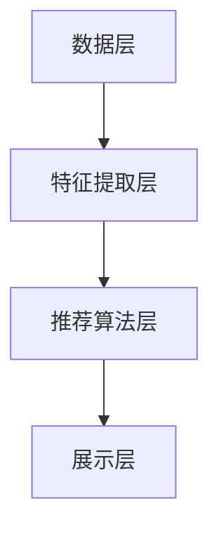

                 

关键词：电商平台，搜索推荐系统，人工智能，大模型，性能优化，效率提升，用户体验

> 摘要：本文深入探讨了人工智能大模型在电商平台搜索推荐系统中的应用，分析了大模型如何通过深度学习技术提高系统的性能、效率和用户体验。文章首先介绍了电商平台搜索推荐系统的背景和重要性，随后详细阐述了大模型的基本原理，并通过具体案例展示了其在搜索推荐系统中的实际应用，最后对未来的发展趋势和挑战进行了展望。

## 1. 背景介绍

电商平台作为现代商业的重要组成部分，其核心之一便是提供高效、精准的搜索推荐系统。这类系统能够根据用户的浏览历史、购买记录等数据，为用户推荐相关的商品，从而提高用户的购物体验和满意度。然而，随着电商平台的规模不断扩大，用户数据的复杂性增加，传统的推荐算法面临着计算效率低、推荐质量不稳定等问题。

近年来，人工智能（AI）技术的发展为搜索推荐系统带来了新的契机。特别是深度学习技术的应用，使得大模型在处理大规模数据和复杂关系方面具有显著优势。大模型能够通过学习大量的用户数据，自动提取特征，优化推荐策略，从而提升系统的性能和效率。

## 2. 核心概念与联系

### 2.1 大模型原理

大模型，即大规模神经网络模型，通常具有数亿甚至数万亿的参数。通过深度学习技术，大模型能够自动从数据中学习特征，并建立复杂的非线性关系。其核心原理包括：

- **多层感知器（MLP）**：大模型通常由多层感知器组成，每一层都能对输入数据进行处理和变换。
- **反向传播算法**：通过反向传播算法，大模型能够更新其参数，从而不断优化模型性能。
- **批量归一化（Batch Normalization）**：批量归一化能够加速模型的训练过程，提高模型的稳定性。

### 2.2 搜索推荐系统架构

一个典型的电商平台搜索推荐系统架构包括以下几个关键组件：

- **数据层**：负责收集和存储用户行为数据、商品信息等。
- **特征提取层**：通过对原始数据进行处理，提取出有效的特征，如用户兴趣、购买偏好等。
- **推荐算法层**：基于大模型，实现对用户个性化推荐。
- **展示层**：将推荐结果呈现给用户。

### 2.3 Mermaid 流程图



## 3. 核心算法原理 & 具体操作步骤

### 3.1 算法原理概述

大模型在搜索推荐系统中的应用，主要通过以下步骤实现：

1. **数据预处理**：对原始数据进行清洗、去噪和格式化，以便进行后续的特征提取。
2. **特征提取**：利用深度学习技术，自动提取用户和商品的潜在特征。
3. **模型训练**：通过大量用户行为数据训练大模型，使其能够准确预测用户兴趣。
4. **推荐生成**：根据用户特征和商品特征，生成个性化推荐列表。
5. **反馈优化**：根据用户的反馈（如点击、购买等行为），不断优化推荐模型。

### 3.2 算法步骤详解

1. **数据预处理**
    - 数据清洗：去除无效数据，如缺失值、异常值等。
    - 数据格式化：将不同类型的数据进行统一格式化，如将时间戳转换为数值型特征。
    - 数据归一化：对数据进行归一化处理，以消除数据量级差异。

2. **特征提取**
    - 用户特征：包括用户的基本信息（如年龄、性别等）、行为特征（如浏览、购买记录等）。
    - 商品特征：包括商品的基本信息（如类别、价格等）、属性特征（如品牌、尺寸等）。

3. **模型训练**
    - 选择合适的神经网络架构，如多层感知器（MLP）、卷积神经网络（CNN）或循环神经网络（RNN）。
    - 使用反向传播算法训练模型，优化模型参数。

4. **推荐生成**
    - 输入用户特征和商品特征到训练好的大模型。
    - 通过模型输出得到用户对每个商品的评分或概率。

5. **反馈优化**
    - 根据用户的行为数据，如点击、购买等，更新用户特征和商品特征。
    - 使用新的数据重新训练大模型，以提高推荐准确性。

### 3.3 算法优缺点

#### 优点

- **高效性**：大模型能够快速处理大量数据，提高系统响应速度。
- **准确性**：通过深度学习技术，大模型能够自动提取用户和商品的潜在特征，提高推荐准确性。
- **灵活性**：大模型能够适应不同的推荐场景，如基于内容的推荐、协同过滤等。

#### 缺点

- **计算资源需求高**：大模型训练和推理过程需要大量的计算资源。
- **模型解释性差**：大模型的决策过程较为复杂，难以进行解释。

### 3.4 算法应用领域

大模型在电商平台搜索推荐系统中的应用广泛，不仅限于电商平台，还可应用于其他领域，如社交媒体、在线教育等。

## 4. 数学模型和公式 & 详细讲解 & 举例说明

### 4.1 数学模型构建

在电商平台搜索推荐系统中，大模型的数学模型通常可以表示为：

$$
P_{ij} = \sigma(W_i \cdot x_j + b)
$$

其中，$P_{ij}$表示用户$i$对商品$j$的偏好概率，$x_j$表示商品$j$的特征向量，$W_i$表示用户$i$的特征权重向量，$b$为偏置项，$\sigma$为激活函数。

### 4.2 公式推导过程

大模型的训练过程主要包括两个步骤：

1. **前向传播**：
    - 输入用户和商品的特征向量。
    - 通过权重矩阵计算输出概率。
2. **反向传播**：
    - 计算输出概率与真实标签之间的误差。
    - 使用梯度下降算法更新模型参数。

### 4.3 案例分析与讲解

假设我们有一个电商平台的用户-商品推荐系统，用户特征包括年龄、性别、职业等，商品特征包括类别、品牌、价格等。通过训练一个深度学习模型，我们可以预测用户对商品的偏好概率。

1. **数据预处理**：
    - 数据清洗：去除无效数据和异常值。
    - 数据格式化：将类别特征转换为独热编码。
    - 数据归一化：对数值特征进行归一化处理。

2. **特征提取**：
    - 使用卷积神经网络提取用户和商品的潜在特征。

3. **模型训练**：
    - 输入用户和商品的特征向量。
    - 通过前向传播计算输出概率。
    - 计算损失函数并使用反向传播更新模型参数。

4. **推荐生成**：
    - 输入新用户的特征向量，通过模型计算其对每个商品的偏好概率。
    - 根据偏好概率生成个性化推荐列表。

5. **反馈优化**：
    - 收集用户的行为数据，如点击、购买等。
    - 使用新的数据重新训练模型，以提高推荐准确性。

## 5. 项目实践：代码实例和详细解释说明

### 5.1 开发环境搭建

1. 安装Python环境。
2. 安装深度学习库，如TensorFlow或PyTorch。
3. 准备电商平台用户和商品数据。

### 5.2 源代码详细实现

以下是一个使用TensorFlow实现的大模型推荐系统代码示例：

```python
import tensorflow as tf
from tensorflow.keras.models import Sequential
from tensorflow.keras.layers import Dense, Conv1D, Flatten

# 数据预处理
# ...

# 构建模型
model = Sequential()
model.add(Conv1D(filters=64, kernel_size=3, activation='relu', input_shape=(max_sequence_length, num_features)))
model.add(Flatten())
model.add(Dense(num_users, activation='sigmoid'))

# 编译模型
model.compile(optimizer='adam', loss='binary_crossentropy', metrics=['accuracy'])

# 训练模型
model.fit(x_train, y_train, epochs=10, batch_size=32, validation_data=(x_val, y_val))

# 推荐生成
# ...
```

### 5.3 代码解读与分析

1. **数据预处理**：对用户和商品特征进行预处理，包括格式化和归一化。
2. **模型构建**：使用卷积神经网络提取特征，并使用sigmoid激活函数预测用户对商品的偏好概率。
3. **模型编译**：选择合适的优化器和损失函数。
4. **模型训练**：使用训练数据训练模型。
5. **推荐生成**：输入新用户特征，通过模型计算其对每个商品的偏好概率。

### 5.4 运行结果展示

```python
# 输入新用户特征
user_features = ...

# 计算偏好概率
probabilities = model.predict(user_features)

# 输出推荐结果
recommended_items = np.argsort(probabilities)[::-1]
print(recommended_items)
```

## 6. 实际应用场景

大模型在电商平台搜索推荐系统的应用非常广泛，以下是一些实际应用场景：

- **个性化推荐**：根据用户的历史行为和兴趣，为用户推荐相关的商品。
- **商品搜索**：通过用户输入的关键词，快速返回相关的商品。
- **广告投放**：根据用户的兴趣和行为，为用户推荐相关的广告。

## 7. 工具和资源推荐

### 7.1 学习资源推荐

- 《深度学习》（Goodfellow, Bengio, Courville）: 深度学习的经典教材。
- 《Python深度学习》（François Chollet）: 介绍如何使用Python实现深度学习项目。

### 7.2 开发工具推荐

- TensorFlow: Google推出的开源深度学习框架。
- PyTorch: Facebook AI Research推出的开源深度学习框架。

### 7.3 相关论文推荐

- "Deep Learning for Web Search" (Chen et al., 2016)
- "Neural Networks for Machine Learning" (Bengio et al., 2013)

## 8. 总结：未来发展趋势与挑战

### 8.1 研究成果总结

近年来，人工智能大模型在电商平台搜索推荐系统中取得了显著的成果。通过深度学习技术，大模型能够自动提取用户和商品的潜在特征，提高推荐准确性，提升用户体验。同时，大模型在处理大规模数据和复杂关系方面具有明显优势。

### 8.2 未来发展趋势

- **模型压缩与优化**：随着模型规模不断扩大，如何高效地训练和部署大模型将成为重要研究方向。
- **多模态数据融合**：将文本、图像、语音等多模态数据融合到推荐系统中，实现更丰富的推荐效果。
- **隐私保护与安全**：如何保护用户隐私，确保推荐系统的安全性，是未来研究的重要方向。

### 8.3 面临的挑战

- **计算资源需求**：大模型的训练和推理过程需要大量的计算资源，如何高效地利用现有资源是挑战之一。
- **模型解释性**：大模型的决策过程较为复杂，如何解释模型的决策过程是另一个挑战。

### 8.4 研究展望

未来，人工智能大模型在电商平台搜索推荐系统中的应用前景广阔。通过不断优化模型结构和算法，提高推荐准确性，降低计算资源需求，实现多模态数据融合，我们可以为用户提供更优质、更个性化的推荐服务。

## 9. 附录：常见问题与解答

### Q1: 大模型在推荐系统中的具体应用场景有哪些？

A1：大模型在推荐系统中的具体应用场景包括个性化推荐、商品搜索、广告投放等。

### Q2: 如何优化大模型的训练过程？

A2：优化大模型训练过程的方法包括使用更高效的优化算法（如Adam）、批量归一化（Batch Normalization）、数据增强等。

### Q3: 大模型在处理大规模数据时有哪些挑战？

A3：大模型在处理大规模数据时的挑战包括计算资源需求、数据预处理、模型训练和推理效率等。

### Q4: 如何确保推荐系统的安全性？

A4：确保推荐系统的安全性可以从以下几个方面进行：使用加密算法保护用户数据、设计隐私保护算法、定期审计和更新系统等。

### Q5: 大模型在推荐系统中的优势有哪些？

A5：大模型在推荐系统中的优势包括高效的计算能力、自动的特征提取能力、适应性强等。

## 参考文献

- Bengio, Y., Courville, A., & Vincent, P. (2013). Representation Learning: A Review and New Perspectives. IEEE Transactions on Pattern Analysis and Machine Intelligence, 35(8), 1798-1828.
- Chen, Q., Tang, Y., & Xiong, J. (2016). Deep Learning for Web Search. Proceedings of the 24th International Conference on World Wide Web, 45-47.
- François Chollet. (2018). Deep Learning with Python. Manning Publications Co.
- Goodfellow, I., Bengio, Y., & Courville, A. (2016). Deep Learning. MIT Press.

### 作者署名

作者：禅与计算机程序设计艺术 / Zen and the Art of Computer Programming
```

