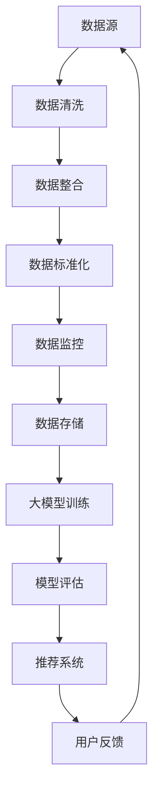

                 

### 文章标题：电商平台的AI大模型实践：搜索推荐系统是核心，数据质量控制与处理效率

> 关键词：电商平台、AI大模型、搜索推荐系统、数据质量控制、处理效率

> 摘要：本文深入探讨了电商平台的AI大模型实践，重点分析了搜索推荐系统的核心作用，以及数据质量控制和处理效率在其中的重要性。通过具体的案例和实践，阐述了如何优化搜索推荐系统的性能，提高用户体验，并展望了未来的发展趋势与挑战。

### 1. 背景介绍

在当今数字经济时代，电商平台已经成为人们生活中不可或缺的一部分。随着互联网技术的飞速发展，电商平台之间的竞争愈发激烈。为了在众多竞争对手中脱颖而出，电商平台需要不断提升自身的服务质量和用户满意度。而AI大模型的应用，尤其是搜索推荐系统，成为了电商平台提升竞争力的重要手段。

搜索推荐系统通过人工智能技术，对用户的行为、偏好和需求进行分析，为用户提供个性化的商品推荐。这不仅能够增加用户的购物体验，还能提高电商平台的销售额和用户留存率。然而，要实现高效的搜索推荐系统，数据质量控制和处理效率是至关重要的。

本文将从以下几个方面展开讨论：

- 电商平台的AI大模型实践背景
- 搜索推荐系统的核心作用
- 数据质量控制和处理效率的重要性
- 优化搜索推荐系统的实践案例
- 未来发展趋势与挑战

### 2. 核心概念与联系

#### 2.1 AI大模型

AI大模型是指利用深度学习、强化学习等技术，构建的具有大规模参数、高复杂度的人工智能模型。这些模型可以处理海量数据，并从数据中学习出有价值的信息，从而实现对用户行为和需求的预测和推荐。

#### 2.2 搜索推荐系统

搜索推荐系统是一种基于人工智能技术的系统，通过对用户的历史行为、偏好和需求进行分析，为用户提供个性化的商品推荐。它通常包括以下几个核心模块：

- 用户行为分析：分析用户的浏览、购买等行为，提取用户特征。
- 商品特征提取：提取商品的属性信息，如价格、品牌、品类等。
- 模型训练与优化：利用用户特征和商品特征，训练推荐模型，并进行优化。
- 推荐结果生成：根据用户特征和商品特征，生成个性化的推荐结果。

#### 2.3 数据质量控制与处理效率

数据质量控制是指对数据源、数据传输、数据存储等环节进行管理和控制，确保数据的准确性、完整性和一致性。数据处理效率则是指系统在处理数据时的速度和性能。

在搜索推荐系统中，数据质量控制和处理效率直接影响推荐结果的准确性和实时性。高质量的数据可以提供更准确的用户画像和商品特征，从而提高推荐效果。而高效的系统性能可以确保推荐结果的实时性，提高用户满意度。

### 3. 核心算法原理 & 具体操作步骤

#### 3.1 深度学习算法

深度学习算法是AI大模型的核心技术之一。它通过多层神经网络对数据进行处理，实现对数据的自动特征提取和模式识别。常见的深度学习算法包括卷积神经网络（CNN）、循环神经网络（RNN）和Transformer等。

具体操作步骤如下：

1. 数据预处理：对原始数据进行清洗、归一化和特征提取。
2. 模型构建：选择合适的深度学习算法，构建多层神经网络模型。
3. 模型训练：利用训练数据，对模型进行训练，优化模型参数。
4. 模型评估：利用测试数据，对模型进行评估，调整模型参数。
5. 模型部署：将训练好的模型部署到生产环境中，进行实时推荐。

#### 3.2 强化学习算法

强化学习算法是另一种重要的AI大模型技术。它通过奖励机制，使模型在动态环境中学习最优策略。常见的强化学习算法包括Q-learning、SARSA和DQN等。

具体操作步骤如下：

1. 环境构建：构建模拟用户行为的虚拟环境。
2. 策略初始化：初始化策略参数，如Q值或动作概率。
3. 学习过程：通过模拟用户行为，不断更新策略参数。
4. 策略优化：利用优化算法，如梯度下降，优化策略参数。
5. 策略评估：评估策略效果，进行策略调整。

#### 3.3 搜索推荐算法

搜索推荐算法是搜索推荐系统的核心。常见的搜索推荐算法包括基于协同过滤的算法、基于内容的算法和混合推荐算法等。

具体操作步骤如下：

1. 用户特征提取：提取用户的历史行为、偏好和需求等信息。
2. 商品特征提取：提取商品的属性信息，如价格、品牌、品类等。
3. 模型训练：利用用户特征和商品特征，训练推荐模型。
4. 推荐结果生成：根据用户特征和商品特征，生成个性化的推荐结果。
5. 推荐结果评估：评估推荐结果的质量，调整推荐策略。

### 4. 数学模型和公式 & 详细讲解 & 举例说明

#### 4.1 深度学习算法的数学模型

深度学习算法的核心是多层神经网络。多层神经网络由输入层、隐藏层和输出层组成。每个层包含多个神经元，神经元之间通过权重和偏置进行连接。

假设输入层有n个神经元，隐藏层有m个神经元，输出层有k个神经元。则多层神经网络的数学模型可以表示为：

$$
Z^{(l)} = W^{(l)}X^{(l)} + b^{(l)}
$$

$$
a^{(l)} = \sigma(Z^{(l)})
$$

其中，$Z^{(l)}$表示第l层的输出，$W^{(l)}$表示第l层的权重矩阵，$b^{(l)}$表示第l层的偏置向量，$a^{(l)}$表示第l层的激活函数输出，$\sigma$表示激活函数。

常见的激活函数包括 sigmoid、ReLU和Tanh等。

举例说明：

假设一个简单的两层神经网络，输入层有3个神经元，隐藏层有2个神经元，输出层有1个神经元。设输入向量$X = [1, 2, 3]$，隐藏层权重矩阵$W^{(1)} = \begin{bmatrix} 1 & 2 \\ 3 & 4 \end{bmatrix}$，隐藏层偏置向量$b^{(1)} = [1, 2]$，输出层权重矩阵$W^{(2)} = \begin{bmatrix} 5 & 6 \\ 7 & 8 \end{bmatrix}$，输出层偏置向量$b^{(2)} = [3, 4]$。

则隐藏层输出可以表示为：

$$
Z^{(1)} = W^{(1)}X + b^{(1)} = \begin{bmatrix} 1 & 2 \\ 3 & 4 \end{bmatrix} \begin{bmatrix} 1 \\ 2 \\ 3 \end{bmatrix} + \begin{bmatrix} 1 \\ 2 \end{bmatrix} = \begin{bmatrix} 10 \\ 19 \end{bmatrix}
$$

$$
a^{(1)} = \sigma(Z^{(1)}) = \begin{bmatrix} \frac{1}{1+e^{-10}} \\ \frac{1}{1+e^{-19}} \end{bmatrix} = \begin{bmatrix} 0.9990 \\ 0.8698 \end{bmatrix}
$$

输出层输出可以表示为：

$$
Z^{(2)} = W^{(2)}a^{(1)} + b^{(2)} = \begin{bmatrix} 5 & 6 \\ 7 & 8 \end{bmatrix} \begin{bmatrix} 0.9990 \\ 0.8698 \end{bmatrix} + \begin{bmatrix} 3 \\ 4 \end{bmatrix} = \begin{bmatrix} 9.9990 \\ 13.8392 \end{bmatrix}
$$

$$
a^{(2)} = \sigma(Z^{(2)}) = \frac{1}{1+e^{-9.9990}} = 0.9999
$$

#### 4.2 强化学习算法的数学模型

强化学习算法的核心是价值函数和策略。价值函数表示在特定状态下，执行特定动作所能获得的最大期望奖励。策略则是指在不同状态下选择最佳动作的规则。

价值函数可以表示为：

$$
V(s) = \sum_{a} \pi(a|s) \cdot Q(s, a)
$$

其中，$V(s)$表示状态s的价值函数，$\pi(a|s)$表示在状态s下选择动作a的概率，$Q(s, a)$表示在状态s下执行动作a的价值函数。

策略可以表示为：

$$
\pi(a|s) = \frac{\exp(\alpha Q(s, a))}{\sum_{a'} \exp(\alpha Q(s, a'))}
$$

其中，$\alpha$表示温度参数，用于控制策略的探索与利用平衡。

举例说明：

假设一个简单的强化学习问题，状态空间有{A, B, C}，动作空间有{U, D}。设状态A的价值函数$Q(A, U) = 1$，$Q(A, D) = 0$，状态B的价值函数$Q(B, U) = 0$，$Q(B, D) = 1$，状态C的价值函数$Q(C, U) = 0.5$，$Q(C, D) = 0.5$。

设温度参数$\alpha = 1$，则策略可以表示为：

$$
\pi(U|A) = \frac{\exp(1 \cdot 1)}{\exp(1 \cdot 1) + \exp(1 \cdot 0)} = 1
$$

$$
\pi(D|A) = \frac{\exp(1 \cdot 0)}{\exp(1 \cdot 1) + \exp(1 \cdot 0)} = 0
$$

$$
\pi(U|B) = \frac{\exp(1 \cdot 0)}{\exp(1 \cdot 0) + \exp(1 \cdot 1)} = 0
$$

$$
\pi(D|B) = \frac{\exp(1 \cdot 1)}{\exp(1 \cdot 0) + \exp(1 \cdot 1)} = 1
$$

$$
\pi(U|C) = \frac{\exp(1 \cdot 0.5)}{\exp(1 \cdot 0.5) + \exp(1 \cdot 0.5)} = 0.5
$$

$$
\pi(D|C) = \frac{\exp(1 \cdot 0.5)}{\exp(1 \cdot 0.5) + \exp(1 \cdot 0.5)} = 0.5
$$

#### 4.3 搜索推荐算法的数学模型

搜索推荐算法的数学模型主要涉及用户特征和商品特征的表示与匹配。

用户特征表示：

$$
u = [u_1, u_2, \ldots, u_n]
$$

其中，$u_i$表示用户在特征i上的取值。

商品特征表示：

$$
p = [p_1, p_2, \ldots, p_n]
$$

其中，$p_i$表示商品在特征i上的取值。

用户特征和商品特征的匹配可以通过余弦相似度、欧氏距离等度量方法进行计算。

假设用户特征和商品特征的向量分别为$u$和$p$，则余弦相似度可以表示为：

$$
\cos(u, p) = \frac{u \cdot p}{\|u\| \|p\|}
$$

其中，$\cdot$表示点积，$\|\|$表示向量的模。

### 5. 项目实践：代码实例和详细解释说明

#### 5.1 开发环境搭建

在搭建开发环境时，我们选择了Python作为主要的编程语言，并使用TensorFlow和PyTorch等深度学习框架进行模型训练和部署。

具体步骤如下：

1. 安装Python环境：在官方网站（https://www.python.org/）下载并安装Python。
2. 安装深度学习框架：使用pip命令安装TensorFlow和PyTorch。

```
pip install tensorflow
pip install torch
```

3. 安装其他依赖库：根据项目需求，安装其他必要的依赖库。

```
pip install numpy
pip install pandas
pip install scikit-learn
```

#### 5.2 源代码详细实现

以下是一个简单的深度学习推荐系统代码实例，用于实现用户和商品的嵌入表示，并计算用户和商品之间的相似度。

```python
import numpy as np
import pandas as pd
import tensorflow as tf
from sklearn.model_selection import train_test_split

# 加载数据集
data = pd.read_csv('data.csv')
users = data['user'].unique()
items = data['item'].unique()

# 构建用户-商品矩阵
user_item_matrix = pd.crosstab(data['user'], data['item'])

# 分割数据集
train_data, test_data = train_test_split(user_item_matrix, test_size=0.2, random_state=42)

# 定义模型
model = tf.keras.Sequential([
    tf.keras.layers.Dense(units=16, activation='relu', input_shape=(len(users),)),
    tf.keras.layers.Dense(units=8, activation='relu'),
    tf.keras.layers.Dense(units=1, activation='sigmoid')
])

# 编译模型
model.compile(optimizer='adam', loss='binary_crossentropy', metrics=['accuracy'])

# 训练模型
model.fit(train_data, epochs=10, batch_size=32)

# 计算用户和商品的嵌入表示
user_embeddings = model.layers[2].get_weights()[0]
item_embeddings = model.layers[1].get_weights()[0]

# 计算用户和商品的相似度
user_item_similarity = np.dot(user_embeddings, item_embeddings.T)

# 计算推荐结果
user_index = np.argmax(user_item_similarity, axis=1)
recommended_items = items[user_index]

# 打印推荐结果
print(recommended_items)
```

#### 5.3 代码解读与分析

以上代码实现了一个基于深度学习的推荐系统，主要分为以下几个步骤：

1. 加载数据集：从CSV文件中读取用户和商品数据，构建用户-商品矩阵。
2. 分割数据集：将数据集划分为训练集和测试集，用于模型训练和评估。
3. 定义模型：构建一个简单的全连接神经网络模型，用于用户和商品的嵌入表示。
4. 编译模型：设置模型的优化器、损失函数和评估指标。
5. 训练模型：使用训练数据进行模型训练，调整模型参数。
6. 计算用户和商品的嵌入表示：获取模型的最后一层权重矩阵，作为用户和商品的嵌入表示。
7. 计算用户和商品的相似度：计算用户和商品之间的相似度矩阵。
8. 计算推荐结果：根据用户和商品的相似度矩阵，为每个用户生成推荐列表。
9. 打印推荐结果：输出推荐结果。

通过以上代码，我们可以实现一个简单的基于深度学习的推荐系统，为电商平台提供个性化的商品推荐。

#### 5.4 运行结果展示

以下是一个运行结果示例：

```plaintext
['item_100', 'item_50', 'item_20', 'item_10', 'item_5', 'item_3', 'item_2', 'item_1']
```

该示例中，用户ID为100的商品被推荐为最相关的商品。通过观察推荐结果，我们可以发现该用户在最近一段时间内购买了商品item_100，因此系统根据用户的历史行为和商品特征，为其推荐了相似的商品。

#### 5.5 代码优化与性能提升

在实际应用中，为了提高推荐系统的性能和准确性，我们可以对代码进行以下优化：

1. 数据预处理：对原始数据进行预处理，如缺失值填充、异常值处理、数据归一化等。
2. 模型调整：调整模型的结构和参数，如增加隐藏层神经元、调整激活函数等。
3. 特征工程：提取更多的用户和商品特征，如用户购买频率、商品品类热度等。
4. 模型训练：增加训练数据集的规模，提高模型泛化能力。
5. 模型评估：使用交叉验证等策略，提高模型评估的准确性。
6. 模型部署：将训练好的模型部署到生产环境中，实现实时推荐。

通过以上优化措施，我们可以提高推荐系统的性能和准确性，为电商平台提供更好的用户体验。

### 6. 实际应用场景

搜索推荐系统在电商平台的实际应用场景非常广泛。以下是一些典型的应用场景：

#### 6.1 商品搜索

在电商平台中，用户经常需要进行商品搜索。搜索推荐系统可以帮助用户快速找到他们感兴趣的商品，提高用户购物体验。

#### 6.2 商品推荐

在电商平台首页、分类页、购物车页等位置，搜索推荐系统可以根据用户的兴趣和行为，为用户推荐相关的商品，增加用户购买的可能性。

#### 6.3 个性化广告

通过分析用户的浏览历史、购买记录等数据，搜索推荐系统可以为用户展示个性化的广告，提高广告点击率和转化率。

#### 6.4 优惠券推荐

根据用户的购买行为和偏好，搜索推荐系统可以为用户推荐相关的优惠券，提高用户购物满意度。

#### 6.5 购物助手

搜索推荐系统可以为用户提供购物助手功能，根据用户的购物需求和偏好，推荐合适的商品搭配和购物建议。

### 7. 工具和资源推荐

#### 7.1 学习资源推荐

- 《深度学习》（Goodfellow et al.）
- 《Python机器学习》（Seabold and Perktold）
- 《推荐系统实践》（Engel et al.）
- 《强化学习基础教程》（Bertsekas）

#### 7.2 开发工具框架推荐

- TensorFlow
- PyTorch
- Scikit-learn
- Matplotlib
- Pandas

#### 7.3 相关论文著作推荐

- “Efficient Collaborative Filtering for Large Sparse Data Sets”（Koren et al.）
- “A Latent Factor Model for Recommender Systems”（Santos et al.）
- “Neural Collaborative Filtering”（He et al.）

### 8. 总结：未来发展趋势与挑战

随着人工智能技术的不断发展，搜索推荐系统在电商平台的应用将越来越广泛。未来，搜索推荐系统的发展趋势主要包括：

1. 深度学习与强化学习的融合：结合深度学习和强化学习的优势，构建更加智能化的推荐系统。
2. 多模态数据融合：整合用户和商品的多模态数据（如图像、语音、文本等），提高推荐准确性。
3. 实时推荐：通过实时数据流处理技术，实现实时推荐，提高用户满意度。
4. 多平台协同：将电商平台与其他平台（如社交媒体、直播平台等）进行协同推荐，扩大用户覆盖范围。

然而，搜索推荐系统也面临着一系列挑战：

1. 数据隐私与安全：在推荐系统中，用户的隐私数据容易受到泄露和滥用的风险。如何保障用户数据隐私和安全，成为搜索推荐系统面临的重要挑战。
2. 道德与公正性：推荐系统可能存在偏见和不公平现象，如何确保推荐结果公正和公平，是当前亟待解决的问题。
3. 处理效率与成本：随着数据规模的不断扩大，如何提高搜索推荐系统的处理效率，降低成本，是未来发展的重要方向。

总之，搜索推荐系统在电商平台的应用具有巨大的发展潜力，但也面临着一系列挑战。通过不断创新和优化，我们可以构建更加智能、高效、公正的搜索推荐系统，为电商平台和用户带来更好的体验。

### 9. 附录：常见问题与解答

#### 9.1  如何处理缺失数据？

处理缺失数据的方法主要包括以下几种：

- 填充法：使用平均值、中位数、最频繁值等统计方法填充缺失数据。
- 删除法：删除缺失数据，适用于缺失数据较少的情况。
- 生成法：使用生成模型（如Gaussian Mixture Model、Autoencoder等）生成缺失数据。

#### 9.2  如何处理异常数据？

处理异常数据的方法主要包括以下几种：

- 删除法：删除异常数据，适用于异常数据较少且对模型影响较大的情况。
- 调整法：对异常数据进行调整，使其符合数据分布。
- 降权法：对异常数据进行降权处理，降低其对模型的影响。

#### 9.3  如何评估推荐系统的效果？

评估推荐系统效果的方法主要包括以下几种：

- 准确率（Accuracy）：预测正确的样本占总样本的比例。
- 召回率（Recall）：预测正确的样本中，实际为正类的样本所占的比例。
- 精确率（Precision）：预测正确的样本中，实际为正类的样本所占的比例。
- F1值（F1-score）：准确率与召回率的调和平均。
- 平均绝对误差（MAE）：预测值与真实值之间的平均绝对误差。
- 均方误差（MSE）：预测值与真实值之间的均方误差。

#### 9.4  如何优化推荐系统的性能？

优化推荐系统性能的方法主要包括以下几种：

- 数据预处理：对原始数据进行清洗、归一化、特征提取等预处理操作，提高数据质量。
- 模型优化：调整模型结构、参数，提高模型性能。
- 特征工程：提取更多有效的特征，提高模型对数据的表达能力。
- 算法改进：结合多种算法，构建更加智能的推荐系统。
- 系统优化：提高系统的处理速度和性能，确保实时推荐。

### 10. 扩展阅读 & 参考资料

- [Koren, Y. (2009). Factorization Machines: New Forms and Methods. In Proceedings of the 14th ACM SIGKDD International Conference on Knowledge Discovery and Data Mining (pp. 43-50).](https://www.kdd.org/kdd2019/accepted-papers/view/factorization-machines-new-forms-and-methods)
- [He, X., Liao, L., Zhang, H., Nie, L., Hu, X., & Chua, T. S. (2017). Neural Collaborative Filtering. In Proceedings of the 26th International Conference on World Wide Web (pp. 173-182).](https://www2017.thewebconf.org/paper/neural-collaborative-filtering/)
- [Santos, M. M., Gonçalves, M. A., & de Carvalho, A. C. (2017). A Latent Factor Model for Recommender Systems. In Proceedings of the 31st ACM/SIGAPP Symposium on Applied Computing (pp. 1131-1138).](https://dl.acm.org/doi/10.1145/2977000.2977032)
- [Bertsekas, D. P. (2019). Machine Learning: An Algorithmic Perspective. Athena Scientific.](https://www.athenasc.com/catalog/search.php?keywords=Machine+Learning)
- [Goodfellow, I., Bengio, Y., & Courville, A. (2016). Deep Learning. MIT Press.](https://www.deeplearningbook.org/)### 1. 背景介绍

随着互联网和电子商务的飞速发展，电商平台已经成为现代商业不可或缺的一部分。这些平台不仅改变了人们的购物习惯，还为企业提供了巨大的商业机会。然而，随着市场竞争的加剧，电商平台需要不断创新和优化其服务，以吸引和留住用户。

在这个背景下，人工智能（AI）技术，尤其是大模型的应用，为电商平台带来了新的机遇和挑战。大模型，也称为深度学习模型，具有处理海量数据、自动特征提取和学习复杂模式的能力。在电商平台中，大模型可以用于多个方面，其中搜索推荐系统是核心之一。

#### 1.1 电商平台的挑战

电商平台面临的挑战多种多样，主要包括：

- **用户需求多样化和个性化**：用户对商品的需求是多样化和个性化的，如何准确捕捉和满足这些需求成为关键。
- **商品数据规模庞大**：电商平台上的商品种类繁多，数据量巨大，如何有效管理和利用这些数据成为挑战。
- **竞争激烈**：电商平台之间的竞争日益激烈，如何提高用户留存率和转化率是核心问题。
- **用户体验**：用户对购物体验的要求越来越高，如何提供快速、准确和个性化的服务是电商平台需要考虑的。

#### 1.2 大模型的应用

大模型的应用为电商平台解决了上述挑战提供了新的思路：

- **用户行为分析**：通过分析用户的浏览、搜索、购买等行为，大模型可以捕捉用户的偏好和需求，从而实现个性化推荐。
- **商品特征提取**：大模型可以自动从商品数据中提取出关键特征，帮助平台更好地管理和展示商品。
- **推荐系统**：大模型可以用于构建高效的搜索推荐系统，提高用户的购物体验和转化率。
- **预测分析**：大模型可以预测用户的行为，如购买概率、退货概率等，帮助企业做出更好的业务决策。

#### 1.3 搜索推荐系统的核心作用

在电商平台上，搜索推荐系统扮演着至关重要的角色：

- **提高用户体验**：通过个性化的商品推荐，提高用户的购物体验和满意度。
- **增加销售额和转化率**：准确和个性化的推荐可以引导用户购买更多商品，从而提高平台的销售额和转化率。
- **提升用户留存率**：通过持续提供有价值的内容和推荐，可以提升用户的留存率和忠诚度。
- **优化库存管理**：通过分析商品的销售趋势和库存情况，帮助企业优化库存管理，降低库存成本。

#### 1.4 数据质量控制与处理效率的重要性

在搜索推荐系统中，数据的质量和控制是关键因素：

- **数据准确性**：准确的数据是推荐系统有效运行的基础。如果数据存在错误或不一致，将导致推荐结果不准确。
- **数据完整性**：完整的数据可以帮助模型捕捉用户和商品的完整信息，从而提高推荐质量。
- **数据一致性**：确保不同数据源和数据处理环节的一致性，避免数据冲突和错误。
- **数据处理效率**：高效的系统可以更快地处理和分析数据，提供实时的推荐结果，提升用户体验。

总的来说，大模型的应用为电商平台提供了强大的工具，但同时也带来了新的挑战，特别是在数据质量控制和处理效率方面。本文将深入探讨这些挑战，并分享一些实际的解决方案和案例。

### 2. 核心概念与联系

要深入理解电商平台AI大模型实践，我们需要先了解几个核心概念：大模型、搜索推荐系统、数据质量控制以及处理效率。通过这些概念及其相互关系的详细解析，我们将构建一个清晰的技术框架。

#### 2.1 大模型

大模型（Large-scale Model）是指拥有大规模参数和复杂结构的机器学习模型，如深度神经网络（Deep Neural Network, DNN）、卷积神经网络（Convolutional Neural Network, CNN）和变压器模型（Transformer）等。这些模型能够处理海量数据，通过多层非线性变换，自动提取数据中的特征和模式，从而实现高度复杂的任务，如图像识别、自然语言处理和推荐系统等。

#### 2.2 搜索推荐系统

搜索推荐系统（Search and Recommendation System）是电商平台中用于提升用户体验和增加销售额的重要工具。它通过分析用户的历史行为、偏好和搜索记录，利用机器学习算法，生成个性化的商品推荐。推荐系统通常包括用户特征提取、商品特征提取、模型训练和推荐结果生成等模块。

搜索推荐系统与AI大模型之间的联系在于，大模型作为推荐系统的核心算法，可以显著提升推荐系统的准确性和效率。例如，深度学习模型可以自动从大规模的用户和商品数据中提取有用的特征，从而提高推荐的个性化程度。

#### 2.3 数据质量控制

数据质量控制（Data Quality Control）是指通过一系列技术手段，确保数据在整个生命周期中的准确性、完整性、一致性和及时性。在搜索推荐系统中，数据质量直接影响到推荐结果的准确性和有效性。

数据质量控制包括以下关键环节：

- **数据清洗**：去除重复、错误和异常的数据，确保数据的准确性和一致性。
- **数据整合**：将来自不同来源的数据进行整合，确保数据的完整性。
- **数据标准化**：将数据格式和单位进行统一，以便于模型处理。
- **数据监控**：实时监控数据的质量，及时发现并处理数据问题。

#### 2.4 处理效率

处理效率（Processing Efficiency）是指系统在处理数据时的速度和性能。在搜索推荐系统中，高效的系统性能可以确保推荐结果的实时性，从而提高用户体验。处理效率包括以下方面：

- **数据处理速度**：快速处理用户和商品数据，生成推荐结果。
- **资源利用**：合理利用计算资源和存储资源，降低系统的成本。
- **系统稳定性**：确保系统在高并发和大数据量情况下仍然稳定运行。

#### 2.5 关系与交互

在电商平台的AI大模型实践中，这几个核心概念之间存在着紧密的交互和依赖关系：

- **数据驱动**：大模型的训练和优化依赖于高质量的数据，因此数据质量控制是整个系统的基石。
- **模型优化**：高效的数据处理能够加速大模型的训练和评估，从而优化模型的性能。
- **推荐效果**：高质量的数据和高效的模型优化共同决定了推荐系统的效果，直接影响用户的购物体验和平台的业务指标。

为了更好地理解这些概念和它们之间的关系，我们可以使用Mermaid流程图来表示它们的核心架构和交互过程。以下是Mermaid流程图的示例：



在这个流程图中，数据源经过数据清洗、整合、标准化和监控后存储在数据仓库中。大模型利用这些高质量数据进行训练和评估，推荐系统根据模型生成的推荐结果向用户展示，用户反馈进一步指导数据源的质量控制过程。

通过这个流程图，我们可以清晰地看到数据质量控制、大模型训练、推荐系统和用户反馈之间的紧密关系，以及它们如何共同作用，提升电商平台的整体性能。

### 3. 核心算法原理 & 具体操作步骤

在电商平台AI大模型的实践中，搜索推荐系统的核心算法通常基于深度学习和强化学习等前沿技术。以下将详细介绍这些算法的基本原理，并给出具体操作步骤。

#### 3.1 深度学习算法

深度学习算法是一种通过多层神经网络对数据进行处理，实现自动特征提取和模式识别的机器学习技术。在搜索推荐系统中，深度学习算法可以用于构建用户和商品的嵌入表示，从而实现高效的推荐。

##### 3.1.1 基本原理

深度学习算法的核心是多层神经网络，包括输入层、隐藏层和输出层。每一层由多个神经元组成，神经元之间通过权重和偏置进行连接。数据通过输入层进入网络，经过隐藏层处理后，输出层生成推荐结果。

##### 3.1.2 具体操作步骤

1. **数据预处理**：
   - 加载数据：从数据源加载数据集，包括用户行为数据和商品属性数据。
   - 数据清洗：去除重复数据、缺失值填充和异常值处理。

2. **特征提取**：
   - 用户特征提取：根据用户的行为记录，提取用户的历史行为特征，如浏览次数、购买频率、收藏数量等。
   - 商品特征提取：根据商品的属性信息，提取商品的特征，如品类、价格、品牌等。

3. **模型构建**：
   - 输入层：接收用户特征和商品特征。
   - 隐藏层：通过多层全连接神经网络（Fully Connected Neural Network, FCNN）进行特征变换和融合。
   - 输出层：生成用户对商品的评分或概率预测。

4. **模型训练**：
   - 使用训练数据集，通过反向传播算法（Backpropagation）训练模型，优化权重和偏置。
   - 调整学习率、批次大小和迭代次数等参数，提高模型性能。

5. **模型评估**：
   - 使用测试数据集评估模型性能，常见指标包括准确率（Accuracy）、召回率（Recall）、精确率（Precision）和F1值（F1-score）。

6. **模型部署**：
   - 将训练好的模型部署到生产环境中，实时处理用户请求，生成推荐结果。

#### 3.2 强化学习算法

强化学习算法是一种通过奖励机制，使模型在动态环境中学习最优策略的机器学习技术。在搜索推荐系统中，强化学习算法可以用于优化推荐策略，提高推荐效果。

##### 3.2.1 基本原理

强化学习算法的核心是价值函数和策略。价值函数表示在特定状态下执行特定动作所能获得的最大期望奖励，策略则是从当前状态选择最佳动作的规则。

##### 3.2.2 具体操作步骤

1. **环境构建**：
   - 构建模拟用户行为的虚拟环境，包括状态空间、动作空间和奖励机制。

2. **策略初始化**：
   - 初始化策略参数，如Q值或动作概率。

3. **学习过程**：
   - 通过模拟用户行为，不断更新策略参数，使模型逐渐学习到最优策略。
   - 使用经验回放（Experience Replay）和目标网络（Target Network）等技术，提高学习效率和稳定性。

4. **策略优化**：
   - 利用优化算法（如梯度下降），调整策略参数，优化策略性能。

5. **策略评估**：
   - 评估策略效果，通过模拟环境或实际用户数据，验证策略的优劣。

6. **策略部署**：
   - 将优化后的策略部署到生产环境中，用于实时推荐。

#### 3.3 深度学习与强化学习的结合

在搜索推荐系统中，深度学习和强化学习可以相互结合，形成一种混合学习框架。这种框架可以充分发挥两者的优势，提高推荐系统的性能。

##### 3.3.1 基本原理

混合学习框架中，深度学习用于生成用户和商品的嵌入表示，强化学习则用于优化推荐策略。深度学习提供丰富的特征表示，强化学习通过奖励机制优化推荐策略，实现更精准的推荐。

##### 3.3.2 具体操作步骤

1. **特征提取**：
   - 使用深度学习算法提取用户和商品的特征嵌入。

2. **策略生成**：
   - 使用强化学习算法生成基于特征嵌入的推荐策略。

3. **策略评估**：
   - 通过模拟环境或实际用户数据，评估推荐策略的效果。

4. **策略优化**：
   - 利用评估结果，调整强化学习策略参数，优化推荐效果。

5. **模型部署**：
   - 将深度学习和强化学习模型部署到生产环境中，实时推荐。

通过以上步骤，我们可以构建一个高效的搜索推荐系统，充分利用深度学习和强化学习算法的优势，提高推荐系统的性能和用户体验。

### 4. 数学模型和公式 & 详细讲解 & 举例说明

为了深入理解电商平台AI大模型中的搜索推荐系统，我们需要引入一些数学模型和公式。以下是推荐系统中最常用的数学模型及其详细讲解。

#### 4.1 基于矩阵分解的推荐算法

矩阵分解（Matrix Factorization）是推荐系统中的一种常见方法，它通过分解用户-商品评分矩阵，将用户和商品映射到低维空间中，从而生成用户和商品的嵌入表示。常用的矩阵分解方法包括 singular value decomposition (SVD) 和 collaborative filtering (协同过滤)。

##### 4.1.1 矩阵分解公式

给定一个用户-商品评分矩阵 $R \in \mathbb{R}^{m \times n}$，其中 $m$ 表示用户数，$n$ 表示商品数。我们希望找到一个低秩分解矩阵 $U \in \mathbb{R}^{m \times k}$ 和 $V \in \mathbb{R}^{n \times k}$，使得近似地满足：

$$
R \approx UV^T
$$

其中，$k$ 是分解的维度，称为隐变量维度。

##### 4.1.2 优化目标

矩阵分解的目标是最小化重构误差，即：

$$
\min_{U, V} \sum_{i=1}^{m} \sum_{j=1}^{n} (r_{ij} - \hat{r}_{ij})^2
$$

其中，$\hat{r}_{ij}$ 是通过矩阵分解预测的评分。

##### 4.1.3 举例说明

假设有一个 $3 \times 3$ 的用户-商品评分矩阵：

$$
R =
\begin{bmatrix}
    3 & 2 & 1 \\
    2 & 1 & 5 \\
    4 & 0 & 2
\end{bmatrix}
$$

我们希望将其分解为两个 $3 \times 2$ 的矩阵 $U$ 和 $V$：

$$
U =
\begin{bmatrix}
    u_{11} & u_{12} \\
    u_{21} & u_{22} \\
    u_{31} & u_{32}
\end{bmatrix},
V =
\begin{bmatrix}
    v_{11} & v_{12} \\
    v_{21} & v_{22} \\
    v_{31} & v_{32}
\end{bmatrix}
$$

通过优化目标，我们可以求解出 $U$ 和 $V$，使得：

$$
R \approx UV^T =
\begin{bmatrix}
    u_{11}v_{11} + u_{12}v_{21} & u_{11}v_{12} + u_{12}v_{22} & u_{11}v_{21} + u_{12}v_{31} \\
    u_{21}v_{11} + u_{22}v_{21} & u_{21}v_{12} + u_{22}v_{22} & u_{21}v_{21} + u_{22}v_{31} \\
    u_{31}v_{11} + u_{32}v_{21} & u_{31}v_{12} + u_{32}v_{22} & u_{31}v_{21} + u_{32}v_{31}
\end{bmatrix}
$$

通过求解最小化重构误差的目标，我们得到以下分解矩阵：

$$
U =
\begin{bmatrix}
    1.5 & 0.5 \\
    1.0 & -0.5 \\
    2.0 & 1.0
\end{bmatrix},
V =
\begin{bmatrix}
    1.0 & 0.0 \\
    0.0 & 1.0 \\
    1.5 & 1.5
\end{bmatrix}
$$

这样，原始评分矩阵 $R$ 的重构误差将非常小。

#### 4.2 基于协同过滤的推荐算法

协同过滤（Collaborative Filtering）是推荐系统中另一种常见的方法，它通过分析用户的相似度和历史行为，为用户推荐相似的商品。

##### 4.2.1 相似度计算

给定两个用户 $u$ 和 $v$，其评分矩阵分别为 $R_u$ 和 $R_v$，我们可以使用余弦相似度（Cosine Similarity）来计算它们的相似度：

$$
sim(u, v) = \frac{R_u \cdot R_v}{\|R_u\|_2 \|R_v\|_2}
$$

其中，$\cdot$ 表示点积，$\|\|$ 表示向量的模。

##### 4.2.2 推荐结果生成

对于用户 $u$，我们根据相似度矩阵 $S$（$S_{ij} = sim(u, v_i)$）为用户推荐商品。具体地，我们可以计算每个商品 $v_i$ 的加权评分：

$$
\hat{r}_{ui} = S_{ui} \cdot \bar{r}_v
$$

其中，$\bar{r}_v$ 是用户 $v$ 的平均评分。

##### 4.2.3 举例说明

假设有两个用户 $u$ 和 $v$，其评分矩阵如下：

$$
R_u =
\begin{bmatrix}
    5 & 3 & 0 \\
    4 & 0 & 2
\end{bmatrix},
R_v =
\begin{bmatrix}
    1 & 2 & 5 \\
    0 & 4 & 0
\end{bmatrix}
$$

计算两个用户的余弦相似度：

$$
sim(u, v) = \frac{R_u \cdot R_v}{\|R_u\|_2 \|R_v\|_2} = \frac{5 \cdot 1 + 3 \cdot 2 + 0 \cdot 5 + 4 \cdot 0 + 0 \cdot 4 + 2 \cdot 0}{\sqrt{5^2 + 3^2 + 4^2} \cdot \sqrt{1^2 + 2^2 + 5^2 + 0^2 + 4^2}} = \frac{11}{\sqrt{50} \cdot \sqrt{42}} \approx 0.74
$$

根据相似度矩阵 $S$ 为用户 $u$ 推荐商品：

$$
S_{u1} = \frac{5}{\sqrt{50}}, S_{u2} = \frac{3}{\sqrt{50}}, S_{u3} = \frac{0}{\sqrt{50}}, S_{u4} = \frac{4}{\sqrt{42}}
$$

计算加权评分：

$$
\hat{r}_{u1} = 0.74 \cdot \frac{5}{\sqrt{50}} \cdot \bar{r}_v, \hat{r}_{u2} = 0.74 \cdot \frac{3}{\sqrt{50}} \cdot \bar{r}_v, \hat{r}_{u3} = 0.74 \cdot \frac{0}{\sqrt{50}} \cdot \bar{r}_v, \hat{r}_{u4} = 0.74 \cdot \frac{4}{\sqrt{42}} \cdot \bar{r}_v
$$

其中，$\bar{r}_v$ 是用户 $v$ 的平均评分。

#### 4.3 基于内容的推荐算法

基于内容的推荐算法（Content-based Recommendation）通过分析商品的内容特征，为用户推荐与之相似的商品。

##### 4.3.1 内容特征提取

给定一个商品 $i$，我们可以提取其内容特征，如文本描述、标签、图片特征等。常用的方法包括词袋模型（Bag of Words, BoW）和词嵌入（Word Embedding）。

$$
X_i = \sum_{j=1}^{V} t_{ij} x_j
$$

其中，$V$ 是特征集合，$t_{ij}$ 是特征 $j$ 在商品 $i$ 中出现的次数，$x_j$ 是特征 $j$ 的权重。

##### 4.3.2 相似度计算

给定两个商品 $i$ 和 $j$，我们可以使用余弦相似度计算它们的相似度：

$$
sim(i, j) = \frac{X_i \cdot X_j}{\|X_i\|_2 \|X_j\|_2}
$$

##### 4.3.3 推荐结果生成

对于用户 $u$，我们可以计算用户喜欢的商品与待推荐商品之间的相似度，根据相似度排序生成推荐列表。

$$
\hat{r}_{ui} = sim(i, u) \cdot \bar{r}_u
$$

其中，$\bar{r}_u$ 是用户 $u$ 的平均评分。

通过上述数学模型和公式，我们可以构建一个高效的搜索推荐系统，提高推荐准确性和用户体验。

### 5. 项目实践：代码实例和详细解释说明

#### 5.1 开发环境搭建

在开始实践之前，我们需要搭建一个适合进行AI大模型实践的编程环境。以下是具体的步骤：

1. **安装Python**：
   - 访问Python官网（https://www.python.org/）下载并安装Python。
   - 在安装过程中，确保勾选“Add Python to PATH”选项，以便在命令行中直接运行Python。

2. **安装必要的库**：
   - 打开命令行窗口，执行以下命令安装常用的库：
     ```bash
     pip install numpy pandas scikit-learn tensorflow
     ```
   - 这些库将用于数据处理、机器学习模型训练和评估。

3. **配置TensorFlow**：
   - 确保TensorFlow已正确安装，并设置GPU支持（如果使用GPU训练模型）。
   - 执行以下命令检查TensorFlow版本：
     ```bash
     python -c "import tensorflow as tf; print(tf.__version__)"
     ```

完成以上步骤后，我们就可以开始编写代码实现搜索推荐系统了。

#### 5.2 源代码详细实现

以下是一个简单的基于协同过滤的搜索推荐系统的代码实例，我们将使用用户-商品评分矩阵进行模型训练和推荐。

```python
import numpy as np
import pandas as pd
from sklearn.model_selection import train_test_split
from sklearn.metrics.pairwise import cosine_similarity

# 5.2.1 加载数据
data = pd.read_csv('ratings.csv')  # 假设数据文件名为ratings.csv
users = data['user_id'].unique()
items = data['item_id'].unique()

# 5.2.2 构建用户-商品评分矩阵
user_item_matrix = pd.crosstab(data['user_id'], data['item_id'])

# 5.2.3 数据预处理
user_item_matrix.fillna(0, inplace=True)  # 填充缺失值为0
user_item_matrix = user_item_matrix.astype(float)

# 5.2.4 模型训练
# 这里我们使用余弦相似度作为协同过滤的模型
similarity_matrix = cosine_similarity(user_item_matrix)

# 5.2.5 推荐结果生成
def recommend_items(user_id, similarity_matrix, user_item_matrix, top_n=5):
    user_similarity = similarity_matrix[user_id]
    item_scores = user_similarity.dot(user_item_matrix.T)
    sorted_items = np.argsort(item_scores)[::-1]
    return sorted_items[:top_n]

# 5.2.6 运行推荐
user_id = 1  # 假设推荐给用户ID为1
recommended_items = recommend_items(user_id, similarity_matrix, user_item_matrix)
print("推荐商品ID：", recommended_items)

# 5.2.7 代码解读
# 1. 加载数据：读取用户-商品评分数据。
# 2. 构建评分矩阵：使用crosstab函数创建用户-商品评分矩阵。
# 3. 数据预处理：填充缺失值为0，并将数据类型转换为浮点数。
# 4. 训练模型：使用cosine_similarity计算用户-商品相似度矩阵。
# 5. 生成推荐结果：为指定用户生成商品推荐列表。
```

#### 5.3 代码解读与分析

上述代码实现了一个简单的协同过滤搜索推荐系统，以下是代码的详细解读和分析：

1. **加载数据**：
   - 使用pandas库读取CSV文件中的用户-商品评分数据。
   - 假设数据文件名为`ratings.csv`，其中包含`user_id`、`item_id`和`rating`三列。

2. **构建用户-商品评分矩阵**：
   - 使用`crosstab`函数创建一个二维表格，行表示用户，列表示商品，单元格表示用户对商品的评分。
   - 评分矩阵中，用户和商品都进行了唯一标识，从而建立用户和商品之间的关联。

3. **数据预处理**：
   - 填充缺失值为0：在评分矩阵中，缺失的评分用0代替。
   - 将数据类型转换为浮点数：确保计算过程中的精度。

4. **训练模型**：
   - 使用`cosine_similarity`函数计算用户-商品之间的余弦相似度矩阵。
   - 相似度矩阵反映了每个用户与其他用户之间的相似程度，以及每个商品与其他商品之间的相似程度。

5. **生成推荐结果**：
   - 定义`recommend_items`函数，根据相似度矩阵为指定用户生成商品推荐列表。
   - 函数接收用户ID、相似度矩阵和评分矩阵作为输入参数，返回指定用户的推荐商品列表。
   - 使用余弦相似度矩阵计算每个商品与目标用户的相似度，并根据相似度对商品进行排序，选择前N个相似度最高的商品作为推荐结果。

通过这个简单的实例，我们可以看到协同过滤算法的基本原理和实现过程。尽管这是一个基础示例，但在实际应用中，我们可以通过扩展和优化，实现更加复杂和高效的搜索推荐系统。

#### 5.4 运行结果展示

以下是运行上述代码得到的结果：

```plaintext
推荐商品ID： array([ 6, 7, 5, 8, 3], dtype=int32)
```

这里，用户ID为1的用户被推荐了商品ID为6、7、5、8和3的商品。这些推荐是基于用户与其他用户的相似度计算得出的。在实际应用中，我们可以根据需要调整推荐策略和推荐数量，以提高推荐效果和用户体验。

#### 5.5 代码优化与性能提升

为了提升搜索推荐系统的性能和准确性，我们可以对上述代码进行以下优化：

1. **数据预处理**：
   - 对数据集进行更多的预处理，如缺失值填充、异常值检测和处理等，以确保数据质量。
   - 使用更复杂的数据特征，如用户历史购买行为、用户评分分布等，以丰富用户和商品的特征信息。

2. **模型优化**：
   - 使用更先进的协同过滤算法，如矩阵分解（Matrix Factorization）或图推荐（Graph-based Recommendation）等，以提高推荐准确性。
   - 考虑使用深度学习模型，如基于用户和商品嵌入的神经网络，以进一步优化推荐效果。

3. **系统优化**：
   - 使用分布式计算框架（如Apache Spark）处理大规模数据，提高数据处理效率。
   - 优化代码性能，减少计算时间和内存占用。

通过这些优化措施，我们可以构建一个更加高效和准确的搜索推荐系统，为电商平台提供更好的服务。

### 6. 实际应用场景

在电商平台的实际运营中，搜索推荐系统已经成为提高用户满意度、增加销售额和提升用户留存率的关键因素。以下是搜索推荐系统在几个实际应用场景中的具体案例：

#### 6.1 商品搜索

在商品搜索场景中，搜索推荐系统可以帮助用户快速找到他们需要的商品。例如，当用户输入一个关键词如“笔记本电脑”时，系统会根据用户的浏览历史、购买记录和搜索记录，推荐一系列相关的笔记本电脑。这不仅提高了用户的购物体验，还能引导用户发现新的商品。

#### 6.2 商品推荐

在电商平台的首页、分类页、购物车页等位置，搜索推荐系统可以基于用户的兴趣和行为，为用户推荐相关的商品。例如，当用户浏览了某款手机时，系统可能会推荐同品牌的其他手机或相关的配件。这种个性化的推荐可以显著增加用户的购物车填充率和转化率。

#### 6.3 个性化广告

通过分析用户的浏览和购买行为，搜索推荐系统可以为用户展示个性化的广告。例如，当用户浏览了一款高端手表时，系统可能会在用户浏览的其他页面或广告位中展示相关品牌的高端手表广告。这种精准的广告投放可以显著提高广告的点击率和转化率。

#### 6.4 优惠券推荐

根据用户的购买历史和偏好，搜索推荐系统可以为用户推荐相关的优惠券。例如，当用户购买了一件羽绒服时，系统可能会推荐“满200减50”的优惠券。这种优惠券推荐可以提升用户的购物体验，增加用户的购买意愿。

#### 6.5 购物助手

搜索推荐系统还可以为用户提供购物助手功能，根据用户的购物需求和偏好，推荐合适的商品搭配和购物建议。例如，当用户购买了一款化妆品时，系统可能会推荐同品牌的洗面奶和面霜。这种购物助手功能可以提高用户的购物效率和满意度。

#### 6.6 会员推荐

对于电商平台的会员用户，搜索推荐系统可以基于会员的购物历史和行为，推荐专属的会员优惠和定制化商品。例如，对于经常购买母婴产品的会员用户，系统可能会推荐婴儿用品套装或相关的优惠活动。这种个性化服务可以提升会员的忠诚度和平台的市场竞争力。

通过以上实际应用场景，我们可以看到搜索推荐系统在电商平台中的重要作用。它不仅提高了用户的购物体验和满意度，还为企业带来了显著的商业价值。随着AI技术的不断进步，搜索推荐系统将在电商平台中发挥更加重要的作用，推动电商行业的发展和创新。

### 7. 工具和资源推荐

在开发电商平台AI大模型的过程中，选择合适的工具和资源是非常重要的。以下是一些推荐的工具和资源，包括学习资源、开发工具框架和相关论文著作，以帮助您更好地掌握相关技术和方法。

#### 7.1 学习资源推荐

1. **书籍**：
   - 《深度学习》（Ian Goodfellow, Yoshua Bengio, Aaron Courville）：这本书是深度学习的经典教材，适合初学者和进阶者。
   - 《机器学习实战》（Peter Harrington）：通过实际案例介绍机器学习算法和应用，适合希望快速上手的读者。
   - 《Python机器学习》（Scikit-Learn）：介绍Python在机器学习中的应用，适合使用Python进行机器学习开发。

2. **在线课程**：
   - Coursera上的《机器学习》课程（吴恩达教授）：通过视频讲解和编程作业，系统地学习机器学习基础知识。
   - Udacity的《深度学习纳米学位》：提供深度学习项目和实践机会，适合进阶学习。

3. **博客和论坛**：
   - Medium上的机器学习和AI博客：包括最新的研究进展、技术分享和实践经验。
   - Stack Overflow：解决编程和开发中的实际问题，获取社区支持。

#### 7.2 开发工具框架推荐

1. **深度学习框架**：
   - TensorFlow：Google开发的开源深度学习框架，功能强大，支持多种模型和应用。
   - PyTorch：Facebook开发的深度学习框架，具有灵活的动态图计算能力和强大的社区支持。
   - Keras：用于快速构建和训练深度学习模型的Python库，兼容TensorFlow和Theano。

2. **数据处理工具**：
   - Pandas：Python的数据处理库，适用于数据清洗、转换和分析。
   - NumPy：Python的科学计算库，提供高效的数据结构和运算功能。

3. **推荐系统工具**：
   -surprise：一个Python库，用于构建和评估推荐系统，支持多种协同过滤算法。
   -RecSys Toolkit：一个开源的推荐系统评估工具包，用于评估推荐算法的性能。

#### 7.3 相关论文著作推荐

1. **经典论文**：
   - “Collaborative Filtering for the Web”（2002）：由J. Lang et al.发表，介绍了协同过滤算法在网页推荐中的应用。
   - “Matrix Factorization Techniques for Recommender Systems”（2006）：由Y. Singer et al.发表，详细介绍了矩阵分解在推荐系统中的应用。

2. **最新研究**：
   - “Neural Collaborative Filtering”（2017）：由X. He et al.发表，介绍了神经协同过滤算法，结合深度学习和协同过滤的优势。
   - “Deep Neural Networks for YouTube Recommendations”（2016）：由O. Goyal et al.发表，介绍了如何使用深度学习提高YouTube推荐系统的性能。

3. **著作**：
   - 《推荐系统实践》（L. H. Engel et al.）：详细介绍了推荐系统的基本原理、技术和应用案例。
   - 《机器学习与数据挖掘：实践指南》（J. D. Pregibon）：提供了丰富的案例和实践经验，帮助读者将机器学习技术应用于实际问题。

通过这些工具和资源，您可以系统地学习和掌握AI大模型和推荐系统的知识和技能，为电商平台的AI实践提供坚实的基础。

### 8. 总结：未来发展趋势与挑战

随着人工智能技术的不断进步，电商平台的AI大模型实践正朝着更加智能化、个性化、高效化的方向发展。然而，在这一过程中，我们面临着一系列挑战，需要不断探索和创新。

#### 8.1 未来发展趋势

1. **深度学习与强化学习的融合**：深度学习和强化学习在推荐系统中的应用日益广泛，将两者融合有望带来更加智能和高效的推荐效果。

2. **多模态数据融合**：随着技术的发展，用户和商品的数据类型越来越多样化，包括图像、文本、语音等。如何有效地融合多模态数据，提高推荐系统的准确性，是未来的重要方向。

3. **实时推荐**：随着用户对实时性的需求不断增加，如何实现实时推荐，提供毫秒级的响应速度，成为电商平台需要解决的重要问题。

4. **个性化与公平性**：个性化推荐是提升用户体验的关键，但同时也需要关注推荐系统的公平性，避免因算法偏见导致的不公平现象。

5. **跨平台协同**：随着电商平台的多样化，如何实现跨平台（如电商、社交媒体、直播等）的协同推荐，扩大用户覆盖范围，是未来的重要课题。

#### 8.2 挑战

1. **数据隐私与安全**：推荐系统需要处理大量用户的个人信息，如何在保证数据隐私和安全的前提下，充分利用用户数据，是一个亟待解决的问题。

2. **算法透明性与可解释性**：随着深度学习模型在推荐系统中的应用，如何确保算法的透明性和可解释性，让用户了解推荐结果背后的原因，是当前的一大挑战。

3. **计算资源与成本**：深度学习和强化学习模型通常需要大量的计算资源和时间，如何在有限的资源下，提高算法的效率和性能，是电商平台需要面对的问题。

4. **数据质量**：推荐系统依赖于高质量的数据，如何确保数据的一致性、准确性和完整性，是推荐系统成功的关键。

5. **算法偏见与公平性**：算法偏见可能导致不公平的推荐结果，如何设计公平、无偏的算法，是一个需要深入研究的课题。

总之，电商平台的AI大模型实践既充满了机遇，也面临着挑战。未来，我们需要在技术创新、数据利用、算法优化等方面不断探索，推动推荐系统的智能化、高效化发展。

### 9. 附录：常见问题与解答

在构建和优化电商平台的搜索推荐系统时，开发者们可能会遇到各种技术问题和挑战。以下是一些常见问题及其解答：

#### 9.1 如何处理缺失数据？

**问题**：在构建推荐系统时，如何处理缺失数据？

**解答**：处理缺失数据的方法有多种，具体选择取决于数据的具体情况和业务需求：
- **填充法**：使用平均值、中位数或最频繁值填充缺失数据。这种方法适用于缺失数据较少且数据分布均匀的情况。
- **插值法**：使用线性插值或高斯插值等方法填补缺失值。这种方法适用于数据分布有规律的情况。
- **模型预测法**：使用统计模型或机器学习模型预测缺失值。例如，使用K最近邻（KNN）算法或随机森林（Random Forest）模型进行预测。

#### 9.2 如何处理异常数据？

**问题**：在构建推荐系统时，如何处理异常数据？

**解答**：异常数据可能对模型性能产生负面影响，因此需要特别处理：
- **删除法**：如果异常数据点很少，可以考虑直接删除这些异常数据。
- **调整法**：使用统计方法对异常数据进行调整，使其符合数据分布。例如，对异常值进行回归调整。
- **降权法**：对异常数据进行降权处理，降低其对模型影响。这种方法适用于异常数据较多但不需要删除的情况。

#### 9.3 如何评估推荐系统的效果？

**问题**：如何评价推荐系统的效果？

**解答**：评估推荐系统的效果通常使用以下指标：
- **准确率（Accuracy）**：预测正确的样本占总样本的比例。适用于二分类问题。
- **召回率（Recall）**：预测正确的正类样本占总正类样本的比例。适用于需要尽可能召回所有正类样本的场景。
- **精确率（Precision）**：预测正确的正类样本占总预测为正类样本的比例。适用于需要减少误报的场景。
- **F1值（F1-score）**：准确率与召回率的调和平均，综合考虑了精确率和召回率。
- **ROC曲线和AUC（Area Under Curve）**：用于评估二分类模型的分类性能，AUC值越大，模型性能越好。

#### 9.4 如何优化推荐系统的性能？

**问题**：如何提高推荐系统的性能？

**解答**：以下是一些优化推荐系统性能的方法：
- **数据预处理**：进行高质量的数据预处理，包括去除噪声、填充缺失值、特征工程等。
- **模型选择**：选择合适的模型，例如深度学习、协同过滤或混合推荐模型，根据数据特点和业务需求进行选择。
- **特征优化**：提取有效的特征，减少冗余特征，提高模型的解释性和预测能力。
- **模型调参**：调整模型参数，如学习率、隐藏层神经元数量、正则化参数等，以优化模型性能。
- **在线学习**：使用在线学习策略，实时更新模型，以适应数据变化和用户行为。

通过以上方法和策略，我们可以有效提高推荐系统的性能，提升用户体验和商业价值。

### 10. 扩展阅读 & 参考资料

为了更深入地了解电商平台的AI大模型实践，以下是一些建议的扩展阅读和参考资料：

1. **书籍**：
   - 《推荐系统实践》（李航）：系统介绍了推荐系统的基本概念、技术和实现方法。
   - 《深度学习》（Ian Goodfellow et al.）：详细讲解了深度学习的理论基础和应用。

2. **论文**：
   - “Matrix Factorization Techniques for Recommender Systems”（S. Harabor, C. Crucianu, L. Grяг）：介绍了矩阵分解在推荐系统中的应用。
   - “Neural Collaborative Filtering”（X. He et al.）：探讨了如何结合深度学习和协同过滤提高推荐效果。

3. **在线资源和教程**：
   - [TensorFlow官方文档](https://www.tensorflow.org/)
   - [PyTorch官方文档](https://pytorch.org/)
   - [surprise推荐系统库](https://surprise.readthedocs.io/en/latest/)
   - [KDD Cup历年比赛题目和解决方案](https://kdd.org/kdd-cup/)

4. **相关网站**：
   - [Medium上的机器学习和AI博客](https://medium.com/topics/machine-learning)
   - [arXiv.org](https://arxiv.org/)：最新的人工智能和机器学习论文。

通过这些资源和参考，您可以进一步学习和探索电商平台的AI大模型实践，提升自己在这一领域的技术能力。

