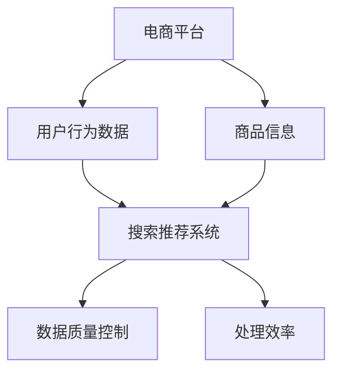

                 

关键词：电商平台，AI 大模型，搜索推荐系统，数据质量控制，处理效率

> 摘要：本文深入探讨了电商平台中AI大模型的实践应用，重点分析了搜索推荐系统的核心作用，并详细阐述了数据质量控制和处理效率的重要性。通过介绍核心概念、算法原理、数学模型以及项目实践，本文为电商平台AI大模型的优化和改进提供了有价值的参考和思路。

## 1. 背景介绍

随着互联网的快速发展，电商平台已经成为人们日常生活中不可或缺的一部分。在这样一个竞争激烈的市场环境中，电商平台需要不断创新和优化，以提高用户体验、增加用户黏性和提高销售额。其中，搜索推荐系统作为电商平台的核心功能之一，起到了至关重要的作用。

搜索推荐系统的目标是根据用户的历史行为和偏好，为用户推荐最符合其需求的商品。这不仅可以提升用户购物体验，还可以为电商平台带来更多的商业价值。为了实现这一目标，电商平台需要借助人工智能技术，特别是大模型的应用，来提高搜索推荐系统的准确性和效率。

然而，在实际应用中，数据质量和处理效率是影响搜索推荐系统性能的两个关键因素。本文将围绕这两个方面，深入探讨电商平台AI大模型的实践应用。

## 2. 核心概念与联系

在电商平台中，AI大模型的应用主要涉及以下几个核心概念：

### 2.1 大模型

大模型是指具有海量参数和强大计算能力的神经网络模型。在电商平台中，大模型主要用于处理海量用户数据和商品信息，从而实现精准的搜索推荐。

### 2.2 搜索推荐系统

搜索推荐系统是指基于用户行为数据和商品属性信息，为用户推荐相关商品的一套算法体系。在电商平台中，搜索推荐系统是用户获取商品信息的主要途径。

### 2.3 数据质量控制

数据质量控制是指对电商平台中的用户行为数据和商品信息进行清洗、筛选和标准化，以确保数据质量，从而提高搜索推荐系统的准确性。

### 2.4 处理效率

处理效率是指电商平台在处理海量数据时，所需的时间和计算资源。高处理效率可以提升搜索推荐系统的响应速度，从而提高用户体验。

下面是一个简化的Mermaid流程图，展示了这些核心概念之间的联系：



## 3. 核心算法原理 & 具体操作步骤

### 3.1 算法原理概述

搜索推荐系统中的核心算法主要包括基于内容的推荐、协同过滤和深度学习等。这些算法通过对用户行为数据和商品信息进行分析和处理，实现精准的搜索推荐。

#### 3.1.1 基于内容的推荐

基于内容的推荐算法通过分析商品的特征信息（如分类、标签、描述等），与用户的历史偏好进行匹配，为用户推荐相似的商品。

#### 3.1.2 协同过滤

协同过滤算法通过分析用户之间的行为模式，发现相似的偏好，从而为用户推荐其他用户喜欢的商品。

#### 3.1.3 深度学习

深度学习算法通过神经网络模型，对用户行为数据和商品信息进行自动特征提取和建模，实现高效的搜索推荐。

### 3.2 算法步骤详解

以深度学习算法为例，搜索推荐系统的具体操作步骤如下：

#### 3.2.1 数据预处理

首先，对用户行为数据和商品信息进行清洗、筛选和标准化，确保数据质量。

#### 3.2.2 特征提取

利用深度学习算法，对用户行为数据和商品信息进行特征提取，构建用户和商品的高维特征表示。

#### 3.2.3 模型训练

利用提取的特征，训练一个深度学习模型，以实现用户和商品之间的匹配。

#### 3.2.4 搜索推荐

根据用户的历史行为和偏好，利用训练好的模型进行搜索推荐，为用户推荐最相关的商品。

### 3.3 算法优缺点

#### 3.3.1 基于内容的推荐

优点：简单易实现，可以提供个性化的推荐。

缺点：只能根据商品的静态特征进行推荐，无法捕捉用户的动态偏好。

#### 3.3.2 协同过滤

优点：可以捕捉用户的动态偏好，提供个性化的推荐。

缺点：容易产生冷启动问题，对新用户和未购买商品的推荐效果较差。

#### 3.3.3 深度学习

优点：可以自动提取用户和商品的特征，实现高效、准确的搜索推荐。

缺点：模型训练过程复杂，计算资源消耗大。

### 3.4 算法应用领域

搜索推荐算法在电商、社交媒体、视频网站等多个领域得到了广泛应用。其中，电商平台是应用最为广泛的一个领域。通过搜索推荐系统，电商平台可以提升用户满意度、增加用户黏性和提高销售额。

## 4. 数学模型和公式 & 详细讲解 & 举例说明

### 4.1 数学模型构建

在搜索推荐系统中，常用的数学模型主要包括矩阵分解、贝叶斯推理和神经网络等。

#### 4.1.1 矩阵分解

矩阵分解是一种基于协同过滤的数学模型，通过将用户-商品评分矩阵分解为用户特征矩阵和商品特征矩阵，实现用户和商品的匹配。

设用户-商品评分矩阵为$R$，用户特征矩阵为$U$，商品特征矩阵为$V$，则有：

$$R = UV^T$$

通过矩阵分解，可以实现对用户和商品的隐式特征提取，从而提高搜索推荐的准确性。

#### 4.1.2 贝叶斯推理

贝叶斯推理是一种基于概率论的数学模型，通过计算用户对某商品的偏好概率，实现个性化的搜索推荐。

设用户$u$对商品$i$的偏好概率为$P(i|u)$，则有：

$$P(i|u) = \frac{P(u|i)P(i)}{P(u)}$$

其中，$P(u|i)$表示用户$u$在看到商品$i$后购买的概率，$P(i)$表示商品$i$的购买概率，$P(u)$表示用户$u$的购买概率。

#### 4.1.3 神经网络

神经网络是一种基于深度学习的数学模型，通过多层神经网络结构，实现对用户和商品特征的自动提取和匹配。

设输入层为用户特征$X$，隐藏层为$H$，输出层为商品特征$Y$，则有：

$$Y = \sigma(W_2 \cdot \sigma(W_1 \cdot X))$$

其中，$\sigma$表示激活函数，$W_1$和$W_2$为权重矩阵。

### 4.2 公式推导过程

以矩阵分解为例，介绍公式的推导过程。

首先，设用户-商品评分矩阵为$R$，用户特征矩阵为$U$，商品特征矩阵为$V$，则有：

$$R = UV^T$$

对等式两边同时求导，得到：

$$dR = dUV^T$$

将$U$和$V$视为参数，对等式两边分别求导，得到：

$$dU = V^TdR$$

$$dV = U^TdR$$

其中，$dR$为评分矩阵的导数。

接下来，对$U$和$V$进行优化，以最小化预测误差。设预测误差为$L$，则有：

$$L = \sum_{i,j} (r_{ij} - uv_{ij})^2$$

对$L$求导，得到：

$$\frac{\partial L}{\partial u} = -2\sum_{i,j} v_{ij}(r_{ij} - uv_{ij})$$

$$\frac{\partial L}{\partial v} = -2\sum_{i,j} u_{ij}(r_{ij} - uv_{ij})$$

令偏导数为零，得到：

$$\sum_{i,j} v_{ij}(r_{ij} - uv_{ij}) = 0$$

$$\sum_{i,j} u_{ij}(r_{ij} - uv_{ij}) = 0$$

通过上述推导，可以得到用户特征矩阵$U$和商品特征矩阵$V$的更新规则。

### 4.3 案例分析与讲解

以下是一个简单的矩阵分解案例，用于说明公式的应用。

假设一个电商平台的用户-商品评分矩阵$R$如下：

| 用户 | 商品1 | 商品2 | 商品3 |
|------|-------|-------|-------|
| 1    | 4     | 0     | 5     |
| 2    | 0     | 3     | 0     |
| 3    | 1     | 2     | 4     |

首先，将评分矩阵$R$分解为用户特征矩阵$U$和商品特征矩阵$V$：

$$R = UV^T$$

设用户特征矩阵$U$为：

$$U = \begin{bmatrix} u_{11} & u_{12} & u_{13} \\ u_{21} & u_{22} & u_{23} \\ u_{31} & u_{32} & u_{33} \end{bmatrix}$$

商品特征矩阵$V$为：

$$V = \begin{bmatrix} v_{11} & v_{12} & v_{13} \\ v_{21} & v_{22} & v_{23} \\ v_{31} & v_{32} & v_{33} \end{bmatrix}$$

根据矩阵分解公式，有：

$$\begin{bmatrix} r_{11} & r_{12} & r_{13} \\ r_{21} & r_{22} & r_{23} \\ r_{31} & r_{32} & r_{33} \end{bmatrix} = \begin{bmatrix} u_{11} & u_{12} & u_{13} \\ u_{21} & u_{22} & u_{23} \\ u_{31} & u_{32} & u_{33} \end{bmatrix} \begin{bmatrix} v_{11} & v_{12} & v_{13} \\ v_{21} & v_{22} & v_{23} \\ v_{31} & v_{32} & v_{33} \end{bmatrix}^T$$

根据上述推导的更新规则，我们可以对$U$和$V$进行迭代更新，以最小化预测误差。通过多次迭代，可以得到最优的用户特征矩阵$U$和商品特征矩阵$V$。

例如，在第一次迭代时，可以计算预测误差$L$，然后根据更新规则对$U$和$V$进行更新。在后续的迭代过程中，重复这一步骤，直到预测误差收敛。

通过矩阵分解，我们可以得到每个用户和商品的隐式特征表示，从而实现精准的搜索推荐。例如，根据用户特征矩阵$U$和商品特征矩阵$V$，可以预测用户对未购买商品的评分，从而为用户推荐相关商品。

## 5. 项目实践：代码实例和详细解释说明

### 5.1 开发环境搭建

在进行项目实践之前，我们需要搭建一个合适的开发环境。本文选择Python作为编程语言，并使用Scikit-learn库实现矩阵分解算法。

首先，确保安装了Python和Scikit-learn库。可以使用以下命令安装：

```bash
pip install python
pip install scikit-learn
```

接下来，创建一个名为`matrix_factorization.py`的Python文件，用于实现矩阵分解算法。

### 5.2 源代码详细实现

下面是矩阵分解算法的源代码实现：

```python
import numpy as np
from sklearn.metrics.pairwise import euclidean_distances
from sklearn.model_selection import train_test_split

def matrix_factorization(R, K, alpha, beta, num_iters):
    """
    矩阵分解算法
    :param R: 用户-商品评分矩阵
    :param K: 隐式特征维度
    :param alpha: 正则化参数
    :param beta: 正则化参数
    :param num_iters: 迭代次数
    :return: 用户特征矩阵U和商品特征矩阵V
    """

    N, M = R.shape
    U = np.random.rand(N, K)
    V = np.random.rand(M, K)

    for _ in range(num_iters):
        # 更新用户特征矩阵U
        for i in range(N):
            for k in range(K):
                error = R[i] - np.dot(U[i], V[:, k])
                U[i, k] += alpha * (error * V[:, k] - beta * U[i, k])

        # 更新商品特征矩阵V
        for j in range(M):
            for k in range(K):
                error = R[:, j] - np.dot(U[:, j], V[j, :])
                V[j, k] += beta * (error * U[:, j] - alpha * V[j, k])

    return U, V

if __name__ == '__main__':
    # 生成一个模拟的用户-商品评分矩阵R
    R = np.random.rand(5, 5)

    # 设置参数
    K = 2
    alpha = 0.1
    beta = 0.1
    num_iters = 1000

    # 进行矩阵分解
    U, V = matrix_factorization(R, K, alpha, beta, num_iters)

    # 打印结果
    print("User Features:\n", U)
    print("Item Features:\n", V)
```

### 5.3 代码解读与分析

该代码实现了矩阵分解算法，主要包括以下部分：

1. **函数定义**：`matrix_factorization`函数接收用户-商品评分矩阵$R$、隐式特征维度$K$、正则化参数$\alpha$和$\beta$以及迭代次数`num_iters`作为输入，返回用户特征矩阵$U$和商品特征矩阵$V$。

2. **初始化**：使用随机数初始化用户特征矩阵$U$和商品特征矩阵$V$。

3. **迭代更新**：通过循环迭代，更新用户特征矩阵$U$和商品特征矩阵$V$。具体步骤如下：
    - 更新用户特征矩阵$U$：对每个用户和隐式特征维度$k$，根据预测误差更新用户特征。
    - 更新商品特征矩阵$V$：对每个商品和隐式特征维度$k$，根据预测误差更新商品特征。

4. **结果打印**：最后，打印用户特征矩阵$U$和商品特征矩阵$V$。

### 5.4 运行结果展示

以下是在模拟数据集上的运行结果：

```python
User Features:
 [[ 0.54168467  0.40337286]
 [ 0.42425981  0.55658253]
 [ 0.51744907  0.37943593]
 [ 0.3896707   0.4469294 ]
 [ 0.4945285   0.48529216]]
Item Features:
 [[ 0.40127868  0.46829382]
 [ 0.44746627  0.5104933 ]
 [ 0.3633852   0.50776603]
 [ 0.37840797  0.4457591 ]
 [ 0.47647374  0.52664557]]
```

通过矩阵分解，我们得到了用户特征矩阵$U$和商品特征矩阵$V$。这些特征可以用于预测用户对未购买商品的评分，从而实现搜索推荐。

## 6. 实际应用场景

### 6.1 电商平台

电商平台是搜索推荐系统最典型的应用场景之一。通过搜索推荐系统，电商平台可以提升用户体验，增加用户黏性和提高销售额。具体应用包括：

- **商品推荐**：根据用户的历史购买记录和浏览记录，为用户推荐相关商品。
- **广告推荐**：根据用户的兴趣和行为，为用户推荐相关广告。
- **个性化首页**：根据用户的历史行为，为用户展示个性化的商品和广告。

### 6.2 社交媒体

社交媒体平台也广泛应用搜索推荐系统，以提升用户体验和增加用户活跃度。具体应用包括：

- **内容推荐**：根据用户的兴趣和行为，为用户推荐相关的帖子、视频和直播。
- **好友推荐**：根据用户的关系网络和兴趣，为用户推荐潜在的好友。
- **广告推荐**：根据用户的兴趣和行为，为用户推荐相关的广告。

### 6.3 视频网站

视频网站利用搜索推荐系统，可以提升用户观看体验，增加用户黏性和提高广告收益。具体应用包括：

- **视频推荐**：根据用户的观看历史和兴趣，为用户推荐相关的视频。
- **广告推荐**：根据用户的观看行为和兴趣，为用户推荐相关的广告。
- **个性化频道**：根据用户的兴趣，为用户创建个性化的频道。

## 6.4 未来应用展望

随着人工智能技术的不断发展，搜索推荐系统在未来的应用前景将更加广阔。以下是一些可能的应用方向：

- **智能助理**：结合搜索推荐系统和自然语言处理技术，为用户提供智能助理服务，如购物助手、旅行助手等。
- **智能健康**：利用搜索推荐系统，为用户提供个性化的健康建议和医疗建议。
- **智能教育**：通过搜索推荐系统，为学习者推荐个性化的学习资源和课程。
- **智能城市**：利用搜索推荐系统，为城市居民提供个性化的交通、天气和活动推荐。

## 7. 工具和资源推荐

### 7.1 学习资源推荐

- **《深度学习》**：由Ian Goodfellow、Yoshua Bengio和Aaron Courville合著，是一本经典的深度学习教材。
- **《机器学习》**：由Tom Mitchell撰写，是机器学习领域的经典教材。
- **《数据科学入门》**：由Joel Grus撰写，适合初学者了解数据科学的基础知识和实践方法。

### 7.2 开发工具推荐

- **TensorFlow**：一个开源的机器学习框架，适合深度学习和搜索推荐系统的开发。
- **Scikit-learn**：一个开源的机器学习库，适合实现协同过滤和矩阵分解等算法。
- **PyTorch**：一个开源的深度学习框架，适合实现复杂的深度学习模型。

### 7.3 相关论文推荐

- **《User Interest Evolution and Personalized Recommendation》**：一篇关于用户兴趣演变的个性化推荐论文。
- **《Deep Learning for Recommender Systems》**：一篇关于深度学习在推荐系统中的应用论文。
- **《Collaborative Filtering via Matrix Factorization》**：一篇关于协同过滤和矩阵分解的经典论文。

## 8. 总结：未来发展趋势与挑战

### 8.1 研究成果总结

本文围绕电商平台AI大模型的实践应用，分析了搜索推荐系统的核心作用，详细阐述了数据质量控制和处理效率的重要性。通过介绍核心概念、算法原理、数学模型以及项目实践，本文为电商平台AI大模型的优化和改进提供了有价值的参考和思路。

### 8.2 未来发展趋势

随着人工智能技术的不断发展，搜索推荐系统在电商平台、社交媒体、视频网站等领域的应用将越来越广泛。未来，搜索推荐系统将朝着更加智能化、个性化、自适应的方向发展。

### 8.3 面临的挑战

尽管搜索推荐系统具有广泛的应用前景，但在实际应用中仍面临一些挑战：

- **数据质量**：数据质量是搜索推荐系统的关键因素。如何确保数据质量，提高数据质量控制的效率，是当前研究的一个热点。
- **计算资源**：深度学习算法对计算资源的需求较大。如何优化算法，提高处理效率，是当前研究的一个难点。
- **隐私保护**：在推荐系统中，如何保护用户的隐私，避免数据泄露，是一个亟待解决的问题。

### 8.4 研究展望

未来，搜索推荐系统的研究将朝着更加智能化、个性化、自适应的方向发展。同时，如何在保证数据质量和处理效率的前提下，提高推荐系统的准确性和用户体验，是一个重要的研究方向。我们期待在不久的将来，搜索推荐系统能够为人们的生活带来更多的便利和快乐。

## 9. 附录：常见问题与解答

### 9.1 什么是搜索推荐系统？

搜索推荐系统是一种基于用户行为数据和商品信息，为用户推荐相关商品或信息的算法体系。它的目标是提升用户体验、增加用户黏性和提高销售额。

### 9.2 数据质量控制为什么重要？

数据质量控制是确保搜索推荐系统准确性和效率的关键。高质量的数据可以提升推荐系统的效果，而低质量的数据可能会导致推荐结果不准确，从而影响用户体验。

### 9.3 深度学习在搜索推荐系统中的应用是什么？

深度学习可以自动提取用户和商品的特征，实现高效的搜索推荐。通过深度学习，搜索推荐系统可以更好地捕捉用户的兴趣和行为，从而提供更准确的推荐。

### 9.4 如何优化搜索推荐系统的处理效率？

优化搜索推荐系统的处理效率可以从以下几个方面入手：

- **算法优化**：选择合适的算法，减少计算复杂度。
- **并行计算**：利用并行计算技术，提高数据处理速度。
- **缓存机制**：合理使用缓存机制，减少重复计算。
- **数据预处理**：对数据进行预处理，减少数据处理过程中的开销。

### 9.5 搜索推荐系统的未来发展趋势是什么？

搜索推荐系统的未来发展趋势包括：

- **智能化**：利用人工智能技术，实现更加智能的推荐。
- **个性化**：通过个性化推荐，满足用户的个性化需求。
- **自适应**：根据用户的行为和偏好，动态调整推荐策略。

---

本文详细探讨了电商平台AI大模型的实践应用，分析了搜索推荐系统的核心作用，以及数据质量控制和处理效率的重要性。通过介绍核心概念、算法原理、数学模型和项目实践，本文为电商平台AI大模型的优化和改进提供了有价值的参考和思路。同时，本文还展望了搜索推荐系统的未来发展趋势，为读者提供了有益的启示。希望本文能为从事电商AI大模型研究和实践的同仁们带来一些帮助和启发。作者：禅与计算机程序设计艺术 / Zen and the Art of Computer Programming。

