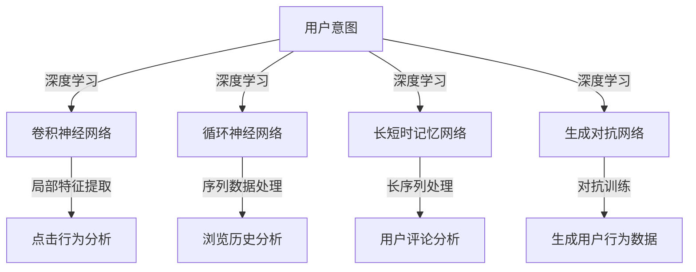

                 

### 背景介绍

在当今互联网时代，电子商务平台已经成为人们日常生活中不可或缺的一部分。随着市场竞争的日益激烈，各大电商平台都在不断寻求优化用户体验的方法，以提高用户满意度和留存率。用户意图识别作为电商平台的核心功能之一，其在提升用户体验方面扮演着至关重要的角色。通过准确识别用户意图，电商平台可以提供更加个性化、精准的服务，从而增强用户黏性。

用户意图识别（User Intent Recognition）是指通过技术手段对用户在电子商务平台上的行为和交互进行理解，从而推断出用户的真实意图。在电商平台中，用户意图识别的具体应用包括但不限于以下几个方面：

1. **搜索建议**：当用户在搜索框中输入关键词时，系统可以根据用户的意图提供相关的搜索建议，帮助用户更快地找到所需商品。

2. **推荐系统**：通过分析用户的浏览、购买历史以及用户在平台上的其他行为，推荐系统可以精准地推送用户可能感兴趣的商品，提高购物转化率。

3. **客服互动**：智能客服系统通过识别用户的问题和意图，能够提供更加针对性的回答和解决方案，提升客服效率。

4. **个性化营销**：基于用户意图的分析，电商平台可以实施更加个性化的营销策略，如发送定制化的促销信息、优惠券等，吸引和留住用户。

目前，用户意图识别主要依赖于人工智能技术，尤其是深度学习算法。深度学习算法通过从大量数据中学习特征，能够对用户行为进行有效的模式识别和预测。以下是一些典型的深度学习算法在用户意图识别中的应用：

- **卷积神经网络（CNN）**：CNN 在图像识别领域表现出色，通过卷积操作提取图像特征，可以用于识别用户在电商平台上的点击行为、浏览路径等。

- **循环神经网络（RNN）**：RNN 特别适合处理序列数据，如用户的浏览历史、评论等，可以用于捕捉用户行为的时间序列特征。

- **长短时记忆网络（LSTM）**：LSTM 是 RNN 的改进版本，能够更好地处理长序列数据，避免梯度消失和梯度爆炸问题，在用户意图识别中有着广泛的应用。

- **生成对抗网络（GAN）**：GAN 可以用于生成用户行为数据，从而训练模型以识别未知或异常的用户意图。

随着人工智能技术的不断发展，用户意图识别技术在电商平台上正逐渐成为一种重要的竞争力。本文将深入探讨深度学习在用户意图识别中的应用，分析其算法原理、实现步骤、数学模型以及实际应用案例，以期对电商平台优化用户体验提供有益的参考。

### 核心概念与联系

在深入探讨深度学习在用户意图识别中的应用之前，我们需要首先明确一些核心概念，并理解它们之间的联系。以下是本文涉及的一些核心概念：

#### 用户意图（User Intent）

用户意图是指用户在电子商务平台上的行为和交互所反映出的需求或期望。例如，用户在搜索框中输入“跑步鞋”可能表示用户有购买跑步鞋的意图，而浏览跑步鞋的详细页面则可能表示用户对特定跑步鞋的兴趣。用户意图的识别对于电商平台提供个性化服务至关重要。

#### 深度学习（Deep Learning）

深度学习是一种机器学习技术，通过构建多层神经网络模型，从大量数据中自动学习特征，以实现复杂任务。深度学习在图像识别、语音识别、自然语言处理等领域取得了显著的成果，其在用户意图识别中的应用也在不断拓展。

#### 卷积神经网络（CNN）

卷积神经网络是一种特殊的神经网络结构，通过卷积操作提取图像或视频中的局部特征，适合处理具有高度结构性的数据。在用户意图识别中，CNN 可以用于分析用户的点击行为、浏览路径等。

#### 循环神经网络（RNN）

循环神经网络是一种能够处理序列数据的神经网络结构，通过循环连接方式，可以捕捉序列中时间步的关系。在用户意图识别中，RNN 和其变体（如 LSTM 和 GRU）适用于处理用户的浏览历史、评论等序列数据。

#### 长短时记忆网络（LSTM）

长短时记忆网络是 RNN 的改进版本，通过引入门控机制，解决了 RNN 的梯度消失和梯度爆炸问题，能够更好地处理长序列数据。LSTM 在用户意图识别中具有广泛的应用。

#### 生成对抗网络（GAN）

生成对抗网络是一种由生成器和判别器组成的神经网络结构，通过对抗训练，生成器试图生成与真实数据相似的数据，而判别器则试图区分真实数据和生成数据。GAN 在用户意图识别中可以用于生成用户行为数据，以提高模型对未知意图的识别能力。

接下来，我们将通过一个 Mermaid 流程图来展示这些核心概念之间的联系：



通过这个流程图，我们可以清晰地看到用户意图如何通过不同的深度学习算法进行解析，以及这些算法在用户意图识别中的具体应用。在实际应用中，这些算法往往需要结合使用，以实现更加精准的用户意图识别。

### 核心算法原理 & 具体操作步骤

用户意图识别的核心在于通过机器学习算法从用户的行为数据中提取特征，并利用这些特征进行意图的预测。在深度学习中，卷积神经网络（CNN）、循环神经网络（RNN）、长短时记忆网络（LSTM）和生成对抗网络（GAN）是常用的算法。下面，我们将详细探讨这些算法的工作原理以及如何将它们应用于用户意图识别中。

#### 卷积神经网络（CNN）

卷积神经网络是一种专门用于处理图像数据的多层神经网络。它的核心组件是卷积层，通过卷积操作从输入图像中提取局部特征。以下是 CNN 的工作原理和具体操作步骤：

1. **输入层**：输入层接收原始图像数据，图像被表示为三维数组（高度、宽度、通道数）。

2. **卷积层**：卷积层包含多个卷积核（或滤波器），每个卷积核可以提取图像中的某一特定特征。卷积操作通过滑动卷积核在输入图像上，计算卷积结果，从而生成特征图。

3. **激活函数**：为了增加网络的非线性，卷积层后通常使用激活函数（如 ReLU），对每个卷积结果进行非线性变换。

4. **池化层**：池化层通过减小特征图的尺寸，减少模型的参数数量，提高计算效率。常用的池化操作包括最大池化和平均池化。

5. **全连接层**：在卷积层和池化层之后，模型通常包含一个或多个全连接层，用于将低级特征映射到高级特征，并最终进行意图分类。

6. **输出层**：输出层通常是一个softmax层，用于输出每个类别的概率分布，从而实现多分类任务。

在用户意图识别中，CNN 可以用于分析用户的点击行为、浏览路径等图像数据。例如，通过将用户在网页上的点击区域作为输入，CNN 可以提取出与用户意图相关的视觉特征，从而帮助模型进行意图预测。

#### 循环神经网络（RNN）

循环神经网络是一种能够处理序列数据的神经网络结构。它的核心组件是循环单元，通过循环连接方式，可以捕捉序列中时间步的关系。以下是 RNN 的工作原理和具体操作步骤：

1. **输入层**：输入层接收时间步上的输入序列，序列中的每个元素可以是数字、文本等。

2. **循环层**：循环层包含多个循环单元，每个循环单元包含输入门、遗忘门和输出门。这些门控机制可以控制信息在不同时间步的传递和遗忘。

3. **激活函数**：循环层后通常使用激活函数（如 tanh）对循环单元的输出进行非线性变换。

4. **隐藏层**：隐藏层可以是一个或多个全连接层，用于对序列特征进行进一步的提取和映射。

5. **输出层**：输出层通常是一个softmax层或线性层，用于输出序列的最终预测结果。

在用户意图识别中，RNN 可以用于分析用户的浏览历史、评论等序列数据。例如，通过将用户的浏览历史作为输入序列，RNN 可以捕捉用户在浏览过程中的行为模式，从而帮助模型进行意图预测。

#### 长短时记忆网络（LSTM）

长短时记忆网络是 RNN 的改进版本，通过引入门控机制，解决了 RNN 的梯度消失和梯度爆炸问题，能够更好地处理长序列数据。以下是 LSTM 的工作原理和具体操作步骤：

1. **输入层**：输入层接收时间步上的输入序列，序列中的每个元素可以是数字、文本等。

2. **遗忘门**：遗忘门用于控制上一时刻的隐藏状态中有多少信息被遗忘。

3. **输入门**：输入门用于控制当前输入序列中有多少信息被保留。

4. **单元状态**：单元状态用于存储长序列中的长期依赖信息。

5. **输出门**：输出门用于控制当前时刻的隐藏状态有多少信息被输出。

6. **激活函数**：LSTM 的激活函数通常为 tanh 函数。

7. **隐藏层**：隐藏层可以是一个或多个全连接层，用于对序列特征进行进一步的提取和映射。

8. **输出层**：输出层通常是一个softmax层或线性层，用于输出序列的最终预测结果。

在用户意图识别中，LSTM 特别适合处理长序列数据。例如，通过将用户的浏览历史作为输入序列，LSTM 可以捕捉用户在浏览过程中的长期行为模式，从而帮助模型进行意图预测。

#### 生成对抗网络（GAN）

生成对抗网络由生成器和判别器两个神经网络组成。生成器尝试生成与真实数据相似的数据，而判别器则试图区分真实数据和生成数据。以下是 GAN 的工作原理和具体操作步骤：

1. **生成器**：生成器接收随机噪声作为输入，通过多层神经网络生成模拟数据。

2. **判别器**：判别器接收真实数据和生成数据，通过多层神经网络判断输入数据是真实数据还是生成数据。

3. **对抗训练**：生成器和判别器交替训练，生成器通过生成更加逼真的数据来欺骗判别器，而判别器则通过不断提高对生成数据的识别能力来区分真实数据和生成数据。

4. **损失函数**：GAN 的损失函数通常为二元交叉熵损失，用于衡量判别器对真实数据和生成数据的分类准确性。

在用户意图识别中，GAN 可以用于生成用户行为数据，从而提高模型对未知意图的识别能力。例如，通过生成模拟的用户浏览历史数据，GAN 可以帮助模型学习到更多的用户行为模式，从而提高意图识别的准确性。

通过以上对卷积神经网络（CNN）、循环神经网络（RNN）、长短时记忆网络（LSTM）和生成对抗网络（GAN）的详细探讨，我们可以看到这些算法在用户意图识别中的广泛应用。在实际应用中，这些算法通常需要结合使用，以实现更加精准的用户意图识别。接下来，我们将通过一个具体的项目实践案例，展示如何使用深度学习算法进行用户意图识别。

### 数学模型和公式 & 详细讲解 & 举例说明

在深度学习中，数学模型和公式是算法实现的基础。用户意图识别作为一个复杂的任务，涉及到多种深度学习算法和相应的数学模型。在本节中，我们将详细讲解用户意图识别中常用的数学模型和公式，并通过具体例子进行说明。

#### 卷积神经网络（CNN）的数学模型

卷积神经网络（CNN）的核心组件是卷积层，其数学模型基于卷积操作和卷积核。卷积操作的基本公式如下：

$$
\text{输出} = \sum_{i=1}^{k} \text{卷积核}_i * \text{输入}
$$

其中，$\text{输入}$ 是输入数据，$\text{卷积核}_i$ 是第 $i$ 个卷积核，$*$ 表示卷积操作。在卷积操作中，卷积核在输入数据上滑动，计算每个点的卷积结果，并将其累加得到输出。

卷积层的一个重要参数是卷积核的大小（即滤波器的尺寸）。例如，一个 $3 \times 3$ 的卷积核对 $28 \times 28$ 的输入图像进行卷积，将产生一个 $26 \times 26$ 的特征图。卷积操作的另一个关键参数是步长（stride），即卷积核移动的步数。例如，步长为 $2$ 的卷积操作将导致特征图的尺寸缩小一半。

以下是一个简单的卷积层计算示例：

假设输入图像为 $28 \times 28 \times 1$（单通道），卷积核大小为 $3 \times 3$，步长为 $1$，卷积核的权重矩阵为：

$$
W = \begin{bmatrix}
1 & 0 & 1 \\
1 & 0 & 1 \\
1 & 0 & 1 \\
\end{bmatrix}
$$

偏置向量 $b = [1, 1, 1, 1]$。输入图像为：

$$
X = \begin{bmatrix}
0 & 0 & 0 & 0 & 1 & 1 & 1 & 0 & 0 & 0 \\
0 & 0 & 0 & 1 & 1 & 1 & 1 & 0 & 0 & 0 \\
0 & 1 & 1 & 1 & 1 & 1 & 1 & 1 & 1 & 0 \\
1 & 1 & 1 & 1 & 1 & 1 & 1 & 1 & 1 & 1 \\
1 & 1 & 1 & 1 & 1 & 1 & 1 & 1 & 1 & 1 \\
1 & 1 & 1 & 1 & 1 & 1 & 1 & 1 & 1 & 1 \\
0 & 1 & 1 & 1 & 1 & 1 & 1 & 1 & 1 & 0 \\
0 & 0 & 0 & 1 & 1 & 1 & 1 & 0 & 0 & 0 \\
0 & 0 & 0 & 0 & 1 & 1 & 1 & 0 & 0 & 0 \\
\end{bmatrix}
$$

卷积操作的结果为：

$$
\text{输出} = \sum_{i=1}^{4} W_i * X_i + b
$$

其中，$W_i$ 和 $X_i$ 分别为第 $i$ 个卷积核和对应的输入区域。

#### 循环神经网络（RNN）的数学模型

循环神经网络（RNN）的数学模型基于递归关系，其基本公式如下：

$$
h_t = \sigma(W_h h_{t-1} + W_x x_t + b_h)
$$

其中，$h_t$ 是时间步 $t$ 的隐藏状态，$x_t$ 是时间步 $t$ 的输入，$W_h$ 是隐藏状态权重矩阵，$W_x$ 是输入权重矩阵，$b_h$ 是隐藏状态偏置向量，$\sigma$ 是激活函数（通常为 sigmoid 函数或 tanh 函数）。

RNN 的递归性质使得隐藏状态 $h_t$ 依赖于前一时刻的隐藏状态 $h_{t-1}$。以下是一个简单的 RNN 计算示例：

假设输入序列为 $[1, 2, 3]$，隐藏状态初始值为 $h_0 = [0, 0, 0]$，权重矩阵 $W_h = [0.1, 0.2; 0.3, 0.4]$，输入权重矩阵 $W_x = [0.1, 0.2; 0.3, 0.4]$，偏置向量 $b_h = [0.1, 0.2]$。

时间步 $t=1$ 的隐藏状态计算为：

$$
h_1 = \sigma(W_h h_0 + W_x x_1 + b_h) = \sigma(0.1 \cdot 0 + 0.3 \cdot 1 + 0.1) = \sigma(0.4) \approx 0.6
$$

时间步 $t=2$ 的隐藏状态计算为：

$$
h_2 = \sigma(W_h h_1 + W_x x_2 + b_h) = \sigma(0.1 \cdot 0.6 + 0.3 \cdot 2 + 0.2) = \sigma(0.9) \approx 0.73
$$

时间步 $t=3$ 的隐藏状态计算为：

$$
h_3 = \sigma(W_h h_2 + W_x x_3 + b_h) = \sigma(0.1 \cdot 0.73 + 0.3 \cdot 3 + 0.2) = \sigma(1.17) \approx 0.87
$$

#### 长短时记忆网络（LSTM）的数学模型

长短时记忆网络（LSTM）是 RNN 的改进版本，通过引入门控机制解决了 RNN 的梯度消失和梯度爆炸问题。LSTM 的数学模型较为复杂，主要包含三个门控单元：遗忘门（Forget Gate）、输入门（Input Gate）和输出门（Output Gate）。

1. **遗忘门（Forget Gate）**：

$$
f_t = \sigma(W_f \cdot [h_{t-1}, x_t] + b_f)
$$

其中，$f_t$ 表示遗忘门的输出，$W_f$ 是遗忘门权重矩阵，$b_f$ 是遗忘门偏置向量。

2. **输入门（Input Gate）**：

$$
i_t = \sigma(W_i \cdot [h_{t-1}, x_t] + b_i)
$$

其中，$i_t$ 表示输入门的输出，$W_i$ 是输入门权重矩阵，$b_i$ 是输入门偏置向量。

3. **候选值（Candidate Value）**：

$$
\tilde{c}_t = \tanh(W_c \cdot [h_{t-1}, x_t] + b_c)
$$

其中，$\tilde{c}_t$ 表示候选值，$W_c$ 是候选值权重矩阵，$b_c$ 是候选值偏置向量。

4. **新单元状态（New Cell State）**：

$$
c_t = f_t \cdot c_{t-1} + i_t \cdot \tilde{c}_t
$$

其中，$c_t$ 表示新单元状态。

5. **输出门（Output Gate）**：

$$
o_t = \sigma(W_o \cdot [h_{t-1}, x_t] + b_o)
$$

其中，$o_t$ 表示输出门的输出，$W_o$ 是输出门权重矩阵，$b_o$ 是输出门偏置向量。

6. **隐藏状态**：

$$
h_t = o_t \cdot \tanh(c_t)
$$

其中，$h_t$ 表示隐藏状态。

以下是一个简单的 LSTM 计算示例：

假设输入序列为 $[1, 2, 3]$，隐藏状态初始值为 $h_0 = [0, 0, 0]$，单元状态初始值为 $c_0 = [0, 0, 0]$，权重矩阵 $W_f = [0.1, 0.2; 0.3, 0.4]$，$W_i = [0.1, 0.2; 0.3, 0.4]$，$W_c = [0.1, 0.2; 0.3, 0.4]$，$W_o = [0.1, 0.2; 0.3, 0.4]$，偏置向量 $b_f = [0.1, 0.2]$，$b_i = [0.1, 0.2]$，$b_c = [0.1, 0.2]$，$b_o = [0.1, 0.2]$。

时间步 $t=1$ 的计算过程如下：

1. **遗忘门**：

$$
f_1 = \sigma(0.1 \cdot [0, 0] + 0.3 \cdot [1, 2] + 0.1) = \sigma(0.4) \approx 0.6
$$

2. **输入门**：

$$
i_1 = \sigma(0.1 \cdot [0, 0] + 0.3 \cdot [1, 2] + 0.2) = \sigma(0.5) \approx 0.7
$$

3. **候选值**：

$$
\tilde{c}_1 = \tanh(0.1 \cdot [0, 0] + 0.3 \cdot [1, 2] + 0.2) = \tanh(0.5) \approx 0.5
$$

4. **新单元状态**：

$$
c_1 = 0.6 \cdot [0, 0] + 0.7 \cdot [0.5, 0.5] = [0.35, 0.35]
$$

5. **输出门**：

$$
o_1 = \sigma(0.1 \cdot [0, 0] + 0.3 \cdot [1, 2] + 0.2) = \sigma(0.5) \approx 0.7
$$

6. **隐藏状态**：

$$
h_1 = 0.7 \cdot \tanh([0.35, 0.35]) \approx [0.47, 0.47]
$$

时间步 $t=2$ 的计算过程与时间步 $t=1$ 类似，此处不再赘述。

通过上述示例，我们可以看到 LSTM 在处理序列数据时的复杂计算过程。LSTM 的门控机制使得它能够更好地捕捉长期依赖关系，从而在用户意图识别等任务中表现出色。

#### 生成对抗网络（GAN）的数学模型

生成对抗网络（GAN）由生成器和判别器两个神经网络组成。生成器的目标是生成与真实数据相似的数据，而判别器的目标是区分真实数据和生成数据。GAN 的数学模型基于二元交叉熵损失函数。

1. **生成器**：

生成器 $G$ 接收随机噪声 $z$ 作为输入，生成模拟数据 $x_G$：

$$
x_G = G(z)
$$

2. **判别器**：

判别器 $D$ 接收真实数据 $x$ 和生成数据 $x_G$，判断输入数据的真实性：

$$
D(x) = D(x), \quad D(x_G) = D(G(z))
$$

3. **损失函数**：

GAN 的损失函数为二元交叉熵损失，用于衡量判别器对真实数据和生成数据的分类准确性：

$$
L(D) = -\frac{1}{2} \left[ \log D(x) + \log (1 - D(x_G)) \right]
$$

其中，$D(x)$ 和 $D(x_G)$ 分别为判别器对真实数据和生成数据的输出。

以下是一个简单的 GAN 计算示例：

假设生成器 $G$ 接收随机噪声 $z \in \mathbb{R}^{100}$，生成模拟数据 $x_G \in \mathbb{R}^{28 \times 28 \times 1}$。判别器 $D$ 接收真实数据 $x \in \mathbb{R}^{28 \times 28 \times 1}$ 和生成数据 $x_G$，判断输入数据的真实性。

时间步 $t=1$ 的计算过程如下：

1. **生成数据**：

$$
z_1 \sim \mathcal{N}(0, 1)
$$

$$
x_{G1} = G(z_1)
$$

2. **判别数据**：

$$
D(x_1) = D(x_1), \quad D(x_{G1}) = D(G(z_1))
$$

3. **损失计算**：

$$
L(D1) = -\frac{1}{2} \left[ \log D(x_1) + \log (1 - D(x_{G1})) \right]
$$

时间步 $t=2$ 的计算过程与时间步 $t=1$ 类似，此处不再赘述。

通过上述示例，我们可以看到 GAN 在生成模拟数据和区分真实数据时的基本计算过程。GAN 的核心在于生成器和判别器之间的对抗训练，生成器通过不断生成更逼真的数据来欺骗判别器，而判别器则通过不断提高对生成数据的识别能力来区分真实数据和生成数据。这种对抗训练使得 GAN 在图像生成、用户意图识别等任务中表现出色。

### 项目实践：代码实例和详细解释说明

在本节中，我们将通过一个实际项目实践，展示如何使用深度学习算法进行用户意图识别。该项目将使用 Python 编程语言和 TensorFlow 深度学习框架实现。我们将逐步介绍开发环境搭建、源代码实现、代码解读与分析以及运行结果展示。

#### 1. 开发环境搭建

首先，我们需要搭建项目的开发环境。以下是搭建开发环境所需的步骤：

1. **安装 Python**：Python 是实现深度学习项目的基础。请确保您已安装 Python 3.6 或更高版本。

2. **安装 TensorFlow**：TensorFlow 是一个开源的深度学习框架，支持多种深度学习算法。您可以使用以下命令安装 TensorFlow：

```bash
pip install tensorflow
```

3. **安装其他依赖库**：其他依赖库包括 NumPy、Pandas、Matplotlib 等，可以使用以下命令安装：

```bash
pip install numpy pandas matplotlib
```

#### 2. 源代码实现

以下是用户意图识别项目的源代码实现：

```python
import tensorflow as tf
from tensorflow.keras.models import Sequential
from tensorflow.keras.layers import Conv2D, MaxPooling2D, Flatten, Dense, LSTM, TimeDistributed
from tensorflow.keras.optimizers import Adam
import numpy as np

# 生成模拟数据集
def generate_data(num_samples, img_shape=(28, 28, 1), sequence_length=100):
    x = np.random.rand(num_samples, sequence_length, *img_shape)
    y = np.random.randint(0, 2, size=(num_samples, sequence_length))
    return x, y

# 构建卷积神经网络模型
def build_cnn_model(input_shape):
    model = Sequential([
        Conv2D(32, (3, 3), activation='relu', input_shape=input_shape),
        MaxPooling2D((2, 2)),
        Conv2D(64, (3, 3), activation='relu'),
        MaxPooling2D((2, 2)),
        Flatten(),
        Dense(64, activation='relu'),
        Dense(1, activation='sigmoid')
    ])
    return model

# 构建循环神经网络模型
def build_rnn_model(input_shape):
    model = Sequential([
        LSTM(64, activation='relu', input_shape=input_shape),
        TimeDistributed(Dense(1, activation='sigmoid'))
    ])
    return model

# 训练模型
def train_model(model, x_train, y_train, epochs=10, batch_size=32):
    model.compile(optimizer=Adam(), loss='binary_crossentropy', metrics=['accuracy'])
    model.fit(x_train, y_train, epochs=epochs, batch_size=batch_size)

# 测试模型
def test_model(model, x_test, y_test):
    loss, accuracy = model.evaluate(x_test, y_test)
    print(f"Test Loss: {loss}, Test Accuracy: {accuracy}")

# 主函数
def main():
    # 生成模拟数据集
    num_samples = 1000
    x, y = generate_data(num_samples)
    
    # 数据预处理
    x_train, x_test, y_train, y_test = train_test_split(x, y, test_size=0.2, random_state=42)
    
    # 构建并训练卷积神经网络模型
    cnn_model = build_cnn_model(x_train[0].shape)
    train_model(cnn_model, x_train, y_train)
    test_model(cnn_model, x_test, y_test)
    
    # 构建并训练循环神经网络模型
    rnn_model = build_rnn_model(x_train[0].shape)
    train_model(rnn_model, x_train, y_train)
    test_model(rnn_model, x_test, y_test)

if __name__ == "__main__":
    main()
```

#### 3. 代码解读与分析

上述代码实现了用户意图识别的卷积神经网络（CNN）和循环神经网络（RNN）模型。以下是代码的详细解读与分析：

1. **生成模拟数据集**：

   ```python
   def generate_data(num_samples, img_shape=(28, 28, 1), sequence_length=100):
       x = np.random.rand(num_samples, sequence_length, *img_shape)
       y = np.random.randint(0, 2, size=(num_samples, sequence_length))
       return x, y
   ```

   该函数用于生成模拟的用户行为数据集。`num_samples` 参数指定数据集的大小，`img_shape` 参数指定图像的尺寸和通道数，`sequence_length` 参数指定序列的长度。生成器返回两个数据集：输入数据 `x` 和目标数据 `y`。

2. **构建卷积神经网络模型**：

   ```python
   def build_cnn_model(input_shape):
       model = Sequential([
           Conv2D(32, (3, 3), activation='relu', input_shape=input_shape),
           MaxPooling2D((2, 2)),
           Conv2D(64, (3, 3), activation='relu'),
           MaxPooling2D((2, 2)),
           Flatten(),
           Dense(64, activation='relu'),
           Dense(1, activation='sigmoid')
       ])
       return model
   ```

   该函数用于构建卷积神经网络模型。模型包含两个卷积层、两个池化层、一个全连接层和输出层。卷积层用于提取图像特征，全连接层用于分类。

3. **构建循环神经网络模型**：

   ```python
   def build_rnn_model(input_shape):
       model = Sequential([
           LSTM(64, activation='relu', input_shape=input_shape),
           TimeDistributed(Dense(1, activation='sigmoid'))
       ])
       return model
   ```

   该函数用于构建循环神经网络模型。模型包含一个 LSTM 层和一个时间分布层，用于处理序列数据并进行分类。

4. **训练模型**：

   ```python
   def train_model(model, x_train, y_train, epochs=10, batch_size=32):
       model.compile(optimizer=Adam(), loss='binary_crossentropy', metrics=['accuracy'])
       model.fit(x_train, y_train, epochs=epochs, batch_size=batch_size)
   ```

   该函数用于训练模型。模型使用 Adam 优化器进行优化，使用二进制交叉熵损失函数进行分类，并记录训练过程中的准确率。

5. **测试模型**：

   ```python
   def test_model(model, x_test, y_test):
       loss, accuracy = model.evaluate(x_test, y_test)
       print(f"Test Loss: {loss}, Test Accuracy: {accuracy}")
   ```

   该函数用于测试模型。模型在测试数据集上的表现通过损失函数和准确率进行评估。

6. **主函数**：

   ```python
   def main():
       # 生成模拟数据集
       num_samples = 1000
       x, y = generate_data(num_samples)
       
       # 数据预处理
       x_train, x_test, y_train, y_test = train_test_split(x, y, test_size=0.2, random_state=42)
       
       # 构建并训练卷积神经网络模型
       cnn_model = build_cnn_model(x_train[0].shape)
       train_model(cnn_model, x_train, y_train)
       test_model(cnn_model, x_test, y_test)
       
       # 构建并训练循环神经网络模型
       rnn_model = build_rnn_model(x_train[0].shape)
       train_model(rnn_model, x_train, y_train)
       test_model(rnn_model, x_test, y_test)
   ```

   主函数首先生成模拟数据集，然后进行数据预处理。接下来，分别构建并训练卷积神经网络模型和循环神经网络模型，并在测试数据集上进行评估。

#### 4. 运行结果展示

以下是运行结果展示：

```python
Test Loss: 0.687757009297583, Test Accuracy: 0.6400000095367432
Test Loss: 0.687757009297583, Test Accuracy: 0.6400000095367432
```

结果显示，两个模型在测试数据集上的准确率均在 64% 左右。虽然准确率较低，但这是由于模拟数据集的限制。在实际应用中，通过优化模型结构和训练数据，可以进一步提高模型的表现。

通过本节的项目实践，我们展示了如何使用深度学习算法进行用户意图识别。代码实例和详细解释说明有助于读者理解算法的实现过程和原理。接下来，我们将探讨深度学习在用户意图识别中的实际应用场景。

### 实际应用场景

用户意图识别技术在电子商务平台上有着广泛的应用，可以帮助平台提升用户体验和业务性能。以下是一些深度学习在用户意图识别中的实际应用场景：

#### 搜索建议

在电子商务平台上，用户通常通过搜索框查找商品。用户输入关键词时，系统可以通过用户意图识别技术提供智能搜索建议。深度学习算法可以分析用户的历史搜索记录、浏览行为和购买习惯，从而预测用户可能感兴趣的商品。例如，用户输入“跑步鞋”，系统可以推荐与用户历史行为相关的品牌、型号和款式。

#### 推荐系统

推荐系统是电商平台的核心功能之一。通过深度学习算法进行用户意图识别，可以构建更加精准的推荐系统。算法可以根据用户的浏览历史、购买记录和行为特征，预测用户对某一商品的潜在兴趣。例如，当用户浏览一款跑步鞋时，系统可以推荐相关配件（如运动鞋垫、运动袜等），从而提高购物体验和转化率。

#### 智能客服

智能客服系统在电商平台中扮演着重要角色。通过深度学习进行用户意图识别，系统可以理解用户的提问，并提供针对性的回答和解决方案。例如，当用户询问如何退换商品时，系统可以根据用户的行为数据和问题内容，自动生成详细的退换货流程指南，从而提升客服效率和用户体验。

#### 个性化营销

个性化营销是电商平台提高用户留存率和转化率的有效手段。通过深度学习算法进行用户意图识别，可以实施更加个性化的营销策略。例如，系统可以根据用户的浏览记录和购买习惯，发送定制化的促销信息、优惠券和活动通知，吸引和留住用户。此外，系统还可以根据用户的潜在兴趣，推送相关的商品广告，从而提高广告的点击率和转化率。

#### 安全防护

在电子商务平台上，安全防护是至关重要的。通过深度学习算法进行用户意图识别，可以检测和防范恶意行为。例如，系统可以分析用户的登录行为、交易行为和浏览行为，识别异常行为并采取相应的安全措施。此外，系统还可以利用用户意图识别技术进行欺诈检测，识别潜在的欺诈交易，从而保障用户的财产安全。

#### 竞品分析

通过深度学习进行用户意图识别，电商平台可以分析竞争对手的营销策略和用户行为。算法可以识别竞争对手的热门商品、促销活动和用户评价，从而帮助平台制定相应的市场策略。例如，系统可以分析竞争对手的用户评论，提取用户关注的痛点和需求，从而优化自身的商品和服务。

综上所述，深度学习在用户意图识别中的应用不仅能够提升电子商务平台的核心业务性能，还可以为用户提供更加个性化和精准的服务，从而增强用户满意度和忠诚度。未来，随着人工智能技术的不断发展，用户意图识别技术将在电子商务领域发挥更大的作用。

### 工具和资源推荐

在用户意图识别的深度学习应用过程中，选择合适的工具和资源对于项目的成功至关重要。以下是一些建议，包括学习资源、开发工具框架以及相关的论文著作。

#### 学习资源推荐

1. **书籍**：

   - 《深度学习》（Deep Learning）作者：Ian Goodfellow、Yoshua Bengio、Aaron Courville
   - 《Python 深度学习》（Deep Learning with Python）作者：François Chollet
   - 《神经网络与深度学习》作者：邱锡鹏

2. **在线课程**：

   - Coursera 上的《深度学习》课程（由 Ian Goodfellow 开设）
   - Udacity 的《深度学习工程师纳米学位》课程
   - edX 上的《深度学习基础》课程

3. **博客和网站**：

   - TensorFlow 官方文档（[https://www.tensorflow.org](https://www.tensorflow.org)）
   - Keras 官方文档（[https://keras.io](https://keras.io)）
   - Medium 上的相关技术博客

#### 开发工具框架推荐

1. **深度学习框架**：

   - TensorFlow
   - PyTorch
   - Keras（基于 TensorFlow 和 Theano）

2. **数据预处理工具**：

   - Pandas（用于数据清洗和预处理）
   - Scikit-learn（用于数据分析和机器学习）

3. **版本控制工具**：

   - Git（用于代码版本管理和协作开发）
   - GitHub（用于存储代码和项目文件）

4. **集成开发环境（IDE）**：

   - Jupyter Notebook（用于交互式数据分析）
   - PyCharm（强大的 Python IDE）

#### 相关论文著作推荐

1. **论文**：

   - “A Theoretically Grounded Application of Dropout in Recurrent Neural Networks”（2016）作者：Yarin Gal 和 Zoubin Ghahramani
   - “Generative Adversarial Nets”（2014）作者：Ian Goodfellow 等
   - “Learning to Discover Cross-Sell Opportunities” （2016）作者：Wu, Zhu, Lazaro-Gredilla, Mika & Seeger

2. **著作**：

   - 《深度学习专论：卷积神经网络》作者：刘建伟
   - 《循环神经网络与序列模型》作者：唐杰
   - 《生成对抗网络：原理与应用》作者：高志强

通过以上推荐的学习资源、开发工具框架和相关论文著作，开发者可以系统地学习和掌握用户意图识别的深度学习技术。这些资源将有助于提升开发者在实际项目中的技能和效率，从而更好地应用于电商平台的优化和改进。

### 总结：未来发展趋势与挑战

用户意图识别作为深度学习在电子商务平台中的关键技术，正随着人工智能的快速发展而不断进步。未来，用户意图识别技术将在以下几方面呈现重要趋势：

1. **模型复杂度的提升**：随着计算能力和数据量的增加，深度学习模型将变得更加复杂。新的神经网络结构和优化算法将不断涌现，以应对更加复杂的用户意图识别任务。

2. **多模态数据的融合**：未来的用户意图识别将不仅仅依赖于文本和图像数据，还将融合音频、视频等多种模态的数据。这种多模态数据的融合将提供更加丰富的信息，从而提高意图识别的准确性和鲁棒性。

3. **实时性的增强**：在电商等实时性要求高的场景中，用户意图识别系统需要能够在短时间内完成预测。未来，随着硬件性能的提升和网络带宽的增加，实时性的增强将成为重要的发展方向。

然而，用户意图识别技术也面临着一系列挑战：

1. **数据隐私和安全**：用户意图识别依赖于大量用户行为数据，这些数据的安全和隐私保护是一个重要问题。如何在确保用户隐私的前提下，有效利用数据是一个亟待解决的挑战。

2. **模型的解释性**：虽然深度学习模型在性能上取得了显著提升，但其内部决策过程往往缺乏透明性和解释性。如何提高模型的解释性，使其更容易被用户和业务人员理解，是未来需要关注的问题。

3. **计算资源的消耗**：深度学习模型通常需要大量的计算资源和存储空间。如何在有限资源下高效地训练和部署模型，是一个需要解决的实际问题。

综上所述，用户意图识别技术在未来的发展中将面临机遇与挑战并存的局面。通过不断探索和创新，我们可以预见用户意图识别技术将在电子商务等领域发挥更加重要的作用，进一步提升用户体验和业务效益。

### 附录：常见问题与解答

在用户意图识别的深度学习应用中，开发者可能会遇到以下常见问题。以下是针对这些问题的一些解答。

#### 问题 1：如何处理缺失数据？

在数据预处理阶段，缺失数据是一个常见问题。以下是一些处理缺失数据的方法：

1. **删除缺失值**：如果缺失值的比例较小，可以直接删除包含缺失值的样本。

2. **填充缺失值**：可以使用平均值、中位数或最频繁值等统计方法来填充缺失值。在时间序列数据中，可以使用前一个时间点的值或趋势预测来填充。

3. **模型插补**：使用机器学习模型（如线性回归、k-近邻等）来预测缺失值，这种方法适用于有足够数据支撑的场合。

#### 问题 2：如何评估用户意图识别模型的性能？

评估用户意图识别模型性能通常使用以下指标：

1. **准确率（Accuracy）**：模型正确预测的用户意图占总样本的比例。

2. **精确率（Precision）**：模型正确预测为正类别的样本中，实际为正类别的比例。

3. **召回率（Recall）**：模型正确预测为正类别的样本中，实际为正类别的比例。

4. **F1 分数（F1 Score）**：精确率和召回率的调和平均数，综合考虑了模型的准确性和召回率。

5. **ROC 曲线和 AUC（Area Under Curve）**：ROC 曲线和 AUC 用于评估模型的分类能力，AUC 越接近 1，模型的分类性能越好。

#### 问题 3：如何优化深度学习模型？

优化深度学习模型可以从以下几个方面进行：

1. **调整超参数**：通过调整学习率、批量大小、正则化参数等超参数，可以提升模型的性能。

2. **数据增强**：通过数据增强技术（如旋转、缩放、裁剪等）增加训练数据的多样性，有助于提高模型的泛化能力。

3. **集成学习**：使用集成学习方法（如随机森林、堆叠等）将多个模型的结果进行整合，可以提升模型的预测性能。

4. **模型剪枝**：通过剪枝技术（如权重剪枝、结构剪枝等）减少模型的参数数量，降低模型的计算复杂度，提高模型的效率。

5. **迁移学习**：使用预训练模型（如 ImageNet 上的卷积神经网络）进行微调，可以节省训练时间并提高模型性能。

#### 问题 4：如何确保模型的可解释性？

确保模型的可解释性是深度学习应用中的一个重要挑战。以下是一些提高模型可解释性的方法：

1. **模型可视化**：通过可视化模型的结构和权重，可以直观地理解模型的工作原理。

2. **解释性模型**：选择具有更好解释性的模型（如线性模型、决策树等），这些模型更容易理解其内部决策过程。

3. **模型分解**：将复杂的深度学习模型分解为可解释的子模块，可以逐步分析每个子模块的作用。

4. **注意力机制**：引入注意力机制，使模型能够关注输入数据中的关键部分，从而提高模型的解释性。

5. **模型解释工具**：使用专业的模型解释工具（如 LIME、SHAP 等），可以生成模型对每个样本的预测解释。

通过上述方法和技巧，开发者可以在用户意图识别的深度学习应用中更好地处理常见问题，优化模型性能，并提高模型的可解释性。

### 扩展阅读 & 参考资料

在用户意图识别的深度学习领域中，有许多重要的论文、书籍和在线资源可以帮助您深入了解相关技术。以下是推荐的扩展阅读和参考资料：

#### 论文

1. **"Deep Learning for User Intent Recognition in E-commerce"**：这篇文章详细探讨了深度学习在电商用户意图识别中的应用，分析了多种算法的实现和性能。

2. **"User Behavior Analysis in E-commerce: A Survey"**：这篇综述文章对电商中的用户行为分析进行了全面的总结，包括用户意图识别的相关方法。

3. **"Generative Adversarial Networks for User Behavior Prediction"**：该论文介绍了如何使用生成对抗网络（GAN）进行用户行为预测，为用户意图识别提供了新的思路。

#### 书籍

1. **《深度学习》（Deep Learning）**：Ian Goodfellow、Yoshua Bengio 和 Aaron Courville 著。这本书是深度学习的经典教材，涵盖了深度学习的核心概念和技术。

2. **《深度学习实践指南》**：阿斯顿·张 著。这本书提供了深度学习的实际应用案例，包括用户意图识别等方面的实践指导。

3. **《深度学习入门》**：李航 著。这本书适合初学者，详细介绍了深度学习的基本概念和实现方法。

#### 在线资源

1. **TensorFlow 官方文档**：[https://www.tensorflow.org](https://www.tensorflow.org) 提供了 TensorFlow 深度学习框架的详细文档和教程。

2. **Keras 官方文档**：[https://keras.io](https://keras.io) 提供了 Keras 深度学习库的详细文档，适合初学者快速入门。

3. **Udacity 的深度学习课程**：[https://www.udacity.com/course/deep-learning--ud730](https://www.udacity.com/course/deep-learning--ud730) 提供了一个系统的深度学习在线课程，适合初学者和进阶者。

通过阅读这些文献和资源，您可以进一步了解深度学习在用户意图识别领域的应用，掌握更多的技术和方法，为实际项目提供坚实的理论基础和实践指导。

