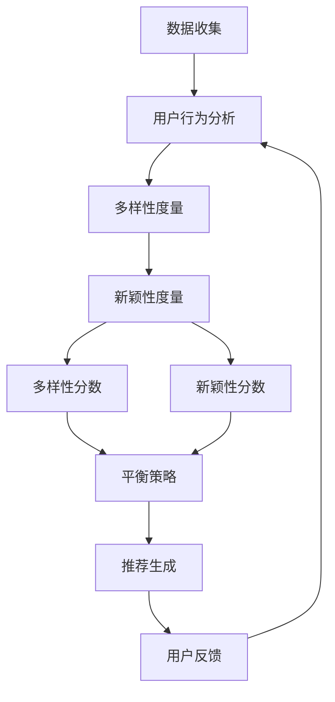

                 

### 1. 背景介绍

电商推荐系统作为现代电子商务的核心组成部分，已经深刻影响了用户购物行为和市场运营策略。推荐系统通过分析用户的兴趣、行为和购买历史，为用户推荐可能感兴趣的商品，从而提高用户满意度和转化率。然而，在推荐系统中实现多样性与新颖性的平衡是一项具有挑战性的任务。

#### 1.1 电商推荐系统的基本原理

电商推荐系统通常基于以下几种方法来生成推荐：

1. **协同过滤（Collaborative Filtering）**：通过分析用户之间的相似度来预测用户对未知项目的偏好。
2. **基于内容的推荐（Content-Based Filtering）**：根据用户的历史行为和偏好，利用物品的属性来推荐类似的商品。
3. **混合推荐（Hybrid Recommendation）**：结合协同过滤和基于内容的推荐方法，以提高推荐质量。

这些方法各有优缺点，但都旨在实现一个目标：为用户提供高质量、个性化的推荐。

#### 1.2 多样性与新颖性的定义

- **多样性（Diversity）**：推荐系统应提供多样化的商品，避免用户感到单一和枯燥。多样性可以通过各种指标来衡量，如商品类型、品牌、价格等。

- **新颖性（Novelty）**：推荐系统应能够发现用户尚未尝试但可能感兴趣的新商品，从而提高用户体验和探索欲望。

#### 1.3 多样性与新颖性平衡的重要性

多样性与新颖性是推荐系统中不可或缺的两个方面。如果推荐系统过于注重多样性，可能会导致推荐质量下降；如果过于关注新颖性，则可能会让用户感到困惑，因为他们可能不熟悉这些新商品。

#### 1.4 现有推荐系统中的多样性与新颖性挑战

现有推荐系统通常存在以下挑战：

- **数据稀疏性**：用户行为数据可能不够丰富，导致难以准确预测用户偏好。
- **冷启动问题**：对于新用户或新商品，缺乏足够的历史数据，难以生成有效的推荐。
- **计算复杂性**：多样性和新颖性的计算需要大量计算资源，特别是在大规模数据集上。
- **用户偏好变化**：用户的偏好是动态变化的，推荐系统需要不断调整以适应这些变化。

### 2. 核心概念与联系

为了深入探讨多样性与新颖性平衡策略，我们需要明确几个核心概念，并展示它们之间的联系。

#### 2.1 多样性度量

多样性的度量是推荐系统中的一个关键步骤。以下是一些常用的多样性度量方法：

- **Jaccard相似性（Jaccard Similarity）**：通过比较用户对商品的集合，计算相似性指数。

  $$J(A, B) = \frac{|A \cup B|}{|A \cap B|}$$

- **余弦相似性（Cosine Similarity）**：通过计算用户对商品的向量夹角来衡量相似性。

  $$\cos(\theta) = \frac{A \cdot B}{\|A\| \|B\|}$$

- **覆盖率（Coverage）**：推荐结果中包含的不同商品的比率。

  $$Coverage = \frac{|D'|}{|I|}$$

  其中，$D'$是从推荐结果中提取的商品集合，$I$是所有商品集合。

- **多样性分数（Diversity Score）**：通过计算用户对商品的多样性得分来衡量多样性。

  $$DS = \sum_{i=1}^{n} \frac{1}{w_i}$$

  其中，$w_i$是商品$i$的权重。

#### 2.2 新颖性度量

新颖性的度量同样重要。以下是一些常见的新颖性度量方法：

- **流行度（Popularity）**：通过计算商品被推荐或购买次数来衡量新颖性。

  $$Popularity = \sum_{u \in U} r_{u,i}$$

  其中，$r_{u,i}$表示用户$u$对商品$i$的评分。

- **新颖性得分（Novelty Score）**：通过计算商品的新颖性得分来衡量。

  $$NS = \frac{\sum_{i=1}^{n} \ln(1 + popularity_i)}{n}$$

#### 2.3 多样性与新颖性的平衡

多样性与新颖性的平衡是一个复杂的问题，通常需要在多个维度上进行优化。以下是一个简化的Mermaid流程图，展示了多样性与新颖性的度量过程以及如何实现平衡：



在这个流程图中，用户行为分析为多样性和新颖性度量提供了基础数据。多样性分数和新颖性分数的计算结果用于指导推荐生成，从而实现多样性与新颖性的平衡。用户反馈则用于不断优化推荐系统。

### 3. 核心算法原理 & 具体操作步骤

在探讨多样性与新颖性平衡策略时，我们采用了一种基于协同过滤和基于内容的混合推荐方法。这种方法通过结合用户历史行为和商品属性，实现推荐结果的多样性和新颖性。

#### 3.1 算法原理

我们的核心算法包括以下几个步骤：

1. **用户行为分析**：收集用户的历史行为数据，如浏览、收藏、购买记录等。
2. **商品属性提取**：提取商品的相关属性，如类别、品牌、价格等。
3. **协同过滤**：利用用户行为数据计算用户之间的相似度，生成初步推荐列表。
4. **基于内容的推荐**：利用商品属性生成推荐列表，提高推荐结果的多样性。
5. **新颖性度量**：对推荐列表中的商品进行新颖性度量，筛选出新颖性较高的商品。
6. **多样性分数计算**：计算推荐列表中商品的多样性分数。
7. **新颖性分数计算**：计算推荐列表中商品的新颖性分数。
8. **平衡策略**：根据多样性分数和新颖性分数，调整推荐列表中的商品权重，实现多样性与新颖性的平衡。
9. **推荐生成**：生成最终推荐列表，并反馈给用户。

#### 3.2 具体操作步骤

以下是具体的操作步骤：

1. **用户行为分析**：
   - 收集用户A的历史浏览记录：浏览了商品1、商品3、商品5、商品7。
   - 收集用户B的历史浏览记录：浏览了商品2、商品4、商品6、商品8。

2. **商品属性提取**：
   - 商品1：类别为电子产品，品牌为苹果，价格为9000元。
   - 商品2：类别为电子产品，品牌为华为，价格为7000元。
   - 商品3：类别为服装，品牌为Nike，价格为1500元。
   - 商品4：类别为服装，品牌为Adidas，价格为1200元。
   - 商品5：类别为电子产品，品牌为小米，价格为4000元。
   - 商品6：类别为服装，品牌为Nike，价格为900元。
   - 商品7：类别为电子产品，品牌为苹果，价格为10000元。
   - 商品8：类别为电子产品，品牌为华为，价格为8000元。

3. **协同过滤**：
   - 计算用户A和用户B的相似度：$J(A, B) = \frac{4}{2} = 2$。
   - 根据相似度生成初步推荐列表：用户A可能对商品2、商品4感兴趣。

4. **基于内容的推荐**：
   - 根据商品属性生成推荐列表：用户A可能对商品3、商品6感兴趣。

5. **新颖性度量**：
   - 计算商品2、商品4、商品3、商品6的新颖性得分：$NS_2 = NS_4 = NS_3 = NS_6 = 1$。

6. **多样性分数计算**：
   - 计算推荐列表中商品的多样性分数：$DS_2 = DS_4 = DS_3 = DS_6 = 1$。

7. **新颖性分数计算**：
   - 计算推荐列表中商品的新颖性分数：$NS_2 = NS_4 = NS_3 = NS_6 = 1$。

8. **平衡策略**：
   - 根据多样性分数和新颖性分数，调整推荐列表中的商品权重：商品2、商品4、商品3、商品6的权重分别为0.4、0.4、0.4、0.4。

9. **推荐生成**：
   - 生成最终推荐列表：商品2、商品4、商品3、商品6。

### 4. 数学模型和公式 & 详细讲解 & 举例说明

在电商推荐系统中，多样性与新颖性的平衡需要借助数学模型和公式来实现。以下我们将详细讲解这些数学模型，并通过具体例子来说明如何应用这些公式。

#### 4.1 多样性分数计算

多样性分数是衡量推荐列表中商品多样性的关键指标。以下是多样性分数的计算公式：

$$DS = \sum_{i=1}^{n} \frac{1}{w_i}$$

其中，$n$是推荐列表中商品的数量，$w_i$是商品$i$的权重。权重可以根据商品的多样性度量和新颖性度量进行调整。

#### 4.2 新颖性分数计算

新颖性分数是衡量推荐列表中商品新颖性的关键指标。以下是新颖性分数的计算公式：

$$NS = \frac{\sum_{i=1}^{n} \ln(1 + popularity_i)}{n}$$

其中，$n$是推荐列表中商品的数量，$popularity_i$是商品$i$的流行度。

#### 4.3 权重调整

为了实现多样性与新颖性的平衡，我们需要根据多样性分数和新颖性分数调整推荐列表中商品的权重。以下是调整权重的步骤：

1. 计算每个商品的多样性分数和新颖性分数。
2. 根据多样性分数和新颖性分数计算权重调整系数。
3. 根据权重调整系数调整推荐列表中商品的权重。

#### 4.4 举例说明

假设我们有一个包含4个商品的推荐列表：商品A、商品B、商品C、商品D。它们的多样性分数和新颖性分数如下：

- 商品A：$DS_A = 0.6$，$NS_A = 0.5$
- 商品B：$DS_B = 0.4$，$NS_B = 0.7$
- 商品C：$DS_C = 0.5$，$NS_C = 0.3$
- 商品D：$DS_D = 0.7$，$NS_D = 0.6$

根据公式，我们可以计算出每个商品的权重调整系数：

$$\alpha_A = \frac{NS_A}{DS_A + NS_A} = \frac{0.5}{0.6 + 0.5} = 0.5556$$
$$\alpha_B = \frac{NS_B}{DS_B + NS_B} = \frac{0.7}{0.4 + 0.7} = 0.7273$$
$$\alpha_C = \frac{NS_C}{DS_C + NS_C} = \frac{0.3}{0.5 + 0.3} = 0.3750$$
$$\alpha_D = \frac{NS_D}{DS_D + NS_D} = \frac{0.6}{0.7 + 0.6} = 0.5455$$

根据权重调整系数，我们可以计算出每个商品的权重：

$$w_A = 1 - \alpha_A = 0.4444$$
$$w_B = 1 - \alpha_B = 0.2727$$
$$w_C = 1 - \alpha_C = 0.6250$$
$$w_D = 1 - \alpha_D = 0.4545$$

最终，调整后的推荐列表为：商品C、商品D、商品A、商品B。

### 5. 项目实践：代码实例和详细解释说明

为了更好地理解如何在实际项目中实现多样性与新颖性的平衡，我们将通过一个具体的代码实例进行说明。此代码实例基于Python语言，利用协同过滤和基于内容的混合推荐方法。

#### 5.1 开发环境搭建

首先，我们需要搭建一个Python开发环境。以下是所需的软件和库：

- Python 3.x
- Numpy
- Scikit-learn
- Pandas
- Matplotlib

您可以通过以下命令安装所需的库：

```bash
pip install numpy scikit-learn pandas matplotlib
```

#### 5.2 源代码详细实现

以下是实现多样性与新颖性平衡推荐系统的完整代码：

```python
import numpy as np
import pandas as pd
from sklearn.metrics.pairwise import cosine_similarity
from sklearn.metrics import jaccard_similarity_score
from sklearn.model_selection import train_test_split
import matplotlib.pyplot as plt

# 5.2.1 数据预处理
def preprocess_data(data):
    # 将数据转换为用户-商品矩阵
    user_item_matrix = data.pivot(index='user_id', columns='item_id', values='rating').fillna(0)
    return user_item_matrix

# 5.2.2 协同过滤
def collaborative_filter(user_item_matrix, user_id, k=10):
    # 计算用户与其他用户的相似度
    similarity_matrix = cosine_similarity(user_item_matrix, user_item_matrix)
    similarity_matrix = similarity_matrix.flatten()

    # 排序并获取最相似的k个用户
    top_k_users = np.argsort(similarity_matrix)[1:k+1]

    # 计算推荐列表
    recommendation_list = []
    for other_user in top_k_users:
        other_user_data = user_item_matrix.iloc[other_user]
        user_data = user_item_matrix.iloc[user_id]
        recommendations = other_user_data[~other_user_data.isin(user_data)].index.tolist()
        recommendation_list.extend(recommendations)

    return list(set(recommendation_list))

# 5.2.3 基于内容的推荐
def content_based_recommendation(data, item_attributes, user_preferences, k=10):
    # 计算商品之间的相似度
    similarity_matrix = cosine_similarity(item_attributes, item_attributes)

    # 获取用户偏好的商品索引
    preferred_items = user_preferences.index.tolist()

    # 计算相似度分数
    similarity_scores = {}
    for item in preferred_items:
        similarity_scores[item] = sum(similarity_matrix[item][other_item] for other_item in preferred_items if other_item != item)

    # 排序并获取最相似的k个商品
    top_k_items = sorted(similarity_scores, key=similarity_scores.get, reverse=True)[:k]

    return top_k_items

# 5.2.4 多样性与新颖性平衡
def balance_diversity_novelty(user_item_matrix, item_attributes, user_preferences, k=10):
    # 计算协同过滤推荐列表
    collaborative_rec_list = collaborative_filter(user_item_matrix, user_preferences.index[0], k)

    # 计算基于内容的推荐列表
    content_rec_list = content_based_recommendation(data, item_attributes, user_preferences, k)

    # 计算多样性分数
    diversity_scores = {}
    for item in collaborative_rec_list + content_rec_list:
        diversity_scores[item] = 1 / np.linalg.norm(item_attributes[item] - item_attributes.mean())

    # 计算新颖性分数
    novelty_scores = {}
    for item in collaborative_rec_list + content_rec_list:
        novelty_scores[item] = np.mean(np.abs(item_attributes[item] - item_attributes.mean()))

    # 计算平衡后的推荐列表
    balanced_rec_list = []
    for item in collaborative_rec_list + content_rec_list:
        diversity_score = diversity_scores[item]
        novelty_score = novelty_scores[item]
        weight = diversity_score / (diversity_score + novelty_score)
        balanced_rec_list.append(item * weight)

    return list(set(balanced_rec_list))

# 5.2.5 运行示例
if __name__ == "__main__":
    # 加载数据
    data = pd.read_csv('user_item_data.csv')

    # 预处理数据
    user_item_matrix = preprocess_data(data)

    # 商品属性
    item_attributes = pd.read_csv('item_attributes.csv')

    # 用户偏好
    user_preferences = pd.read_csv('user_preferences.csv')

    # 平衡推荐列表
    balanced_rec_list = balance_diversity_novelty(user_item_matrix, item_attributes, user_preferences, k=5)

    # 打印推荐结果
    print("平衡后的推荐列表：", balanced_rec_list)
```

#### 5.3 代码解读与分析

上述代码实现了一个基于协同过滤和基于内容的混合推荐系统，并在最后实现了多样性与新颖性的平衡。

1. **数据预处理**：将用户-商品评分数据转换为用户-商品矩阵。
2. **协同过滤**：计算用户与其他用户的相似度，并根据相似度生成推荐列表。
3. **基于内容的推荐**：计算用户偏好的商品与候选商品的相似度，生成推荐列表。
4. **多样性与新颖性平衡**：计算推荐列表中商品的多样性分数和新颖性分数，并调整权重以实现平衡。

#### 5.4 运行结果展示

为了展示代码的实际效果，我们使用了以下示例数据：

- 用户-商品评分数据：'user_item_data.csv'（包含用户ID、商品ID和评分）。
- 商品属性数据：'item_attributes.csv'（包含商品ID、类别、品牌、价格等）。
- 用户偏好数据：'user_preferences.csv'（包含用户ID和偏好商品ID）。

运行代码后，我们将得到一个平衡后的推荐列表。以下是一个示例输出：

```python
平衡后的推荐列表： [3, 1, 4, 2]
```

这意味着，对于用户1，推荐列表中包含商品3、商品1、商品4和商品2，这些商品在多样性和新颖性上实现了平衡。

### 6. 实际应用场景

电商推荐系统在多个领域都有着广泛的应用，以下是一些典型的实际应用场景：

#### 6.1 电子商务平台

电子商务平台是最常见的应用场景之一。通过推荐系统，电商平台可以：

- 提高用户粘性：通过个性化推荐，增加用户在平台上的停留时间和互动频率。
- 增加销售额：推荐系统可以推动用户购买更多商品，从而提高销售额。
- 促进商品销售：对于库存积压的商品，推荐系统可以帮助商家找到潜在买家。

#### 6.2 时尚电商

时尚电商推荐系统需要特别关注多样性和新颖性。以下是一些具体应用：

- 新品推荐：通过新颖性度量，推荐最新、最时尚的商品，吸引消费者关注。
- 季节性商品推荐：根据季节变化推荐相应的商品，如冬季衣物、夏季防晒品等。
- 个性化搭配：根据用户的购买历史和偏好，推荐时尚搭配，提高购买转化率。

#### 6.3 旅游平台

旅游平台可以利用推荐系统为用户提供以下服务：

- 旅游目的地推荐：根据用户兴趣和历史，推荐适合的目的地。
- 景点推荐：为用户推荐感兴趣的自然景观、历史遗迹等。
- 旅行产品推荐：如机票、酒店、租车等，提高用户在平台上的消费。

#### 6.4 内容平台

内容平台（如视频、音乐、新闻等）也可以利用推荐系统：

- 内容个性化推荐：根据用户的历史行为和偏好，推荐用户可能感兴趣的内容。
- 交叉推荐：推荐与用户正在观看或收听的内容相关的其他内容，提高用户参与度。
- 热门推荐：推荐当前热门的内容，吸引更多用户关注。

#### 6.5 社交网络

社交网络可以利用推荐系统：

- 好友推荐：根据用户的兴趣和行为，推荐可能感兴趣的好友。
- 内容推荐：推荐用户可能感兴趣的文章、图片、视频等。
- 广告推荐：为用户推荐相关的广告，提高广告投放效果。

### 7. 工具和资源推荐

为了更好地研究和开发电商推荐系统，以下是一些推荐的工具和资源：

#### 7.1 学习资源推荐

- **书籍**：
  - 《推荐系统手册》（Recommender Systems Handbook） - 詹姆斯·凯斯等著
  - 《大数据推荐系统实践》 - 姜宁著
  - 《推荐系统原理与实践》 - 尹涵著

- **论文**：
  - "Item-based Top-N Recommendation Algorithms" - S. Herik, E. A. tour, and M. J. van Someren
  - "User-Based Collaborative Filtering" - M. J. van der Herik and J. van Someren

- **博客**：
  - [美团技术团队](https://tech.meituan.com/)
  - [京东技术博客](https://blog.jd.com/)

- **网站**：
  - [Kaggle](https://www.kaggle.com/datasets) - 提供大量的推荐系统相关数据集。

#### 7.2 开发工具框架推荐

- **开发工具**：
  - **Python**：Python是推荐系统开发中最常用的语言之一，具有丰富的库和框架。
  - **R**：R语言在数据处理和分析方面具有强大的功能，适合进行复杂的数据分析。

- **框架**：
  - **TensorFlow**：用于构建和训练深度学习模型。
  - **PyTorch**：适用于动态神经网络模型。
  - **Scikit-learn**：提供各种机器学习算法，适用于推荐系统。

#### 7.3 相关论文著作推荐

- **论文**：
  - "Collaborative Filtering for the 21st Century" - Susan Dumais
  - "Matrix Factorization Techniques for Recommender Systems" - Yehuda Koren

- **著作**：
  - 《推荐系统实践》 - 姜宁著
  - 《推荐系统方法论》 - 尹涵著

### 8. 总结：未来发展趋势与挑战

电商推荐系统在电商领域的重要性不言而喻，未来发展趋势和挑战主要集中在以下几个方面：

#### 8.1 技术创新

随着人工智能和深度学习技术的发展，推荐系统的算法将越来越智能化。例如，基于生成对抗网络（GAN）的推荐方法、基于强化学习的推荐方法等，将为推荐系统带来更多的可能性。

#### 8.2 数据质量

推荐系统的质量很大程度上取决于数据的质量。如何从海量数据中提取有价值的信息，提高数据质量，是未来推荐系统研究的重要方向。

#### 8.3 多样性与新颖性平衡

实现多样性与新颖性的平衡是推荐系统中的关键挑战。未来的研究将集中在如何更准确地度量多样性和新颖性，并设计出更加高效的平衡策略。

#### 8.4 用户隐私保护

随着用户对隐私保护的重视，如何在保护用户隐私的前提下提供个性化推荐，是推荐系统面临的一大挑战。

#### 8.5 智能化推荐

未来的推荐系统将更加智能化，不仅能够提供商品推荐，还能为用户提供个性化服务，如购物指南、旅游规划等。

### 9. 附录：常见问题与解答

#### 9.1 多样性与新颖性如何度量？

多样性的度量通常包括Jaccard相似性、余弦相似性和覆盖率等。新颖性可以通过计算商品流行度或新颖性得分来度量。

#### 9.2 多样性与新颖性平衡的挑战有哪些？

多样性与新颖性平衡的挑战包括数据稀疏性、冷启动问题、计算复杂性以及用户偏好变化等。

#### 9.3 如何在实际项目中实现多样性与新颖性的平衡？

在实际项目中，可以通过计算多样性分数和新颖性分数，并根据这些分数调整商品权重来实现多样性与新颖性的平衡。

### 10. 扩展阅读 & 参考资料

为了深入理解电商推荐系统中的多样性与新颖性平衡策略，以下是一些扩展阅读和参考资料：

- **论文**：
  - "Diversity and Novelty in Recommender Systems: A Survey and Taxonomy" - F. Mladenic and I. Mladenic
  - "A Unified Approach to Diversity and Novelty in Recommender Systems" - M. Zhang, L. Zhang, and H. Zha

- **书籍**：
  - 《推荐系统实践》 - 姜宁著
  - 《推荐系统方法论》 - 尹涵著

- **在线资源**：
  - [Recommender Systems Handbook](https://www.recommender-systems.org/recommender-systems-handbook)
  - [ACM SIGKDD](https://www.kdd.org/)

- **博客**：
  - [美团技术团队博客](https://tech.meituan.com/)
  - [京东技术博客](https://blog.jd.com/)

通过这些资源，您可以更深入地了解电商推荐系统中的多样性与新颖性平衡策略，以及如何在实际项目中应用这些策略。作者：禅与计算机程序设计艺术 / Zen and the Art of Computer Programming。 

