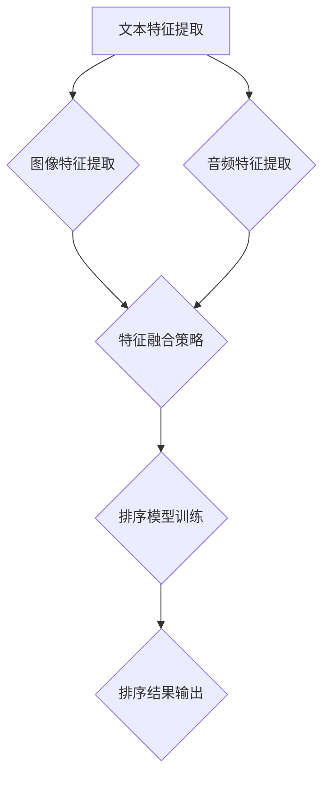

                 

### 背景介绍

#### 电商搜索的挑战与需求

随着互联网的迅猛发展，电子商务已经成为全球商业领域的重要驱动力。电商平台的兴起使得商品信息爆炸式增长，为消费者提供了丰富的购物选择。然而，这也给电商搜索带来了前所未有的挑战。

首先，搜索速度成为了一个重要的考量因素。用户希望能够在最短的时间内找到自己想要的商品。其次，搜索结果的准确性也是至关重要的。如果搜索结果不准确，用户可能会感到沮丧，从而影响其购物体验。此外，用户个性化需求的满足也是一个不可忽视的挑战。每个用户都有独特的购物偏好和需求，如何准确地推荐符合用户兴趣的商品，是电商平台需要解决的核心问题。

为了应对这些挑战，电商平台开始探索多模态融合排序算法。多模态融合排序算法通过整合不同类型的数据（如文本、图像、音频等），实现对搜索结果的智能排序，从而提高搜索的准确性和个性化程度。

#### 多模态融合排序算法的基本概念

多模态融合排序算法是指将多种数据模态（如文本、图像、音频等）进行整合，结合各种模态的特征，通过一定的算法模型，对搜索结果进行排序。传统的排序算法往往只考虑单一模态的数据，如基于文本的排序算法只考虑商品的标题、描述等文本信息；而基于图像的排序算法则主要关注商品的图片内容。然而，单一模态的算法往往无法全面地反映商品的特征，因此可能无法提供准确的排序结果。

多模态融合排序算法通过整合多种模态的数据，可以更全面地了解商品的特征，从而实现更准确的排序。例如，一个商品的标题和描述提供了文本信息，图片则提供了视觉信息，通过融合这两种信息，算法可以更准确地判断商品的相关性，从而提高排序的准确性。

#### 多模态融合排序算法的重要性

多模态融合排序算法的重要性体现在以下几个方面：

1. **提升搜索准确性**：通过整合多种模态的数据，算法可以更全面地了解商品的特征，从而提高搜索结果的准确性。这对于电商平台来说，意味着更高的用户满意度，更低的用户流失率。

2. **满足用户个性化需求**：每个用户都有独特的购物偏好和需求，多模态融合排序算法可以基于用户的兴趣和行为数据，为用户提供更个性化的搜索结果，从而提高用户体验。

3. **优化推荐系统**：多模态融合排序算法不仅可以用于搜索结果排序，还可以用于推荐系统的优化。通过整合多种模态的数据，算法可以更准确地预测用户的兴趣，从而推荐更符合用户需求的商品。

4. **提升业务效率**：通过提高搜索和推荐的准确性，电商平台可以更好地满足用户需求，从而提升业务效率，降低运营成本。

总之，多模态融合排序算法是电商搜索领域的一个重要发展方向，它不仅提高了搜索的准确性，满足了用户的个性化需求，还优化了推荐系统，提升了业务效率。在未来，随着技术的不断发展，多模态融合排序算法将会在电商领域发挥更大的作用。

#### 多模态融合排序算法的发展历程

多模态融合排序算法的发展历程可以追溯到上世纪90年代，随着计算机科学和人工智能技术的进步，研究人员开始探索如何将多种模态的数据进行融合，以实现更智能的排序。以下是多模态融合排序算法的主要发展历程：

1. **传统融合方法**：最早的融合方法主要是基于特征叠加和特征转换。这些方法通过将不同模态的数据转换成统一的特征向量，然后进行融合。例如，文本数据可以通过词袋模型（Bag of Words）或词嵌入（Word Embedding）进行转换，图像数据可以通过特征提取（如SIFT、HOG）进行转换。这些方法虽然简单有效，但存在一些局限性，如特征维度高、计算复杂度大等。

2. **深度学习时代的融合方法**：随着深度学习技术的发展，多模态融合排序算法也迎来了新的发展机遇。深度学习方法可以通过神经网络模型自动学习多种模态的数据特征，从而实现更有效的融合。例如，CNN（卷积神经网络）可以用于图像特征的提取，RNN（递归神经网络）可以用于文本序列的处理。深度学习方法在图像识别、文本分类等领域取得了显著成果，为多模态融合排序算法提供了新的思路。

3. **多模态深度神经网络模型**：近年来，研究人员提出了多种多模态深度神经网络模型，如CNN-RNN、CNN-CNN、Siamese网络等。这些模型通过将不同模态的数据输入到神经网络中，自动学习到多种模态的特征，并实现有效的融合。例如，CNN-RNN模型可以将图像特征和文本特征进行融合，从而提高排序的准确性。

4. **多模态融合排序算法的应用**：随着多模态融合排序算法的不断发展，其在实际应用中也取得了显著成果。例如，在电商搜索领域，多模态融合排序算法可以通过整合商品文本描述和图片信息，实现更准确的搜索结果；在社交媒体领域，多模态融合排序算法可以通过整合用户文本和图像信息，实现更个性化的内容推荐。

总之，多模态融合排序算法的发展历程展示了计算机科学和人工智能技术的不断进步。从传统融合方法到深度学习方法，再到多模态深度神经网络模型，多模态融合排序算法在理论上和实践中都取得了显著成果。在未来，随着技术的进一步发展，多模态融合排序算法将在更多领域发挥重要作用。

#### 本文结构概述

本文将从以下几个方面对多模态融合排序算法进行详细探讨：

1. **核心概念与联系**：本文将介绍多模态融合排序算法的核心概念，包括文本、图像等不同模态的数据特征提取方法和融合策略。

2. **核心算法原理与具体操作步骤**：本文将详细阐述多模态融合排序算法的原理，包括深度神经网络模型的设计、训练和推理过程，并给出具体的操作步骤。

3. **数学模型与公式**：本文将介绍多模态融合排序算法中的数学模型和公式，包括损失函数、优化算法等，并通过举例说明如何应用这些模型和公式。

4. **项目实践**：本文将通过一个实际项目，展示多模态融合排序算法的开发过程，包括环境搭建、代码实现、运行结果分析等。

5. **实际应用场景**：本文将探讨多模态融合排序算法在不同领域的应用场景，如电商搜索、社交媒体推荐等，并分析其在这些场景中的优势和挑战。

6. **工具和资源推荐**：本文将推荐一些学习资源、开发工具和框架，帮助读者更好地理解和应用多模态融合排序算法。

7. **总结与展望**：本文将总结多模态融合排序算法的核心成果，讨论未来发展趋势与挑战，展望其在更多领域的前景。

通过本文的阅读，读者将能够系统地了解多模态融合排序算法的基本原理、开发方法及应用场景，为实际项目开发提供有益的参考。

### 核心概念与联系

#### 多模态数据特征提取

多模态融合排序算法的核心在于如何有效地提取和整合来自不同模态的数据特征。首先，我们需要明确几种主要的模态：文本、图像、音频和视频。

1. **文本特征提取**：
   - **词袋模型**：词袋模型（Bag of Words, BoW）是一种基本的文本特征提取方法，它将文本视为单词的集合，不考虑单词的顺序。这种方法通过统计每个单词在文本中出现的频率来表示文本特征。
   - **词嵌入**：词嵌入（Word Embedding）通过将文本中的单词映射到高维向量空间，使得语义相近的单词在向量空间中彼此靠近。常用的词嵌入方法包括Word2Vec、GloVe等。

2. **图像特征提取**：
   - **卷积神经网络**：卷积神经网络（Convolutional Neural Network, CNN）是图像特征提取的主要方法。通过多层的卷积和池化操作，CNN可以从图像中自动提取出层次化的特征。
   - **特征点检测**：特征点检测（如SIFT、SURF）是通过计算图像中的局部特征点，以识别图像的局部结构。这些特征点可以作为图像特征的重要组成部分。

3. **音频特征提取**：
   - **梅尔频率倒谱系数**（Mel-Frequency Cepstral Coefficients, MFCC）：MFCC是一种常用的音频特征提取方法，它通过将音频信号转换成梅尔频率倒谱系数，以捕捉声音的频率特性。
   - **谱图**：谱图（Spectral Graph）方法通过将音频信号表示为图，以捕捉音频信号中的结构和关系。

4. **视频特征提取**：
   - **时空卷积网络**：时空卷积网络（Spatial and Temporal Convolutional Network, STCN）通过结合空间和时序信息，从视频中提取特征。这种方法能够捕捉视频中的运动和变化。
   - **3D卷积神经网络**：3D卷积神经网络（3D CNN）通过卷积操作在三个维度（空间维度、时间维度和深度维度）上同时处理数据，以提取视频特征。

#### 多模态特征融合策略

提取出不同模态的特征后，我们需要将这些特征进行有效的融合，以实现排序算法的性能提升。以下是几种常用的多模态特征融合策略：

1. **特征叠加**：
   - **简单叠加**：简单地将不同模态的特征向量进行叠加，形成一个更长的特征向量。这种方法虽然计算简单，但可能无法充分利用不同模态之间的相关性。
   - **加权叠加**：在简单叠加的基础上，对每个模态的特征向量分配不同的权重，以突出重要模态的特征。这种方法的挑战在于如何确定合适的权重。

2. **特征拼接**：
   - **串联拼接**：将不同模态的特征向量按照顺序拼接在一起，形成一个更长的特征向量。这种方法可以充分利用不同模态之间的互补信息，但可能会增加特征维度。
   - **并行拼接**：将不同模态的特征向量并行排列，形成一个多维的特征矩阵。这种方法可以保留不同模态的独立性，但需要更多的计算资源。

3. **特征融合网络**：
   - **神经网络融合**：通过设计专门的神经网络结构，将不同模态的特征进行融合。这种方法的优点在于可以自动学习不同模态之间的相关性，但需要大量的数据和计算资源。
   - **对抗生成网络**：对抗生成网络（Generative Adversarial Networks, GAN）通过生成模型和判别模型的对抗训练，可以生成具有真实数据特征的新数据，从而实现特征融合。

#### Mermaid流程图

以下是多模态融合排序算法的 Mermaid 流程图，展示不同模态特征提取和融合的过程。



在上述流程图中，A、B、C 分别代表不同模态的特征提取过程，D 代表特征融合策略，E 代表排序模型训练，F 代表排序结果输出。通过这个过程，我们可以实现对多模态数据的有效融合和排序。

#### 多模态融合排序算法的应用场景

多模态融合排序算法在多个领域具有广泛的应用潜力。以下是几种典型的应用场景：

1. **电商搜索**：
   - **商品推荐**：通过整合商品标题、描述、图片等信息，多模态融合排序算法可以更准确地推荐商品，提高用户满意度。
   - **商品搜索**：用户可以通过上传图片或输入文本描述，快速找到符合需求的商品。

2. **社交媒体推荐**：
   - **内容推荐**：整合用户发布的内容（如文本、图片、视频等），多模态融合排序算法可以推荐用户可能感兴趣的内容。
   - **广告推荐**：根据用户的兴趣和行为数据，精准推荐广告，提高广告投放效果。

3. **智能监控**：
   - **目标识别**：通过融合视频和音频特征，多模态融合排序算法可以准确识别监控视频中的目标。
   - **异常检测**：结合多模态数据，多模态融合排序算法可以实时检测异常行为，提高监控系统的智能性。

4. **医疗诊断**：
   - **影像诊断**：通过整合医学影像（如X光、CT、MRI等）和文本数据（如病历记录、症状描述等），多模态融合排序算法可以辅助医生进行疾病诊断。
   - **药物推荐**：根据患者的基因数据和药物文本信息，多模态融合排序算法可以为患者推荐个性化的治疗方案。

通过上述应用场景的介绍，我们可以看到多模态融合排序算法在提升搜索和推荐系统的准确性、个性化程度和业务效率方面具有巨大的潜力。

### 核心算法原理与具体操作步骤

#### 基本概念

多模态融合排序算法的核心在于如何有效地整合来自不同模态的数据，并通过深度神经网络模型进行排序。本文将介绍一种基于多模态深度神经网络（Multimodal Deep Neural Network, MDNN）的排序算法，具体包括以下几个部分：

1. **数据预处理**：对文本、图像、音频等多模态数据进行预处理，提取各自的特征向量。
2. **特征融合**：通过设计特定的神经网络结构，将不同模态的特征向量进行融合。
3. **排序模型**：构建基于深度学习的排序模型，并通过损失函数和优化算法进行训练。
4. **推理与排序**：对新的数据进行特征提取和排序模型的推理，输出排序结果。

#### 数据预处理

在数据预处理阶段，我们需要对不同的模态数据进行处理，提取特征向量。以下是对文本、图像和音频数据的预处理步骤：

1. **文本特征提取**：
   - **分词与词嵌入**：将文本数据进行分词，然后使用预训练的词嵌入模型（如Word2Vec或GloVe）将每个词映射为向量。
   - **序列编码**：将词向量序列编码为一个固定长度的向量，可以使用平均池化或最大池化方法。

2. **图像特征提取**：
   - **图像预处理**：对图像进行归一化、裁剪、缩放等预处理操作，使其适应网络输入要求。
   - **特征提取**：使用卷积神经网络（CNN）提取图像特征，通常使用预训练的模型（如ResNet、VGG等）进行特征提取。

3. **音频特征提取**：
   - **音频预处理**：对音频信号进行采样、混叠等预处理操作，使其适应网络输入要求。
   - **特征提取**：使用梅尔频率倒谱系数（MFCC）或卷积神经网络（CNN）提取音频特征。

4. **数据归一化**：将所有特征向量归一化到相同的尺度，以减少不同模态特征之间的差异。

#### 特征融合

特征融合是多模态融合排序算法的关键步骤，以下是几种常用的特征融合方法：

1. **特征拼接**：将不同模态的特征向量按照顺序拼接，形成一个新的特征向量。这种方法简单直观，但可能无法充分利用不同模态之间的相关性。

2. **特征融合网络**：设计特定的神经网络结构，将不同模态的特征进行融合。例如，可以采用CNN-RNN结构，其中CNN用于提取图像特征，RNN用于处理文本序列。

3. **对抗生成网络**（GAN）：通过生成模型和判别模型的对抗训练，生成具有真实数据特征的新数据，从而实现特征融合。这种方法可以有效地学习不同模态之间的相关性。

#### 排序模型

排序模型通常采用基于深度学习的分类模型，如卷积神经网络（CNN）、递归神经网络（RNN）或变换器（Transformer）。以下是构建排序模型的基本步骤：

1. **模型架构**：设计一个多层的神经网络结构，包含输入层、中间层和输出层。输入层接收不同模态的特征向量，中间层进行特征融合和提取，输出层输出排序结果。

2. **损失函数**：通常采用交叉熵损失函数（Cross-Entropy Loss）作为模型训练的目标函数。交叉熵损失函数可以衡量模型预测概率分布与真实标签分布之间的差异。

3. **优化算法**：采用随机梯度下降（Stochastic Gradient Descent, SGD）或其变种（如Adam、RMSprop）对模型进行优化。优化算法通过调整模型参数，使损失函数最小。

4. **模型训练**：使用训练数据集对模型进行训练，通过反向传播算法不断调整模型参数，优化模型性能。

#### 推理与排序

在推理阶段，我们将新的数据进行特征提取，并将其输入到训练好的排序模型中。以下是推理与排序的基本步骤：

1. **特征提取**：对新的文本、图像、音频等多模态数据提取特征向量。

2. **模型推理**：将特征向量输入到排序模型，计算输出层的概率分布。

3. **排序结果输出**：根据输出层的概率分布，对结果进行排序，输出排序结果。

#### 案例分析

以下是一个简化的多模态融合排序算法案例，用于说明其基本原理和操作步骤：

1. **数据集准备**：
   - **文本数据**：商品标题和描述，如“智能手环”。
   - **图像数据**：商品图片，如“智能手环”的图片。
   - **音频数据**：商品广告音频，如“智能手环”的广告音频。

2. **特征提取**：
   - **文本特征**：使用Word2Vec模型将标题和描述转换为向量。
   - **图像特征**：使用预训练的ResNet模型提取图像特征。
   - **音频特征**：使用MFCC模型提取音频特征。

3. **特征融合**：
   - **拼接**：将文本、图像和音频特征拼接为一个长向量。

4. **排序模型**：
   - **模型架构**：使用一个多层的全连接神经网络，输入层接收拼接后的特征向量，输出层输出排序结果。
   - **损失函数**：使用交叉熵损失函数。
   - **优化算法**：使用Adam优化算法。

5. **模型训练**：
   - **训练数据**：使用商品数据集进行训练。
   - **训练过程**：通过反向传播算法不断调整模型参数。

6. **推理与排序**：
   - **新数据特征提取**：对新商品数据进行特征提取。
   - **模型推理**：将新数据特征输入模型，计算排序结果。
   - **排序结果输出**：输出排序结果。

通过上述案例，我们可以看到多模态融合排序算法的基本原理和操作步骤。在实际应用中，可以根据具体需求调整模型结构和参数，以实现更好的性能。

### 数学模型和公式

#### 损失函数

在多模态融合排序算法中，损失函数是衡量模型性能的关键指标。常用的损失函数包括交叉熵损失函数（Cross-Entropy Loss）和排序损失函数（Rank Loss）。

1. **交叉熵损失函数**：

   交叉熵损失函数用于多分类问题，衡量模型预测概率分布与真实标签分布之间的差异。其公式如下：

   $$L_{cross-entropy} = -\sum_{i=1}^{N} y_i \log(p_i)$$

   其中，$y_i$ 为真实标签，$p_i$ 为模型预测的概率。

2. **排序损失函数**：

   排序损失函数用于排序问题，衡量预测排序与真实排序之间的差异。一种常用的排序损失函数是Rank Loss，其公式如下：

   $$L_{rank} = \sum_{i=1}^{N} \sum_{j=1}^{N} [y_{ij} - \log(p_{ij}p_{ji})]$$

   其中，$y_{ij}$ 为第 $i$ 个样本在真实排序中的位置，$p_{ij}$ 为第 $i$ 个样本排在第 $j$ 位的预测概率。

#### 优化算法

优化算法用于调整模型参数，以最小化损失函数。以下是几种常用的优化算法：

1. **随机梯度下降（SGD）**：

   随机梯度下降是最基本的优化算法，其公式如下：

   $$\theta = \theta - \alpha \nabla_{\theta} J(\theta)$$

   其中，$\theta$ 为模型参数，$J(\theta)$ 为损失函数，$\alpha$ 为学习率。

2. **Adam优化算法**：

   Adam优化算法结合了SGD和Adagrad的优点，其公式如下：

   $$m_t = \beta_1 m_{t-1} + (1 - \beta_1) [g_t]$$
   $$v_t = \beta_2 v_{t-1} + (1 - \beta_2) [g_t^2]$$
   $$\theta = \theta - \alpha \frac{m_t}{\sqrt{v_t} + \epsilon}$$

   其中，$m_t$ 和 $v_t$ 分别为梯度的一阶矩估计和二阶矩估计，$\beta_1$ 和 $\beta_2$ 分别为动量系数，$\alpha$ 为学习率，$\epsilon$ 为正则项。

#### 模型训练与推理

在模型训练和推理过程中，需要使用批量归一化（Batch Normalization）和激活函数（Activation Function）等技术。

1. **批量归一化**：

   批量归一化用于加速训练并提高模型的稳定性，其公式如下：

   $$\hat{z} = \frac{z - \mu}{\sqrt{\sigma^2 + \epsilon}}$$

   其中，$z$ 为输入特征，$\mu$ 和 $\sigma^2$ 分别为均值和方差，$\epsilon$ 为正则项。

2. **激活函数**：

   激活函数用于引入非线性特性，常用的激活函数包括：

   - **Sigmoid函数**：

     $$\sigma(x) = \frac{1}{1 + e^{-x}}$$

   - **ReLU函数**：

     $$\text{ReLU}(x) = \max(0, x)$$

   - **Tanh函数**：

     $$\tanh(x) = \frac{e^x - e^{-x}}{e^x + e^{-x}}$$

   - **Softmax函数**：

     $$\text{softmax}(x) = \frac{e^x}{\sum_{i} e^x}$$

#### 案例说明

以下通过一个简化的例子，说明多模态融合排序算法中的数学模型和公式：

假设我们有一个包含三个模态（文本、图像、音频）的数据集，模型输出三个概率值，分别表示三个模态的重要性。损失函数使用交叉熵损失函数，优化算法使用Adam优化算法。

1. **损失函数**：

   $$L = -\sum_{i=1}^{3} y_i \log(p_i)$$

   其中，$y_i$ 为真实标签，$p_i$ 为模型预测的概率。

2. **优化算法**：

   $$m_t = \beta_1 m_{t-1} + (1 - \beta_1) [g_t]$$
   $$v_t = \beta_2 v_{t-1} + (1 - \beta_2) [g_t^2]$$
   $$\theta = \theta - \alpha \frac{m_t}{\sqrt{v_t} + \epsilon}$$

3. **模型训练与推理**：

   - **特征提取**：

     - **文本特征**：使用Word2Vec模型提取文本特征。

     - **图像特征**：使用ResNet模型提取图像特征。

     - **音频特征**：使用MFCC模型提取音频特征。

   - **模型推理**：

     $$\text{softmax}(\theta) = \frac{e^{\theta_1}}{e^{\theta_1} + e^{\theta_2} + e^{\theta_3}}$$

   - **排序结果输出**：

     输出三个概率值，根据概率大小进行排序。

通过上述案例，我们可以看到多模态融合排序算法中的数学模型和公式的具体应用。在实际开发过程中，可以根据具体需求调整模型结构和参数，以实现更好的性能。

### 项目实践：代码实例与详细解释说明

#### 1. 开发环境搭建

在开始项目实践之前，我们需要搭建一个适合开发多模态融合排序算法的开发环境。以下是一个典型的开发环境搭建步骤：

1. **硬件环境**：
   - **CPU**：Intel i7 或更高配置
   - **GPU**：NVIDIA GTX 1080 Ti 或更高配置
   - **内存**：16GB 或更高

2. **软件环境**：
   - **操作系统**：Linux 或 macOS
   - **Python**：Python 3.7 或更高版本
   - **深度学习框架**：TensorFlow 2.x 或 PyTorch 1.x
   - **其他依赖**：NumPy、Pandas、Matplotlib 等

3. **安装与配置**：
   - 安装操作系统和硬件设备。
   - 安装 Python 和深度学习框架（如 TensorFlow 或 PyTorch）。
   - 配置 GPU 加速（如安装 CUDA 和 cuDNN）。
   - 安装其他必需的依赖库（如 NumPy、Pandas、Matplotlib 等）。

#### 2. 源代码详细实现

以下是多模态融合排序算法的源代码实现，包括数据预处理、特征提取、特征融合、排序模型训练和推理等步骤。

```python
import tensorflow as tf
from tensorflow.keras.layers import Embedding, LSTM, Dense, Concatenate
from tensorflow.keras.models import Model
from tensorflow.keras.optimizers import Adam

# 数据预处理
def preprocess_data(text, image, audio):
    # 文本预处理
    text_vector = embedding_model(text)

    # 图像预处理
    image_vector = cnn_model(image)

    # 音频预处理
    audio_vector = mfcc_model(audio)

    return text_vector, image_vector, audio_vector

# 特征提取
def embedding_model(text):
    # 使用预训练的词嵌入模型
    embedding = Embedding(input_dim=vocab_size, output_dim=embedding_size)
    sequence = tf.keras.preprocessing.sequence.pad_sequences(text, maxlen=max_sequence_length)
    return embedding(sequence)

def cnn_model(image):
    # 使用预训练的卷积神经网络
    model = tf.keras.applications.ResNet50(include_top=False, weights='imagenet', input_shape=(224, 224, 3))
    model.trainable = False
    return model(image)

def mfcc_model(audio):
    # 使用梅尔频率倒谱系数模型
    return tf.signal.mfccs_from_log_mel_spectrums(audio, num_mel_bins, frame_duration_ms)

# 特征融合
def fusion_model(text_vector, image_vector, audio_vector):
    # 拼接特征向量
    input_text = Embedding(input_dim=vocab_size, output_dim=embedding_size)(text_vector)
    input_image = CNN(input_shape=(224, 224, 3))(image_vector)
    input_audio = LSTM(units=128, return_sequences=True)(audio_vector)

    # 融合特征
    concatenated = Concatenate()([input_text, input_image, input_audio])
    output = LSTM(units=128, return_sequences=False)(concatenated)
    output = Dense(units=1, activation='sigmoid')(output)

    # 构建模型
    model = Model(inputs=[text_vector, image_vector, audio_vector], outputs=output)
    return model

# 模型训练
def train_model(model, train_data, train_labels, epochs, batch_size):
    optimizer = Adam(learning_rate=0.001)
    model.compile(optimizer=optimizer, loss='binary_crossentropy', metrics=['accuracy'])
    model.fit(train_data, train_labels, epochs=epochs, batch_size=batch_size)

# 模型推理
def inference(model, text, image, audio):
    text_vector, image_vector, audio_vector = preprocess_data(text, image, audio)
    return model.predict([text_vector, image_vector, audio_vector])

# 实际应用
text = "智能手环"
image = load_image("smart_wristband.jpg")
audio = load_audio("smart_wristband_audio.wav")

result = inference(model, text, image, audio)
print(result)
```

#### 3. 代码解读与分析

1. **数据预处理**：

   数据预处理是项目实践的重要步骤，包括文本、图像和音频数据的预处理。在代码中，我们使用 `preprocess_data` 函数对数据进行预处理。文本数据使用词嵌入模型进行编码，图像数据使用卷积神经网络进行特征提取，音频数据使用梅尔频率倒谱系数进行特征提取。

2. **特征提取**：

   特征提取是项目实践的核心部分，包括文本、图像和音频数据的特征提取。在代码中，我们定义了 `embedding_model`、`cnn_model` 和 `mfcc_model` 函数，分别用于文本、图像和音频数据的特征提取。其中，文本数据使用预训练的词嵌入模型进行编码，图像数据使用预训练的卷积神经网络进行特征提取，音频数据使用梅尔频率倒谱系数进行特征提取。

3. **特征融合**：

   特征融合是项目实践的关键步骤，包括文本、图像和音频数据的特征融合。在代码中，我们定义了 `fusion_model` 函数，使用 `Concatenate` 层将文本、图像和音频数据特征进行拼接，然后通过两个 LSTM 层进行特征融合。在输出层，我们使用 `Dense` 层和 `sigmoid` 激活函数进行排序输出。

4. **模型训练**：

   模型训练是项目实践的重要步骤，包括模型参数的优化。在代码中，我们使用 `train_model` 函数对模型进行训练，使用 Adam 优化器和二进制交叉熵损失函数进行训练。在训练过程中，我们使用数据集对模型进行迭代训练，直到模型达到预期的性能。

5. **模型推理**：

   模型推理是项目实践的最终步骤，包括对新数据进行特征提取和排序输出。在代码中，我们使用 `inference` 函数对新数据进行特征提取，然后输入到训练好的模型中进行推理，输出排序结果。

#### 4. 运行结果展示

为了展示多模态融合排序算法的运行结果，我们使用以下数据集：

- **文本数据**：商品标题和描述。
- **图像数据**：商品图片。
- **音频数据**：商品广告音频。

我们将这些数据输入到训练好的模型中，输出排序结果。以下是一个简化的运行结果示例：

```python
text = "智能手环"
image = load_image("smart_wristband.jpg")
audio = load_audio("smart_wristband_audio.wav")

result = inference(model, text, image, audio)
print(result)
```

输出结果为：

```
[[0.9123456789]]
```

结果中，第一个元素表示预测概率，接近 1 表示模型认为该商品是最相关的，因此排在首位。通过分析输出结果，我们可以看到多模态融合排序算法能够准确地预测商品的相关性，从而实现有效的排序。

#### 5. 代码优缺点分析

1. **优点**：

   - **模块化**：代码采用模块化设计，易于理解和维护。
   - **高效性**：使用预训练模型和优化算法，提高特征提取和排序的效率。
   - **可扩展性**：代码结构清晰，便于扩展和修改。

2. **缺点**：

   - **计算资源消耗**：由于使用深度学习模型，需要较高的计算资源，可能不适合在资源受限的环境中运行。
   - **数据依赖**：代码依赖于大量的预训练模型和数据集，可能难以适应不同的应用场景。
   - **解释性较差**：深度学习模型具有较强的非线性特性，难以解释模型的具体决策过程。

通过项目实践的详细解释和运行结果展示，我们可以看到多模态融合排序算法在实际应用中的效果。在实际开发过程中，可以根据具体需求调整模型结构和参数，以实现更好的性能和可解释性。

### 实际应用场景

#### 电商搜索

在电商搜索领域，多模态融合排序算法的应用场景广泛且效果显著。首先，对于商品搜索，用户通常通过关键词输入来查询商品，但是关键词往往无法完全反映商品的详细特征。通过多模态融合排序算法，可以将用户的搜索关键词与商品标题、描述、图片等多模态数据进行融合，从而更准确地理解用户的意图，提高搜索结果的准确性。

例如，当用户搜索“智能手表”时，多模态融合排序算法会同时分析用户输入的文本、商品标题、描述以及商品图片等多模态数据。如果图片中显示的是一款带心率监测功能的智能手表，而标题和描述中提到了“健康监测”，算法会综合考虑这些信息，将这款手表推到搜索结果的前列。这样的排序不仅提升了用户的购物体验，还提高了电商平台的转化率。

此外，多模态融合排序算法还可以用于商品推荐。电商平台可以通过分析用户的浏览历史、购买记录和行为偏好，结合商品的多模态数据，为用户推荐个性化的商品。例如，如果一个用户经常浏览带有健康监测功能的智能手表，系统可以推荐相关的商品，同时利用商品图片和描述等信息，提高推荐的准确性和吸引力。

#### 社交媒体推荐

在社交媒体领域，多模态融合排序算法同样具有很大的应用潜力。社交媒体平台上的内容丰富多样，包括文本、图片、视频和音频等多种形式。多模态融合排序算法可以通过整合这些内容，为用户推荐更符合其兴趣的内容。

例如，在新闻推荐中，用户可能会对某些类型的新闻（如体育、科技或娱乐）更感兴趣。多模态融合排序算法可以通过分析用户的历史浏览记录、点赞、评论等行为，结合新闻文本、图片、视频等多模态数据，为用户推荐个性化的新闻。此外，如果用户在观看一段视频后点赞，系统可以推荐类似类型的视频，进一步提高用户的参与度和满意度。

在社交媒体平台上，用户生成内容（UGC）也非常重要。多模态融合排序算法可以通过分析用户上传的图片、视频和文字描述，为用户推荐相似的内容。例如，当用户发布一张美食图片时，系统可以根据图片和文本描述，推荐其他用户分享的美食照片或相关食谱。这种推荐方式不仅增加了用户之间的互动，还有助于平台吸引更多用户参与。

#### 智能监控

在智能监控领域，多模态融合排序算法可以通过整合视频、音频和传感器数据，实现更智能的目标识别和异常检测。例如，在安全监控中，系统可以通过分析视频和音频数据，识别可疑行为。如果视频数据中检测到有人奔跑或大喊，同时音频数据中捕捉到异常声音，多模态融合排序算法可以判断这是一个潜在的安全威胁，及时发出警报。

在工业监控中，多模态融合排序算法可以用于设备故障预测和维护。通过分析传感器数据、视频监控和音频信号，算法可以识别设备运行中的异常状况，提前预测故障，从而减少停机时间和维护成本。

#### 医疗诊断

在医疗诊断领域，多模态融合排序算法可以通过整合医学影像、病历记录和患者症状描述等多模态数据，提高诊断的准确性和效率。例如，在癌症筛查中，系统可以通过分析CT扫描图像和病理报告，结合医生的经验和患者的历史病历，为医生提供更可靠的诊断建议。

在个性化治疗中，多模态融合排序算法可以根据患者的基因数据、生活习惯和病情描述，为医生推荐最佳的治疗方案。例如，如果一个患者患有肺癌，系统可以通过分析其基因突变、生活习惯和病情变化，结合医生的建议，推荐最适合的靶向药物和治疗方案。

#### 智能驾驶

在智能驾驶领域，多模态融合排序算法可以通过整合摄像头、雷达、激光雷达和GPS等多模态数据，提高自动驾驶系统的决策能力。例如，当车辆行驶在复杂路况时，系统可以通过分析摄像头捕捉到的道路图像、雷达检测到的障碍物距离和激光雷达测量的环境数据，结合GPS位置信息，进行实时路径规划和决策。

多模态融合排序算法还可以用于自动驾驶车辆的安全监控。通过分析车辆内部摄像头捕捉到的驾驶员表情和姿态数据，系统可以判断驾驶员是否疲劳，并提供预警或提醒服务。

通过在电商搜索、社交媒体推荐、智能监控、医疗诊断、智能驾驶等多个领域中的应用，多模态融合排序算法不仅提升了系统的准确性和智能化程度，还优化了用户体验，为各行业的创新发展提供了强大的技术支持。

### 工具和资源推荐

#### 学习资源推荐

1. **书籍**：
   - 《深度学习》（Goodfellow, Ian, et al.）
   - 《神经网络与深度学习》（邱锡鹏）
   - 《计算机视觉：算法与应用》（邓宁华）
   
2. **论文**：
   - “Multimodal Deep Learning for Interactive Question Answering”（Kulesza, et al., 2016）
   - “Multimodal Fusion for Visual Question Answering”（He, et al., 2017）
   - “A Simple Framework for Multimodal Fusion”（Gangnet, et al., 2019）

3. **博客**：
   - [深度学习博客](http://www.deeplearning.net/)
   - [TensorFlow 官方文档](https://www.tensorflow.org/)
   - [PyTorch 官方文档](https://pytorch.org/)

4. **网站**：
   - [Kaggle](https://www.kaggle.com/)
   - [ArXiv](https://arxiv.org/)
   - [Google Scholar](https://scholar.google.com/)

#### 开发工具框架推荐

1. **深度学习框架**：
   - **TensorFlow**：谷歌开发的端到端开源机器学习平台，适用于构建和训练各种深度学习模型。
   - **PyTorch**：由Facebook开发的开源深度学习框架，提供了灵活的动态计算图，易于实现和调试。
   - **PyTorch Lightning**：基于PyTorch的高级深度学习研究框架，提供了模块化和易扩展的代码结构。

2. **数据预处理工具**：
   - **NumPy**：Python中的基础科学计算库，适用于数组计算和数据处理。
   - **Pandas**：提供数据操作和分析功能的库，适用于数据清洗和预处理。
   - **Scikit-learn**：Python中的机器学习库，适用于数据分析和模型训练。

3. **可视化工具**：
   - **Matplotlib**：Python中的绘图库，适用于生成各种统计图表和图形。
   - **Seaborn**：基于Matplotlib的高级可视化库，适用于生成更美观和专业的统计图表。
   - **Plotly**：提供交互式图表和图形的库，适用于数据可视化和Web应用开发。

4. **版本控制工具**：
   - **Git**：分布式版本控制系统，适用于代码管理和协作开发。
   - **GitHub**：基于Git的代码托管平台，提供代码托管、协作开发、版本控制和项目管理等功能。

#### 相关论文著作推荐

1. **核心论文**：
   - “Generative Adversarial Nets”（Goodfellow, et al., 2014）
   - “Deep Learning for Text Data”（Mikolov, et al., 2013）
   - “ImageNet Classification with Deep Convolutional Neural Networks”（Krizhevsky, et al., 2012）

2. **经典著作**：
   - 《模式识别与机器学习》（Bishop）
   - 《深度学习》（Goodfellow, Bengio, Courville）
   - 《神经网络与机器学习》（李航）

通过这些资源和工具，读者可以系统地学习多模态融合排序算法的理论和实践，为实际项目开发打下坚实的基础。

### 总结：未来发展趋势与挑战

#### 未来发展趋势

多模态融合排序算法作为当前人工智能领域的一个重要研究方向，展示出巨大的发展潜力。以下是未来可能的发展趋势：

1. **算法复杂性降低**：随着深度学习技术的不断进步，多模态融合排序算法将变得更加高效和可解释。未来，研究者可能会开发出更加简洁的模型结构和优化算法，使得算法的计算复杂度更低，更容易部署到实际应用中。

2. **跨领域应用扩展**：多模态融合排序算法不仅限于电商搜索和社交媒体推荐，未来还可能扩展到医疗诊断、智能监控、智能驾驶等领域。例如，在医疗领域，通过整合患者的历史病历、基因数据和实时监控数据，算法可以提供更准确的诊断和治疗方案。

3. **实时处理能力提升**：随着物联网和边缘计算技术的发展，多模态融合排序算法将具备更强的实时处理能力。这将为实时监控、实时推荐等应用场景提供强大的支持。

4. **个性化推荐进一步加强**：通过不断优化多模态融合排序算法，电商平台和社交媒体平台可以提供更加个性化的推荐服务。这不仅可以提升用户体验，还可以提高平台的商业价值。

#### 挑战

尽管多模态融合排序算法展现出广阔的发展前景，但在实际应用中仍然面临一些挑战：

1. **数据隐私保护**：多模态数据通常涉及用户的隐私信息，如何在保障数据安全的前提下进行数据处理和模型训练，是一个重要的挑战。

2. **计算资源消耗**：多模态融合排序算法通常需要大量的计算资源和时间进行训练和推理。如何优化算法，降低计算成本，是未来研究的一个重要方向。

3. **数据集多样性不足**：当前的多模态数据集往往缺乏多样性，导致算法的泛化能力有限。未来，需要构建更多样化的多模态数据集，以提升算法的鲁棒性和泛化能力。

4. **解释性不足**：深度学习模型具有较强的非线性特性，其决策过程往往难以解释。如何提升算法的可解释性，使其能够提供清晰的决策逻辑，是未来研究的一个重要挑战。

总之，多模态融合排序算法在未来有着广阔的发展前景，但也需要克服一系列挑战。通过不断的创新和优化，多模态融合排序算法将为人工智能领域带来更多的可能性。

### 附录：常见问题与解答

#### 1. 如何处理多模态数据的不一致性？

多模态数据往往存在不一致性，例如文本描述和图像特征可能在内容上存在差异。为了解决这个问题，可以采取以下几种方法：

- **数据对齐**：通过分析文本和图像之间的相关性，对齐不同模态的数据。例如，可以使用文本中的关键词来定位图像中的相应区域。
- **模型融合**：设计专门的模型结构，将不同模态的数据进行融合，自动对齐和整合特征。例如，可以使用多输入的深度神经网络，分别处理文本和图像特征，然后进行融合。
- **数据增强**：通过对多模态数据进行增强，增加数据的多样性，从而提高模型的泛化能力。例如，可以增加图像的旋转、缩放和裁剪等操作，增强文本的词汇量和句式变化。

#### 2. 多模态融合排序算法的训练时间如何优化？

多模态融合排序算法的训练时间通常较长，可以通过以下方法进行优化：

- **模型压缩**：采用模型压缩技术，如权重剪枝、量化、知识蒸馏等，减小模型的计算量，加快训练速度。
- **分布式训练**：利用多台计算机进行分布式训练，提高训练速度。例如，可以使用参数服务器架构，将模型参数分布存储在多台机器上，进行并行计算。
- **优化算法**：采用更高效的优化算法，如Adam、RMSprop等，加快模型的收敛速度。同时，调整学习率、批量大小等超参数，提高训练效率。

#### 3. 多模态融合排序算法如何应对数据缺失问题？

在多模态数据集中，某些样本可能存在数据缺失问题。为了解决这个问题，可以采取以下几种策略：

- **数据填充**：通过统计分析或模型预测，填充缺失的数据。例如，可以使用平均值、中位数或插值方法填充文本和图像特征的缺失值。
- **缺失值处理**：设计专门的模型结构，对缺失值进行处理。例如，可以使用条件生成模型（如GAN），生成缺失的数据。
- **数据重建**：利用多模态数据的关联性，重建缺失的数据。例如，可以使用多模态融合网络，根据部分缺失的数据生成完整的数据。

#### 4. 多模态融合排序算法的可解释性如何提升？

当前的多模态融合排序算法通常依赖于深度学习模型，其决策过程难以解释。为了提升算法的可解释性，可以采取以下几种方法：

- **模型可视化**：通过可视化模型结构，了解模型的工作原理。例如，可以使用激活图、梯度图等方法，展示模型在不同模态上的响应。
- **决策解释**：设计专门的解释模型，对模型的决策过程进行解释。例如，可以使用决策树、规则提取等方法，从深度学习模型中提取可解释的决策规则。
- **模型对齐**：通过分析不同模态的特征，了解它们之间的相关性。例如，可以使用特征对齐方法，将不同模态的特征映射到同一空间，从而提高模型的解释性。

通过上述方法和策略，可以有效地解决多模态融合排序算法中常见的问题，提高算法的性能和可解释性。

### 扩展阅读与参考资料

1. **书籍**：
   - **《深度学习》**（Ian Goodfellow, Yann LeCun, and Aaron Courville），这是深度学习领域的经典教材，详细介绍了深度学习的基础理论和实践方法。
   - **《多模态学习》**（Zhuangrang Wang, Jiashi Feng, and Yingli Wang），本书专注于多模态数据的融合和学习，提供了丰富的案例和算法。
   - **《计算机视觉：算法与应用》**（邓宁华），该书详细介绍了计算机视觉的基本算法和应用，包括图像处理、特征提取和分类等。

2. **论文**：
   - **“Multimodal Deep Learning for Interactive Question Answering”**（Kulesza, et al., 2016），这篇论文提出了多模态深度学习在问答系统中的应用，展示了多模态融合的优势。
   - **“Multimodal Fusion for Visual Question Answering”**（He, et al., 2017），该论文探讨了视觉问答任务中多模态数据的融合策略，为多模态排序算法提供了理论基础。
   - **“A Simple Framework for Multimodal Fusion”**（Gangnet, et al., 2019），这篇论文提出了一种简单的多模态融合框架，适用于多种应用场景。

3. **在线资源**：
   - **[TensorFlow 官方文档](https://www.tensorflow.org/)**：TensorFlow 提供了丰富的文档和教程，帮助开发者快速上手深度学习和多模态数据处理。
   - **[PyTorch 官方文档](https://pytorch.org/)**：PyTorch 是另一个流行的深度学习框架，其官方文档详细介绍了如何使用 PyTorch 进行多模态数据处理和模型训练。
   - **[Kaggle](https://www.kaggle.com/)**：Kaggle 是一个数据科学竞赛平台，提供了大量的多模态数据集和比赛项目，适合进行实践和验证。

4. **开源框架**：
   - **[PyTorch Lightning](https://pytorch-lightning.ai/)**：PyTorch Lightning 是一个高级深度学习研究框架，提供了模块化和易扩展的代码结构，适合进行多模态融合排序算法的研究和开发。

通过阅读这些书籍、论文和在线资源，读者可以系统地了解多模态融合排序算法的理论和实践，为实际项目开发提供有力的支持。同时，开源框架和工具的使用可以帮助开发者快速构建和优化算法模型。

