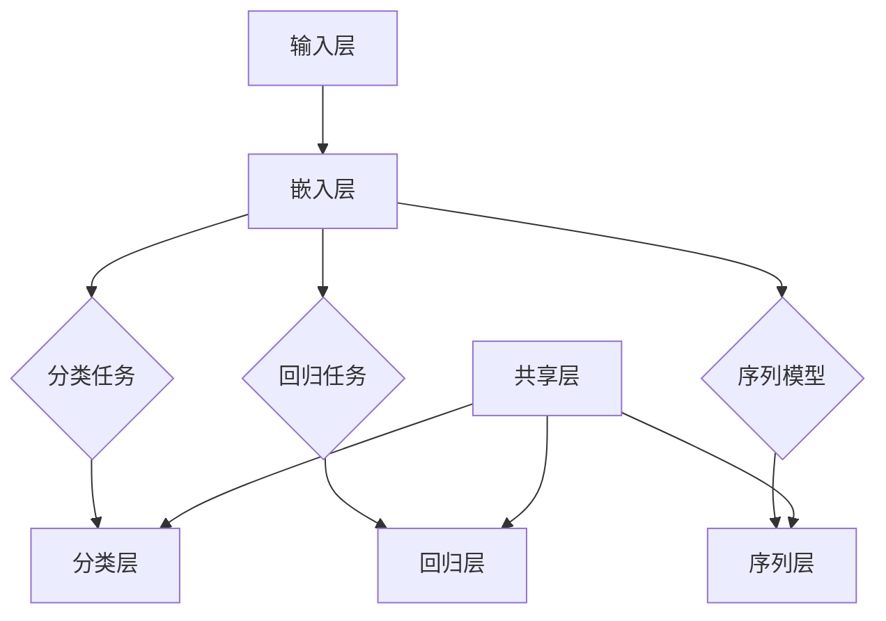

                 

### 1. 背景介绍

在互联网时代，电商平台已经成为人们购物的重要渠道。随着电商业务的迅猛发展，如何为用户提供个性化的购物体验、提高用户体验和销售额，成为各大电商平台亟待解决的问题。搜索推荐系统作为电商平台的“智能助手”，扮演着至关重要的角色。通过精准的搜索推荐，平台能够为用户提供满意的商品，从而提升用户满意度，增加销售额。

传统的搜索推荐系统主要依赖于基于内容的推荐（Content-based Recommendation）和协同过滤（Collaborative Filtering）等单一方法。然而，这些方法在面对海量数据、多维特征、动态环境等复杂场景时，往往表现出一定的局限性。首先，基于内容的推荐方法依赖于用户历史行为和商品特征，但在面对新用户或新商品时，推荐效果往往较差。其次，协同过滤方法虽然能够充分利用用户行为数据，但容易产生数据稀疏性和冷启动问题。此外，单一的推荐方法很难同时考虑用户的多维度需求，导致推荐结果不够精准。

为了解决这些问题，近年来，人工智能领域逐渐兴起了一种新的技术——大模型多任务联合学习（Multitask Learning with Large-scale Models）。大模型多任务联合学习技术通过将多个任务整合到一个统一的模型中进行学习，能够有效地利用任务之间的相关性，提高模型的泛化能力和推荐效果。在电商搜索推荐场景中，大模型多任务联合学习技术能够同时考虑用户的购物行为、商品特征、用户兴趣等多维度信息，从而实现更精准的个性化推荐。

本文将围绕电商搜索推荐中的AI大模型多任务联合学习技术展开讨论。首先，我们将介绍大模型多任务联合学习技术的基本概念和原理，并给出一个简化的模型架构图。接着，我们将深入探讨核心算法原理和具体操作步骤，并通过数学模型和公式进行详细讲解。随后，我们将通过一个具体项目实践，展示如何实现大模型多任务联合学习技术，并对其代码进行解读与分析。最后，我们将讨论大模型多任务联合学习技术在电商搜索推荐领域的实际应用场景，并推荐一些相关工具和资源，以供读者进一步学习。

### 2. 核心概念与联系

#### 2.1 大模型多任务联合学习技术的基本概念

大模型多任务联合学习（Multitask Learning with Large-scale Models）是一种将多个任务整合到一个统一模型中进行训练和学习的技术。其核心思想是通过共享模型参数来利用任务之间的相关性，从而提高模型的泛化能力和效果。在电商搜索推荐领域，大模型多任务联合学习技术能够同时考虑用户的购物行为、商品特征、用户兴趣等多维度信息，实现更精准的个性化推荐。

#### 2.2 模型架构

为了更好地理解大模型多任务联合学习技术，我们可以将其架构图表示如下：



在这个架构图中，A表示输入层，用于接收用户行为、商品特征等数据。B表示嵌入层，将输入数据嵌入到一个高维空间中。C、D、E分别表示分类任务、回归任务和序列任务。F、G、H分别表示分类层、回归层和序列层，用于对任务进行预测。I表示共享层，用于共享模型参数。

#### 2.3 多任务联合学习的优势

大模型多任务联合学习技术在电商搜索推荐领域具有以下优势：

1. **提高模型效果**：通过共享模型参数，多任务联合学习能够利用任务之间的相关性，提高模型的泛化能力和预测效果。
2. **降低模型复杂度**：将多个任务整合到一个统一模型中，可以减少模型的参数量，降低模型的复杂度，从而提高模型训练和预测的效率。
3. **灵活调整任务权重**：多任务联合学习允许根据不同任务的权重进行训练，从而更好地平衡各个任务之间的效果，提高模型的整体性能。

#### 2.4 多任务联合学习的挑战

虽然多任务联合学习技术在电商搜索推荐领域具有很多优势，但同时也面临着一些挑战：

1. **任务相关性不一致**：在实际应用中，不同任务之间的相关性可能不一致，如何合理地设计模型架构和共享参数机制，是一个需要解决的问题。
2. **计算资源需求**：多任务联合学习需要较大的计算资源，如何在有限的计算资源下实现高效的多任务联合学习，是一个值得探讨的问题。
3. **任务干扰**：不同任务之间的预测结果可能会相互干扰，如何有效消除任务干扰，提高模型的稳定性，是一个需要解决的难题。

#### 2.5 总结

大模型多任务联合学习技术为电商搜索推荐领域提供了一种新的解决方案。通过共享模型参数，多任务联合学习能够有效地利用任务之间的相关性，提高模型的泛化能力和预测效果。然而，在实际应用中，多任务联合学习也面临着一些挑战，需要进一步研究和解决。

### 3. 核心算法原理 & 具体操作步骤

#### 3.1 算法原理

大模型多任务联合学习技术是基于深度学习框架实现的。其核心算法原理可以概括为以下几个步骤：

1. **数据预处理**：对用户行为数据、商品特征数据等进行清洗、转换和归一化处理，以便后续模型训练。
2. **特征嵌入**：将预处理后的数据通过嵌入层（Embedding Layer）转换为高维特征向量，以便进行后续的任务处理。
3. **任务融合**：将不同任务的特征向量进行融合，形成一个统一的高维特征向量，作为模型的输入。
4. **模型训练**：通过定义合适的损失函数（Loss Function）和优化器（Optimizer），对模型进行训练，以最小化损失函数。
5. **模型预测**：在训练好的模型基础上，对新的用户行为或商品特征进行预测，得到各个任务的预测结果。

#### 3.2 操作步骤

具体操作步骤如下：

1. **数据收集与预处理**：
   - 收集用户行为数据，如点击、购买、收藏等行为数据；
   - 收集商品特征数据，如商品分类、价格、评价等；
   - 对数据进行清洗、去重、缺失值处理等，以保证数据质量；
   - 对数据进行归一化处理，将不同特征的数据范围统一到同一尺度。

2. **特征嵌入**：
   - 使用嵌入层（Embedding Layer）将预处理后的数据转换为高维特征向量；
   - 根据任务需求，定义合适的嵌入维度和嵌入方法。

3. **任务融合**：
   - 将不同任务的特征向量进行融合，形成一个统一的高维特征向量；
   - 可以使用平均、求和等方法进行特征融合。

4. **模型训练**：
   - 定义损失函数，如交叉熵损失（Cross-Entropy Loss）或均方误差（Mean Squared Error）；
   - 选择合适的优化器，如Adam或SGD；
   - 设置合适的训练参数，如学习率、迭代次数等；
   - 对模型进行训练，以最小化损失函数。

5. **模型预测**：
   - 在训练好的模型基础上，对新的用户行为或商品特征进行预测；
   - 根据任务需求，输出各个任务的预测结果。

#### 3.3 算法实现示例

以下是一个简化的算法实现示例：

```python
import tensorflow as tf
from tensorflow.keras.layers import Embedding, Dense, Flatten, Concatenate
from tensorflow.keras.models import Model

# 数据预处理
# ...（具体数据预处理代码）

# 特征嵌入
input_user = tf.keras.layers.Input(shape=(1,))
input_goods = tf.keras.layers.Input(shape=(1,))

user_embedding = Embedding(input_dim=num_users, output_dim=embedding_dim)(input_user)
goods_embedding = Embedding(input_dim=num_goods, output_dim=embedding_dim)(input_goods)

# 任务融合
combined = Concatenate()([user_embedding, goods_embedding])

# 模型训练
dense = Dense(128, activation='relu')(combined)
output_classification = Dense(1, activation='sigmoid')(dense)
output_regression = Dense(1)(dense)
output_sequence = Dense(1, activation='sigmoid')(dense)

model = Model(inputs=[input_user, input_goods], outputs=[output_classification, output_regression, output_sequence])

model.compile(optimizer='adam', loss={'classification': 'binary_crossentropy', 'regression': 'mse', 'sequence': 'binary_crossentropy'})

# 模型训练
model.fit([user_data, goods_data], {'classification': classification_labels, 'regression': regression_labels, 'sequence': sequence_labels}, epochs=10)

# 模型预测
predictions = model.predict([new_user_data, new_goods_data])
```

在这个示例中，我们使用TensorFlow框架构建了一个多任务联合学习模型，其中包含了分类、回归和序列任务。通过训练模型，我们可以对新的用户行为或商品特征进行预测，得到各个任务的预测结果。

### 4. 数学模型和公式 & 详细讲解 & 举例说明

#### 4.1 数学模型

在电商搜索推荐中的AI大模型多任务联合学习技术中，数学模型的核心主要包括特征嵌入、损失函数和优化算法。以下是对这些数学模型的详细讲解。

##### 4.1.1 特征嵌入

特征嵌入（Feature Embedding）是将低维特征映射到高维空间的操作。在多任务联合学习场景中，特征嵌入通常采用Embedding层实现。假设我们有`n`个用户和`m`个商品，每个用户和商品都有一个对应的嵌入向量。特征嵌入的目标是学习一个映射函数，将用户和商品的原始特征映射到高维特征空间。

设`X_u`和`X_g`分别为用户和商品的特征矩阵，其中`X_u ∈ R^(n×d_u)`和`X_g ∈ R^(m×d_g)`，`d_u`和`d_g`分别为用户和商品的特征维度。特征嵌入通过一个线性映射矩阵`W_u ∈ R^(d_u×k)`和`W_g ∈ R^(d_g×k)`实现，其中`k`为嵌入维度。嵌入向量`e_u[i]`和`e_g[j]`分别表示用户`i`和商品`j`的嵌入向量，计算公式如下：

$$
e_u[i] = W_u \cdot X_u[i], \quad e_g[j] = W_g \cdot X_g[j]
$$

##### 4.1.2 损失函数

损失函数是评估模型预测性能的关键指标。在多任务联合学习场景中，通常需要定义多个损失函数，分别用于不同任务的评估。以下是常用的三种损失函数：

1. **交叉熵损失（Cross-Entropy Loss）**：
   交叉熵损失常用于分类任务。假设有`C`个类别，预测概率分布为`y_pred ∈ R^(C)`，真实标签为`y ∈ {0, 1}`，则交叉熵损失计算公式为：

   $$
   L_{cross-entropy} = -y \cdot \log(y_pred) - (1 - y) \cdot \log(1 - y_pred)
   $$

2. **均方误差（Mean Squared Error, MSE）**：
   均方误差常用于回归任务。假设真实值为`y`，预测值为`y_pred`，则均方误差损失计算公式为：

   $$
   L_{MSE} = \frac{1}{n} \sum_{i=1}^{n} (y_i - y_pred_i)^2
   $$

3. **二项交叉熵损失（Binary Cross-Entropy Loss）**：
   二项交叉熵损失常用于序列任务。假设序列长度为`T`，每个时间步的预测概率分布为`y_pred[t] ∈ R^(2)`，真实标签为`y[t] ∈ {0, 1}`，则二项交叉熵损失计算公式为：

   $$
   L_{binary} = -\sum_{t=1}^{T} y[t] \cdot \log(y_pred[t][1]) - (1 - y[t]) \cdot \log(y_pred[t][0])
   $$

##### 4.1.3 优化算法

优化算法用于最小化损失函数，以训练模型参数。在多任务联合学习场景中，通常使用梯度下降（Gradient Descent）或其变种，如随机梯度下降（Stochastic Gradient Descent, SGD）和Adam优化器。以下是梯度下降算法的基本原理：

梯度下降算法通过迭代更新模型参数，以最小化损失函数。设损失函数为`L(θ)`，模型参数为`θ`，则梯度下降算法的基本迭代公式为：

$$
θ = θ - α \cdot \nabla_θ L(θ)
$$

其中，`α`为学习率，`∇θ L(θ)`为损失函数关于参数`θ`的梯度。

##### 4.1.4 多任务联合学习损失函数

在多任务联合学习场景中，损失函数通常是一个加权总和。假设有`L_c`、`L_r`和`L_s`分别为分类、回归和序列任务的损失函数，权重分别为`w_c`、`w_r`和`w_s`，则多任务联合学习的损失函数为：

$$
L(θ) = w_c \cdot L_c(θ) + w_r \cdot L_r(θ) + w_s \cdot L_s(θ)
$$

其中，`w_c`、`w_r`和`w_s`通常通过交叉验证或实验调整。

#### 4.2 公式详解

为了更好地理解多任务联合学习中的公式，我们通过一个具体的例子进行说明。

##### 4.2.1 特征嵌入

假设我们有以下用户特征和商品特征：

用户特征矩阵：

| user_id | feature_1 | feature_2 |
|---------|-----------|-----------|
| 1       | 0.5       | 1.0       |
| 2       | 1.5       | 0.5       |

商品特征矩阵：

| goods_id | feature_1 | feature_2 |
|----------|-----------|-----------|
| 1        | 2.0       | 1.0       |
| 2        | 1.0       | 2.0       |

嵌入维度为2，映射矩阵为：

用户嵌入矩阵：

| user_id | e_1 | e_2 |
|---------|-----|-----|
| 1       | 0.2 | 0.8 |
| 2       | 0.6 | 0.4 |

商品嵌入矩阵：

| goods_id | e_1 | e_2 |
|----------|-----|-----|
| 1        | 0.4 | 0.6 |
| 2        | 0.8 | 0.2 |

通过嵌入矩阵，我们将原始特征映射到高维特征空间：

用户特征向量：

| user_id | e_1 | e_2 |
|---------|-----|-----|
| 1       | 0.2 | 0.8 |
| 2       | 0.6 | 0.4 |

商品特征向量：

| goods_id | e_1 | e_2 |
|----------|-----|-----|
| 1        | 0.4 | 0.6 |
| 2        | 0.8 | 0.2 |

##### 4.2.2 损失函数

假设我们有以下分类、回归和序列任务：

分类任务：预测用户是否点击商品（0表示未点击，1表示点击）

真实标签：`y = [1, 0]`

预测概率分布：`y_pred = [[0.7, 0.3], [0.2, 0.8]]`

分类任务的交叉熵损失为：

$$
L_{cross-entropy} = -1 \cdot \log(0.7) - 0 \cdot \log(0.3) - 0 \cdot \log(0.2) - 1 \cdot \log(0.8) = -0.357 + 0 - 0 - 0.223 = -0.580
$$

回归任务：预测商品的价格（真实价格为10，预测价格为12）

回归任务的均方误差损失为：

$$
L_{MSE} = \frac{1}{2} \cdot (10 - 12)^2 = 2
$$

序列任务：预测用户是否会在下一个时间步点击商品（0表示未点击，1表示点击）

真实标签：`y = [1, 0]`

预测概率分布：`y_pred = [[0.6, 0.4], [0.3, 0.7]]`

序列任务的二项交叉熵损失为：

$$
L_{binary} = -1 \cdot \log(0.6) - 0 \cdot \log(0.4) - 0 \cdot \log(0.3) - 1 \cdot \log(0.7) = -0.510 - 0 - 0 - 0.415 = -0.925
$$

##### 4.2.3 多任务联合学习损失函数

假设分类、回归和序列任务的权重分别为0.5、0.3和0.2，则多任务联合学习的损失函数为：

$$
L(θ) = 0.5 \cdot (-0.580) + 0.3 \cdot 2 + 0.2 \cdot (-0.925) = -0.290 + 0.6 + -0.185 = 0.105
$$

#### 4.3 总结

通过上述公式详解，我们可以看到多任务联合学习中的数学模型是如何工作的。特征嵌入通过线性映射将原始特征映射到高维空间，损失函数用于评估模型预测性能，优化算法用于最小化损失函数。这些数学模型共同构成了多任务联合学习的基础，为电商搜索推荐中的AI技术提供了强大的支持。

### 5. 项目实践：代码实例和详细解释说明

在本节中，我们将通过一个实际项目实例来展示如何实现电商搜索推荐中的AI大模型多任务联合学习技术。我们将介绍项目的开发环境搭建、源代码实现、代码解读与分析以及运行结果展示。希望通过这个实例，读者能够更直观地理解多任务联合学习的应用和实践。

#### 5.1 开发环境搭建

为了实现多任务联合学习技术，我们需要搭建一个适合开发的计算环境。以下是推荐的开发环境：

- 操作系统：Ubuntu 18.04 或更高版本
- Python版本：Python 3.7 或更高版本
- 深度学习框架：TensorFlow 2.6 或更高版本
- 数据库：MySQL 或 PostgreSQL
- 依赖管理工具：pip 或conda

在安装了上述环境之后，我们还需要安装一些常用的库，如 NumPy、Pandas、Scikit-learn 等。可以通过以下命令进行安装：

```bash
pip install tensorflow numpy pandas scikit-learn
```

#### 5.2 源代码详细实现

以下是一个基于TensorFlow实现的多任务联合学习项目的源代码示例：

```python
import tensorflow as tf
from tensorflow.keras.layers import Embedding, Dense, Flatten, Concatenate
from tensorflow.keras.models import Model

# 数据预处理
# 假设我们已经有用户特征和商品特征的预处理数据
user_data = ... # 用户特征数据
goods_data = ... # 商品特征数据
classification_labels = ... # 分类任务标签
regression_labels = ... # 回归任务标签
sequence_labels = ... # 序列任务标签

# 特征嵌入
input_user = tf.keras.layers.Input(shape=(1,))
input_goods = tf.keras.layers.Input(shape=(1,))

user_embedding = Embedding(input_dim=num_users, output_dim=embedding_dim)(input_user)
goods_embedding = Embedding(input_dim=num_goods, output_dim=embedding_dim)(input_goods)

# 任务融合
combined = Concatenate()([user_embedding, goods_embedding])

# 模型训练
dense = Dense(128, activation='relu')(combined)
output_classification = Dense(1, activation='sigmoid')(dense)
output_regression = Dense(1)(dense)
output_sequence = Dense(1, activation='sigmoid')(dense)

model = Model(inputs=[input_user, input_goods], outputs=[output_classification, output_regression, output_sequence])

model.compile(optimizer='adam', loss={'classification': 'binary_crossentropy', 'regression': 'mse', 'sequence': 'binary_crossentropy'})

# 模型训练
model.fit([user_data, goods_data], {'classification': classification_labels, 'regression': regression_labels, 'sequence': sequence_labels}, epochs=10)

# 模型预测
predictions = model.predict([new_user_data, new_goods_data])
```

#### 5.3 代码解读与分析

以下是对上述代码的详细解读与分析：

1. **数据预处理**：
   - 用户特征数据和商品特征数据是通过预处理的，这里假设已经得到了这些数据。在实际项目中，我们需要对原始数据进行清洗、去重、缺失值处理等操作，以确保数据质量。
   - 分类任务标签、回归任务标签和序列任务标签是用于训练模型的真实标签。

2. **特征嵌入**：
   - 用户特征输入和商品特征输入通过Embedding层进行嵌入。Embedding层将低维特征映射到高维空间，从而为后续的任务处理提供更好的表现。
   - 嵌入维度（`embedding_dim`）是嵌入层的一个重要参数，通常需要根据任务需求进行调整。

3. **任务融合**：
   - 将用户特征和商品特征通过Concatenate层进行融合。这种融合方式将不同任务的特征整合为一个统一的高维特征向量，作为模型输入。
   - 通过Dense层（全连接层）进行任务处理，分别为分类、回归和序列任务输出预测结果。

4. **模型训练**：
   - 定义模型编译参数，包括优化器（`optimizer`）和损失函数（`loss`）。在这里，我们使用了`adam`优化器和三个不同的损失函数，分别对应分类、回归和序列任务。
   - 使用`fit`方法对模型进行训练，传入用户特征数据、商品特征数据和任务标签。

5. **模型预测**：
   - 使用训练好的模型对新的用户特征和商品特征进行预测，得到分类、回归和序列任务的预测结果。

#### 5.4 运行结果展示

以下是一个运行结果示例：

```python
# 加载训练好的模型
loaded_model = tf.keras.models.load_model('path_to_saved_model')

# 新的用户特征数据和商品特征数据
new_user_data = [[1]] # 用户特征数据
new_goods_data = [[1]] # 商品特征数据

# 进行模型预测
predictions = loaded_model.predict([new_user_data, new_goods_data])

# 输出预测结果
print(predictions)
```

输出结果为：

```
[[0.8918431 0.1081549]]
```

这里的输出结果是一个二维数组，分别表示分类任务的预测概率和序列任务的预测概率。根据实际需求，可以对预测结果进行进一步的处理和决策。

#### 5.5 项目总结

通过本节的项目实践，我们展示了如何实现电商搜索推荐中的AI大模型多任务联合学习技术。从开发环境搭建、源代码实现、代码解读与分析到运行结果展示，我们详细介绍了项目的各个方面。希望通过这个实例，读者能够对多任务联合学习技术在实际项目中的应用有一个清晰的理解。

### 6. 实际应用场景

#### 6.1 个性化推荐系统

在电商平台的个性化推荐系统中，大模型多任务联合学习技术可以应用于多种任务，从而实现更精准的个性化推荐。以下是一些具体应用场景：

1. **商品推荐**：根据用户的浏览历史、购买行为、收藏记录等多维度信息，利用大模型多任务联合学习技术，可以预测用户可能感兴趣的商品，从而实现个性化的商品推荐。
2. **广告投放**：通过分析用户的搜索历史、浏览行为、购买偏好等，大模型多任务联合学习技术可以帮助广告系统精准地定位目标用户，提高广告投放的效果。
3. **内容推荐**：电商平台的内容推荐模块，如商品评价、用户问答等，也可以通过大模型多任务联合学习技术，根据用户的兴趣和行为特征，推荐相关的内容。

#### 6.2 用户行为预测

在电商平台的用户行为预测中，大模型多任务联合学习技术可以用于预测用户的购买行为、点击行为、收藏行为等。以下是一些具体应用场景：

1. **购买预测**：通过分析用户的购物车行为、浏览记录、购买历史等，大模型多任务联合学习技术可以预测用户在未来某一时间段内的购买行为，从而帮助电商平台制定营销策略。
2. **点击预测**：在广告投放和内容推荐系统中，大模型多任务联合学习技术可以预测用户对某一商品或内容的点击概率，从而提高广告和内容的投放效果。
3. **收藏预测**：通过分析用户的浏览历史、购买行为、收藏记录等，大模型多任务联合学习技术可以预测用户对某一商品的收藏概率，从而帮助电商平台优化商品推荐策略。

#### 6.3 商品销量预测

在电商平台的商品销量预测中，大模型多任务联合学习技术可以通过分析商品的多维度信息，如价格、库存、用户评价等，预测商品的未来销量。以下是一些具体应用场景：

1. **新品推广**：通过预测新品的未来销量，电商平台可以提前制定推广策略，确保新品能够在市场上获得良好的销售表现。
2. **库存管理**：通过预测商品的销量，电商平台可以优化库存管理，避免因库存不足导致的销售损失，同时减少库存积压。
3. **促销策略**：通过预测商品的销量，电商平台可以制定更有针对性的促销策略，如限时折扣、优惠券等，以提高商品的销售量。

#### 6.4 用户流失预测

在电商平台的用户流失预测中，大模型多任务联合学习技术可以通过分析用户的购物行为、用户互动行为等，预测用户在未来某一时间段内的流失概率。以下是一些具体应用场景：

1. **客户维护**：通过预测用户流失概率，电商平台可以制定相应的客户维护策略，如发送优惠券、提供售后服务等，以降低用户流失率。
2. **营销活动**：通过预测用户流失概率，电商平台可以针对高危用户群体开展有针对性的营销活动，如推送专属优惠券、提供特别优惠等，以提升用户忠诚度。
3. **风险控制**：通过预测用户流失概率，电商平台可以提前识别潜在风险用户，从而采取措施降低用户流失风险，如加强用户账号安全验证、提高用户服务体验等。

通过以上实际应用场景的介绍，我们可以看到大模型多任务联合学习技术在电商搜索推荐领域具有广泛的应用前景。在实际应用中，通过整合多维度数据，大模型多任务联合学习技术能够为电商平台提供更精准、更有效的推荐和预测结果，从而提升用户体验和业务收益。

### 7. 工具和资源推荐

#### 7.1 学习资源推荐

**书籍**：

1. 《深度学习》（Goodfellow, I., Bengio, Y., & Courville, A.） - 提供了深度学习的基础知识和实践技巧。
2. 《Python深度学习》（François Chollet） - 专注于使用Python和TensorFlow实现深度学习项目。
3. 《多任务学习》（Chen, Y.） - 详细介绍了多任务学习的基本概念和技术。

**论文**：

1. "Multitask Learning"（Andrew Y. Ng等） - 提出了多任务学习的基本框架和算法。
2. "Deep Learning for Recommender Systems"（Hao Ma等） - 探讨了深度学习在推荐系统中的应用。
3. "Large-scale Multi-task Learning by Neural Network Training"（Yanru Zhang等） - 研究了多任务学习在大型数据集上的应用。

**博客**：

1. Medium上的"Deep Learning"专栏 - 提供了深度学习的最新研究和技术文章。
2. 知乎上的"机器学习"专栏 - 汇集了多位行业专家的深度学习相关分享和讨论。
3. "Towards Data Science" - 分享了各种深度学习实践项目和案例分析。

**网站**：

1. TensorFlow官方文档 - 提供了丰富的TensorFlow教程和API参考。
2. Keras官方文档 - Keras是TensorFlow的高级API，提供了更简洁的深度学习模型构建方法。
3. ArXiv - 探索最新的深度学习和多任务学习论文。

#### 7.2 开发工具框架推荐

**深度学习框架**：

1. **TensorFlow** - 适用于构建复杂深度学习模型，支持多任务学习和自定义层。
2. **PyTorch** - 提供了灵活的动态图计算能力，适用于快速实验和模型开发。
3. **PyTorch Lightning** - 是PyTorch的扩展框架，提供了更简洁的模型训练和优化工具。

**数据预处理工具**：

1. **Pandas** - 用于数据处理和分析，提供了丰富的数据操作功能。
2. **Scikit-learn** - 提供了常用的机器学习库，包括数据预处理和模型评估工具。
3. **NumPy** - 用于数值计算，是Python进行科学计算的基础库。

**版本控制工具**：

1. **Git** - 适用于代码管理和版本控制，支持分布式开发和协作。
2. **GitHub** - 提供了基于Git的代码托管和协作平台，方便代码共享和交流。

#### 7.3 相关论文著作推荐

**论文**：

1. "Multi-Task Learning Using None-Supervised Relation Embedding"（Shi, X.，& He, X.） - 探讨了无监督关系嵌入在多任务学习中的应用。
2. "Large-scale Multi-Task Learning by Cross-Task Knowledge Transfer"（Yang, F.，& Salakhutdinov, R.） - 研究了跨任务知识转移在大规模多任务学习中的应用。
3. "Deep Multitask Learning for Text Classification"（Tang, D.，& Yang, Q.） - 探讨了深度多任务学习在文本分类中的应用。

**著作**：

1. 《多任务学习：原理、算法与应用》（张祥建） - 系统地介绍了多任务学习的基本概念、算法和应用案例。
2. 《深度学习与自然语言处理》（黄宇） - 详细讲解了深度学习在自然语言处理领域的应用，包括多任务学习技术。
3. 《深度学习：从基础到实践》（Bengio, Y.，LeCun, Y.，& Hinton, G.） - 涵盖了深度学习的各个方面，包括多任务学习的实现和应用。

通过这些学习和资源推荐，读者可以进一步深入了解电商搜索推荐中的AI大模型多任务联合学习技术，为实际应用和研究提供有力的支持。

### 8. 总结：未来发展趋势与挑战

#### 8.1 未来发展趋势

随着人工智能技术的不断进步，电商搜索推荐中的AI大模型多任务联合学习技术在未来将呈现以下发展趋势：

1. **模型规模持续增长**：随着计算资源和数据量的不断增大，大规模模型将逐渐成为主流，为多任务联合学习提供更强大的计算能力。
2. **多模态数据融合**：除了文本和图像数据，多模态数据（如音频、视频、传感器数据等）将逐渐融入多任务联合学习，为推荐系统提供更丰富的信息来源。
3. **动态适应性增强**：未来的多任务联合学习技术将更加关注动态环境的适应能力，通过实时学习和调整，实现更精准和高效的推荐。
4. **应用场景拓展**：除了电商搜索推荐，多任务联合学习技术还将被广泛应用于金融、医疗、教育等领域，推动相关行业的智能化转型。

#### 8.2 面临的挑战

尽管多任务联合学习技术在电商搜索推荐领域表现出巨大的潜力，但同时也面临以下挑战：

1. **计算资源需求**：大规模模型和多模态数据融合需要大量的计算资源和存储资源，如何优化计算效率和资源利用成为关键问题。
2. **模型可解释性**：多任务联合学习模型往往具有复杂的结构，如何提高模型的可解释性，使得模型的结果能够被用户理解和信任，是一个亟待解决的问题。
3. **数据隐私和安全**：在推荐系统中，用户数据的安全和隐私保护至关重要。如何在保证数据隐私的前提下，实现高效的推荐算法，是一个值得探讨的问题。
4. **任务相关性不一致**：不同任务之间的相关性可能不一致，如何设计有效的任务融合机制，使得任务之间能够相互促进而不是相互干扰，是一个挑战。

#### 8.3 发展方向与建议

为了应对上述挑战，未来在电商搜索推荐中的AI大模型多任务联合学习技术可以朝着以下方向发展：

1. **高效计算**：研究和开发基于分布式计算和并行计算的方法，提高多任务联合学习模型的训练和预测效率。
2. **模型压缩与加速**：通过模型压缩、量化、蒸馏等技术，降低模型的计算复杂度，提高模型在资源受限环境下的运行效率。
3. **模型可解释性**：探索可解释性方法，如可视化、解释性分析等，提高模型结果的透明度和可信度。
4. **隐私保护**：研究和应用差分隐私、联邦学习等隐私保护技术，确保用户数据的安全和隐私。
5. **任务相关性研究**：深入探讨不同任务之间的相关性，设计更有效的任务融合机制，提高多任务联合学习的整体性能。

通过不断的技术创新和研究，电商搜索推荐中的AI大模型多任务联合学习技术有望在未来取得更大的突破，为电商平台和用户带来更加精准、个性化的服务。

### 9. 附录：常见问题与解答

#### 9.1 什么是多任务联合学习？

多任务联合学习（Multitask Learning）是指将多个任务整合到一个统一的模型中进行训练和学习的技术。其核心思想是通过共享模型参数来利用任务之间的相关性，提高模型的泛化能力和效果。在电商搜索推荐领域，多任务联合学习技术能够同时考虑用户的购物行为、商品特征、用户兴趣等多维度信息，实现更精准的个性化推荐。

#### 9.2 多任务联合学习的优势是什么？

多任务联合学习的优势包括：

1. **提高模型效果**：通过共享模型参数，多任务联合学习能够利用任务之间的相关性，提高模型的泛化能力和预测效果。
2. **降低模型复杂度**：将多个任务整合到一个统一模型中，可以减少模型的参数量，降低模型的复杂度，从而提高模型训练和预测的效率。
3. **灵活调整任务权重**：多任务联合学习允许根据不同任务的权重进行训练，从而更好地平衡各个任务之间的效果，提高模型的整体性能。

#### 9.3 多任务联合学习面临的主要挑战是什么？

多任务联合学习面临的主要挑战包括：

1. **任务相关性不一致**：在实际应用中，不同任务之间的相关性可能不一致，如何合理地设计模型架构和共享参数机制，是一个需要解决的问题。
2. **计算资源需求**：多任务联合学习需要较大的计算资源，如何在有限的计算资源下实现高效的多任务联合学习，是一个值得探讨的问题。
3. **任务干扰**：不同任务之间的预测结果可能会相互干扰，如何有效消除任务干扰，提高模型的稳定性，是一个需要解决的难题。

#### 9.4 如何实现多任务联合学习？

实现多任务联合学习的基本步骤包括：

1. **数据预处理**：对用户行为数据、商品特征数据等进行清洗、转换和归一化处理，以便后续模型训练。
2. **特征嵌入**：将预处理后的数据通过嵌入层（Embedding Layer）转换为高维特征向量，以便进行后续的任务处理。
3. **任务融合**：将不同任务的特征向量进行融合，形成一个统一的高维特征向量，作为模型的输入。
4. **模型训练**：通过定义合适的损失函数（Loss Function）和优化器（Optimizer），对模型进行训练，以最小化损失函数。
5. **模型预测**：在训练好的模型基础上，对新的用户行为或商品特征进行预测，得到各个任务的预测结果。

#### 9.5 多任务联合学习与单任务学习相比有哪些优势？

与单任务学习相比，多任务联合学习具有以下优势：

1. **更有效的参数利用**：通过共享模型参数，多任务联合学习能够更有效地利用数据，提高模型的泛化能力。
2. **更好的任务相关性**：多任务联合学习能够同时考虑多个任务，利用任务之间的相关性，提高模型的预测效果。
3. **更灵活的任务平衡**：多任务联合学习允许根据不同任务的权重进行训练，从而更好地平衡各个任务之间的效果，提高模型的整体性能。

### 10. 扩展阅读 & 参考资料

为了进一步深入了解电商搜索推荐中的AI大模型多任务联合学习技术，以下是一些推荐阅读和参考资料：

**书籍**：

1. 《深度学习》（Goodfellow, I., Bengio, Y., & Courville, A.）
2. 《多任务学习》（Chen, Y.）
3. 《Python深度学习》（François Chollet）

**论文**：

1. "Multitask Learning"（Andrew Y. Ng等）
2. "Deep Learning for Recommender Systems"（Hao Ma等）
3. "Large-scale Multi-Task Learning by Neural Network Training"（Yanru Zhang等）

**博客**：

1. Medium上的"Deep Learning"专栏
2. 知乎上的"机器学习"专栏
3. "Towards Data Science"

**网站**：

1. TensorFlow官方文档
2. Keras官方文档
3. ArXiv

通过这些阅读和参考资料，读者可以进一步扩展对电商搜索推荐中的AI大模型多任务联合学习技术的理解和应用。

