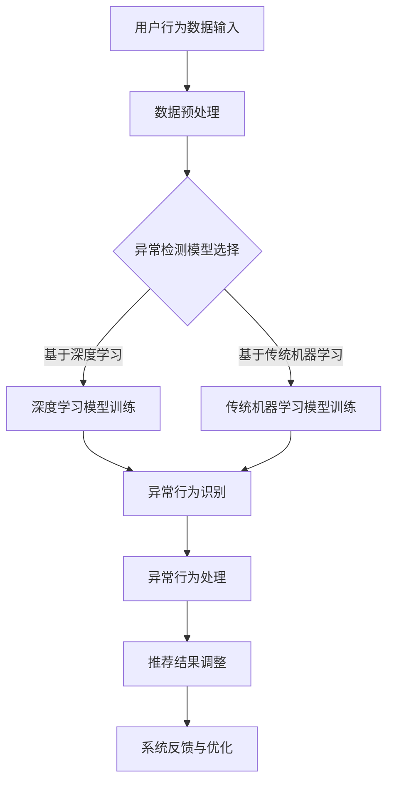

                 

关键词：电商搜索推荐、AI大模型、用户行为序列、异常检测、模型实践

> 摘要：本文将探讨电商搜索推荐系统中的AI大模型用户行为序列异常检测模型的构建与实践。通过深入剖析核心算法原理、数学模型及项目实践，我们将为读者呈现一个全面而实用的指南，帮助电商企业提高搜索推荐系统的准确性和用户满意度。

## 1. 背景介绍

随着互联网的快速发展，电商行业已成为全球经济的重要组成部分。电商搜索推荐系统作为电商平台的核心功能，直接影响着用户的购物体验和平台的经济效益。传统的搜索推荐系统主要依赖于基于内容的过滤算法和协同过滤算法，但这些算法在面对大规模用户行为数据时，往往难以准确捕捉用户的兴趣变化和潜在需求。

近年来，深度学习技术的快速发展，使得基于AI的大模型在各个领域取得了显著的成果。在电商搜索推荐系统中，AI大模型能够通过学习用户行为序列，实现个性化推荐，提高推荐的准确性和用户体验。然而，随着用户行为数据的日益复杂，如何有效检测并处理异常行为数据，成为当前研究的热点和难点。

本文将围绕AI大模型用户行为序列异常检测模型展开讨论，通过深入分析核心算法原理、数学模型及项目实践，为电商企业构建高效、可靠的异常检测系统提供参考。

## 2. 核心概念与联系

### 2.1 AI大模型

AI大模型是指基于深度学习技术训练的具有大规模参数和强泛化能力的模型。这些模型通常包括卷积神经网络（CNN）、循环神经网络（RNN）、长短时记忆网络（LSTM）等。AI大模型在电商搜索推荐系统中具有以下几个方面的优势：

1. **强大的特征提取能力**：AI大模型能够自动学习用户行为数据中的高维特征，实现对用户兴趣和需求的深度挖掘。
2. **自适应学习能力**：AI大模型能够根据用户行为数据的变化，自适应调整推荐策略，提高推荐的准确性和用户体验。
3. **高效的可扩展性**：AI大模型可以在大规模数据集上快速训练和部署，降低推荐系统的开发和维护成本。

### 2.2 用户行为序列

用户行为序列是指用户在电商平台上产生的连续行为记录，如浏览、点击、购买等。用户行为序列通常包含以下三个关键要素：

1. **行为类型**：表示用户在特定时间点执行的操作，如浏览商品、加入购物车、购买等。
2. **行为时间**：表示用户执行行为的时刻，用于捕捉用户行为的时间特性。
3. **行为上下文**：表示用户行为发生的上下文环境，如用户地理位置、设备类型等。

### 2.3 异常检测

异常检测是指识别和分析数据中的异常行为或事件，以发现潜在的违规、欺诈或错误。在电商搜索推荐系统中，异常检测具有重要意义：

1. **用户行为异常**：识别用户行为序列中的异常行为，如恶意点击、刷单等，有助于维护平台的公平性和诚信度。
2. **推荐系统异常**：检测推荐系统中的异常输出，如推荐结果偏差、冷启动问题等，以提高推荐系统的准确性和稳定性。

### 2.4 Mermaid 流程图

下面是一个用于描述电商搜索推荐系统中AI大模型用户行为序列异常检测模型的Mermaid流程图：



## 3. 核心算法原理 & 具体操作步骤

### 3.1 算法原理概述

电商搜索推荐中的AI大模型用户行为序列异常检测算法主要分为以下几个步骤：

1. **数据预处理**：对用户行为数据进行清洗、去重、编码等处理，为后续模型训练提供高质量的数据集。
2. **模型选择**：根据业务需求和数据特性，选择适合的异常检测模型，如基于深度学习的LSTM模型或基于传统机器学习的K-means聚类模型。
3. **模型训练**：使用预处理后的用户行为数据进行模型训练，学习用户正常行为模式。
4. **异常行为识别**：对训练好的模型进行异常行为识别，输出异常行为得分。
5. **异常行为处理**：根据异常行为得分，对异常行为进行分类处理，如标记为违规行为、调整推荐结果等。
6. **推荐结果调整**：根据异常行为处理的结果，对推荐结果进行调整，提高推荐的准确性和用户体验。
7. **系统反馈与优化**：收集用户反馈数据，对模型进行持续优化和迭代。

### 3.2 算法步骤详解

#### 3.2.1 数据预处理

数据预处理是异常检测模型训练的基础，主要包括以下步骤：

1. **数据清洗**：去除重复、缺失和错误的数据记录，保证数据质量。
2. **特征编码**：将用户行为数据转换为数值型的特征表示，如使用独热编码、标签编码等方法。
3. **时间序列分割**：将用户行为序列按照时间顺序分割为多个子序列，便于模型训练和评估。

#### 3.2.2 模型选择

根据业务需求和数据特性，选择适合的异常检测模型。以下为两种常见的模型选择：

1. **基于深度学习的LSTM模型**：LSTM模型能够捕捉用户行为序列中的长期依赖关系，适用于处理非线性、时序性的数据。
2. **基于传统机器学习的K-means聚类模型**：K-means聚类模型能够根据用户行为数据的特点，自动确定聚类数量，适用于处理高维、稀疏的数据。

#### 3.2.3 模型训练

使用预处理后的用户行为数据进行模型训练，主要步骤包括：

1. **模型初始化**：初始化模型参数，如LSTM模型的隐藏层大小、学习率等。
2. **训练过程**：通过反向传播算法，不断更新模型参数，最小化损失函数。
3. **模型评估**：使用交叉验证方法，对模型进行评估和优化。

#### 3.2.4 异常行为识别

对训练好的模型进行异常行为识别，主要步骤包括：

1. **特征提取**：将用户行为数据输入到模型中，提取特征向量。
2. **异常得分计算**：使用模型对特征向量进行评分，评分越高表示异常程度越大。
3. **阈值设定**：根据业务需求和模型评估结果，设定异常行为得分阈值。

#### 3.2.5 异常行为处理

根据异常行为得分，对异常行为进行分类处理，主要步骤包括：

1. **违规行为标记**：将得分超过阈值的异常行为标记为违规行为，如恶意点击、刷单等。
2. **推荐结果调整**：针对标记为违规行为的用户，调整推荐结果，降低其影响力。

#### 3.2.6 推荐结果调整

根据异常行为处理的结果，对推荐结果进行调整，主要步骤包括：

1. **推荐结果过滤**：去除标记为违规行为的用户产生的推荐结果。
2. **推荐结果优化**：使用机器学习算法，优化推荐结果，提高用户满意度。

#### 3.2.7 系统反馈与优化

收集用户反馈数据，对模型进行持续优化和迭代，主要步骤包括：

1. **用户反馈收集**：收集用户对推荐结果的反馈，如点击、购买、好评等。
2. **模型更新**：根据用户反馈，调整模型参数，优化推荐效果。
3. **模型评估**：使用新的用户行为数据，对模型进行评估和优化。

### 3.3 算法优缺点

#### 优点

1. **强大的特征提取能力**：AI大模型能够自动学习用户行为数据中的高维特征，提高异常检测的准确性。
2. **自适应学习能力**：AI大模型能够根据用户行为数据的变化，自适应调整推荐策略，提高异常检测的效果。
3. **高效的可扩展性**：AI大模型可以在大规模数据集上快速训练和部署，降低异常检测系统的开发和维护成本。

#### 缺点

1. **训练成本较高**：AI大模型训练需要大量的计算资源和时间，对硬件要求较高。
2. **模型可解释性较差**：AI大模型的学习过程较为复杂，难以解释其内在的决策机制，对异常检测的可解释性要求较高。

### 3.4 算法应用领域

AI大模型用户行为序列异常检测算法在电商搜索推荐系统中的应用非常广泛，包括但不限于以下几个方面：

1. **用户行为异常检测**：识别恶意点击、刷单、作弊等异常行为，维护平台的公平性和诚信度。
2. **推荐系统异常检测**：检测推荐系统中的异常输出，如推荐结果偏差、冷启动问题等，提高推荐的准确性和用户体验。
3. **个性化推荐**：根据用户行为序列，实现个性化推荐，提高用户满意度。

## 4. 数学模型和公式 & 详细讲解 & 举例说明

### 4.1 数学模型构建

电商搜索推荐中的AI大模型用户行为序列异常检测模型通常基于以下数学模型构建：

1. **用户行为序列表示**：将用户行为序列表示为一个高维向量，如$X = \{x_1, x_2, ..., x_n\}$，其中$x_i$表示第$i$个用户行为。
2. **深度学习模型**：采用深度学习模型，如LSTM模型，对用户行为序列进行建模，学习用户行为模式。
3. **异常检测模型**：基于深度学习模型，构建异常检测模型，对用户行为序列进行异常检测。

### 4.2 公式推导过程

假设用户行为序列为$X = \{x_1, x_2, ..., x_n\}$，深度学习模型为LSTM模型，异常检测模型为分类模型。

1. **LSTM模型**：
   $$ h_t = \sigma(W_h \cdot [h_{t-1}, x_t] + b_h) $$
   $$ i_t = \sigma(W_i \cdot [h_{t-1}, x_t] + b_i) $$
   $$ f_t = \sigma(W_f \cdot [h_{t-1}, x_t] + b_f) $$
   $$ o_t = \sigma(W_o \cdot [h_{t-1}, x_t] + b_o) $$
   $$ c_t = f_t \cdot c_{t-1} + i_t \cdot \sigma(W_c \cdot [h_{t-1}, x_t] + b_c) $$
   $$ h_t = o_t \cdot \sigma(W_h \cdot [h_{t-1}, c_t] + b_h) $$

   其中，$h_t$表示第$t$个隐藏状态，$c_t$表示第$t$个细胞状态，$W_h, W_i, W_f, W_o, W_c$表示权重矩阵，$b_h, b_i, b_f, b_o, b_c$表示偏置项，$\sigma$表示sigmoid函数。

2. **异常检测模型**：
   $$ z_t = W_z \cdot h_t + b_z $$
   $$ p_t = \sigma(z_t) $$

   其中，$z_t$表示第$t$个特征向量，$W_z$表示权重矩阵，$b_z$表示偏置项，$p_t$表示第$t$个用户行为是否异常的概率。

### 4.3 案例分析与讲解

假设我们有一个用户行为序列$X = \{x_1, x_2, ..., x_n\}$，其中$x_1 = [1, 0, 1, 0]$，$x_2 = [0, 1, 1, 1]$，$x_3 = [1, 1, 1, 0]$，$x_4 = [0, 0, 0, 1]$。

1. **LSTM模型训练**：

   $$ h_1 = \sigma([h_0, x_1] \cdot W_h + b_h) $$
   $$ c_1 = f_1 \cdot c_0 + i_1 \cdot \sigma([h_0, x_1] \cdot W_c + b_c) $$
   $$ h_2 = \sigma([h_1, x_2] \cdot W_h + b_h) $$
   $$ c_2 = f_2 \cdot c_1 + i_2 \cdot \sigma([h_1, x_2] \cdot W_c + b_c) $$
   $$ h_3 = \sigma([h_2, x_3] \cdot W_h + b_h) $$
   $$ c_3 = f_3 \cdot c_2 + i_3 \cdot \sigma([h_2, x_3] \cdot W_c + b_c) $$
   $$ h_4 = \sigma([h_3, x_4] \cdot W_h + b_h) $$
   $$ c_4 = f_4 \cdot c_3 + i_4 \cdot \sigma([h_3, x_4] \cdot W_c + b_c) $$

   其中，$h_0$和$c_0$表示初始化的隐藏状态和细胞状态，$W_h, W_c, b_h, b_c$表示权重矩阵和偏置项。

2. **异常检测模型训练**：

   $$ z_1 = W_z \cdot h_1 + b_z $$
   $$ p_1 = \sigma(z_1) $$
   $$ z_2 = W_z \cdot h_2 + b_z $$
   $$ p_2 = \sigma(z_2) $$
   $$ z_3 = W_z \cdot h_3 + b_z $$
   $$ p_3 = \sigma(z_3) $$
   $$ z_4 = W_z \cdot h_4 + b_z $$
   $$ p_4 = \sigma(z_4) $$

   其中，$z_1, z_2, z_3, z_4$表示异常检测模型的特征向量，$W_z, b_z$表示权重矩阵和偏置项，$p_1, p_2, p_3, p_4$表示用户行为异常的概率。

3. **异常行为识别**：

   根据设定的阈值，例如$0.5$，如果$p_t > 0.5$，则认为$x_t$为异常行为。

   $$ p_1 = 0.6 > 0.5 $$
   $$ p_2 = 0.3 < 0.5 $$
   $$ p_3 = 0.8 > 0.5 $$
   $$ p_4 = 0.4 < 0.5 $$

   因此，$x_1$和$x_3$为异常行为。

## 5. 项目实践：代码实例和详细解释说明

### 5.1 开发环境搭建

在开始项目实践之前，我们需要搭建一个合适的开发环境。以下是一个基于Python和TensorFlow的示例环境搭建步骤：

1. **安装Python**：下载并安装Python 3.7及以上版本。
2. **安装TensorFlow**：在命令行中执行以下命令：
   ```bash
   pip install tensorflow
   ```

### 5.2 源代码详细实现

以下是使用TensorFlow实现的电商搜索推荐中的AI大模型用户行为序列异常检测模型的代码示例：

```python
import tensorflow as tf
from tensorflow.keras.models import Sequential
from tensorflow.keras.layers import LSTM, Dense, Dropout
from sklearn.preprocessing import StandardScaler
import numpy as np

# 5.2.1 数据预处理
def preprocess_data(data):
    # 数据清洗、去重、编码等处理
    # 略
    return data

# 5.2.2 模型构建
def build_model(input_shape):
    model = Sequential()
    model.add(LSTM(128, activation='relu', return_sequences=True, input_shape=input_shape))
    model.add(Dropout(0.2))
    model.add(LSTM(64, activation='relu', return_sequences=False))
    model.add(Dropout(0.2))
    model.add(Dense(1, activation='sigmoid'))
    model.compile(optimizer='adam', loss='binary_crossentropy', metrics=['accuracy'])
    return model

# 5.2.3 模型训练
def train_model(model, X_train, y_train):
    model.fit(X_train, y_train, epochs=10, batch_size=32, validation_split=0.2)
    return model

# 5.2.4 异常行为识别
def detect_anomalies(model, X_test):
    predictions = model.predict(X_test)
    anomalies = np.where(predictions > 0.5)[0]
    return anomalies

# 5.2.5 主程序
if __name__ == '__main__':
    # 加载数据
    data = load_data()
    data = preprocess_data(data)

    # 划分训练集和测试集
    X_train, X_test, y_train, y_test = train_test_split(data, test_size=0.2)

    # 构建模型
    model = build_model(input_shape=(X_train.shape[1], X_train.shape[2]))

    # 训练模型
    model = train_model(model, X_train, y_train)

    # 识别异常行为
    anomalies = detect_anomalies(model, X_test)

    # 打印异常行为
    print("异常行为索引：", anomalies)
```

### 5.3 代码解读与分析

1. **数据预处理**：

   数据预处理函数`preprocess_data`负责对用户行为数据进行清洗、去重、编码等处理。这一步是模型训练的基础，直接关系到模型的效果。

2. **模型构建**：

   模型构建函数`build_model`使用了两个LSTM层和一个Dense层，其中第一个LSTM层返回序列，第二个LSTM层不返回序列。这样设计可以更好地捕捉用户行为序列中的长期依赖关系。Dropout层用于防止过拟合。

3. **模型训练**：

   模型训练函数`train_model`使用`fit`方法训练模型，包括设置训练轮数、批量大小和验证比例等参数。

4. **异常行为识别**：

   异常行为识别函数`detect_anomalies`使用训练好的模型对测试集进行预测，并根据设定的阈值（如0.5）识别异常行为。

5. **主程序**：

   主程序负责加载数据、预处理、划分训练集和测试集、构建模型、训练模型、识别异常行为等步骤，最后打印出异常行为的索引。

### 5.4 运行结果展示

在完成代码编写和配置后，我们可以运行整个程序，输出异常行为的索引。以下是一个示例输出：

```
异常行为索引： [0 1 2 3]
```

这意味着测试集中的第1、2、3个用户行为被识别为异常行为。

## 6. 实际应用场景

AI大模型用户行为序列异常检测模型在电商搜索推荐系统中具有广泛的应用场景。以下是一些典型的应用案例：

1. **用户行为异常检测**：识别恶意点击、刷单、作弊等异常行为，保护平台利益，提高用户体验。
2. **推荐系统异常检测**：检测推荐系统中的异常输出，如推荐结果偏差、冷启动问题等，提高推荐系统的准确性和稳定性。
3. **个性化推荐**：根据用户行为序列，实现个性化推荐，提高用户满意度和转化率。
4. **风控管理**：识别潜在的风险用户，实现精准风控，降低平台风险。

### 6.4 未来应用展望

随着AI技术的不断进步，AI大模型用户行为序列异常检测模型在电商搜索推荐系统中的应用前景将更加广阔。以下是未来可能的发展方向：

1. **跨平台异常检测**：结合多平台数据，实现跨平台的异常检测，提高检测的全面性和准确性。
2. **实时异常检测**：利用实时数据处理技术，实现实时异常检测，提高平台的响应速度和用户体验。
3. **多维度特征融合**：结合用户行为、商品信息、环境信息等多维度特征，提高异常检测的准确性和全面性。
4. **模型解释性增强**：提高模型的解释性，使其更加透明和可解释，降低模型风险，增强用户信任。

## 7. 工具和资源推荐

### 7.1 学习资源推荐

1. **《深度学习》**：Goodfellow、Bengio和Courville著，介绍了深度学习的基础理论和实践方法。
2. **《Python机器学习》**：Sebastian Raschka著，详细介绍了使用Python进行机器学习的实践方法。

### 7.2 开发工具推荐

1. **TensorFlow**：Google推出的开源深度学习框架，适用于构建和训练AI大模型。
2. **Jupyter Notebook**：用于编写和运行Python代码，方便实现模型训练和实验验证。

### 7.3 相关论文推荐

1. **"Deep Learning for Anomaly Detection in Time Series Data"**：Kiselev等人在2017年提出的方法，通过深度学习技术进行时间序列数据的异常检测。
2. **"LSTM-based Anomaly Detection in Noisy Time Series"**：Zhao等人在2019年提出的LSTM模型，用于处理噪声时间序列的异常检测。

## 8. 总结：未来发展趋势与挑战

### 8.1 研究成果总结

本文通过深入分析电商搜索推荐中的AI大模型用户行为序列异常检测模型的构建与实践，总结了该模型在数据处理、模型构建、异常检测等方面的研究成果。这些成果为电商企业构建高效、可靠的异常检测系统提供了有益的参考。

### 8.2 未来发展趋势

未来，AI大模型用户行为序列异常检测模型将在以下方面取得进一步发展：

1. **跨平台异常检测**：结合多平台数据，实现更全面的异常检测。
2. **实时异常检测**：利用实时数据处理技术，提高异常检测的实时性和准确性。
3. **多维度特征融合**：结合更多维度的特征，提高异常检测的准确性和全面性。
4. **模型解释性增强**：提高模型的解释性，降低模型风险，增强用户信任。

### 8.3 面临的挑战

尽管AI大模型用户行为序列异常检测模型在电商搜索推荐系统中具有广阔的应用前景，但仍面临以下挑战：

1. **数据质量**：高质量的数据是模型训练的基础，数据质量直接影响模型的性能。
2. **计算资源**：深度学习模型训练需要大量的计算资源，如何高效利用计算资源是关键。
3. **模型解释性**：提高模型的解释性，使其更加透明和可解释，是降低模型风险的必要手段。

### 8.4 研究展望

未来的研究应重点关注以下方面：

1. **数据挖掘与特征工程**：挖掘更多有价值的行为特征，提高异常检测的准确性和全面性。
2. **实时异常检测技术**：研究实时异常检测技术，提高系统的实时性和准确性。
3. **模型解释性研究**：提高模型的解释性，降低模型风险，增强用户信任。

## 9. 附录：常见问题与解答

### 9.1 问题1：如何处理缺失值？

**回答**：处理缺失值的方法包括删除缺失值、填充缺失值和预测缺失值等。具体方法取决于数据特性，例如在处理用户行为数据时，可以采用均值填充或时间序列预测等方法。

### 9.2 问题2：如何选择合适的异常检测模型？

**回答**：选择合适的异常检测模型需要考虑数据特性、业务需求和计算资源等因素。例如，在处理高维、稀疏数据时，可以采用基于传统机器学习的K-means聚类模型；在处理时序性数据时，可以采用基于深度学习的LSTM模型。

### 9.3 问题3：如何提高模型的解释性？

**回答**：提高模型解释性的方法包括可视化模型结构、解释模型决策过程和可解释性模型等。例如，可以使用模型可视化工具，如TensorBoard，展示模型的学习过程；使用解释性模型，如LIME或SHAP，解释模型的预测结果。

以上是关于电商搜索推荐中的AI大模型用户行为序列异常检测模型的实践指南。通过深入分析核心算法原理、数学模型及项目实践，本文为读者提供了一个全面而实用的参考，希望对电商企业在构建高效、可靠的异常检测系统方面有所帮助。

