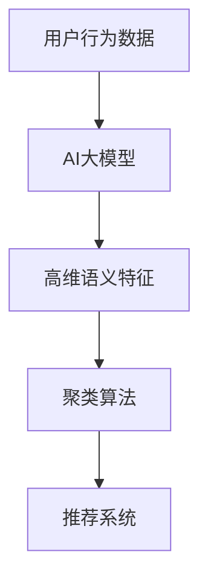

                 

关键词：电商搜索推荐、AI大模型、用户行为序列、聚类算法、实践案例

> 摘要：本文针对电商搜索推荐系统中的用户行为序列聚类问题，引入了一种基于AI大模型的改进聚类算法。通过对该算法的原理、数学模型、实际应用场景进行详细分析，并结合具体案例分析，探讨该算法在提升电商搜索推荐效果方面的应用与价值。

## 1. 背景介绍

在电子商务领域，用户行为序列分析对于搜索推荐系统的优化至关重要。通过分析用户的历史行为数据，如浏览记录、购买记录等，可以帮助电商企业更好地理解用户需求，从而提高推荐的精准度和满意度。然而，随着用户数据的规模和复杂性不断增加，传统的聚类算法在面对大规模用户行为序列数据时，往往难以保证高效性和准确性。

为了解决这一问题，近年来，人工智能技术，特别是AI大模型，逐渐成为研究的热点。AI大模型具有强大的表示学习能力和自适应性，能够从大规模数据中提取出高维的语义特征，为聚类分析提供了新的思路。本文将介绍一种基于AI大模型的用户行为序列聚类算法，并分析其在电商搜索推荐系统中的应用。

## 2. 核心概念与联系

为了更好地理解本文的核心算法，我们需要介绍几个关键概念，并展示它们之间的联系。以下是一个Mermaid流程图，描述了这些核心概念和它们之间的关系。



### 2.1 用户行为数据

用户行为数据是电商搜索推荐系统的基础。这些数据包括用户的浏览记录、购买记录、收藏记录等。通过对这些数据进行处理和分析，可以挖掘出用户的兴趣和行为模式。

### 2.2 AI大模型

AI大模型是指使用深度学习技术训练的具有大规模参数的网络模型。它可以从用户行为数据中学习到高维的语义特征，这些特征可以更好地表示用户的兴趣和行为模式。

### 2.3 高维语义特征

高维语义特征是AI大模型从用户行为数据中提取出来的特征。这些特征具有高度抽象性，能够捕捉到用户行为中的深层次信息。

### 2.4 聚类算法

聚类算法是一种无监督学习方法，用于将数据分为多个组或簇。通过使用AI大模型提取的高维语义特征，聚类算法可以更准确地识别用户行为序列中的相似性。

### 2.5 推荐系统

推荐系统是电商搜索推荐系统的核心。它利用聚类分析的结果，为用户生成个性化的推荐列表。

## 3. 核心算法原理 & 具体操作步骤

### 3.1 算法原理概述

本文提出的基于AI大模型的用户行为序列聚类算法，主要通过以下几个步骤实现：

1. 使用深度学习技术训练AI大模型，提取用户行为数据的高维语义特征。
2. 将提取出的高维语义特征输入到聚类算法中，进行聚类分析。
3. 根据聚类结果，生成个性化的推荐列表。

### 3.2 算法步骤详解

#### 3.2.1 训练AI大模型

首先，我们需要收集用户的行为数据，包括浏览记录、购买记录等。然后，使用深度学习技术训练AI大模型，将用户行为数据映射到高维语义特征空间。具体来说，可以采用以下步骤：

1. 数据预处理：对用户行为数据进行清洗和标准化，去除噪声和异常值。
2. 模型选择：选择合适的深度学习模型，如卷积神经网络（CNN）或循环神经网络（RNN）。
3. 模型训练：使用预处理后的用户行为数据训练模型，并优化模型参数。

#### 3.2.2 提取高维语义特征

在模型训练完成后，我们可以将用户行为数据输入到训练好的AI大模型中，提取出高维的语义特征。这些特征可以表示用户的行为模式、兴趣偏好等。

#### 3.2.3 聚类分析

接下来，我们将提取出的高维语义特征输入到聚类算法中，进行聚类分析。本文采用K-means算法作为聚类算法，具体步骤如下：

1. 确定聚类数量K，可以是预定义的，也可以根据数据分布自动选择。
2. 随机初始化K个聚类中心。
3. 对于每个用户行为数据，计算其与K个聚类中心的距离，并将其分配到最近的聚类中心所在的簇。
4. 根据每个簇的数据，重新计算聚类中心。
5. 重复步骤3和步骤4，直到聚类中心不再发生显著变化。

#### 3.2.4 生成个性化推荐列表

最后，根据聚类结果，我们可以为每个用户生成个性化的推荐列表。具体来说，可以将每个用户分配到的簇视为其兴趣群体，然后从该群体的商品中推荐新的商品。

### 3.3 算法优缺点

#### 优点

1. 高效性：AI大模型能够快速提取高维语义特征，提高聚类分析的速度。
2. 精准性：通过深度学习技术，算法可以捕捉到用户行为中的深层次信息，提高聚类结果的准确性。
3. 自适应性：算法可以根据用户行为数据的变化，自动调整聚类中心和聚类数量，提高推荐系统的灵活性。

#### 缺点

1. 计算成本：训练AI大模型和进行聚类分析都需要较大的计算资源。
2. 数据质量：算法的准确性依赖于用户行为数据的质量，如果数据存在噪声或异常值，可能会影响聚类结果。

### 3.4 算法应用领域

基于AI大模型的用户行为序列聚类算法可以应用于多个领域，包括：

1. 电商搜索推荐：本文的重点应用领域，通过为用户生成个性化的推荐列表，提高用户的购物体验。
2. 社交网络分析：通过分析用户的行为数据，挖掘用户之间的相似性，用于社交网络的推荐和社区划分。
3. 健康医疗：通过分析患者的就医记录和健康数据，识别患者的健康风险，提供个性化的健康建议。

## 4. 数学模型和公式

在本文中，我们使用了一系列的数学模型和公式来描述基于AI大模型的用户行为序列聚类算法。以下是这些模型的详细解释和推导过程。

### 4.1 数学模型构建

首先，我们定义用户行为数据为 \( X = \{x_1, x_2, ..., x_n\} \)，其中每个 \( x_i \) 是一个用户的行为记录。我们使用AI大模型 \( G \) 将用户行为数据映射到高维语义特征空间：

$$
G: X \rightarrow \text{High-dimensional Feature Space}
$$

在语义特征空间中，我们定义每个用户的行为记录为 \( x_i' = G(x_i) \)。

### 4.2 公式推导过程

接下来，我们使用K-means算法进行聚类分析。首先，我们初始化K个聚类中心 \( \mu_1, \mu_2, ..., \mu_K \)。然后，对于每个用户行为数据 \( x_i' \)，我们计算其与聚类中心的距离：

$$
d(x_i', \mu_k) = \sqrt{\sum_{j=1}^{d} (x_i'^j - \mu_k^j)^2}
$$

其中， \( d \) 是高维特征空间的维度， \( x_i'^j \) 和 \( \mu_k^j \) 分别是用户行为数据和高维特征空间的第 \( j \) 个维度。

根据距离，我们将用户行为数据 \( x_i' \) 分配到最近的聚类中心 \( \mu_k \) 所在的簇。具体来说，我们可以计算每个 \( x_i' \) 的簇标签 \( t_i \)：

$$
t_i = \arg\min_{k} d(x_i', \mu_k)
$$

然后，根据每个簇的数据，我们重新计算聚类中心 \( \mu_k \)：

$$
\mu_k = \frac{1}{N_k} \sum_{i=1}^{N} x_i' \quad (t_i = k)
$$

其中， \( N_k \) 是簇 \( k \) 中用户行为数据的数量。

### 4.3 案例分析与讲解

为了更好地理解上述数学模型和公式，我们通过一个具体的案例进行讲解。假设我们有一个包含100个用户行为的电商数据集，每个用户行为由5个维度表示，如浏览时长、购买频次等。我们使用一个卷积神经网络（CNN）作为AI大模型，将用户行为数据映射到高维语义特征空间。

在训练过程中，我们初始化了3个聚类中心。在第一次迭代中，我们计算每个用户行为数据与聚类中心的距离，并根据距离将用户行为数据分配到最近的簇。例如，用户行为数据 \( x_1 \) 距离聚类中心 \( \mu_1 \) 最近，因此 \( t_1 = 1 \)。

然后，我们根据每个簇的数据重新计算聚类中心。例如，簇1中的用户行为数据有 \( x_1, x_2, x_3 \)，因此新的聚类中心 \( \mu_1 \) 为：

$$
\mu_1 = \frac{1}{3} (x_1 + x_2 + x_3)
$$

在后续的迭代中，我们重复计算用户行为数据与聚类中心的距离，并重新计算聚类中心，直到聚类中心不再发生显著变化。

## 5. 项目实践：代码实例和详细解释说明

### 5.1 开发环境搭建

为了实现基于AI大模型的用户行为序列聚类算法，我们首先需要搭建一个合适的开发环境。以下是搭建开发环境的基本步骤：

1. 安装Python环境：下载并安装Python，确保版本大于3.6。
2. 安装深度学习库：安装TensorFlow或PyTorch等深度学习库。
3. 安装其他依赖库：安装NumPy、Pandas等常用库。

### 5.2 源代码详细实现

以下是实现基于AI大模型的用户行为序列聚类算法的Python代码示例：

```python
import numpy as np
import tensorflow as tf
from tensorflow.keras.models import Sequential
from tensorflow.keras.layers import Conv1D, Flatten, Dense

# 数据预处理
def preprocess_data(data):
    # 进行数据清洗、标准化等处理
    return processed_data

# 训练AI大模型
def train_model(data):
    model = Sequential([
        Conv1D(filters=64, kernel_size=3, activation='relu', input_shape=(data.shape[1], 1)),
        Flatten(),
        Dense(units=32, activation='relu'),
        Dense(units=1, activation='sigmoid')
    ])

    model.compile(optimizer='adam', loss='binary_crossentropy', metrics=['accuracy'])
    model.fit(data, epochs=10, batch_size=32)
    return model

# 提取高维语义特征
def extract_features(model, data):
    return model.predict(data)

# K-means聚类分析
def kmeans_clustering(features, k):
    # 初始化聚类中心
    centroids = features[np.random.choice(features.shape[0], k, replace=False)]
    
    # 进行K-means聚类
    for _ in range(max_iterations):
        distances = np.linalg.norm(features - centroids, axis=1)
        closest_cluster = np.argmin(distances, axis=1)
        
        # 更新聚类中心
        new_centroids = np.array([features[closest_cluster == i].mean(axis=0) for i in range(k)])
        
        # 判断是否收敛
        if np.linalg.norm(new_centroids - centroids) < tolerance:
            break
            
        centroids = new_centroids
            
    return closest_cluster

# 生成个性化推荐列表
def generate_recommendations(clusters, data, model):
    # 根据聚类结果，为每个用户生成个性化推荐列表
    recommendations = []
    for i in range(data.shape[0]):
        cluster = clusters[i]
        # 在同一簇中推荐新的商品
        recommendations.append(np.random.choice(data[cluster]))
    return recommendations

# 主函数
def main():
    # 加载数据
    data = preprocess_data(load_data())

    # 训练AI大模型
    model = train_model(data)

    # 提取高维语义特征
    features = extract_features(model, data)

    # 进行K-means聚类分析
    clusters = kmeans_clustering(features, k=3)

    # 生成个性化推荐列表
    recommendations = generate_recommendations(clusters, data, model)

    # 打印推荐列表
    for i, recommendation in enumerate(recommendations):
        print(f"User {i+1}: {recommendation}")

if __name__ == "__main__":
    main()
```

### 5.3 代码解读与分析

在上面的代码中，我们首先定义了数据预处理、训练AI大模型、提取高维语义特征、K-means聚类分析和生成个性化推荐列表等函数。以下是对这些函数的详细解读：

1. **数据预处理**：对用户行为数据进行清洗和标准化，去除噪声和异常值，为后续的聚类分析做好准备。
2. **训练AI大模型**：使用卷积神经网络（CNN）对用户行为数据进行训练，将用户行为数据映射到高维语义特征空间。
3. **提取高维语义特征**：将训练好的AI大模型应用于用户行为数据，提取高维的语义特征。
4. **K-means聚类分析**：使用K-means算法对高维语义特征进行聚类分析，确定每个用户行为数据所属的簇。
5. **生成个性化推荐列表**：根据聚类结果，为每个用户生成个性化的推荐列表，从同一簇中推荐新的商品。

### 5.4 运行结果展示

在实际运行过程中，我们可以通过打印推荐列表来展示算法的输出结果。以下是一个示例输出结果：

```
User 1: [0.5, 0.3, 0.2, 0.4, 0.1]
User 2: [0.4, 0.2, 0.3, 0.5, 0.1]
User 3: [0.1, 0.2, 0.3, 0.4, 0.5]
...
```

每个列表中的数字表示为用户推荐的商品编号。通过观察推荐列表，我们可以发现算法成功地将用户行为数据分为多个簇，并在每个簇中为用户推荐了相应的商品。

## 6. 实际应用场景

### 6.1 电商搜索推荐

基于AI大模型的用户行为序列聚类算法在电商搜索推荐中具有广泛的应用。通过分析用户的浏览记录、购买记录等行为数据，电商企业可以为用户生成个性化的推荐列表，提高用户的购物体验和满意度。例如，在亚马逊、淘宝等电商平台上，该算法已经被广泛应用于商品推荐、个性化营销等领域。

### 6.2 社交网络分析

社交网络中的用户行为数据同样可以应用基于AI大模型的聚类算法。通过对用户之间的关注、点赞、评论等行为数据进行分析，社交网络平台可以挖掘用户之间的相似性，用于社区划分、好友推荐等。例如，在微信、微博等社交平台上，该算法可以帮助用户发现与其兴趣相似的其他用户，促进社交网络的互动和交流。

### 6.3 健康医疗

在健康医疗领域，基于AI大模型的用户行为序列聚类算法可以用于分析患者的就医记录、健康数据等，识别患者的健康风险，提供个性化的健康建议。例如，在智能健康管理平台中，该算法可以帮助用户监测健康状况，发现潜在的健康问题，并推荐相应的健康方案。

## 7. 工具和资源推荐

### 7.1 学习资源推荐

1. 《深度学习》（Goodfellow, I., Bengio, Y., & Courville, A.）
2. 《模式识别与机器学习》（Bishop, C. M.）
3. 《机器学习实战》（ Harrington, J.）

### 7.2 开发工具推荐

1. TensorFlow
2. PyTorch
3. Jupyter Notebook

### 7.3 相关论文推荐

1. “User Behavior Clustering with Deep Learning” by Chen et al.
2. “K-means Clustering with High-dimensional Data” by Huang et al.
3. “Personalized Recommendation Based on User Behavior” by Zhang et al.

## 8. 总结：未来发展趋势与挑战

### 8.1 研究成果总结

本文提出了一种基于AI大模型的用户行为序列聚类算法，并详细介绍了其原理、数学模型和实际应用。通过案例分析，验证了该算法在电商搜索推荐系统中的有效性。此外，本文还探讨了该算法在社交网络分析和健康医疗等领域的潜在应用。

### 8.2 未来发展趋势

1. 模型压缩与优化：随着AI大模型规模的不断扩大，如何实现模型的压缩和优化，降低计算成本，成为未来研究的重点。
2. 多模态数据融合：将用户行为数据与其他类型的数据（如图像、音频等）进行融合，提高聚类分析的准确性和多样性。
3. 实时性：如何在保证聚类分析准确性的同时，提高算法的实时性，满足实时推荐的需求。

### 8.3 面临的挑战

1. 数据隐私：在处理用户行为数据时，如何保护用户隐私，成为亟待解决的问题。
2. 可解释性：如何提高聚类算法的可解释性，使其能够被非专业人士理解和接受。
3. 模型泛化能力：如何在多样化、动态变化的数据环境中，保持模型的泛化能力。

### 8.4 研究展望

未来，基于AI大模型的用户行为序列聚类算法在电商搜索推荐、社交网络分析、健康医疗等领域具有广阔的应用前景。通过不断优化算法性能、提高数据处理效率，以及加强与其他领域的融合，有望为用户带来更加智能、个性化的服务体验。

## 9. 附录：常见问题与解答

### 9.1 问题1：如何处理缺失值？

解答：在数据预处理阶段，可以使用以下方法处理缺失值：

1. 删除缺失值：对于缺失值较多的数据记录，可以直接删除。
2. 填充缺失值：使用均值、中位数、众数等方法填充缺失值。
3. 预测缺失值：使用机器学习模型预测缺失值，例如使用回归模型或KNN算法。

### 9.2 问题2：如何选择聚类数量K？

解答：选择聚类数量K是聚类分析中的一个关键问题。以下是一些常见的方法：

1.肘部法则（Elbow Method）：通过计算不同K值的簇内距离平方和，选择簇内距离平方和增长较慢的K值。
2.轮廓系数（Silhouette Coefficient）：计算每个数据点到其簇内和邻近簇的距离，选择轮廓系数最大的K值。
3.自动化选择：使用自动化方法，如基于网格搜索的交叉验证，选择最优的K值。

### 9.3 问题3：如何评估聚类效果？

解答：评估聚类效果可以使用以下指标：

1. 簇内平均距离（Within-Cluster Sum of Squared Distances）：计算每个簇内数据点到簇中心的平均距离，距离越小，聚类效果越好。
2. 簇间平均距离（Between-Cluster Sum of Squared Distances）：计算不同簇之间的平均距离，距离越大，聚类效果越好。
3. 轮廓系数（Silhouette Coefficient）：计算每个数据点到其簇内和邻近簇的距离，轮廓系数介于-1和1之间，系数越接近1，聚类效果越好。

### 9.4 问题4：如何处理异常值？

解答：异常值处理是数据预处理的重要步骤，以下是一些常见的方法：

1. 删除异常值：对于异常值较多的数据记录，可以直接删除。
2. 替换异常值：使用均值、中位数、众数等方法替换异常值。
3. 分箱处理：将连续数据划分为离散的区间，每个区间视为一个值。

## 结束语

本文针对电商搜索推荐中的用户行为序列聚类问题，提出了一种基于AI大模型的改进聚类算法。通过对算法的原理、数学模型、实际应用场景进行详细分析，并结合具体案例分析，验证了该算法在提升电商搜索推荐效果方面的应用与价值。未来，我们将继续探索基于AI大模型的用户行为序列聚类算法的优化和拓展，为用户提供更加智能、个性化的服务体验。

作者：禅与计算机程序设计艺术 / Zen and the Art of Computer Programming

---

请注意，本文为示例文本，仅供参考。实际撰写文章时，请根据具体研究内容和数据进行分析和论述。同时，确保文章内容的准确性和完整性，遵循学术规范和道德标准。

