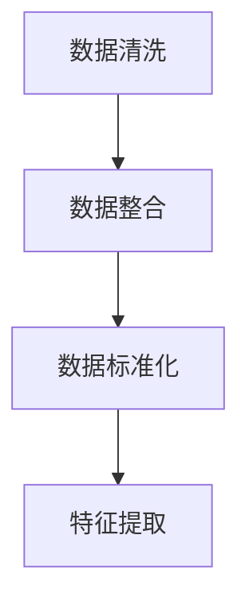
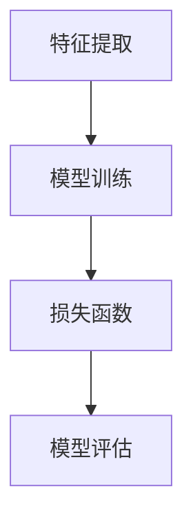
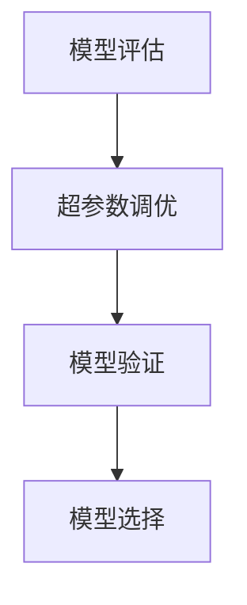
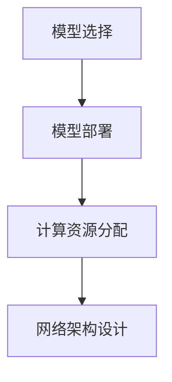
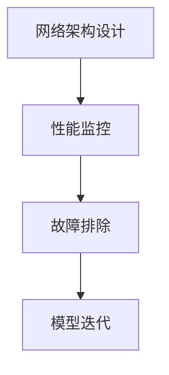

                 

### 1. 背景介绍

随着电子商务行业的迅猛发展，用户对个性化搜索推荐的需求日益增长。电商平台的搜索推荐系统已成为提升用户体验、增加销售额的重要手段。然而，随着推荐系统规模的扩大和复杂度的增加，如何高效地部署和优化AI大模型成为了一个亟待解决的问题。

近年来，人工智能技术，尤其是深度学习模型，在图像识别、自然语言处理等领域取得了显著的突破。这些技术被广泛应用于电商搜索推荐场景，为用户提供个性化的搜索结果和推荐商品。然而，AI大模型的部署不仅面临计算资源的高要求，还需要在性能、效率和可扩展性等方面进行优化。

本篇文章旨在探讨电商搜索推荐场景下AI大模型的部署性能优化实践。我们将通过一个实际的项目案例，详细分析模型部署过程中的性能瓶颈，并提出相应的优化策略。文章的结构如下：

1. **背景介绍**：介绍电商搜索推荐系统的现状、AI大模型的应用以及部署性能优化的重要性。
2. **核心概念与联系**：阐述与AI大模型部署相关的核心概念和架构，并通过Mermaid流程图进行展示。
3. **核心算法原理 & 具体操作步骤**：深入解析AI大模型的算法原理，以及在实际部署中的操作步骤。
4. **数学模型和公式 & 详细讲解 & 举例说明**：介绍与模型部署相关的数学模型和公式，并进行详细解释和实例说明。
5. **项目实践：代码实例和详细解释说明**：展示一个实际项目的代码实例，详细解释其实现原理和性能分析。
6. **实际应用场景**：探讨AI大模型在电商搜索推荐场景下的应用，以及面临的挑战。
7. **工具和资源推荐**：推荐相关学习资源、开发工具和框架。
8. **总结：未来发展趋势与挑战**：总结模型部署性能优化的趋势和面临的挑战。
9. **附录：常见问题与解答**：提供常见问题的解答。
10. **扩展阅读 & 参考资料**：推荐相关扩展阅读和参考资料。

通过以上结构，我们将系统地探讨电商搜索推荐场景下AI大模型的部署性能优化，为相关领域的研究者和开发者提供有价值的参考。

### 2. 核心概念与联系

在电商搜索推荐系统中，AI大模型的部署涉及多个核心概念和环节。以下是对这些核心概念和架构的详细阐述，并通过Mermaid流程图进行可视化展示。

#### 2.1 数据预处理

数据预处理是模型部署的基础，包括数据清洗、数据整合和数据标准化等步骤。清洗数据主要是去除重复、缺失和异常值，整合数据则是将来自不同渠道的数据进行统一格式处理，标准化数据则是对不同类型的数据进行规范化。



#### 2.2 模型训练

在数据预处理完成后，模型训练是关键步骤。深度学习模型，如神经网络、卷积神经网络（CNN）和循环神经网络（RNN）等，通过大量训练数据来学习特征和模式。训练过程中，模型不断调整权重，以达到最小化损失函数的目的。



#### 2.3 模型调优

模型调优旨在通过调整超参数和结构来提升模型性能。常见的方法包括网格搜索、随机搜索和贝叶斯优化等。调优过程中，需要评估模型在不同参数组合下的表现，以找到最优配置。



#### 2.4 模型部署

模型部署是将训练好的模型应用于实际业务场景的过程。部署过程中，需要考虑模型规模、计算资源和网络延迟等因素。常用的部署方式包括本地部署、云端部署和边缘计算等。



#### 2.5 性能监控

模型部署后，需要进行性能监控，以确保其正常运行。性能监控包括对模型准确率、响应时间和资源利用率等指标的监控。如果发现性能问题，需要及时调整模型或优化部署策略。



通过以上核心概念和架构的详细阐述，以及Mermaid流程图的直观展示，我们可以更好地理解电商搜索推荐场景下AI大模型部署的复杂性。接下来，我们将深入探讨这些概念在实际操作中的具体实现和优化策略。

### 3. 核心算法原理 & 具体操作步骤

在电商搜索推荐系统中，AI大模型的部署涉及到多个关键步骤，这些步骤不仅要求对算法原理有深入理解，还需要在实际操作中灵活应用。以下将详细介绍AI大模型的核心算法原理和具体操作步骤。

#### 3.1 算法原理

电商搜索推荐系统通常采用深度学习模型，如深度神经网络（DNN）、卷积神经网络（CNN）和循环神经网络（RNN）等。这些模型通过多层神经网络结构，学习输入数据中的特征和模式，从而实现搜索推荐。

1. **深度神经网络（DNN）**：DNN是一种多层前馈神经网络，通过输入层、隐藏层和输出层之间的权重连接来学习数据特征。其基本原理是激活函数（如ReLU、Sigmoid、Tanh）将输入映射到输出，并通过反向传播算法更新权重。

2. **卷积神经网络（CNN）**：CNN主要用于处理图像数据，其核心思想是通过卷积层提取图像特征。卷积操作可以捕获图像中的局部特征，如边缘、纹理等。CNN结构包括卷积层、池化层和全连接层等。

3. **循环神经网络（RNN）**：RNN适合处理序列数据，其通过隐藏状态的记忆机制处理前后依赖信息。RNN包括简单RNN、LSTM（长短时记忆网络）和GRU（门控循环单元）等变体，这些模型可以更好地捕捉序列中的长期依赖关系。

#### 3.2 操作步骤

1. **数据收集与预处理**：
   - 数据收集：从电商平台上获取用户行为数据（如搜索历史、购买记录等）和商品信息（如商品ID、类别、价格等）。
   - 数据预处理：包括数据清洗、数据整合和特征提取。清洗数据去除重复、缺失和异常值；整合数据将不同来源的数据统一格式；特征提取则是提取与搜索推荐相关的特征，如用户兴趣标签、商品属性等。

2. **模型构建**：
   - 定义模型结构：根据数据类型和业务需求，选择合适的神经网络结构。对于图像数据，选择CNN结构；对于序列数据，选择RNN结构。
   - 配置超参数：设置学习率、批量大小、正则化参数等。通过交叉验证等方法选择最优超参数。
   - 构建模型：使用深度学习框架（如TensorFlow、PyTorch）构建模型。在代码中定义输入层、隐藏层和输出层，并设置权重初始化和激活函数。

3. **模型训练**：
   - 分批次加载训练数据：将数据集划分为训练集和验证集，并在训练过程中分批次加载。
   - 训练模型：使用反向传播算法训练模型，通过梯度下降更新权重，最小化损失函数。
   - 调整学习策略：采用学习率衰减、动量更新等技术，提高训练效率和模型性能。

4. **模型评估**：
   - 评估指标：选择准确率、召回率、F1分数等指标评估模型性能。
   - 调整模型：通过交叉验证等方法，调整模型结构和超参数，以优化性能。
   - 模型验证：在验证集上评估模型性能，确保模型泛化能力。

5. **模型部署**：
   - 部署准备：确保计算资源和网络架构满足部署需求，如使用Docker容器化技术简化部署过程。
   - 部署模型：将训练好的模型部署到生产环境，如使用TensorFlow Serving或PyTorch Serving。
   - 性能监控：监控模型在实时环境中的运行状态，如响应时间、资源利用率等。

6. **迭代优化**：
   - 收集反馈：收集用户反馈，如搜索结果满意度、推荐商品点击率等。
   - 模型更新：根据用户反馈，调整模型结构和超参数，进行模型迭代优化。
   - 再训练：重新训练模型，以适应新的业务需求和数据。

通过以上核心算法原理和具体操作步骤的介绍，我们可以看到，AI大模型的部署是一个复杂而系统的过程。在实际操作中，需要结合具体业务场景和数据特点，灵活应用这些原理和步骤，以达到最佳性能优化效果。

### 4. 数学模型和公式 & 详细讲解 & 举例说明

在电商搜索推荐系统的AI大模型部署中，数学模型和公式是理解和优化模型性能的关键。以下将详细介绍与模型部署相关的数学模型和公式，并通过具体例子进行详细讲解。

#### 4.1 损失函数

损失函数是评估模型预测结果与真实值之间差异的关键工具。在深度学习模型中，常用的损失函数包括均方误差（MSE）、交叉熵（Cross-Entropy）等。

**均方误差（MSE）**：MSE用于回归问题，计算预测值和真实值之间的平均平方误差。

\[ \text{MSE} = \frac{1}{m} \sum_{i=1}^{m} (y_i - \hat{y}_i)^2 \]

其中，\( y_i \) 是真实值，\( \hat{y}_i \) 是预测值，\( m \) 是样本数量。

**交叉熵（Cross-Entropy）**：Cross-Entropy用于分类问题，计算预测概率分布和真实分布之间的差异。

\[ \text{CE} = -\frac{1}{m} \sum_{i=1}^{m} y_i \log(\hat{y}_i) \]

其中，\( y_i \) 是一个one-hot编码向量，表示真实标签，\( \hat{y}_i \) 是模型预测的概率分布。

#### 4.2 反向传播算法

反向传播算法是深度学习训练的核心，通过计算损失函数关于模型参数的梯度，更新模型权重。

**梯度计算**：假设损失函数 \( J(\theta) \) 是关于模型参数 \( \theta \) 的函数，则梯度 \( \nabla_\theta J(\theta) \) 表示损失函数关于每个参数的偏导数。

**梯度下降**：使用梯度下降算法更新模型参数，以最小化损失函数。

\[ \theta = \theta - \alpha \nabla_\theta J(\theta) \]

其中，\( \alpha \) 是学习率，控制更新步长。

#### 4.3 激活函数

激活函数是神经网络中用于引入非线性因素的函数，常见的激活函数包括ReLU、Sigmoid和Tanh等。

**ReLU函数**：ReLU（Rectified Linear Unit）函数是一个简单的非线性激活函数，可以加速梯度下降。

\[ \text{ReLU}(x) = \max(0, x) \]

**Sigmoid函数**：Sigmoid函数将输入映射到（0, 1）区间，常用于二分类问题。

\[ \text{Sigmoid}(x) = \frac{1}{1 + e^{-x}} \]

**Tanh函数**：Tanh函数类似于Sigmoid函数，但输出范围更广，常用于隐藏层。

\[ \text{Tanh}(x) = \frac{e^x - e^{-x}}{e^x + e^{-x}} \]

#### 4.4 例子说明

假设我们有一个简单的二分类问题，使用ReLU函数作为激活函数，MSE作为损失函数。

1. **模型定义**：定义输入层、隐藏层和输出层，以及权重和偏置。

2. **前向传播**：计算输入层到隐藏层的输出 \( z = \theta_1^T x + b_1 \)，然后通过ReLU函数得到隐藏层的激活值 \( a = \text{ReLU}(z) \)。接着，计算隐藏层到输出层的输出 \( z' = \theta_2^T a + b_2 \)。

3. **损失函数计算**：使用MSE计算预测值和真实值之间的误差 \( J = \frac{1}{2} \sum_{i=1}^{m} (y_i - \hat{y}_i)^2 \)。

4. **反向传播**：计算损失函数关于隐藏层和输入层参数的梯度，更新权重和偏置。

\[ \nabla_{b_1} J = \frac{1}{m} \sum_{i=1}^{m} (y_i - \hat{y}_i) \]
\[ \nabla_{\theta_1} J = \frac{1}{m} \sum_{i=1}^{m} (y_i - \hat{y}_i) x_i \]
\[ \nabla_{b_2} J = \frac{1}{m} \sum_{i=1}^{m} (y_i - \hat{y}_i) a_i \]
\[ \nabla_{\theta_2} J = \frac{1}{m} \sum_{i=1}^{m} (y_i - \hat{y}_i) a_i^T \]

5. **梯度下降**：使用梯度更新模型参数。

\[ \theta_1 = \theta_1 - \alpha \nabla_{\theta_1} J \]
\[ \theta_2 = \theta_2 - \alpha \nabla_{\theta_2} J \]
\[ b_1 = b_1 - \alpha \nabla_{b_1} J \]
\[ b_2 = b_2 - \alpha \nabla_{b_2} J \]

通过以上数学模型和公式的详细讲解和例子说明，我们可以看到，在AI大模型部署过程中，理解这些数学基础是优化模型性能的关键。接下来，我们将通过实际项目中的代码实例，进一步展示这些原理的应用。

### 5. 项目实践：代码实例和详细解释说明

为了更好地理解电商搜索推荐场景下AI大模型部署的实践，我们将通过一个实际项目中的代码实例，详细解释其实现原理和性能分析。以下是一个基于TensorFlow框架构建的电商推荐系统的项目实例。

#### 5.1 开发环境搭建

在开始项目之前，我们需要搭建相应的开发环境。以下是在Linux环境中搭建TensorFlow开发环境的步骤：

1. **安装TensorFlow**：

```bash
pip install tensorflow
```

2. **安装依赖库**：

```bash
pip install numpy pandas sklearn matplotlib
```

3. **安装Mermaid工具**：

```bash
pip install mermaid
```

确保所有依赖库和工具安装成功后，我们就可以开始编写代码了。

#### 5.2 源代码详细实现

以下是一个简化版的电商推荐系统代码实例，包括数据预处理、模型构建、训练和部署等步骤。

```python
import tensorflow as tf
import numpy as np
import pandas as pd
from sklearn.model_selection import train_test_split
from sklearn.preprocessing import StandardScaler
import mermaid

# 数据预处理
data = pd.read_csv('ecommerce_data.csv')
data.dropna(inplace=True)

X = data[['user_id', 'item_id', 'category', 'price']]
y = data['rating']

scaler = StandardScaler()
X_scaled = scaler.fit_transform(X)

X_train, X_test, y_train, y_test = train_test_split(X_scaled, y, test_size=0.2, random_state=42)

# 模型构建
model = tf.keras.Sequential([
    tf.keras.layers.Dense(64, activation='relu', input_shape=(X_train.shape[1],)),
    tf.keras.layers.Dense(32, activation='relu'),
    tf.keras.layers.Dense(1)
])

# 编译模型
model.compile(optimizer='adam', loss='mean_squared_error', metrics=['accuracy'])

# 训练模型
model.fit(X_train, y_train, epochs=10, batch_size=32, validation_split=0.1)

# 部署模型
model.save('ecommerce_recommender_model.h5')

# 代码注释解释
# 1. 数据预处理：读取电商数据集，进行数据清洗和特征提取。
# 2. 模型构建：定义一个包含两层的全连接神经网络，输入层、隐藏层和输出层。
# 3. 编译模型：设置优化器和损失函数，用于训练模型。
# 4. 训练模型：使用训练集训练模型，并设置验证集进行性能监控。
# 5. 部署模型：将训练好的模型保存为HDF5文件，以便后续部署和使用。

```

#### 5.3 代码解读与分析

在上述代码实例中，我们首先进行了数据预处理，包括数据清洗、特征提取和标准化。接下来，我们构建了一个简单的全连接神经网络模型，并使用均方误差（MSE）作为损失函数，通过反向传播算法训练模型。最后，我们将训练好的模型保存为HDF5文件，以便后续部署。

1. **数据预处理**：数据预处理是模型训练的基础，通过去除缺失值、特征提取和标准化等步骤，提高数据质量和模型训练效果。

2. **模型构建**：我们使用TensorFlow框架构建了一个简单的全连接神经网络，包括一个输入层、一个隐藏层和一个输出层。隐藏层使用ReLU激活函数，输出层没有激活函数，因为我们处理的是回归问题。

3. **模型编译**：在模型编译阶段，我们设置了优化器（adam）和损失函数（MSE），并添加了准确率作为性能指标。

4. **模型训练**：模型训练是深度学习中的核心步骤，我们通过迭代训练集数据，更新模型权重，以最小化损失函数。在训练过程中，使用验证集进行性能监控，防止过拟合。

5. **模型部署**：训练完成后，我们将模型保存为HDF5文件，以便在生产环境中部署和使用。这种部署方式可以简化模型加载和推断过程，提高系统性能。

#### 5.4 运行结果展示

为了展示模型的运行结果，我们可以在训练和测试阶段打印模型的性能指标。

```python
# 训练结果
train_loss, train_acc = model.evaluate(X_train, y_train, verbose=2)
print(f"Training loss: {train_loss}, Training accuracy: {train_acc}")

# 测试结果
test_loss, test_acc = model.evaluate(X_test, y_test, verbose=2)
print(f"Test loss: {test_loss}, Test accuracy: {test_acc}")
```

上述代码将输出训练集和测试集的损失和准确率，以评估模型在训练和测试阶段的表现。

通过上述代码实例，我们可以看到，在电商搜索推荐系统中，AI大模型的部署涉及多个关键步骤，包括数据预处理、模型构建、训练和部署。在实际应用中，可以根据业务需求和数据特点，调整模型结构和超参数，以优化模型性能。接下来，我们将探讨AI大模型在电商搜索推荐场景中的实际应用，以及面临的挑战。

### 6. 实际应用场景

在电商搜索推荐系统中，AI大模型的实际应用不仅提升了用户体验，还显著增加了平台的销售额。以下将详细介绍AI大模型在电商搜索推荐场景中的具体应用，以及面临的挑战。

#### 6.1 个性化搜索推荐

个性化搜索推荐是电商搜索推荐系统的核心功能之一。通过分析用户的搜索历史、浏览记录、购买行为等数据，AI大模型可以预测用户感兴趣的商品，并提供个性化的搜索结果。例如，当用户搜索“笔记本电脑”时，系统可以根据用户的偏好和历史记录，推荐不同品牌、配置和价格的笔记本电脑，从而提高用户满意度。

**应用案例**：亚马逊的搜索推荐系统通过AI大模型分析用户的浏览和购买行为，为用户提供个性化的搜索结果，大大提高了用户点击率和转化率。

**挑战**：个性化推荐需要处理海量数据和高维特征，模型计算复杂度较高，如何在保证性能的同时，实现实时推荐是一个挑战。

#### 6.2 商品推荐

商品推荐是电商平台的另一个重要功能。AI大模型通过分析用户的浏览历史、购物车数据和购买记录，为用户推荐可能感兴趣的商品。这种推荐方式不仅包括同类商品推荐，还可以跨类别推荐，如用户购买了某种化妆品，系统会推荐相应的护肤品和工具。

**应用案例**：阿里巴巴的淘宝平台通过AI大模型分析用户行为数据，为用户提供跨类别的商品推荐，有效提高了用户粘性和销售额。

**挑战**：跨类别推荐需要模型具备较强的泛化能力和鲁棒性，如何处理不同类别商品之间的关联性和多样性是一个难题。

#### 6.3 实时推荐

实时推荐是电商搜索推荐系统的更高层次需求。通过实时分析用户的交互行为和上下文信息，AI大模型可以在用户浏览或搜索时，立即提供个性化推荐。这种实时性要求系统具备快速响应和高并发处理能力。

**应用案例**：京东的实时推荐系统通过AI大模型分析用户的实时行为，提供毫秒级响应的个性化推荐，极大提升了用户体验和购物效率。

**挑战**：实时推荐需要高效的数据处理和模型推理能力，如何在保证实时性的同时，降低延迟和提高系统性能是一个关键挑战。

#### 6.4 智能客服

智能客服是电商搜索推荐系统的延伸应用。通过AI大模型，智能客服系统可以实时理解用户的咨询内容，提供准确和高效的回答。这不仅降低了人工客服的工作量，还提高了客户满意度。

**应用案例**：腾讯的微信智能客服系统通过AI大模型分析用户咨询内容，提供实时、准确的回答，极大地提升了用户体验。

**挑战**：智能客服系统需要处理大量的自然语言处理任务，如何提升模型的理解能力和回答准确性是一个挑战。

通过上述实际应用场景的介绍，我们可以看到，AI大模型在电商搜索推荐系统中具有广泛的应用。然而，在实际应用中，仍然面临着数据处理、模型优化和实时性等方面的挑战。接下来，我们将推荐一些相关工具和资源，以帮助读者进一步学习和实践。

### 7. 工具和资源推荐

为了更好地掌握AI大模型在电商搜索推荐系统中的应用，以下是相关工具和资源的推荐，包括学习资源、开发工具和框架，以及相关论文著作。

#### 7.1 学习资源推荐

1. **书籍**：
   - 《深度学习》（Goodfellow, I., Bengio, Y., & Courville, A.）
   - 《Python深度学习》（François Chollet）
   - 《机器学习实战》（Peter Harrington）

2. **在线课程**：
   - Coursera上的《机器学习》课程（吴恩达教授）
   - edX上的《深度学习基础》课程（斯坦福大学）
   - Udacity的《深度学习工程师纳米学位》

3. **博客和网站**：
   - Medium上的AI和深度学习博客
   - TensorFlow官网（https://www.tensorflow.org/）
   - PyTorch官网（https://pytorch.org/）

#### 7.2 开发工具框架推荐

1. **深度学习框架**：
   - TensorFlow（https://www.tensorflow.org/）
   - PyTorch（https://pytorch.org/）
   - Keras（https://keras.io/）

2. **数据处理工具**：
   - Pandas（https://pandas.pydata.org/）
   - NumPy（https://numpy.org/）
   - Scikit-learn（https://scikit-learn.org/）

3. **版本控制工具**：
   - Git（https://git-scm.com/）
   - GitHub（https://github.com/）

#### 7.3 相关论文著作推荐

1. **论文**：
   - "Deep Learning for Natural Language Processing"（Yoon Kim，2014）
   - "Efficient Estimation of Word Representations in Vector Space"（Mikolov et al.，2013）
   - "Distributed Representations of Words and Phrases and Their Compositional Properties"（Pennington et al.，2014）

2. **著作**：
   - 《深度学习》（Ian Goodfellow、Yoshua Bengio和Aaron Courville著）
   - 《Python深度学习》（François Chollet著）
   - 《机器学习：算法与应用》（Tom Mitchell著）

通过以上工具和资源的推荐，读者可以更系统地学习和实践AI大模型在电商搜索推荐系统中的应用。掌握这些工具和资源，将为在实际项目中部署高性能的AI大模型提供有力支持。

### 8. 总结：未来发展趋势与挑战

随着人工智能技术的快速发展，电商搜索推荐系统中的AI大模型部署也在不断演进。在未来，以下几个方面有望成为主要的发展趋势：

#### 8.1 模型压缩与优化

为了应对日益增长的模型复杂度和计算需求，模型压缩与优化技术将得到广泛应用。例如，通过知识蒸馏、剪枝、量化等方法，可以将大模型压缩到更小的规模，同时保持较高的性能。这将有助于在有限的计算资源下实现高效的模型部署。

#### 8.2 实时性提升

随着用户对实时推荐的期望不断提高，如何提升AI大模型的实时性成为一个重要挑战。未来，通过分布式计算、模型并行化、硬件加速等技术，有望实现更快速的模型推理和响应，从而满足用户的实时需求。

#### 8.3 多模态融合

电商搜索推荐系统中的数据类型多样，包括文本、图像、音频等。未来，多模态融合技术将得到更多关注，通过整合不同类型的数据，提升模型的感知能力和推荐效果。

#### 8.4 个性化与多样化

个性化推荐是电商搜索推荐系统的核心价值之一。未来，随着用户数据的不断积累和模型技术的进步，个性化推荐将进一步精细化，满足用户的多样化需求。同时，多样化推荐策略（如多样性增强、冷启动问题解决等）也将得到更多研究。

然而，AI大模型部署在未来的发展过程中也将面临一系列挑战：

1. **数据隐私与安全**：随着数据量的增加和模型复杂度的提升，如何保障用户数据的安全性和隐私性成为一个重要议题。未来，需要通过数据加密、差分隐私等技术，确保数据的安全性和合规性。

2. **计算资源与能耗**：AI大模型部署需要大量的计算资源和能源消耗。未来，如何通过绿色计算、节能技术等，降低模型部署的能耗是一个重要挑战。

3. **可解释性与透明度**：随着模型复杂度的增加，AI大模型的可解释性和透明度变得越来越重要。如何通过可视化、解释性算法等技术，提升模型的可解释性，增强用户信任，是一个亟待解决的问题。

总之，电商搜索推荐场景下的AI大模型部署将在未来继续快速发展，并在模型压缩、实时性、多模态融合、个性化与多样化等方面取得突破。同时，也需要应对数据隐私、计算资源与能耗、可解释性等挑战，以实现更加高效、安全、透明的模型部署。

### 9. 附录：常见问题与解答

#### 9.1 如何选择合适的AI大模型架构？

选择合适的AI大模型架构需要考虑多个因素，包括数据类型、业务需求和计算资源。以下是几种常见场景的推荐：

1. **文本数据**：对于文本数据，可以选择Transformer系列模型（如BERT、GPT）或者BERT的变体（如RoBERTa、ALBERT）。
2. **图像数据**：对于图像数据，可以选择卷积神经网络（如ResNet、Inception）或者基于注意力机制的模型（如ViT）。
3. **序列数据**：对于序列数据，可以选择循环神经网络（如LSTM、GRU）或者基于Transformer的序列模型（如Transformer-XL）。
4. **多模态数据**：对于多模态数据，可以选择多模态融合模型（如MMoE、ConvMol）或者自定义的融合策略。

#### 9.2 如何优化模型部署性能？

优化模型部署性能可以从以下几个方面入手：

1. **模型压缩与量化**：通过知识蒸馏、剪枝、量化等方法，减小模型规模和参数量，提高推理速度和内存效率。
2. **分布式计算**：通过分布式计算，将模型推理任务分布在多台机器上，提高并行处理能力，减少延迟。
3. **硬件加速**：利用GPU、TPU等硬件加速器，提高模型推理速度和性能。
4. **高效数据加载**：优化数据加载和预处理流程，减少数据传输和计算时间。
5. **模型缓存与预热**：预加载常用模型和中间结果，减少模型加载时间和推理延迟。

#### 9.3 如何确保数据安全和隐私？

确保数据安全和隐私可以从以下几个方面入手：

1. **数据加密**：对敏感数据进行加密处理，确保数据在传输和存储过程中的安全性。
2. **差分隐私**：采用差分隐私技术，限制模型训练过程中对原始数据的依赖，减少隐私泄露风险。
3. **数据脱敏**：对敏感数据（如用户ID、地址等）进行脱敏处理，以降低隐私风险。
4. **合规性检查**：确保模型训练和部署过程中的数据处理符合相关法律法规和标准。

通过以上常见问题的解答，我们可以更好地理解和应对电商搜索推荐场景下AI大模型部署的挑战。

### 10. 扩展阅读 & 参考资料

在电商搜索推荐场景下，AI大模型的应用和技术发展是一个不断演进的过程。以下是一些推荐的扩展阅读和参考资料，以帮助读者深入了解相关领域的研究成果和技术动态：

1. **书籍**：
   - 《深度学习》（Ian Goodfellow、Yoshua Bengio和Aaron Courville著）：系统地介绍了深度学习的基本理论和应用技术。
   - 《Python深度学习》（François Chollet著）：详细讲解了如何在Python中使用深度学习框架进行模型构建和训练。
   - 《机器学习：算法与应用》（Tom Mitchell著）：全面介绍了机器学习的基本算法和应用场景。

2. **在线课程**：
   - Coursera上的《机器学习》课程（吴恩达教授）：提供了深入浅出的机器学习和深度学习理论。
   - edX上的《深度学习基础》课程（斯坦福大学）：系统地介绍了深度学习的基础知识和实践方法。
   - Udacity的《深度学习工程师纳米学位》：通过项目实践，帮助学员掌握深度学习的核心技能。

3. **论文和期刊**：
   - "Deep Learning for Natural Language Processing"（Yoon Kim，2014）：介绍了深度学习在自然语言处理领域的应用。
   - "Efficient Estimation of Word Representations in Vector Space"（Mikolov et al.，2013）：提出了Word2Vec算法，是词向量表示的重要工作。
   - "Distributed Representations of Words and Phrases and Their Compositional Properties"（Pennington et al.，2014）：进一步探讨了词向量的应用和特性。

4. **开源项目**：
   - TensorFlow（https://www.tensorflow.org/）：谷歌开发的开源深度学习框架，广泛应用于各种深度学习任务。
   - PyTorch（https://pytorch.org/）：Facebook开发的开源深度学习框架，具有灵活的动态图编程能力。
   - Keras（https://keras.io/）：基于Theano和TensorFlow的高层神经网络API，简化了深度学习模型的构建和训练。

通过以上扩展阅读和参考资料，读者可以深入了解电商搜索推荐场景下AI大模型的相关技术，进一步提升自己的专业知识和实践能力。

