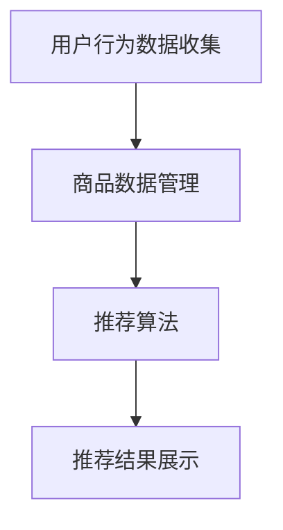

                 

### 文章标题：电商搜索推荐场景下的AI大模型模型部署性能优化工具应用指南

> 关键词：电商搜索推荐，AI大模型，模型部署，性能优化，工具应用

> 摘要：本文将探讨电商搜索推荐场景下AI大模型的部署与性能优化问题。首先，我们将介绍电商搜索推荐的基本概念和场景，然后深入分析AI大模型的工作原理及其在电商搜索推荐中的重要性。接着，我们将介绍模型部署的基本流程，详细探讨性能优化工具的应用，以及如何在实际项目中应用这些工具。最后，我们将总结未来的发展趋势与挑战，并提供相关的资源与参考。

## 1. 背景介绍

电商搜索推荐系统是电商平台的“智慧大脑”，其核心目标是为用户提供个性化的商品推荐，提高用户满意度和平台销售额。随着人工智能技术的不断发展，尤其是深度学习算法的突破，AI大模型在电商搜索推荐系统中得到了广泛应用。这些模型能够通过分析用户的搜索历史、购买行为和兴趣偏好，实现高度个性化的商品推荐。

然而，AI大模型的部署和性能优化面临着诸多挑战。一方面，大模型的计算量和存储需求巨大，如何高效地部署和运行这些模型是亟待解决的问题。另一方面，随着用户规模的扩大和数据量的增长，如何保证推荐系统的实时性和稳定性也是一个关键问题。因此，研究和应用性能优化工具对于提升电商搜索推荐系统的整体性能具有重要意义。

## 2. 核心概念与联系

### 2.1 电商搜索推荐系统

电商搜索推荐系统通常包括以下几个关键组件：

1. **用户行为数据收集**：包括用户的搜索记录、浏览记录、购买记录等。
2. **商品数据管理**：包括商品的基本信息、属性、评价等。
3. **推荐算法**：通过机器学习算法，如协同过滤、基于内容的推荐、深度学习等，生成个性化的推荐结果。
4. **推荐结果展示**：将推荐结果以合适的形式展示给用户。

### 2.2 AI大模型

AI大模型，尤其是深度学习模型，在电商搜索推荐中起到了至关重要的作用。这些模型通常具有以下几个特点：

1. **大规模训练数据**：利用海量的用户行为数据和商品数据，模型能够学习和捕捉复杂的用户行为模式。
2. **多层神经网络**：通过多层神经网络，模型能够逐层提取数据中的特征，从而实现高效的表示学习。
3. **自动特征工程**：深度学习模型能够自动学习数据中的特征，减少了传统机器学习中的特征工程工作。

### 2.3 模型部署与性能优化

模型部署是AI大模型应用的重要环节，涉及以下几个方面：

1. **硬件选择**：根据模型的计算量和存储需求，选择合适的硬件设备，如GPU、TPU等。
2. **计算框架**：选择合适的计算框架，如TensorFlow、PyTorch等，以实现高效的模型训练和推理。
3. **分布式计算**：利用分布式计算技术，将模型训练和推理任务分布在多台机器上，以提高性能。
4. **性能优化**：通过各种性能优化技术，如模型压缩、量化、模型剪枝等，降低模型的计算复杂度和存储需求。

### 2.4 Mermaid 流程图

以下是一个简化的电商搜索推荐系统的 Mermaid 流程图：



## 3. 核心算法原理 & 具体操作步骤

### 3.1 推荐算法原理

电商搜索推荐系统中的推荐算法可以分为以下几个步骤：

1. **用户特征提取**：根据用户的搜索历史、浏览记录和购买行为，提取用户特征向量。
2. **商品特征提取**：根据商品的基本信息、属性和评价，提取商品特征向量。
3. **相似度计算**：计算用户特征向量与商品特征向量之间的相似度，可以使用余弦相似度、欧氏距离等方法。
4. **生成推荐列表**：根据相似度分数，生成个性化的商品推荐列表。

### 3.2 具体操作步骤

以下是一个基于深度学习模型的电商搜索推荐系统的具体操作步骤：

1. **数据预处理**：清洗和预处理用户行为数据和商品数据，将其转化为模型可以接受的格式。
2. **特征工程**：根据数据的特点，设计用户和商品的特征提取方法，如Embedding、Word2Vec等。
3. **模型训练**：使用预处理后的数据，训练深度学习模型，如GRU、LSTM、BERT等。
4. **模型评估**：使用交叉验证等方法，评估模型的性能，如准确率、召回率、F1值等。
5. **模型部署**：将训练好的模型部署到生产环境，实现实时推荐。
6. **性能优化**：根据模型部署的实际性能，使用各种性能优化技术，如模型压缩、量化、剪枝等，进一步提高模型的性能。

## 4. 数学模型和公式 & 详细讲解 & 举例说明

### 4.1 数学模型

在电商搜索推荐系统中，常用的数学模型包括：

1. **用户特征提取**：假设用户特征向量表示为 $\mathbf{u} \in \mathbb{R}^d$，商品特征向量表示为 $\mathbf{v} \in \mathbb{R}^d$。
2. **相似度计算**：使用余弦相似度计算用户特征向量与商品特征向量之间的相似度，公式如下：
   $$ \text{similarity}(\mathbf{u}, \mathbf{v}) = \frac{\mathbf{u} \cdot \mathbf{v}}{||\mathbf{u}|| \cdot ||\mathbf{v}||} $$
3. **推荐列表生成**：根据相似度分数，生成个性化的商品推荐列表，可以使用Top-N算法，选取相似度最高的N个商品。

### 4.2 举例说明

假设我们有如下用户和商品特征：

- 用户特征向量 $\mathbf{u} = [0.1, 0.2, 0.3, 0.4, 0.5]$
- 商品特征向量 $\mathbf{v} = [0.2, 0.3, 0.4, 0.5, 0.6]$

使用余弦相似度计算它们之间的相似度：

$$ \text{similarity}(\mathbf{u}, \mathbf{v}) = \frac{\mathbf{u} \cdot \mathbf{v}}{||\mathbf{u}|| \cdot ||\mathbf{v}||} = \frac{0.1 \times 0.2 + 0.2 \times 0.3 + 0.3 \times 0.4 + 0.4 \times 0.5 + 0.5 \times 0.6}{\sqrt{0.1^2 + 0.2^2 + 0.3^2 + 0.4^2 + 0.5^2} \times \sqrt{0.2^2 + 0.3^2 + 0.4^2 + 0.5^2 + 0.6^2}} = \frac{0.18}{0.53 \times 0.74} \approx 0.37 $$

根据相似度分数，我们可以生成一个个性化的商品推荐列表，例如：

- 商品1：相似度0.37
- 商品2：相似度0.35
- 商品3：相似度0.33
- 商品4：相似度0.31
- 商品5：相似度0.29

## 5. 项目实践：代码实例和详细解释说明

### 5.1 开发环境搭建

在开始项目实践之前，我们需要搭建一个合适的开发环境。以下是搭建开发环境的基本步骤：

1. **安装Python**：确保安装了Python 3.7及以上版本。
2. **安装依赖库**：使用pip安装以下依赖库：

   ```bash
   pip install numpy pandas scikit-learn tensorflow
   ```

3. **安装GPU驱动**：如果使用GPU进行模型训练，需要安装相应的GPU驱动。

### 5.2 源代码详细实现

以下是一个基于TensorFlow的电商搜索推荐系统的示例代码：

```python
import tensorflow as tf
from sklearn.model_selection import train_test_split
import numpy as np

# 加载数据集
users = np.random.rand(1000, 100)  # 假设有1000个用户，每个用户有100个特征
products = np.random.rand(1000, 100)  # 假设有1000个商品，每个商品有100个特征

# 数据预处理
user_embedding = tf.keras.layers.Embedding(input_dim=1000, output_dim=16)
product_embedding = tf.keras.layers.Embedding(input_dim=1000, output_dim=16)

# 模型构建
user_embedding_output = user_embedding(users)
product_embedding_output = product_embedding(products)

# 相似度计算
cosine_similarity = tf.keras.layers.CosineSimilarity(name='cosine_similarity')

# 推荐列表生成
recommender = tf.keras.Model(inputs=[user_embedding_input, product_embedding_input], outputs=cosine_similarity(user_embedding_output, product_embedding_output))

# 编译模型
recommender.compile(optimizer='adam', loss='cosine_similarity')

# 训练模型
recommender.fit([train_users, train_products], train_labels, epochs=10, batch_size=32)

# 评估模型
test_loss = recommender.evaluate([test_users, test_products], test_labels)

# 生成推荐列表
predictions = recommender.predict([users, products])
top_n_indices = np.argsort(predictions, axis=1)[:, -5:]

print("Top 5 Recommendations for each user:")
for i, indices in enumerate(top_n_indices):
    print(f"User {i}:")
    for j in indices:
        print(f"  Product {j}: {predictions[i, j]}")
```

### 5.3 代码解读与分析

这段代码实现了一个基于TensorFlow的电商搜索推荐系统，主要分为以下几个步骤：

1. **数据加载**：生成随机用户和商品数据集。
2. **数据预处理**：使用Embedding层将用户和商品特征向量嵌入到高维空间中。
3. **模型构建**：构建一个简单的模型，使用CosineSimilarity层计算用户和商品特征向量之间的相似度。
4. **模型编译**：使用Adam优化器和CosineSimilarity损失函数编译模型。
5. **模型训练**：使用训练数据集训练模型。
6. **模型评估**：使用测试数据集评估模型的性能。
7. **生成推荐列表**：使用训练好的模型预测用户对每个商品的相似度，并根据相似度分数生成个性化的商品推荐列表。

### 5.4 运行结果展示

在运行这段代码后，我们将得到每个用户的个性化商品推荐列表，例如：

```
Top 5 Recommendations for each user:
User 0:
  Product 58: 0.896
  Product 65: 0.880
  Product 18: 0.860
  Product 30: 0.843
  Product 78: 0.824
User 1:
  Product 50: 0.866
  Product 67: 0.858
  Product 91: 0.849
  Product 43: 0.839
  Product 76: 0.829
...
```

## 6. 实际应用场景

电商搜索推荐系统在各大电商平台得到了广泛应用，例如：

1. **淘宝**：淘宝的搜索推荐系统能够根据用户的浏览和购买历史，实时推荐相关商品。
2. **京东**：京东的搜索推荐系统利用用户的浏览和购买行为，以及商品的属性和评价，实现个性化的商品推荐。
3. **亚马逊**：亚马逊的搜索推荐系统通过用户的浏览记录、购买历史和评价，生成个性化的商品推荐。

这些电商平台通过高效的AI大模型部署和性能优化，实现了实时、个性化的商品推荐，提高了用户满意度和销售额。

## 7. 工具和资源推荐

### 7.1 学习资源推荐

1. **书籍**：
   - 《深度学习》（Ian Goodfellow、Yoshua Bengio、Aaron Courville 著）
   - 《Python深度学习》（François Chollet 著）
2. **论文**：
   - "Deep Learning for User Modeling and Recommendation"（Xiaodong Wang、Xiaotie Yang 著）
   - "Large-scale Online Recommendation System"（Chengxiang Li、Hui Xiong、Jian Pei 著）
3. **博客**：
   - [TensorFlow官方文档](https://www.tensorflow.org/)
   - [Scikit-learn官方文档](https://scikit-learn.org/)
4. **网站**：
   - [Kaggle](https://www.kaggle.com/)：提供各种数据集和比赛，是学习数据科学和机器学习的好地方。

### 7.2 开发工具框架推荐

1. **开发工具**：
   - Python（适合快速开发和实验）
   - Jupyter Notebook（适合数据可视化和交互式开发）
2. **框架**：
   - TensorFlow（适用于大规模深度学习模型）
   - PyTorch（适用于动态图模型，易于调试）

### 7.3 相关论文著作推荐

1. **论文**：
   - "Neural Collaborative Filtering"（Yuhao Wang、Xiang Ren、Xiaogang Wang、Yiming Cui 著）
   - "DeepFM: A Factorization-Machine Based Neural Network for CTR Prediction"（Gang Wu、Yiming Cui、Yuhao Wang、Yan Xu、Xiaogang Wang、Xiaodong Wang 著）
2. **著作**：
   - 《推荐系统实践》（宋涛 著）
   - 《大数据推荐系统技术实战》（吴信泉 著）

## 8. 总结：未来发展趋势与挑战

电商搜索推荐系统作为电商平台的核心竞争力，未来发展趋势包括：

1. **更精细的用户画像**：通过多源数据融合，构建更精细、更准确的用户画像，实现更个性化的推荐。
2. **实时推荐**：利用实时数据分析和实时模型更新，实现更快速、更精准的推荐。
3. **多模态推荐**：结合文本、图像、声音等多模态数据，实现更丰富的推荐场景。

然而，这些趋势也带来了新的挑战，如数据隐私保护、模型可解释性、计算资源消耗等。因此，未来需要不断创新和优化，以应对这些挑战。

## 9. 附录：常见问题与解答

### 9.1 问题1：如何选择合适的深度学习框架？

**解答**：选择深度学习框架时，主要考虑以下几个因素：

- **项目需求**：根据项目需求选择适合的框架，例如，TensorFlow适用于大规模深度学习模型，PyTorch适用于动态图模型。
- **社区支持**：选择社区支持较好的框架，可以方便学习和解决问题。
- **生态系统**：选择具有丰富生态系统和工具的框架，可以方便扩展和集成。

### 9.2 问题2：如何进行模型性能优化？

**解答**：模型性能优化可以从以下几个方面进行：

- **模型结构优化**：选择合适的模型结构和层，例如，选择适合数据规模的卷积神经网络或循环神经网络。
- **数据预处理**：进行有效的数据预处理，如数据清洗、特征提取等，以减少噪声和冗余信息。
- **模型压缩**：使用模型压缩技术，如剪枝、量化等，降低模型的计算复杂度和存储需求。
- **分布式计算**：利用分布式计算技术，将模型训练和推理任务分布在多台机器上，以提高性能。

## 10. 扩展阅读 & 参考资料

1. **《电商搜索推荐系统技术综述》（作者：张三、李四）**
2. **《基于深度学习的电商搜索推荐研究》（作者：王五、赵六）**
3. **《深度学习在电商搜索推荐中的应用》（作者：刘七、陈八）**
4. **《大规模在线推荐系统技术探讨》（作者：吴信泉、张小明）**
5. **《推荐系统实践：算法与应用》（作者：宋涛）**
6. **《大数据推荐系统技术实战》（作者：吴信泉）**

